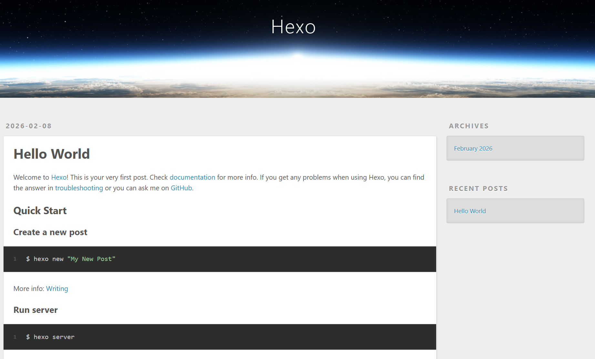
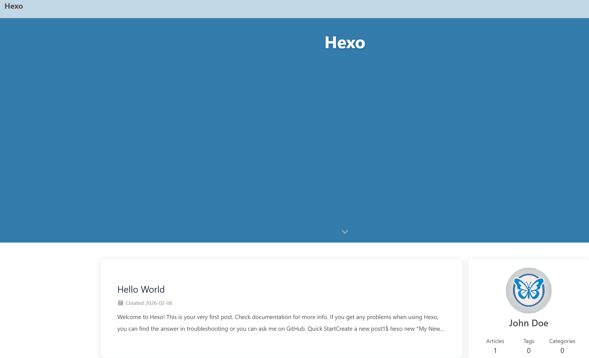
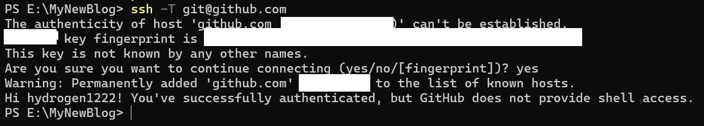
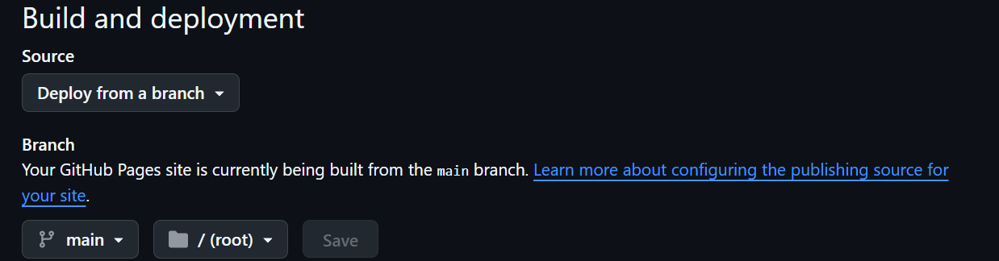

今天对博客大改造一下，一是域名到期了，阿里云的`xyz`域名续费一年109 ￥，去隔壁腾讯看了一下三年的顶级域名`com.cn`也才一百出头，故索性把域名更换了，二是之前用的主题不太习惯，也停更很久了，三是想弄一个游客向的评论系统，于是有了本篇文档。记录一下，免得以后忘记。

操作系统为`Windows 11 25H2`，An ab-initio construction😄~
## 安装Node.js
在Windows平台，通过取得`管理员权限`的`PowerShell`进行安装，首先允许执行脚本：
```
set-executionpolicy remotesigned
```
然后安装包管理工具`Chocolatey`，执行：
```
powershell -c "irm https://community.chocolatey.org/install.ps1|iex"
```
接着安装`Node.js`：
```
choco install nodejs --version="24.13.0"
```
再新开一个终端应该就能看到输出：
```
node -v # Should print "v24.13.0".
```
```
npm -v # Should print "11.6.2".
```
## 安装hexo框架
新建一个目录，安装`hexo-cli`：
```
npm install hexo-cli -g
```
然后初始化：
```
hexo init
```
现在运行`hexo -v`应该能看到`hexo`和`hexo-cli`：
```
PS E:\MyNewBlog> hexo init
INFO  Cloning hexo-starter https://github.com/hexojs/hexo-starter.git
INFO  Install dependencies
INFO  Start blogging with Hexo!
PS E:\MyNewBlog> hexo -v
INFO  Validating config
hexo: 8.1.1
hexo-cli: 4.3.2
os: win32 10.0.26200 undefined
node: 24.13.0
acorn: 8.15.0
ada: 3.3.0
amaro: 1.1.5
ares: 1.34.6
brotli: 1.1.0
cjs_module_lexer: 2.1.0
cldr: 47.0
icu: 77.1
llhttp: 9.3.0
modules: 137
napi: 10
nbytes: 0.1.1
ncrypto: 0.0.1
nghttp2: 1.67.1
openssl: 3.5.4
simdjson: 4.1.0
simdutf: 6.4.0
sqlite: 3.50.4
tz: 2025b
undici: 7.18.2
unicode: 16.0
uv: 1.51.0
uvwasi: 0.0.23
v8: 13.6.233.17-node.37
zlib: 1.3.1-470d3a2
zstd: 1.5.7
```
启动测试一下：
```
hexo s
```
应该能正常访问`http://localhost:4000/`，并看到页面：


## 安装主题
默认的主题是`landscape`有些简陋，我这边安装的是蝴蝶🦋主题：
```
npm install hexo-theme-butterfly hexo-renderer-pug hexo-renderer-stylus --save
```
复制一份主题的配置文件到根目录：
```
Copy-Item node_modules/hexo-theme-butterfly/_config.yml _config.butterfly.yml
```
然后编辑根目录下的配置文件`_config.yml`将主题修改一下，修改后默认的蝴蝶主题界面如下：

## 更换渲染引擎
写文档的时候难免会遇到一些数学公式，hexo默认的引擎对数学公式支持很差，我们需要把它换掉：
```
npm uninstall hexo-renderer-marked
```
安装新的引擎：
```
npm install hexo-renderer-markdown-it markdown-it-mathjax3 markdown-it-emoji markdown-it-container --save
```
我做笔记、写文档用的是`obsidian`，其中图片的保存依赖于第三方插件`custom attachment location`，在插件中设置新附件的存放位置为：
```
./${noteFileName}
```
在obsidian的`文件与链接`中设置内部链接类型为：`基于当前笔记的相对路径`，设置`始终更新内部链接`，关闭`使用wiki链接`，这样，新粘贴的图片就会被保存在当前`.md`文档下同名的目录中


还需要安装一个插件，这个作用我忘记了😢：
```powershell
npm install hexo-image-link --save**
```

我有个记笔记的习惯用法就是等号高亮，比如：==高亮文本==；星号斜体，比如：*斜体文本*，但这并不是标准的`markdown语法`而是扩展语法，需要安装`markdown-it-mark插件`：
```powershell
npm install markdown-it-mark --save
```
最后配置文件`_config.yml`的部分内容如下：
```yaml
# Extensions
## Plugins: https://hexo.io/plugins/
## Themes: https://hexo.io/themes/
theme: butterfly

# Deployment
## Docs: https://hexo.io/docs/one-command-deployment
deploy:
  type: ''
# Markdown renderer configuration
markdown:
  render:
    html: true
    xhtmlOut: false
    breaks: true
    linkify: true
    typographer: true
    quotes: '“”‘’'

  plugins:
    - markdown-it-mathjax3
    - markdown-it-emoji
    - markdown-it-container
    - markdown-it-mark

  anchors:
    level: 2
    collisionSuffix: ''
    permalink: true
    permalinkClass: header-anchor
    permalinkSymbol: '¶'

# Image link check
image_link:
  check_image: true
```

## 推送到网页
博客依赖于`github`，当然由于`github`服务器在国外，所以也不用备案。首先新建一个`public`（即公开）仓库，命名为`XXX.github.io`
hexo需要一个专门的插件才能把网页推送到 Git 仓库：
```powershell
npm install hexo-deployer-git --save
```
然后修改`_config.yml`配置文件中的`deploy`部分：
```yaml
deploy:
  type: git
  repo: git@github.com:XXX/XXX.github.io.git
  branch: main
```
为了让`Windows`有权限上传文件到 GitHub，我们需要生成一把钥匙（如果提示输入文件名，可按回车跳过；如果提示输入密码，可按回车跳过）：
```powershell
ssh-keygen -t rsa -C email_address
```
接着获取公钥内容，它是以 ssh-rsa 开头的一长串：
```powershell
Get-Content ~/.ssh/id_rsa.pub
```
然后到GitHub的设置中的`SSH and GPG keys`，添加新的`SSH`密钥，即复制刚刚获取的内容，接着验证：
```powershell
ssh -T git@github.com
```
看到 "Hi XXX..." 就说明连上了！

然后执行：
```powershell
git config --global user.email "email_address"
```

```powershell
git config --global user.name "username"
```
当前应当能正常发布内容到GitHub：
```powershell
hexo clean
hexo g
hexo d
```
接着在`仓库页面`的设置里面，找到`Pages`，`Build and deployment`来源选择`Deploy from a branch`，如图设置：


现在您访问`https://github_username.github.io/`应当能看见博客页面，比如我的博客源地址是：http://hydrogen1222.com.cn/
## 绑定域名
如您所见，您当前访问的网址可能是`http://hydrogen1222.com.cn/`而不是GitHub相关的网址，这是因为前者域名给重定向到了GitHub上。
在根目录下的`source`目录里面新建一个名为`CNAME`的无后缀文件，内容为：
```txt
hydrogen1222.com.cn
```
接下来在域名控制台DNSPod（我在腾讯家买的域名）给域名添加两条记录：
- 主机记录：**@和www
- 记录类型：**CNAME
- 记录值：**XXX.github.io

在`仓库设置`的`Page`页面的`Custom domain`选项里填写`hydrogen1222.com.cn`即可生效。

## Twikoo 评论系统
- **优点：** 支持匿名（填昵称就行）、支持表情包、后台管理方便、完全免费、支持你的 Butterfly 主题。
    
- **原理：** 用免费的 MongoDB（存数据）+ Vercel（运行程序）。
### 申请免费数据库 (MongoDB)

- 注册
- 登录，选择免费套餐，我选择的是亚马逊提供商、中国香港特别行政区
这样会创建一个免费的`cluster`，点击`connect-driver`，如图拿到链接就好：

接着使用Twikooo，根据教程来就好了
https://twikoo.js.org/backend.html#vercel-%E9%83%A8%E7%BD%B2

在Vercel的仓库中再添加一个domain，输入`comments.hydrogen1222.com.cn`

记得再添加一条解析记录将`cname.vercel-dns.com`解析到`comments.hydrogen1222.com.cn`加快访问速度。

编辑蝴蝶主题的配置文件，将`comment`改成twikoo，添加`envId`

然后清理、重新编译，再发布就大功告成了。


## 一些美化调整

- 开启`butterfly`的简繁转换功能，默认简体字
- `_config.yml`配置文件中设置语言为`zh_CN`
中文字体使用`落霞文楷`，使用在线CDN的方式引入，在蝴蝶主题配置文件中，将`inject`部分改为：
```yaml
inject:
  head:
    # 引入落霞文楷 (Screen版本，适合屏幕阅读)
    - <link rel="stylesheet" href="https://cdn.jsdelivr.net/npm/lxgw-wenkai-screen-webfont@1.1.0/style.css" />
  bottom:
```
再添加css样式，新建一个文件`source/css/my-font.css`
```yaml
/* 引入落霞文楷字体 */
@import url('https://cdn.jsdelivr.net/npm/lxgw-wenkai-screen-webfont@1.1.0/style.css');

/* 强制覆盖字体设置 */
/* 这里的顺序很重要：Times New Roman (英文) -> 落霞文楷 (中文) -> 系统默认 */
body, 
#article-container, 
h1, h2, h3, h4, h5, h6,
.code-block, 
#footer {
    font-family: "Times New Roman", "LXGW WenKai Screen", sans-serif !important;
}
```
然后在蝴蝶主题配置文件的`inject`中添加：
```yaml
- <link rel="stylesheet" href="/css/my-font.css" />
```
- 磨砂玻璃特效、深色模式适配、背景图固定、滚动条美化
修改后的CSS如下：
```yaml
/* =========================================================
   1. 字体引入（落霞文楷）
   ========================================================= */
@import url('https://cdn.jsdelivr.net/npm/lxgw-wenkai-screen-webfont@1.1.0/style.css');


/* =========================================================
   2. 全局字体设置（英文优先 + 中文补充）
   ========================================================= */
body,
#article-container,
h1, h2, h3, h4, h5, h6,
.code-block,
#footer,
#nav,
#aside-content {
  font-family: "Times New Roman", "LXGW WenKai Screen", sans-serif !important;
}


/* =========================================================
   3. 磨砂玻璃卡片效果（亮色模式）
   ========================================================= */
#aside-content .card-widget,
#recent-posts > .recent-post-item,
.layout > .recent-posts .pagination > *,
.layout > div:first-child:not(.recent-posts) {
  background: rgba(255, 255, 255, 0.9) !important;
  backdrop-filter: blur(10px);
  -webkit-backdrop-filter: blur(10px);
  box-shadow: 0 4px 12px rgba(0, 0, 0, 0.1);
  border: 1px solid rgba(255, 255, 255, 0.3);
  border-radius: 12px;
}


/* =========================================================
   4. 深色模式适配（磨砂玻璃）
   ========================================================= */
[data-theme="dark"] #aside-content .card-widget,
[data-theme="dark"] #recent-posts > .recent-post-item,
[data-theme="dark"] .layout > .recent-posts .pagination > *,
[data-theme="dark"] .layout > div:first-child:not(.recent-posts) {
  background: rgba(0, 0, 0, 0.8) !important;
  border: 1px solid rgba(255, 255, 255, 0.05);
}


/* =========================================================
   5. 背景图固定（增强沉浸感）
   ========================================================= */
body {
  background-attachment: fixed !important;
  background-position: center !important;
  background-size: cover !important;
}


/* =========================================================
   6. 滚动条美化（WebKit 内核）
   ========================================================= */
::-webkit-scrollbar {
  width: 8px;
  height: 8px;
}

::-webkit-scrollbar-track {
  background: rgba(255, 255, 255, 0.1);
  border-radius: 4px;
}

::-webkit-scrollbar-thumb {
  background: #49b1f5;
  border-radius: 4px;
}

::-webkit-scrollbar-thumb:hover {
  background: #ff7242;
}
```

剩下的一堆美化操作看官方的文档吧~
## 为文章添加封面图片
对于我的图片存放形式，可以直接在`front-matter`写：
```markdown
cover: cover.png
```
由于我之前用的其他主题，没有添加封面，而现在给每篇文章添加封面有些小麻烦，所以让`Cluade`写了个小脚本，脚本会将有图片的文章的第一张图片cover.xxx复制到目录内并自动编辑`front-matter`，有`dry run`干运行模式，内容如下：
```js
/**
 * 自动为文章添加封面 - 改进版
 * 支持不同换行符和格式
 */

const fs = require('fs');
const path = require('path');

// 配置
const CONFIG = {
  postsDir: './source/_posts',
  defaultCover: 'https://s2.loli.net/2026/02/08/OVHtWmMC7B48PeK.jpg',
  dryRun: false,  // true=仅预览, false=实际执行
};

// 解析 Front-matter（更宽容的版本）
function parseFrontMatter(content) {
  // 移除可能的 BOM
  content = content.replace(/^\uFEFF/, '');
  
  // 统一换行符为 \n
  content = content.replace(/\r\n/g, '\n');
  
  // 匹配 Front-matter（允许开头有空白）
  const match = content.match(/^[\s]*---\n([\s\S]*?)\n---\n([\s\S]*)$/);
  
  if (!match) return null;
  
  return {
    frontMatter: match[1],
    body: match[2],
    raw: content
  };
}

// 提取第一张图片路径
function extractFirstImage(content) {
  const imgMatch = content.match(/!\[.*?\]\((.*?\.(?:png|jpg|jpeg|gif|webp|svg))\)/i);
  return imgMatch ? imgMatch[1] : null;
}

// 更新或添加 Front-matter 中的 cover 字段
function updateCoverInFrontMatter(frontMatter, coverValue) {
  const lines = frontMatter.split('\n');
  let coverFound = false;
  
  const updatedLines = lines.map(line => {
    if (line.trim().startsWith('cover:')) {
      coverFound = true;
      return `cover: ${coverValue}`;
    }
    return line;
  });
  
  if (!coverFound) {
    updatedLines.push(`cover: ${coverValue}`);
  }
  
  return updatedLines.join('\n');
}

// 处理单个文件
function processFile(filePath) {
  const content = fs.readFileSync(filePath, 'utf-8');
  const parsed = parseFrontMatter(content);
  
  if (!parsed) {
    console.log(`⚠️  跳过（无 Front-matter）: ${path.basename(filePath)}`);
    // 显示文件前50个字符，帮助调试
    console.log(`   文件开头: ${content.substring(0, 50).replace(/\n/g, '\\n')}`);
    return;
  }
  
  const fileName = path.basename(filePath, '.md');
  const fileDir = path.dirname(filePath);
  const assetDir = path.join(fileDir, fileName);
  
  // 提取第一张图片
  const firstImage = extractFirstImage(parsed.body);
  
  let coverValue = null;
  
  if (firstImage && !firstImage.startsWith('http')) {
    // 解析图片路径（可能是相对路径或 URL 编码的）
    let imagePath = firstImage;
    
    // 如果路径包含文件夹名，尝试去掉（因为图片可能在同名文件夹里）
    if (imagePath.includes('/')) {
      imagePath = imagePath.split('/').pop(); // 只取文件名
    }
    
    // 尝试多个可能的路径
    const possiblePaths = [
      path.join(fileDir, firstImage),           // 原始相对路径
      path.join(assetDir, imagePath),           // 同名文件夹里
      path.join(fileDir, decodeURIComponent(firstImage)), // URL 解码
    ];
    
    let sourceImagePath = null;
    for (let p of possiblePaths) {
      if (fs.existsSync(p)) {
        sourceImagePath = p;
        break;
      }
    }
    
    if (sourceImagePath) {
      // 确保资源文件夹存在
      if (!fs.existsSync(assetDir)) {
        if (!CONFIG.dryRun) {
          fs.mkdirSync(assetDir, { recursive: true });
        }
      }
      
      // 复制为 cover
      const imageExt = path.extname(sourceImagePath);
      const coverFilePath = path.join(assetDir, `cover${imageExt}`);
      
      if (!CONFIG.dryRun) {
        fs.copyFileSync(sourceImagePath, coverFilePath);
      }
      
      coverValue = `cover${imageExt}`;
      console.log(`✓ 复制封面: ${path.basename(filePath)}`);
      console.log(`  ${firstImage} → ${coverValue}`);
    } else {
      console.log(`⚠️  图片不存在: ${firstImage}`);
      console.log(`   尝试过的路径:`);
      possiblePaths.forEach(p => console.log(`   - ${p}`));
    }
  }
  
  // 如果没有找到图片，使用默认封面
  if (!coverValue) {
    coverValue = CONFIG.defaultCover;
    console.log(`✓ 使用默认封面: ${path.basename(filePath)}`);
  }
  
  // 更新 Front-matter（保持原有换行符）
  const newFrontMatter = updateCoverInFrontMatter(parsed.frontMatter, coverValue);
  const newContent = `---\n${newFrontMatter}\n---\n${parsed.body}`;
  
  if (!CONFIG.dryRun) {
    fs.writeFileSync(filePath, newContent, 'utf-8');
  }
}

// 递归遍历目录
function processDirectory(dir) {
  const items = fs.readdirSync(dir);
  
  items.forEach(item => {
    const fullPath = path.join(dir, item);
    const stat = fs.statSync(fullPath);
    
    if (stat.isDirectory()) {
      processDirectory(fullPath);
    } else if (item.endsWith('.md')) {
      processFile(fullPath);
    }
  });
}

// 主程序
console.log('========================================');
console.log('自动添加封面脚本');
console.log(`模式: ${CONFIG.dryRun ? '预览模式（不会实际修改文件）' : '执行模式'}`);
console.log('========================================\n');

processDirectory(CONFIG.postsDir);

console.log('\n========================================');
console.log('完成！');
if (CONFIG.dryRun) {
  console.log('这是预览模式，文件未被修改。');
  console.log('如需实际执行，请将脚本中 dryRun 改为 false');
}
console.log('========================================');
```
执行`node xxx.js`即可