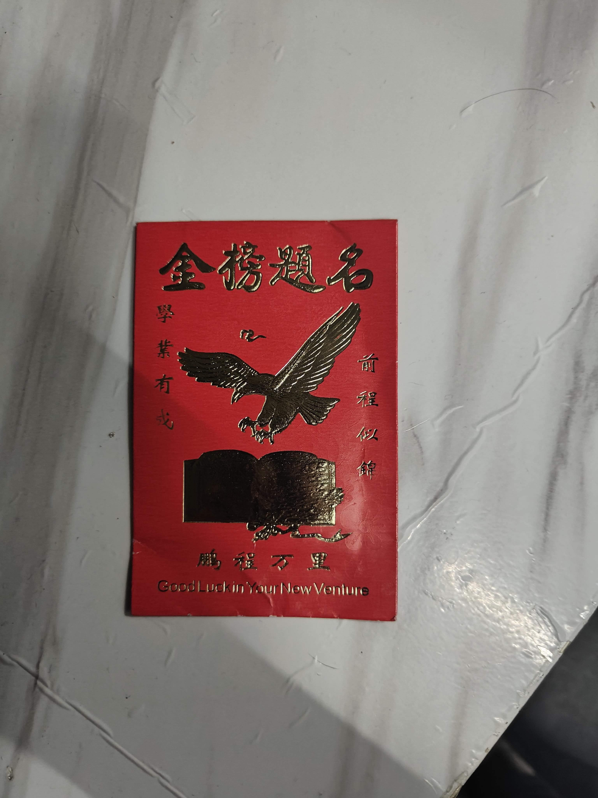
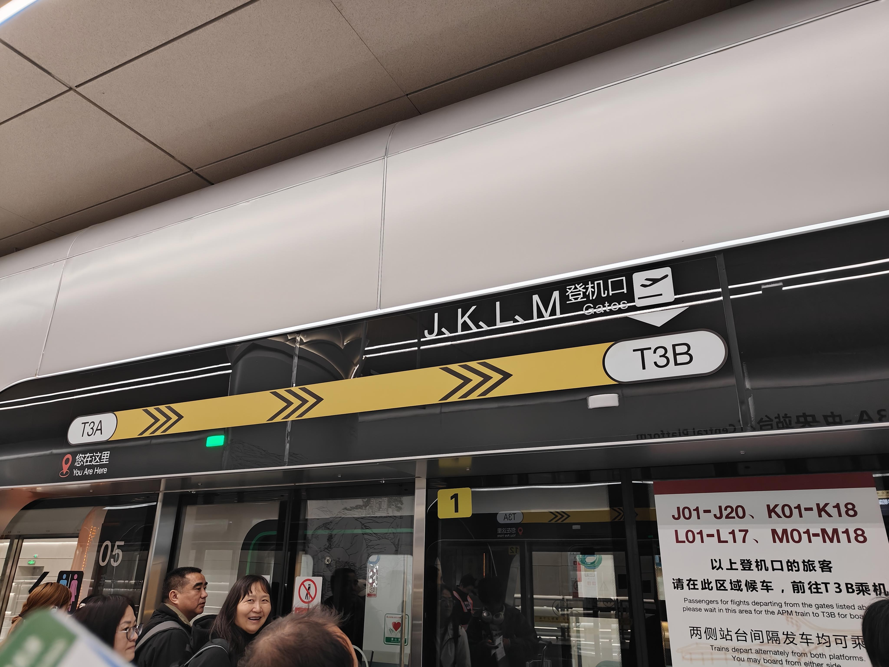
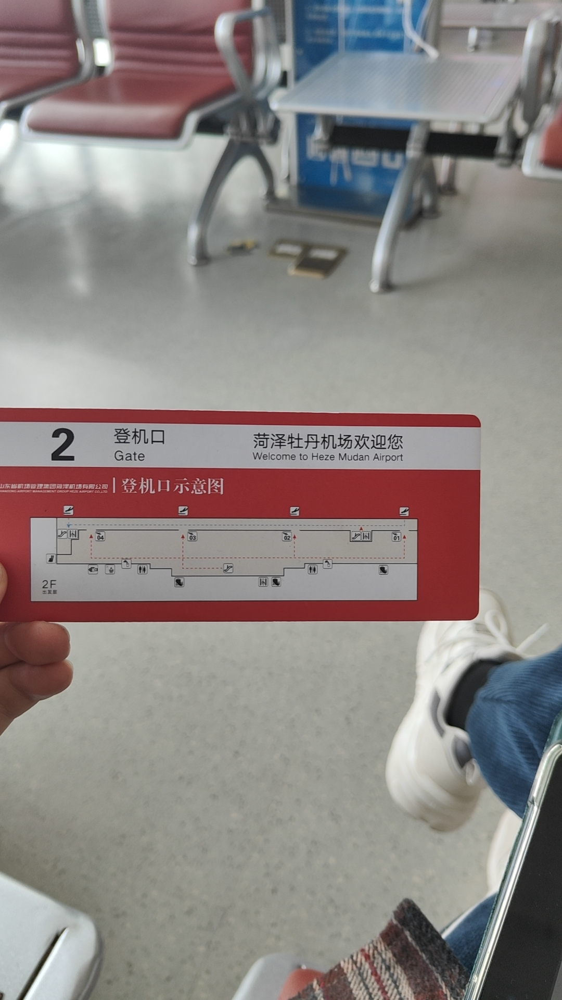

好久不见~，喜庆之城！

20日下午马不停蹄地赶往重庆，飞机上一刻也不敢耽搁，做了一下政治常识和重庆市情的题，看看金标尺的回放，在历经5 hour+后终于落地，倒也不觉得疲惫反而有些兴奋（指吃了两顿灰机餐🤔），随后便是赶往黑灯瞎火的酒店，隔音之差令人寒心😂，旁边的住客吵个不停，早知道定旁边的维也纳的。晚上简单总结复盘了一下，洗了个澡就睡觉了。

早上吃了点早餐后就赶往外事外语学院考试咯，人还蛮多的，一边走进考场一边看着小红书，略有些兴奋，不由自主地加快脚步。说不紧张是假的，毕竟昨晚只睡了五个半小时左右，但在开考后的那一刻，大脑的些微晕涨变转化成了沉着与自信😎😎😎。行测部分改变了做题顺序，但由于没有及时发现各题型数量的变化，时间被极其不合理地分配了，导致最后常识部分和言语理解时间过于仓促甚至言语最后五道题是纯蒙的；申论部分倒是中规中矩，大作文希望立意不要跑偏吧。做起来感觉还行，难度一般，但最后还是留下了遗憾🤧。

考完校门外的场景格外热闹，收到了熙正的红包😺，这个机构好像是第一次听说，金标尺好像还有彩票刮🥳

简单吃了一碗老麻抄手之后就又马不停蹄赶往机场咯~第一次做浙江长龙航空的，MD分到J登机口还得跑到T3B去，空客的座椅倒是比波音宽敞，不过重庆to长春的飞机好像都是窄体机，五十步笑百步罢了。

伴随遗憾，旅途落下帷幕，完结撒花咯~🌷🌷🌷

我们曾如此渴望命运的波澜，到最后才发现，人生最曼妙的风景是内心的淡定与从容。

山水之城，美丽之地，你我缘分未尽，如果有机会的话，我们还会再相见的~

                                                                               `Storm`
    								`2026.03.21，江北T3B航站楼`