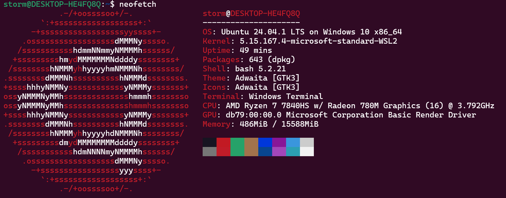

==请参考VASP官方wiki中关于编译工具链的介绍部分（本次编译工具链比wiki更新一些，未报错）：https://www.vasp.at/wiki/Toolchains==


# 2025年4月AMD平台下VASP的编译安装

## WSL2安装

本次安装选择的Ubuntu作为发行版，使用人数较多，解决方案较多



更新源

```bash
sudo apt update
```

## 安装编译器

### AOCC

下载aocc-compiler-5.0.0.tar，解压

```bash
tar -xvf aocc-compiler-5.0.0.tar #解压
cd aocc-compiler-3.2.0 #进入目录
install.sh #如果没有可执行权限请赋予可执行权限, chmod +x install.sh
source .setenv_AOCC.sh #这一行可以写入~/.bashrc，然后source ~/.bashrc，刷新一下环境变量
```

### AOCL

下载AOCL 5.0 binary packages compiled with AOCC 5.0

```bash
tar -zxvf XXX.tar.gz #解压tar.gz包，如果报错请查询Linux下的解压命令，up记不太清了、、、  
cd XXX
install.sh -t /home/XXX #安装，可以指定安装目录，up安装在/home目录下的某个文件夹里的，这样不需要管理员权限、
```

## 安装OpenMPI

在安装OpenMPI之前请确保AOCC、AOCL以及必备的依赖已安装完全

```bash
which clang #检查clang
which clang++ #检查clang++
which flang #检查flang
以上三个来自于AOCC和AOCL
which c #检查有没有C
which c++ #检查有没有C++
sudo apt install g++
sudo apt install gcc
```

下载OpenMPI的稳定版本，然后解压，进入目录

```bash
./configure CC=clang CXX=clang++ FC=flang --prefix=/xxxx #可以手动指定/xxx目录
make -j4 #以4核心编译，大小可调，比如16核处理器就改成make -j16
make install #编译安装
```

OpenMPI安装时报错很可能是由于依赖问题造成的，建议安装之前`sudo apt install g++ cmake gcc`

在`~/.bashrc`中添加环境变量

```bash
MPI_HOME=/xxx/ #这一步容易出错，记得添加对目录
export PATH=${MPI_HOME}/bin:$PATH
export LD_LIBRARY_PATH=${MPI_HOME}/lib:$LD_LIBRARY_PATH
export MANPATH=${MPI_HOME}/share/man:$MANPATH
```

安装完后检查一下`which mpirun`

## 编译VASP

不提供源码包，可以尝试去各种论坛，微信公众号搜索，仅供学习使用

本次使用的源码包是vasp.6.4.2.tgz

编译之前首先要选择模板，也就是makefile.include，将/vasp.x.x.x/arch文件夹下的`makefile.include.aocc_ompi_aocl`复制一份到/vasp.x.x.x根目录，因为本次平台是AMD ZEN4，安装了AOCC，AOCL和OpenMPI，所以选择此模板，接下来修改模板

```bash
# Default precompiler options
CPP_OPTIONS = -DHOST=\"LinuxGNU\" \
              -DMPI -DMPI_BLOCK=8000 -Duse_collective \
              -DscaLAPACK \
              -DCACHE_SIZE=4000 \
              -Davoidalloc \
              -Dvasp6 \
              -Duse_bse_te \
              -Dtbdyn \
              -Dfock_dblbuf

CPP         = flang -E -ffree-form -C -w $*$(FUFFIX) >$*$(SUFFIX) $(CPP_OPTIONS)

FC          = mpif90
FCL         = mpif90

FREE        = -ffree-form -ffree-line-length-none

FFLAGS      = -w -fno-fortran-main -Mbackslash

OFLAG       = -O2
OFLAG_IN    = $(OFLAG)
DEBUG       = -O0

OBJECTS     = fftmpiw.o fftmpi_map.o fftw3d.o fft3dlib.o
OBJECTS_O1 += fftw3d.o fftmpi.o fftmpiw.o
OBJECTS_O2 += fft3dlib.o

# For what used to be vasp.5.lib
CPP_LIB     = $(CPP)
FC_LIB      = $(FC)
CC_LIB      = clang
CFLAGS_LIB  = -O
FFLAGS_LIB  = -O1
FREE_LIB    = $(FREE)

OBJECTS_LIB = linpack_double.o

# For the parser library
CXX_PARS    = clang++
LLIBS       = -lstdc++

##
## Customize as of this point! Of course you may change the preceding
## part of this file as well if you like, but it should rarely be
## necessary ...
##

# When compiling on the target machine itself, change this to the
# relevant target when cross-compiling for another architecture
VASP_TARGET_CPU ?= -march=znver4 #7840HS belongs to ZEN4 platform
FFLAGS     += $(VASP_TARGET_CPU)

# BLAS (mandatory)
AMDBLIS_ROOT ?= /home/storm/AOCL_INSTALL/5.0.0/aocc #Installation category of AOCL
BLAS        = -L${AMDBLIS_ROOT}/lib -lblis

# LAPACK (mandatory)
AMDLIBFLAME_ROOT ?= /home/storm/AOCL_INSTALL/5.0.0/aocc #Installation category of AOCL
LAPACK      = -L${AMDLIBFLAME_ROOT}/lib -lflame

# scaLAPACK (mandatory)
AMDSCALAPACK_ROOT ?= /home/storm/AOCL_INSTALL/5.0.0/aocc #Installation category of AOCL
SCALAPACK   = -L${AMDSCALAPACK_ROOT}/lib -lscalapack

LLIBS      += $(SCALAPACK) $(LAPACK) $(BLAS)

# FFTW (mandatory)
AMDFFTW_ROOT  ?= /home/storm/AOCL_INSTALL/5.0.0/aocc #Installation category of AOCL
LLIBS      += -L$(AMDFFTW_ROOT)/lib -lfftw3
INCS       += -I$(AMDFFTW_ROOT)/include

# HDF5-support (optional but strongly recommended)
#CPP_OPTIONS+= -DVASP_HDF5
#HDF5_ROOT  ?= /path/to/your/hdf5/installation
#LLIBS      += -L$(HDF5_ROOT)/lib -lhdf5_fortran
#INCS       += -I$(HDF5_ROOT)/include

# For the VASP-2-Wannier90 interface (optional)
#CPP_OPTIONS    += -DVASP2WANNIER90
#WANNIER90_ROOT ?= /path/to/your/wannier90/installation
#LLIBS          += -L$(WANNIER90_ROOT)/lib -lwannier
```

然后运行`make all`即可，官网给的命令是并行安装`make DEPS=1 -Jn <target>`，我自己尝试并行安装后测试`make test`会报错，所以`make all`，这样去测试全部通过不报错

## 测试安装

为了测试是否正确安装，可以进行测试

```bash
make test
```


## 添加到环境变量

官方提供的是源码包，通过编译，我们得到了CPU可执行的二进制包，再二进制包的目录下(bin/目录下)，我可以同在终端中直接输入二进制包的名字来直接执行(VASP编译会产生三个二进制包：vasp_std, vasp_gam, vasp_ncl)，比如在bin/目录下直接输入vasp_std就可以看到VASP的标志，但是为了随时随地在任意目录下也能执行计算，因此需要将bin/目录添加到环境变量里(前提是make test不报错)

```bash
export PATH=$PATH:/path/to/vasp.x.x.x/bin
source ~/.bashrc
```

