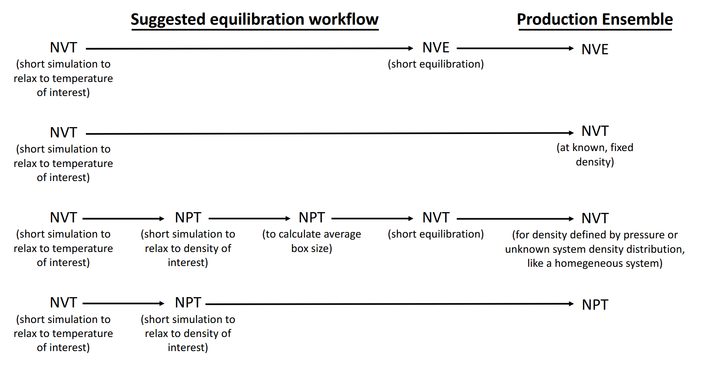
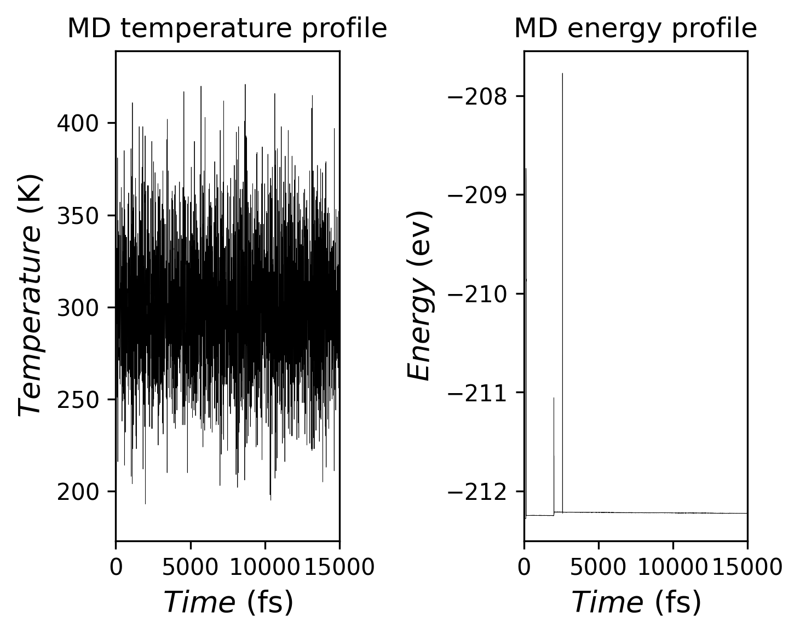
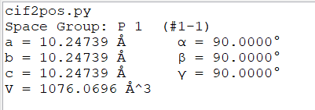

使用`VASP`计算离子电导率，需要进行从头算分子动力学(AIMD)模拟，对象为$\rm Li_6PS_5Cl$ Li-Argyrodite型硫化物固态电解质。

# 收敛性测试

在进行昂贵的AIMD模拟之前需要进行收敛性测试，测试最优的`ENCUT`、k点等参数。如果设置太小则有失精度，设置太大又增加成本，收敛性测试的脚本网上应该能找到，我之前用`Claude`写了一个，发到了公社论坛上面：http://bbs.keinsci.com/thread-55151-1-1.html

# 变胞优化

一个能量较低、结构合理的起始三维构型是进行MD模拟的第一步，本次模拟使用变胞优化后的惯用晶胞进行。

# AIMD

分子动力学模拟的基本步骤如下图：



这次的AIMD跑的很短，总共30ps(30000fs)，15000步，即每步2fs(POTIM = 2)。在30ps长的AIMD的模拟中，最初的一段时间体系并未达到平衡，因而需要舍弃，真正的AIMD有效数据此时间段向后截取。

以下是本次AIMD的`INCAR`:

```INCAR
Global Parameters
ISTART =  1            (Read existing wavefunction, if there)
ISPIN  =  1            (Non-Spin polarised DFT)
# ICHARG =  11         (Non-self-consistent: GGA/LDA band structures)
LREAL  = .FALSE.       (Projection operators: automatic)
ENCUT  =  510        (Cut-off energy for plane wave basis set, in eV)
# PREC   =  Accurate   (Precision level: Normal or Accurate, set Accurate when perform structure lattice relaxation calculation)
#LWAVE  = .TRUE.        (Write WAVECAR or not)
#LCHARG = .TRUE.        (Write CHGCAR or not)
ADDGRID= .TRUE.        (Increase grid, helps GGA convergence)
LASPH  = .TRUE.        (Give more accurate total energies and band structure calculations)
PREC   = Normal      (Accurate strictly avoids any aliasing or wrap around errors)
# LVTOT  = .TRUE.      (Write total electrostatic potential into LOCPOT or not)
# LVHAR  = .TRUE.      (Write ionic + Hartree electrostatic potential into LOCPOT or not)
# NELECT =             (No. of electrons: charged cells, be careful)
# LPLANE = .TRUE.      (Real space distribution, supercells)
# NWRITE = 2           (Medium-level output)
# KPAR   = 2           (Divides k-grid into separate groups)
# NGXF    = 300        (FFT grid mesh density for nice charge/potential plots)
# NGYF    = 300        (FFT grid mesh density for nice charge/potential plots)
# NGZF    = 300        (FFT grid mesh density for nice charge/potential plots)

Electronic Relaxation
ISMEAR =  0
SIGMA  =  0.05
EDIFF  =  1E-06
ALGO = VeryFast
Molecular Dynamics
IBRION =  0            (Activate MD)
NSW    =  15000          (Max ionic steps)
EDIFFG = -1E-02        (Ionic convergence, eV/A)
POTIM  =  2            (Timestep in fs)
SMASS  =  0.12            (MD Algorithm: -3-microcanonical ensemble, 0-canonical ensemble)
TEBEG  =  300     (Start temperature K)
TEEND  =  300     (Final temperature K)
MDALGO =  2          (Thermostat)
ISYM   =  0          (Switch symmetry off)
NWRITE =  0            (For long MD-runs use NWRITE=0 or NWRITE=1)
KPAR = 2
NCORE = 20
```

BTW，这里的`SMASS`参数可以设置0。我先进行了2000fs左右的预模拟，如下：

```bash
[ctan@baifq-hpc141 SMASS]$ grep SMASS OUTCAR
   SMASS = 0            (MD Algorithm: -3-microcanonical ensemble, 0-canonical ensemble)
   SMASS  =   0.12    Nose mass-parameter (am)
```

`OUTCAR`中给出的`SMASS`值是0.12，设置为0也可以。

简单介绍一下其他参数：

- `MDALGO`设置为2，可以控制使用Nose-Hoover热浴
- `TEBEG`初始温度
- `TEEND`终止温度
- `IBRION`设置为-1启用分子动力学模拟

接着就开始漫长的模拟吧，大概模拟了八天左右：

```bash
[ctan@baifq-hpc141 pre-pro]$ tail OUTCAR
                            User time (sec):   854845.149
                          System time (sec):    17398.447
                         Elapsed time (sec):   882414.331

                   Maximum memory used (kb):      464952.
                   Average memory used (kb):          N/A

                          Minor page faults:      1437354
                          Major page faults:          688
                 Voluntary context switches:         9709
```

# AIMD后处理

本次模拟的目的主要是为了得到离子电导率，模拟结束之后可以使用`vaspkit`方便地计算扩散系数，否则可能需要使用`pymatgen`自己编写代码。

首先使用下面的代码查看体系在合适趋于平衡，来自github上的一个老师，仓库地址是https://github.com/tamaswells/XDATCAR_toolkit

```python
#!/bin/python
# -*- coding:utf-8 -*-
#Convert XDATCAR to PDB and extract energy & temperature profile for AIMD simulations
# -h for help;-b for frame started;-e for frame ended;;-p for PDB conversion  
#by nxu tamas@zju.edu.cn
#version 1.2
#date 2019.4.9

import os
import shutil
import numpy as np
import matplotlib as mpl
import math
mpl.use('Agg') #silent mode
from matplotlib import pyplot as plt
from optparse import OptionParser  
import sys
from copy import deepcopy

class debug(object):
    def __init__(self,info='debug'):
        self.info=info
    def __call__(self,func):
        def wrapper(*args,**kwargs):
            print('[{info}] Now entering function {function}.....' \
                .format(info=self.info,function=getattr(func,"__name__")))
            return func(*args,**kwargs)
        return wrapper

class Energy_Temp(object):
    def __init__(self):
        'Read vasp MD energies and temperature.'
        self.temp=[]
        self.energy=[]
        self.energy_extract()
            
    def energy_extract(self):
        print('Now reading vasp MD energies and temperature.')        
        if os.path.exists("OSZICAR"):
            oszicar=open("OSZICAR",'r')
            for index,line in enumerate(oszicar):
                if "E0=" in line:
                    self.temp.append(float(line.split()[2]))
                    self.energy.append(float(line.split()[4]))
            oszicar.close()
            #return (self.temp,self.energy)                         
        else:
            raise IOError('OSZICAR does not exist!')

class XDATCAR(Energy_Temp):
    def __init__(self):
        'Read lattice information and atomic coordinate.'
        super(XDATCAR,self).__init__()
        print('Now reading vasp XDATCAR.')       
        self.lattice=np.zeros((3,3))
        self.NPT=False
        self.frames=0
        self._timestep=1  # timestep 1fs
        self.alpha=0.0
        self.beta=0.0
        self.gamma=0.0
        self.current_frame=0
        
        self._lattice1=0.0
        self._lattice2=0.0
        self._lattice3=0.0
        self._lattice=np.zeros(3)
        self.format_trans=False

        @property 
        def timestep(self):
            return self._timestep
        @timestep.setter
        def timestep(self,new_time_step):
            self._timestep=new_time_step
            
        if os.path.exists("XDATCAR"):
            self.XDATCAR=open("XDATCAR",'r')
        else:
            raise IOError('XDATCAR does not exist!')
        title=self.XDATCAR.readline().strip()
        for index,line in enumerate(self.XDATCAR):
            if "Direct" in line:
                self.frames+=1
            # elif title in line:
            #     self.NPT=True
        self.XDATCAR.seek(0)
        self.lattice_read()
        self.XDATCAR.readline()
        for i in range(self.total_atom):
            self.XDATCAR.readline()

        if "Direct configuration" not in self.XDATCAR.readline():
        	self.NPT=True	
        #self.frames=len(['Direct' for line in self.XDATCAR if "Direct" in line])
        print('Total frames {0}, NpT is {1}'.format(self.frames,self.NPT))
        # assert len(self.energy)==self.frames, \
        #     'Number of XDATCAR frames does not equal to that of Energy terms in OSZICAR'   
        self.XDATCAR.seek(0)
        self.lowrange=0;self.uprange=self.frames-1
        if self.NPT == False: self.lattice_read()
        
    def step_select(self,selected_step): # 't>100ps and t < 1000ps'
        'eg. t > 100 and t < 1000'
        assert isinstance(selected_step,str),'Selected timestep must be in a "string"'
        if 'and' in selected_step:
            conditions=selected_step.split("and")
        else:
            conditions=[selected_step]
        for condition in conditions:
            try:
                if '>=' in condition:
                    ranges=int(condition.split('>=')[1].strip())
                    self.lowrange=ranges-1
                elif '<=' in condition:
                    ranges=int(condition.split('<=')[1].strip())
                    self.uprange=ranges-1
                elif '>' in condition:
                    ranges=int(condition.split('>')[1].strip())
                    self.lowrange=ranges
                elif '<' in condition:
                    ranges=int(condition.split('<')[1].strip())
                    self.uprange=ranges-2
                else:
                    print('Selected timestep is invaid!');continue
            except ValueError:
                print('Selected timestep is invaid!') 
                sys.exit(0)
            if (self.lowrange >= self.frames-1) or (self.uprange < 0):
                raise ValueError('Selected timestep is wrong!')
            if self.lowrange < 0: self.lowrange= 0
            if self.uprange > self.frames-1: self.uprange= self.frames-1          
                
    def lattice_read(self):    
        self.title=self.XDATCAR.readline().rstrip('\r\n').rstrip('\n')
        self.scaling_factor=float(self.XDATCAR.readline())
        for i in range(3):
            self.lattice[i]=np.array([float(j) for j in self.XDATCAR.readline().split()])
        self.lattice*=self.scaling_factor
        self._lattice1=np.sqrt(np.sum(np.square(self.lattice[0])))
        self._lattice2=np.sqrt(np.sum(np.square(self.lattice[1])))
        self._lattice3=np.sqrt(np.sum(np.square(self.lattice[2])))
        self._lattice[0]=self._lattice1
        self._lattice[1]=self._lattice2
        self._lattice[2]=self._lattice3
        self.alpha=math.acos(np.dot(self.lattice[1],self.lattice[2]) \
            /float((self._lattice2*self._lattice3)))/np.pi*180.0
        self.beta=math.acos(np.dot(self.lattice[0],self.lattice[2]) \
            /float((self._lattice1*self._lattice3)))/np.pi*180.0
        self.gamma=math.acos(np.dot(self.lattice[0],self.lattice[1]) \
            /float((self._lattice1*self._lattice2)))/np.pi*180.0
        self.element_list=[j for j in self.XDATCAR.readline().split()]
        try:
            self.element_amount=[int(j) for j in self.XDATCAR.readline().split()]
        except ValueError:
            raise ValueError('VASP 5.x XDATCAR is needed!')
        self.total_elements=[]
        for i in range(len(self.element_amount)):
            self.total_elements.extend([self.element_list[i]]*self.element_amount[i])
        #print(self.total_elements)
        self.total_atom=sum(self.element_amount)
        self.atomic_position=np.zeros((self.total_atom,3))

    def __iter__(self):
        return self

    def __next__(self):
        self.next()

    def skiplines_(self):
        if self.NPT == True: self.lattice_read() 
        self.XDATCAR.readline()
        for i in range(self.total_atom):
            self.XDATCAR.readline()

    def next(self):
        if self.NPT == True: self.lattice_read() 
        self.XDATCAR.readline()
        for i in range(self.total_atom):
            line_tmp=self.XDATCAR.readline()
            self.atomic_position[i]=np.array([float(j) for j in line_tmp.split()[0:3]])         
        self.cartesian_position=np.dot(self.atomic_position,self.lattice)
        self.current_frame+=1
        #
        #self.cartesian_position*=self.scaling_factor
        return self.cartesian_position

    def writepdb(self,pdb_frame):
        tobewriten=[]
        tobewriten.append("MODEL         %r" %(pdb_frame))
        tobewriten.append("REMARK   Converted from XDATCAR file")
        tobewriten.append("REMARK   Converted using VASPKIT")
        tobewriten.append('CRYST1{0:9.3f}{1:9.3f}{2:9.3f}{3:7.2f}{4:7.2f}{5:7.2f}' .format(self._lattice1,\
            self._lattice2,self._lattice3,self.alpha,self.beta,self.gamma))
        #print(len(self.total_elements))
        for i in range(len(self.total_elements)):
            tobewriten.append('%4s%7d%4s%5s%6d%4s%8.3f%8.3f%8.3f%6.2f%6.2f%12s' \
                %("ATOM",i+1,self.total_elements[i],"MOL",1,'    ',self.cartesian_position[i][0],\
                self.cartesian_position[i][1],self.cartesian_position[i][2],1.0,0.0,self.total_elements[i]))
        tobewriten.append('TER')
        tobewriten.append('ENDMDL')
        with open('XDATCAR.pdb','a+') as pdbwriter:
            tobewriten=[i+'\n' for i in tobewriten]
            pdbwriter.writelines(tobewriten)

    def unswrapPBC(self,prev_atomic_cartesian):
        diff= self.cartesian_position-prev_atomic_cartesian
        prev_atomic_cartesian=deepcopy(self.cartesian_position) 
        xx=np.where(diff[:,0]>(self._lattice1/2),diff[:,0]-self._lattice1\
            ,np.where(diff[:,0]<-(self._lattice1/2),diff[:,0]+self._lattice1\
                ,diff[:,0]))
        yy=np.where(diff[:,1]>(self._lattice2/2),diff[:,1]-self._lattice2\
            ,np.where(diff[:,1]<-(self._lattice2/2),diff[:,1]+self._lattice2\
                ,diff[:,1]))
        zz=np.where(diff[:,2]>(self._lattice3/2),diff[:,2]-self._lattice3\
            ,np.where(diff[:,2]<-(self._lattice3/2),diff[:,2]+self._lattice3\
                ,diff[:,2]))
        xx=xx.reshape(-1,1);yy=yy.reshape(-1,1);zz=zz.reshape(-1,1)
        return (prev_atomic_cartesian,np.concatenate([xx,yy,zz],axis=1))

    def reset_cartesian(self,real_atomic_cartesian,center_atom):
        if center_atom > len(real_atomic_cartesian)-1:
            raise SystemError("Selected atom does not exist!")
        for i in range(0,len(real_atomic_cartesian)):
            for j in range(3):
                if (real_atomic_cartesian[i][j]-real_atomic_cartesian[center_atom][j])>self._lattice[j]/2:
                    real_atomic_cartesian[i][j]-=self._lattice[j]
                if (real_atomic_cartesian[i][j]-real_atomic_cartesian[center_atom][j])<-self._lattice[j]/2:
                    real_atomic_cartesian[i][j]+=self._lattice[j]                
        return real_atomic_cartesian
                    
    def __call__(self,selected_step):
        self.step_select(selected_step)
    def __str__(self):
        return ('Read lattice information and atomic coordinate.')
    __repr__=__str__
    
class plot(object):
    'Plot MD temperature and energy profile'
    def __init__(self,lwd,font,dpi,figsize,XDATCAR_inst=None):
        self.XDATCAR_inst=XDATCAR_inst;self.timestep=self.XDATCAR_inst.timestep
        self.time_range=(self.XDATCAR_inst.lowrange,self.XDATCAR_inst.uprange+1)
        self.lwd=lwd;self.font=font;self.dpi=dpi;self.figsize=figsize

    #@debug(info='debug')
    def plotfigure(self,title='MD temperature and energy profile'):
        from matplotlib import pyplot as plt
        self.newtemp=self.XDATCAR_inst.temp;self.newenergy=self.XDATCAR_inst.energy
        xdata=np.arange(self.time_range[0],self.time_range[1])*self.timestep
        axe = plt.subplot(121)
        self.newtemp=self.newtemp[self.time_range[0]:self.time_range[1]]
        axe.plot(xdata,self.newtemp, \
                 color='black', lw=self.lwd, linestyle='-', alpha=1)
        with open("Temperature.dat",'w') as writer:
            writer.write("Time(fs)   Temperature(K)\n")
            for line in range(len(xdata)):
                writer.write("{0:f}  {1:f}\n" .format(xdata[line],self.newtemp[line]))
        axe.set_xlabel(r'$Time$ (fs)',fontdict=self.font)
        axe.set_ylabel(r'$Temperature$ (K)',fontdict=self.font)
        axe.set_xlim((self.time_range[0]*self.timestep, self.time_range[1]*self.timestep))
        axe.set_title('MD temperature profile')
        
        axe1 = plt.subplot(122)
        self.newenergy=self.newenergy[self.time_range[0]:self.time_range[1]]
        axe1.plot(xdata,self.newenergy, \
                 color='black', lw=self.lwd, linestyle='-', alpha=1)
        with open("Energy.dat",'w') as writer:
            writer.write("Time(fs)   Energy(ev)\n")
            for line in range(len(xdata)):
                writer.write("{0:f}  {1:f}\n" .format(xdata[line],self.newenergy[line]))        
        axe1.set_xlabel(r'$Time$ (fs)',fontdict=self.font)
        axe1.set_ylabel(r'$Energy$ (ev)',fontdict=self.font)
        axe1.set_xlim((self.time_range[0]*self.timestep, self.time_range[1]*self.timestep))
        axe1.set_title('MD energy profile')
        #plt.suptitle(title)
        fig = plt.gcf()
        fig.set_size_inches(self.figsize)
        plt.tight_layout() 
        plt.savefig('ENERGY.png',bbox_inches='tight',pad_inches=0.1,dpi=self.dpi)
        
        
if __name__ == "__main__":
    parser = OptionParser()  
    parser.add_option("-b", "--begin",  
                       dest="begin", default=1,  
                      help="frames begin") 

    parser.add_option("-e", "--end",  
                      dest="end", default='false',  
                      help="frames end") 

    parser.add_option("-t", "--timestep",  
                      dest="timestep", default=1.0,  
                      help="timestep per frame") 

    parser.add_option("-p", "--pdb",  
                      action="store_true", dest="format_trans", default=False,  
                      help="choose whether to convert XDATCAR to PDB!") 

    parser.add_option("--pbc",  
                      action="store_true", dest="periodic", default=False,  
                      help="choose whether to swrap PBC images!") 

    parser.add_option("-i", "--index", 
                      dest="index", default=-1,  
                      help="choose which atom to center whole molecule!") 

    parser.add_option("--interval", 
                      dest="interval", default=1,  
                      help="extract frames interval!") 

    (options,args) = parser.parse_args()
    try:
        float(options.timestep)
        int(options.index)
        _interval=int(options.interval)
        int(options.begin)
        if options.end != 'false': int(options.end)
    except:
        raise ValueError('wrong arguments')
    XDATCAR_inst=XDATCAR()
    XDATCAR_iter=iter(XDATCAR_inst)
    if options.format_trans:
        XDATCAR_inst.format_trans=True
        if os.path.exists("XDATCAR.pdb"):
            shutil.copyfile("XDATCAR.pdb","XDATCAR-bak.pdb")
            os.remove("XDATCAR.pdb")
    else:
        XDATCAR_inst.format_trans=False
    XDATCAR_inst.timestep=float(options.timestep)   #timestep 1fs
    if options.end == 'false':
        XDATCAR_inst('t>= %r' %(int(options.begin)))
    else:
        XDATCAR_inst('t>= %r and t <= %r' %(int(options.begin),int(options.end))) # frame 10~300  corresponding to 20~600fs
    if _interval >(XDATCAR_inst.uprange-XDATCAR_inst.lowrange):
        raise SystemError('Trajectory interval exceed selected time range!')
    elif _interval<=1:
        _interval=1
    count=0 
    current_pdb=1  
    for i in range(XDATCAR_inst.uprange+1): 
        if (i>=XDATCAR_inst.lowrange):
            cartesian_position=XDATCAR_iter.next()
            if count % _interval == 0:
                if options.format_trans == True: 
                    if options.periodic == True: 
                        if i == XDATCAR_inst.lowrange:
                            real_atomic_cartesian=deepcopy(cartesian_position)
                            if int(options.index) != -1:
                                real_atomic_cartesian=XDATCAR_inst.reset_cartesian(real_atomic_cartesian,int(options.index)-1)
                            XDATCAR_inst.cartesian_position=real_atomic_cartesian
                            prev_atomic_cartesian=deepcopy(cartesian_position)
                        else:
                            prev_atomic_cartesian,diffs=XDATCAR_inst.unswrapPBC(prev_atomic_cartesian)
                            real_atomic_cartesian+=diffs
                            XDATCAR_inst.cartesian_position=real_atomic_cartesian              
                    XDATCAR_inst.writepdb(current_pdb)
                    current_pdb+=1
            count+=1
        else:
            XDATCAR_iter.skiplines_()

    newtemp=XDATCAR_inst.temp
    newenergy=XDATCAR_inst.energy
    print('Finish reading XDATCAR.')

    timestep=XDATCAR_inst.timestep
    print('Selected time-range:{0}~{1}fs'.format((XDATCAR_inst.lowrange)*timestep,\
                        (XDATCAR_inst.uprange)*timestep))
    XDATCAR_inst.XDATCAR.close()
    print('Timestep for new PDB trajectory is :{0}fs'.format(timestep*_interval))  
    lwd = 0.2  # Control width of line
    dpi=300          # figure_resolution
    figsize=(5,4)   #figure_inches
    font = {'family' : 'arial', 
        'color'  : 'black',
        'weight' : 'normal',
        'size' : 13.0,
        }       #FONT_setup
    plots=plot(lwd,font,dpi,figsize,XDATCAR_inst)
    plots.plotfigure()
```

运行`python`程序：

```python
(base) [storm@X16 vaspkit]$ python 1.py
Now reading vasp MD energies and temperature.
Now reading vasp XDATCAR.
Total frames 15000, NpT is False
Finish reading XDATCAR.
Selected time-range:0.0~14999.0fs
Timestep for new PDB trajectory is :1.0fs
findfont: Font family 'arial' not found.
findfont: Font family ['arial'] not found. Falling back to DejaVu Sans.
findfont: Font family 'arial' not found.
findfont: Font family 'arial' not found.
findfont: Font family 'arial' not found.
```

查看温度和能量曲线，如下图



大概在5800fs时候体系达到平衡，于是可以使用5800fs的数据进行后处理，使用vaspkit的722功能

```bash
 ------------>>
722
 ===================== Selected Options ==========================
 1) Select Atoms by Atomic Indices/Labels
 2) Select Atoms by Layers
 3) Select Atoms by Heights
 4) Select Atoms by SELECTED_ATOMS_LIST File

 0) Quit
 9) Back
 ------------>>
1
 +---------------------------------------------------------------+
 The selected atoms will be listed in SELECTED_ATOMS_LIST file.
 Input element-symbol and/or atom-indexes to choose [1 <= & <= 52]
 (Free-format input, e.g., 1 3 1-4 H O Au all inverse)

 ------------>>
Li
 -->> (01) Written SELECTED_ATOMS_LIST File.
 -->> (02) Reading Input Parameters From INCAR File.
 -->> (03) Reading Atomic Relaxations From XDATCAR File.
 How many initial frames do you want to skip? [Typical value: < 1000]

 ------------>>
2900
 Which frames will be used to calculate? [Typical value: <=5]
 (e.g., 10 means the 1st, 11st, 21st, ... frame will be used)

 ------------>>
1
 -->> (04) Written MSD.dat and DIFFUSION_COEFFICIENT.dat Files.
 o---------------------------------------------------------------o
 |                       * ACKNOWLEDGMENTS *                     |
 | Other Contributors (in no particular order): Peng-Fei LIU,    |
 | Xue-Fei LIU, Dao-Xiong WU, Zhao-Fu ZHANG, Tian WANG, Qiang LI,|
 | Ya-Chao LIU, Jiang-Shan ZHAO, Qi-Jing ZHENG, Yue QIU and You! |
 | Advisors: Wen-Tong GENG, Yoshiyuki KAWAZOE                    |
 :) Any Suggestions for Improvement are Welcome and Appreciated (:
 |---------------------------------------------------------------|
 |                          * CITATIONS *                        |
 | When using VASPKIT in your research PLEASE cite the paper:    |
 | [1] V. WANG, N. XU, J.-C. LIU, G. TANG, W.-T. GENG, VASPKIT: A|
 | User-Friendly Interface Facilitating High-Throughput Computing|
 | and Analysis Using VASP Code, Computer Physics Communications |
 | 267, 108033, (2021), DOI: 10.1016/j.cpc.2021.108033           |
 o---------------------------------------------------------------o
```

722功能可以得到MSD，均方位移，接着可以使用723功能得到扩散系数：

```bash
723

 +---------------------------- Tip ------------------------------+
  Please First Run vaspkit with Task 722/721 to Get MSD.dat File.
 +---------------------------------------------------------------+
 -->> (01) Reading Input Parameters From INCAR File.
 -->> (02) Reading Mean Squared Displacement From MSD.dat File.
 Please input the time steps to do linear fitting. [2< & <12100]

 ------------>>
2,12100
 Please input the ionic valency (e.g., 1 2 3)

 ------------>>
1
 -->> (03) Written MSD_FIT.dat File.
 +-------------------------- Summary ----------------------------+
  Warning! The following values are roughly estimated.
  Plot MSD.dat and MSD_FIT.dat files to Evaluate Fitting Precision!
                                Temperature (K):  300.00
  Diffusion Coefficient in x direction (cm^2/s):  0.3511E-05
  Diffusion Coefficient in y direction (cm^2/s):  0.3611E-05
  Diffusion Coefficient in z direction (cm^2/s):  0.3542E-05
         Average Diffusion Coefficient (cm^2/s):  0.3555E-05
       Ionic Mobility in x direction (cm^2/s/V):  0.1358E-03
       Ionic Mobility in y direction (cm^2/s/V):  0.1397E-03
       Ionic Mobility in z direction (cm^2/s/V):  0.1370E-03
              Average Ionic Mobility (cm^2/s/V):  0.1375E-03
```

MSD数据是5800fs-15000fs的，所以723功能计算扩散系数的时候默认读取的这个区间，因此`Please input the time steps to do linear fitting`选择全部范围就行，最后可以看到锂离子的扩散系数是$\rm 3.555\times 10^{-6} cm^2/s$

根据Nernst-Einstein方程计算离子电导率：
$$
\begin{align}
\sigma&=\dfrac{ne^2Z^2}{k_BT}D_s\\
\end{align}
$$
其中的n为数密度，单位体积中的锂离子数量



$k_B$为玻尔兹曼常数，Z为离子所带电荷，$D_s$为扩散系数，离子电导率可计算为
$$
\begin{align}
\sigma&=\dfrac{\dfrac{24}{1076\times(10^{-8})^3}\times (1.602\times10^{-19})^2\times 1^2}{1.380\times10^{-23} \times 300}\times 3.555\times10^{-6}\\
&=0.49 \rm mS/cm
\end{align}
$$
