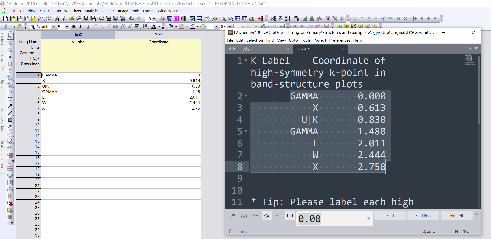
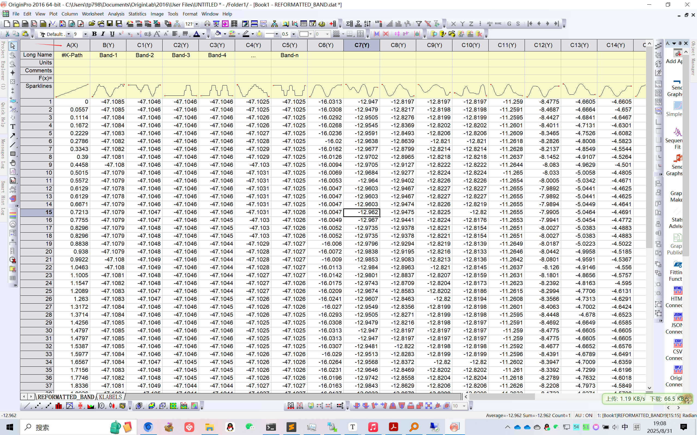
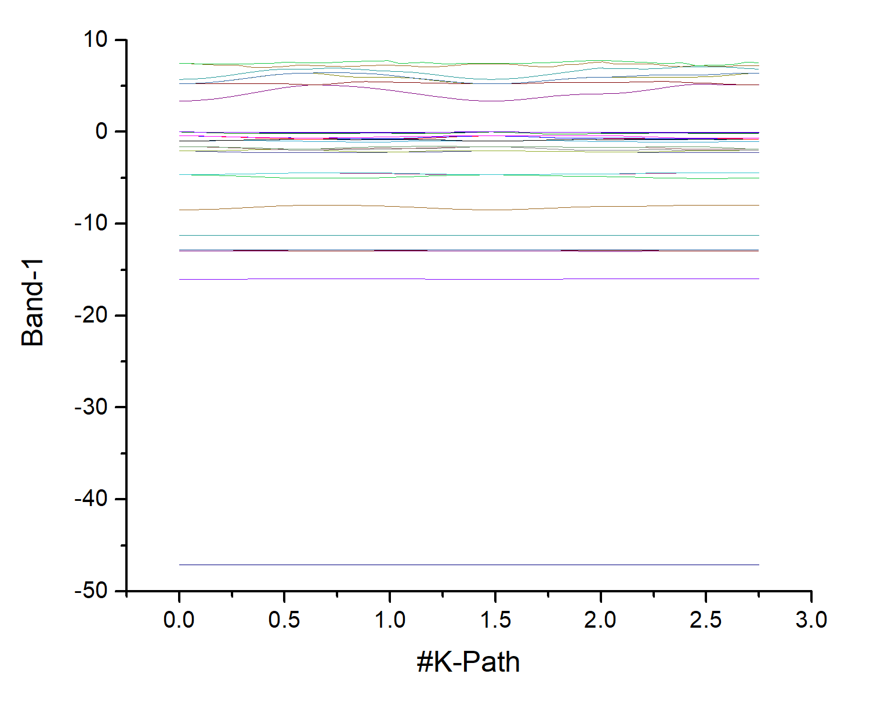
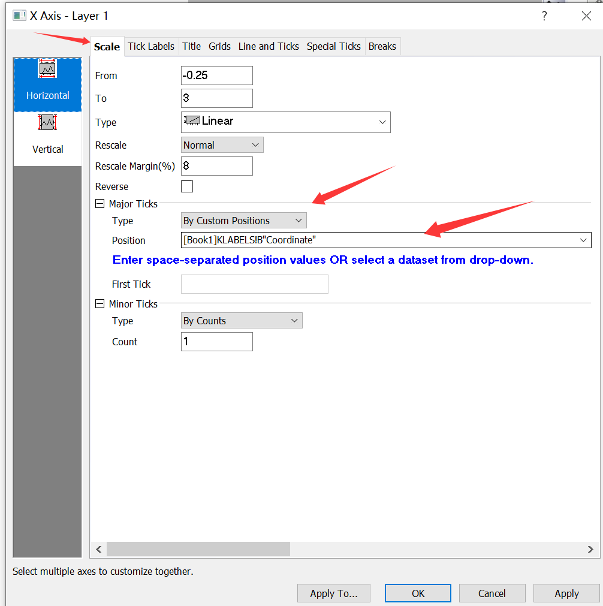
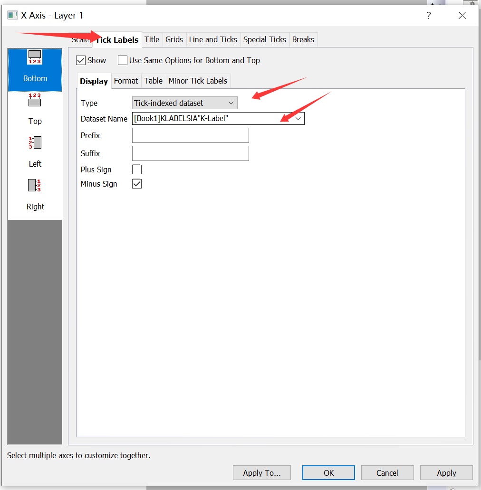
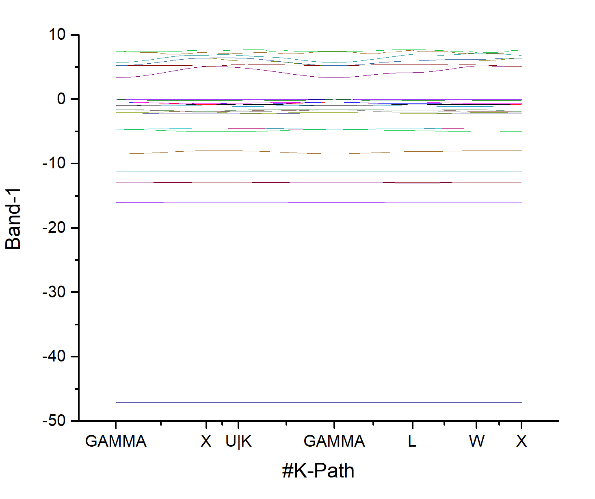
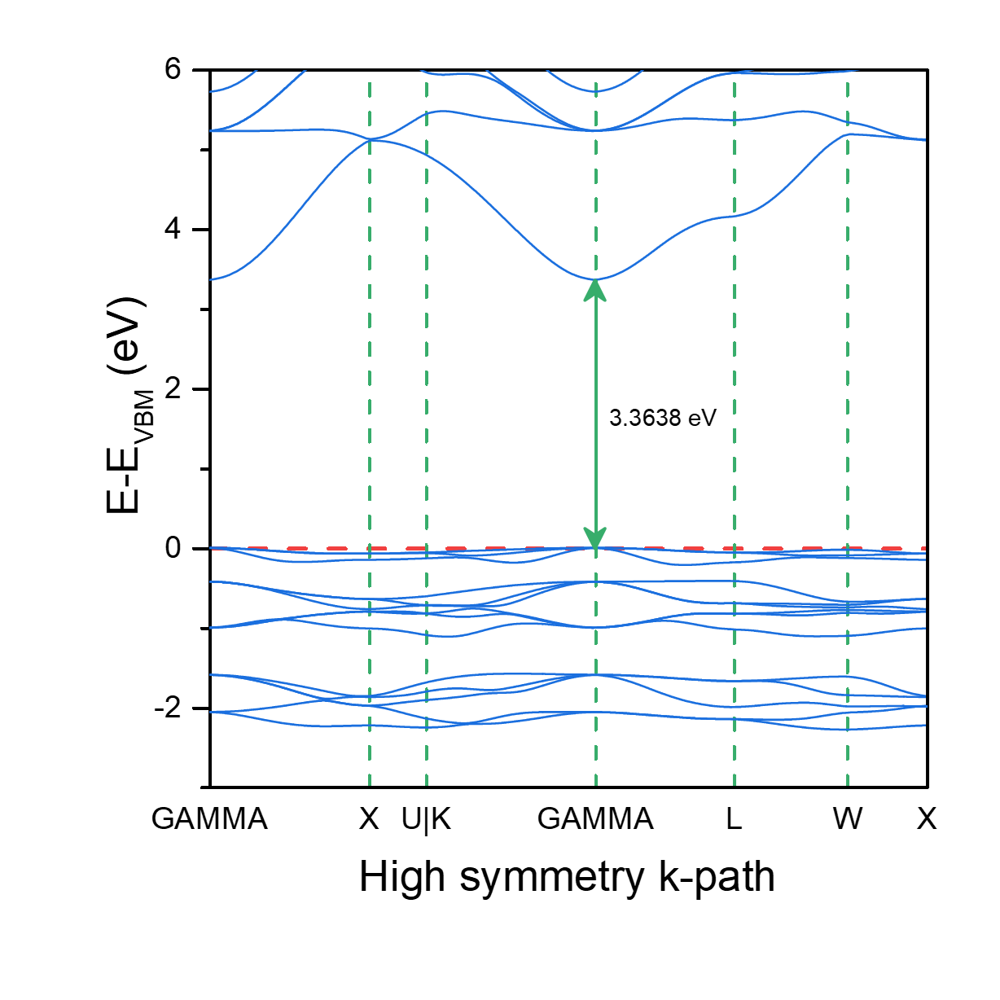

终于也是把文献整理得差不多了，博客也翻新了一下，继续分享一些之前的计算。

我的计算体系是Argyrodite硫化物固态电解质体系，计算以$\rm Li_6PS_5Cl$为例吧。能带计算最好是使用primitive cell，即原胞。这是惯用晶胞或者超胞计算得到的能带是折叠的，固体物理的相关书籍中有提到，（当然计算成本也是不同的），参考公社论坛上的两篇讨论帖子：

- http://bbs.keinsci.com/thread-11373-1-1.html
- http://bbs.keinsci.com/thread-19361-1-1.html

# 原胞的变胞优化

计算使用我稍微熟一点的VASP来，首先从Materials Project网站下载晶体结构文件，下载primitive cell，如果已经有了conventional cell的cif文件，也可以使用vaspkit的602功能生成`PRIMCELL.vasp`原胞文件。

然后进行原胞的变胞优化，除了POSCAR的剩下三个输入文件可以使用vaspkit方便地生成，使用101功能，选择lattice relaxation进行变胞优化，102功能生成自洽计算的K点，选择Gamma撒点方案，0.03间隙，原胞计算量比较小，间隙填小一点也无妨。

笔者在Intel 5218R的集群上进行计算，分配了40个物理核心，计算时在`INCAR`中设置`KPAR=2`和`NCORE=20`来最大化效率，一般而言`NPAR`参数不需要设置，`KPAR`和`NCORE`的参数设置众说纷纭，我参考的公社某一篇帖子里的经验，前者设置为2，后者设置为物理核心数的一般，当然这是对于CPU版本的VASP而言的。

原胞的变胞优化用时很短：

```bash
 reached required accuracy - stopping structural energy minimisation
[ctan@baifq-hpc141 primitive_cell-opt]$ tail OUTCAR
                            User time (sec):       88.516
                          System time (sec):        3.010
                         Elapsed time (sec):       94.030

                   Maximum memory used (kb):      238296.
                   Average memory used (kb):          N/A

                          Minor page faults:        36126
                          Major page faults:          669
                 Voluntary context switches:         1271
```

在确认收敛并确认结构正常后进行能带的计算

# PBE泛函计算能带

> 能带计算的KPOINTS与普通计算的KPOINTS不一样，通常需要第一布里渊区内的一条或几条高对称点路径来计算能带性质

VASP的计算中PBE泛函是被使用最广泛的，需要修改K点和输入文件。参考vaspkit官网的教程：http://vaspkit.cn/index.php/27.html

PBE能带的计算<mark>可以<mark>分两步进行。

首先进行自洽计算，此时也即（最常用的）静态计算，将变胞优化的`CONTCAR`更名为`POSCAR`，使用`vaspkit`的101功能，选择Static-Calculation，k点选择可以不变。

接着进行能带计算，需要使用vaspkit的303功能生成高对称K点，将生成的`KPATH.in`文件更名为`KPOINTS`

```bash
(base) [storm@X16 temp]$ ls
HIGH_SYMMETRY_POINTS  INCAR  KPATH.in  KPOINTS  POSCAR  POTCAR  PRIMCELL.vasp  SYMMETRY  vmd-1.9.3
```

可以看到，303功能也生成了原胞结构，当然前面我们已经提到过。

在进行能带计算的目录中，将上一步自洽计算的`CHGCAR`文件拷贝过来并在`INCAR`中设置电荷密度<mark>不更新<mark>，即`ICHARG=11`，这是必须的，为了加速计算，建议读取上一步的`WAVECAR`文件，虽然`ISTART`设置为1或者2程序都可以读取`WAVECAR`，但是为了保持整个计算任务中（第一步和第二步）的平面波基组一致，建议使用`ISTART=2`。

此种方法计算能带分两步的原因是使用高密度 k 点网格进行计算时耗时较长，因此用不耗时的普通静态计算多次迭代得到的`CHGCAR`和`WAVECAR`来加速高密度k点网格的计算。

其实对于我的小体系，直接使用高密度k点网格进行静态计算也是完全可接受的，并且SCF 和能带完全自洽，会更精确一些，用时并不长：

```bash
[ctan@baifq-hpc141 primitive_cell-band_PBE]$ ls
4736.log  CONTCAR   HIGH_SYMMETRY_POINTS  KPOINTS  PCDAT   PRIMCELL.vasp  slurm-4736.out  vasp.out     WAVECAR
CHG       DOSCAR    INCAR                 OSZICAR  POSCAR  PROCAR         SYMMETRY        vaspout.h5   XDATCAR
CHGCAR    EIGENVAL  KPATH.in              OUTCAR   POTCAR  REPORT         vasp.err        vasprun.xml
[ctan@baifq-hpc141 primitive_cell-band_PBE]$ tail OUTCAR
                            User time (sec):      216.131
                          System time (sec):        4.733
                         Elapsed time (sec):      223.789

                   Maximum memory used (kb):      427044.
                   Average memory used (kb):          N/A

                          Minor page faults:        28812
                          Major page faults:          666
                 Voluntary context switches:         1232
```

# HSE06杂化泛函计算能带

PBE最常被诟病的方面即能带计算，它常常低估带隙。By the way，Materials Project上的能带数据刚好能和我用PBE算出来的能带数据对上，明显小于HSE06泛函计算的数据，估计是使用PBE算的。

HSE (Heyd–Scuseria–Ernzerhof)杂化泛函在2003年首次被提出（HSE03），在2006年HSE06被提出，它能更加精确地计算能带。使用HSE06杂化泛函做计算是<mark>十分昂贵<mark>的，用时是PBE泛函的<mark>数十倍不止<mark>。

受vasp算法所限制，使用HSE06杂化泛函计算能带时<mark>只能使用自洽计算（此时为静态计算），不能进行非自洽计算<mark>。中文互联网上有一些教程是错误的，PBE可以自洽+非自洽两步，也可以自洽一步，但是HSE06杂化泛函只能一步自洽。<mark>不过可以在能带计算之前也先做一下静态计算（自洽计算），然后将产生的`WAVECAR`文件用于能带计算以加速<mark>。

使用`vaspkit`的251功能生成所需要的`KPOINTS`文件，这是一个“混合”的文件：

```bash
 ------------>>
251
 -->> (01) Reading Input Parameters From INCAR File.
 ======================== K-Mesh Scheme ==========================
 1) Monkhorst-Pack Scheme
 2) Gamma Scheme

 0)   Quit
 9)   Back
 ------------->>
2
 +---------------------------- Tip ------------------------------+
 Input the K-spacing value for SCF Calculation:
 (Typical Value: 0.03-0.04 is Generally Precise Enough)
 ------------>>
0.03
 Input the K-spacing value for Band Calculation:
 (Typical Value: 0.03-0.04 for DFT and 0.04-0.06 for hybrid DFT)
 ------------>>
0.03
 +---------------------------------------------------------------+
 -->> (02) Reading K-Path From KPATH.in File.
 +-------------------------- Summary ----------------------------+
 K-Mesh for SCF Calculation:    3    3    3
 The Number of K-Points along K-Path No.1:  14
 The Number of K-Points along K-Path No.2:   6
 The Number of K-Points along K-Path No.3:  18
 The Number of K-Points along K-Path No.4:  17
 The Number of K-Points along K-Path No.5:   7
 The Number of K-Points along K-Path No.6:   7
 +---------------------------------------------------------------+
 -->> (03) Written KPOINTS File.
```

首先需要生成自洽（静态）计算所需要的k点网格，然后生成能带计算的高密度k点网格。`INCAR`文件可以沿用普通静态计算的然后改一下泛函，也可以使用101功能生成HSE06 Calculation的`INCAR`。

HSE06杂化泛函极为昂贵，大概在第五个电子步时，用时超过8h仍未计算完，遂放弃。之前注册某家超算平台时送了一点机时，开通了GPU版本的vasp计算，发现快了不少：

```bash
 General timing and accounting informations for this job:
 ========================================================
  
                  Total CPU time used (sec):    22600.775
                            User time (sec):    10925.947
                          System time (sec):    11674.828
                         Elapsed time (sec):     7781.069
  
                   Maximum memory used (kb):     6086716.
                   Average memory used (kb):          N/A
  
                          Minor page faults:      6831986
                          Major page faults:          282
                 Voluntary context switches:     53436870
 
 PROFILE, used timers:     405
 =============================
```

# 数据后处理与Origin绘图

能带计算结束后，将目录拷贝到可以使用vaspkit的机器上。

对于PBE计算的能带，使用211功能处理数据，得到带隙、CBM、VBM、Fermi Energy等信息：

```
 ------------>>
21
 ============================ Band Options =======================
 211) Band-Structure
 212) Projected Band-Structure of Only-One-Selected Atom
 213) Projected Band-Structure of Each Element
 214) Projected Band-Structure of Selected Atoms
 215) Projected Band-Structure by Element-Weights
 216) The Sum of Projected Band for Selected Atoms and Orbitals

 0)   Quit
 9)   Back
 ------------>>
211
 -->> (01) Reading Input Parameters From INCAR File.
 +---------------------------------------------------------------+
 |       >>> The Fermi Energy will be set to zero eV <<<         |
 +---------------------------------------------------------------+
 -->> (02) Reading Fermi-Energy from DOSCAR File.
 -->> (03) Reading Energy-Levels From EIGENVAL File.
 -->> (04) Reading K-Path From KPOINTS File.
 -->> (05) Written KLABELS File.
 +---------------------------- Tip ------------------------------+
 |If You Want to Get Fine Band Structrue by Interpolating Method.|
 | You CAN set GET_INTERPOLATED_DATA = .TRUE. in ~/.vaspkit file.|
 +---------------------------------------------------------------+
 -->> (06) Written BAND.dat File.
 -->> (07) Written REFORMATTED_BAND.dat File.
 -->> (08) Written KLINES.dat File.
 -->> (09) Written BAND_GAP File.
```

对于HSE06计算的能带，使用252功能处理数据，得到带隙、CBM、VBM、Fermi Energy等信息：

```bash
 ------------>>
252

 -->> (01) Reading Input Parameters From INCAR File.
 +---------------------------------------------------------------+
 |       >>> The Fermi Energy will be set to zero eV <<<         |
 +---------------------------------------------------------------+
 -->> (02) Reading Fermi-Level From FERMI_ENERGY.in File.
 -->> (03) Reading Energy-Levels From EIGENVAL File.
 -->> (04) Reading KPT-Params in the First Line of KPOINTS File.
 -->> (05) Reading K-Path From KPATH.in File.
 -->> (06) Written KLABELS File.
 +---------------------------- Tip ------------------------------+
 |If You Want to Get Fine Band Structrue by Interpolating Method.|
 | You CAN set GET_INTERPOLATED_DATA = .TRUE. in ~/.vaspkit file.|
 +---------------------------------------------------------------+
 -->> (07) Written BAND.dat File.
 -->> (08) Written REFORMATTED_BAND.dat File.
 -->> (09) Written KLINES.dat File.
 -->> (10) Written BAND_GAP File.
```

绘图时我习惯把价带顶归零，即纵坐标为$\rm E-E_{VBM}$，操作如下。

把`FERMI_ENERGY`文件就拷贝一份，改名为`FERMI_ENERGY.in`。将文件`FERMI_ENERGY.in`中的费米能级数据改为价带顶数据，然后再重新运行252功能，此时得到的`REFORMATTED_BAND.dat`文件中的数据是归零的。

接下来就是origin绘图了

将`REFORMATTED_BAND.dat`文件拖入工作表内，确认只有一个X轴，剩下全是Y轴。新建一个sheet。打开`KLABELS`文本文件，手动复制数据，如下图





接着选中sheet1表格中的所有数据，绘制折线图：



设置一下横坐标，改成高对称点的样子，看图：





这样横坐标就被设置好了：



接下来就是美化了，放一张最后画好的图吧：

