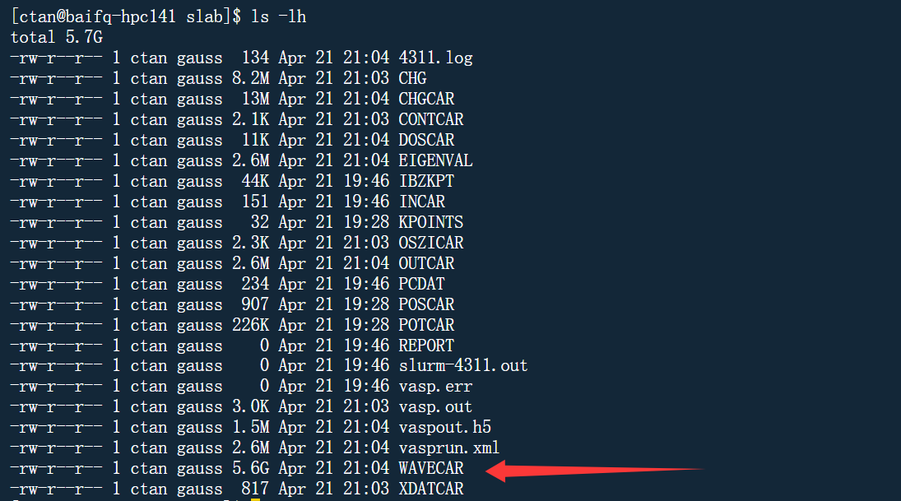

记录一下维也纳第一性原理计算软件包（VASP）的学习过程，有点乱、、、

计算一个体系会出现两种优化过程

- 电子结构的优化
  - 迭代求解薛定谔方程来获得体系能量极小值的一个过程
- 几何结构的优化
  - 在电子结构优化的结果上，获取原子的受力情况，然后根据受力情况，调节原子的位置，再进行电子结构优化，获取新的受力情况，然后再调节原子位置，一直重复这样的过程，直至找到体系势能面上一个极小值的过程


`OSICAR`用于记录优化过程的信息

在`INCAR`中设置`ALGO`参数可以指定算法

`ZVAL`是`POTCAR`中对应元素的价电子

查看K点的个数：

```bash
grep irreducible OUTCAR
```

固体物理中，费米能级对应的是最高电子占据轨道的能量，也就是`HOMO`

以下情况需要考虑自旋极化

* 单原子的计算
* O$_2$ 分子(基态为三重态)
* 自由基相关的计算
* 含Fe,Co, Ni 的体系
* 要计算的体系具有磁性：顺磁，铁磁，反铁磁等，要打开自旋极化。
* 当关注体系的电子性质时，且自己不知道加或者不加的时候，建议加上

EDIFF 控制电子步（自洽）的收敛标准，在O原子的计算中，由于我们不需要优化，直接进行静态计算，完全由EDIFF控制计算的收敛情况

EDIFFG控制离子步的收敛标准

- 对于优化，我们可以使用力作为收敛标准，此时EDIFFG为负值。一般来说取值在-0.01到-0.05之间(-0.01对于力收敛来说已经是一个很严格的要求了)。
* 当然，对于较大的体系，我们也可以使用能量作为标准：此时，EDIFFG 为正值，一般取值范围在0.0001-0.001即可。

单点计算、静态计算、自洽计算：几何结构计算前后不发生变化

`IRBION`优化分子结构

一般来说，优化结构的时候有3个选择：

- IBRION=3：你的初始结构很差的时候；
- IBRION=2：共轭梯度算法，很可靠的一个选择，一般来说用它基本没什么问题。
- IBRION=1：用于小范围内稳定结构的搜索。


`CONTCAR`包含优化完之后的信息


频率计算的作用

- 确定结构是否稳定;
- 看振动方式和大小，用来和实验对比，棋博士最新的文章就是一个非常好的例子;
- 反应热，反应能垒，吸附能等的零点能矫正;
- 确认过渡态(有一个振动的虚频)
- 热力学中计算`entropy`，用于计算化学势，微观动力学中的指前因子和反应能垒。

频率分析的关键参数

```bash
IBRION = 5 #之前设置的2
NFREE = 2 #新加入的参数
POTIM = 0.02 #减小了数值
```

**怎么确定POSCAR中的原子？**——比如乙醇中的羟基氢是POSCAR中的哪一个呢？？？

晶胞&&原胞

7种晶系与14种布拉维点阵：简单三六菱，单斜底，四方体


`NWRITE`用来控制输出文件的详细程度

```bash
NWRITE = 0 # 最小输出
NWRITE = 1 #中等
NWRITE = 2 #详细输出
```

`ISTART`用来初始化波函数

```bash
ISTART = 1 #读取WAVECAR续算
ISTART = 0 #从零开始算
```

单纯从数据库中获取的结构，只能作为一个合理的初始值，与计算所得到的理论结构还有一定的差距，因此我们需要对该结构进行优化才可以获取稳定的晶格参数信息。有两个方法可以实现：

* 1 Birch-Murnaghan状态方程拟合
* 2 VASP计算中通过调节ISIF参数直接优化Bulk

Birch-Murnaghan方程
$$
E(a)=E_0+\dfrac{9V_0B_0}{16}([(\frac{a_0}{a})^2-1]^3B_0^{'}+[(\dfrac{a_0}{a})-1]^2[6-4(\frac{a_0}{a})^2])
$$

$$
(\dfrac{V_0}{V})^{\frac{2}{3}}=(\dfrac{a_0^3}{a_{actual}^3})^{\frac{2}{3}}=(\dfrac{a_0}{a_{actual}})^2
$$

$$
x=\dfrac{1}{(a\times 2.8664)^2}
$$

> a代表缩放系数，2.8664是晶胞参数

除了用B-M方程拟合来确定晶格常数之外，还可以使用直接优化法确定晶格常数：ISIF = 3 + ENCUT

- `ISIF=2`（默认）：优化原子位置
- `ISIF=3`：优化原子位置 + 晶胞形状/体积。

单点计算误区

- 单点计算（`NSW=0` 或 `IBRION=-1`）时无需设置 `ISIF=0`，因为离子已固定。
- 错误设置 `ISIF=0` 会禁用应力计算，可能导致后续分析缺失数据。

为何需要增大 `ENCUT`？

- Pulay Stress：
  - **定义**：当晶胞体积变化时，平面波基组不完整导致的应力误差。
  - **后果**：晶格优化结果不准确。
  - 解决方法
    1. **保持体积不变**（BM 方程拟合法）
    2. **增大 `ENCUT`**（直接优化法）
- 规则
  - 设置 `ENCUT = 1.3 * max(ENMAX)`（`ENMAX` 取自 `POTCAR`）
  - 示例：Fe 的 `ENMAX=267.882 eV` → `ENCUT=350 eV`（但文档设置为 `600 eV`，更保守）

DOS态密度计算需要使用更多的K点

>A high quality DOS requires usually very fine k-meshes.

`ISMEAR`的选择

* 对于半导体和绝缘体体系，ISMEAR的值取绝对不能大于0， 一般用0；
* 对所有体系，如果想获取更加精确能量的时候用-5，但这时候如果K点数目小于3，程序则会罢工；
* K 点少，半导体或者绝缘体，那么只能用 ISMEAR = 0；
*  在DOS能带计算中，使用ISMEAR= -5 用于获取精确的信息。 
* 对于金属来说，ISMEAR的取值一般为>=0 的数值（0,1,2）；
* 保守地说，ISMEAR = 0 (Gaussian Smearing) 可以满足大部分的体系（金属，导体，半导体，分子）；
* 如果不知道怎么取ISMEAR，直接用0是一个很保险的做法。也可以测试不同的值对计算的影响，但是新手的话，即使测试完了，也不知道根据什么去判断对结果的影响。


电子数的积分区间是从负无穷到费米能级


## 各种参数的作用

### ISTART——确定是否读取 WAVECAR 文件

ISTART = 0 | 1 |2 |3

默认值

- 如果存在WAVECAR则读取: ISTART = 1
- 强制不读取WAVECAR，从头算: ISTART = 0

ISTART = 2，读取WAVECAR，截断能原胞不发生改变

### ICHARG——确定 VASP 如何构造初始电荷密度

ICHARG = 0 | 1 |2 | 4 | 5

- ICHARG = 0，默认值，从初始波函数计算电荷密度
- ICHARG = 1，从 CHGCAR 文件中读取电荷密度，并使用原子电荷密度的线性组合从旧位置（在 CHGCAR 上）外推到新位置
- ICHARG = 2，默认值，以原子电荷密度的叠加为例

### PREC——指定精度模式

PREC = Normal | Single | SingleN | Accurate | Low | Medium | High 

- PREC = Normal，默认
- PREC = Single
- PREC = SingleN
- PREC = Accurate

### LREAL——确定投影算子是在实空间还是在倒数空间中求值

LREAL = .FALSE. | Auto (or A) | On (or O) | .TRUE.

- LREAL = .FALSE.	默认值，倒数空间投影，小体系，精确
- LREAL=Auto      	在实空间中进行投影，全自动优化投影算子（几乎不需要用户干扰）

### ALGO——指定电子最小化算法或选择 GW 计算类型的便捷选项。

ALGO = Normal | VeryFast | Fast | Conjugate | All | Damped | Subrot | Eigenval | Exact | None | Nothing | CHI | G0W0 | GW0 | GW | scGW0 | scGW | G0W0R | GW0R | GWR | scGW0R | scGWR | ACFDT | RPA | ACFDTR | RPAR | BSE | TDHF

默认值: Normal

### ENCUT——指定以 eV 为单位设置的平面波基的能量截止

ENCUT = [real] 

默认为POTCAR中的ENMAX，但是官方==强烈建议==在 INCAR 文件中始终手动指定能量截止 ENCUT，以确保计算之间的准确性相同。否则，不同计算之间的默认 ENCUT 可能会有所不同（例如，对于内聚能的计算），结果是无法比较总能量。

### ISMEAR——能带展宽方法

ISMEAR = -15 | -14 | -5 | -4 | -3 | -2 | -1 | 0 | [integer]>0

默认值：1

ISMEAR 决定如何为每个轨道设置部分占据数 f$_{nk}$ ,SIGMA 以电子伏特(eV)为单位确定展宽的宽度

以下是来自AI的比喻解释：

---

#### **ISMEAR：决定如何给电子“打分”**
- **问题**：电子在能级上的分布是离散的（像楼梯台阶），但实际计算时需要用连续函数去“平滑”这些台阶。
- **ISMEAR** 就是选择“平滑方式”的方法：
  - **`ISMEAR = -5`**：采用Blöchl修正的四面体方法，无展宽，严格按台阶处理（绝对精确，但只适用于绝缘体/半导体，速度慢）
  - **`ISMEAR = 0`**：采用高斯展宽，用高斯函数“模糊”台阶边缘（适合半导体/绝缘体，平衡精度和速度）
  - **`ISMEAR = 1`**：默认值，用更复杂的函数模糊台阶（适合金属，容忍更多模糊，计算快）

#### **2. SIGMA：展宽的“宽容度”**

- **问题**：`ISMEAR` 选择用高斯函数模糊时，**SIGMA 决定模糊的程度**（就像PS里“高斯模糊”的半径）
- **SIGMA 越小**：模糊范围越小，越接近真实台阶（精度高，但容易震荡，收敛难）
- **SIGMA 越大**：模糊范围越大，电子分布越平滑（容易收敛，但可能掩盖真实细节）

#### **到底怎么设置？一句话总结**
| **体系类型**                    | **推荐 ISMEAR**       | **推荐 SIGMA**     | **注意事项**                      |
| ------------------------------- | --------------------- | ------------------ | --------------------------------- |
| **绝缘体/半导体**（原子、分子） | `0`（绝对不能大于零） | 0.05~0.1           | 不要用 `ISMEAR=1`，会引入误差！   |
| **金属**                        | `1`                   | 0.1~0.2            | SIGMA 太小会导致震荡！            |
| **能带/DOS计算**                | `-5`                  | 不用设置（不展宽） | 仅适用于绝缘体，且需要密集 K 点！ |

* 保守地说，ISMEAR = 0 (Gaussian Smearing) 可以满足大部分的体系（金属，导体，半导体，分子）；
* 如果不知道怎么取ISMEAR，直接用0是一个很保险的做法。也可以测试不同的值对计算的影响，但是新手的话，即使测试完了，也不知道根据什么去判断对结果的影响。

### **常见错误**

1. **对绝缘体用 `ISMEAR=1`** → 结果完全错误！
2. **SIGMA 太大（比如 0.5）** → 电子分布过度平滑，能量不准。
3. **对金属用 `ISMEAR=0`** → SCF 难收敛，疯狂报错！

---

### **举个具体例子**
假设你计算 **硅（半导体）**：
- **正确设置**：
  ```bash
  ISMEAR = 0
  SIGMA = 0.05
  ```
- **错误设置**：
  
  ```bash
  ISMEAR = 1   # 会引入非物理的金属性！
  SIGMA = 0.5  # 能量误差可能大到 1 eV！
  ```

---

### **终极口诀**
- **绝缘体/半导体** → `ISMEAR=0` + 小 SIGMA（0.05~0.1）
- **金属** → `ISMEAR=1` + 稍大 SIGMA（0.1~0.2）
- **画能带/DOS** → `ISMEAR=-5`（别动 SIGMA）

## IBRION——确定在计算过程中晶体结构如何变化（如何调整原子位置来寻找能量最低点）

Default: IBRION	= -1	for NSW=−1 or 0

​				    = 0	else

- 无变化，IBRION = -1 （避免在 NSW>0 时将 IBRION 设置为-1，以防止相同结构被重新计算 NSW 次）
- 分子动力学，IBRION = 0
- 结构优化
  - 准牛顿法， IRBION =1
  - 共轭梯度， IBRION =2
  - 阻尼分子动力学，IBRION = 3
- 计算声子
  - IBRION=5 无对称性的有限差分
  - IBRION=6 具有对称性的有限差分
  - IBRION=7 无对称性微扰理论
  - IBRION=8 具有对称性的微扰理论
- 分析过渡态
  - IBRION = 40 内禀反应坐标计算
  - IRBION = 44 改进的dimer方法

## NSW——描述离子步长的最大数量

NSW = [integer] 

Default: **NSW** = 0 

## POTIM——设置分子动力学中的时间步长或离子弛豫中的步长宽度

IBRION确定了在计算过程中晶体结构如何变化，如何寻找最低点（“山谷”），POTIM就是“每次移动的距离”

- 如果IBRION  = 0，则必须设置POTIM
  - 对于 IBRION=0，POTIM 给出了所有从头开始分子动力学运行的时间步长（以 fs 为单位），因此必须提供它，否则 VASP 在启动后立即崩溃。
- 如果IBRION = 1,2,3，默认值为0.5
  - 对于 IBRION=1、2 和 3，分别对应于使用拟牛顿算法、共轭梯度算法和阻尼分子动力学的离子弛豫，POTIM 标签作为步长宽度的缩放常数。准牛顿算法对该参数的选择特别敏感
- 如果IRBION = 5,6，默认值为0.015
  - 对于 IBRION=5 和 6，使用有限差分方法进行声子计算，其中 POTIM 是计算 Hessian 矩阵的每个离子位移的宽度。

**POTIM 太大** → 跨步太大，可能跳过最低点（震荡不收敛）**POTIM 太小** → 移动太慢，优化耗时

## NCORE——确定在单个轨道上工作的计算核心数量

默认值：NCORE = 1

NCORE的设置可以优化计算资源，降低内存用量（但有可能降低计算速度），如果体系非常小那就可以不用设置，直接并行即可

```bash
mpirun -n 'core numbers' vasp
```

## NFREE——根据 IBRION，NFREE 指定离子收敛运行历史中记住的步数，或冻结声子计算中的离子位移数


## LDIPOL——开启对势能和力的修正

LDIPOL 开启对势能和力的修正。可应用于具有净偶极矩的带电分子和平板

LDIPOL = .TRUE. | .FALSE.

默认值：LDIPOL = .FALSE.

偶极子的存在与周期性边界条件相结合，会导致总能量随超胞大小的收敛速度缓慢。此外，有限尺寸误差会影响势能和力。通过在 INCAR 文件中设置 LDIPOL=.TRUE. 可以抵消这种影响。对于 LDIPOL=.TRUE.，会添加一个线性校正，对于带电的晶胞，会添加一个二次静电势到局部势中，以校正由周期性边界条件引入的误差。激活此标签时，==必须指定标签 IDIPOL，也可以选择指定标签 DIPOL==

这种模式的最大优点是力中的主导误差得到了修正，并且可以针对非对称平板评估功函数。缺点是向电子基态的收敛可能会==显著减慢==，也就是说，可能需要更多的电子迭代来获得所需的精度

## IDIPOL——开启对特定方向或所有方向的总能量的单极/偶极和四极校正

IDIPOL = 1 | 2 | 3 | 4 

IDIPOL = 1-3，仅分别沿第一、第二或第三晶格矢量方向计算偶极矩，**此标志应用于平板计算，表面法线为设置 IDIPOL 的方向，并可选择使用 DIPOL 标签指定平板的质心**

IDIPOL = 4，将计算所有方向上的全偶极矩，**对孤立分子进行计算时使用此标志**

## ISPIN——控制自旋极化

ISPIN = 1 | 2

默认：ISPIN = 1，执行非自旋极化计算

ISPIN = 2，执行自旋极化计算（共线）

对于非共线计算，忽略 ISPIN。在 VASP 6.5.0 中，如果 ISPIN = 2 且 MAGMOM 与 LNONCOLLINEAR=.TRUE. ==结合使用==，计算将以错误消息退出

## NELM——最大电子步收敛

默认值等于60

## LWAVE——决定在运行结束时波函数是否写入 WAVECAR 文件

LWAVE = [logical]
默认值：LWAVE = .NOT. LH5 | .TRUE. 

一般情况不开，文件巨大、、、



## lCHARG——决定是否写入电荷密度(CHGCAR & CHG)

LCHARG = .NOT.LH5 | .TRUE.
默认值：LCHARG = .NOT. LH5 

## ADDGRID——决定是否使用额外的辅助网格来评估增强电荷

ADDGRID = .TRUE. | .FALSE.
默认值：ADDGRID = .FALSE.

==因此，我们建议进行细致的测试，以验证 ADDGRID 是否按预期工作；请不要默认在所有计算中使用此标签！==

## LASPATH——控制局域非球面性修正的参数

看不懂思密达、、、

LASPH = .TRUE. | .FALSE.

默认值：LASPH = .FALSE.

- 开启 `LASPH = .TRUE.`
  - 在计算交换关联能时，计入原子周围电子密度的 **非球面性贡献**（如 d/f 轨道的非对称分布）。
  - 修正总能量、力和应力，尤其在强各向异性体系中影响显著。
  - 增加计算量（约10%-30%耗时），但对精度提升可能至关重要。

## LVHAR——确定局部势能$V_{ionic}$(r)+$V_{hartree}$是否写入LOCPOT文件

默认值：LVHAR = .FALSE.

## LORBIT——选择一种投影到局部量子数(lm)上的方法，并写入 PROCAR/PROOUT 文件

- **作用**：决定是否计算并输出原子轨道的投影波函数（投影到球谐函数或特定轨道），以及如何输出局域态密度（LDOS）。
- **输出文件**：主要影响`PROCAR`和`DOSCAR`文件的内容（若`LORBIT`≥10还会生成`LOCPOT`等文件）

| 值     | 功能说明                                                     |
| ------ | ------------------------------------------------------------ |
| **0**  | **默认值**，不计算轨道投影（仅输出总能带和总态密度）。       |
| **1**  | 计算原子轨道的投影（写入`PROCAR`），但不分解到具体轨道（如s/p/d）。 |
| **2**  | 分解到轨道角动量（s/p/d/f）的投影，但不分磁量子数（如px/py/pz不分开）。 |
| **10** | 类似`LORBIT=1`，但额外输出`LOCPOT`文件（包含局域势信息）。   |
| **11** | 类似`LORBIT=2`，但额外输出`LOCPOT`文件。                     |
| **12** | **最常用**：分解到磁量子数（如px/py/pz分开），适合详细轨道分析。 |

## LASPH——控制赝势计算中是否考虑非球面贡献

主要影响**交换关联势（XC Potential）**和**电荷密度（Charge Density）**的计算精度

默认值：LASPH = .FALSE.

**作用**：决定是否在计算中考虑电子密度和势场的**非球对称部分**（即角动量 `l > 0` 的贡献）。

- 若`LASPH = .TRUE.`，VASP会计算电子密度和势场的高阶角动量分量（如 `d, f` 轨道），提升精度。
- 若`LASPH = .FALSE.`（默认值），仅考虑球对称部分（`l = 0`），计算更快但可能损失部分精度

## MDALGO——指定分子动力学模拟算法

**（当 IBRION = 0 且 VASP 使用-Dtbdyn 编译时才启用）**

MDALGO = 0 | 1 | 2 | 3 | 4 | 5 | 11 | 21 | 13 

| MDALGO 取值 | 恒温器 / 模拟方式         | 适用系综 | 设置要点                                                     |
| ----------- | ------------------------- | -------- | ------------------------------------------------------------ |
| 0           | 标准分子动力学            | NVE      | 设置 IBRION=0、TEBEG、POTIM、NSW；MDALGO=0；SMASS=-3         |
| 1           | 安徒生恒温器              | NVT      | 设置 IBRION=0、TEBEG、POTIM、NSW；MDALGO=1；选择合适的 ANDERSEN_PROB |
| 2           | Nose-Hoover 恒温器        | NVT      | 设置 IBRION=0、TEBEG、POTIM、NSW；MDALGO=2；选择合适的 SMASS |
| 3           | 朗之万恒温器              | NVT、NpT | NVT 模拟：设置 IBRION=0、TEBEG、POTIM、NSW；ISIF=2；MDALGO=3；在 POSCAR 文件通过 LANGEVIN_GAMMA-tag 指定摩擦系数 NpT 模拟：设置 IBRION=0、TEBEG、POTIM、NSW；ISIF=3；MDALGO=3；在 POSCAR 文件通过 LANGEVIN_GAMMA-tag 指定摩擦系数；通过 LANGEVIN_GAMMA_L-tag 指定晶格自由度摩擦系数；通过 PMASS-tag 设置晶格自由度质量；可通过 PSTRESS-tag 定义外部压力 |
| 4           | Nose Hoover chains 恒温器 | NVT      | 设置 IBRION=0、TEBEG、POTIM、NSW；ISIF=2；MDALGO=4；选择 NHC_NCHAINS 和 NHC_PERIOD |
| 5           | CSVR 恒温器               | NVT      | 设置 IBRION=0、TEBEG、POTIM、NSW；ISIF=2；MDALGO=5；选择 CSVR_PERIOD |
| 13          | 多个安徒生恒温器          | -        | 在 POSCAR 文件按顺序定义子系统原子位置；设置 NSUBSYS 定义每个子系统的最后一个原子；设置 TSUBSYS 定义每个子系统的模拟温度；设置 PSUBSYS 定义每个子系统原子的碰撞概率（0≤PSUBSYS≤1） |

## SMASS——在从头算分子动力学运行期间控制速度。

SMASS = -3 | -2 | -1 | [real] ≥ 0

Default: **SMASS** = -3 

对于SMASS = -3，模拟了一个微正则系综（NVE系综）

> **Tip:** To calculate an [NVE ensemble](https://www.vasp.at/wiki/index.php/NVE_ensemble) we instead recommend to use `MDALGO = 1` and `ANDERSEN_PROB = 0.0`

对于 SMASS = -2，初始速度保持恒定。这使得能够计算一组不同线性相关位置（例如冻结声子或具有不同键长的二聚体）的能量。

注意：如果 SMASS = -2，实际采取的步数为 POTIM×（从 POSCAR 文件读取的速度）。为避免歧义，请将 POTIM 设置为 1

## IVDW参数——控制范德华修正

DFT中，标准的交换关联泛函（如PBE、LDA）无法准确描述范德华力，因此需要通过额外的修正方法来处理

默认不启用范德华修正

- **IVDW = 0**：不启用范德华修正（默认值）。
- **IVDW = 1**：启用**DFT-D2**方法（Grimme的DFT-D2修正）。
- **IVDW = 10**：启用**DFT-D3**方法（Grimme的DFT-D3修正，不带Becke-Johnson阻尼）。
- **IVDW = 11**：启用**DFT-D3**方法（带Becke-Johnson阻尼，即DFT-D3(BJ)）。
- **IVDW = 12**：启用**DFT-D4**方法（Grimme的DFT-D4修正）。
- **IVDW = 20**：启用**Tkatchenko-Scheffler (TS)**方法。
- **IVDW = 21**：启用**Tkatchenko-Scheffler with self-consistent screening (TS-SCS)**方法。

