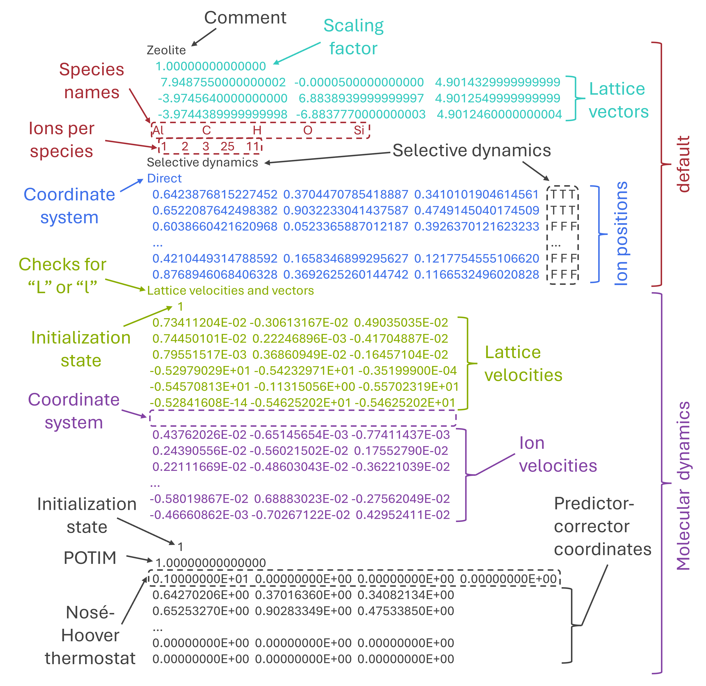
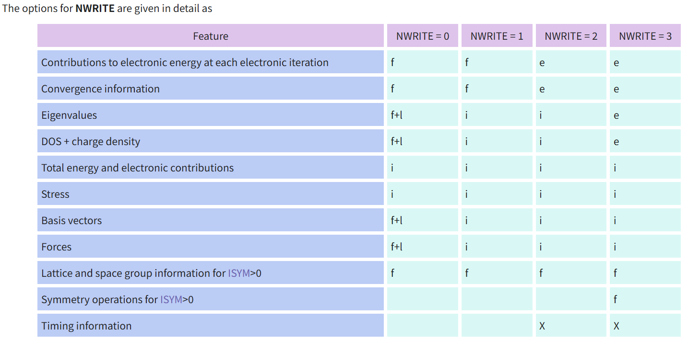
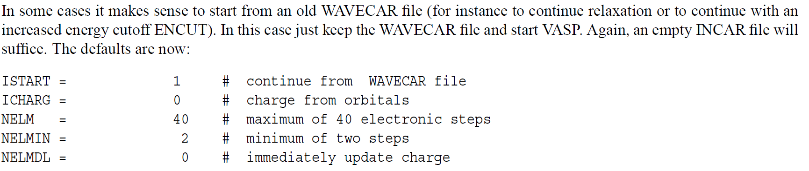
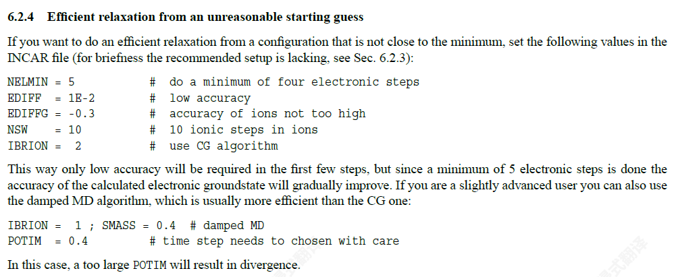
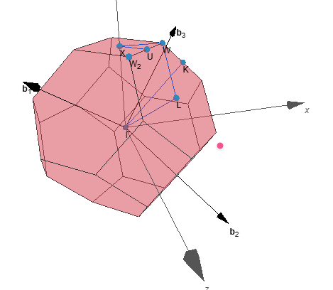
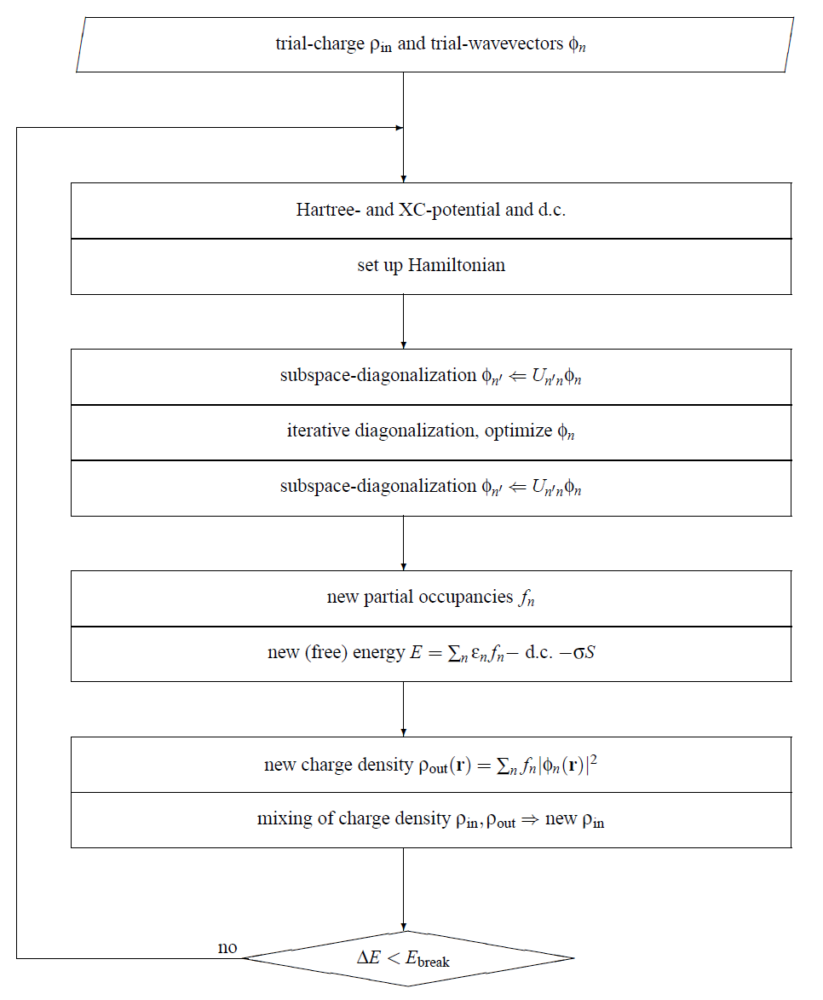

# VASP概览
VASP是一个复合的软件包，主要功能是从头算量子力学分子动力学模拟，使用赝势方法或者投影增强波+平面波基组的方法（projector-augmented wave，即`PAW`方法，也是当下VASP最主流的方法）。VASP的技术实现使用高效的矩阵对角化和Pulay/Broyden电荷密度混合算法。原子核附近的真实电子波函数为了满足正交性，振荡得非常剧烈。用平面波这个描述这种剧烈振荡十分困难，由此产生出三种解决方案：
- US-PP超软赝势，构造“超软”的赝波函数，在芯区尽量平滑，它是早期VASP的主要方法
- PAW投影增强波，它将全电子波函数精确地映射到一条平滑的赝波函数上，是VASP的默认和主流方法
- 模守恒赝势（NCPP），它的计算成本高，对轻元素尤其明显，是VASP的早期标准，现多用于高精度对比

手册里明确写出：==The VASP guide is written for experienced user, although even beginners might find it useful to read==。初学者直接上手Wiki会比较困难。

对于任何基于平面波方法的程序，总会有那么几个步骤（比如波函数正交）会让计算量随着价电子书的增长而爆炸性增长，电子数翻一倍，那么计算量就会增长八倍，但是VASP的开发者让计算复杂度O(N$^3$)前的系数尽可能小，减小计算量。而降低系数的操作，正是矩阵对角化，在VASP中的技术实现包括：
- RMM-DIIS方法，通过一个小的子空间迭代，逐步逼近真实的本征值和本征矢。对于**绝缘体和大带隙体系**，Davidson方法非常可靠且高效
- blocked Davidson方法，直接通过残差最小化来更新波函数，**特别适合金属体系**

VASP可以加速计算对称结构。如果一个晶体具有很高的对称性（比如立方晶系），那么布里渊区中许多不同的K点在物理上是等价的。VASP会利用对称性，**只计算其中一套不等价的K点**，然后通过对称操作得到其他K点的贡献。

在计算总能、电荷密度等常规物理量的时候，需要对整个布里渊区所有K点上的能带进行积分，可以有两个方法实现，这会设计到`ISMEAR`参数的设置：
- 展宽方法，适用于**金属**。因为金属在费米能级处有占据数从1跳变到0的不连续函数，直接数值积分很难。展宽方法方法用一个光滑的阶跃函数（如Fermi-Dirac展宽函数, Gaussian展宽函数, Methfessel-Paxton展宽函数）代替严格阶跃函数，从而加速收敛
- 四面体方法，适用于**绝缘体和半导体**。它将布里渊区划分为许多小四面体，假设能带在每个四面体内线性变化，从而精确积分。
	- 对于四面体方法，可以使用Blöchl修正，它消除了误差，使得收敛速度加快

# VASP计算
最重要的输入文件是：
- INCAR，最重要的输入文件，是一个==带标签的ASCII格式的文件==，每一行都带一个标签，即参数
	- 手册指出，截断能参数默认来自于POTCAR，但是大多数情况下手动在INCAR中设置截断能is wise
- POTCAR，赝势文件，包含原子信息
- POSCAR，结构参数文件，主要记录原子坐标，有分数坐标和笛卡尔坐标两种，后者会涉及到`universal scaling factor`通用缩放因子
- KPOINTS，==但不是必须==决定K点的取值，手册提到，当第二行等于0的时候，程序会根据下面第一行的方案和下面第二行的网格密度自动撒点，这几乎做是SCF取K点最常见的方法吧。
	- 也有一些特殊情况，比如能带结构通常沿高对称性路径进行可视化，后续再补充吧，这个感觉说来话长。

为了求解KS基态，SCF自洽场迭代使用的是Pulay mixer和Iterative matrix diagonalisation（迭代矩阵对角化）这两种方案，前者负责平稳收敛，后者负责快速求解方程，关于VASP的`stdout`标准输出，看看手册中的例子：
```
VASP.4.4.3 10Jun99
POSCAR found : 1 types and 2 ions
LDA part: xc-table for CA standard interpolation
file io ok, starting setup
WARNING: wrap around errors must be expected
entering main loop
     N  E              dE         d eps     ncg rms       rms(c)
CG : 1  0.1209934E+02  0.120E+02 -0.175E+03 165 0.475E+02
CG : 2 -0.1644093E+02 -0.285E+02 -0.661E+01 181 0.741E+01
CG : 3 -0.2047323E+02 -0.403E+01 -0.192E+00 173 0.992E+00 0.416E+00
CG : 4 -0.2002923E+02  0.444E+00 -0.915E-01 175 0.854E+00 0.601E-01
CG : 5 -0.2002815E+02  0.107E-02 -0.268E-03 178 0.475E-01 0.955E-02
CG : 6 -0.2002815E+02  0.116E-05 -0.307E-05 119 0.728E-02
1 F= -.20028156E+02 E0= -.20028156E+02 d E =0.000000E+00
writing wavefunctions
```
其中，`dE`是自由能的差值，`d eps`是能带结构的差值，`ncg`是指Number of CG (Conjugate Gradient) iterations，即共轭梯度迭代次数（**哈密顿量作用于波函数的求值总次数**），数值大说明当前电子步波函数收敛慢，需要多次迭代才能达到精度要求`EDIFF`进入下一个电子步。`rms`给出了残差向量$R=(\mathbf{H}-\varepsilon S | \rangle)$的初始范数（对全部占据能带求和），是衡量波函数收敛程度的指标，`rms(c)` 列表示输入电荷密度与输出电荷密度之间的差异。更多的信息比如原子受力`force`和应力张量`stress`可以在`OUTCAR`中找到

`WAVECAR`文件存放着波函数，它在计算的最后阶段被写入/覆写，一般情况下可用于读取作为初猜波函数来加速计算，对于动力学模拟（IBRION=0），文件中的波函数通常是预测的下一步波函数：即该文件与 CONTCAR 兼容。WAVECAR、CHGCAR 和 CONTCAR 文件可以一致地用于分子动力学续算任务。对于静态计算和弛豫（IBRION=-1），写入的波函数是最后一步 KS 方程的解。可以通过设置来避免写出 WAVECAR 文件。

对于一个普通的电子步，`self-consistency cycle`可概括成：
- 给/猜一个初始电荷密度（具体由ICHARG参数控制）$\rho^{\rm in}$
- 根据电荷密度计算哈密顿量$H[\rho ^\rm{in}]$
- 求解Kohn-Sham方程，用`迭代矩阵对角化`（并非总是迭代矩阵对角化，也可以是其他算法，由`ALGO`参数控制）方法求出若干（数目由`NBANDS`参数决定）最低本征态和相应的轨道
- 根据本征值和轨道计算部分占据数
- 计算自由能
- 根据轨道和占据数构造新的电荷密度$\rho ^\rm{out}$
- 把新旧密度做mixing混合
- 得到下一步的$\rho \rm ^{in}_{new}$继续迭代直至前后差别足够小
说到底，`self-consistency field(SCF)`自洽场循环是“迭代矩阵对角化 + density mixing”的组合，从VASP实现的角度看，发生了三件事：
- 用KPOINTS对Brillouin区积分
- 根据`ISMEAR`/`SIGMA`参数决定费米面附近的占据态怎么处理
- 根据`ALGO`参数决定每一步如何求解电子态并逼近电子基态

# VASP的编译安装
vasp官方提供源码包，由用户自行使用编译器将源码编译成二进制文件供CPU运行，但是工作站/服务器/高性能集群乃至超算中心通常不会只编译VASP本体，还会额外编译插件等，比如`VTST`、`vaspsol`、`hdf5`、`wannier90`等等，以及可能编译固定z轴版本的vasp。

==过时的教程千千万==，建议部分经典的公社论坛教程以及官方的==toolchain==，它可以很大程度避免编译器套件的坑，本人踩过的坑包括但不限于：
- C++17头文件标准导致编译失败
- intel的`oneAPI`编译器套件中`ifort`被废弃但低版本的vasp并无相关模板，须手动更改
- 编译后无法正常计算、`make test`报错
部分教程可参考：
- toolchain：https://vasp.at/wiki/Toolchains
- AMD平台编译：http://bbs.keinsci.com/thread-40792-1-1.html


# 各个输入/输出文件概览
## `STOPCAR`
可以在程序执行过程中停止 VASP
	- `LSTOP = .TRUE.`，将在下一个离子步停止（推荐的做法）
	- ` LABORT = .TRUE.`将在下一个电子步停止，这可能意味着波函数、电荷密度未收敛
## KPOINTS
K点的选择存在两种不同的格式：
其一是显式输入所有K点，比如：
```
Example
4
Cartesian
0.0 0.0 0.0 1.
0.0 0.0 0.5 1.
0.0 0.5 0.5 2.
0.5 0.5 0.5 4.
Tetrahedra
1 0.183333333333333
6 1 2 3 4
```
第三行程序仅识别以下关键字符：'C'、'c'、'K'、'k'，其他字符均会将坐标设置为倒易坐标，取Cartesian首字母表示Cartesian坐标还能理解，K是真抽象。
最初看到这个写法我也很懵逼🙂，因为之前一直都是用的自动撒点方案，比如下面这种写法：
```
Automatic mesh
0
Gamma
4 4 4
0 0 0
```
这里面涉及到一个==权重问题==，VASP 里面很多量，比如：
- 总能量
- 电荷密度
- 态密度
- 电子数
- 应力
本质上都要对整个Brillouin区做积分，但是在实际中没有办法对无限多、连续分布的K点逐个计算，因此改为在离散的K点上做积分，而不用K空间的重要性不同，因此需要做加权求和。
比如用上面的自动网格的时候，VASP会自动考虑晶体的对称性，会自动知道哪些K点等价，然后自动给每个不可约K点一个权重。
既然提到对Brillouin区做积分，就不得不提到Brillouin区了，我没太学过固体物理/固体化学，简单地说，**对三维周期晶体，第一布里渊区就是倒空间里的一个三维区域**。它占有体积，但体积是倒空间体积，单位通常是Å$^{-3}$。

那么什么又是倒空间呢？POSCAR中的结构为实空间晶格，晶格基矢为：
$$\mathbf{a}_1,\mathbf{a}_2,\mathbf{a}_3$$
它们张成的原子真正摆放的实空间。而倒空间是另外一套与之对应的空间，用倒格矢表示：
$$\mathbf{b}_1,\mathbf{b}_2,\mathbf{b}_3$$
晶格基矢和倒格矢满足：
$$\mathbf{a}_i\cdot\mathbf{b}_j=2\pi\delta_{ij}$$
这意味着：
- 实空间描述“原子怎么周期重复”
- 倒空间描述“波函数相位怎么周期重复”
在固体电子结构里，电子态按 Bloch 波来写，所以天然就要用到 k，也就是倒空间坐标。即**k 点天生就存在于倒空间，不在实空间。**

所以第一Brillouin区可以理解成倒格子中离远点最近的`Wigner–Seitz原胞`。它就像实空间里的原胞，只不过这是倒空间里的“原胞”，所以它的体积，实际上就是**倒格子的原胞体积**。

那么第一Brillouin区的体积和POSCAR结构的体积有何关系呢？
实空间的体积可表示为：
$$V=\mathbf{a}_1\cdot(\mathbf{a}_2\times\mathbf{a}_3)$$
那么倒空间的原胞体积，即第一Brillouin体积可表示为：
$$V_{BZ}=\frac{(2\pi)^3}{V}$$
所以，实空间越大，倒空间Brillouin体积越小，超胞越大，倒空间就越“挤”，当实空间体积大到一定程度程度之后，我们就可以使用1个K点来对整个Brillouin做积分，此时该K点占据全部的权重，也就是大家常常认知的，当结构足够大的时候，可以只取一个`Gamma点`

再回到刚刚这个自动撒点的方案：
```
Automatic mesh
0
Gamma
4 4 4
0 0 0
```
VASP会将整个倒空间均匀地划分成64等份，每一小份是等权的，然后在大部分的计算情况下，比如立方晶胞，VASP会利用对称性将若干个小等份（若干个K点）合并成一个K点，此时这个新的K点权重就会明显更大，从数学公式上看，原本的网格是：
$$\sum_{i=1}^{64}f(k_i)\Delta V$$
利用对称性后，只剩下少数不可约的K点，变成了：$$\sum_{j\in\mathrm{IBZ}}w_jf(k_j)\Delta V$$
其中：
- $f(k_j)$ 是这个代表点算出来的量
- $w_j$ 是它代表了多少个原始等价小份
- $\Delta V$ 是每个原始小份共同的体积
大概是这个意思，不过这个“对称性”比较抽象，**k 点合并看的是“体系对称性”，不是单看盒子外形。**

BTW，利用高对称性在大部分情况下可以加速计算，but no always good，比如计算氧气分子的时候就需要手动设置POSCAR为非对称的盒子，若引入对称性则会导致计算出的电子结构异常。

总的来看，常规的计算宜用更便捷、不容易出错的自动网格撒点格式的写法。在线wiki提到：
The primary use case of this mode is to look at particular features in the band structure, e.g., for effective mass calculations. For [regular meshes](https://vasp.at/wiki/KPOINTS#Regular_regular_k-point_mesh) and [band structures](https://vasp.at/wiki/KPOINTS#Band_structure_calculations), we recommend using the automatic generation to avoid mistakes.

在线wiki还提到一个概念：`高对称k点`，其本质是Brillouin区在对称上特别特殊的位置，它不是“权重点”，而是拿来描述 band dispersion 的路标点，和普通自洽用的 k 点，不是一回事，后者要求：
- 覆盖整个 BZ
- 采样均匀
- 能给出合理电子密度和总能量
而能带图所用的高对称路径K点，比如：
```
40
line mode
fractional
0    0    0    Γ
0.5  0.5  0    X

0.5  0.5  0    X
0.5  0.75 0.25 W
```
它不是为了积分整个Brillouin区，而是为了看$E_n(\mathbf{k})$沿某条路径怎么变化，wiki也直接警告，line mode生成的网格不适合自洽计算，而应当设置`ICHARG=11`，冻结已有电荷密度做非自洽计算

这条“路径”，是在倒空间里根据对称性（高对称点）、常借助外部工具（比如vaspkit、pymatgen），人工选定的一条折线。

此外，KPOINTS的写法还有oneshot类型，它同时包含自动撒点和line mode两种，比如：
```
0.150   2   2   2    3  0.150   10    2    5    5           # Parameters to Generate KPOINTS (Do NOT Edit This Line)
    13
Reciprocal lattice
    0.00000000000000    0.00000000000000    0.00000000000000     1
    0.50000000000000    0.00000000000000    0.00000000000000     4
    0.50000000000000    0.50000000000000    0.00000000000000     3
    0.50000000000000    0.50000000000000    0.50000000000000     0
    0.50000000000000    0.43750000000000    0.56250000000000     0
    0.50000000000000    0.37500000000000    0.62500000000000     0
    0.50000000000000    0.31250000000000    0.68750000000000     0
    0.50000000000000    0.25000000000000    0.75000000000000     0
    0.50000000000000    0.25000000000000    0.75000000000000     0
    0.50000000000000    0.18750000000000    0.68750000000000     0
    0.50000000000000    0.12500000000000    0.62500000000000     0
    0.50000000000000    0.06250000000000    0.56250000000000     0
    0.50000000000000    0.00000000000000    0.50000000000000     0
```
可用于杂化泛函的能带计算，参考公社论坛的回答：http://bbs.keinsci.com/forum.php?mod=viewthread&tid=58203
至此，关于KPOINTS的类型，涉及到的概念有：
- 显示输入所有K点
- 自动撒点automatic mesh
- line mode
- oneshot

当使用自动撒点的方案时，VASP还会生成即`IBZKPT`文件，见下节。
自动撒点可以使用Gamma中心也可使用Monkhorst Pack网格，手册指出，对于六边形晶格，用Gamma中心网格时能量收敛速度==显著更快==。

此外，KPOINTS文件并不是必须输入文件，但通常推荐显式设置，INCAR中有一个参数叫作`KSPACING`，默认取0.5,若不显式设置KPOINTS文件，那么k点数量为：
$$
N_i=\text{max}(1,\text{ceiling}(\dfrac{|\mathbf b_i|}{\rm KSPACING}))
$$
比如一个立方晶胞的结构（也即下面某一节中的Si的单胞结构），晶胞参数为5.468 Å，不显式设置KPOINTS，而写入KSPACING=0.4,那么倒格矢长度为：
$$
\mathbf{b}\approx\dfrac{2\pi}{\mathbf{a}}=1.149\rm Å^{-1}
$$
所以：
$$
N_i=\lceil \dfrac{1.149}{0.4} \rceil=3
$$
那么相应的KPOINTS文件其实是：
```
Manually set KSPACING without KPOINTS
0
Gamma
   3   3   3
0.0  0.0  0.0
```
以上的KPOINTS只是自己推算的，计算之后并不会生成，但会生成IBZKPT文件，我们可以以此来验证：
```bash
Automatically generated mesh
      14
Reciprocal lattice
    0.00000000000000    0.00000000000000    0.00000000000000             1
    0.33333333333334   -0.00000000000000   -0.00000000000000             2
   -0.00000000000000    0.33333333333334   -0.00000000000000             2
    0.33333333333334    0.33333333333334   -0.00000000000000             2
    0.33333333333334   -0.33333333333334    0.00000000000000             2
   -0.00000000000000   -0.00000000000000    0.33333333333334             2
    0.33333333333334   -0.00000000000000    0.33333333333334             2
    0.33333333333334    0.00000000000000   -0.33333333333334             2
    0.00000000000000    0.33333333333334    0.33333333333334             2
    0.33333333333334    0.33333333333334    0.33333333333334             2
    0.33333333333334   -0.33333333333334   -0.33333333333334             2
   -0.00000000000000   -0.33333333333334    0.33333333333334             2
    0.33333333333334   -0.33333333333334    0.33333333333334             2
    0.33333333333334    0.33333333333334   -0.33333333333334             2
```
从IBZKPT文件可以看到，有14个不可约的k点，总k点数目为$1\times1+2\times13=27=3\times3\times3$

`vaspkit`生成KPOINTS文件也用的了这个参数，如下：
```bash
 ==================== VASP Input Files Options ===================
 101) Customize INCAR File
 102) Generate KPOINTS File for SCF Calculation
 103) Generate POTCAR File with Default Setting
 104) Generate POTCAR File with User Specified Potential
 105) Generate POSCAR File from cif (no fractional occupations)
 106) Generate POSCAR File from Material Studio xsd (retain fixes)
 107) Reformat POSCAR File in Specified Order of Elements
 108) Successive Procedure to Generate VASP Files and Check
 109) Submit Job Queue

 110)   Quit
 111)   Back
 ------------>>
102
 ======================== K-Mesh Scheme ==========================
 10) Monkhorst-Pack Scheme
 11) Gamma Scheme
 12) Irreducible K-Points with Gamma Scheme

 13)   Quit
 14)   Back
 ------------->>
2
 +---------------------------- Tip ------------------------------+
   * Accuracy Levels: Gamma-Only: 0;
                      Low: 0.06~0.04;
                      Medium: 0.04~0.03;
                      Fine: 0.02-0.01.
   * 0.03-0.04 is Generally Precise Enough!
 +---------------------------------------------------------------+
 Input the K-spacing value (in unit of 2*pi/Angstrom):
 ------------>>
```
但是这个"K-spacing value"和相应KPOINTS中自动网格的k点数目的数学关系可能要查看源码才知道。


最后说一说，**为什么需要k点？**

>
>对于周期性系统，布洛赫定理用布里渊区中的晶格动量  来标记单电子态。电子密度、总能量和占据数等量都包含对此区的积分。在数值计算中，CP2K 将此类积分替换为有限个 k 点上的加权求和，


## IBZKPT
IBZKPT 文件与 KPOINTS 文件兼容，如果在 KPOINTS 文件中选择了自动 k 点网格生成，则会生成此文件。IBZKPT 包含 k 点坐标和权重（如果选择了四面体方法（一种Brillouin区积分的方法），还会包含额外的四面体连接表），其格式为“显式输入所有 k 点”，该格式用于手动提供 k 点。举例说明KPOINTS和IBZKPT的关系：
KPOINTS为：
```
KPOINTS:
0
Gamma
3 3 3
0 0 0
```
IBZKPT为：
```
Automatically generated mesh
4
Reciprocal lattice
0.00000000000000  0.00000000000000  0.00000000000000   1
0.33333333333334  0.00000000000000  0.00000000000000   6
0.33333333333334  0.33333333333334  0.00000000000000  12
0.33333333333334  0.33333333333334  0.33333333333334   8
```
根据KPOITNS，Γ-centered 网格沿倒格矢各分$N_i$份，总共分27个点，在倒易坐标下，这些坐标可以看作各分量取：
- 0
- $\frac{1}{3}$
- $\frac{2}{3}$
因为倒空间有周期边界，所以$\frac{2}{3}$也可以理解成$-\frac{1}{3}$，所以可以看作：

- 0
- +$\frac{1}{3}$
- -$\frac{1}{3}$
所以这27个点可以分成下面四类：
- （0,0,0）,单独成一类，权重为1（权重未归一化）
- 包括所有“一个分量是$\pm \frac{1}{3}$，另外两个是 0”的排列组合：（$\pm \frac{1}{3}$,0,0）、（0,$\pm\frac{1}{3}$,0）、（0,0,$\pm\frac{1}{3}$）共六个点，权重为6
- 包括所有“两个分量是$\pm \frac{1}{3}$，一个分量是 0”的排列组合：（0,$\pm\frac{1}{3}$,$\pm\frac{1}{3}$）、($\pm\frac{1}{3}$,0,$\pm\frac{1}{3}$)、($\pm\frac{1}{3}$,$\pm\frac{1}{3}$,0),共12个点，权重为12
- 包括所有“三个分量都是$\pm\frac{1}{3}$”的排列组合：($\pm\frac{1}{3}$,$\pm\frac{1}{3}$,$\pm\frac{1}{3}$)，共8个点，权重为8
因此得到了上述的IBZKPT文件。关于此文件，wiki给两个用途：
- 第一，检查你的 KPOINTS 到底被程序解释成什么，因为自动模式最终都会写成 IBZKPT 这种显式格式，理解它有助于排错。
- 第二，别手搓复杂显式列表，优先从IBZKPT改
## POSCAR

POSCAR==至少==包括实空间晶格结构和离子的位置坐标，比如：
```
Cubic BN
3.57
0.0 0.5 0.5
0.5 0.0 0.5
0.5 0.5 0.0
B N
1 1
Direct
0.00 0.00 0.00 
0.25 0.25 0.25
```
这是很基本的用法，关于其他用法，wiki有张图特别详细：

其中，`selective dynamics`选择性动力学标记可以控制离子的弛豫与否（几何优化或者分子动力学模拟）

wiki建议，为了充分利用 VASP 中的对称性处理程序，强烈建议在 POSCAR 文件中指定原子位置（和晶格参数）时，使用至少 7 位有效数字（最好是更多）
## CONTCAR
格式与 POSCAR 文件兼容，该文件在每个离子步之后以及计算完成时写入，可以将其复制为 POSCAR 文件以重启计算。
对于静态计算，CONTCAR 文件包含与 POSCAR 文件相同的信息。

## CHGCAR和CHG

CHGCAR文件存储电荷密度和PAW单中心占据数，默认写入，CHG 文件也存储电荷密度，但不包含 PAW 单中心占据数，主要用于可视化和后处理。
## WAVECAR
二进制文件，体积大，可用于初猜来续算、加快计算

能带结构的继续


# INCAR中的参数（高版本VASP）
一些常用的设置：

| 参数      | 默认值                        | 含义                                         | 其他取值                                   |
| ------- | -------------------------- | ------------------------------------------ | -------------------------------------- |
| ISTART  | 1：读取                       | 控制是否读取波函数                                  | 0（重新计算），2（读取，但旧基组），3（读取，不推荐）           |
| ICHARG  | 2：取原子电荷密度的叠加（如果ISTART=0）   | 控制如何构造初始电荷密度                               | 0（重新计算），1（读入CHGCAR）,4,5，非自洽计算：10,11,12 |
| PREC    | Normal                     | 控制计算精度                                     | Normal，Accurate，HIGH等                  |
| LREAL   | .FALSE                     | 控制赝势算符是在实空间还是在倒易空间中进行计算                    | .Auto.，不被推荐：On,.True.                  |
| ALGO    | Normal                     | 控制电子最小化算法或者GW计算类型                          | VeryFast,Fast;CHI,TDHF,BSE,GW……        |
| ENCUT   | POTCAR中的ENMAX              | 控制平面波基组的能量截断                               | 强烈推荐显示设置ENCUT来确保不同计算之间具有相同的精度          |
| ISMEAR  | 1（一阶Methfessel-Paxton展宽方法） | 控制如何为每个轨道设置部分占据数                           | 展宽方法：-2,-1,0,>0;四面体方法：-4,-5,-14,-15    |
| SIGMA   | 0.2                        | 控制展宽宽度                                     | 单位为eV                                  |
| IBRION  | -1（静态计算）                   | 控制晶格如何变化                                   | 0(AIMD)；结构优化：1,2,3；计算声子：5,6,7,8；其他……   |
| INCAR   | 0（静态计算）                    | 控制离子步的最大数量或AIMD的步数                         | NSW$\ge$NELM                           |
| POTIM   | 视IBRION而定                  | 控制离子弛豫的步长或者AIMD的步长                         | 实数，若POTIM被设置得过大则会自动重置为0.015            |
| ISIF    | 一般显式手动设定                   | 控制是否计算应力张量，以及改变哪些离子自由度                     | 0,1,2,3,4,5,6,7,常用2和3                  |
| NOCRE   | 1                          | 控制有多少个MPI进程协作处理一个能带，对该能带的快速傅里叶变换进行并行化      | 较复杂                                    |
| NPAR    | 可用进程数                      | 控制能带级并行化的推荐标签                              | 较复杂                                    |
| KPAR    | 1                          | 决定并行处理的k点数量                                | 较复杂                                    |
| IDIPOL  | 无，默认关闭                     | 在特定方向上对总能量施加单极子/偶极子和四极子修正                  | 1,2,3,4（用于孤立分子的计算）                     |
| LDIPOL  | .FASLE.                    | 控制是否开启对势能和力的修正                             | 适用于带电分子和具有净偶极矩的平板体系，可能导致收敛缓慢           |
| ISPIN   | 1（非自旋极化）                   | 控制自旋极化                                     |                                        |
| NELM    | 60                         | 控制SCF的最大步数                                 | 通常无需更改默认值：如果自洽循环在40步内未收敛，则很可能完全不会收敛    |
| IIVDW   | 0（无校正）                     | 控制原子对或多体类型的范德华色散项                          | 11（零阻尼）,12（BJ阻尼）……                     |
| MDALGO  | 0                          | 控制AIMD的恒温器和晶格动力学                           | 1,2,3,4,5等                             |
| SMASS   |                            | 控制从头算分子动力学模AIMD过程中的速度(用于Nosé–Hoover恒温器)    | -3,-2,-1,$\ge$ 0                       |
| LWAVE   | .TRUE.                     | 控制波函数是否在==结束计算时==写入                        | .FALSE.                                |
| ADDGRID | .FALSE.                    | 控制是否使用额外的支撑网格来计算增强电荷                       | 有助于减少力中的噪声，but not awalys good         |
| LASPH   | .FALSE.                    | 控制是否计算PAW球内密度梯度相关的非球形贡献                    | 当使用DFT+U、杂化泛函、meta-GGA或vdW-DFT 时建议开启   |
| LVHAR   | .FALSE.                    | 控制是否将局域势写入LOCPOT文件                         | .TRUE.                                 |
| LORBIT  | 0                          | 控制将波函数投影到局域量子数的投影方法                        | 2,5,10,11,12                           |
| NBANDS  | 见下文                        | 控制Kohn-Sham轨道或Quasi-Particle orbitals轨道的总数 | 整数                                     |
| SYSTEM  | unknown system             | 定义的“标题字符串”，帮助用户识别其希望对此特定输入文件执行的操作          | string                                 |
| NWRITE  | 2                          | 控制写入OUTCAR的信息                              | 0,1,3,4                                |
关于上述参数的一些说明：
- 对于LREAL，.FALSE.最稳，大体系可以使用.Auto.来加速计算，而.TRUE.很可能不准
- ENCUT参数直接决定基组多大，真正最直接影响基组截断误差
- 若使用四面体方法则应当使用Gamma撒点网格
	- 绝缘体请勿设置ISMEAR>0
- 用展宽方法后，费米能级附近的每个态不再只是“费米能级以下就占满、以上就全空”，而是在费米能级附近的一定宽度内出现分数占据，这能显著改善数值稳定性，尤其对金属体系。
	- 对于金属而言，费米能级会穿过能带，所以常常天然会有很多“费米面附近态”，因此金属体系特别依赖于ISMEAR
	- 对于绝缘体而言，费米能级附近没有态，那么很多态其实天然还是接近0（价带）或者1（导带），这时部分占据通常没那么关键
- 对于较大系统（>20 个自由度）且接近基态结构时，首选IBRION=1
- VASP使用PAW+平面波基组的方法，平面波基组大小受ENCUT和晶胞影响，当晶胞体积/形状变化时（比如ISIF=3），基组误差也会跟着变，这样应力张量就会带入额外误差，称为`Pulay stress`，可通过增大ENCUT来减小，同时也应当适当选择宽松的电子最小化方法（比如PREC=HIGH而不是PREC=Accurate）
- 个人习惯，使用一个Gamma点时，设置NCORE=单节点所有核心/2；考虑k点时，设置KPAR=2，NCORE=单节点所有核心/2，参考公社论坛：http://bbs.keinsci.com/forum.php?mod=viewthread&tid=12058&highlight=KPAR
- 孤立分子的计算比如一个氧气分子在PBC盒子中，开启IDIPOL = 4
- `LOCPOT`文件存储的是实空间`局域势`，有以下三部分，具体是哪种由参数控制。LVTOT = .TRUE.则三个势能全部写入LOCPOT，LVHAR = .TRUE.（此时LVTOT会被关闭）则不写入交换-相关势能。在某些情况下不需要交换-相关势，比如表面功函数的计算（https://vasp.at/wiki/Computing_the_work_function?utm_source=chatgpt.com），此时需要开启LVHAR=.TRUE.
	- 离子势$V_{\rm ionic}(r)$
	- Hartree势$V_{\rm hartree}(r)$
	- 交换-相关势$V_{xc}(r)$
- LORBIT的问题可以大概理解成： “某条能带，主要是哪个原子的哪种轨道组成的？”，最常用的就是LORBIT=11
- VASP Wiki列出的恒温器有：
	- Andersen，MDALGO=1
	- Nosé–Hoover，MDALGO=2
	- Langevin，MDALGO=3
	- Nosé–Hoover chain，MDALGO=4
	- CSVR，MDALGO=5
关于并行加速，非常不严谨的测试了一下，$\rm Li_6PS_5Cl$的几何优化任务（不变胞，52个原子），用的单节点，全部40核心
- `KPAR=2`,`NCORE`，Elapsed time (sec):266.584，Total CPU time used (sec):262.691，Free Energy:-214.25486
- 互联网上还有一种说法（当然wiki里面也有记载），就是NCORE=~$\sqrt{\rm available~ranks}$，我申请了40核心，于是设置的`NCORE=6`，耗时约是3倍不止。Elapsed time (sec):948.456，Elapsed time (sec):948.456，Free Energy:-214.25486
- `KPAR=2`,`NCORE=4`,Elapsed time (sec):405.660，Total CPU time used (sec):399.034
尝试申请更少的CPU核数32核
- `KPAR=2`,`NCORE=16`,Elapsed time (sec):322.734，Total CPU time used (sec):319.173
NBANDS这个参数，对于电子能量最小化计算过程（ALGO标签不指定为GW相关的情况，比如ALGO=Normal,Fast...），空态对总能量没有贡献，但需要空态来实现更好的收敛。wiki具体说了两种情况：
- 如果使用迭代矩阵对角化算法，即ALGO=Normal，那么默认的NBANDS大多数情况是被推荐的，即NELECT/2 + NIONS/2
	- 对于部分f开壳层体系，可能需要更多的空带（态），最多到 NELECT/2+2\*NIONS，具体的临界数值需要进行收敛性测试：设置ICHARG=12，执行多次计算，并不断增加能带数量（例如从 NELECT/2 + NIONS/2 开始）。应在10-15 次迭代内获得$10^{−6}$的精度
- 若不使用迭代矩阵对角化算法而使用RMM-DIIS方案，即ALGO=Fast，可能需要更多能带以实现快速收敛
对于多体微扰理论计算（GW、RPA 和 BSE），wiki建议读取收敛的电荷密度，并设置ALGO=Exact

`SYSTEM`这个标签我还是第一次接触，似乎用处不大，我能想到的一个用处就是区分OUTCAR😂
在INCAR手动写入SYSTEM=NaCl标签的OUTCAR：
```bash
(base) [ctan@baifq-hpc141 NaCl]$ grep SYSTEM OUTCAR
   SYSTEM = NaCl
 SYSTEM =  NaCl
  FREE ENERGIE OF THE ION-ELECTRON SYSTEM (eV)
  FREE ENERGIE OF THE ION-ELECTRON SYSTEM (eV)
  FREE ENERGIE OF THE ION-ELECTRON SYSTEM (eV)
  FREE ENERGIE OF THE ION-ELECTRON SYSTEM (eV)
  FREE ENERGIE OF THE ION-ELECTRON SYSTEM (eV)
  FREE ENERGIE OF THE ION-ELECTRON SYSTEM (eV)
  FREE ENERGIE OF THE ION-ELECTRON SYSTEM (eV)
  FREE ENERGIE OF THE ION-ELECTRON SYSTEM (eV)
  FREE ENERGIE OF THE ION-ELECTRON SYSTEM (eV)
  FREE ENERGIE OF THE ION-ELECTRON SYSTEM (eV)
  FREE ENERGIE OF THE ION-ELECTRON SYSTEM (eV)
  FREE ENERGIE OF THE ION-ELECTRON SYSTEM (eV)
  FREE ENERGIE OF THE ION-ELECTRON SYSTEM (eV)
```
没写这个标签的OUTCAR：
```bash
(base) [ctan@baifq-hpc141 NaCl]$ grep SYSTEM OUTCAR
 SYSTEM =  unknown system
  FREE ENERGIE OF THE ION-ELECTRON SYSTEM (eV)
  FREE ENERGIE OF THE ION-ELECTRON SYSTEM (eV)
  FREE ENERGIE OF THE ION-ELECTRON SYSTEM (eV)
  FREE ENERGIE OF THE ION-ELECTRON SYSTEM (eV)
  FREE ENERGIE OF THE ION-ELECTRON SYSTEM (eV)
  FREE ENERGIE OF THE ION-ELECTRON SYSTEM (eV)
  FREE ENERGIE OF THE ION-ELECTRON SYSTEM (eV)
  FREE ENERGIE OF THE ION-ELECTRON SYSTEM (eV)
  FREE ENERGIE OF THE ION-ELECTRON SYSTEM (eV)
  FREE ENERGIE OF THE ION-ELECTRON SYSTEM (eV)
  FREE ENERGIE OF THE ION-ELECTRON SYSTEM (eV)
  FREE ENERGIE OF THE ION-ELECTRON SYSTEM (eV)
  FREE ENERGIE OF THE ION-ELECTRON SYSTEM (eV)
```
算是辅助性的INCAR参数吧😂

对于NWRITE参数，长时间的AIMD使用NWRITE=0或NWRITE=1,short run开NWRITE=2或NWRITE=3

# 一些计算过程
## 续算
拷贝CONTCAR为POSCAR重新计算即可，可读取WAVECAR和CHGCAR加速，手册写得有点奇怪，没太理解"empty INCAR"是啥意思。

感觉不太严谨：
- 如果任务确实是没算完中断了，那么WAVECAR应当是一个空文件，因为Wiki提到WAVECAR是在计算的最后结束阶段才被写入的
- 如果任务完成了，生成了WAVECAR，那么谈何“续算”？如果是为了为新的任何加速计算，那么没有INCAR也无法指定新的计算参数哇

## 从距离极小值点较远的初始结构进行几何优化
结构优化是指寻找使体系能量最低的晶格矢量和原子位置的任务，在最普遍的形式下，这个优化问题极具挑战性，因为通常存在许多局部极小值。wiki（https://www.vasp.at/wiki/Structure_optimization）指出，需要有两个限制条件：
1. You need to make sure that the starting structure is close enough to a minimum for the optimizers to work
2. You may need to consider a diverse set of starting structures, if you are not sure about the most reasonable one

距里能量极小值点相差较大的初始结构，或者说，烂结构，手册指出，其几何优化可以用低精度慢慢逼近高精度，比如：
``` INCAR
NELMIN=5
EDIFFG=-0.3
IBRION=2
```

我自己手动调了一个烂结构，(可能还不够烂)，将金刚石结构的Si单胞晶胞参数手动调大1埃，然后略微扭曲三个夹角，顺便做了一系列自己感兴趣的参数的测试，不严谨，权当自娱自乐了：

| case_id                     | ISYM | IBRION | ISMEAR | elapsed_sec      | free_energy_ev | a            | b            | c            | alpha        | beta         | gamma        | volume       | ionic_steps  |
| --------------------------- | ---- | ------ | ------ | ---------------- | -------------- | ------------ | ------------ | ------------ | ------------ | ------------ | ------------ | ------------ | ------------ |
| isym_2_ibrion_1_ismear_m5   | 2    | 1      | -5     | 100.495          | -43.39790193   | 5.471355     | 5.470821     | 5.467382     | 89.993319    | 89.973381    | 90.009429    | 163.654051   | 6            |
| isym_2_ibrion_1_ismear_0    | 2    | 1      | 0      | 100.675          | -43.39790197   | 5.471355     | 5.470818     | 5.467388     | 89.993327    | 89.973389    | 90.009445    | 163.654166   | 6            |
| isym_2_ibrion_1_ismear_m4   | 2    | 1      | -4     | 100.762          | -43.39790193   | 5.471355     | 5.470821     | 5.467382     | 89.993319    | 89.973382    | 90.009429    | 163.654051   | 6            |
| isym_2_ibrion_1_ismear_m14  | 2    | 1      | -14    | 102.169          | -43.39790135   | 5.471353     | 5.470819     | 5.46739      | 89.993365    | 89.973427    | 90.009425    | 163.654169   | 6            |
| isym_2_ibrion_1_ismear_15   | 2    | 1      | 15     | 102.328          | -43.39787212   | 5.471257     | 5.470791     | 5.467539     | 89.994264    | 89.974704    | 90.009915    | 163.654925   | 6            |
| isym_m1_ibrion_1_ismear_m4  | -1   | 1      | -4     | 187.706          | -43.39790193   | 5.471355     | 5.470821     | 5.467382     | 89.993318    | 89.973379    | 90.009435    | 163.654059   | 6            |
| isym_m1_ibrion_1_ismear_m5  | -1   | 1      | -5     | 188.564          | -43.39790193   | 5.471355     | 5.470821     | 5.467382     | 89.993317    | 89.973378    | 90.009435    | 163.654059   | 6            |
| isym_m1_ibrion_1_ismear_0   | -1   | 1      | 0      | 188.605          | -43.39790196   | 5.471355     | 5.470819     | 5.467388     | 89.993326    | 89.973386    | 90.009452    | 163.654173   | 6            |
| isym_m1_ibrion_1_ismear_15  | -1   | 1      | 15     | 191.671          | -43.39787211   | 5.471257     | 5.470791     | 5.467539     | 89.994262    | 89.974694    | 90.009926    | 163.654933   | 6            |
| isym_m1_ibrion_1_ismear_m14 | -1   | 1      | -14    | 191.866          | -43.39790134   | 5.471353     | 5.470819     | 5.467389     | 89.993364    | 89.973424    | 90.009432    | 163.654177   | 6            |
| isym_2_ibrion_2_ismear_0    | 2    | 2      | 0      | 135.167          | -43.39794012   | 5.46895      | 5.469431     | 5.468567     | 90.001468    | 90.000467    | 90.000038    | 163.576014   | 9            |
| isym_2_ibrion_2_ismear_m4   | 2    | 2      | -4     | 135.255          | -43.39794016   | 5.468949     | 5.469427     | 5.468571     | 90.001464    | 90.000486    | 90.000016    | 163.576005   | 9            |
| isym_2_ibrion_2_ismear_m5   | 2    | 2      | -5     | 135.903          | -43.39794016   | 5.468949     | 5.469427     | 5.468571     | 90.001464    | 90.000486    | 90.000016    | 163.576004   | 9            |
| isym_2_ibrion_2_ismear_m14  | 2    | 2      | -14    | 137.431          | -43.39793951   | 5.468962     | 5.469434     | 5.468536     | 90.001406    | 90.000335    | 90.000109    | 163.575563   | 9            |
| isym_m1_ibrion_2_ismear_15  | -1   | 2      | 15     | 249.925          | -43.3979104    | 5.468784     | 5.469321     | 5.468177     | 90.001094    | 89.997059    | 89.999799    | 163.556105   | 9            |
| isym_m1_ibrion_2_ismear_0   | -1   | 2      | 0      | 252.057          | -43.39794013   | 5.46895      | 5.46943      | 5.468567     | 90.001471    | 90.000476    | 90.000034    | 163.576016   | 9            |
| isym_m1_ibrion_2_ismear_m4  | -1   | 2      | -4     | 252.262          | -43.39794016   | 5.468949     | 5.469427     | 5.468572     | 90.001468    | 90.000495    | 90.000012    | 163.576007   | 9            |
| isym_m1_ibrion_2_ismear_m5  | -1   | 2      | -5     | 253.257          | -43.39794016   | 5.468949     | 5.469427     | 5.468572     | 90.001468    | 90.000495    | 90.000012    | 163.576007   | 9            |
| isym_m1_ibrion_2_ismear_m14 | -1   | 2      | -14    | 256.91           | -43.39793951   | 5.468962     | 5.469434     | 5.468537     | 90.001409    | 90.000344    | 90.000105    | 163.575564   | 9            |
| isym_2_ibrion_2_ismear_15   | 2    | 2      | 15     | 145.947          | -43.39790785   | 5.469426     | 5.469728     | 5.467212     | 89.998778    | 89.993406    | 90.003538    | 163.558586   | 10           |
| guider第一步                   | -1   | 2      | 0      | 58.294           | -43.362458     | 5.5128       | 5.4912       | 5.3884       | 90.46        | 89.11        | 89.6         | 163.11       | 3            |
| guider第二步                   | -1   | 1      | 0      | 117.787          | -43.397865     | 5.4661       | 5.4667       | 5.4675       | 89.99        | 89.99        | 90.01        | 163.38       | 9            |
| high precision ST           | -1   | -1     | 0      | ---------------- | -43.400312     | ------------ | ------------ | ------------ | ------------ | ------------ | ------------ | ------------ | ------------ |
| BM方程拟合(PBE)                 | -1   | -1     | -5     | ---------------- | -43.399843     | 5.468817     | 5.468817     | 5.468817     | 90           | 90           | 90           | 163.5612     | ------------ |
- 表格中的ISMEAR=15是==误操作==，wiki里似乎没有这个值，但是计算居然没有报错
可以看出，手册中“用低精度逼近高精度”有一定道理，只用了50+s便可将晶胞参数拉回正常边缘，不过这个测试例子太小了，用手册中的方法意义不大，直接几何优化就行。
表格是按照离子步数排序的，可以明显看到，使用`IBRION=1`比`IBRION=2`快，离子步数也更少，并且两种电子最小化算法计算的能量基本相同，但是晶胞参数有一些差别，尝试使用EOS扫描，最后发现`IBRION=2`优化出来的晶胞参数更加准确，（仅对此示例而言）。

此外，对于此晶胞（半导体），使用Gaussian展宽与使用四面体方法没有明显区别，开启ISYM=2对称性明显更快，但是如果使用ISYM=2的默认值，弛豫算法将无法访问对称性较低的结构（对于这个简单的Si单胞例子，金刚石结构的对称性很明显）。通常更可取的做法是，通过修改初始结构来有意打破对称性，==比如氧气分子的计算==，而不是通过而不是通过ISYM=0关闭对称操作。

手册里还提供了一种更高阶的方法，使用damped MD阻尼分子动力学（IBRION=3）：

这种方法比IBRION=2更加高效，但是比较依赖`SMASS`参数和`POTIM`参数值，如果POTIM和SMASS选择得当，阻尼分子动力学模式的性能可能比共轭梯度法快一倍。
使用共轭梯度算法计算用时118s，但使用阻尼分子动力学用时却163s（POTIM=0.4,SMASS=1.0），调整为POTIM=0.5,SMASS=1.0后用时124s，也许还可以继续优化。在这种情况下，如果选择过大的POTIM会导致发散，过小的POTIM会导致耗时增加。

如果对于非常难收敛的结构，可以尝试分步优化，通常，优化问题拥有的自由参数越多，就越难解决，比如说ISIF=3可能会比ISIF=2更难收敛。

并且，对于烂结构，ALGO算法通常保持默认的即可，即使用默认的阻塞DAV算法，开启VeryFast或者Fast而使用的RMM算法会让收敛变得显著更加困难。

## 能带计算

正好学习到固体物理中的Brillouine区相关的概念，然后想着现学现卖练习一下，就用能带计算的例子来说明吧。

计算体系很小，用的立方Si的原胞，能带计算用原胞进行。

切好原胞后使用`vaspkit`的303功能，它会给出相应的k点路径，当然用seek-path网站代替vaspkit也可以，不过我不太会手动操作。
```bash
303
 +---------------------------- Tip ------------------------------+
 |    See an example in aspkit/examples/seek_kpath/GaAs_bulk.    |   
 |     The k-path is only for the standardized primtive cell.    |   
 +---------------------------------------------------------------+
 +-------------------------- Summary ----------------------------+
                           Prototype: A
           Total Atoms in Input Cell:   8
     Lattice Constants in Input Cell:   5.465   5.465   5.465
        Lattice Angles in Input Cell:  90.000  90.000  90.000
       Total Atoms in Primitive Cell:   2
 Lattice Constants in Primitive Cell:   3.865   3.865   3.865
    Lattice Angles in Primitive Cell:  60.000  60.000  60.000
                      Crystal System: Cubic
                       Crystal Class: m-3m
                     Bravais Lattice: cF
            Extended Bravais Lattice: cF2
                  Space Group Number: 227
                         Point Group: 32 [ Oh ]
                       International: Fd-3m
                 Symmetry Operations: 192
                    Suggested K-Path: (shown in the next line)
 [ GAMMA-X-U|K-GAMMA-L-W-X ]
 +---------------------------------------------------------------+
 -->> (01) Written HIGH_SYMMETRY_POINTS File for Reference.
 -->> (02) Written PRIMCELL.vasp file.
 -->> (03) Written KPATH.in File for Band-Structure Calculation.
```
详细说说这几个`vaspkit`生成的文件吧。
`HIGH_SYMMETRY_POINTS`记录了reciprocal space倒空间中的涉及到的k点，包括`GAMMA`、`X`、`L`、`W`、`W_2`、`K`、`U`这几个点，它们的分数坐标如下：
```bash
(base) [ctan@baifq-hpc141 PC-Si]$ cat HIGH_SYMMETRY_POINTS 
High-symmetry points (in fractional coordinates).
   0.0000000000   0.0000000000   0.0000000000     GAMMA
   0.5000000000   0.0000000000   0.5000000000     X
   0.5000000000   0.5000000000   0.5000000000     L
   0.5000000000   0.2500000000   0.7500000000     W
   0.7500000000   0.2500000000   0.5000000000     W_2
   0.3750000000   0.3750000000   0.7500000000     K
   0.6250000000   0.2500000000   0.6250000000     U
```
`KPATH.in`记录了能带路径，电子从静止（Γ）开始，分别朝几个最具有代表性的晶向不断加速，直到撞上晶格墙（BZ边界）。然后我们记录下电子在每一个加速阶段（每一个动量值）对应的能量，画成一条曲线，这就是能带曲线

```bash
(base) [ctan@baifq-hpc141 PC-Si]$ cat KPATH.in 
K-Path Generated by VASPKIT.
   20
Line-Mode
Reciprocal
   0.0000000000   0.0000000000   0.0000000000     GAMMA          
   0.5000000000   0.0000000000   0.5000000000     X              
 
   0.5000000000   0.0000000000   0.5000000000     X              
   0.6250000000   0.2500000000   0.6250000000     U              
 
   0.3750000000   0.3750000000   0.7500000000     K              
   0.0000000000   0.0000000000   0.0000000000     GAMMA          
 
   0.0000000000   0.0000000000   0.0000000000     GAMMA          
   0.5000000000   0.5000000000   0.5000000000     L              
 
   0.5000000000   0.5000000000   0.5000000000     L              
   0.5000000000   0.2500000000   0.7500000000     W              
 
   0.5000000000   0.2500000000   0.7500000000     W              
   0.5000000000   0.0000000000   0.5000000000     X              
```
观察`KPATH.in`会发现`X`、`U`、`GAMMA`、`L`、`W`这几个k点是重复了一次的，这是有VASP决定的，VASP的Line-mode（这种k点写法称之为Line-mode线型）把坐标两行一组读成一条线段，所以为了拼出一条连续的折线，VASPKIT不得不在拐弯处重复写上同一个点。换句话说，只有`U`和`K`这两点没有重复，也就以为这`U`和`K`是间断点，它们分别是第一条==”连续折线段“==的终点和第二条=="连续折线段"==的起点。路径可表示为：Γ—X—U|K—Γ—L—W—X，其中”|“代表间断。seek-path上的图比较直观：

这些路径上的k点是由国际晶体学标准所定义的


接下来使用`vaspkit`生成`KPOINTS`就好，使用251功能，`INCAR`的话用101功能生成就好，然后就可以计算了。

# 记录一些警告Warning
不论是源代码编译还是VASP计算，或多或少都会遇到一些Warning，但他们毕竟不是Error不太可能会对最终结果产生影响，就放过了，在此凭借着“完美主义”精神，刨根问底，将它们记录下来。
## 电荷密度混合网格过小
表现为：
```bash
WARNING: grid for Broyden might be to small
```


大概的过程是：猜密度 → 解电子态 → 生成新密度 → 混合一下 → 再猜密度。在电子最小化之后，用旧密度算出的势，解出来的新轨道对应的新密度$\rho ^ \rm{out}$通常不会一下子就和旧密度一致，如果令两者直接相等就可能会出现charge sloshing（https://www.vasp.at/wiki/Charge_sloshing），一个最朴素的混合例子就是线性混合：
$$
\rho \rm ^{new}=(1-\alpha)\rho\rm^{in}+\alpha\rho \rm ^{out}
$$
VASP显然不会用这么简单的线性混合，而是更聪明的**Broyden / Pulay mixing**，也就是利用前几步历史信息来构造更好的下一步输入密度。

被混合的是电荷密度，而所有的电荷密度都是存放在一个均匀的实空间网格中的，这个网格由 `NGXF, NGYF, NGZF` 定义（https://www.vasp.at/wiki/CHGCAR）。

VASP使用的平面波方法，会来回在倒空间（平面波系数）、实空间（密度和势）之间来回做快速傅里叶变换（FFT），因此这个网格被称作FFT网格，根据Warning，可以尝试加密一点FFT网格，比如在INCAR中手动设置NGX和NGXF等参数