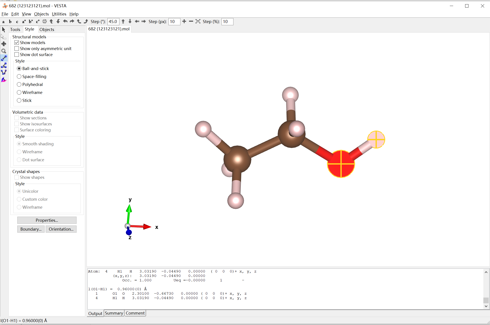
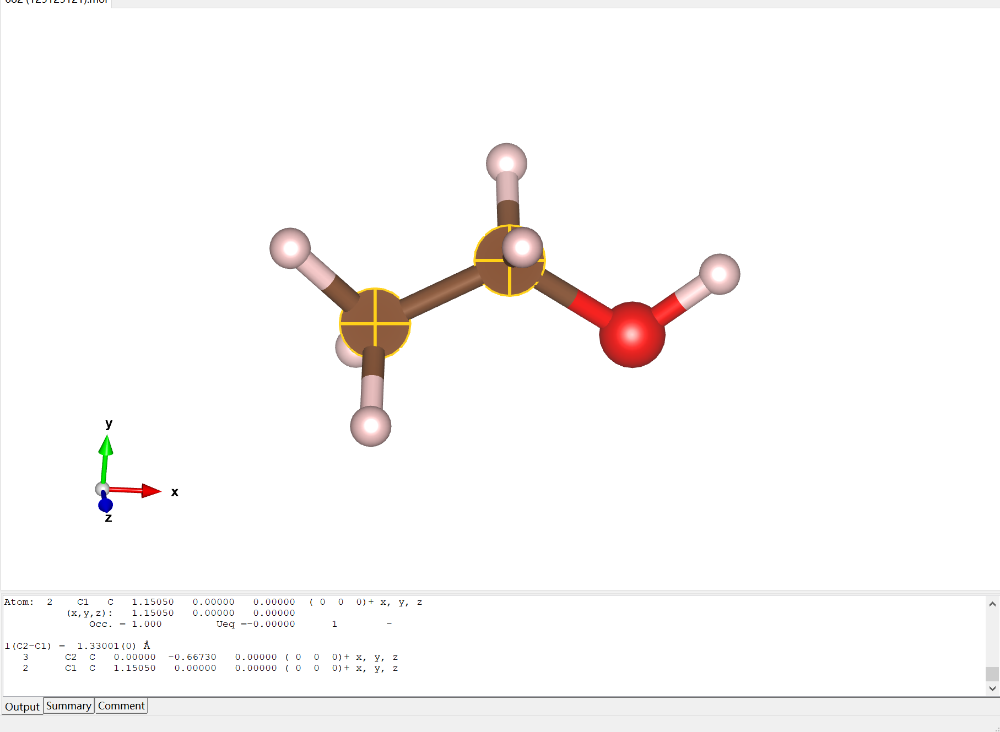
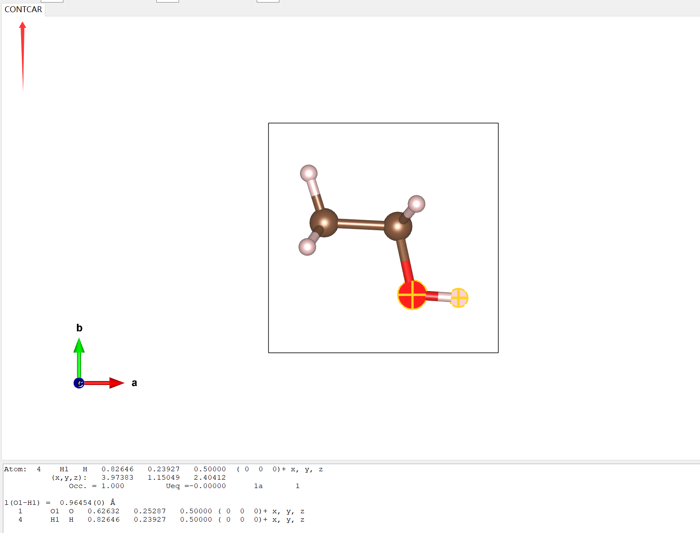
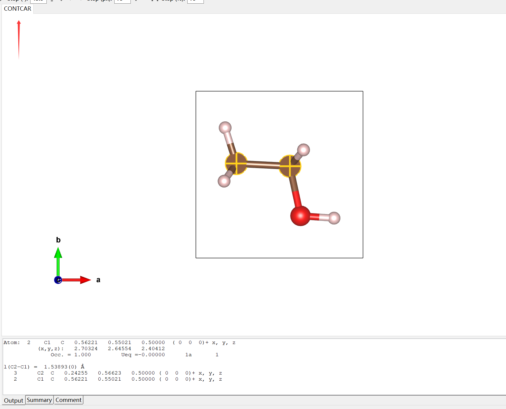
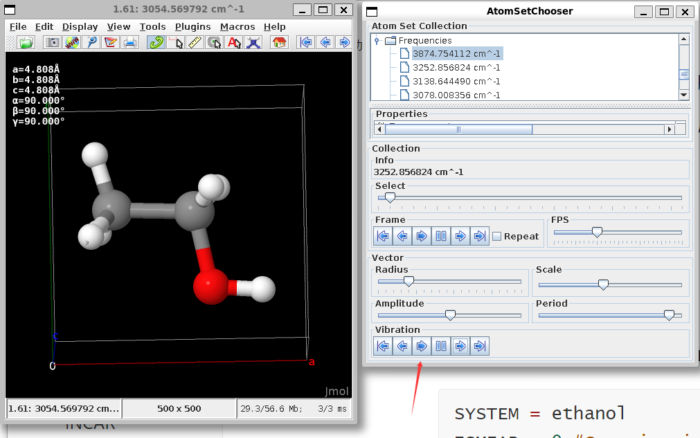

## 乙醇分子的结构优化

### INCAR

```INCAR
SYSTEM = ethanol
ISMEAR = 0 #Gaussian ismear, for insulator
SIGMA = 0.01
NSW = 200

IBRION = 2 #Optimizarion
POTIM = 0.01 #a little conservative step
```

### KPOINTS

```bash
K-POINTS
0
Gamma
1 1 1
0 0 0
```

### POSCAR

```POSCAR
Title
1.0
        4.8082499504         0.0000000000         0.0000000000
        0.0000000000         4.8082499504         0.0000000000
        0.0000000000         0.0000000000         4.8082499504
    O    C    H
    1    2    6
Direct
     0.747990456         0.438959082         0.500000000
     0.508714210         0.577741385         0.500000000
     0.269437963         0.438959082         0.500000000
     0.900000025         0.568403268         0.500000000
     0.508714210         0.689008479         0.307289552
     0.508714210         0.689008479         0.692710448
     0.100000016         0.583231948         0.500000000
     0.257895302         0.310991525         0.318291476
     0.257895302         0.310991525         0.681708524
```

分子结构可以使用ChemDraw绘制，也可以去RSC的网站上下载https://www.chemspider.com/、

但是不管是下载的mol结构还是ChemDraw导出的mol结构，导入进Vesta里面发现都少了氢原子，笨比博主（😭）至今没找到解决方案，只能笨拙地把mol结构导入到GaussView里面，GaussView会自动补加上氢原子，然后再导入到Vesta中，再导出为POSCAR文件，当然理论上可以手动改POSCAR，不一定要使用可视化软件

### POTCAR

使用基础的不带后缀的PBE赝势

```bash
cat ..potpaw_PBE.64/O/POTCAR ..potpaw_PBE.64/C/POTCAR ..potpaw_PBE.64/H/POTCAR >> POTCAR
```

### 对比优化前后

简单对比一下键长吧

- 优化前
  - C-C bond: 1.33001(0) Å
  - O-H bond: 0.96000(0) Å





- 优化后
  - C-C bond: 1.53893(0) Å
  - O-H bond: 0.96454(0) Å





## 频率计算

频率计算的作用：

- 确定结构是否稳定
- 看振动方式和大小，用来和实验对比
- 反应热，反应能垒，吸附能等的零点能矫正
- 确认过渡态(有一个振动的虚频)
- 热力学中计算`entropy`，用于计算化学势，微观动力学中的指前因子和反应能垒。

### POSCAR

使用先前优化的`CONTCAR`作为`POSCAR`

### INCAR

修改一下IBRION，计算频率(`IBRION = 5`)而非结构优化(`IBRION = 2`)

```INCAR
SYSTEM = ethanol
ISMEAR = 0 #Gaussian ismear, for insulator
SIGMA = 0.01
NSW = 1
IBRION = 5 #freq calculation
POTIM = 0.01 #a little conservative step
EDIFF = 1E-8
NFREE = 2
```

### Jmol分析频率

```bash
jmol OUTCAR
```

Tools-AtomSetChooser-Frequencies



