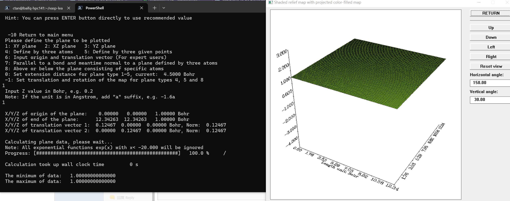
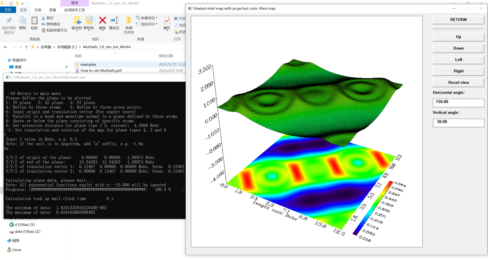

**本文仅为学习记录，并非教程**

`Multiwfn`是一个波函数分析程序，功能非常强大，也能绘制ELF等值面图，它支持多种类型的输入文件，既有量子化学计算程序的输出文件，又有第一性原理计算程序的输出文件

-1756610428425-1.png)

以下是`Multiwfn`加载`ELFCAR`绘制等值面图的过程

- step1：[用`ELFCAR`绘图其实是基于格点数据文件的绘图，需要修改根目录下的配置文件`settings.ini`，将参数`iuserfunc`改为-1或者-3](http://sobereva.com/452)
- step2：加载`ELFCAR`文件
- step3：4 Output and plot specific property in a plane
- step4：100 User-defined function (iuserfunc=
- step5：5 Shaded relief map with projection
- step6：1: XY plane
- step7：1a

如果将`Multiwfn`的根目录添加到`PATH`环境变量以方便调用，那么画出来的图可能会遇到如下如题

如果直接在根目录下双击`.exe`文件运行的话就能正常绘图

