**本文仅为学习记录，并非教程**

这次记录文主要侧重于应用，参考了Sob老师的博文和网络上的各大教程

## 以FCC Cu为例进行ELF计算与分析

采用FCC面心立方最密堆积的铜单胞，使用vasp计算，先进行结构优化，确认收敛后进行ELF计算

```INCAR
Global Parameters
ISTART =  1            (Read existing wavefunction, if there)
ISPIN  =  2            (Non-Spin polarised DFT)
MAGMOM = 4*0.6
# ICHARG =  11         (Non-self-consistent: GGA/LDA band structures)
LREAL  = .FALSE.       (Projection operators: automatic)
 ENCUT  =  530        (Cut-off energy for plane wave basis set, in eV)
# PREC   =  Accurate   (Precision level: Normal or Accurate, set Accurate when perform structure lattice relaxation calculation)
LWAVE  = .TRUE.        (Write WAVECAR or not)
LCHARG = .TRUE.        (Write CHGCAR or not)
ADDGRID= .TRUE.        (Increase grid, helps GGA convergence)
LASPH  = .TRUE.        (Give more accurate total energies and band structure calculations)
PREC   = Accurate      (Accurate strictly avoids any aliasing or wrap around errors)
# LVTOT  = .TRUE.      (Write total electrostatic potential into LOCPOT or not)
# LVHAR  = .TRUE.      (Write ionic + Hartree electrostatic potential into LOCPOT or not)
# NELECT =             (No. of electrons: charged cells, be careful)
# LPLANE = .TRUE.      (Real space distribution, supercells)
# NWRITE = 2           (Medium-level output)
# KPAR   = 2           (Divides k-grid into separate groups)
# NGXF    = 300        (FFT grid mesh density for nice charge/potential plots)
# NGYF    = 300        (FFT grid mesh density for nice charge/potential plots)
# NGZF    = 300        (FFT grid mesh density for nice charge/potential plots)

Electronic Relaxation
ISMEAR =  1            (Gaussian smearing, metals:1)
SIGMA  =  0.2         (Smearing value in eV, metals:0.2)
NELM   =  90           (Max electronic SCF steps)
NELMIN =  6            (Min electronic SCF steps)
EDIFF  =  1E-08        (SCF energy convergence, in eV)
# GGA  =  PS           (PBEsol exchange-correlation)

Ionic Relaxation
NSW    =  0         (Max ionic steps)
IBRION =  -1            (Algorithm: 0-MD, 1-Quasi-New, 2-CG)
ISIF   =  2            (Stress/relaxation: 2-Ions, 3-Shape/Ions/V, 4-Shape/Ions)
EDIFFG = -2E-02        (Ionic convergence, eV/AA)
# ISYM =  2            (Symmetry: 0=none, 2=GGA, 3=hybrids)
LELF = .TRUE.
NPAR = 1
```

在优化完的结构上进行自洽计算，添加`LELF = .TRUE.`这个参数，确保`ELFCAR`文件输出

**官方wiki还提到必须显示开启`NPAR = 1`**，然而网上的各大教程都没有提到这一点

> If LELF is set, [NPAR](https://www.vasp.at/wiki/index.php/NPAR)=1 has to be set explicitely in the [INCAR](https://www.vasp.at/wiki/index.php/INCAR) file in addition

且有一篇讨论帖：https://wiki.vasp.at/forum/viewtopic.php?t=20020

不过我自己尝试的时候发现超算平台上添加`NPAR = 1`会报错，而在自己电脑上则不会报错，有点迷、、、

用`Vesta`载入`ELFCAR`文件

### **先设置一下等值面数值**

**Isosurface Level**（等值面水平）是一个关键参数，用于控制可视化电子局域化程度的阈值，VESTA会绘制出ELF等于该值的等值面（isosurface），直观展示电子局域化程度高于该阈值的区

Properties-Isosurfaces-Isosurfaces level，设置完后可以按以下`Tab`键就会自动保存应用

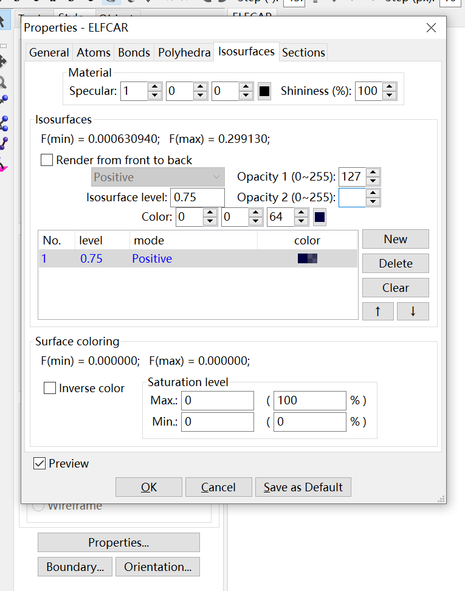

这里如果设置0.75的话啥也看不到，因为铜单胞中存在着金属键，并没有很强的局域化电子，而是均匀分布的电子气

**高定域性通常出现在共价作用区域、孤对电子区域、原子内核及壳层结构区域  **


### 然后就可以查看ELF图了


#### 首先是**3D的图**

左上角-Edit-Lattice planes，新建一个图，根据想查看的面的来设置米勒指数hlk，以及设置距离d

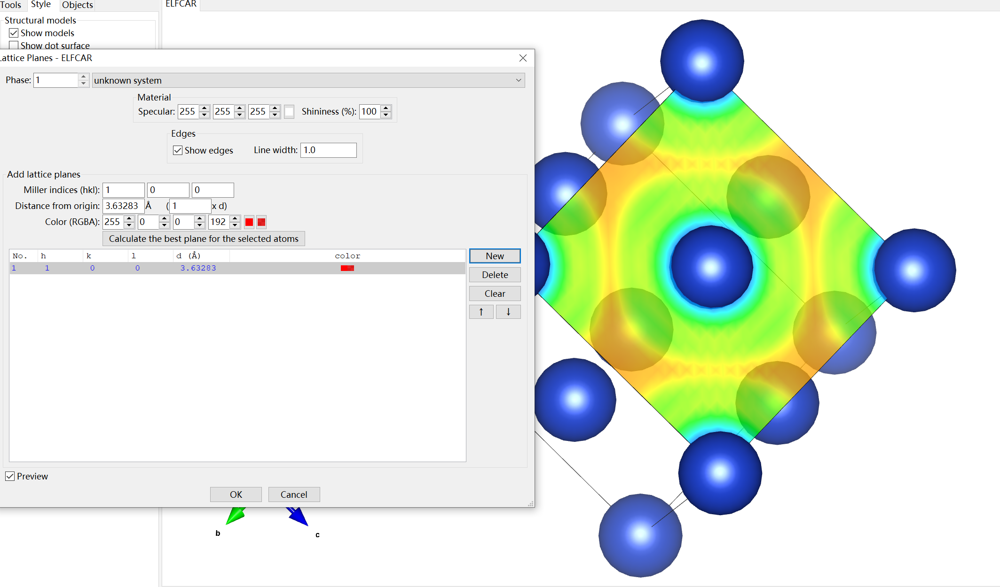

#### 然后是**2D的图**

左上角-Utilities-2D Data Display-Slice即可

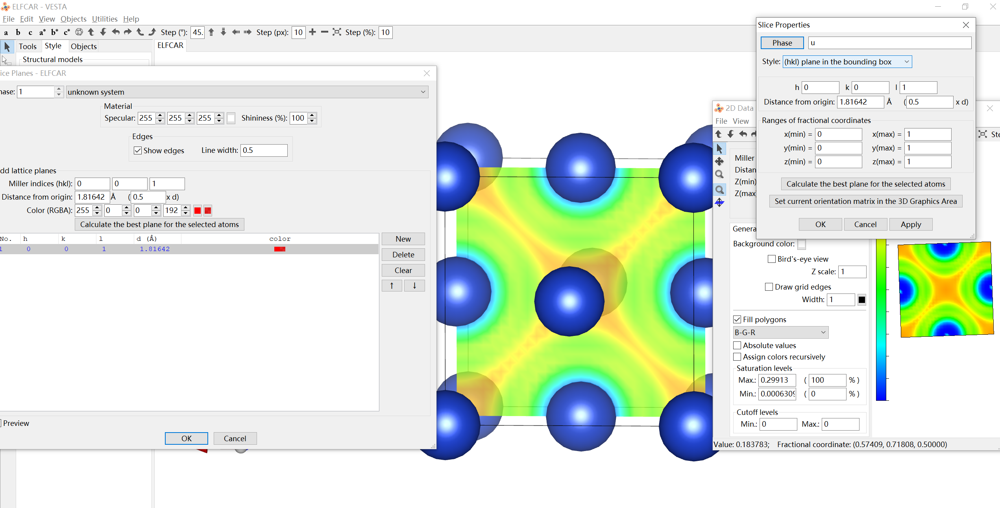

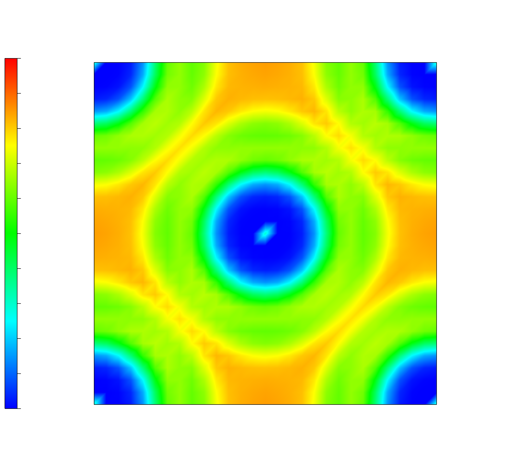

可以看到，顶点Cu与顶点Cu原子之间、顶点Cu和面心Cu之间的电子的局域化程度比较高并且没有明显的偏向偏离

#### **接下来看一下一维时的电子定域化情况**

左上角-Utilities-Line profile即可

- 首先棱上的情况

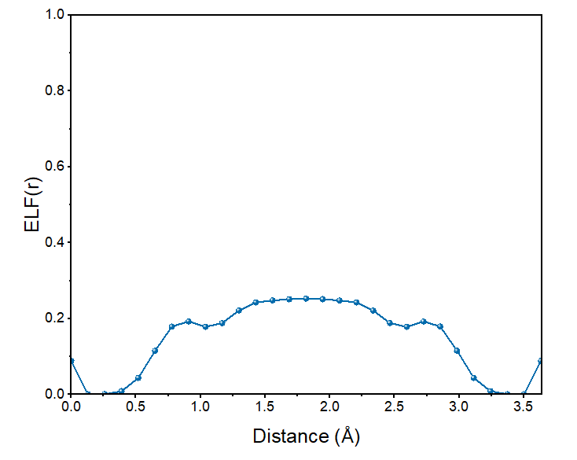

> Cu和Cu两原子中间存在均匀的非零的电子局域函数，虽然不足0.5但分布平坦，这是金属键合的特征

**两个铜原子的ELF(r)值相近**

- 面对角线上的情况

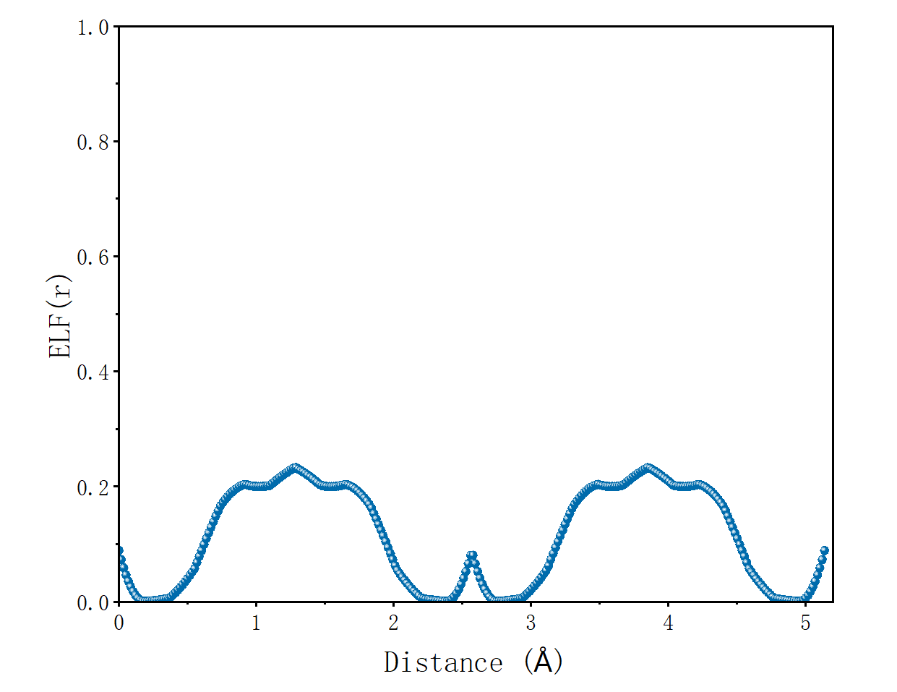

**三个铜原子的ELF(r)值相近**

## 离子晶体CsF

再看一下离子键的情况，以CsF为例

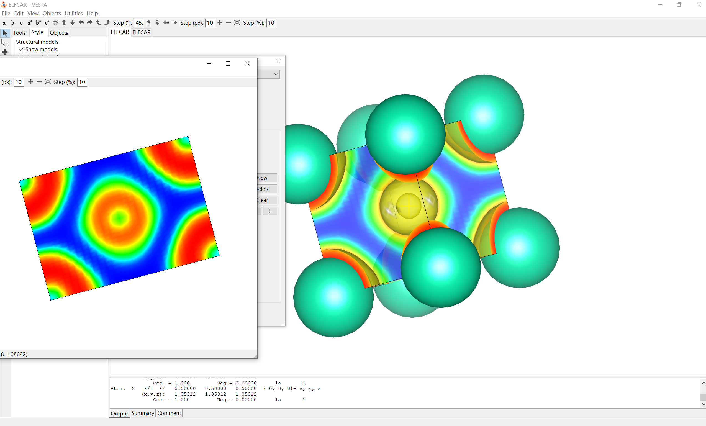

氟和铯之间出现深蓝色，这说明在这个区域电子的分布较为离域化，即氟和铯之间不存在共用电子，键的类型偏向离子键

再看看对角线上的电荷分布

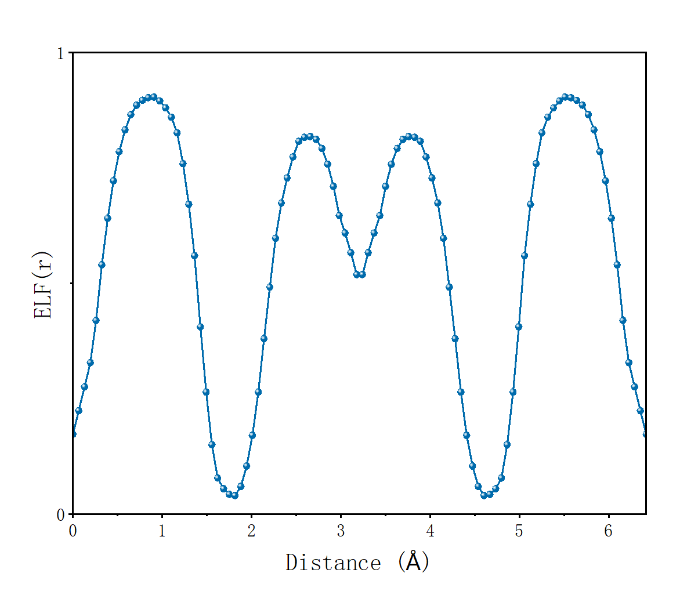

两端为铯中间为氟，可以看到氟和铯ELF(r)值差别较大

## 共价晶体——硅

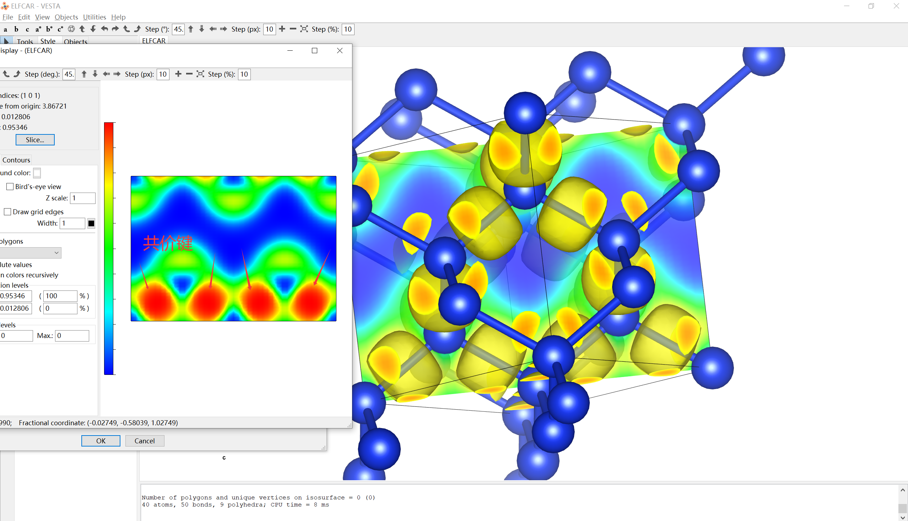

如箭头所指，硅原子和硅原子之间有较强的电子定域化作用，键的类型为共价键

如下图，体对角线上的ELF图也能很好证明，Si-Si之间的区域电子化定域程度极高，呈现明显的尖峰

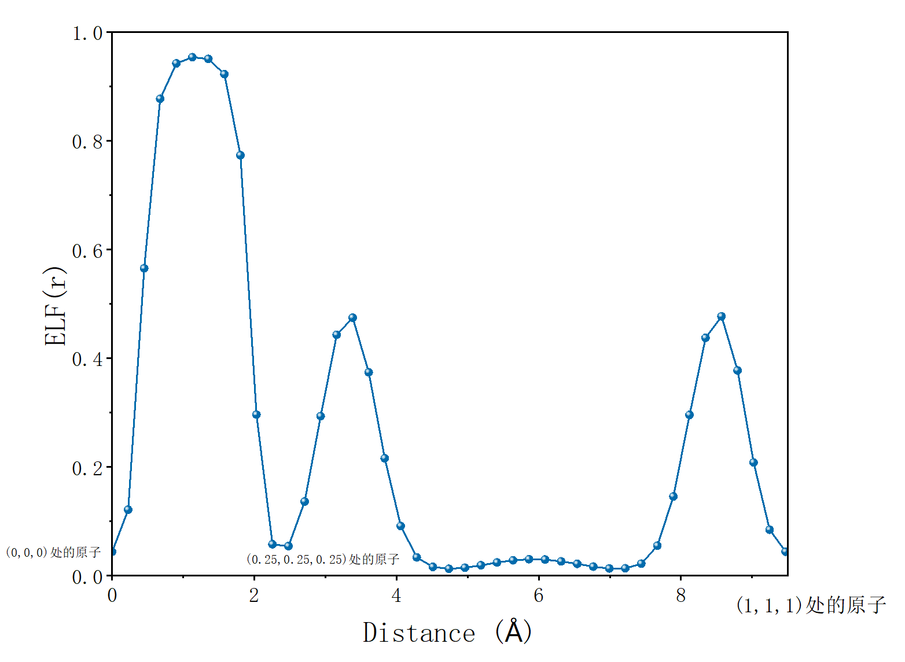

## 共价晶体——灰锡

我仍记得高中时课本讲的一个稍微有些特殊的例子——灰锡，灰锡是一个**共价晶体**

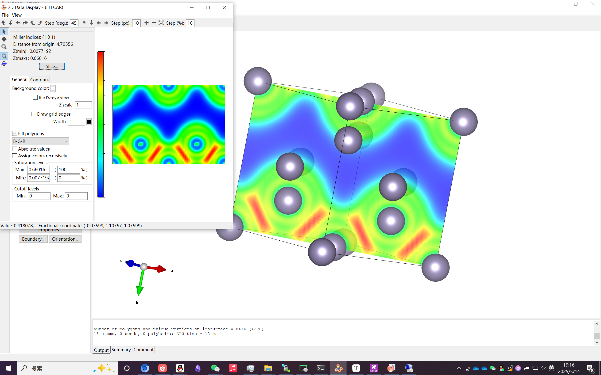

可以看到，灰锡与晶体硅结构上类似，Sn($\frac{1}{4},\frac{1}{4},\frac{1}{4}$)与Sn(0,0,0)与以及Sn(0.5,0.5,0)成键，Sn($\frac{3}{4},\frac{3}{4},\frac{1}{4}$)与Sn(0.5,0.5,0)和Sn(1,1,0)成键。成键电子局域化程度较高，为共价电子

