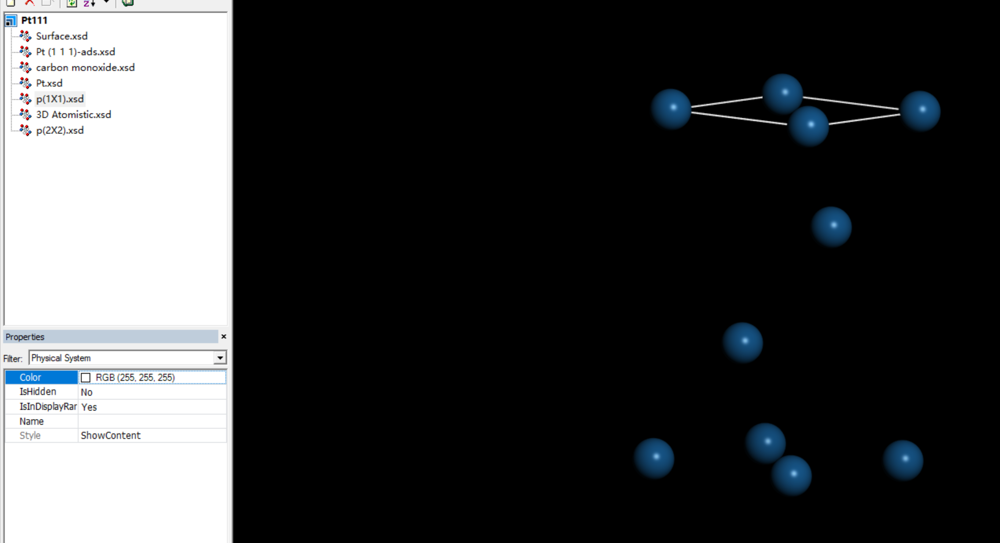
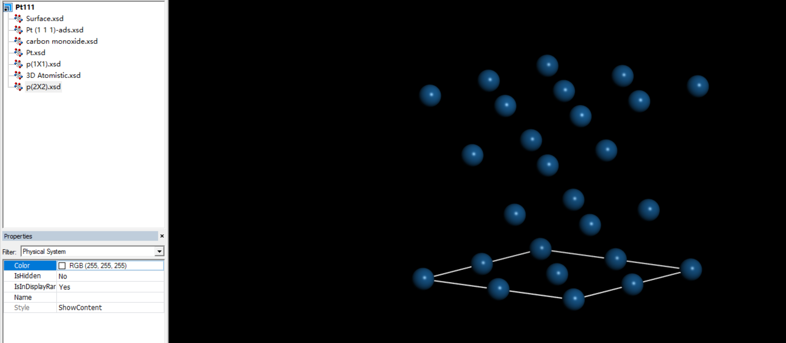
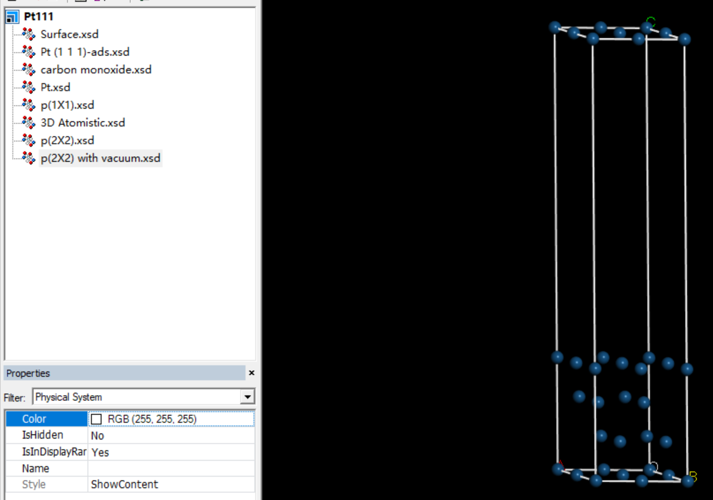
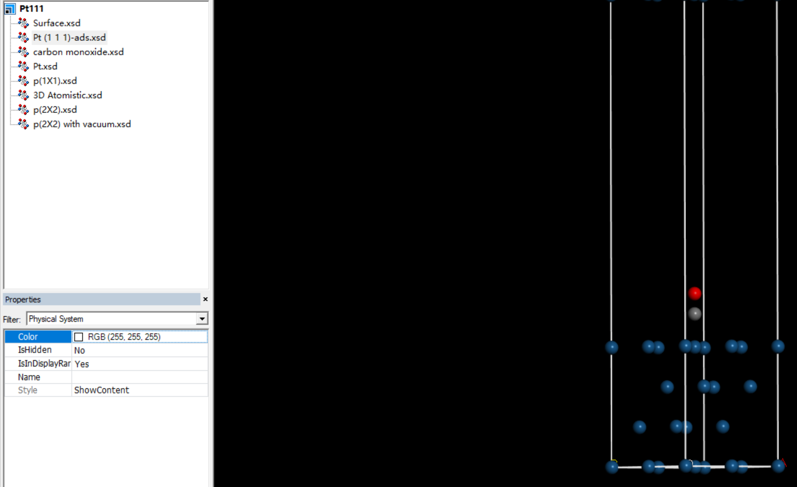
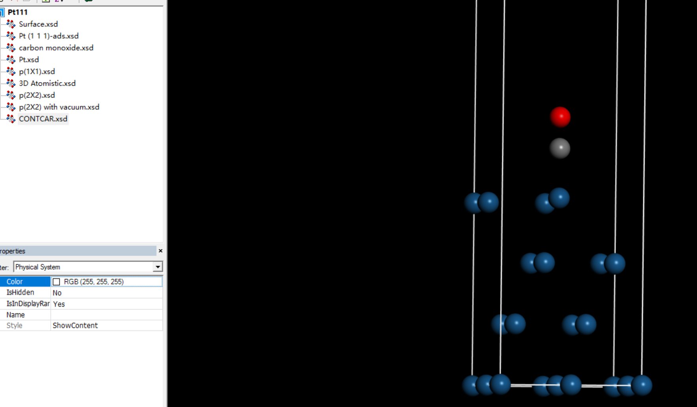
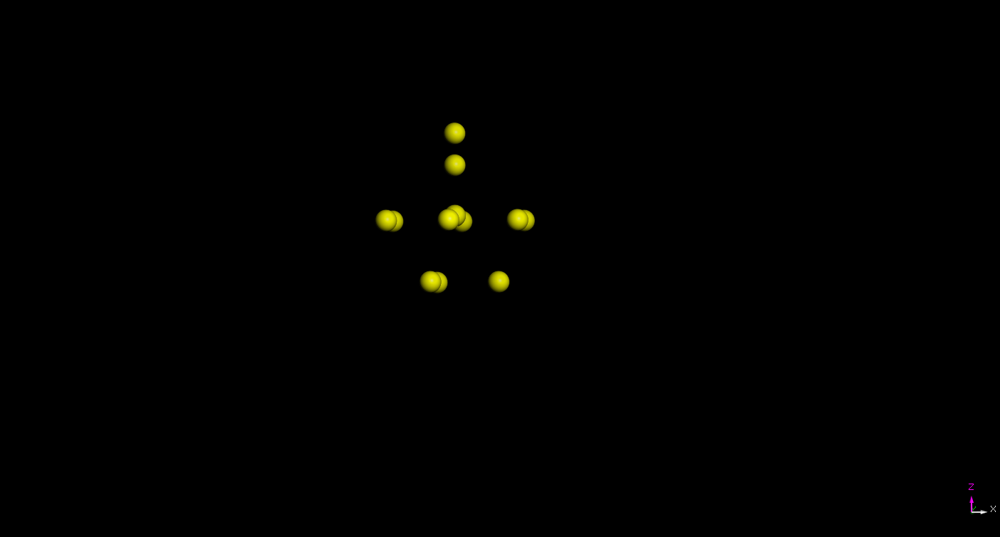
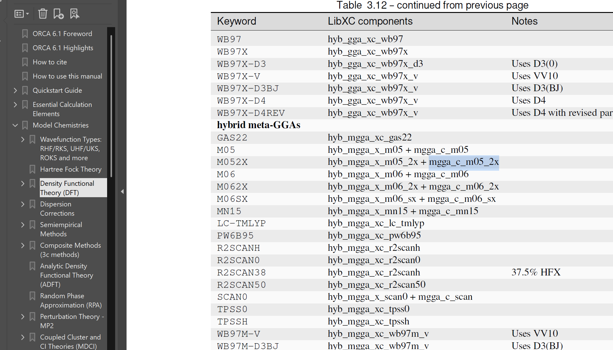

假期简单复习的了一下`LVTHW`的部分内容，也顺便练习了一下`吸附能`的计算。练习例子是一篇[小NC_Nat Commun_ 13, 6853 (2022)](https://www.nature.com/articles/s41467-022-34507-y)中的一个示例，引用量看起来还蛮高的


文章提出了PBE+D3/M06 混合计算方法，用于精准描述过渡金属表面吸附能和反应势垒，首先来试一下PBC边界条件下的PBE计算
# VASP的周期性计算部分
文献中的例子比较多，选了一个经典的CO在Pt(111)晶面上的吸附。
## 建模
首先是建立模型，FCC的Pt晶胞来自于`Material Studio`中自带的例子，根据文献，本次结构的吸附气体覆盖度为$\dfrac{1}{4}$，那么表面将会有4个Pt原子。
首先对Pt的FCC的惯用晶胞切一下，切出 111晶面，文献提到结构是`four-layered slab`，那么切的时候的`thickness`设置为4。
这样就得到了p($1\times 1$)的原胞：

但此时表面的Pt原子只有一个，所以还需要扩胞成4个原子，这样才满足文献提到的$\dfrac{1}{4}$的覆盖度，使用`supercell`功能扩成p($2\times 2$)的胞：

但此时还不是一个完整的晶胞，缺少PBC盒子，比如导出`.cif`文件会报错，需要添加真空层避免周期性镜像的相互作用，文献中的真空层是20埃的，添加真空层之后就是一个完整的晶胞了：

纯净的表面构建完毕，接着构建吸附模型，这里的吸附类型是`Top`顶位吸附，添加碳原子和氧原子（==不要加反了，确认谁是表面😢==），确保Pt-C-O三个原子在一条直线上，Pt-C距离大概是1.85埃，C-O距离大概是1.15埃，不必在意是否有化学键连接，毕竟`POSCAR`结构文件中只记录了原子坐标：

最后构建一氧化碳模型，把一氧化碳分子放进一个空盒子就行，操作方法是首先建立一个空盒子（立方晶胞），盒子大小我设置的22埃，可能稍微有点大？k点用一个`Gamma`点就行。
## 计算
记录下几个关键点就行

- 计算流程
	- 标准弛豫（几何优化）
	- 静态计算
- 计算要点
	- ==开启自旋极化==(`ISPIN=2`)
		- 虽然Pt和CO都是非磁性的，但是在高精度的计算中开启自旋极化有时会带来微小的能量差异，==文献中开启了自旋极化==
		- 对于本征非磁性的体系，开启自旋极化不会导致计算错误，可能的副作用是计算成本提高与收敛困难
	- 不论是几何优化还是静态计算，确保`ISIF=2`即不改变晶胞体积
	- 开启选择性动力学标记，在`POSCAR`第八行（`Direct`或`Cartesian`行上面）写入大写的`S`，根据文献，固定下面两层Pt，开放上面两层Pt以及表面的CO分子
	- 计算时的结构是`固体-真空……`交替的结构，此slab模型是非对称的，z方向存在偶极，随之产生静电势，这会影响周期性边界条件，需要消除这种影响
		- 开启z方向上的偶极校正(`IDIPOL=3`)，修正z方向上的能量
		- 开启对势能和力的修正，`LDIPOL=.TRUE.`，副作用：`显著减慢收敛到电子基态的速度`
	- 化学吸附强度毕竟不如化学键，为了准确描述这种弱相互作用（`GGA-PBE`泛函的描述不够准确）需要开启`DFT-D3`色散校正，高版本的vasp提供了不同`DFT-D3`实现形式，根据文献，使用BJ阻尼`DFT-D3`色散校正，参数为`IVDW=12`
	- 平面波截断能`ENCUT`
		- 几何优化用500
		- 静态计算用700
	- ==ISMEAR=2==，文献中明确提到了：==Partial occupations were obtained using the **Methfessel-Paxton scheme of order 2** with a smearing of **0.2 eV**==，Methfessel-Paxton 方法（`ISMEAR > 0`）是专门为金属设计的。相比于 Gaussian (`ISMEAR = 0`)，它能让总能量关于K点的收敛速度更快。在计算CO的时候==一定改回高斯展宽。==
	- k点选择
		- Gamma撒点
		- 几何优化$4\times4\times1$，静态计算$8\times8\times1$

收敛相对会慢一些：

一共18个原子，用时如下：
```OUTCAR
(base) storm@X16:~/test/ads/ads/opt$ tail OUTCAR
                            User time (sec):    15699.993
                          System time (sec):      101.669
                         Elapsed time (sec):    16178.992

                   Maximum memory used (kb):      628856.
                   Average memory used (kb):          N/A

                          Minor page faults:      1405416
                          Major page faults:            0
                 Voluntary context switches:        14197
```
## 吸附能
根据文献，吸附能的计算公式为：
$$
E_{\text {adsorption}}=E_{\text{ads\_slab}}-E_{\text{slab}}-E_{\text{CO}}
$$
能量的查看可以是`OSZICAR`的最后一行，比如：
```OSZICAR
[lalala728@wh-login01 ST]$ cat OSZICAR 
       N       E                     dE             d eps       ncg     rms          ort
SDA:   1    -0.147968374953E+02   -0.14797E+02    0.00000E+00    16   0.129E-07 0.000E+00
CGA:   2    -0.147968374962E+02   -0.96497E-09   -0.25614E-08    16   0.690E-08 0.834E-08
CGA:   3    -0.147968374956E+02    0.63460E-09   -0.10626E-08    16   0.437E-08 0.440E-08
CGA:   4    -0.147968374847E+02    0.10848E-07   -0.41650E-08    16   0.475E-07-0.591E-08
CGA:   5    -0.147968374883E+02   -0.36002E-08   -0.42707E-08    16   0.418E-09 0.790E-09
CGA:   6    -0.147968374886E+02   -0.28069E-09    0.55850E-11    16   0.266E-09 0.754E-10
   1 F= -.14808028E+02 E0= -.14808028E+02  d E =-.364215E-19
```
`Methfessel-Paxton`方法会引入非物理的熵项 ($T\Delta S$)，其中：
- F是自由能 (Free energy, 包含熵)。
- $E_0$ 是外推到 0K 的能量 (Energy for sigma->0)
计算吸附能时，必须统一使用$E_0$

我最初的计算为：
$$
E=-118.643-(-92.526)-(-14.797)=-11.32~\text{eV}
$$
与文献相差了-1.86eV，这是一个比较大的误差。检查后发现纯净的slab以及一氧化碳分子在计算的时候没有开启`DFT-D3`色散校正，开启后结果变成了：
$$
E=-118.643-(-101.677)-(-14.808)=-2.185~ \text{eV}
$$
距离文献还有0.3 eV的差距，最后发现文献中开启了自旋极化，开启之后大约的确是复现成功了：
$$
E=-118.640-(-101.969)-(-14.808)=-1.863~\text{eV} \approx -42.96~\text{kcal/mol}
$$
接近文献中提到的：
>>The PBE+D3 predicted an adsorption energy of **-42.9 kcal mol⁻¹** for CO at the top site of the surface...

# 量子化学计算部分
PBE+D3预测预测的吸附能与实验值仍有差距(==-29.6 ± 3.4 kcal/mol==)，用`VASP`做的PBE+D3 计算严重高估了吸附能，应当进行如下修正：
$$
E_{\text{ads}}^{\text{Final}}=E_{\text {Ads, PBC}}^{\rm {PBE+D3}}+({E_\text{Ads, Cluster}^{\rm M06}}-E_{Ads, \rm Cluster}^{\rm {PBE+D3}})
$$
## 建模
取vasp几何优化之后的结构：

`Symmetry-Unbuild Crystal`，这样盒子就被删掉了，然后手动选中原子删除，顶层吸附位点周围六个Pt原子、次顶层三个原子，构建这样一个原子团簇：

## 计算结果


吸附能计算：
$$
{E_\text{Ads, Cluster}^{\rm \omega B97M-V}}=-0.07743 ~\rm Eh
$$
$$
{E_\text{Ads, Cluster}^{\rm PBE+D3}}=-0.07925~\rm Eh
$$

最终的吸附能：
$$
E=-1.863 ~\rm{eV}+(-0.07743+0.07925)\times27.211386 ~\rm(eV)=-1.81347

$$

这是第一次计算的结果，很顺利踩坑了，因为所有的自旋多重度都设置的一，关键在于`自旋多重度`的设置：
$$

\text{Multiplicity}=2S+1=e_{\alpha}-e_{\beta}+1
$$
$$

∣S_1​−S_2​−...−S_{10}​∣\le \text{Multiplicity} \le   |S_1​+S_2​+...+S{10}|​

$$
所以用单点能计算任务(`PBE-D3/def2-TZVP`)测试了一下自旋多重度，发现对于吸附团簇来讲，自旋多重度为3时能量最低，而对于裸团簇来讲，自旋多重度为7时能量最低，分别应用这两个自旋多重度进行计算，而闭壳层的CO自旋多重度自然是1，以下所有基于DFT方法计算的基组均为def2-TZVP。

首先试了一下$\rm{\omega B97M-V}$

$$
\begin{align}
{E_\text{Ads, Cluster}^{\rm \omega B97M-V}}&= (-1306.042338809542) - (-1192.630891831586) - (-113.338691492256) = -0.072755485700\ \text{Eh} \\
&= -1.97987630572\ \text{eV} \\
&= −45.65475\ \text{kcal/mol}
\end{align}
$$
$$
\begin{align}
{E_\text{Ads, Cluster}^{\text{PBE+D3}}}&=(-1307.585520827298) - (-1194.273378678571) - (-113.234775522846) = -0.077366625881\ \text{Eh} \\
&= -2.10525313939\ \text{eV} \\
&= −48.54829\ \text{kcal/mol}
\end{align}
$$

如果使用$\omega B97M-V$做修正，那么最后算出的吸附能为：

$$
\begin{align}
E&=-1.863~\text{eV}+(-1.97987630572~\text{eV})-(-2.10525313939~\text{eV})\\
&=-1.7376232~\text{eV}\\
&=-40.07115~\text{kcal/mol}
\end{align}
$$
里文献还有一些差异，再换成M06再试试：

$$
\begin{align}
{E_\text{Ads, Cluster}^{\rm M06}}&=(-1307.117290599373) - (-1193.751153760116) - (-113.301440916919) = -0.064695922338\ \text{Eh} \\
&= -1.76047256862\ \text{eV} \\
&= -40.5882421556\ \text{kcal/mol}
\end{align}
$$
如果使用M06做修正，那么最后算出的吸附能为：
$$
\begin{align}

E&=-1.863~\text{eV}+(-1.76047256862~\text{eV})-(-2.10525313939~\text{eV})\\
&=-1.5182194~\text{eV}\\
&=-35.0115~\text{kcal/mol}

\end{align}
$$
还是有比较大的差距，从补充信息里面发现作者似乎用的Spin 5，但是我扫描的结果却是裸团簇Spin 7的时候能量最低，抱着试一试的态度用M06泛函再扫了一次发现这次是Spin 5的时候能量最低。于是再Spin 5下再次进行了计算：
$$\begin{aligned}
E_{\mathrm{ads}}^{\mathrm{PBE}} & =(-1307.585521)-(-1194.270302)-(-113.234776) \\
 & =-0.080443\mathrm{~Eh} \\
 & =-2.189\mathrm{~eV}
\end{aligned}$$
$$\begin{aligned}
E_{\mathrm{ads}}^{\mathrm{M06}} & =(-1307.117291)-(-1193.753296)-(-113.301441) \\
 & =-0.062554\mathrm{~Eh} \\
 & \mathrm{=-1.702~eV}
\end{aligned}$$
$$\begin{aligned}
E_{\mathrm{ads}}^{\omega\mathrm{B97M-V}} & =(-1306.042339)-(-1192.618183)-(-113.338691) \\
 & =-0.085465\mathrm{~Eh} \\
 & =-2.326\mathrm{~eV}
\end{aligned}$$
最终修正结果如下：
$$\begin{aligned}
E_{\mathrm{Final}}^{\mathrm{M06}} & =-1.863+[(-1.702)-(-2.189)] \\
 & =-1.863+0.487 \\
 & =-1.376\mathrm{~eV} \\
 & \approx-31.74\mathrm{~kcal/mol}
\end{aligned}$$
$$\begin{aligned}
E_{\mathrm{Final}}^{\omega\mathrm{B97M-V}} & =-1.863+[(-2.326)-(-2.189)] \\
 & =-1.863-0.137 \\
 & =-2.000\mathrm{~eV} \\
 & \approx-46.11\mathrm{~kcal/mol}
\end{aligned}$$
但是不太敢相信对于过渡金属团簇吸附能的计算，老泛函M06比$\rm{\omega B97M-V}$更加优秀，遂使用`DLPNO-CCSD(T)/def2-TZVPP`级别再次计算了一下：
$$
\begin{align}
E_{\text {Ads,Cluster}}^{\text{DLPNO-CCSD(T)}}&= -1303.19632675218~\text{Eh}-(-1189.94842992788~\text{Eh})-(-113.158128734305~\text{Eh})\\
&=-0.089768089995~\text{Eh}\\
&=-2.4426525664269465~\text{eV}\\
\end{align}
$$
如果使用DLPNO-CCSD(T)做修正，那么最后算出的吸附能为：
$$
\begin{align}
E&=-1.863~\text{eV}+(-2.4426525664269465~\text{eV})-(-2.189~\text{eV})\\
&=-2.1166525664269465~\text{eV}\\
&=-48.81191316911517054185~\text{kcal/mol}
\end{align}
$$
很顺利的翻车了，Pt的价电子排布是$\rm 5d^9 6s^1$，体系是含有10个Pt的金属团簇，开壳层体系，可能是体系的多参考特征比较强，查看了一下输出文件果然是这样。
对于吸附模型，我的自旋多重度是5，那么自旋量子数$S=\dfrac{(5-1)}{2}=2$，总自旋量子数$<S^2>=S(S+1)=6$，部分输出信息：
```out
T1 diagnostic                              ...      0.045926612                              

<S**2>(linearized)                         ...      6.3661646 (ideal value:      6.0000000)
------------------------------------------------------------------------------------------------------
Expectation value of <S**2>     :     9.090611

Ideal value S*(S+1) for S=2.0   :     6.000000

Deviation                       :     3.090611
```
再看看裸团簇的：
```out
T1 diagnostic                              ...      0.049390694                              
<S**2>(linearized)                         ...      6.4633603 (ideal value:      6.0000000)
------------------------------------------------------------------------------------------------------
Expectation value of <S**2>     :     9.286144
Ideal value S*(S+1) for S=2.0   :     6.000000
Deviation                       
```
最后看看闭壳层分子CO的：
```out
Singles Norm <S|S>**1/2                    ...      0.058876257  
T1 diagnostic                              ...      0.018618307  

```
很明显T1诊断给出的结果明显偏大，是多参考体系，这也是`DLPNO-CCSD(T)`结果不准确的原因，这么大的体系用多参考方法做计算也显然不现实！
至于DFT的结果：M06为什么能算准而其他诸如双杂化泛函翻车我也确实不太能解释，可能是泛函利用UKS 的对称性破缺修正了能量？？？
总结了一下各个泛函计算后的总自旋量子数的情况：


| Structure         | $<S^2>$ expectation | $<S^2>$ ideal | $<S^2>$ deviation | T$_1$ diagnostic | Method        | Basis set  |
| :---------------- | :------------------ | :------------ | :---------------- | :--------------- | :------------ | :--------- |
| Cluster           | 7.42353             | 6             | 1.42353           |                  | B3LYP-D4      | def2-QZVP  |
| Cluster           | 7.42353             | 6             | 1.42353           |                  | B3LYP-D3BJ    | def2-QZVP  |
| Cluster           | 7.423529            | 6             | 1.423529          |                  | B3LYP         | def2-QZVP  |
| Ads cluster       | 6.645988            | 6             | 0.645988          |                  | B3LYP         | def2-QZVP  |
| Ads cluster       | 6.645988            | 6             | 0.645988          |                  | B3LYP-D3BJ    | def2-QZVP  |
| Cluster           | 9.286144            | 6             | 3.286144          | 0.049390694      | DLPNO         | def2-TZVPP |
| Ads cluster       | 9.090611            | 6             | 3.090611          | 0.045926612      | DLPNO         | def2-TZVPP |
| Cluster           | 6.830101            | 6             | 0.830101          |                  | M06           | def2-QZVP  |
| Cluster           | 6.763179            | 6             | 0.763179          |                  | M06           | def2-TZVP  |
| Ads cluster       | 6.31562             | 6             | 0.31562           |                  | M06           | def2-QZVP  |
| Cluster           | 6.649309            | 6             | 0.649309          |                  | PBE-D3BJ      | def2-TZVP  |
| Ads cluster       | 6.017272            | 6             | 0.017272          |                  | PBE-D3BJ      | def2-TZVP  |
| Cluster           | 7.91564             | 6             | 1.91564           |                  | PBE0          | def2-TZVP  |
| Ads cluster       | 7.030855            | 6             | 1.030855          |                  | PBE0          | def2-QZVP  |
| Cluster           | 8.338167            | 6             | 2.338167          |                  | PWPB95        | def2-QZVP  |
| Ads cluster       | 7.524001            | 6             | 1.524001          |                  | PWPB95        | def2-QZVP  |
| Cluster           | 8.338167            | 6             | 2.338167          |                  | PWPB95-D4     | def2-QZVP  |
| Ads cluster       | 7.524001            | 6             | 1.524001          |                  | PWPB95-D4     | def2-QZVP  |
| Ads cluster       | 7.533567            | 6             | 1.533567          |                  | R2SCAN0       | def2-QZVP  |
| Cluster           | 8.583892            | 6             | 2.583892          |                  | SCAN0         | def2-QZVP  |
| Ads cluster       | 7.467305            | 6             | 1.467305          |                  | SCAN0         | def2-QZVP  |
| Cluster           | 7.038397            | 6             | 1.038397          |                  | TPSS          | def2-QZVP  |
| Ads cluster       | 6.127104            | 6             | 0.127104          |                  | TPSS          | def2-QZVP  |
| Cluster           | 8.190075            | 6             | 2.190075          |                  | TPSS0-D4      | def2-QZVP  |
| Ads cluster       | 7.133094            | 6             | 1.133094          |                  | TPSS0-D4      | def2-QZVP  |
| Cluster           | 7.11102             | 6             | 1.11102           |                  | TPSSh         | def2-QZVP  |
| Ads cluster       | 6.624638            | 6             | 0.624638          |                  | TPSSh         | def2-QZVP  |
| Cluster           | 8.22399             | 6             | 2.22399           |                  | wB97M-V       | def2-QZVP  |
| Cluster           | 8.074089            | 6             | 2.074089          |                  | wB97M-V       | def2-TZVP  |
| Monoxide molecule |                     |               |                   | 0.020036319      | DLPNO-CCSD(T) | def2-TZVPP |



在做DLPNO-CCSD(T)之前，也考虑过是BSSE的误差，文献也明确提到了，于是采用更大的基组def2-QZVP尽可能消除BSSE误差，依然是除了M06和B3LYP基本都翻车，算是一些无用功，整理的数据如下。

| Function/basis           | Ads cluster (Spin 5) | Bare cluster (Spin 5) | Monoxide molecule (Spin 1) | Ads (eV)     | Final (eV)   | Final (kcal/mol) |
| :----------------------- | :------------------- | :-------------------- | :------------------------- | :----------- | :----------- | :--------------- |
| PBE-D3                   | -1307.585521         | -1194.270302          | -113.2347755               | -2.188925172 | -1.862925172 | -42.9607311      |
| M06                      | -1307.117291         | -1193.753296          | -113.3014409               | -1.702131353 | -1.376131353 | -31.73482752     |
| $\omega$B97M-V           | -1306.042339         | -1192.618183          | -113.3386915               | -2.325552839 | -1.999552839 | -46.11148807     |
| DLPNO-CCSD(T)/def2-TZVPP | -1303.196327         | -1189.94843           | -113.1581287               | -2.442652566 | -2.116652566 | -48.81191317     |
| MN15                     | -1305.158483         | -1191.836939          | -113.2438128               | -2.115127547 | -1.789127547 | -41.25889145     |
| TPSS                     | -1307.01858          | -1193.574495          | -113.3744827               | -1.893916048 | -1.567916048 | -36.15755519     |
| TPSSh                    | -1306.786495         | -1193.353985          | -113.3595549               | -1.985171262 | -1.659171262 | -38.26198255     |
| TPSS0-D4                 | -1306.546916         | -1193.130064          | -113.3384528               | -2.133283227 | -1.807283227 | -41.67757776     |
| PWPB95-D4                | -1305.271685         | -1191.889498          | -113.2960491               | -2.343871299 | -2.017871299 | -46.53392825     |
| PWPB95                   | -1305.258767         | -1191.879864          | -113.2957172               | -2.263550789 | -1.937550789 | -44.681665       |
| B3LYP-D3(BJ)             | -1306.846736         | -1193.460863          | -113.3110755               | -2.035295218 | -1.709295218 | -39.41788608     |
| B3LYP-D4                 | -1306.829099         | -1193.444594          | -113.3109833               | -2.000579197 | -1.674579197 | -38.61730339     |
| B3LYP                    | -1306.71305          | -1193.34303           | -113.3103477               | -1.623736953 | -1.297736953 | -29.92698211     |
| PBE0                     | -1306.828955         | -1193.524534          | -113.2310197               | -1.997280784 | -1.671280784 | -38.54123904     |
| R2SCAN0                  | -1306.822109         | -1193.461035          | -113.2803062               | -2.197761086 | -1.871761086 | -43.16449523     |
| SCAN0                    | -1306.730149         | -1193.367917          | -113.2889399               | -1.994327977 | -1.668327977 | -38.47314465     |
| M06                      | -1307.143993         | -1193.772441          | -113.3088975               | -1.704861915 | -1.378861915 | -31.79779673     |
| MN15                     | error                | error                 | -113.304667                | #VALUE!      | #VALUE!      | #VALUE!          |
| PWPB95 D4                | -1305.773859         | -1192.388853          | -113.3078275               | -2.100087022 | -1.774087022 | -40.91204342     |
| PWPB95                   | -1305.760942         | -1192.379219          | -113.2957172               | -2.3402638   | -2.0142638   | -46.45073607     |
| R2SCAN0                  | -1306.855674         | -1193.501377          | -113.285907                | -1.860946472 | -1.534946472 | -35.39724709     |
| SCAN0                    | -1306.766073         | -1193.399823          | -113.2948917               | -1.941713495 | -1.615713495 | -37.25980735     |
| TPSS                     | -1307.056197         | -1193.60716           | -113.3802364               | -1.872120731 | -1.546120731 | -35.65493556     |
| TPSSh                    | -1306.822915         | -1193.386111          | -113.3651449               | -1.949888753 | -1.623888753 | -37.44833614     |
| TPSS0-D4                 | -1306.58189          | -1193.161494          | -113.3438373               | -2.083233109 | -1.757233109 | -40.52337699     |
| wB97M-V                  | WAIT                 | -1192.651556          | -113.3442127               | #VALUE!      | #VALUE!      | #VALUE!          |
| B3LYP                    | -1306.742404         | -1193.366257          | -113.3168517               | -1.613450558 | -1.287450558 | -29.68976857     |
| B3LYP-D3(BJ)             | -1306.876089         | -1193.48409           | -113.3175795               | -2.025008731 | -1.699008731 | -39.18067044     |
| B3LYP-D4                 | -1306.858452         | -1193.467821          | -113.3174873               | -1.990292607 | -1.664292607 | -38.38008537     |

虽然做了很多探索（无用功😢，当个笑话罢），但也算成功走流程、复现了文献✌️。

**Old is gold? May be for the case?**
# UMA模型验证

BTW，后面在`huggingface`上申请了一下Meta家的UMA模型： A Family of Universal Models for Atoms进行推理，尝试计算吸附能：


计算准确度非常不错，使用的==uma-m-1p1.pt==模型进行推理，所有计算任务在自己的笔记本电脑上完成：
```
storm@storm ~ $ fastfetch    
        -/oyddmdhs+:.                 storm@storm  
    -odNMMMMMMMMNNmhy+-`              -----------  
  -yNMMMMMMMMMMMNNNmmdhy+-            OS: Gentoo Linux x86_64  
`omMMMMMMMMMMMMNmdmmmmddhhy/`         Host: X16 (1)  
omMMMMMMMMMMMNhhyyyohmdddhhhdo`       Kernel: Linux 6.18.12-gentoo-gentoo-dist  
.ydMMMMMMMMMMdhs++so/smdddhhhhdm+`    Uptime: 9 mins  
oyhdmNMMMMMMMNdyooydmddddhhhhyhNd.    Packages: 1501 (emerge)  
 :oyhhdNNMMMMMMMNNNmmdddhhhhhyymMh    Shell: bash 5.3.9  
   .:+sydNMMMMMNNNmmmdddhhhhhhmMmy    Display (BOE0A0B): 2560x1600 @ 1.25x in 16", 165 Hz [Built-in]  
      /mMMMMMMNNNmmmdddhhhhhmMNhs:    DE: KDE Plasma 6.5.5  
   `oNMMMMMMMNNNmmmddddhhdmMNhs+`     WM: KWin (Wayland)  
 `sNMMMMMMMMNNNmmmdddddmNMmhs/.       WM Theme: Sweet-Dark-transparent  
/NMMMMMMMMNNNNmmmdddmNMNdso:`         Theme: Breeze (WhiteSurDark) [Qt], Breeze-Dark [GTK2], Breeze [GTK3]  
+MMMMMMMNNNNNmmmmdmNMNdso/-           Icons: Tela-circle-purple-light [Qt], Tela-circle-purple-light [GTK2/3/4]  
yMMNNNNNNNmmmmmNNMmhs+/-`             Font: Noto Sans (10pt) [Qt], Noto Sans (10pt) [GTK2/3/4]  
/hMMNNNNNNNNMNdhs++/-`                Cursor: Oxygen_White (24px)  
`/ohdmmddhys+++/:.`                   Terminal: konsole 25.8.3  
 `-//////:--.                         CPU: AMD Ryzen 7 7840HS (16) @ 5.14 GHz  
                                      GPU: AMD Radeon 780M Graphics [Integrated]  
                                      Memory: 5.81 GiB / 30.52 GiB (19%)  
                                      Swap: 0 B / 16.00 GiB (0%)  
                                      Disk (/): 200.38 GiB / 234.00 GiB (86%) - btrfs  
                                      Disk (/run/media/storm/Data): 593.09 GiB / 701.87 GiB (85%) - ntfs3  
                                      Local IP (wlp2s0): 192.168.2.135/24  
                                      Battery (BASE-BAT): 99% [AC Connected]  
                                      Locale: zh_CN.UTF-8
```
尽管有的预设明显不合理，但还是分别是用了如下预设进行吸附能的计算并统计时间：
- **oc20:** use this for catalysis
- **omat:** use this for inorganic materials
- **omol:** use this for molecules
- **odac:** use this for MOFs
- **omc:** use this for molecular crystals
完整的`oc20`预设计算日志如下：
```bash
(fairchem) storm@storm ~/claudecode/fairchem/uma/temp $ time python ../examples/adsorption_energy.py --adsorbed ads_POSCAR --gas CO_POSCAR --surface surfac  
e_POSCAR --model ../uma-m-1p1.pt --task oc20  
============================================================  
ADSORPTION ENERGY CALCULATION  
============================================================  
  
1. Calculating adsorbed system energy...  
System: COPt16  
Atoms: 18  
Loading model: ../uma-m-1p1.pt  
  
--------------------------------------------------------------------------------  
SINGLE POINT CALCULATION  
--------------------------------------------------------------------------------  
 Cell: 5.5492 x 5.5492 x 26.7964 Å  
 Cell: 5.5492 x 5.5492 x 26.7964 Å  
 PBC: [ True  True  True]  
 Volume: 714.61 ų  
WARNING:root:If 'dataset_list' is provided in the config, the code assumes that each dataset maps to itself. Please use 'dataset_mapping' as 'dataset_list'  
is deprecated and will be removed in the future.  
 Calculating energy and forces...  
 Calculating stress...  
 Energy: -98.817862 eV  
 Calculation completed in 1.50 s  
 OUTCAR written to: results/OUTCAR  
 JSON results written to: results/uma_results.json  
 CONTCAR written to: results/CONTCAR  
  
================================================================================  
SUMMARY  
================================================================================  
Total energy:         -98.81786186 eV  
Energy per atom:       -5.48988121 eV/atom  
Max force:              0.52008080 eV/Å  
RMS force:              0.21199445 eV/Å  
Pressure:               1.96439230 GPa  
Calculation time:             1.50 s  
================================================================================  
  Energy: -98.817862 eV  
  
2. Calculating gas molecule energy...  
System: CO  
Atoms: 2  
Loading model: ../uma-m-1p1.pt  
  
--------------------------------------------------------------------------------  
SINGLE POINT CALCULATION  
--------------------------------------------------------------------------------  
 Cell: 17.0000 x 17.0000 x 17.0000 Å  
 Cell: 17.0000 x 17.0000 x 17.0000 Å  
 PBC: [ True  True  True]  
 Volume: 4913.00 ų  
WARNING:root:If 'dataset_list' is provided in the config, the code assumes that each dataset maps to itself. Please use 'dataset_mapping' as 'dataset_list'  
is deprecated and will be removed in the future.  
 Calculating energy and forces...  
 Calculating stress...  
 Energy: -14.437472 eV  
 Calculation completed in 0.60 s  
 OUTCAR written to: results/OUTCAR  
 JSON results written to: results/uma_results.json  
 CONTCAR written to: results/CONTCAR  
  
================================================================================  
SUMMARY  
================================================================================  
Total energy:         -14.43747178 eV  
Energy per atom:       -7.21873589 eV/atom  
Max force:              0.57697660 eV/Å  
RMS force:              0.57697660 eV/Å  
Pressure:               0.00717079 GPa  
Calculation time:             0.60 s  
================================================================================  
  Energy: -14.437472 eV  
  
3. Calculating clean surface energy...  
System: Pt16  
Atoms: 16  
Loading model: ../uma-m-1p1.pt  
  
--------------------------------------------------------------------------------  
SINGLE POINT CALCULATION  
--------------------------------------------------------------------------------  
 Cell: 5.5492 x 5.5492 x 26.7964 Å  
 Cell: 5.5492 x 5.5492 x 26.7964 Å  
 PBC: [ True  True  True]  
 Volume: 714.61 ų  
WARNING:root:If 'dataset_list' is provided in the config, the code assumes that each dataset maps to itself. Please use 'dataset_mapping' as 'dataset_list'  
is deprecated and will be removed in the future.  
 Calculating energy and forces...  
 Calculating stress...  
 Energy: -83.144463 eV  
 Calculation completed in 1.49 s  
 OUTCAR written to: results/OUTCAR  
 JSON results written to: results/uma_results.json  
 CONTCAR written to: results/CONTCAR  
  
================================================================================  
SUMMARY  
================================================================================  
Total energy:         -83.14446262 eV  
Energy per atom:       -5.19652891 eV/atom  
Max force:              0.41771099 eV/Å  
RMS force:              0.21009526 eV/Å  
Pressure:               1.22113061 GPa  
Calculation time:             1.49 s  
================================================================================  
  Energy: -83.144463 eV  
  
------------------------------------------------------------  
Adsorption Energy: -1.235927 eV  
============================================================  
  
============================================================  
CALCULATION COMPLETE  
============================================================  
  
Energy Components:  
 Adsorbed system:    -98.817862 eV  
 Gas molecule:       -14.437472 eV  
 Clean surface:      -83.144463 eV  
  
Adsorption Energy:  
 E_ads =    -1.235927 eV  
 E_ads =     -28.5011 kcal/mol  
 E_ads =    -119.2485 kJ/mol  
  
real    0m57.502s  
user    1m14.811s  
sys     0m47.895s
```
`omat`、`omol`、`odac`、`omc`的计算结果分别如下：
```bash
================================================================================  
SUMMARY FOR omat
================================================================================  
Total energy:         -93.03783162 eV  
Energy per atom:       -5.81486448 eV/atom  
Max force:              0.24742778 eV/Å  
RMS force:              0.12906978 eV/Å  
Pressure:              -0.36038849 GPa  
Calculation time:             1.21 s  
================================================================================  
  Energy: -93.037832 eV  
  
------------------------------------------------------------  
Adsorption Energy: -1.760454 eV  
============================================================  
  
============================================================  
CALCULATION COMPLETE  
============================================================  
  
Energy Components:  
 Adsorbed system:   -109.462288 eV  
 Gas molecule:       -14.664002 eV  
 Clean surface:      -93.037832 eV  
  
Adsorption Energy:  
 E_ads =    -1.760454 eV  
 E_ads =     -40.5969 kcal/mol  
 E_ads =    -169.8574 kJ/mol  
  
real    0m49.194s  
user    1m11.338s  
sys     0m42.796s
```

```bash
================================================================================  
SUMMARY FOR omol
================================================================================  
Total energy:         -85.15865324 eV  
Energy per atom:       -5.32241583 eV/atom  
Max force:              0.35174352 eV/Å  
RMS force:              0.18068850 eV/Å  
Pressure:               0.46252662 GPa  
Calculation time:             1.18 s  
================================================================================  
  Energy: -85.158653 eV  
  
------------------------------------------------------------  
Adsorption Energy: -3.437631 eV  
============================================================  
  
============================================================  
CALCULATION COMPLETE  
============================================================  
  
Energy Components:  
 Adsorbed system:   -103.436992 eV  
 Gas molecule:       -14.840708 eV  
 Clean surface:      -85.158653 eV  
  
Adsorption Energy:  
 E_ads =    -3.437631 eV  
 E_ads =     -79.2735 kcal/mol  
 E_ads =    -331.6799 kJ/mol  
  
real    0m49.001s  
user    1m9.737s  
sys     0m42.362s
```

```bash
================================================================================  
SUMMARY FOR odac
================================================================================  
Total energy:         -85.15865324 eV  
Energy per atom:       -5.32241583 eV/atom  
Max force:              0.35174355 eV/Å  
RMS force:              0.18068850 eV/Å  
Pressure:               0.46252671 GPa  
Calculation time:             1.24 s  
================================================================================  
  Energy: -85.158653 eV  
  
------------------------------------------------------------  
Adsorption Energy: -3.437631 eV  
============================================================  
  
============================================================  
CALCULATION COMPLETE  
============================================================  
  
Energy Components:  
 Adsorbed system:   -103.436992 eV  
 Gas molecule:       -14.840708 eV  
 Clean surface:      -85.158653 eV  
  
Adsorption Energy:  
 E_ads =    -3.437631 eV  
 E_ads =     -79.2735 kcal/mol  
 E_ads =    -331.6799 kJ/mol  
  
real    0m49.999s  
user    1m12.139s  
sys     0m42.648s
```

```bash
================================================================================  
SUMMARY FOR omc
================================================================================  
Total energy:         -94.23304826 eV  
Energy per atom:       -5.88956552 eV/atom  
Max force:              0.35484159 eV/Å  
RMS force:              0.17868795 eV/Å  
Pressure:               0.27917987 GPa  
Calculation time:             1.42 s  
================================================================================  
  Energy: -94.233048 eV  
  
------------------------------------------------------------  
Adsorption Energy: -4.091944 eV  
============================================================  
  
============================================================  
CALCULATION COMPLETE  
============================================================  
  
Energy Components:  
 Adsorbed system:   -113.270863 eV  
 Gas molecule:       -14.945870 eV  
 Clean surface:      -94.233048 eV  
  
Adsorption Energy:  
 E_ads =    -4.091944 eV  
 E_ads =     -94.3623 kcal/mol  
 E_ads =    -394.8112 kJ/mol  
  
real    0m49.479s  
user    1m12.847s  
sys     0m44.418s
```

术业有专攻，适合表面催化的`oc20`预设计算出得吸附能比较准确，并且用时极其短暂，其他预设的计算就相差十万八千里了，但总体的用时差不多，都很短。

部分参考资料：
http://sobereva.com/463
http://sobereva.com/540
http://bbs.keinsci.com/thread-14428-1-1.html
https://www.nature.com/articles/s41467-022-34507-y
https://www.bigbrosci.com/