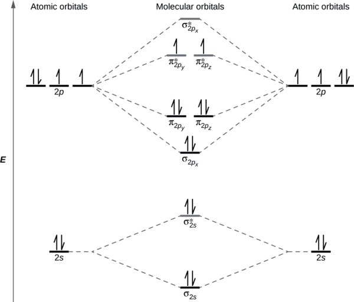
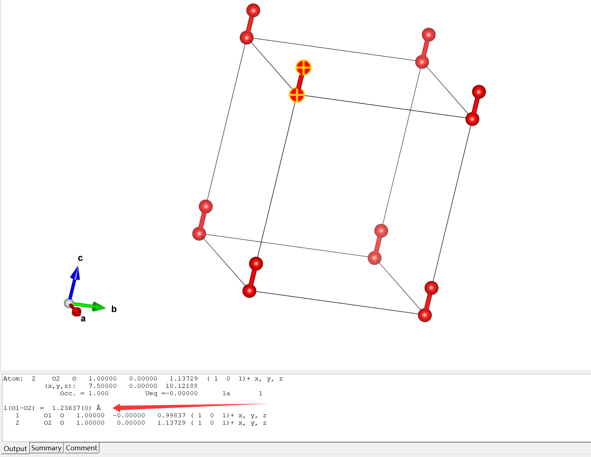

单点能计算又叫做静态计算，计算时不会优化结构

INCAR

```INCAR
SYSTEM = O
ISMEAR = 0 #绝缘体系ISMEAR = 0
SIGMA = 0.01
ISPIN = 2 #氧气是顺磁性分子，ISPIN = 2开启自旋
MAGMON = 2*2 #设置磁矩

#IBRION = 2 确定计算过程中晶体结构如何变化的参数，不设置使默认IBRION = -1，IBRION =2为共轭梯度算法
#NSW = 10  离子步10步
```

POSCAR

```POSCAR
O
1.0
7.5 0.0 0.0
0.0 8.0 0.0
0.0 0.0 8.9 #三斜的格子打破对称性，symmetry broken solution！！！
O
2
Cartesian
0.0 0.0 0.0
0.0 0.0 1.2074
```

KPOINTS

```KPOINTS
K-POINTS
 0
Gamma
 1 1 1
 0 0 0
```

运行`mpirun -n 8 vasp`，正常结束，OUTCAR的部分信息如下，显然，单点计算的结果并不可靠

$\alpha$电子部分

```OUTCAR
 spin component 1

 k-point     1 :       0.0000    0.0000    0.0000
  band No.  band energies     occupation
      1     -32.9044      1.00000			#1σ轨道
      2     -20.2474      1.00000			#2σ轨道
      3     -13.3174      1.00000			#3σ轨道,能量应比1π和2π轨道更低，不合理
      4     -13.3171      1.00000			#1π轨道
      5     -13.2940      1.00000			#2π轨道，能量应与1π轨道相同，不合理
      6      -6.5560      1.00000			#3π轨道
      7      -6.5524      1.00000			#4π轨道
      8      -0.3909      0.00000
      9       1.1220      0.00000
     10       1.5493      0.00000
     11       1.7604      0.00000
     12       2.0536      0.00000
     13       2.0592      0.00000
     14       2.4672      0.00000
     15       3.1984      0.00000
     16       3.6244      0.00000
 Fermi energy:        -6.4848556277
```

$\beta$电子，正常

```OUTCAR
 spin component 2

 k-point     1 :       0.0000    0.0000    0.0000
  band No.  band energies     occupation
      1     -31.6977      1.00000
      2     -18.4541      1.00000
      3     -12.3485      1.00000
      4     -11.4763      1.00000
      5     -11.4760      1.00000
      6      -4.2772      0.00000
      7      -4.2742      0.00000
      8      -0.2440      0.00000
      9       1.4049      0.00000
     10       1.6215      0.00000
     11       1.9473      0.00000
     12       2.1710      0.00000
     13       2.2499      0.00000
     14       2.5860      0.00000
     15       3.5816      0.00000
     16       3.8831      0.00000
```




对氧气进行结构优化，更改INCAR

```INCAR
SYSTEM = O
ISMEAR = 0 #绝缘体系ISMEAR = 0
SIGMA = 0.01
ISPIN = 2 #氧气是顺磁性分子，ISPIN = 2开启自旋
MAGMON = 2*2 #设置磁矩

IBRION = 2 #确定计算过程中晶体结构如何变化的参数，不设置使默认IBRION = -1，IBRION =2为共轭梯度算法
NSW = 10  #离子步10步
```

计算后发现$\alpha$电子部分已经修正

```OUTCAR
 spin component 1

 k-point     1 :       0.0000    0.0000    0.0000
  band No.  band energies     occupation
      1     -32.2878      1.00000			#1σ轨道
      2     -20.4859      1.00000			#2σ轨道
      3     -13.2238      1.00000			#3σ轨道，能量合理
      4     -13.0591      1.00000
      5     -13.0588      1.00000
      6      -6.7814      1.00000
      7      -6.7778      1.00000
      8      -0.3857      0.00000
      9       1.0213      0.00000
     10       1.6177      0.00000
     11       1.7818      0.00000
     12       2.0634      0.00000
     13       2.0746      0.00000
     14       2.4643      0.00000
     15       2.8035      0.00000
     16       3.6409      0.00000
 Fermi energy:        -6.7122607632
```

用VESTA打开优化好的结构(`CONTCAR`)可以查看键长



