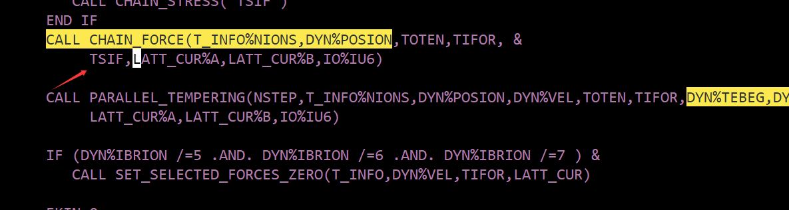
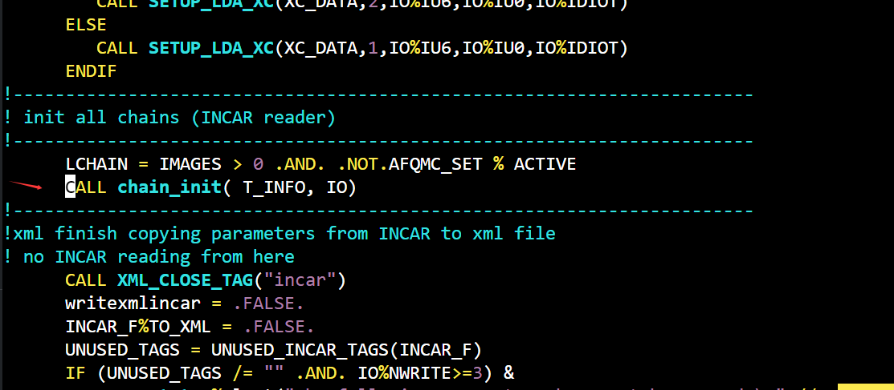
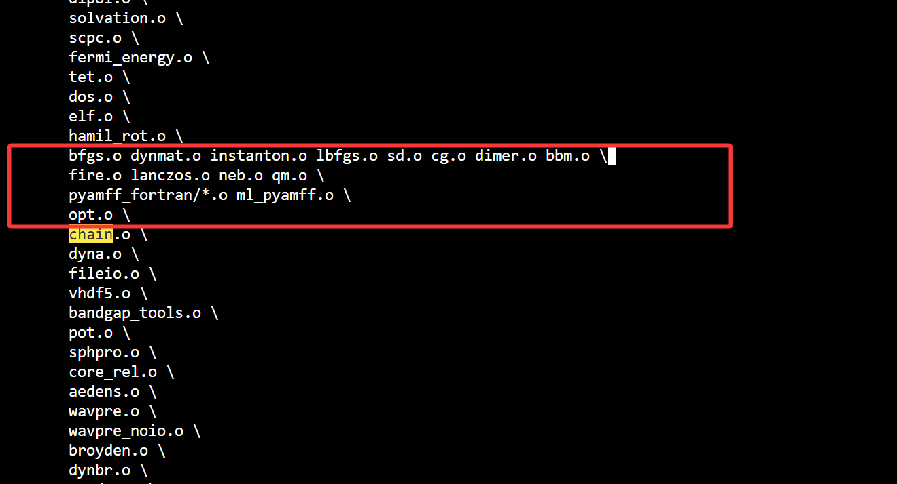

# 后记

重新安装了`Rocky Linux10`，并安装了`Slurm`作业系统，尝试编译安装`vasp`，由于用的`Rocky10`，gcc等各种套件都比较新，折腾麻了，各种编译报错，干脆换到了较新的`vasp.6.5.1`版本，一遍过！

## 编译HDF5

编译`HDF5`部分内容参考了教程：https://zhuanlan.zhihu.com/p/617261007

编译安装`HDF5`之前需要先编译安装它的依赖`zlib`😂，首先去官网https://www.zlib.net/，目前最新的的版本是`zlib 1.3.1`，下载源代码source code，哪种格式的都行，我的工作站有网就直接用`wget`了：

```bash
wget https://www.zlib.net/zlib-1.3.1.tar.gz
```

没网的集群自己下载到本地计算机再上传到集群上。

解压、配置、编译、测试、安装：

```bash
tar -zxvf zlib-1.3.1.tar.gz
```

```bash
./configure --prefix=install_directory
```

```bash
make -jN
```

```bash
make test
```

```bash
make install
```

接下来安装`szip`，官网(https://docs.hdfgroup.org/archive/support/doc_resource/SZIP/index.html)同样只提供了源代码，需要编译安装，安装过程大差不差，类似的

接下来编译安装`HDF5`，官网打开比较慢、、、目前最新版本是`1.14.6`，使用`1.14.5`版本编译成功

```bash
wget https://support.hdfgroup.org/releases/hdf5/v1_14/v1_14_6/downloads/hdf5-1.14.6.tar.gz
```

```bash
tar -zxvf hdf5-1.14.6.tar.gz
```

接下来是配置，需要使用intel的编译器，所有首先需要安装intel的`oneapi`套件，安装下面这些：


需要格外注意，我是用的是最新版的`oneapi`套件，已经删除了对`icc`、`ifort`的支持，所以需要注意`CC`、`FC`、`CXX`的写法

```bash
./configure --prefix=/opt/apps/vasp.6.5.1/hdf5/hdf5 \
	--enable-fortran \
	--with-zlib=/opt/apps/vasp.6.5.1/hdf5/dependences/zlib \
	--with-szlib=/opt/apps/vasp.6.5.1/hdf5/dependencies/szip \
	--enable-shared \
	--enable-parallel \
	CC=mpiicx \
	FC=mpiifx \
	CXX=mpiicpx
```

接着编译、测试、安装

```bash
make -jN
```

```bash
make check
```

```bash
make install
```

## Wannier安装

接下来编译安装`Wannier90`，官网是https://wannier.org/download/，下载：

```bash
wget https://github.com/wannier-developers/wannier90/archive/v3.1.0.tar.gz
```

然后是解压，接着拷贝`config`文件夹中的模板：

```bash
cp config/make.inc.ifort make.inc
```

`Wannier90`的模板并没有调整，依然使用的`ifort`，然鹅Intel已经废弃了`ifort`，所以得手动修改一下模板了，把`ifort`改成`ifx`，依此类推，改完后的模板如下：

```bash
root@cernet2:~/Wannier90/wannier90-3.1.0# cat make.inc 

#=====================================================
# For Linux with intel version 11/12 on 64bit machines
#=====================================================
F90 = ifx
COMMS=mpi
MPIF90=mpiifx
FCOPTS=-O2
LDOPTS=-O2

#========================================================
# Intel mkl libraries. Set LIBPATH if not in default path
#========================================================

LIBDIR = /opt/intel/mkl/lib/intel64
LIBS   =  -L$(LIBDIR) -lmkl_core -lmkl_intel_lp64 -lmkl_sequential -lpthread

#=======================
# ATLAS Blas and LAPACK
#=======================
#LIBDIR = /usr/local/lib
#LIBS = -L$(LIBDIR)  -llapack -lf77blas -lcblas -latlas
```

接着编译吧：

```bash
make -jN
```

再编译库：

```bash
make lib -jN
```

最终，得到了两个重要的文件：`wannier90.x`和`libwannier.a`，记住这两个文件所在的目录，

## VTST的安装

`VTST`，是一个”插件“，随着`vasp`的编译而安装，首先下载`VTST`：

```bash
wget https://theory.cm.utexas.edu/code/vtstcode-209.tgz
```

参考官网的安装过程，需要修改源代码，谨慎且小麻烦，https://theory.cm.utexas.edu/vtsttools/installation.html

按照教程修改vasp的`main.F`源代码，源代码都在`src`目录内





接着将`VTST`文件夹下的所有源码文件复制到`vasp`的源码文件夹内，此时会覆盖掉`chain.F`

然后修改`.objects`



接着修改`源码目录`内的`makefile`文件，将其中的某一行由：

```bash
LIB=lib parser
```

修改为：

```bash
LIB= lib parser pyamff_fortran
```

我编译`vasp`时为了加快编译速度，需要并行编译，因此也需要将：

```bash
dependencies: sources
```

修改为：

```bash
dependencies: sources libs
```

至此，`VTST`需要做的已经完成了，开始编译`vasp`吧~~

## 编译vasp

使用`makefile.include.oneapi`这个模板，这个模板已经适配了新版的`intel`套件，只需要修改`hdf5`和`wannier90`这两个地方就行，本次编译使用了`比较激进`的方案，

```
# Default precompiler options
CPP_OPTIONS = -DHOST=\"LinuxIFC\" \
              -DMPI -DMPI_BLOCK=8000 -Duse_collective \
              -DscaLAPACK \
              -DCACHE_SIZE=4000 \
              -Davoidalloc \
              -Dvasp6 \
              -Dtbdyn \
              -Dfock_dblbuf

CPP         = fpp -f_com=no -free -w0  $*$(FUFFIX) $*$(SUFFIX) $(CPP_OPTIONS)

FC          = mpiifort -fc=ifx
FCL         = mpiifort -fc=ifx

FREE        = -free -names lowercase

FFLAGS      = -assume byterecl -w

OFLAG       = -O3 -xHost -unroll-aggressive  #激进的方案
OFLAG_IN    = $(OFLAG)
DEBUG       = -O0

# For what used to be vasp.5.lib
CPP_LIB     = $(CPP)
FC_LIB      = $(FC)
CC_LIB      = icx
CFLAGS_LIB  = -O
FFLAGS_LIB  = -O1
FREE_LIB    = $(FREE)

OBJECTS_LIB = linpack_double.o

# For the parser library
CXX_PARS    = icpx
LLIBS       = -lstdc++

##
## Customize as of this point! Of course you may change the preceding
## part of this file as well if you like, but it should rarely be
## necessary ...
##

# When compiling on the target machine itself, change this to the
# relevant target when cross-compiling for another architecture
VASP_TARGET_CPU ?= -xHOST
FFLAGS     += $(VASP_TARGET_CPU)

# Intel MKL (FFTW, BLAS, LAPACK, and scaLAPACK)
# (Note: for Intel Parallel Studio's MKL use -mkl instead of -qmkl)
FCL        += -qmkl=parallel
MKLROOT    ?= /path/to/your/mkl/installation
LLIBS      += -L$(MKLROOT)/lib/intel64 -lmkl_scalapack_lp64 -lmkl_blacs_intelmpi_lp64
INCS        =-I$(MKLROOT)/include/fftw

MKL_THREADING_LAYER=INTEL 
OMP_NUM_THREADS=1 # MPI+MKL 并行时必须绑 1，否则容易 oversubscribe

# HDF5-support (optional but strongly recommended, and mandatory for some features)
CPP_OPTIONS+= -DVASP_HDF5
HDF5_ROOT  ?= /opt/apps/vasp.6.5.1/hdf5/hdf5
LLIBS      += -L$(HDF5_ROOT)/lib -lhdf5_fortran
INCS       += -I$(HDF5_ROOT)/include

# For the VASP-2-Wannier90 interface (optional)
CPP_OPTIONS    += -DVASP2WANNIER90
WANNIER90_ROOT ?= /opt/apps/vasp.6.5.1/wannier90-3.1.0
LLIBS          += -L$(WANNIER90_ROOT)/lib -lwannier

# For machine learning library vaspml (experimental)
#CPP_OPTIONS += -Dlibvaspml
#CPP_OPTIONS += -DVASPML_USE_CBLAS
#CPP_OPTIONS += -DVASPML_USE_MKL
#CPP_OPTIONS += -DVASPML_DEBUG_LEVEL=3
#CXX_ML      = mpiicpc -cxx=icpx
#CXXFLAGS_ML = -O3 -std=c++17 -Wall
#INCLUDE_ML  =
```

```bash
make DEPS=1 -jN
```

笔者用的双路`2676 v3`的落后的工作站，因为调用了24个核心并行编译所以比较快，编译时间大概是四五分钟

接着是测试，`make test`默认调用4个核心，可以编辑`runtest`文件手动修改核心数目加快测试速度，关于测试的说明在官网：https://www.vasp.at/wiki/Validation_tests

我自己测试时需要手动加上`hdf5`库的环境变量，否则一个测试也跑不了：

```bash
export LD_LIBRARY_PATH=/opt/apps/vasp.6.5.1/hdf5/hdf5/lib:$LD_LIBRARY_PATH
```

对了，为了避免任何关于内存栈的错误，也请执行下面四行命令（从集群slurm脚本抄的）

```bash
ulimit -d unlimited
ulimit -s unlimited
ulimit -t unlimited
ulimit -v unlimited
```


./install_cp2k_toolchain.sh --with-sirius=no --with-intelmpi=system --with-mkl=system --with-openmpi=no --with-plumed=install --with-cmake=system  --with-ninja=install  --with-dftd4=install

./install_cp2k_toolchain.sh --with-sirius=no --with-intelmpi=no --with-openmpi=install --with-plumed=install --with-cmake=system 

./install_cp2k_toolchain.sh \
  --with-intel=no \
  --with-intelmpi=no \
  --with-sirius=no \
  --with-openmpi=install \
  --with-mkl=no \
  --with-plumed=install \
  --with-fftw=install \
  --with-cmake=system

**./install_cp2k_toolchain.sh --with-sirius=no --with-openmpi=install --with-plumed=install --with-gcc=system --with-intel=no  --with-fftw=install --with-cmake=system  > out.log2>&1 &**

```bash
./install_cp2k_toolchain.sh --with-sirius=no --with-openmpi=install --with-plumed=install --with-cmake=system --with-fftw=install > out.log2>&1 &
```

```bash
salloc -N 1 -c 20 -t 02:30:00 --job-name=CP2K
```

重新进入节点；

```bash
srun --jobid=12345 --pty bash
```


cp2k的dftd4库和ninja库参考公社上的文件，http://bbs.keinsci.com/forum.php?mod=viewthread&tid=55624&highlight=dftd4

## 全核并行

```bash
export OMP_NUM_THREADS=24       # 每个 rank 用 24 个线程
export MKL_NUM_THREADS=1        # 防止 MKL 再开线程
export OMP_PROC_BIND=spread     # 将线程均匀分布在逻辑核上
export OMP_PLACES=threads
export OMP_DYNAMIC=FALSE
export KMP_STACKSIZE=256m
```

运行：

```bash
mpirun -np 1 numactl --physcpubind=0-11,24-35 --membind=0 vasp : \
       -np 1 numactl --physcpubind=12-23,36-47 --membind=1 vasp
```

# Advancements in Single-Atom Photocatalysts for CO2 Reduction: Mechanisms, Materials, and Challenges

- introduction
- the principle of photocatalysis co2 reduction
- elemental landscape of single-atom photocatalyst
- research methods
  - theoretical calculation and simulation methods
  - cross-scale collaborative characterization methods
- mechanism of photogenerated electrons transfer to single-atom sites
  - interlayer electric field driven charge transfer pathway
  - Π-conjugated network driven charge transfer pathway
  - Vacancy driven charge transfer pathway 
  - Internal electric field of heterojunction driven charge transfer pathway
- Reported performance of single-atom photocatalysts
- Selectivity of Products
  - C1 products
  - C2 products
  - C3 products
- Industrial perspective analysis of single-atom photocatalytic systems
- Conclusions

> A visually striking scientific illustration showing the concept of single-atom photocatalysts for carbon dioxide reduction. A central metallic single atom (e.g., Cu, Ni, or Fe) anchored on a semiconductor surface represents the active site. Photons from sunlight excite electrons, which travel through multiple charge transfer pathways — interlayer electric fields, π-conjugated networks, vacancies, and internal electric fields in heterojunctions — toward the single atom. The single atom catalyzes carbon dioxide molecules into multicarbon products (C1–C3). The image should feature vibrant colors (blue, green, gold) and clean, modern design with soft glows indicating photoexcitation, energy flow arrows, and molecular orbitals. Background should be abstract but scientific, suitable for a high-impact journal graphical abstract. Rendered in 3D or semi-realistic scientific art style, high resolution (>300 dpi).

```
Scientific graphical abstract of single-atom photocatalysts for carbon dioxide reduction: sunlight excitation, electron transfer through multiple pathways (interlayer fields, π-conjugation, vacancies, heterojunctions), single atom active site converting carbon dioxide into C1–C3 products. Clean, colorful, professional 3D scientific illustration.
```

g-C3N4(平面氮化碳)、COF、MOF、金属氧化物

Single-Atom Photocatalysts for CO₂ Reduction: A Review of Charge Transfer Mechanisms, Material Design, and Future Perspectives


Photocatalytic CO₂ reduction into value-added fuels and chemicals represents a sustainable and promising way for addressing global energy and environmental challenges. In recent years, single-atom photocatalysts (SAPs) have emerged at the forefront of this field, offering maximized atomic efficiency, unique electronic structures, and well-defined active sites that facilitate unprecedented activity and selectivity. This review provides a comprehensive overview of the significant advancements in the design and application of SAPs for CO₂ reduction. A central focus is placed on elucidating the fundamental mechanisms of photogenerated charge transfer from the semiconductor support to the single-atom sites, which is critical for catalyst performance. 

We systematically categorize and analyze four primary charge transfer pathways: those driven by interlayer electric fields, π-conjugated networks, surface vacancies, and heterojunction internal electric fields. Furthermore, we survey the diverse elemental landscape of single-atom centers and discuss advanced in-situ characterization techniques and theoretical simulations that are pivotal for mechanistic investigations. A detailed analysis of product selectivity, from C₁ chemicals (CO, CH₄) to more valuable multi-carbon (C₂₊) products, is presented. Finally, this review critically examines the current challenges and offers an industrial perspective on catalyst stability, quantum efficiency, and system scalability, concluding with forward-looking insights to guide the future rational design of next-generation single-atom photocatalysts for practical CO₂ utilization.

------

Single-atom photocatalysts (SAPs) have emerged as a frontier class of materials for the conversion of CO₂ into value-added chemicals, primarily due to their maximized atomic efficiency and highly tunable electronic properties. This review summarizes the significant recent advancements in the field. The principal focus is a systematic analysis of the fundamental charge transfer mechanisms from the support to the single-atom active sites, a process critical to catalytic performance. Four primary pathways are detailed: interlayer electric field-driven, π-conjugated network-driven, vacancy-driven, and heterojunction-driven charge transfer. The discussion also covers the elemental diversity of single-atom centers, the application of advanced characterization and computational methods for mechanistic studies, and the factors governing product selectivity toward C₁ and multi-carbon (C₂₊) products. The review concludes by critically evaluating the major challenges, including catalyst stability and quantum efficiency, and provides forward-looking perspectives on the rational design of SAPs for potential industrial applications.

------

Single-atom photocatalysts (SAPs) represent a paradigm shift in the quest for efficient CO₂ conversion into chemical feedstocks, offering ultimate atom-efficiency and uniquely tunable active sites. This review critically surveys recent breakthroughs in the field, with a central focus on elucidating the charge transfer mechanisms from the support to the single-atom centers—a process governing catalytic efficacy. Four distinct pathways are systematically examined: those driven by interlayer electric fields, π-conjugated networks, surface vacancies, and heterojunctions. Accompanying this mechanistic analysis is an exploration of the elemental diversity of metal centers and the pivotal role of advanced characterization and computational methods in unraveling reaction pathways. Emphasis is also placed on the factors dictating product selectivity, particularly the challenging shift from C₁ to multi-carbon (C₂₊) products. The review culminates in a critical assessment of prevailing challenges, including catalyst stability and quantum efficiency, offering forward-looking perspectives on the rational design of SAPs for viable industrial translation.

------

With the growing urgency to address climate change and achieve carbon neutrality, the photocatalytic conversion of CO₂ into valuable chemicals has become a paramount scientific endeavor. Single-atom photocatalysts (SAPs) have recently emerged at the forefront of this field, yet a deep, systematic understanding of the crucial charge transfer process—which governs catalytic efficiency—is still needed.

Our review aims to provide a timely and comprehensive overview of this rapidly advancing area. Distinct from previous reviews, our manuscript places a central focus on the fundamental charge transfer mechanisms, systematically categorizing and critically discussing four primary pathways: those driven by interlayer electric fields, π-conjugated networks, surface vacancies, and heterojunctions. By connecting these core principles to rational material design, advanced characterization techniques, and the challenges of product selectivity, we believe our work offers a unique, mechanism-centric perspective. It provides a clear and instructive roadmap for both newcomers and seasoned researchers aiming to design the next generation of highly efficient SAPs.

We believe that *Chinese Chemical Letters*, with its distinguished reputation for publishing high-impact and timely research across the chemical sciences, is the ideal platform for our work. The subject of our review aligns perfectly with the journal's scope in catalysis, materials science, and physical chemistry. We are confident that this comprehensive review will be of great interest to your broad readership and will serve as a valuable resource for the community, stimulating further innovation in this exciting field.

Thank you very much for your time and consideration. We deeply appreciate the effort of the editors and reviewers in the peer-review process and look forward to hearing from you at your earliest convenience.