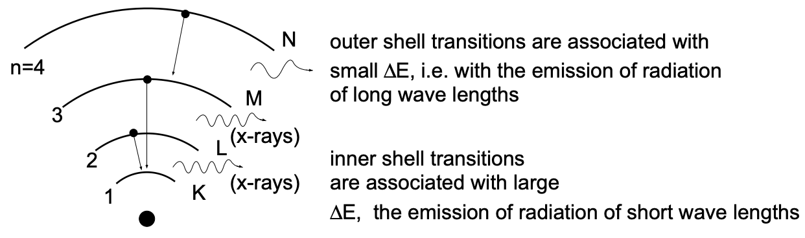
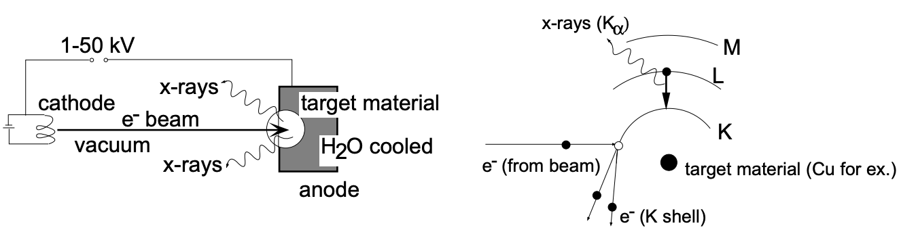
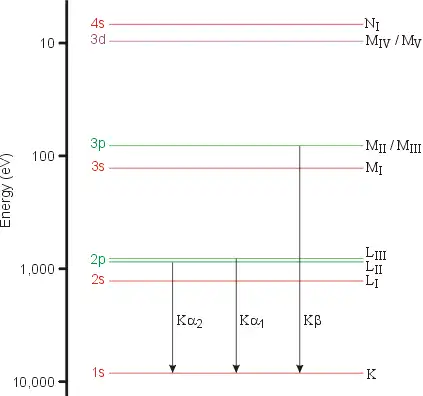
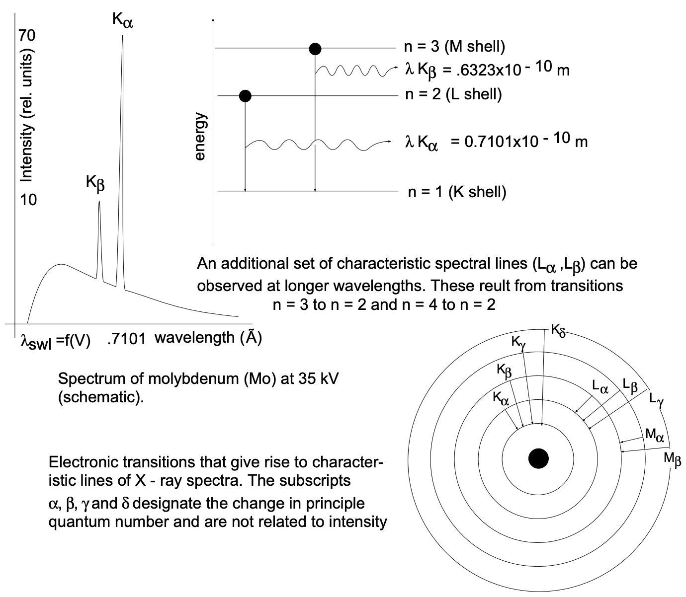
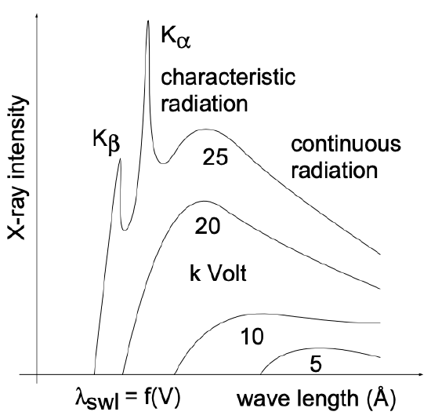
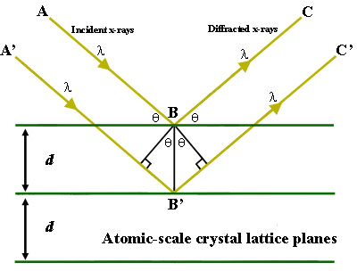
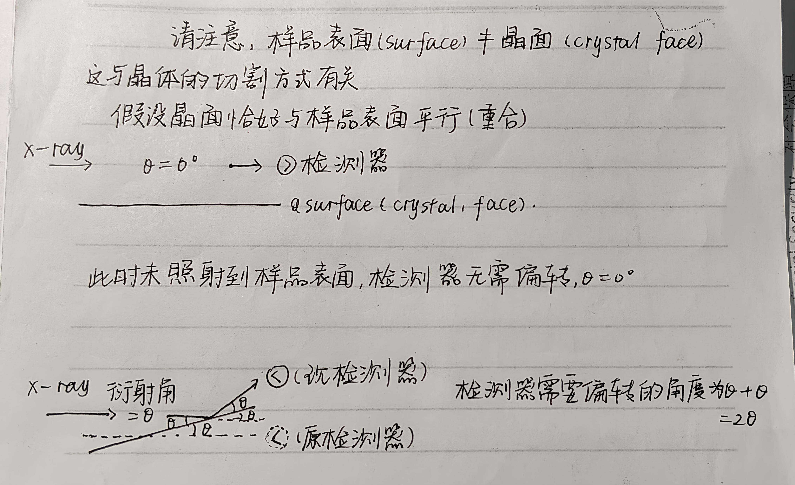

## 前言

1917 年，赫尔首次描述了简单粉末衍射仪的构造，这是在 1895 年威廉·康拉德·伦琴发现 X 射线后不久。衍射仪测量 X 射线反射的角度，从而获得其包含的结构信息。如今，这项技术的分辨率有了显著提高，它被广泛用作分析相信息和解决固态材料晶体结构的工具。X 射线衍射技术用于确定**样品的组成**或**晶体结构**。对于大分子和无机化合物等**较大的晶体**，它可用于确定样品中原子的结构。如果**晶体尺寸太小**，它可以确定样品的组成、结晶度和相纯度。

## 什么是X射线？

X射线是一种**电磁波**，由内壳层电子跃迁所得：

对于原子序数为Z、仅含一个电子的类氢原子，内壳层电子跃迁所辐射的能量可由Rydberg方程计算：
$$
\bar{v}=(\dfrac{1}{n_i^2}-\dfrac{1}{n_f^2})RZ^2
$$
可以明显看出，与电子跃迁相关的能量差随着原子序数的增加而大幅增大，并且在这种跃迁过程中发射的辐射波长随着原子序数的增加从 10$^{−7}$ m (1000 Å) 范围移至 10$^{−10}$ m (1 Å)范围（**此时辐射的电磁波被定义为X射线，此辐射类型被称为特征辐射**）、

如下图，要引发这种内壳层跃迁，需要产生一个电子空位，必须从K层中移除一个电子。由高压电场加速过的阴极电子书轰击靶材，将其部分能量传递给靶材料的电子，从而导致电子激发。如果入射电子的能量足够高，一些电子可能会击出靶中 K 壳层的一个电子，从而产生一个空位

不同能级跃迁回K层对应着不同的谱线，如$\rm{K_{\alpha}}$线和$\rm{K_{\beta}}$线。对于铜的X射线光谱，在低能分辨率下只有2条特征线被观察到，但是，在更高的分辨率下，很容易看出Kα线是双峰，它被标记为$\rm{K_{α1}}$和$\rm{K_{α2}}$。因为铜的2p轨道，能级L分裂为$\rm{L_{II}}$和$\rm{L_{III}}$，间距非常小（0.020kev），波长Kα1 (= 1.54056 Å) 和Kα2 (= 1.54439 Å) 也非常接近。因此，通常说的$\rm{K_{\alpha}}$其实是$\rm{K_{α1}}$和$\rm{K_{α2}}$的加权平均值

| 阳极 | $\rm{K_{\alpha}}$ | $\rm{K_{\beta}}$ |
| ---- | ----------------- | ---------------- |
| 铜   | 1.54184Å          | 1.39222Å         |
| 钼   | 0.71073Å          | 0.63229Å         |

以铜靶为例
$$
E=\dfrac{hc}{\lambda}=\dfrac{6.626\times10^{-34}\times2.998\times 10^8}{1.542\times 10^{-10}\times1.6\times10^{-19}}=8.05~\rm{kV}
$$
8.05 kV为铜的$\rm{K_{\alpha 1}}$线的最低激发电压，实际操作时通常选择40kV。激发电压选择过低会造成谱线不明显、电流过大热损耗大等问题，选择40kV是长期实验优化的结果。

由于种种原因，如量子力学的选择定则：电子跃迁需要满足角动量变化Δl=±1、散热和成本等问题，通常X射线光谱中不会出现$\rm{K_{\gamma}}$甚至更高的线，即使能够发生N→K的跃迁（比如高Z元素W)，也会因为强度极弱而湮灭在噪声中，因此X射线光谱中通常见到的是$\rm{K_{\alpha}}$和$\rm{K_{\beta}}$

此外，在高速电子轰击靶材的过程中除了由内壳层电子跃迁所辐射的特征X射线，还存在着**轫致辐射**：高速电子被靶材原子核电场偏转，动能转化为连续电磁辐射。

如下图，当加速电压（单位：kV）较小、高速电子无法引起内壳层跃迁时（**加速电压小于临界电压**），那么此时原子的辐射均为**轫致辐射**

$$
V_{临界}=\dfrac{hc}{e\lambda_{K-edge}}
$$

在所得的一系列X射线中，只有满足布拉格条件（波长与晶面间距d匹配）的射线才可用于样品检测，因此需要通过滤光片等手段只保留窄带波长，去除了除 K$_α$ X 射线之外的所有电磁波

## XRD谱图上的峰是什么？

XRD——X-ray diffraction（X射线衍射），其本质是波的干涉与叠加。

当波（如光波、声波、X射线）遇到障碍物或穿过周期性结构时，波前会发生弯曲和重新分布，这种现象称为衍射。障碍物或结构的尺寸与波长相当，这是发生衍射的关键条件，正因如此，与原子间距匹配的X射线适合用作发生衍射的电磁波。X射线是电磁波，照射到晶体时，**每个原子中的电子受X射线的作用，成为次级波源**，向四周散射X射线（这种散射也被称为相干散射），这些不同路径的X射线相遇并发生干涉（衍射发生的本质是**弹性散射波**，（即此时的次级X射线）的干涉）

干涉分为两类：

- **相长干涉（Constructive Interference）**：满足布拉格条件时，所有晶面的散射波**相位一致**，两列波**波峰对齐**，叠加后振幅增强 → 形成**峰**。
- **相消干涉（Destructive Interference）**：波峰与波谷对齐，叠加后振幅抵消 → 形成暗区。

布拉格定律：
$$
n\lambda=2d\sin\theta
$$
其中λ是外加波长，θ是衍射角，d 是原子平面之间的距离。在大多数情况下，我们假定n=1，即一级衍射，因为总可以将 n=2,3,…的衍射峰解释为来自(nh nk nl) 晶面的衍射——即来自晶面间距为$\rm{d_{hkl}}$的$\dfrac{1}{n}$倍的晶面$\rm{d_{nhnknl}}$。然后，原子平面之间的距离可用于确定成分或晶体结构。

当路径 ABC 与 A'B'C'之间的距离相差整数个波长（λ）时，衍射的 X 射线表现出相长干涉

X 射线衍射的结果绘制出了在各自的 2θ位置处不同衍射角的信号强度。2θ位置对应于**样品中晶体或原子之间的特定间距**，该间距由入射到样品中的 X 射线束的衍射角决定。**峰的强度**与**该相或具有该间距的分子数量**有关。峰的强度越大，具有该特定间距的晶体或分子数量就越多。

## 消光是什么？为什么只有特定的晶面处才会出现峰？

衍射峰强度取决于晶胞内所有原子散射辐射之间的相位关系，但经常出现这种情况：虽然布拉格定律预测某个峰应该存在，但其实际强度却为零（这是因为布拉格定律不涉及原子位置，仅与晶胞的大小和形状有关）。

例如，对于具有体心立方BCC晶胞的(100)晶面衍射峰强度：相位关系表明，在晶胞顶面和底面（即(100)晶面）散射的 X 射线虽然发生相长干涉，但与晶胞中心原子散射的X射线存在180$^∘$的相位差，因此最终强度为零。下表给出了不同立方晶格中特定衍射峰出现与否的选择定则。

| Bravais Lattice     | Reflections Present                        | Reflections Absent |
| ------------------- | ------------------------------------------ | ------------------ |
| Simple Cubic        | All                                        | None               |
| Body-Centered Cubic | (h+k+l)= even                              | (h+k+l)= odd       |
| Face-Centered Cubic | h,k,l unmixed (either all odd or all even) | h,k,l mixed        |
| Base-Centered Cubic | h,k unmixed (either all even or all odd)   | h,k mixed          |

## **为什么谱图的横坐标是2θ**？

实验中，样品和探测器的转动是围绕同一轴进行的，因此 **总偏转角的计算需要结合样品和探测器的相对运动**，如下图所示

## 峰宽度的意义是什么？

**峰的宽度与晶体尺寸成反比**。较窄的峰对应较大的晶体。较宽的峰意味着可能存在较小的晶体、晶体结构缺陷，或者样品在本质上可能是非晶态的，即一种缺乏完美结晶度的固体。对于较小的样品，将由X 射线衍射（XRD）所得的图谱与数据库中标准样品的谱图对比可确定样品的组成。此结论可由**谢乐公式（Debye-Scherrer）**直接给出
$$
D=\dfrac{K\lambda}{B \cos\theta}
$$

- K为Scherrer常数，也称形状因子，若B为衍射峰的半峰高宽，则K=0.89；

- D为晶粒垂直于晶面方向的平均厚度（Å）；

- B为实测样品衍射峰半高宽度

- θ为布拉格衍射角，单位为角度

- λ为X射线]波长，对于Cu kα来说，一般为1.54056 Å 

## **为什么晶相能相长干涉形成峰，而非晶相不能？**

晶体是长程有序的**周期性结构**，满足布拉格条件，即所有晶面(hkl)的的间距d恒定，当入射角θ满足布拉格公式时，所有晶面的散射波相位一致 → 相长干涉 → 尖锐峰。

非晶体可能短程有序，而长程无序，d值不固定， 散射波来自不同局部区域，相位杂乱，无法形成尖锐的峰

### 举个例子

例子仅供参考

晶体硅的晶胞参数a=0.543nm，X射线波长为0.154nm，那么我们可以预测某个晶面会在何处出现峰

对于立方晶系：
$$
d_{hkl}=\dfrac{a}{\sqrt{h^2+k^2+l^2}}
$$
以(111)晶面为例
$$
d_{111}=\dfrac{0.543}{\sqrt{3}}=0.314nm
$$
根据布拉格公式：
$$
\theta =\arcsin (\dfrac{\lambda}{2d_{111}})=14.3^\circ
$$

## 如何确定2theta角度？

虽然理论上2θ范围是0°~180°，但实际操作中极少覆盖全部范围，原因包括：

- **物理限制**：大多数晶面间距d有一个最小值，那么$\theta_{\rm{max}} \le \arcsin(\dfrac{\lambda}{2d_{\rm{min}}})$
- **信号强度**：高角度区（如2θ>120°）的衍射强度极弱，信噪比差。
- **时间成本**：全范围扫描耗时过长，而关键峰通常集中在**20°~80°**

一般选择20~80°，一般情况

**常规晶体材料**的晶面间距d大多在**1~10Å**之间

- **Cu靶X射线波长λ≈1.54Å**，代入公式：
  - 当d=10Å时，\( $\sinθ = λ/(2d) ≈0.077$ → θ≈4.4° → 2θ≈8.8°\)
  - 当d=1Å时，\( $\sinθ = 0.77$ → θ≈50° → 2θ≈100°)

## 参考资料

1) Sadoway, D. Introduction to Solid State Chemistry.
2) Reig, A. CHEM322: Inorganic Chemistry.

