19日晚第一次进实验室，师姐带我合成一种固态电解质，参考文献有[Angew. Chem. Int. Ed. 2019, 58, 8681 –8686](https://onlinelibrary.wiley.com/doi/10.1002/anie.201814222)等。由于电池是锂电池，需要隔绝$\rm{H_2O}$和$\rm{O_2}$，所有电解质原料的称量操作需要在手套箱中进行，手套箱中的称量算是对新人的第一大挑战吧哈哈~

手套箱之前也用过，今晚顺便复习了一下

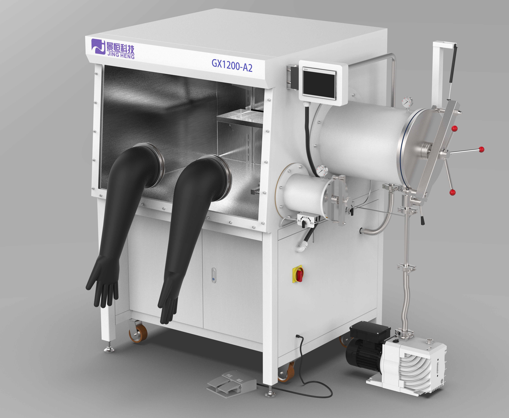

稍微总结了一下步骤：

- 紧闭内舱门，打开 过渡舱外舱门
- 放入货物并关闭外舱门
- 进行三次充放气操作（先抽后充），然后停止充放气
- 打开内舱门取出货物

手套箱内的神器—— <mark>镊子<mark>

我在手套箱内主要是称量，如下试剂：

| 试剂          | 性状                 | 备注         | 质量                   | 摩尔质量 |
| ------------- | -------------------- | ------------ | ---------------------- | -------- |
| $\rm{Li_2S}$  | 白色晶体，反萤石结构 | 有点粘，难称 | 0.3446g(0.0074995 mol) | 45.942   |
| $\rm{P_2S_5}$ | 黄色片层状晶体       | 易水解       | 0.4168g(0.001875 mol)  | 222.248  |
| $\rm{LiCl}$   | 白色晶体，易潮解     | 有点像白糖   | 0.2384g(0.005624 mol)  | 42.394   |
| $\rm{LiBr}$   | 白色晶体，易潮解     | 有点像白糖   |                        | 86.845   |
|               |                      |              |                        |          |

$$
\rm{Li:P:S:Cl}=0.020623:0.00375:0.0168745:0.005624=\approx5.5:1:4.5:1.5
$$

x=0.5(本次实验)

全固态锂电池的发展依赖于**高性能固态电解质**，需具备高离子电导率和良好延展性等特性。锂硫银锗矿($\rm{Li_6PS_5X}$)虽有潜力，但此前室温离子电导率等性能有待提升，本次实验尝试复现文献提高电解质的离子电导率。

LPSX (X=Cl,Br,I)，硫银锗矿型，名称来源于硫银锗矿$\rm{Ag_8GeS_6}$

- $\rm{Li_{6 - x}PS_{5 - x}Cl_{1 + x}}$固溶体相，发现增加$\rm{\dfrac{Cl^-}{S^{2-}}}$比例可系统且显著地影响晶格中锂离子扩散性，提升电导率。如$\rm{Li_{5.5}PS_{4.5}Cl_{1.5}}$在 298K 时冷压电导率达$\rm{9.4\pm 0.1 mS/cm}$，烧结后为$\rm{12.0\pm 0.2 mS/cm}$，几乎是相同条件下$\rm{Li_{6}PS_{5}Cl}$的四倍
- 发现卤化物取代降低了锂离子与周围框架阴离子的相互作用，增加了位点无序度和锂空位数量，进而提升锂离子扩散性，明确了离子传输机制

在手套箱内将三种试剂称量后放入研磨罐内，和离心机类似，**球磨机的研磨罐也需要配平（最好先用转子球配平再称量药品）**，配平后放入机器内设置参数


工作原理：当仪器启动时，电机带动公共的太阳轮转动，而位于太阳轮上的研磨罐则围绕自身的轴作自转运动，研磨罐自转的方向与太阳轮的方向相反。研磨球与研磨罐一起运转时，受到自转偏向力的叠加影响，在这种影响下，研磨球释放出大量的动能，样品不断受到研磨球的撞击，同时与研磨罐内壁产生大量摩擦，从而被高度粉碎。

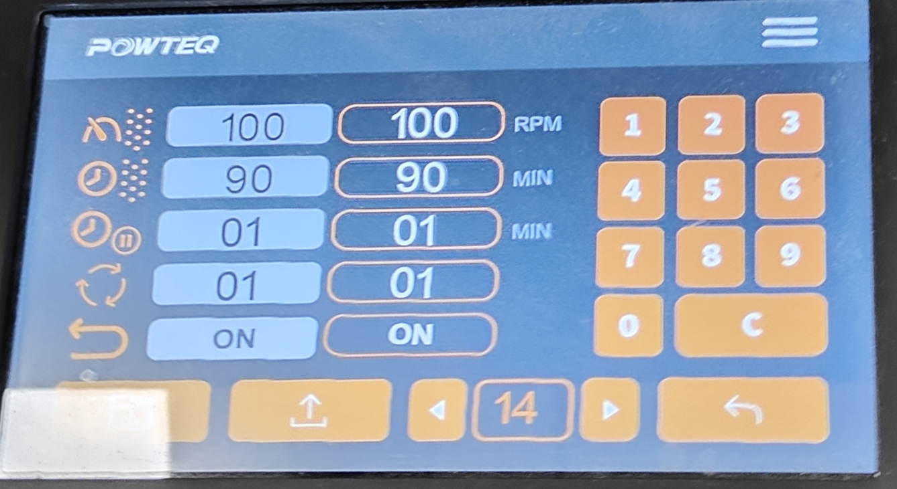

从上到下球磨机的参数设置分别为：

- 转速
- 研磨时间
- 休息冷却时间
- 循环次数

本次的研磨时间设置为10min，休息时间设置为5min，循环次数为60，那么总时间就是15h

(机械研磨引发固相反应)

20日上午11点，将研磨罐从球磨机上卸下来（和水热合成反应釜有点像哈哈~），忘了压住研磨罐盖子，大力出奇迹把盖子拔出来了，电解质接触到空气了😇，就当成对照组吧（本次合成了两组相同的，姑且认为盖上盖子就是与外界气体相隔绝哈哈）

将两个罐子转移到手套箱内，首先转移到称量纸上，然后转移到小离心管内，这一步巨难操作，研磨后的电解质有些结块了，需要扣下来，最主要是研磨罐比较重，我给不小心弄撒了一点😑，转移到两个小离心管后把两个研磨罐从手套箱内拿出来，开始洗刷刷，硫化物用水冲几遍、乙醇冲几遍就溶解掉、洗干净了，最后放入80摄氏度烘箱就吃饭去咯~（烘干即可，不可久置，否则==研磨罐胶圈会老化，密封性就不好了==）下午还有仪器分析实验课呢

20日晚上19点，开始隔绝氧气烧结样品。在手套箱内将离心管中的试剂用长颈漏斗分别转移到两个长玻璃管里，然后怼上阀门，用封口胶密封上，然后去一楼首先将气阀门接入压缩机，将长玻璃管内的气体尽可能抽出，接着用$\rm{CH_4+O_2}$的混合气体灼烧长玻璃管使其密封（和大一时无机化学的一次实验有点像，自己烧胶头滴管哈哈哈😳），烧完后就变成了两个完全密封的玻璃管啦，然后把它们放入电炉烧结即可。

冷却后，将玻封转移至手套箱中，打碎玻璃管将药品取出并组装到固态电池模具中，拿出来加压。用Zplot测一下阻抗，结果不理想，准备烧另一组样品，然后电炉给我玩坏了😂

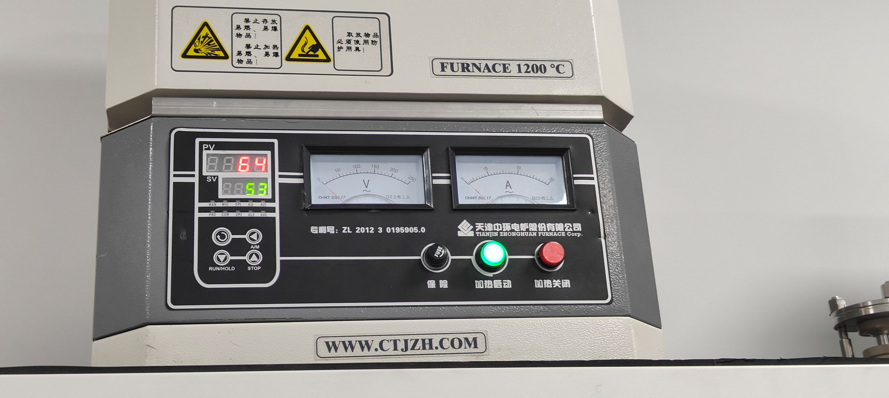

请教维修师傅，好在不是大问题，很快修好了，大哥还贴心的给了我一份食用指南，这下不怕忘记步骤了😀

**程序设定步骤**

1. 按一下向左键，C01为初始温度，设置成PV开机数值(室温)；
2. 然后按一下循环键，T01为时间，默认分钟，设定想要的升温时间（自行换算，升温速率不要太快≤10℃/min，一般5-10℃/min最好）；
3. 然后按一下循环键，切换到C02为下一个温度点，设定温度；
4. 以此类推…
5. 到T0几上设定为-121是结束指令代码（切记是－的121，两个-121）
6. 完成后，停滞几秒中回到基础界面，长按RUN键1-2秒钟别抬手，待仪表黄色数字显示一下RUN后，立刻抬手，再按绿色启动键。
7. 电炉开始加热，注意观察电流表指针是否摆动，有摆动为正常。

>  **范例：**以每分钟10度的升温速率升温到1200度，在1200度保温3个小时，再每分钟5度降到1000度后自然降温的程序设置如下
>
> - C01设置成PV显示值（一般在50-60度之间）；
> - T01设置成120；
> - C02设置成1200；
> - T02设置成180；
> - C03设置成1200； 
> - T03设置成40；
> - C04设置成1000；
> - T04设置成-121


>胡思乱想乱入
>
>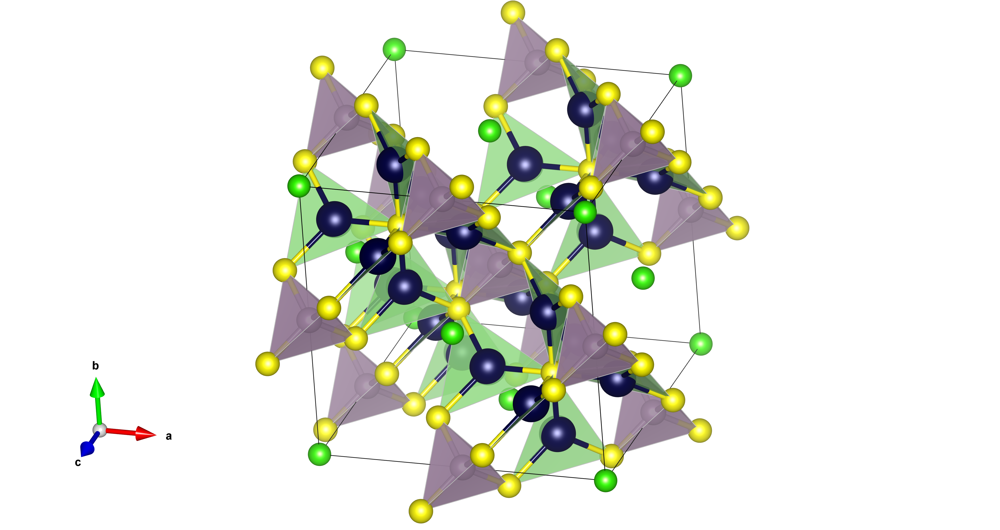晶胞化学式——$\rm{Li_6PS_5Cl}$Li(I)：
>
>Li:12（6个面*2）+12=24（体内)*
>
>P(VI)：$12\dfrac{1}{4}$（棱心）+1=4（体心）
>
>S(II)：$\rm{\dfrac{1}{4}*4*12}$（棱心）+8=20（体内）
>
>Cl(I)：$8*\dfrac{1}{8}+6*\dfrac{1}{2}$=4（立方最密堆积）
>
>假设分别合成$\rm{Li_{5.5}PS_{4.5}Cl(SCN)_{0.5}}$、$\rm{Li_{5.5}PS_{4.5}Cl_{0.5}(SCN)}$ 0.003 mol

$\rm{Li_6PS_5Cl}$中的锂有5种配位环境，两种Wackyhoff位置

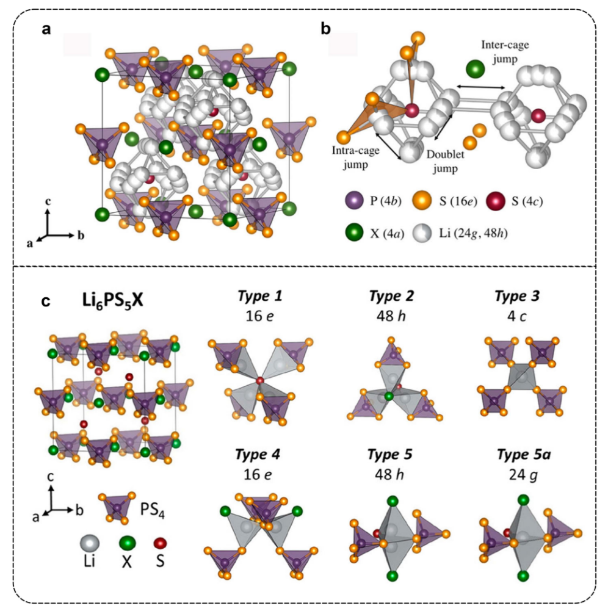

| Agents        | $\rm{Li_{5.5}PS_{4.5}Cl(SCN)_{0.5}}$ | $\rm{Li_{5.5}PS_{4.5}Cl_{0.5}(SCN)}$ |
| ------------- | ------------------------------------ | ------------------------------------ |
| $\rm{Li_2S}$  | 0.2757 g                             | 0.2757 g                             |
| $\rm{P_2S_5}$ | 0.3334 g                             | 0.3334 g                             |
| $\rm{LiCl}$   | 0.1272 g                             | 0.0636 g                             |
| $\rm{LiSCN}$  | 0.0975 g                             | 0.1951 g                             |

VASP 通过密度泛函理论（DFT）计算材料的电子结构和原子间相互作用，**最终目标是预测锂离子在材料中的迁移能力**，具体包括：

1. **活化能**：Li⁺迁移的能量势垒（直接影响传导率）。
2. **扩散系数**：通过分子动力学（MD）模拟计算 Li⁺的扩散速率。
3. **结构稳定性**：掺杂或缺陷对晶格结构的影响。


今天又来合另外一种电解质了、、、

改性的argyrodite（Li6PS5X）,下面是原料配比，请分析一下使用下面原料合出来的化学式是什么呢？（argyrodite结构没有发生改变）

- $\mathrm{P_2S_5}$: 0.4995g (0.001124 mol)
- $\rm{LiCl}$: 0.2857g (0.006739 mol)
- $\rm{Sm_2S_3}$: 0.0469g (0.0001181 mol)
- $\rm{Li_2S}$: 0.4183g (0.009103 mol)

Li: 0.006739+0.009103*2=0.02495

P: 0.001124*2=0.002248

Cl: 0.006739

Sm: 0.0001181*2=0.0002362

S: 0.001124*5+0.0001181\*3+0.009103=0.0150773

- $\rm{Li_6(P_{0.952}Sm_{0.048})S_{4.605}Cl_{1.395}}$（化学式未知）

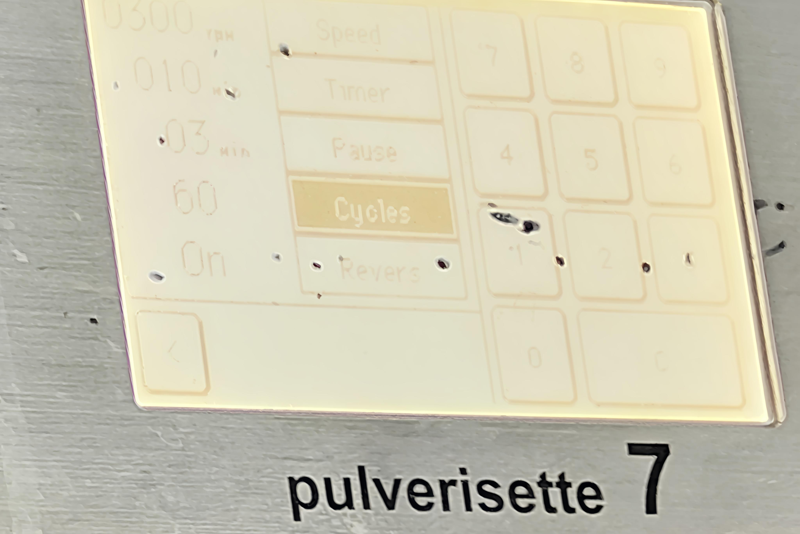


球磨完之后，在手套箱内将合成的粉末倒入长玻璃管中（将带有勺子的吸管插入玻璃管底部，再舀取药品），将玻璃管插入橡胶管中，不用插得太深，然后关闭阀门，从手套箱内取出来，再缠好封口胶

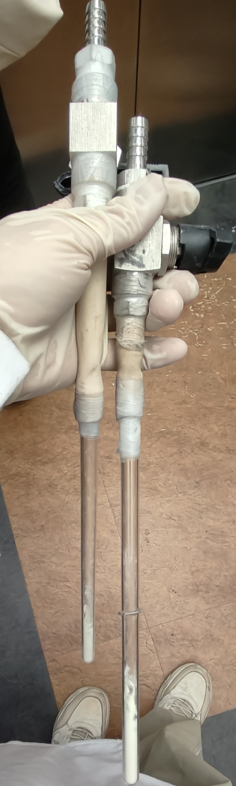

接下来去一楼101房间，将阀门接上泵，开启真空泵，缓慢旋转阀门，**一定要缓慢**，否则就不利于封管

封管的操作暂时学不来，用的是钢瓶中的某种气体，调节大小阀门至淡蓝色的焰心长度约1cm即可，反复灼烧并扭转玻璃管，一段时间后被灼烧处开始变细、拉丝、断开，然后再略微灼烧封号的管的尖端处，应该是去除一些毛刺吧

然后就开始烧，今天（5.17）又复习了一下电炉的使用，龙哥的祖传参数：500摄氏度烧12小时，升温速率5度每分钟

```
Step1:设置C01——一般设置室温
Step2:设置t01——需要计算，目标温度和室温的温差/升温速率
Step3:设置C02——目标温度
Step4:设置t02——保温时间
```

至此就结束了，下面这张图应该挺形象的，不过我暂时不用这么多梯度升温


4月22日晚，在手套箱内将烧结而成的电解质材料从玻封管内取并研磨，如果烧结后是坚硬的固体则可直接倒出，然后单独用镊子夹到研钵内（如果直接倒可能将碎玻璃渣引入），小TIPS：**研磨的时候可以盖一层薄膜再将固体锤碎**，将两个样品(6h & 8h)分别装到两个离心管内，放入另一个手套箱，接着师兄带我装全电池，模具如图


全电池

- 上层一般装负极，锂金属原片(d = 0.6 mm)
- 中层为固态电解质
- 下层一般装正极
  - 本次正极部分=正极材料+固态电解质+碳，质量比为70：30：3

对于全电池，需要施加三次压力（对称电池理论上只需要两次


- Step1：先装固态电解质材料，一般称取**80-100 mg**，本次称取100 mg，装入后振一下，再用上盖旋拧一下，让电解质材料尽量均匀，且上层和下层的豁口尽量对齐
- Step2：放入压机加压，上旋钮抵住上盖，然后加压至2t，维持2min，**加压时豁口不要对着压机地柱子**
- Step3：装正极部分（正极材料+固态电解质+碳），顺便检查一下加压后的固态电解质，**一定不能产生裂纹**，需要根据正极材料的质量设置测试的电流，将征集部分**小心地导入正中央，均匀地覆盖在电解质材料上**
- Step4：放入压机加压，相同操作，加压至4t，维持2-5min左右
- Step5：装负极材料，负极是一片金属锂（直径0.6cm，先将金属片放在下层盖地柱子上（柱子直径1cm），然后盖上下层，拧紧
- Step6：放入压机加压，**需格外小心，只需施加少许压力即可，指针略微移动即可**

OK，装完全电池后放入夹具中，接下来去8楼测试去，将模具连接好电池系统（红正黑负）即可，接下来在计算机上设置参数

使用蓝电电池测试系统


目前还看不太懂，待我请教一下做电池的好兄弟后再来更新🤗


5.20下午，龙哥带我测阻抗谱，一些细节我还不太熟练。首先是把烧好的固态电解质材料放到模具中，舀一点材料到模具中，然后“提取模具-放下模具”使得材料做自由落体运动，稍微平整一些，pellet厚度不易过薄或者过厚，我压的pellet1.77mm，显然是过厚了，再拧上旋钮关闭模具。

接着用压机（顺时针锁死即可施加压力，用完需锁死），只需要压到2tons，

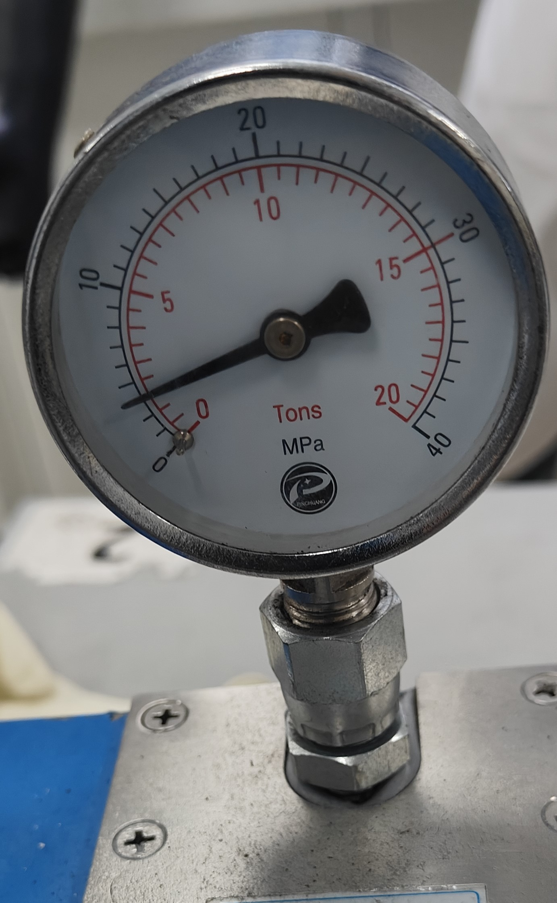

然后上面接负极黑线，下面接正极红线（但其实**没有正反**），设置好参数就可以开测了，接下来不出意外的话就要出意外了

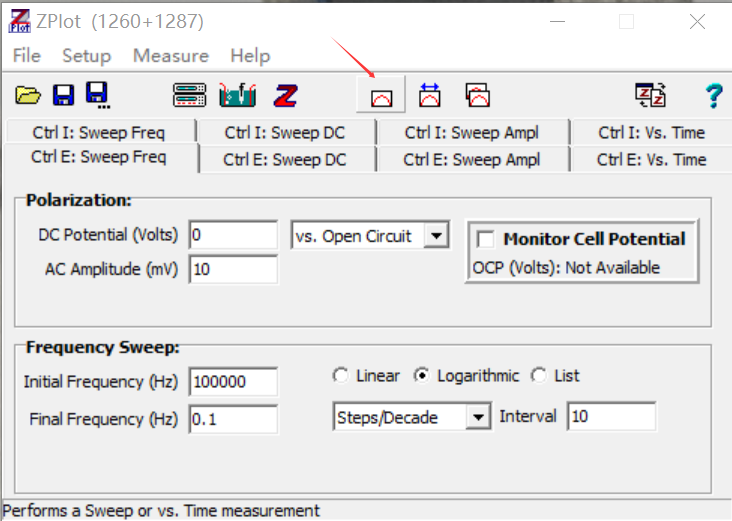

点此图标查看图

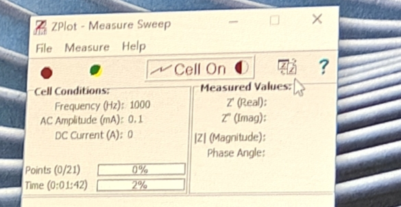

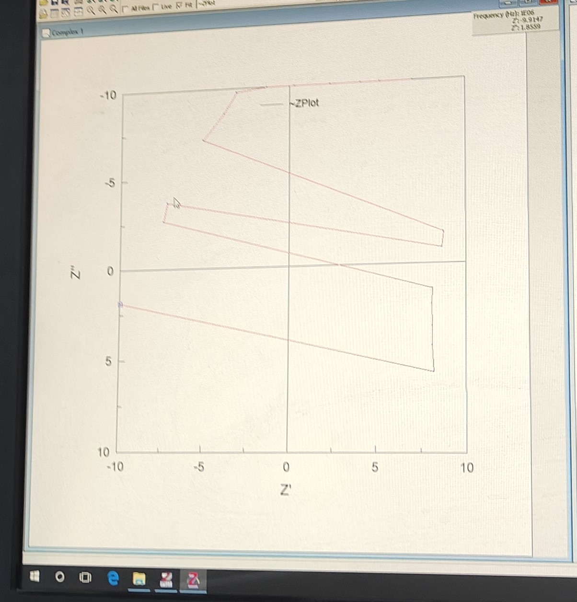

如图是我合成的材料的局部的阻抗图，很烂，重新测了几次都不对，晚上测一下XRD看看是怎么回事。

5.21晚上，闯大祸了😢。计划在唐楼测一下XRD（因为物理楼的XRD需要预约），我需要从手套箱内将药品拿出来，但是我发现此时过渡舱是满气状态而非真空状态，我以为是干净的氩气，但其实可能是上一个人用完手套箱忘记了抽真空。我没有多想，直接在手套箱内打开了过渡舱们，氧气含量飙升至90+，害的龙哥搬了一罐氩气来清洗手套箱。I'm sorry😭.The dilemma absolutely, definitely has been caused by myself, which could have been avoided with more patience and careness😭

龙哥给我拿了测XRD的样品槽测试片，我还不小心打碎了一片😭，真是笨手笨脚的🤕。制样方法是将样品均匀地涂在凹槽内即可，不必涂满，尽可能高度平整（否则衍射峰可能出现略微偏移）。涂好样品后需要用密封（暂时还不知道那个黄黄的胶布的学名叫啥），可以用有粘性的“胶布”直接贴上，但是容易黏在手套上，也可以用凡士林+无粘性的胶布（本次采用），4点涂或者8点涂凡士林，然后将凡士林往外刮出去，形成一个密封圈，切忌往内刮否则会出现凡士林的衍射峰

然后去8楼测XRD，切记需要带机器停止工作后才可打开舱门，放置、取下样品时需要双手托住样品！

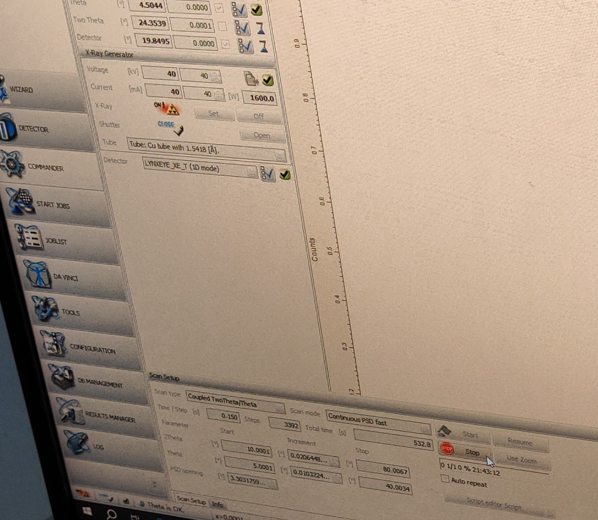

电压和电流分别是40kV和40mA，2theta角度时10$^\circ$~80$^\circ$

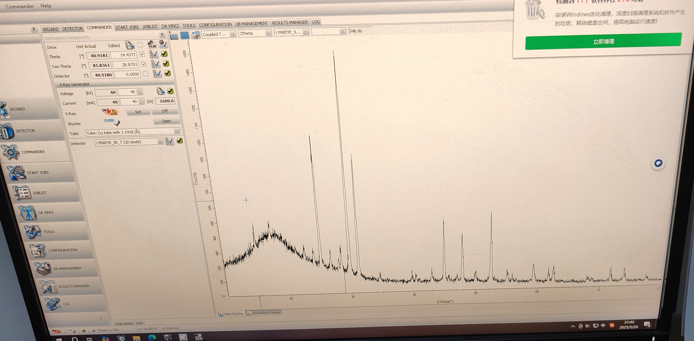

OK，我拿到衍射图谱了，待我进一步分析

分析完毕，样品似乎已经合成出来了，杂峰比较多，但是为啥当天下午没有测出来呢？？？因为杂峰太多了吗


6.1（六一儿童节快乐🤓），今天大概又看了一下三月份的那篇综述。龙哥装测固态电解质的时候只需压机压倒2Tons了，后面问问它表面积的事，换算成MPa。**模具中原盘的面积是0.785 cm$^2$，中科万垣的模具**，那么压强是249.68MPa，和文献中所记载的适宜压强一致。  

> 6月5日早上的小组会，杜老师也提了个醒：**测定不同类型的电解质时所称量的质量和所选取的压力是不相同的**，至于为什么会称量80mg呢？

以下是从网络获取到的模具的资料：

**以BM01-10为例**

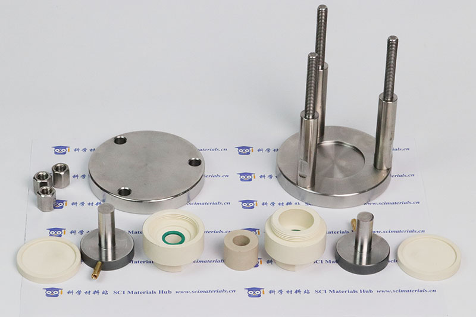

（**这个模具和实验室的不太一样哦**）

内部规格：（连 PPS 套）直径 40mm。腔体直径 10mm。总高度 70mm

整体规格： 装置外直径 90mm，连丝杆总高 130mm

**特性**

**-** 稳定性高，密封好；

**-** 可长期在 可长期在300 Mpa压力下使用；

**-** 装卸方便，易于操作；

**-** 可长期在 -40~200℃温度环境下使用；

**-** 尺寸（mm，BM01-10含不锈钢外架）：100 L x 100 W x 130 H

**-** 重量（kg，BM01-10含不锈钢外架）：2kg

**受压测试**

1、最高压力可至 400 Mpa

2、**压机压到 1 吨压力约等于压强 125 Mpa**

下图是内部构造示意图：

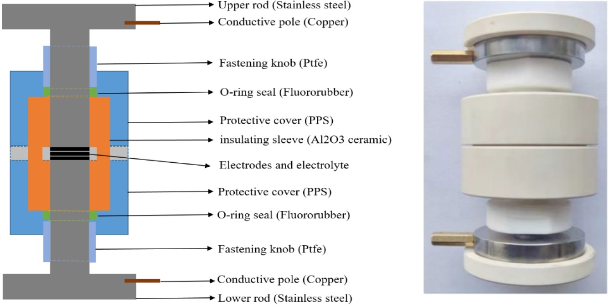

从上到下依次是：

- 不锈钢上杆
- 铜导电极板
- 聚四氟乙烯捆扎带
- O形密封圈
- 聚苯硫醚保护罩
- 三氧化二铝陶瓷绝缘层
- 电极和电解质
- 聚苯硫醚保护罩
- O形密封圈
- 聚四氟乙烯捆扎带
- 铜导电极板
- 不锈钢下杆

下面的图是一个固态电解质合成制备的流程图，**手磨这个步骤不知道是为啥，先挖个坑**

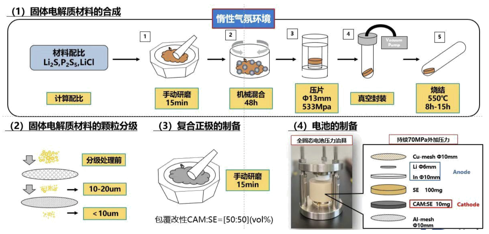

注意事项：

- 固态电池的组装，整个过程需在手套箱中操作
- 模具保压测试，压力约为 80-150MPa，如果有锂片或者铟片，压力应降低至 80Mpa 以内固态电池绝缘模具说明
- 模具和粉末压片机配合使用

6月3日下午，刚开完大组会，老师对大家的要求还是蛮高的，虽然我啥都听不懂😂，但还是简单总结了一下可能对自己有帮助的内容，希望以后少犯错甚至不犯错，期待快速成长、入门、甚至成为强者

- PPT有标签（其实之前科学实践课的时候玛琳老师也提到过了，一直忘了😂）
- 把结论放在最前面（**分情况**）
- 做事前三思，想清楚why和how
- 提出科学问题而非重复造轮子
- 独立思考
- 搞清楚各种表征的原理、解释清楚表征结果
- 以防万一做两个PPT吧（16:9和4:3的），大组会荧幕是4:3的而小组会的屏幕是16:9的

6月3日晚上，拜托奉云师姐帮我封了两个样品管，然后真空烧结12h(500摄氏度)，虽然我还没有能力独立封管（安全起见，至少需要2人+），但还是简单总结一下封管步骤吧，省得以后又搞忘了😂（已经忘了，下一次封管再熟悉一下）

- 关门

- 先放掉枪中的气体以防发生危险
- 先开右侧钢瓶总阀，再开小阀门，指示到一格

- 接着开左侧钢瓶总阀，再开小阀门，忘了几格了
- 然后开大枪，此时出来甲烷，点燃甲烷
- 然后开小枪，此时枪头附近氧气浓度增大， 甲烷燃烧剧烈
- 缓慢增大小枪流速，使得焰心长度约1cm即可
- 另一人拿稳玻璃管，将待封处对准焰心
- 灼烧玻璃管至待封处融化，然后两手分别向不同方向旋转至拉丝即可

6月4日晚上，测了一下LPSC(x=0.5)的离子电导率，由于我有些心急，未等模具降至室温就测，所以离子电导率有些偏高，稍大于文献

6月5日晚上，测了一下两个样品的XRD，数据格式保存错了，悲😂

6月6日晚上，测了溴掺杂和氯掺杂的两个样品的阻抗谱，前者偏小，后者偏大，待我稍微分析一下

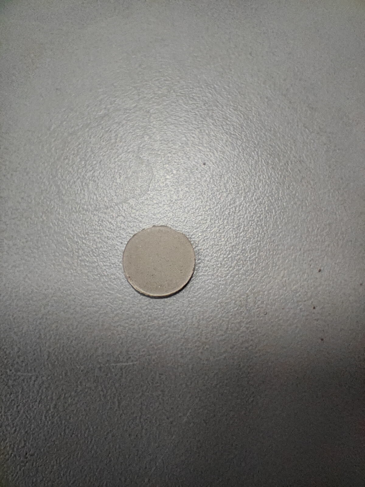

测试时称取80mg，用压机压到2Tons（249MPa）来减小晶界电阻，降低孔隙率，减小阻抗

简单总结一下最近的工作：

- 合成了$\rm{Li_{5.5}PS_5Cl_{1.5}}$（合成三次）和$\rm{Li_{5.3}PS_{4.3}Cl_{0.7}Br}$（合成两次）
- 参考文献为：
  - [Angew. Chem. 2019, 131, 8773 –8778](https://onlinelibrary.wiley.com/doi/10.1002/anie.201814222)
  - [Adv. Funct. Mater. 2023, 33, 2307954](https://advanced.onlinelibrary.wiley.com/doi/10.1002/adfm.202307954)

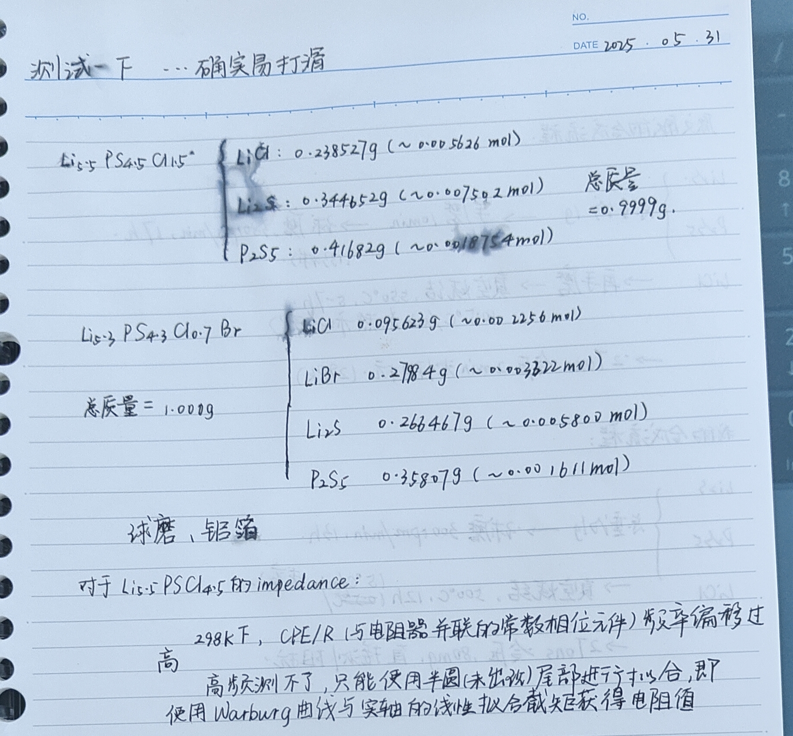

首先在手套箱中称量药品并转移至球磨罐中，两罐为不同样品，原料总重均为1.000g，球磨参数为300rpm/min，磨10min休息3min，60cycles，将球磨完的样品转移至玻璃管中，真空玻封。在电炉内以5摄氏度每分钟的升温速率和降温速率在500摄氏度下烧结12个小时，冷却到接近室温（大概65摄氏度左右）取出，破管，称取80mg到模具内，加压到2Tons进行电化学阻抗谱测试，后续又进行了X射线粉末衍射的测试

- 80mg只是一个经验数值，各大文献的测试细节只提及pellet的厚度和直径而未提及质量，对于F4̅3m空间群的LPSX，80mg在2Tons压力下厚度大约是0.62mm，每次称取80mg进行电化学阻抗测试后就不用再量pellet的厚度了
- 2Tons是一个适中的压力，能增强 Argyrodite 型硫化物电解质颗粒间的接触，降低孔隙率和晶界电阻，减少离子传输的曲折度，从而提升离子电导率，模具直径为10mm，2Tons的压力大约是249MPa，与文献记载的压力范围一致

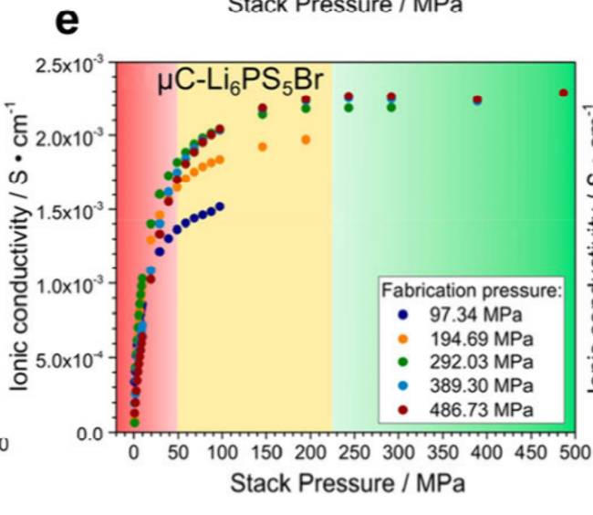

对于富氯的样品：

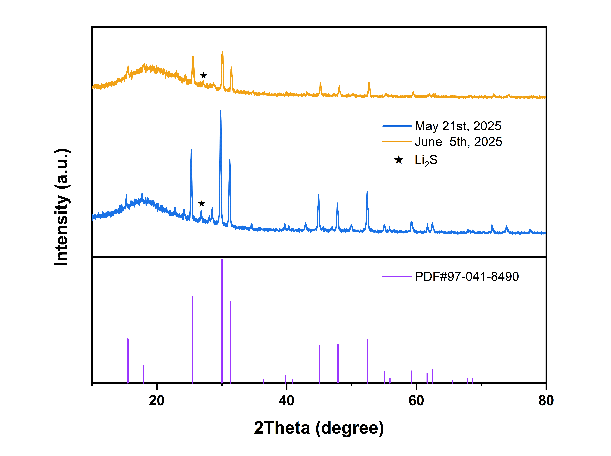

以上两次测试都是在唐楼进行的

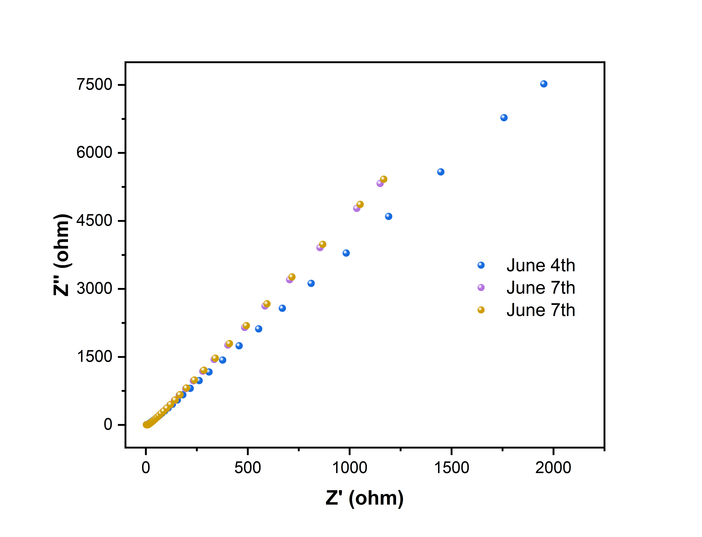

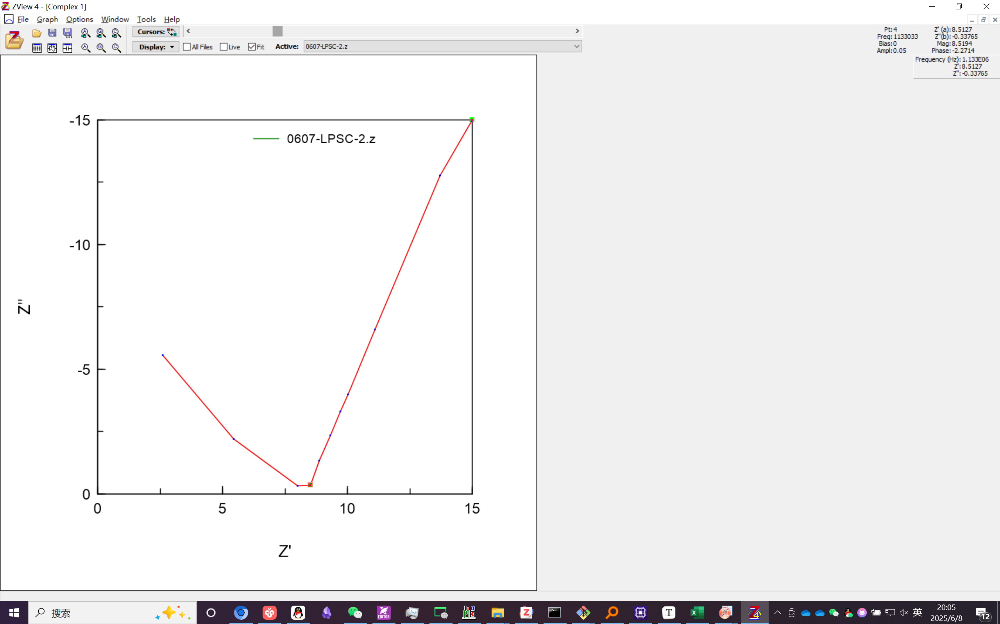

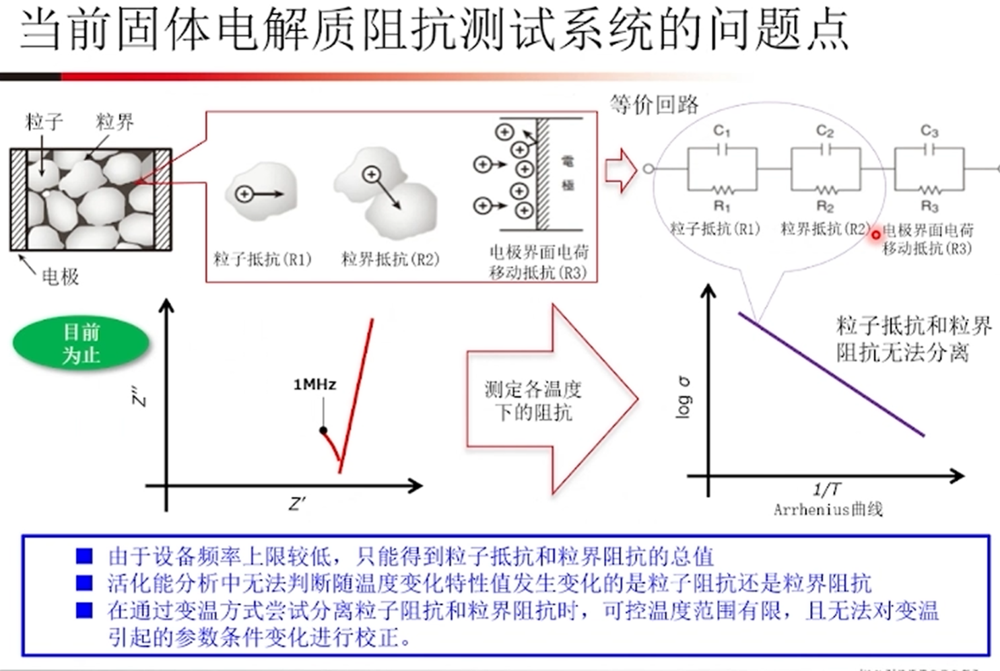

- 受仪器所限制，超高频区域无法测得，观测不到半圆
- 所测得的阻抗为晶界阻抗与体相阻抗之和

$$
离子电导率\sigma = \dfrac{L}{S\times R}=\dfrac{0.62 \times 10^{-1} \rm{cm}}{\frac{1}{4}\pi\times1^2 \times 8.5127 \Omega}=9.273 \rm{mS/cm}
$$
与文献报道的$9.4\pm0.1 \rm{mS/cm}$接近

而对于富溴的样品：

$\rm{Li_{5.3}PS_{4.3}Cl_{0.7}Br}$的阻抗谱测试显示其离子电导率较低，大约只有$\rm{3.68 mS/cm}$，与文献差异较大，

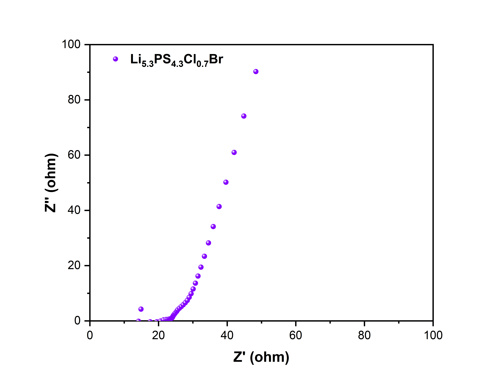

文献中的图

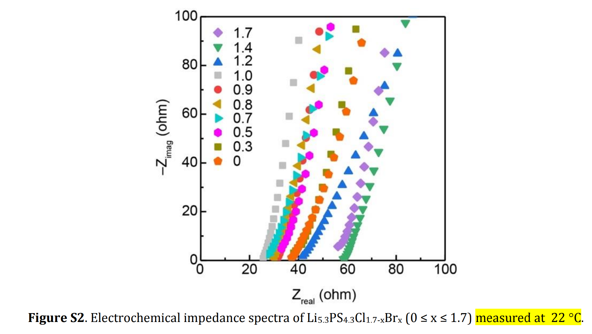

将本次合成的富溴样品与理论计算的S/Br完全有序的$\rm{Li_6PS_5Br}$衍射图谱以及文献图谱对比


我的样品、文献中的衍射图谱、理论模拟的图谱主峰都能对上，但说明都相同形成了特定的晶体结构，但是这三种材料中的阴离子无序度可能不同，导致最终的离子电导率不同，文献的原合成方法比较麻烦就没有采用：称取原料——手磨——球磨（只是为了混合均匀，30min）——300摄氏度真空烧结12小时——再次手磨并压制成==6mm直径==1mm厚的pellet——再次真空烧结，450~460摄氏度，12小时

猜测一：

- 文献中的合成方法第一次烧结不充分但可以促进晶格部分形成，压片时的高压使颗粒表层晶格畸变，原子间接触更紧密，在第二次烧结时能够形成更加无序的阴离子分布格局

有另一篇合成$\rm{Li_{5.5}PS_{4.5}Br_{1.5}}$的文献[Front. Chem. Eng. 4:883502.](https://doi.org/10.3389/fceng.2022.883502)与本次实验合成时的步骤大致相同但球磨参数为100rpm/min且时间只有2h，离子电导率为5.21 mS/cm，有猜想二：

- 根据之前看的文献，当掺入更软、半径 更大的阴离子的时候，$\rm{Li_{6-x}PS_xCl_{1+x}}$中的x通常会减小以适应晶格大小变化，那么其实我合成的$\rm{Li_{5.3}PS_{4.3}Cl_{0.7}Br}$其实更稳定一些（但这并不代表阴离子无序度大、离子电导率大）

- 溴离子与氯离子相比半径大，更软一些，可能需要适当降低球磨强度否则能量过高会导致晶格破碎


能否根据激活能计算大致所需要的临界温度呢？

读一下和球磨相关的文章，球磨的作用究竟是什么？不可能只是简单的混合均匀？

就算球磨强度过高导致晶格无法形成，那为什么后面的高温烧结不可以形成晶相呢？计算一下LPSC和LPSB的晶格能？


