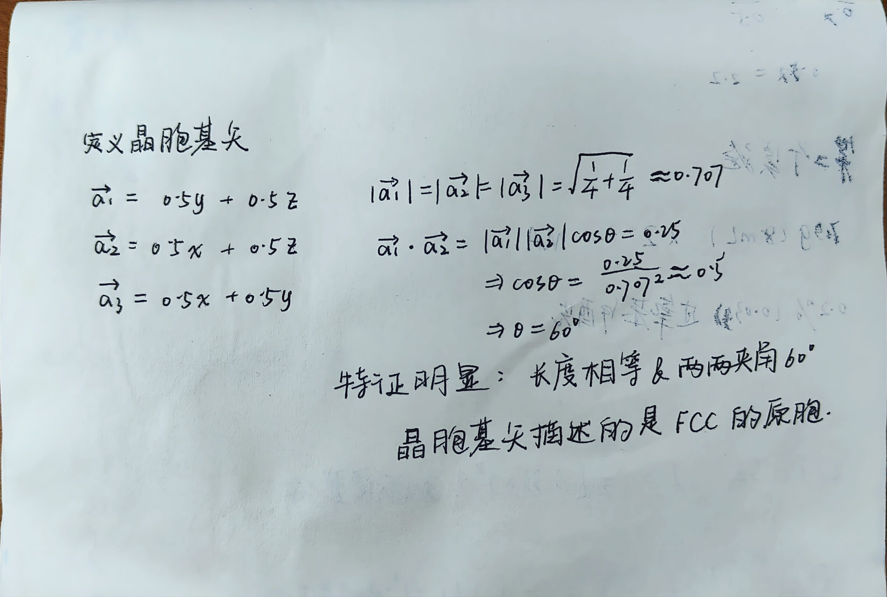

## 测试案例

首先进入一个新目录，然后拷贝测试文件：

```bash
cp ../atat/examples/cuau.in lat.in
```

让`Maps`开始运行：

```bash
maps -d &
```

现在`Maps`已经开始运行，等待下一步的指令，输入命令开始生成结构：

```bash
touch ready
```

大概在10s内，`Maps`会回应：`replies Finding best structure...`，此时可以输入：

```bash
ls */wait
```

查看进入，返回0说明完事了，0目录里包含`str.out`文件，它描述了需要计算能量的结构，比如：

```bash
(base) storm@cernet2:~/test/0$ cat str.out 
3.800000 0.000000 0.000000
0.000000 3.800000 0.000000
0.000000 0.000000 3.800000
0.500000 0.000000 0.500000
0.500000 0.500000 0.000000
-0.000000 0.500000 0.500000
1.000000 1.000000 1.000000 Cu
```

The cluster expansion enables the prediction of the energy of any configuration from the knowledge of the energies of a small number of configurations (typically between 30 and 50), thus making the procedure amenable to the use of first-principles methods.

## 输入文件

`maps`需要两种输入文件：

- `lat.in`，指定父（母）晶格的文件
- `xxxx.wrap`，提供第一性原理计算程序如`vasp`的输入参数

先看一下六方最密堆积的钛-铝合金系统的`lat.in`：

```
3.1 3.1 5.062 90 90 120 
1 0 0 
0 1 0 
0 0 1 
0 0 0 Al,Ti
0.6666666 0.3333333 0.5 Al,Ti
```

这个`lat.in`和`POSCAR`有些相似，从上到下依次为：

- 晶胞参数：$a,b,c,\alpha,\beta,\gamma$
- 原胞x方向上的基矢
- 原胞y方向上的基矢
- 原胞z方向上的基矢
- Al原子的坐标
- Ti原子的坐标

再看一下另一个例子：

```bash
4.1 4.1 4.1 90 90 90
0 0.5 0.5
0.5 0 0.5
0.5 0.5 0
0 0 0 Ca,Mg
0.5 0.5 0.5 O
```

回顾一下`晶胞基矢`的概念，比如下面这个图就是面心立方晶胞的原胞



使用第一性原理程序团簇展开的过程可以概括为：

- 确定参数
- `maps`开始团簇展开
- 判断团簇展开是否足够精确

使用`touch ready`命令，程序会在十秒内返回：

```bash
Finding best structure...
done!
```

`maps`会创建`0`目录，目录内有`str.out`文件，记录着两个`pure structures`：

```bash
(base) [storm@X16 0]$ cat str.out
3.800000 0.000000 0.000000
0.000000 3.800000 0.000000
0.000000 0.000000 3.800000
0.500000 0.000000 0.500000
0.500000 0.500000 0.000000
-0.000000 0.500000 0.500000
1.000000 1.000000 1.000000 Cu
```

运行`runstruct_vasp`程序会调用`vasp`自动进行计算并输出能量：

```bash
(base) [storm@X16 0]$ cat energy
-.37351754E+01
```

如果觉得精度不够不符合要求，可以编辑目录下的`xxxx.wrap`文件，比如我用的第一性原理程序是`vasp`，那么就修改`vasp.wrap`，着重修改`KPPRA`（k-point density）或者平面波的截断能参数，然后回到`0`目录再次计算，直到精度足够即**能量在期望的精度范围内对输入参数的变化变得不敏感**。

使用命令：

```bash
pollmach runstruct_xxxx
```

可以自动计算，它会启动作业管理器，该管理器将监控本地工作站网络上的负载，并在处理器可用时要求映射生成新的结构（即原子排列）。第一次运行该命令时，屏幕上会出现说明，解释如何根据本地计算环境配置作业调度系统。完成此配置后，应在后台通过向上面的命令附加“&”来调用它。

```bash
touch stop
```

```bash
touch stoppol1
```