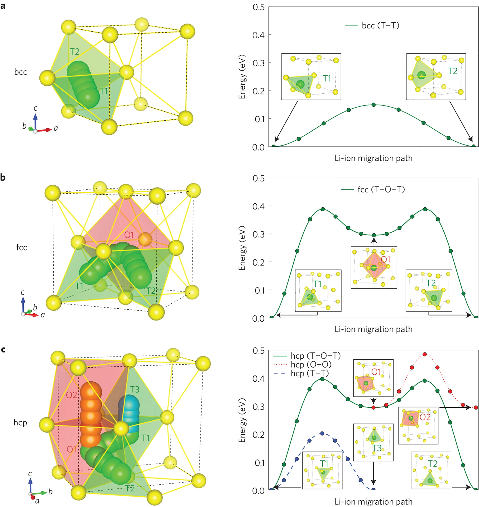
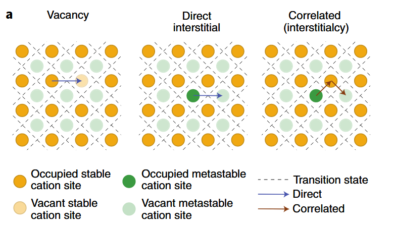
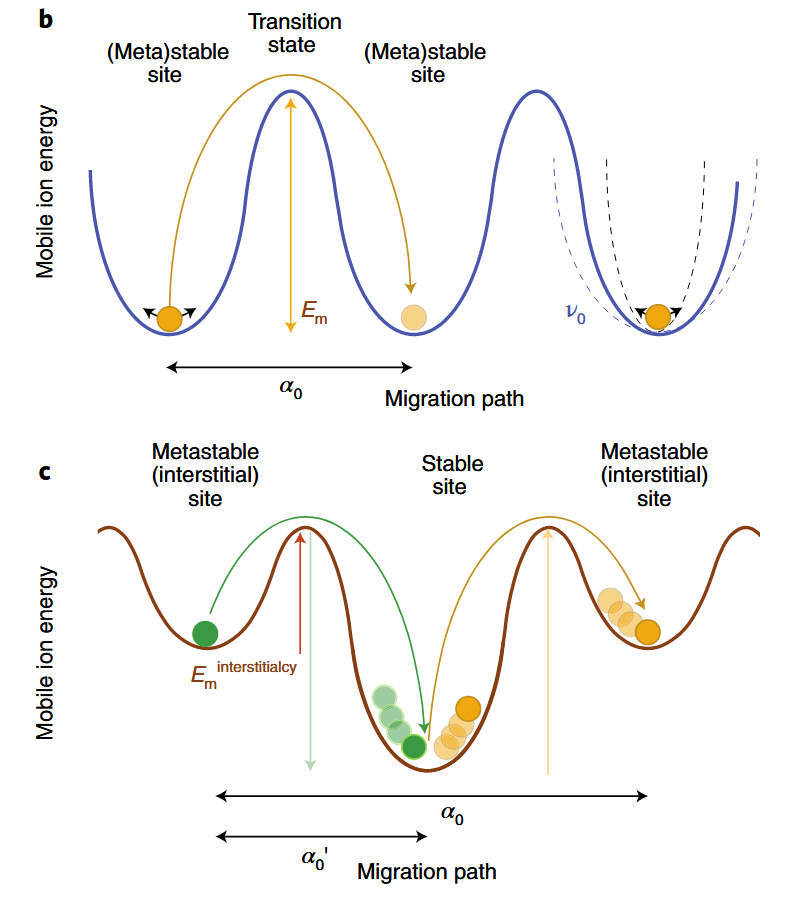
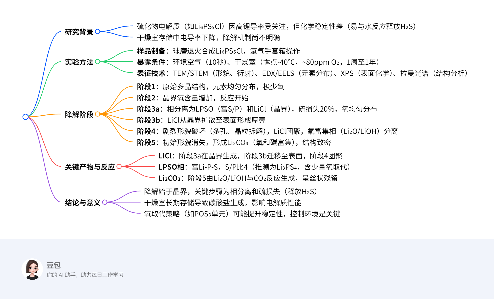

本文排版非常混乱，笔者无心整理，请见谅，**不要看大纲**

## **无机固态电解质基础性质**

### 多尺度离子传输

#### 原子尺度

- 离子扩散路径与环境：

阳离子沿着有利的路径扩散，这些路径由阴离子构成的框架所决定。==阳离子扩散可看作是在基态稳定位点与中间亚稳位点之间的离子跳跃==，能量主要由其局部离子配位环境决定（晶体中通常为四配位和六配位），==体心立方阴离子框架==就是一种常见的优秀离子导体框架，因为这种框架能让离子在相邻四面体位点间直接跳跃，且活化能$E_a$较低，无需经过高 $E_a$ 的四面体 - 八面体跳跃过程(fcc, hcp)

- 阳离子迁移机制

  - 空位扩散
  - 直接间隙
  - 协同扩散

  

  

- 离子电导率相关因素

$$
\sigma=qnu=\sigma_0T^me^{-\frac{E_a}{k_BT}}
$$

- 缺陷与离子传导的关系

在本征状态下，移动带电物种的浓度 $n_3$ 与温度有关，并且和空位及间隙的缺陷形成能 $E_f$ 相关。离子掺杂可以创造出电荷补偿空位或者间隙，从而改变缺陷的浓度，但也可能影响离子传导机制（如锂超离子导体（LISICON）型的大量离子掺杂可能使传导机制变为“超离子”机制）。

- 其他影响离子迁移的因素
  - 机械性能较软的阴离子框架
    - 传到活化能更低，有助于离子扩散
    - 较低的晶格振动频率会导致较低的跳跃尝试频率$\nu_o$和迁移熵$\Delta S_m$减小，从而降低阿氏方程的指前因子
  - 多阴离子基团($\rm{SO_4^{2-}, \rm{PO_4^{3-}}}$)的旋转有助于离子传导（桨轮效应）
- 非晶态材料中的离子传导

无长程有序的结构，尚未建立统一的非晶态传导理论，跳跃理论的部分内容仍可应用，但需要进行统计处理，似乎和理论计算相关……

#### 微观和介观尺度

- 晶界的影响

多数情况下，晶界会增加离子迁移电阻，不利于宏观离子传导，在某些材料中，晶界也可能通过形成低配位位点的路径，促进平行于晶界表面的离子传导。总体而言，控制晶界的浓度和原子特性，有助于调节离子电导率

- 玻璃陶瓷离子导体的特性

玻璃陶瓷离子导体是由非晶相受控结晶形成的材料，在一些材料中，玻璃陶瓷微观结构能稳定亚稳晶体结构，大幅提高离子电导率

- 物理接触与孔隙对离子传导的影响

固态电解质和固态电池中，固体颗粒间的物理接触不足会增加离子传输阻力。相反，孔隙的存在会导致离子传导路径曲折，电流密度不均匀，增加宏观离子传输的可观测电阻。因此，有效致密化多晶固态电解质和复合电极对增强离子传输至关重要。

#### 宏观尺度

- 离子电导率的测量
  - 方法：阻抗谱
  - 影响因素：点接触、晶界、非晶相、杂质等，需要通过拟合抽象模型来分解，这些模型通常基于观察到的电容等经验假设
- 宏观上离子电导率的优化
  - 减少孔隙率
  - 控制晶界
  - 玻璃陶瓷离子导体
- 未来研究方向
  - 高通量计算
  - 新型电极材料
  - 界面工程

### 电化学稳定性

### 界面反应

- 氧化还原分解：固态电解质与电极接触时，通过得失电子和 / 或移动阳离子发生的可逆或不可逆反应（半反应）

$$
\rm{2Li_3PS_4+2e^−+2Li^+\longrightarrow Li_4P_2S_6+2Li_2S}
$$

应产物可能形成离子电阻层或电子导电相，导致界面阻抗增加

- 化学反应:电解质与电极材料在成分空间中混合形成新相的反应

#### 稳定窗口的热力学与动力学

- 热力学稳定性窗口窗口：电解质在不发生分解的电压范围内的热力学极限，由分解反应的自由能($\Delta G$\)决定	
  - 影响因素
    - 阳离子的还原稳定性
    - 阴离子的氧化稳定性
- 动力学稳定性：即使热力学不稳定，反应可能因动力学障碍（如高活化能）而被抑制
  - 关键参数
    - 过电位
    - 离子迁移率
  - 界面工程策略
    - 界面工程分类
      - 本征稳定
      - 动力学稳定
      - 人工保护
    - 典型保护策略
      - 涂层
      - 双电极设计
      - 界面结构优化
  - 界面表征技术
    - 原位XPS
    - 高分辨TEM
    - 阻抗谱
    - 分子动力学模拟

### 力学性能

- **界面粘附**：电解质与电极间的粘附力决定接触面积和离子传输效率。

- **应力响应**：电极材料在充放电过程中的体积变化会引发应力，导致裂纹或界面分层。

- **抗断裂能力**：电解质的断裂韧性决定其抵抗裂纹扩展的能力

#### 关键力学参数

- 界面粘附

  - 影响因素

    - 化学界面能

    - 机械应变

    - 电荷重组

  - 表征
    - 接触角测量
    - 界面电阻与粘附力相关性

- 电化学应变：电极材料在离子嵌入 / 脱嵌时的体积变化

  - 影响
    - 局部应力集中
    - 宏观压力变化
  - 解决方案
    - 零应变电极
    - 优化电极/电解质界面结构

- 弹性模量：杨氏模量（抗拉伸/压缩形变的能力）和剪切模量

  - 低模量材料（如硫化物）理论上可更好地适应应力，但实验发现其仍表现脆性（如 $\rm{Li_2S-P_2S_5}$玻璃的 E≈20 GPa，G≈7 GPa）。

  - 高模量材料（如氧化物）刚性强，但易因应力集中导致断裂

- 断裂韧性：料抵抗裂纹扩展的能力

  - 影响因素
    - 微观结构
    - 化学组成
  - 实验方法
    - 压痕法
    - 裂纹扩展测试

#### 力学失效机制

- 裂纹形成与扩展
  - 电极体积变化引起的机械应力
  - 锂枝晶生长
- 界面分层
  - 机制
    - 循环应力下界面粘附力不足以抵抗应变。
    - 界面反应产物（如电子导电层）削弱结合力
- 锂枝晶生长
  - 提高电解质的断裂韧性（如通过纳米晶结构）
  - 降低电解质的电子电导率以减少枝晶成核点

#### 合成

- 合成方法
  - **机械化学法**：球磨可细化晶粒，提高断裂韧性（如 Li₆PS₅Cl 的 K₁c 从 0.5→1.2 MPa・m¹/²）。
  - **火花等离子烧结（SPS）**：通过控制冷却速率优化微观结构，减少孔隙率。
- 致密化工艺
  - 高致密度（>95%）可降低裂纹扩展风险，但需平衡加工压力与材料软化（如硫化物在高温下易变形）。
- 涂层技术
  - 界面涂层（如 Al₂O₃）可抑制应力集中，提高界面粘附力

| **材料类型**       | **杨氏模量（GPa）** | **剪切模量（GPa）** | **断裂韧性（MPa・m¹/²）** | **应用挑战**       |
| ------------------ | ------------------- | ------------------- | ------------------------- | ------------------ |
| 硫化物（Li₆PS₅Cl） | 20–30               | 7–10                | 0.5–1.0                   | 低韧性导致循环裂纹 |
| 氧化物（LLZO）     | 150–200             | 60–80               | 1.0–2.0                   | 高模量引发应力集中 |
| 硼氢化物（LiBH₄）  | 4–6                 | 1–2                 | 0.3–0.5                   | 化学稳定性差       |

## 固态电解质的合成与处理方法

### 合成

|      | 固态合成法                                       | 软化学法                                                     | 机械化学法                                                   |
| ---- | ------------------------------------------------ | ------------------------------------------------------------ | ------------------------------------------------------------ |
| 工艺 | 将原料粉末混合后高温烧结（通常 > 600°C）         | 在液态溶剂（如乙腈、水）中溶解原料，通过沉淀、溶胶 - 凝胶等反应生成前驱体，再经干燥和退火 | 通过球磨（高能碰撞）引发固态反应                             |
| 优点 | 简单易行，可淬火保留高温相                       | 低温合成（<300°C），精确控制纳米结构                         | 低温合成（室温至 400°C），晶粒细化至纳米级                   |
| 缺点 | 高温导致易挥发成分，可能引入杂质                 | 溶剂回收成本高，前驱体纯度依赖溶剂纯度                       | 工艺参数（球磨时间、转速）对产物影响大，重复性差，可能引入杂质 |
| 案例 | 石榴石型 LLZO（$\rm{Li_7La_3Zr_2O_{12}}$）的合成 | 水热法合成$\rm{Na_3SbS_4}$                                   | 球磨法制备$\rm{Li_{11}Si_2PS_{12}}$                          |

### 致密化技术：将合成后的粉末加工成高密度膜或片，以降低电阻并提高机械强度

|      | 烧结                                                     | 火花等离子烧结                                               | 冷压                                               |
| ---- | -------------------------------------------------------- | ------------------------------------------------------------ | -------------------------------------------------- |
| 工艺 | 常压或加压下（如热压）将粉末在高温（通常 > 500°C）下烧结 | 脉冲电流加热粉末至目标温度（如 LLZO 在 1000°C），同时施加压力（50–100 MPa） | 室温下对粉末施加高压（如 500 MPa）形成素坯，再烧结 |
| 缺点 | 高温可能导致晶界析出杂质或者不稳定                       | 设备成本高，规模化生产受限                                   |                                                    |
|      |                                                          |                                                              |                                                    |

### 集成工艺

|      | 薄膜法                                            | 冷压集成                                                     | 湿法纸浆                                                     | 熔体铸造                                                     |
| ---- | ------------------------------------------------- | ------------------------------------------------------------ | ------------------------------------------------------------ | ------------------------------------------------------------ |
| 工艺 | 溅射、蒸镀或脉冲激光沉积（PLD）制备纳米级电解质膜 | 将电解质粉末与电极材料（如 LiCoO₂）混合后冷压（1–5 GPa）成多层结构 | 将电解质粉末分散在溶剂（如 NMP）中，与电极材料、粘结剂混合成浆料，涂覆后干燥 | 将低熔点电解质（如 Li₂OHCl，熔点≈400°C）加热至液态后倒入模具，冷却固化 |
| 优点 | 厚度可控，适合微型电池，高致密性，介面接触良好    |                                                              | 适合规模化生产，溶剂辅助形成均匀界面，提高离子接触面积       | 一步成型，适合复杂形状                                       |
| 缺点 | 设备昂贵，难以规模化生产                          | 界面接触面积不足，导致高阻抗                                 | 硫化物对水敏感，需严格控制环境湿度                           | 仅适用于低熔点材料，应用范围有限                             |

### 工艺对材料性能的影响

| **工艺**       | **对离子电导率的影响**                                       | **对机械性能的影响**                                         | **对界面的影响**                                   |
| -------------- | ------------------------------------------------------------ | ------------------------------------------------------------ | -------------------------------------------------- |
| **固态合成**   | 高温可能促进结晶，提高电导率（如 LLZO）                      | 晶粒粗大，断裂韧性较低（如 LLZO 的 K₁c=1.2 MPa・m¹/²）       | 晶界杂质导致高电阻（如 LLZO 的晶界电阻占比 > 50%） |
| **机械化学法** | 纳米晶粒增加晶界传导（如 Li₃PS₄的 σ=2 mS/cm）                | 晶粒细化提高断裂韧性（如 Li₆PS₅Cl 的 K₁c=0.8→1.5 MPa・m¹/²） | 界面接触面积大，但晶界缺陷可能增加阻抗             |
| **SPS 致密化** | 高致密度减少孔隙，提高 σ（如 LLZO 的 σ=0.8 mS/cm）           | 高致密度降低裂纹扩展风险（如 LLZO 的孔隙率 < 1%）            | 界面结合紧密，但可能因快速冷却引入应力             |
| **湿法制浆**   | 溶剂辅助形成均匀接触，降低界面电阻（如 Li₆PS₅Cl/NCM 的界面电阻 < 50 Ω・cm²） | 粘结剂（如 PVDF）增加柔性，但降低机械强度                    | 溶剂残留可能导致界面副反应（如硫化物水解）         |

## 关键挑战与解决方案

| **挑战**                     | **解决方案**                                                 |
| ---------------------------- | ------------------------------------------------------------ |
| **锂枝晶穿透电解质**         | 提高电解质断裂韧性（如纳米晶 LLZO 的 K₁c=2.5 MPa・m¹/²），降低电子电导率（<10⁻⁹ S/cm） |
| **界面阻抗增长**             | 设计自钝化界面（如 LiPON/Li₂O 双层涂层），优化接触面积（如纳米颗粒复合电极） |
| **高能量密度与高功率权衡**   | 开发双离子传导路径（如 Li⁺/ 空位协同迁移），采用超薄电解质（<10 μm） |
| **硫化物电解质的环境敏感性** | 表面包覆 $\rm{Al_2O_3}$或 $\rm{Li_3BO_3}$，开发水稳定电解质（如 $\rm{Li_3OCl}$） |

### **潜在突破点**

1. 室温全固态钠电池
   - 采用 $\rm{Na_3PS_4}$基电解质与 $\rm{Na_3V_2(PO_4)_3}$阴极，实现能量密度 > 200 Wh/kg。
2. 固态锂硫电池
   - 利用 $\rm{Li_{10}GeP_2S_{12}}$电解质抑制多硫化物穿梭，循环寿命超 500 次。
3. 固态电解质燃料电池
   - 开发质子传导电解质（如 $\rm{BaZr_{0.8}Y_{0.2}O_3}$），实现氢氧燃料电池的小型化。

## 关于Li-Argyrodite

对于$\rm{Li_7PS_6}$，由于缺乏卤素离子，导致没有阴离子无序，电解质仅表现出笼内跳跃（蓝色）和双重跳跃（绿色），且笼间跳跃（红色）最少，导致材料的离子电导率较低。引入 Cl 阴离子半径相似，S/Cl导致无序程度较高，从而增加了笼间跳跃的可能性。相反，引入较大的 I 阴离子由于尺寸差异，S/I几乎消除了阴离子无序，使得笼间跳跃几乎不可能([但是可以I和Cl共掺杂](https://www.sciencedirect.com/science/article/pii/S209549562400576X?via%3Dihub))，S/Br位于“中间”，是一种亚稳态，倾向于转变为具有较低 S/Br 阴离子无序的稳定状态，但是==加快冷却速率==可以保留这种无序状态

根据Argyrodite电解质的离子传输机制，增加 S/X 阴离子无序和 24g 位置处的锂含量被确定为提高此类电解质离子电导率的关键因素。

- 增加 S/X 阴离子无序
  - 元素掺杂
    
    - 掺杂氯([Adeli, 9.4mS/cm](https://onlinelibrary.wiley.com/doi/10.1002/anie.201814222))
    
    - 多种元素共掺杂
    
      - 在P位点掺杂Si/Ge/Sn，增大构型熵和离子电导率
    
      
    
      - 溴离子和氯离子共掺杂形成阴离子高熵结构([Wang, 26 mS/cm](https://advanced.onlinelibrary.wiley.com/doi/10.1002/adfm.202307954))
  - 快速冷却
  
    - 快速冷却使得S/Br掺杂停留在亚稳态，无序度较高([Wolfgang](https://pubs.acs.org/doi/10.1021/acs.chemmater.9b03852))
  - 施加外部应力诱导电解质中的位错——使材料塑性形变
    - [Faka](https://pubs.acs.org/doi/10.1021/jacs.3c12323)引入位错，压力诱导材料产生**位错和永久应变**，核心机制是**位错核心作为快速扩散通道**（管道扩散），促进长程离子迁移，而局部结构（短程配位）和离子跳跃能垒（激活能 0.36 eV）保持不变

对于一个Argyrodite型的全固态电池来讲，多方面的因素应该被综合考虑

请严格根据文献回答下列问题，不要凭空捏造

- 合成的固态电解质材料是不是做成pellet再测试的离子电导率？如果是，那么pellet的直径多少？厚度多少？锂离子电导率多少？
- 文献合成了固态电解质后是否组装成电池进行了进一步的测试？如果是，那么：
  - 稳定性如何？（对空气的稳定性？对水的稳定性？循环寿命是多少？以及进行循环寿命测试的条件是什么？）
  - 电化学窗口是多少？

| 文献                                                         | 锂离子电导率 | 稳定性              | 突出亮点                                 | 方法                                                         |
| ------------------------------------------------------------ | ------------ | ------------------- | ---------------------------------------- | ------------------------------------------------------------ |
| [Wang](https://doi.org/10.1002%2Fadfm.202307954)             | 26 mS/cm     | 未组装测试          | 超高离子电导率                           | Br^-^、Cl^-^共掺杂                                           |
| [Li](https://onlinelibrary.wiley.com/doi/10.1002/anie.202314155) | 9.6 mS/cm    | 2C高倍率 700 cycles | 10 mm diameters                          |                                                              |
| [Gautam](https://pubs.acs.org/doi/10.1021/acs.chemmater.9b03852) | 2.5 mS/cm    | not mentioned       | 2.4 mm diameters                         |                                                              |
| [Song](https://doi.org/10.1002/aenm.202203631)               |              |                     | 超长循环寿命                             | Si掺杂挤出Cl^-^，局部沉积的锂晶核被亚稳态 Cl ，原位生成电绝缘的 LiCl 壳层包覆晶粒阻止枝晶生长，电绝缘性能又避免了Li的再沉积，并阻止框架内部的Argyrodite颗粒持续分解 |
| [Park](https://www.sciencedirect.com/science/article/pii/S2405829725000790?via%3Dihub) | 2.7 mS/cm    | 200 cycles          | 湿稳定性、结构稳定性、电池性能的协同优化 | 氧占据硫的16e位点，增强 P-O 键；PS₄单元收缩扩大锂扩散路径    |
| [Li](https://www.sciencedirect.com/science/article/pii/S2405829725002211?via%3Dihub) | 10.3 mS/cm   | 400 cycles          |                                          | Cu-S 键增强结构稳定性，溴离子增加无序度(4a/4d位点)           |

对称电池&全固态电池？

- 对称电池（Li||Li 电池）：正负极均为锂金属，中间为固态电解质
  - CCD测试，评估电解质抵抗锂枝晶的穿透能力（电流密度逐步增加，直至短路发生）
  - 长循环稳定性测试
- 全电池（Li|LNO@LCO 电池）
  - 模拟真实环境，测试容量、库仑效率和循环寿命	

#### ==LiCl 析出的根本原因 ——Cl/S 位点竞争==

硫银锗矿中，Wyckoff 4a 和 4d 位点是**Cl 和 S 的共占位**（即 Cl 和 S 随机分布在这些位点上）。当氧错误引入到 4a/4d 位点时

1. **Cl 占有率下降**，氧与 Cl 竞争占位，迫使 Cl 从晶格中析出，形成 LiCl 杂质（反应式：Li₆PS₅Cl + O²⁻ → LiCl↓ + Li₅PS₄O + S²⁻）
2. **化学平衡破坏**，Cl 是维持高离子电导率的关键（Cl 的无序分布可形成 Li⁺迁移通道），Cl 流失会导致通道堵塞，同时降低 SE 的化学稳定性（Cl 不足时，S 更易与水反应生成 H₂S）

LiCl 析出会破坏硫银锗矿的立方 F43m 结构，LiCl 析出导致 HR-LiPSCl 的界面电阻（R_SE,CAM）在 100 次循环后达 62 Ω，比 HR-LiPSOCl3（39 Ω）高 60%，直接导致容量衰减加快。

## Li₆PS₅Cl的降解问题

| **阶段** | **暴露条件**        | **主要变化**                           | **关键产物 / 数据**                                        |
| -------- | ------------------- | -------------------------------------- | ---------------------------------------------------------- |
| **1**    | 原始态（手套箱）    | 多晶结构，P/S/Cl 均匀分布，氧极少      | 无 secondary phase，O/S 比接近 0                           |
| **2**    | 干燥室短期（1 周）  | 晶界氧含量增加，反应启动               | 氧沿晶界分布，硫损失可忽略                                 |
| **3a**   | 干燥室 1-4 周       | 相分离为 LPSO（富 S/P）和 LiCl（晶界） | 硫损失 20%（S/P 比从 5→4），O/S 比显著上升                 |
| **3b**   | 干燥室 3a 后        | LiCl 从晶界扩散至表面形成厚壳          | LiCl 壳层厚度～微米级，颗粒保持部分原始形貌                |
| **4**    | 环境空气 10 秒      | 剧烈多孔化、晶粒拆解，LiCl 团聚        | 氧富集相（Li₂O/LiOH）分离，气泡状形貌                      |
| **5**    | 干燥室长期（>1 月） | 致密化，氧 / 碳富集，原始形貌消失      | Li₂CO₃形成（EDX 检测 C/O 共分布），O/S 比达阶段 1 的～5 倍 |

[文献]([Diseases and disorders](https://pubs.acs.org/action/doSearch?ConceptID=290982&ref=fulltext))通过**实验（同步辐射 X 射线衍射、电化学阻抗、固态 NMR）+ 计算（机器学习分子动力学模拟）**，研究了一种含氰化物的固态电解质 **Li₆PS₅CN** 的结构与动力学行为，核心目标是回答两个问题：

1. **阴离子位点无序（氰离子 CN⁻和硫离子 S²⁻如何混合分布）如何影响锂离子的 “搬家速度”（扩散）？**
2. **位点无序是否会改变氰离子自身的 “旋转运动”，进而间接影响锂离子传输？**

什么是 “有序结构” 和 “无序结构”？（用通俗语言解释）

1. **结构背景：Li₆PS₅CN 的 “原子棋盘”**

- 该材料的晶体结构中，阴离子（CN⁻和 S²⁻）占据两种 “格子”：**4a 位点**（立方体顶点）和**4d 位点**（立方体体对角线中点），形成类似 “钻石晶格” 的排列（图 1）。
- 锂离子（Li⁺）住在这些阴离子格子的 “间隙” 里，需要在间隙中跳跃移动。

2. **有序结构**：阴离子 “分区而治”

- 定义

  ：CN⁻和 S²⁻各自 “乖乖” 待在自己的格子里，比如：

  - 4a 位点全是 S²⁻，4d 位点全是 CN⁻（或反过来），两种离子 “互不串门”（图 8 中的 Configuration 1/6）。

- **特点**：阴离子分布整齐，结构对称性高，但锂离子的间隙环境较单一。

3. **无序结构**：阴离子 “混合混居”

- 定义

  ：CN⁻和 S²⁻在 4a/4d 位点上 “随机混搭”，比如：

  - 4a 位点 67% 是 S²⁻、33% 是 CN⁻，4d 位点 33% 是 S²⁻、67% 是 CN⁻（实验测得的实际结构，图 2 / 表 1），或 50%/50% 混合（模拟中的 Configuration 3/4）。

- **特点**：阴离子分布混乱，结构对称性降低，但锂离子的间隙环境更 “多样化”。

哪种结构促进锂离子传输？**无序结构是 “加速器”**

1. **无序结构如何让锂离子 “跑更快”？**

- 实验证据
  - 电化学阻抗谱（EIS）显示，无序结构的 Li₆PS₅CN 在 30°C 时的体电导率为 **6.8×10⁻⁵ S/cm**，比完全有序的类似材料（如 Li₆PS₅I，碘离子太大无法混合）高几个数量级。
  - 固态 NMR（⁷Li）显示，无序结构中锂离子在 **194 K** 开始 “运动窄化”，即从 “原地振动” 变为 “短程跳跃”，高温下（500 K）扩散系数达 **10⁻⁶ cm²/s**（有序结构仅 10⁻⁷~10⁻⁸ cm²/s）。
- 模拟机制
  - 有序结构中，锂离子被局限在固定的 “锂笼” 里，只能在小范围内跳跃（MSD 曲线快速平台化，图 9a）。
  - 无序结构中，阴离子混合打破了 “锂笼” 的规则性，创造了更多低能量的 “跨笼跳跃路径”，锂离子能更频繁地进行长程扩散（MSD 曲线线性增长，图 9b）。

2. **关键结论**：**只要阴离子能混合（如 CN⁻/S²⁻、Cl⁻/S²⁻），就能促进锂离子长程传输**

- 这是整个 argyrodite 家族（Li₆PS₅X，X=Cl/Br/CN）的共性：**位点无序是高电导率的关键**（碘离子因太大无法混合，导致电导率暴跌）

**“阴离子像跳广场舞一样混合分布（无序）时，锂离子的‘跑道’更畅通，跑得更快；而氰离子自己是否旋转（有序时快、无序时慢）对锂离子的影响不大，关键是阴离子别‘排排站’（别有序）。”**

### Br$^-$、BH$_4^-$掺杂 14.4 mS cm$^-$

银矿型电解质（如 Li₆PS₅X，X=Cl、Br、I）因高电导率和 Li 金属兼容性受关注，此前报道的 BH₄⁻取代银矿电解质（如 Li₅.₃PS₄(BH₄)₂.₃）电导率 > 10 mS cm⁻¹。[本文](https://pubs.rsc.org/en/content/articlepdf/2024/ta/d4ta04426f)的**研究目的**：通过 Br⁻部分取代 BH₄⁻位点，进一步提升银矿型电解质的离子电导率

文献中采用的是两步球磨法，无需加热

| x    | 组成                    | 室温离子电导率（mS cm⁻¹） |
| ---- | ----------------------- | ------------------------- |
| 0    | Li₃PS₄·2.5LiBH₄         | 10.6                      |
| 0.5  | Li₃PS₄·2LiBH₄·0.5LiBr   | 13.6                      |
| 0.7  | Li₃PS₄·1.8LiBH₄·0.7LiBr | **14.4**（最高）          |
| 1.0  | Li₃PS₄·1.5LiBH₄·1LiBr   | 8.4                       |
| 2.5  | Li₃PS₄·2.5LiBr          | 0.49                      |

**关键问题**

1. **为什么 Br⁻和 BH₄⁻共取代能提升离子电导率？**
   - **答案**：Br⁻取代 BH₄⁻位点后，银矿相(argyrodite相)的结晶度提高，且两种阴离子共存增加了晶格无序度，降低 Li⁺迁移的活化能。³¹P NMR 显示，含两种阴离子的银矿相中 PS₄³⁻单元总比例显著增加（如 x=0.5 时达 95.7%），而银矿相比例与离子电导率正相关，从而提升整体电导率。
2. **两步球磨法相比传统方法有何优势？**
   - **答案**：传统方法可能需热处理以促进相形成，但本研究通过两步球磨法（先制备 β-Li₃PS₄，再与 LiBH₄/LiBr 混合研磨），**无需热处理**即可生成高结晶度的银矿相，简化工艺并降低能耗。同时，球磨过程中添加甲苯作为工艺控制剂，避免粉末黏附，确保均匀混合。
3. **含 Br⁻和 BH₄⁻电解质的全固态电池性能提升的关键因素是什么？**
   - **答案**：关键因素包括两方面：
     ① **高离子电导率**：室温下 14.4 mS cm⁻¹ 的电导率加速 Li⁺传输，提升电池速率性能（如 2 C 时仍保持有效容量）。
     ② **界面稳定性**：Br⁻可能促进 Li 金属负极表面形成稳定的固态电解质界面（SEI），减少副反应，使电池在 300 次循环后容量保持率达 92%

### [文献](https://pubs.rsc.org/en/content/articlelanding/2024/ta/d4ta03873h)通过 Sn/Sb/I 三元掺杂，在磷基 SSE 中实现**电导率、界面稳定性、耐湿性的协同提升**，突破传统单一元素掺杂的局限性

#### 1. **锑基硫银锗矿掺杂如何提升磷基电解质的离子电导率？**

**答案**

- **晶格膨胀**：Sn⁴⁺（离子半径 0.069 nm）和 Sb⁵⁺（0.062 nm）替代 P⁵⁺（0.038 nm），I⁻（0.206 nm）替代 Cl⁻（0.181 nm），增大晶格参数（LPSC-0.05 晶格常数 9.967 Å vs LPSC-0 的 9.851 Å），拓宽 Li⁺迁移通道。
- **载流子增加**：Sn⁴⁺的异价掺杂引入额外 Li⁺补偿电荷，提升载流子浓度。
- **能垒降低**：DFT 计算显示，Sn/Sb 与 S 的强键合削弱 S 对 Li⁺的吸引力，使笼内 / 笼间迁移能垒分别降至 0.496 eV 和 0.592 eV（LPSC-0 为 0.873 eV 和 0.976 eV）

#### 2. **掺杂电解质如何实现优异的锂金属界面稳定性？**

**答案**

- 原位形成稳定界面相
  - **LiI 保护层**：I⁻与 Li 反应生成离子导电但电子绝缘的 LiI，抑制界面副反应。
  - **Li-Sn/Sb 合金**：Sn/Sb 与 Li 形成低电阻合金（如 Li₁₇Sn₄、Li₃Sb），促进 Li⁺均匀传输，减少枝晶生长。
- **抑制分解产物**：LPSC-0.05 界面的 Li₂S/Li₃P 等绝缘产物显著减少，界面电阻增长缓慢（300 小时仅从 81.8 增至 160.3 Ω cm²），而 LPSC-0 界面电阻激增 3 倍。

#### 3. **耐湿性提升的化学机制是什么？**

**答案**：

- **软硬酸碱理论（HSAB）**：P⁵⁺（硬酸）易与 H₂O 中的 O²⁻（硬碱）反应，而 Sn⁴⁺/Sb⁵⁺（软酸）倾向与 S²⁻（软碱）结合，形成稳定的 (Sn,Sb)-S 键（键能高于 P-S 键），抑制水解反应。
- **结构保护**：(P, Sn, Sb) S₄单元的形成增强了晶格稳定性，空气暴露后仅少量生成 Li₃PO₄等氧化物，而 LPSC-0 的 PS₄³⁻单元大量分解为 Li₄P₄O₇・5H₂O 等水合物，导致结构崩塌
- **H₂S 释放抑制**：LPSC-0.05 在28%RH 下 30 分钟释放 H₂S 量为 0.46 cm³ g⁻¹，仅为 LPSC-0（1.38 cm³ g⁻¹）的 1/3，证明水解程度显著降低

## [文献](https://advanced.onlinelibrary.wiley.com/doi/epdf/10.1002/aenm.202403291)探究了球磨处理对电解质的影响

| 处理方法         | 频率 / 转速 | 时间    | 研磨介质尺寸 | 目标应用                 |
| ---------------- | ----------- | ------- | ------------ | ------------------------ |
| 频率球磨         | 40 Hz       | 10 min  | 5 mm         | 常规正极复合材料制备     |
| 行星球磨         | 500 rpm     | 10 min  | 5 mm         | 快速混合（如 Li-S 电池） |
| 行星球磨（长期） | 500 rpm     | 240 min | 5 mm         | 极端条件下的结构变化     |

结论

- **双重效应**：球磨通过减小颗粒尺寸（有利）和降低结晶度（不利）共同影响性能，短期处理因颗粒效应占优而提升电池性能；
- **优化方向**：控制球磨能量输入（如转速、时间），平衡结构退化与颗粒尺寸，是提升固态电池性能的关键。

关键问题与答案

#### 问题 1：球磨处理如何影响 Li₅.₅PS₄.₅Cl₁.₅的晶体结构？

**答案**：球磨导致**结晶度下降**和**相干长度减小**（如行星球磨 240 分钟后相干长度从≈30 nm 降至≈15 nm），同时增加**局部结构无序度**（PS₄³⁻聚阴离子和 Li⁺配位环境更无序）。XRD 峰宽化、NPDF 高 r 区域强度衰减及 NMR 谱宽化均证实了这一点。颗粒尺寸从 pristine 的 > 100 μm 降至行星球磨 10 分钟后的≈5 μm，分布更均匀。

#### 问题 2：为什么球磨会降低固态电解质的离子电导率？

**答案**：球磨引起的**结晶度下降和相干长度减小**导致长程离子传输路径受阻。尽管活化能（≈0.38 eV）未变，但晶界或无序区域增加了离子迁移阻力。例如，行星球磨 240 分钟后，室温离子电导率从 6.8 mS/cm 降至 2.8 mS/cm，退火后部分恢复（5.3 mS/cm），表明结构退化是主要原因。

#### 问题 3：颗粒尺寸减小对正极复合材料性能有何积极影响？

**答案**：较小的电解质颗粒（如行星球磨 10 分钟后的≈5 μm）可降低复合材料的**曲折度**，改善离子传输路径。有效离子电导率随颗粒减小而增加（行星球磨 10 分钟样品最高），进而提升电池倍率性能。例如，在 0.05 C 下，该样品放电容量比 pristine 高约 30 mAh/g，证明颗粒尺寸效应能补偿 bulk 电导率的轻微下降。

## 掺杂[In$_2$O$_3$](https://link.springer.com/article/10.1007/s11426-024-2275-2)

1. **成分与结构**
   - 目标电解质：Li₅.₅₊₂ₓInₓP₁₋ₓS₄.₅₋₁.₅ₓO₁.₅ₓCl₁.₅（x=0.02 时最优，记为 LPSC-In₀.₀₂）
   - 结构特征：In³⁺取代 P⁵⁺，O²⁻取代 S²⁻，形成稳定晶格（晶格参数减小至 9.8073 Å）。
2. **性能提升**
   - **离子电导率**：室温下达**7.5 mS cm⁻¹**（纯 Li₅.₅PS₄.₅Cl₁.₅为 9.0 mS cm⁻¹，掺杂后略降但界面相容性显著提升）。
   - 空气 / 水分稳定性
     - 暴露于 30% 湿度空气 20 min 后，H₂S 生成量减少，电导率保留率**56%**（纯电解质仅 10%）。
     - 在−60 °C 低露点干燥室暴露 12 h 后，电导率保留率高达**92%**（纯电解质 78.9%）。
   - **锂金属相容性**：临界电流密度（CCD）从纯电解质的**0.1 mA cm⁻²**提升至**1.8 mA cm⁻²**，抑制锂枝晶初始生长。
3. **机理分析**
   - **硬 - 软酸碱理论（HSAB）**：In（软酸）与 S（软碱）结合力强于 P，减少 S²⁻与水反应；O（硬碱）提高 P-O 键稳定性，降低水解风险。
   - DFT 计算：P-O 键能（5.12 eV）高于 P-S 键（3.46 eV），水吸附能（ΔE_ad）从−0.35 eV（纯电解质）提升至−0.12 eV（改性后），抑制水解反应

## [LSPC在 Cl 离子占据 4c 位点 25% 时达到峰值，而不是在无序度最大时](https://pubs.acs.org/doi/10.1021/acsami.4c08865)

- 锂离子电导率受笼间和笼内跳跃相互作用影响。在 25% Cl@4c 时，笼内快速旋转运动，特别是围绕 4c 位点的双峰路径，使更多 Li 原子能够参与长程扩散；同时，S→S 笼间跳跃路径在 25% Cl@4c 时比 50% 和 75% Cl@4c 时更有利，这两个因素综合作用，使得锂离子电导率在 25% Cl@4c 时达到峰值 。而在 50% Cl@4c 时，虽然无序度最大，有利于扩散路径的渗透，但笼内旋转运动相对较弱，综合效果不如 25% Cl@4c 时。
- 明确了锂离子扩散呈现非阿累尼乌斯行为，在高温（\(>400K\)）时具有不同的活化能。这种行为是由于温度升高时，锂离子围绕 4a 位点的旋转频率增加，促进了长程扩散，原本在低温下限制笼间跳跃的因素不再关键，更多有效的锂离子跳跃路径得以开启，进而降低了活化能

## [$$\mathrm{(Li_{5.4}Al_{0.1}P_{1 - x}Sb_{x}S_{4.7 - 2.5x}O_{2.5x}Cl_{1.3})}$$](https://doi.org/10.1016/j.cej.2024.154426)

合成了x = 0、0.02、0.04、0.06、0.08的电解质

离子电导率:Li$_6$PS$_5$Cl室温离子电导率为1.56x10$^{-2}$S cm$^{-1}$，Li$_{5.4}$Al$_{0.1}$PS$_{4.7}$Cl$_{1.3}$(x = 0)提升至2.79 x 10$^{-3}$ S cm$^{-1}$

1.1 结构改变增加离子传输通道

- 在合成$Li_{5.4}Al_{0.1}PS_{4.7}Cl_{1.3}$电解质时引入$Cl^{-}$和$Al^{3+}$：
  - $Al^{3+}$半径（53 pm） < $Li^{+}$半径（68 pm）
  - $Al^{3+}$占据$Li^{+}$的24g和48h位点 → Li位点空位浓度增加
  - 新增空位为$Li^{+}$扩散提供更多通道

1.2 优化晶体结构促进离子迁移

- XRD Rietveld精修显示$Li_{5.4}Al_{0.1}P_{0.94}Sb_{0.06}S_{4.55}O_{0.15}Cl_{1.3}$结构优化：
  - $Sb^{3+}$位于$P^{5+}$的4b位点 → 形成$SbS_{4}^{3-}$四面体
  - $O^{2-}$位于$S^{2-}$的16e位点 → 形成$PS_{3}O^{4-}$四面体
- 性能对比：
  | 电解质组成       | 离子电导率 (S/cm) |
  | ---------------- | ----------------- |
  | $Li_{6}PS_{5}Cl$ | $1.56×10^{-3}$    |
  | 优化后电解质     | $2.22×10^{-3}$    |

2. 空气稳定性提升的原因

2.1 化学键增强抑制水解反应

- **硬软酸碱理论应用**：
  - $Sb^{5+}$（软酸）与$S^{2-}$（软碱）形成强$Sb-S$键
  - 相比$P-S$键更稳定，减少与$H_{2}O$反应
- 实验数据：
  - $H_{2}S$排放量降低78%

2.2 结构稳定减少与水分反应

- $O^{2-}$掺杂效应：
  - 部分取代$S^{2-}$ → 形成稳定$P-O$键
- 结构稳定性对比（60%RH暴露20min后）：
  | 电解质类型                                                  | XRD衍射峰变化 |
  | ----------------------------------------------------------- | ------------- |
  | $Li_{6}PS_{5}Cl$                                            | 几乎完全消失  |
  | $Li_{5.4}Al_{0.1}P_{0.94}Sb_{0.06}S_{4.55}O_{0.15}Cl_{1.3}$ | 保持稳定结构  |

## [$\text{Li}_{6+x}\text{M}_x\text{Sb}_{1-x}\text{S}_5\text{I}$](https://pubs.acs.org/doi/10.1021/jacs.9b08357)——阳离子无序

## [Nb，O共掺杂](https://advanced.onlinelibrary.wiley.com/doi/10.1002/adsu.202500041)

**研究通过在 Li₆PS₅Cl 电解质中进行 Nb 和 O 共掺杂，制备了系列 Li₆P₁₋ₓNbₓS₅₋₂.₅ₓO₂.₅ₓCl 电解质，显著提升了全固态锂电池的性能**。其中，当 x=0.05 时，电解质室温离子电导率达**4.19 mS cm⁻¹**，较原始电解质提高约 35%；在 30% 相对湿度下，释放的 H₂S 气体量仅为原始电解质的一半，**湿度稳定性显著增强**。得益于界面处形成的离子导体 Li₃OCl，电解质与锂金属的临界电流密度（CCD）提升至**1.55 mA cm⁻²**，且在 0.2 mA cm⁻² 电流密度下循环稳定性达**3600 h**。组装的 LiCoO₂/ 电解质 / Li 电池在 1C 下循环 1000 次后容量保持率为**83.5%**，展现出优异的综合性能。

## [双掺杂——Li₆.₂Ge₀.₁P₀.₉S₄.₈O₀.₂Cl](https://pubs.acs.org/doi/10.1021/acsaem.5c00455)

**研究针对锂硫固态电解质（LPSC）空气稳定性差和锂金属兼容性不足的问题，通过 Ge-O 双掺杂策略合成了 Li₆.₂Ge₀.₁P₀.₉S₄.₈O₀.₂Cl 电解质**，其室温离子电导率达 2.47 mS cm⁻¹，较原始 LPSC 提升 1.6 倍，且活化能低至 0.24 eV。该电解质显著抑制 H₂S 气体释放，空气暴露后离子电导率保留率达 37%，同时临界电流密度（CCD）提升至 1.4 mA cm⁻²，有效抑制锂枝晶生长。基于此电解质的 NCM811/Li 全电池在 0.1 C 下比容量 164.2 mA h g⁻¹，0.5 C 循环 300 次容量保持 86%，库仑效率近 99.7%，为固态电池实用化提供了新路径

## [Mg、Zn、Si和Ge被确定为调节Li离子浓度及其离子电导率的最有希望的掺杂剂](https://pubs.acs.org/doi/10.1021/acs.chemmater.4c01049?ref=PDF)

1. **卤素掺杂优势**：除了碘外，卤素掺杂剂（如Cl、Br、I）在八面体和四面体位点上的替代是可行的，与实验结果一致。
2. **最有希望的掺杂剂**：Mg、Zn、Si和Ge被确定为调节Li离子浓度及其离子电导率的最有希望的掺杂剂，而三价掺杂剂在热力学上是不利的。
3. **共掺杂的影响**：阳离子共掺杂剂对阴离子掺杂剂浓度的影响通常不大，但Si共掺杂可以显著增加阴离子浓度，为F掺杂argyrodite的合成提供了可能；而阴离子共掺杂（特别是在卤素家族内）会显著改变其他阴离子在Li7PS6 argyrodites中的浓度。

## [Li₅.₄P₀.₉₅Sb₀.₀₅S₄.₃₂₅Se₀.₀₇₅Cl₁.₆](https://doi.org/10.1016/j.mser.2025.100972)

研究通过锑（Sb）和硒（Se）双掺杂策略，优化了银矿型硫化物电解质 Li₅.₄P₀.₉₅Sb₀.₀₅S₄.₃₂₅Se₀.₀₇₅Cl₁.₆的化学稳定性和离子导电性，其室温离子电导率达 11.34 mS cm⁻¹，暴露于干燥室 12 小时和潮湿空气 30 分钟后，电导率分别保持 9.42 和 1.73 mS cm⁻¹，显著优于未掺杂电解质。通过乙基乙酸酯和聚偏二氟乙烯的湿涂覆工艺，制备了厚度仅 14 μm、电导率 2.19 mS cm⁻¹ 的超薄电解质膜。该电解质与锂金属界面兼容性优异，对称电池在 0.1 mA cm⁻²/5 mAh cm⁻² 下稳定循环 6000 小时，全固态电池在 1 C 下 500 次循环后容量保持率 81.9%，软包电池在 0.1 C 下循环 500 次容量保持率 82.6%，为高能量密度全固态锂电池提供了有效策略。

| **性能**       | **结构 - 机理关联**                                          | **文献直接依据**                                             |
| -------------- | ------------------------------------------------------------ | ------------------------------------------------------------ |
| **界面相容性** | 1. Sb-S 键强于 P-S 键，抑制 Li 还原电解质生成 Li₂S 等副产物 2. 电子电导率降低，抑制锂枝晶 3. 极化电压稳定，界面阻抗低 | 原位 XPS（图 3e-f）、临界电流密度（图 3a-b）、对称电池循环（图 3c）、电子电导率数据（Figure S4） |
| **空气稳定性** | 1. Sb 软酸替代 P 硬酸，减少与 H₂O/O²⁻的硬 - 硬酸碱反应 2. SbS₄³⁻单元稳定，抑制PS₄³⁻水解和结构降解 3. H₂S 释放量减半，晶体结构保持完整 | 硬软酸碱理论分析、Raman 光谱（图 2b、2f、2h）、XRD（图 2e）、H₂S 释放测试（图 2c） |

## [Li₆₊ₓP₁₋ₓSiₓS₅Br（x=0~0.4）中阴离子位点无序动力学](https://pubs.acs.org/doi/10.1021/jacs.4c14466)

| 淬火温度 /°C | 主要现象                    | 无序度变化（x=0.4） | 晶格参数趋势              |
| ------------ | --------------------------- | ------------------- | ------------------------- |
| 350          | 无序度低，Si 影响小         | 约 20%              | 随 Si↑线性增大            |
| 450          | 无序度中等，Si 效应显现     | 约 30%              | 增大趋势变缓              |
| 550          | 无序度最高，Si 显著促进无序 | 约 35%              | 增大趋势最弱（因无序度↑） |

## [npj计算](https://www.nature.com/articles/s41524-025-01559-9)

- 区分孤立硫阴离子（Siso）与键合硫阴离子（Sbond）

**关键意义**：确认材料中是否存在孤立 Siso，是形成 “笼状传输通道” 的前提（文献中 Li₆PS₅Cl 的高电导率归因于 Siso 诱导的 frustration 现象）

- **高温退火或压力调控**合成不同空间群的硫基 argyrodite（如文献中 Li₈SiSe₆的 F43m、Pna2₁等相），目标是提高孤立阴离子的局部点群对称性（如 Td、Oh）

## [Li₆₊₂ₓP₁₋ₓYₓS₅₋₁.₅ₓO₁.₅ₓCl（x=0~0.1）](https://onlinelibrary.wiley.com/doi/10.1002/anie.202501411)

**研究针对硫化物电解质 Li₆PS₅Cl（LPSC）与锂负极界面反应和枝晶生长问题，提出通过钇（Y）和氧（O）共掺杂调节 PS₄四面体的 d-p 轨道杂化，实现硫原子的电子局域化。** 该策略增强了 Y 与 S 的 Madelung 能，抑制 Li 与 S 的相互作用，同时原位形成 Li₂O 界面保护层，提升空气稳定性。改性后的 LPSC-YO 电解质使 Li 对称电池稳定循环超 4800 小时（0.1 mA cm⁻²），LiCoO₂/Li-In 全电池在 0.5 C 下循环 1300 次容量保持率 100%。研究通过轨道杂化驱动的电子局域化策略，为硫化物基全固态锂电池的界面稳定提供了新路径

x=0.05时最优，$\mathrm{Li_{6.1}P_{0.95}Y_{0.05}S_{4.925}O_{0.075}Cl}$

**核心目标**

- 调节 PS₄四面体的**d-p 轨道杂化（Y 的 d 轨道与 S 的 p 轨道）**，增强 S 原子电子局域化，抑制 Li 与 S 的相互作用；同时原位形成**Li₂O 界面保护层**，提升界面稳定性和空气稳定性

**Y 和 O 共掺杂如何提升 LPSC 电解质的界面稳定性？**

- **答案**：Y 替代P形成Y-S键，通过d-p轨道杂化增强S原子的电子局域化，提升Y-S键的Madelung能（库仑相互作用），抑制 Li 与 S 的还原反应；O 掺杂部分替代 S，通过硬软酸碱理论减少水解反应，同时原位生成 Li₂O 界面层，作为物理屏障阻止 Li 与电解质直接接触，协同抑制枝晶生长和副产物生成。

## [Li₇₋ₓ(GeSi)₍₁₋ₓ₎/₂SbₓS₅I（LGSSSI）](https://pubs.acs.org/doi/10.1021/acsenergylett.4c03115)

**研究开发了一种新型超离子导体硫化物固态电解质 Li₇₋ₓ(GeSi)₍₁₋ₓ₎/₂SbₓS₅I（LGSSSI）**，通过 Ge、Si、Sb 对 Li₆PS₅I 中 P 的多阳离子取代，增加了结构熵和阴离子位点无序度，使 Li⁺迁移活化能降至**0.17 eV**，实现了**12.7 mS cm⁻¹ 的冷压室温离子电导率**（热压后达**32.2 mS cm⁻¹**）。将 LGSSSI 与 Li₃InCl₆（LIC）复合构建全固态电池（ASSBs），电池在 0.1 C 下容量达**219 mAh g⁻¹**，1 C 下 550 次循环后容量保持率**84.4%**，并能在 **-20 至 60 °C**宽温范围及**100 mg cm⁻² 超高阴极负载 ** 下稳定运行，为高性能宽温固态电池提供了新策略。

## [$\mathrm{(Li_{5.33}PS_{4.27}O_{0.12}Cl_{1.58})（HR-LiPSOCl）}$](https://doi.org/10.1016/j.ensm.2025.104078)

16e位置上引入氧，显著提升了材料的耐湿性、结构稳定性及电池性能

## [$\mathrm{(Li_{6-x}AsS_{5-x}Br_{1+x})(0.0<x<0.6)}$](https://doi.org/10.1002/adfm.202420971)

基于硬软酸碱理论（HSAB），通过中子衍射、NMR 光谱和电化学阻抗谱分析发现，$(Br^{-}$ 部分取代 $(S^{2-})$ 削弱了锂离子 “笼” 内相互作用，增加了额外的 T4 锂离子位点，降低了跨笼迁移能垒。其中 $(Li_{5.5}AsS_{4.5}Br_{1.5})$ 表现出卓越的室温离子电导率$(15.4\ \text{mS cm}^{-1})$和空气稳定性，其 $(H_2S)$ 释放量仅为硫代磷酸盐电解质的四分之一，为开发高导电、稳定的硫化物固体电解质提供了新思路。

#### 问题 1：**为什么 Br 取代 S 能提高离子电导率？**

- **答案**：Br⁻取代 S²⁻降低了 4d 位点的平均阴离子电荷密度，减弱 Li⁺与笼中心阴离子的相互作用，使锂离子笼体积扩大$R_{\text{mean}}$ 增大），同时缩短跨笼迁移距离（如 T5-T4-T5 从 3.80 Å 降至 3.70 Å），降低迁移能垒。此外，Br 引入 Li⁺空位，增加离子传输路径的连通性，协同提升电导率至 $15.4\ \text{mS cm}^{-1}$

#### 问题 2：**As 取代 P 对材料性能的核心作用是什么？**

- **答案**：As⁵⁺作为软酸中心（相较 P⁵⁺），根据 HSAB 理论，与软碱（S²⁻、Br⁻）结合更稳定，减少材料在潮湿环境中的分解，降低 \(H_2S\) 释放量。同时，As 的较大离子半径使 $(AsS_4)^{3-}$ 四面体体积扩大（从 4.41 ų 到 5.2 ų），为 Li⁺提供更宽敞的扩散路径，辅助提升电导率和空气稳定性。

#### 问题 3：**如何通过实验验证锂离子的跨笼迁移路径？**

- **答案**：通过中子衍射精修确定锂离子位点（T4、T2、T5 等），发现 Br 含量增加时 T4 位点占据率上升，结合 NMR 自旋 - 晶格弛豫$(^7\text{Li}\ T_1)$分析，观察到跨笼迁移相关的不对称弛豫曲线（β 值降低），表明长程迁移比例增加。电化学阻抗谱和 PFG NMR 测得的扩散系数与电导率正相关，进一步证实 Br 诱导的结构变化促进了跨笼迁移，降低了离子传输阻力。

## [研究聚焦大气气体（CO₂和 O₂）对银矿型硫化物固体电解质 Li₆PS₅Cl 在水分暴露下的影响](https://doi.org/10.1002/cphc.202400872)

**研究聚焦大气气体（CO₂和 O₂）对银矿型硫化物固体电解质 Li₆PS₅Cl 在水分暴露下的影响**，通过电化学阻抗谱、X 射线衍射、X 射线吸收光谱和光电子能谱分析发现：**H₂S 生成量与大气气体无关，但 CO₂促进碳酸盐形成，O₂促进磷酸盐和磺酸盐形成，导致电解质表面降解，进而显著降低锂离子电导率**。研究结果表明，除水分外，大气气体成分是影响硫化物固体电解质性能的关键因素，为全固态电池的制造环境控制提供了新视角。

[一篇综述](https://doi.org/10.1016/j.nanoen.2024.110447)

| 策略              | 典型组成                                         | 离子电导率（RT） | 活化能（eV） | 优势 / 应用场景            |
| ----------------- | ------------------------------------------------ | ---------------- | ------------ | -------------------------- |
| 卤素掺杂          | \(Li_6PS_5Cl_{0.5}Br_{0.5}\)                     | 3.63 mS/cm⁻¹     | 0.31         | 通用型电解质，界面兼容性好 |
| 锂位空位 + 卤化   | \(Li_{5.5}PS_{4.5}Cl_{1.5}\)                     | 14.5 mS/cm⁻¹     | 0.23         | 高能量密度电池，快充需求   |
| 磷位取代（Si/Ge） | \(Li_{6.5}[P/Si/Ge/Sb]S_5I\)                     | 13.2 mS/cm⁻¹     | 0.20         | 高压电池（耐 7 V 正极）    |
| 全卤化结构        | \(Li_{5.2}Si_{0.2}Sb_{0.8}S_4Br_{0.25}I_{1.75}\) | 13.23 mS/cm⁻¹    | 0.17         | 柔性电池，机械稳定性优先   |

## [反着来的，反面教材？](https://pubs.acs.org/doi/10.1021/acs.chemmater.4c02281)

#### 1. **Zn²⁺取代如何影响锂银锗矿的晶体结构和离子传输？**

**答案**：Zn²⁺仅占据 Li⁺的 T5 位点，导致 Li⁺笼内传输路径阻塞。晶格参数因 Zn²⁺的高库仑吸引力和离子半径差异线性减小，形成固溶体。离子电导率随取代度增加而下降（如 Cl 基从 7.4 mS・cm⁻¹ 降至 6.0 mS・cm⁻¹），活化能升高（从 406 meV 升至 415 meV），主要由于 T5 位点阻塞减少 Li⁺迁移路径，同时载流子密度降低和晶格收缩进一步限制传输。

#### 2. **Zn²⁺取代对固态电池界面（CEI）的形成有何影响？**

**答案**：取代加速 CEI 形成并改变其组成。阻抗谱显示，取代材料的界面电阻（R₂+R₃）在初始循环中增长更快，尤其在高截止电位（≥3.8 V）下差异显著。XPS 分析表明，取代样品生成更多含氧降解产物（如亚硫酸盐、硫酸盐），而未取代样品以多硫化物为主。这表明 Zn²⁺可能促进氧化分解反应，形成更电阻性的 CEI 层，导致容量衰减加快。

#### 3. **为什么选择 Zn²⁺作为取代离子？其取代策略的潜在优势与局限性是什么？**

**答案**：

- **优势**：Zn²⁺离子半径与 Li⁺接近（0.60 Å vs 0.59 Å），且在 NCM 工作电位范围内无氧化还原活性，理论上可稳定存在于电解质结构中；Zn 的化合物（如 ZnS）可能吸收分解产物（如 SO₂），改善界面稳定性。
- **局限性**：Zn²⁺占据 Li⁺位点阻塞传输路径，导致电导率下降和活化能升高，抵消了界面调控的潜在优势；实验表明，取代反而加速 CEI 形成，可能因 Zn²⁺促进界面反应动力学或生成高电阻产物。
  **结论**：Zn²⁺取代策略在界面调控中具有挑战性，需平衡离子导电性与界面相容性，为后续过渡金属取代研究提供参考。

## [又一篇综述？](https://doi.org/10.1002/ente.202401420)

#### 3. **掺杂策略及性能提升**

##### 3.1 **离子电导率优化**

- 阴离子掺杂
  - **卤素掺杂**：Cl/Br/I 无序化增加 Li⁺迁移路径，如 Li₅.₅PS₄.₅Cl₁.₅电导率达 9.4 mS cm⁻¹（烧结后 12.0 mS cm⁻¹）。
  - **非化学计量掺杂**：Li 过剩（如 Li₆.₂₅PS₅.₂₅Cl₀.₇₅）增加间隙 Li⁺，电导率 14 mS cm⁻¹，活化能 211 meV。
  - **BH₄⁻/Se²⁻掺杂**：Li₅.₃₅PS₄.₃₅(BH₄)₁.₁₅Cl₀.₇₅电导率达 26.1 mS cm⁻¹，通过团簇动态效应降低迁移能垒。
- 阳离子掺杂
  - **Ge/Si/Sb 取代 P**：扩大 Li⁺笼间距，如 Li₆.₇₅Sb₀.₂₅Si₀.₇₅S₅I 活化能低至 0.17 eV，电导率 13.1 mS cm⁻¹。
  - **高熵电解质**：多阳离子掺杂（如 Li₆.₅P₀.₂₅Si₀.₂₅Ge₀.₂₅Sb₀.₂₅S₅I）提升结构无序性，促进长程迁移。
- 共掺杂策略
  - **Bi-O/In-O 掺杂**：协同增强结构稳定性，如 Li₆.₁₆P₀.₉₂In₀.₀₈S₄.₈₈O₀.₁₂Cl 电导率 2.67 mS cm⁻¹，临界电流密度 1.4 mA cm⁻²。

**表 1：不同掺杂策略下的离子电导率与活化能**

| 掺杂类型   | 典型组成                      | 室温电导率 (mS cm⁻¹) | 活化能 (eV) |
| ---------- | ----------------------------- | -------------------- | ----------- |
| 阴离子掺杂 | Li₅.₃₅PS₄.₃₅(BH₄)₁.₁₅Cl₀.₅    | 26.1                 | -           |
| 阳离子掺杂 | Li₆.₇₅Sb₀.₂₅Si₀.₇₅S₅I         | 13.1                 | 0.17        |
| 共掺杂     | Li₆.₀₄P₀.₉₈Bi₀.₀₂S₄.₉₇O₀.₀₃Cl | 3.4                  | 0.261       |

##### 3.2 **空气稳定性增强**

- **理论基础**：HSAB 理论，硬碱 O²⁻增强 Li⁺键合，抑制 P⁵⁺与 H₂O 反应。DFT 计算显示，O 掺杂使分解能从负值升至正值（如 x>0.5 时 Li₆POₓS₅₋ₓBr₀.₅Cl₀.₅分解能 > 0）。

- 实验验证

  ：

  - **Sb/Zn 掺杂**：Sb-PS₅电解质 H₂S 生成量从 0.57 cm³ g⁻¹（纯 Li₆PS₅Cl）降至 0.09 cm³ g⁻¹，电导率下降幅度 < 10%。
  - **氧化物掺杂**：Li₂O/P₂O₅掺杂使 Li₆.₂₅PS₄O₁.₂₅Cl₀.₇₅在 53% 湿度下 30 min 内 H₂S 生成量显著降低。

##### 3.3 **热稳定性与界面调控**

- **热稳定性**：BH₄⁻掺杂电解质在 160°C 以下稳定，高温退火（550°C）导致 BH₄⁻分解，结构破坏。
- 界面稳定性
  - **阴极界面**：LiNbO₃掺杂抑制 S²⁻/O²⁻交换，界面层厚度从 80 nm 减至 50 nm，如 LiCoO₂电池循环 100 次容量保持 92.2%。
  - 阳极界面
    - 卤素掺杂形成 LiF/LiCl 界面层，如 Li₆PS₅Cl₀.₃F₀.₇临界电流密度 1.45 mA cm⁻¹（纯 Li₆PS₅Cl 为 0.55 mA cm⁻¹）。
    - 氧化物掺杂生成 Li-In/Li-Sb 合金，降低 Li⁺迁移能垒，如 Li₆.₁₆P₀.₉₂In₀.₀₈S₄.₈₈O₀.₁₂Cl 界面电阻降低 3.5 倍。

### 关键问题及答案

#### 问题 1：**掺杂如何提升锂 - 银辉石电解质的离子电导率？**

**答案**：掺杂通过三种主要机制提升电导率：

1. **增加 Li⁺迁移路径**：阴离子掺杂（如 Cl/Br）引入无序化，扩大 Li⁺笼间距（如 Ge 掺杂使晶格膨胀），降低迁移能垒（活化能从 0.41 eV 降至 0.17 eV）；
2. **提升 Li⁺浓度**：非化学计量 Li 过剩（如 Li₆.₂₅PS₅.₂₅Cl₀.₇₅）增加间隙 Li⁺位点，促进长程扩散；
3. **动态结构调节**：BH₄⁻等团簇掺杂通过旋转 / 平移调整 Li⁺迁移通道，如 Li₆POS₄(SH) 中 SH⁻阴离子动态降低能垒。

#### 问题 2：**为什么掺杂能改善电解质的空气稳定性？其理论依据是什么？**

**答案**：掺杂改善空气稳定性的核心是抑制水解反应，理论依据为**HSAB 理论**：

- 未掺杂电解质中，软碱 S²⁻与硬酸 P⁵⁺结合，易与空气中 H₂O（硬碱）反应生成 H₂S；
- 掺杂 O²⁻（硬碱）后，形成更强的 Li⁺-O 键，提升分解能（如 O 掺杂使 Li₆POₓS₅₋ₓBr₀.₅Cl₀.₅分解能从 - 0.03 eV 升至 + 0.04 eV），抑制 P⁵⁺与 H₂O 反应；
- 阳离子掺杂（如 Sb/Zn）通过形成稳定的 SbS₄/ZnS 单元，减少水吸附（如 Sb-PS₅电解质水吸附能降低 50%）。

#### 问题 3：**界面稳定性对全固态电池的影响及掺杂如何解决？**

**答案**：界面稳定性直接影响电池阻抗和循环寿命，掺杂通过形成稳定界面层解决：

- **阴极界面**：Nb/O 掺杂抑制 S²⁻向阴极迁移（如 LiNbO₃掺杂使 Ni 离子扩散深度从 80 nm 减至 50 nm），降低副反应；

- 阳极界面

  ：

  1. 卤素掺杂生成 LiF/LiCl 层（高界面能），阻碍 Li 枝晶生长（如 Li₆PS₅Cl₀.₃F₀.₇临界电流密度提升 2.6 倍）；
  2. 氧化物掺杂形成 Li-In/Li-Sb 合金（低迁移能垒），促进 Li⁺均匀沉积（如 In-O 掺杂使界面电阻降低 3.5 倍）；

- 共掺杂协同增强界面机械强度与离子导通性，如 Bi-O 掺杂形成 Li-Bi 合金与 Li₂O 保护层，兼顾绝缘性与 Li⁺传输。

## [Li-Sb合金](https://doi.org/10.1002/smtd.202400571)

**研究通过在锂银辉石固态电解质 Li₆PS₅Cl 中掺杂锑（Sb）形成 Li–Sb 合金，显著提升全固态锂电池的界面稳定性**。Sb 掺杂使电解质获得**9.206 mS cm⁻¹ 的室温离子电导率**，并在锂金属界面形成 Li–Sb 合金，促进均匀锂沉积，实现**14.5 mA cm⁻² 的超高临界电流密度（CCD，硫化物电解质中最高）**，以及**1900 小时（0.1 mA cm⁻²）和 900 小时（1.0 mA cm⁻²）的长循环稳定性**，无锂枝晶穿透。此外，Sb 与硫的强键合增强了电解质的抗水解能力，空气暴露 30 分钟仅产生 0.7 cm³ g⁻¹ 的 H₂S 气体，验证了合金形成策略在提升界面稳定性和空气稳定性中的关键作用。

1. **材料设计**
   - 合成系列 Sb 掺杂电解质**Li₆P₁₋ₓSbₓS₅Cl**（x=0~0.08），其中 **LPSC-0.04（x=0.04）** 表现最佳。
   - Sb 取代 P 位点，形成 (P/Sb) S₄³⁻单元，导致晶格膨胀（a=11.047 Å vs 纯样 10.354 Å），利于 Li⁺迁移。

#### 1. **Li–Sb 合金如何提升界面稳定性？**

**答案**：
Li–Sb 合金在锂金属与电解质界面形成后，通过以下机制提升稳定性：

- **均匀锂沉积**：合金作为锂沉积的核位点，促进锂均匀成核，避免局部电流集中导致的枝晶生长；
- **降低界面电阻**：合金层保持良好的界面接触，减少循环中因体积变化产生的孔洞和裂纹，抑制钝化层形成；
- **抑制副反应**：Sb 的引入减少电解质中 P 与 Li 的直接反应，降低 Li₂S 等绝缘产物的生成，维持界面离子导通性。

#### 2. **为何 Sb 掺杂能改善电解质的空气稳定性？**

**答案**：
根据硬 - 软酸碱理论（HSAB），Sb⁵⁺（软酸）与 S²⁻（软碱）的键合强度高于 P⁵⁺与 S²⁻，具体表现为：

- **抗水解能力增强**：Sb-S 键能更高，抑制 H₂O 中 O²⁻（硬碱）取代 S²⁻，减少 H₂S 生成（暴露 30 分钟 H₂S 产量从 2.0 cm³ g⁻¹ 降至 0.7 cm³ g⁻¹）；
- **结构稳定性提升**：DFT 计算显示，Sb 掺杂后 S 被 O 取代的反应能（ΔE）从 - 963 J mol⁻¹ 升至 - 698 J mol⁻¹，表明水解反应更难发生，晶体结构不易分解。

#### 3. **LPSC-0.04 的临界电流密度（CCD）为何显著高于纯样？**

**答案**：

- 枝晶抑制机制

  ：高 CCD（14.5 mA cm⁻² vs 纯样 0.75 mA cm⁻²）源于 Li–Sb 合金的形成：

  - 合金层作为物理屏障，阻碍锂枝晶穿透电解质；
  - 均匀的锂沉积减少局部应力集中，避免电解质裂纹形成，维持界面完整性；
  - 低电子电导率（Sb 掺杂降低电子传导）抑制枝晶的电子诱导生长，进一步提升 CCD。

## [调节硫的p带中心](https://doi.org/10.1002/adfm.202412144)

**研究通过 Sb/O 共掺杂调节 Li₆PS₅Cl 电解质中硫的 p 带中心，形成 SbS₄四面体，使 S-p 带中心下移，促进 Li/LPSC-SbO 界面原位生成稳定的 LiₓSbᵧS_z 界面相，抑制锂枝晶生长（Li 对称电池稳定循环超 4000 h），同时增强 SbS₄四面体与 Li 原子的相互作用，减少向 S₈的电荷转移，提升硫正极界面稳定性。O 掺杂提高了电解质的空气稳定性。基于 LPSC-SbO 的全固态锂硫电池在 0.1 C 下比容量达 932.6 mAh g⁻¹，150 次循环后容量保持率 83.7%，且 pouch 电池展现出良好的实际应用安全性。**

#### 二、研究策略：Sb/O 共掺杂调控 p 带中心

1. **掺杂设计**
   - **Sb 替代 P**：形成 SbS₄四面体，利用 Sb 与 P 的电负性和离子半径差异，降低 S-p 带中心（更远离费米能级）。
   - **O 替代 S**：提高电解质空气稳定性（HSAB 理论：硬碱 O²⁻替代软碱 S²⁻，抑制水解产生 H₂S）。

#### 1. **Sb/O 共掺杂如何同时改善锂负极和硫正极界面稳定性？**

**答案**：

- **锂负极**：Sb 掺杂形成 SbS₄四面体，S-p 带中心下移使导带靠近费米能级，促进 Li 向 S 提供电子，原位生成离子导电的 LiₓSbᵧS_z 界面相（如 Li₃Sb、LiSbS₂），均匀 Li 沉积并抑制枝晶。
- **硫正极**：S-p 带中心远离费米能级，增强 SbS₄四面体与 Li 原子的相互作用，减少 Li 向 S₈的电荷转移，抑制电解质分解，保持导电网络稳定。

#### 2. **LPSC-SbO 电解质的空气稳定性为何显著提升？**

**答案**：
O 掺杂通过硬碱替代软碱（O²⁻替代 S²⁻），依据 HSAB 理论，减少硫化物与水的反应活性。实验显示，LPSC-SbO 暴露 60 min 后 H₂S 释放量比 LPSC 减少 270%，X 射线衍射（XRD）和拉曼光谱（Raman）表明其结构无明显分解，离子电导率仅下降 22%（LPSC 下降 67.3%）。

#### 3. **LPSC-SbO 在全固态电池中的实际性能优势有哪些关键数据支撑？**

**答案**：

- **循环稳定性**：0.1 C 下 150 次循环容量保持 83.7%（LPSC 仅 50 次循环保持 53.9%）。
- **高倍率性能**：1 C 下比容量 396.3 mAh g⁻¹（LPSC 仅 179.4 mAh g⁻¹）。
- **安全性**： pouch 电池经弯曲、刺穿后仍稳定放电，初始容量 773.4 mAh g⁻¹，20 次循环后无明显衰减。

## [掺三价离子和氟离子](https://doi.org/10.1002/aenm.202402929)

本文提出通过In³⁺取代 P⁵⁺、F⁻取代 Cl⁻的共掺杂策略，在锂银锗矿型硫化物电解质$\mathrm{(Li_{5.7}PS_{4.7}Cl_{1.3})}$中引入$\mathrm{InF_3}$，制备了高性能硫化物电解质$\mathrm{Li_{5.82}P_{0.94}In_{0.06}S_{4.7}Cl_{1.12}F_{0.18}}$（LPSC-InF）。该电解质在 25℃下具有2.5 mA/cm² 的临界电流密度**，锂对称电池在 1 mA/cm² 下循环寿命超**1000 小时**，且对空气和有机溶剂表现出优异稳定性。通过浆料浇铸和热压工艺制备了**35 μm 超薄电解质薄膜，离子电导率达 1.4 mS/cm，组装的全固态电池（如 LiCoO₂和 FeS₂正极）展现出长循环寿命和高能量密度（FeS₂体系达 410 Wh/kg），为超薄硫化物电解质薄膜的规模化生产提供了设计策略。

- 掺杂策略
  - **In³⁺取代 P⁵⁺**：降低晶格能，增加 Li⁺空位，提升离子电导率；形成 Li-In 合金界面，抑制 Li 枝晶。
  - **F⁻取代 Cl⁻**：减小阴离子半径，调节晶格参数，增强化学稳定性（HSAB 原理：软酸 In³⁺与软碱 S²⁻结合更稳定）。
- **最优组成**：$\mathrm{Li_{5.82}P_{0.94}In_{0.06}S_{4.7}Cl_{1.12}F_{0.18}}$（x=0.06，LPSCInF），通过固相烧结法合成。

| 性能指标         | 原始 LPSC   | LPSCInF（x=0.06）                                 | 优势分析                                                     |
| ---------------- | ----------- | ------------------------------------------------- | ------------------------------------------------------------ |
| **离子电导率**   | 4.8 mS/cm   | 5.6 mS/cm（块体） 1.4 mS/cm（35 μm 薄膜）         | In³⁺增加 Li⁺空位，降低扩散能垒（0.236 eV vs 原始 0.662 eV）  |
| **临界电流密度** | 1.0 mA/cm²  | **2.5 mA/cm²**                                    | 抑制 Li 枝晶，提升电池功率密度                               |
| **循环稳定性**   | 75 小时短路 | 1 mA/cm² 下 > 1000 小时 0.5 mA/cm² 下 > 2000 小时 | 界面形成 LiF（电子绝缘）和 Li-In 合金（高 Li⁺扩散），均匀 Li 沉积 |
| **电子电导率**   | -           | \(2.94×10^{-9} S/cm\)（低电子导电抑制枝晶）       | -                                                            |

#### 4. 稳定性提升机制

- 空气稳定性
  - H₂S 释放量降低：LPSCInF 在 60 分钟内释放 1.16 cm³/g，原始 LPSC 为 3.82 cm³/g。
  - 机制：F⁻增强 Li-F 键，减少 Li-O 键形成；In³⁺与 S²⁻结合稳定，抑制水解。
- 溶剂稳定性
  - 离子电导率下降幅度小：甲苯中下降 8.75%（原始 37.5%），二氯甲烷 17.5%（原始 56.3%）。
  - 机制：In³⁺作为软酸减少与极性溶剂（硬碱）的反应，DFT 计算显示溶剂吸附能降低。

#### 问题 1：In 和 F 共掺杂如何提升硫化物电解质的 Li 金属相容性？

**答案**：

- In³⁺取代 P⁵⁺形成 Li-In 合金界面，其 Li⁺扩散系数（10⁻⁸~10⁻⁶ cm²/s）远高于纯 Li 金属（5.69×10⁻¹¹ cm²/s），促进 Li⁺均匀沉积，降低成核过电位。
- F⁻掺杂生成 LiF 界面层（带隙 7.4 eV），作为电子绝缘体阻断 SE 与 Li 的副反应，抑制枝晶生长。
- 二者协同作用使临界电流密度提升至 2.5 mA/cm²，循环寿命超过 1000 小时（1 mA/cm²）。

#### 问题 2：溶剂稳定性对硫化物电解质薄膜制备的意义是什么？如何通过掺杂实现？

**答案**：

- **意义**：传统硫化物 SEs 与极性溶剂反应导致结构降解，限制浆料浇铸等溶液加工工艺。稳定的 SEs 可实现超薄薄膜（如 35 μm）的连续制备，降低电解质层厚度和重量，提升电池能量密度。

- 掺杂机制

  - In³⁺（软酸）替代 P⁵⁺（硬酸），减少与极性溶剂（硬碱）的 HSAB 反应，DFT 计算显示溶剂吸附能从 - 0.41 eV（原始）降至 - 0.12 eV（LPSCInF）。
- F⁻增强晶格稳定性，抑制 S²⁻与溶剂中亲电 C 原子的反应，Raman 和 XRD 证明掺杂后 SEs 在溶剂中无明显分解产物。

#### 问题 3：超薄电解质薄膜（35 μm）相比传统厚膜（>500 μm）的核心优势是什么？如何平衡薄膜厚度与离子电导率？

**答案**：

- 核心优势

  ：

  - 厚度减少 90% 以上，降低非活性材料占比，提升电池能量密度（FeS₂体系达 410 Wh/kg）。
  - 缩短 Li⁺扩散路径，结合高电导率（1.4 mS/cm），实现高倍率性能（1 C 时容量保持率 80%）。

- 平衡策略

  ：

  - 通过 PIB binder 增强薄膜机械强度，填充颗粒间隙，保持离子导电通路连续性。
  - 优化掺杂浓度（x=0.06），在晶格膨胀（In³⁺）和阴离子半径减小（F⁻）间取得平衡，确保薄膜态电导率损失可控（块体 5.6 mS/cm → 薄膜 1.4 mS/cm），同时满足机械柔韧性。

## [**阴离子对锂离子扩散的影响**](https://doi.org/10.1002/aenm.202402396)

**研究通过基于神经网络势（NNP）的机器学习模拟，探究了锂银矿固体电解质（Li₆PS₅X, X=Cl/Br）中阴离子对锂离子扩散的影响**。将锂框架分为八面体笼（Oₕ笼）和走廊笼，发现笼中心的硫离子通过更强的库仑相互作用束缚锂离子，导致其局部化。通过分子动力学模拟揭示离子扩散系数（D）与笼中心卤素离子比例的乘积成正比（**D ∝ Rₓ,ₒₕ × Rₓ,ₙₒᵣᵣᵢ𝒹ₒᵣ**），提出通过减少笼中心硫离子占据、优化卤素掺杂比例来提升锂离子电导率，为固态电解质的离子传输机制和性能优化提供了理论基准。

### 详细总结

#### 1. **研究背景与目标**

- **固态电解质（SSEs）重要性**：锂银矿（Li₆PS₅X, X=Cl/Br）因高离子电导率、加工性和稳定性，成为下一代电池的核心材料，但阴离子对锂离子扩散的影响机制尚不明确。
- **传统方法局限**：密度泛函理论（DFT）计算成本高，难以模拟大尺度结构和长时间过程，需借助 ** 神经网络势（NNP）** 结合分子动力学（MD）扩展研究能力。

#### 2. **晶体结构与笼分类**

- 结构特征

  ：Li₆PS₅Cl 为 F43m 空间群，包含 4a 位 Cl⁻、4b 位 PS₄³⁻、4d 位 S²⁻，Li⁺位于 24g 位，形成两类笼结构：

  - **Oₕ笼（八面体笼）**：以 4d 位阴离子（S²⁻/Cl⁻）为中心，Li⁺形成八面体框架。
  - **走廊笼（立方八面体笼）**：以 4a 位阴离子（Cl⁻/S²⁻）为中心，连接 Oₕ笼，促进跨笼扩散。

- **阴离子无序**：硫氯反位缺陷（Rₐₛ）导致阴离子在笼中心交换，影响 Li⁺分布（如 Rₐₛ=0 时 S²⁻占据 4d 位，Li⁺偏向 24g 位；Rₐₛ=1 时 S²⁻占据 4a 位）。

#### 3. **分子动力学模拟与关键数据**

- 扩散系数（D）变化
  - Rₐₛ=0 时，D=9.31×10⁻¹⁰ cm²/s（300 K），因 S²⁻在 Oₕ笼中心强束缚 Li⁺。
  - Rₐₛ=0.5 时，D=1.34×10⁻⁷ cm²/s（300 K），卤素均匀分布，Li⁺局部化最弱。
  - Rₐₛ=1 时，D=8.06×10⁻⁹ cm²/s（300 K），S²⁻转移至走廊笼，重新束缚 Li⁺。
- 激活能（Eₐ）分析
  - Oₕ笼逃逸 Eₐ：Rₐₛ=0 时最高 0.23 eV，随 Rₐₛ增加降至 0.04 eV（Rₐₛ=1）。
  - 走廊笼逃逸 Eₐ：Rₐₛ=0 时最低 0.02 eV，随 Rₐₛ增加升至 0.27 eV（Rₐₛ=1）。
  - 瓶颈 Eₐ由两类笼中较高值决定，与扩散系数趋势一致。

#### 4. **统计分析与局部化机制**

- 自相关因子（f）

  ：量化 Li⁺返回原位的倾向，f 越低表示局部化越强。

  - Rₐₛ=0/1 时，f≈0.05，Li⁺高度局部化；Rₐₛ=0.5 时，f≈0.15，局部化最弱。

- **轨迹分析**：Rₐₛ=0 时 Li⁺在 Oₕ笼形成孤立圆形轨迹；Rₐₛ=1 时在走廊笼形成菱形轨迹，均显示局部化；中间值时轨迹连通，促进跨笼扩散。

#### 5. **卤素掺杂策略与公式推导**

- 核心公式

  ：离子扩散系数与笼中心卤素比例的乘积成正比，

  D ∝ Rₓ,ₒₕ × Rₓ,ₙₒᵣᵣᵢ𝒹ₒᵣ

  （X=Cl/Br）。

  - Rₓ,ₒₕ：Oₕ笼中心卤素比例（=Rₐₛ），Rₓ,ₙₒᵣᵣᵢ𝒹ₒᵣ：走廊笼中心卤素比例（=1-Rₐₛ）。
  - 最佳条件：Rₐₛ=0.5 时，乘积最大（0.25），对应最高 D。

- **实验验证**：不同卤素掺杂浓度的电导率与公式预测一致，证实阴离子配置的关键作用。

#### 6. **结论与意义**

- **理论突破**：首次通过 NNP 模拟揭示两类笼结构中阴离子对 Li⁺局部化的影响，补充传统 DFT 的尺度限制。
- **应用指导**：提出通过调控笼中心硫 / 卤素比例（如卤素掺杂）降低 Li⁺局部化，提升电导率，为固态电解质设计提供量化基准。
- **技术影响**：推动高安全性、高能量密度固态电池的研发，助力储能技术进步。

### 关键问题与答案

#### 1. **基于 NNP 的模拟方法相比传统 DFT 有何优势？**

**答案**：NNP 模拟通过机器学习拟合 DFT 数据，可处理大尺度原子模型（如 256 个晶胞、3326 个原子）和长时间动力学过程（3 ns），显著降低计算成本，同时保持高精度（验证集均方根误差 < 10 meV/atom）。相比之下，DFT 因计算量限制，难以研究复杂缺陷和高浓度掺杂体系，而 NNP 能够捕捉 Li⁺在真实无序结构中的扩散行为，为实验提供更贴近实际的理论预测。

#### 2. **两类笼结构（Oₕ笼与走廊笼）对锂离子扩散的影响有何差异？**

**答案**：

- **Oₕ笼**：以 4d 位阴离子为中心，Li⁺形成八面体配位。硫离子占据时（Rₐₛ=0），Li⁺因强库仑作用（Li-S 键长 2.45 Å）被束缚，逃逸激活能高达 0.23 eV，导致局部化；卤素占据时束缚减弱，促进 Li⁺跨笼迁移。
- **走廊笼**：以 4a 位阴离子为中心，连接多个 Oₕ笼，结构更开放。硫离子占据时（Rₐₛ=1），Li⁺在走廊笼内局部化，逃逸激活能升至 0.27 eV；卤素占据时（Rₐₛ=0），Li⁺易逃逸（激活能 0.02 eV），成为快速扩散通道。
  两者共同决定 Li⁺的整体迁移速率，需平衡双笼中心的卤素比例以最大化扩散系数。

#### 3. **为什么卤素掺杂能提高锂离子电导率？其优化的理论依据是什么？**

**答案**：卤素掺杂通过取代笼中心的硫离子，减少 S²⁻对 Li⁺的强束缚。理论依据为**D ∝ Rₓ,ₒₕ × Rₓ,ₙₒᵣᵣᵢ𝒹ₒᵣ**，即扩散系数与双笼中心卤素比例的乘积成正比：

- 当卤素（Cl/Br）占据 Oₕ笼和走廊笼中心时，Li⁺局部化减弱，跨笼扩散路径连通（如 Rₐₛ=0.5 时，两笼卤素比例均为 50%，乘积最大）。
- 实验中，电导率随该乘积增加呈线性上升趋势，证实通过调控卤素掺杂比例（如 Li₆PS₅Cl₀.₅Br₀.₅），可有效降低 Li⁺的激活能和局部化程度，从而提升电导率。
  该策略为实验设计提供了明确的量化指标，避免过度掺杂导致副产物（如 LiCl）生成。

## Brain Storm

- 固态电解质

  - 合成工艺方面
    - 两步球磨法
    - 常规一步球磨后煅烧
    - [微波辅助湿法，超 5000 小时的长循环稳定性](https://doi.org/10.1016/j.jechem.2025.01.031)
    - [快速微波辅助合成法](https://doi.org/10.1002/adfm.202500237)
    - 
  - 掺杂方面
    - 生成低电阻化合物以促进锂离子均匀传输
    - 减少绝缘产物的生成
    - 增强晶格的稳定性
      - 软硬酸碱理论
        - 使S$^{2-}$被氧外的其他离子结合
    - 阳离子掺杂
      - 掺杂Al$^{3+}$~Li$^+$，引入锂离子空位
      - 掺杂Sn$^{4+}$~P$^{5+}$，增大晶格促进锂离子迁移
    - 促进阴离子无序
    - 促进阳离子无序

- 阳极改性
  - 表面处理
    - 如[生成离子导电但电子绝缘的LiF复合层](https://link.springer.com/article/10.1007/s11426-024-2275-2)
    - [包覆ZrO$_2$](https://doi.org/10.1016/j.apmt.2024.102410)，具有更高的初始放电容量和更小的极化电压
  
- 界面相容性

  - 掺杂电解质与锂金属界面反应生成了离子导体 Li₃OCl，其具有 3D 锂离子迁移通道
  - [在 LPSC 中掺入 BiF₃粉末作为阳极侧夹层，原位形成**Li₃Bi-LiF 亲锂 - 疏锂双功能层**](https://doi.org/10.1016/j.ensm.2025.104103)

  

- 其他

  - [表面氧化壳层包覆的电解质，界面处通过优化界面结构提升了离子传输效率*](https://doi.org/10.1016/j.apsusc.2025.163094)
  - [在材料表面包覆低势垒层（如含 Li⁺快离子导体的涂层），模拟 “表面结构松弛” 效果，促进 Li⁺在表面快速迁移](https://www.sciencedirect.com/science/article/pii/S0378775325004689?via%3Dihub)
  - [原位电化学锂化/脱锂，不太明白](https://doi.org/10.1016/j.ensm.2025.104125)，另一篇类似的AFM：https://doi.org/10.1002/adfm.202420170

**一些疑问**

- 画出离子半径的元素周期表以方便根据HSAB来进行design
- 如何衡量离子及离子团的空间位阻（体积）？
- $(Li_{5.4}PS_{4.4}Cl_{1.4}I_{0.2})$固态电解质膜是什么？
- 掺入大半径的离子会导致x增加
  - $\mathrm{Li_6PS_5Cl}$——NO
  - $\mathrm{Li_{5.5}PS_{4.5}Cl_{1.5}}$——9.4(sintering)
  - $\mathrm{Li_{5.3}PS_{4.3}Cl_{0.7}Br}$——26
    - 350°C 合成的样品结晶度低、杂质多，离子电导率仅 6.5 mS/cm
    - 
  - $\mathrm{Li_{5.4}PS_{4.4}Cl_{1.4}I_{0.2}}$——11.49

- 粉末颗粒体积与结晶度的关系?

- [热处理（快速退火）可以促进阴离子的无序性？](https://doi.org/10.1016/j.ssi.2024.116608)

- 为什么氧掺杂可以提高稳定性？
  - 形成更强的 P-O 键

- 要怎么降低电子电导率
- [高熵体系](https://doi.org/10.1016/j.mser.2024.100921)
- 

