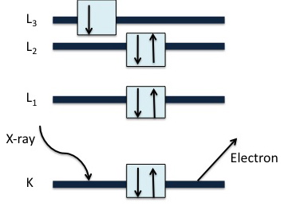
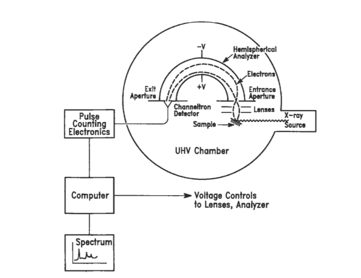
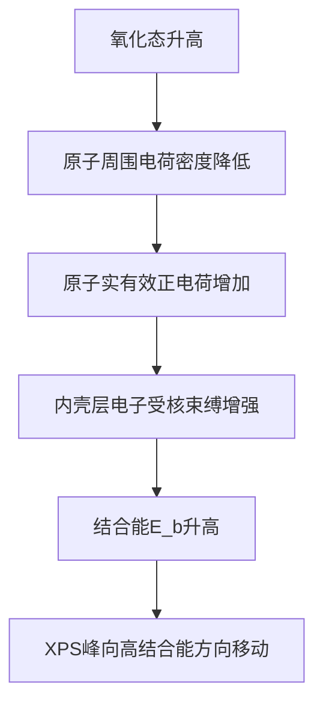

# 什么是电子能谱？

电子能谱就是用一定能量的==电子束或光子与样品表面相互作用==，使样品表面原子中不同能级的电子激发成自由电子，并研究这些自由电子的电子强度（电子数目）按其能量变化的分布曲线。根据使用的激发源的不同，电子能谱又分为==X射线光电子能谱（XPS）、紫外光电子能谱（UPS）、俄歇电子能谱（AES）==

电子能谱的基础是光电效应：当能量为$h\nu$的单色光照射到样品上时，样品中的原子或分子吸收能量从而使电子脱离样品成为自由电子（即光电子）逸出，与此同时还能产生==俄歇电子和荧光X射线等==
$$
h\nu=E_b+E_k+E_r
$$
其中$E_b$为原子的始态和终态能量差，可以看成发射的光电子的结合能；$E_r$为原子的反冲能量，可忽略

# X射线光电子能谱

 X射线光电子能谱 （XPS），也称为化学分析电子能谱 （ESCA）。价电子对X光子的光电效应截面远小于内层电子，所以XPS主要用于研究内层电子的结合能。由于内层电子不参与成键，保留了较多的原子性质，所以常用于表面组分的化学分析，也可以进一步应用于确定这些==元素的化学或电子状态==。它允许以非破坏性方式测定样品的原子组成，由于X射线仅能穿透样品 5 – 20 Å，因此可以进行表面特异性分析。

电子在暴露于足够能量的电磁辐射（波长在X射线范围的高能光子）时会从材料表面射出，即光电效应：
$$
KE=h\nu-E_b-\varphi
$$
其中$E_b$是电离能（也叫电子结合能），$\varphi$ 是光谱仪的功函数。

不同的原子具有不同的电子壳层和不同的结合能，因此XPS可用于识别样品表面的元素组成。计算发射的具有各种$E_k$的光电子的数量，并生成XPS光谱，这有助于识别除H和He之外的所有状态的所有元素。

如上图所示，X射线光电子能谱仪器的主要部件包括以下部分：

- X射线源
- 超高真空（UHV）
- 电子透镜
- XPS能量分析仪
- 检测器
- 监视器

首先，高速电子撞击金属阳极使其发生内壳层跃迁，辐射出特征X射线。特征X射线脱离射线源部分后进入到UHV超高真空腔，在这里，约10$^{-9}$~10$^{-10}$ torr甚至更低的压强可以减少XPS光谱中的噪声量并避免样品表面污染产生任何额外峰。接着，X射线在UHV环境中照射到样品表面，样品释放出光电子，光电子被电子透镜所汇聚并减速。大量减速后的光电子接着进入XPS能量分析仪，这是一个两端施加有电压的半球腔体。多通道检测器可以检测出电子的动能，类似于胶片。高性能计算机用作监视器，用于控制镜头和分析仪的电压，它还会产生 XPS 光谱——计算机自动绘制$E_k$强度与结合能的关系生成的。

## 定性分析

原子的电子能级可分为两种类型——与原子核结合的核能级和仅弱结合的价能级。原子的价能级是与其他原子的价能级相互作用以在分子和化合物中形成化学键的能级。它们的特性（价键特性）和能量通过这个过程发生变化，成为形成的新物种的特性。

原子的核心能级电子的能量几乎与原子结合的化学物质无关，因为它们不参与键合过程。因此，核心水平结合能的识别因此提供了元素的独特特征。元素周期表中的所有元素都可以通过这种方式识别（除了H和He，它们没有核心能级）。

## 定量分析

定量分析需要测量相对峰强度，峰的强度取决于表面膜中存在的元素的原子浓度 （N）。

## 化学状态分析

化学位移是同一分子或两种不同化合物中两种化学不同状态的同一原子之间的结合能差异。它是样品电离原子周围的原子性质和原子数的特征。它可以用来查看样品表面原子的化学键是什么样的。

- 它涉及化学键性质、官能团的性质和原子的氧化态。
- XPS 的一个重要功能是它能够区分不同化学状态的相同元素，因为电子的 BE 会因氧化引起的元素周围电荷密度的变化而不同

## 深度分析

对薄表面薄膜中元素深度分布的估计称为深度表面分析。这样做是为了知道薄膜是否均匀。

## 优势与局限性

优势：

- 可以分析所有样品，包括固体、气体和液体样品，但大多数是固体样品。
- 定量效果好
- 出色的化学状态测定能力
- 它适用于从生物材料到金属的各种材料。
- 这是一种非破坏性技术。

局限性：

- 缺乏良好的空间分辨率，即空间分辨率差
- 仅中等绝对灵敏度
- 它无法检测氢和氦
- 它不适用于痕量分析。

## 为什么常常用Al作为靶材

X射线衍射（XRD）实验中选择的是铜靶或者钼靶，为什么这里用的是铝靶呢？

XPS对X射线源的光子能量和能量分辨率（单色性/线宽）有非常特殊的要求。XPS的核心是精确测量样品表面原子发射的光电子的动能，进而计算其结合能。结合能的微小偏移（< 1 eV）往往对应着元素的化学态变化（如氧化态、化学键）。==如果X射线本身的线宽很宽，就会导致光电子谱峰变宽，使得相邻的、化学位移很小的峰无法分辨，严重影响化学态分析的精度==

XRD测量的是晶面间距引起的衍射峰位置（角度）。衍射峰的自然宽度通常比X射线源的线宽要宽得多（受晶体尺寸、应力等因素影响）。因此，X射线源本身的线宽（如Cu Kα约2.5 eV）对衍射峰位置测量的影响相对较小，强度更重要。

Al Kα的能量是1486.6 eV，这个能量足够高，能够有效地激发周期表中绝大多数元素（从轻元素如Li到重元素）的核心能级电子（如C 1s, O 1s, N 1s, Fe 2p, Au 4f等），这些能级是XPS分析化学态的关键。能量不是越高越好。能量过高（如Cu Kα的8048 eV）会产生更强的韧致辐射本底和更多的二次电子，增加谱图的背景噪音。同时，高能光子的光电离截面（电离效率）在特定能量范围外会降低。1486.6 eV是一个在激发效率和背景噪音之间取得良好平衡的能量点。

## 为什么光电方程中有功函数这一项？

什么是功函数呢？功函数 Φ 是指将一个电子从==固体材料==内部（==费米能级处==）移动到真空中静止状态（真空能级）所需的最小能量。想象电子在固体内部处于一个“能量坑”的底部（费米能级）。要把这个电子从坑里拉出来扔到坑外平坦的地面上（真空能级），你需要克服坑壁的阻挡做功。这个“坑壁的高度”就是功函数 Φ（单位：电子伏特）。

为什么光电方程中有功函数这一项？理解的关键在于区分 ==“原子内结合能 (Eb)”==和==“电子逸出样品进入真空并被检测器测到”== 这两个过程所涉及的能量参考点。

Einstein的原始光电方程是针对于自由原子或者气体的，`Eb` 是电子相对于**原子真空能级**的结合能（即把电子从原子轨道移到离原子无穷远处所需能量）：

- 对于孤立原子，真空能级是明确的参考点
- 测得的光电子动能直接反应原子内电子的结合能$E_b$

但是对于==固体==，情况变得更加复杂了。固体中，原子不是孤立的，电子处于==周期性势场中==。固体中的电子能量通常参考**费米能级 (Fermi Level, EF)**——绝对零度下电子占据的最高能级。总结一下固体中的光电效应：内壳层电子吸收光子能量跃迁到无穷远轨道处（依然处在固体体相中），这一步需要克服结合能，从无穷远轨道处跃迁到真空层（脱离表面）还需要克服一部分能量，这部分能量被称为功函数$\varphi$。

所以功函数**补偿了谱仪测量参考点（其费米能级）与理论计算参考点（真空能级）之间的差异**。它确保了测量动能 `KE` 与样品内结合能 `Eb`（相对于样品费米能级）之间的定量关系成立。

## XPS怎么确定元素的氧化态？

## XPS的测试项目

- 全谱
  - 得出元素的成分信息，也可以对所测元素进行半定量计算
- 精细谱
  - 判断化学态，确定不同化学态的百分比含量
- 刻蚀/溅射
  - 去除样品表面杂志后进行分析
  - 深度剖析，探测不同深度下的样品成分
- 价带谱
  - 主要测量价带顶，也可以分析价带结构，探测外层价电子信息，也可以用来区分化学环境价态
- 俄歇谱
  - 主要测量价带顶，也可以分析价带结构，探测外层价电子信息，也可以用来区分化学环境价态
- Mapping
  - 表征不同元素成分在特定区域的分布情况，分辨率〈EDS，XPS深度10nm左右，EDS深度1um左右

## 样品制备

- 粉末
  - 样品量20mg以上，压片制样，粘到双面胶带上分析；颗粒越细越好，且分散均匀；在压片样品表面分析时尽量选用平整测试区域，越平整信号越强

