==为什么方形电池设计为带正电的？==，作为一个小白的无意间看到了这么一个问题，仔细学习了一下，参考许多资料。

动力电池的电芯封装模式：

- 硬壳
  - 圆柱：技术成熟成本较低、稳定耐用、单体一致性好，但能量密度的上升空间小、对电池管理系统的要求高
    - 铝壳
    - 钢壳
  - ==方形==：强度高、内阻小、寿命长、空间利用率高，应用最广，但厂商需求不一样，规格多且难统一
    - 铝壳
    - 钢壳
- 软包：能量密度极高、重量轻，但成本高，需要额外防护防止电池受损和热失控，更容易因为膨胀产生内应力、膨胀力，导致电池内部的结构都会发生改变
  - 铝塑膜
  - 钢塑膜

标题中的方形电池应该指的是铝壳封装的方形电池，其中的电芯通常与正极相连，出于以下五个方面考虑

1. 容易形成Al-Li合金。Al的立方晶格的八面体空隙大小与$\rm{Li^+}$半径匹配，在负极电位下，二者极易形成金属间隙化合物，随着嵌锂的深入，氧化锂、氢氧化锂等副产物会逐步形成，腐蚀反应会使得铝外壳逐渐粉化
2. 铝的嵌锂电位$\varphi \rm(vs~Li^+/Li)$较高，大致0.3V，高于石墨负极的嵌锂电位$\varphi (\rm vs~Li^+/Li)$的0.01-0.2V，如果石墨和铝同时作为负极那么铝将优先发生嵌锂反应。为了避免铝的嵌锂反应，需要将铝外壳的电位提升至嵌锂电位以上，


## EIS在电池表征中的应用

电极材料的表征

- 电子电导性评估
- 离子扩散特性研究

界面行为分析

- SEI膜：中频区半圆直径对应电荷转移电阻$\rm R_{ct}$，循环后$\rm R_{ct}$突增可能预示着SEI膜破裂再生（如六氟磷酸锂分解产物积累）
- 复合电极层间接触：多层电极（如NCM/石墨全电池）中，中高频区额外半圆可揭示正负极界面接触电阻

电池老化与失效诊断

- 活性锂损失：全频阻抗缓升，$\rm R_{ct}$与$\rm R_W$同步增加（如负极析锂导致可逆锂损失）

- 结构衰退：低频Warburg斜率陡降（如NCM正极晶界裂纹阻碍离子传输）

- 极端失效识别：
  - 微短路：高频截距$\rm R_s$异常降低（如隔膜穿透引发电子泄露）
  - 析锂：低频区“扩散尾”畸变（如锂枝晶导致传输异质性）

## 锂电池中需要铜箔吗？

铜箔在锂电池中作为负极的集流体，主要用于收集锂电池在放电过程中的电子并有效地导出，确保电池的电流传输效率。此外，铜箔能够支撑负极活性材料（如石墨、硅等），确保电池在充放电过程中结构稳定。

机械性能

- 厚度及均匀性：会导致电池性能不均匀。厚度偏差需控制在±0.5μm以内
- 面密度一致性：单位面积质量极差≤1.5g/m²
- 抗拉强度：高抗拉强度可提高电池生产中的涂布碾压效率，避免断带现象。普抗(300-400MPa)、中抗（400-500MPa）、高抗(500-600MPa)、超高抗（>600MPa)，5μm产品要求≥430MPa
- 延伸率：高延伸率可增强极片的压实密度并降低电极片的厚度，更好地抑制电池循环过程中活性材料的变形，从而提高电池的耐久性和使用寿命6μm常规延伸>4%，高延>6%;8μm常规>5%，高延>8%，5μm铜箔延伸率要求≥6%

物理化学性能

- 表面粗糙度：表面粗糙度对负极活性物质的附着和涂布效果至关重要，以提升涂覆均匀性，减少活性材料脱落。
- 粗糙度Rz≤2μm
- 纯度：避免杂质在电池充放电过程中因杂质的存在而引发副反应，影响电池的容量、寿命和安全性。要求≥99.999%（六个九），高端产品达99.9999%(七个九)，杂质(如Fe、S)需<0.001%
- 电导率/电阻率：降低电池内阻，可以减少电池内部的能量损失，提高电池的充放电效率和功率性能；纯铜的电阻率约为1.694$\rm \mu\Omega \cdot cm$，锂电池用铜箔的电阻率需尽可能接近纯铜理论值

表面特性

- 清洁度：无压痕、皱褶、缺口、污物及氧化缺陷
- 亲水性：表面需良好润湿性，增强与负极材料及粘结剂的结合力
- 抗氧化性：180℃高温环境60分钟无明显氧化
- 良好的耐腐蚀性：防止其被电解液等物质腐蚀，从而保证电池的性能和寿命

热稳定性和微观结构

- 高温屈服强度：需在150C制造过程中保持原始机械性能，防止软化
- 微观结构：铜晶粒的取向和织构需优化避免晶界过多导致电子传输受阻，从而维持低电阻率

## 电解液浸润不良可能导致电池析锂

### 极化效应

- 欧姆极化

孔隙填充率下降，浸润不良区域，电解液渗透率<80%时，离子传输路径的曲折度增加40%-60%；浸润不良导致电极与电解液
的有效接触面积减小，界面电阻增大

- 浓差极化

扩散延迟，孔隙内电解液缺失使锂离子扩散系数降低

表面浓度降低，充电过程中电极表面Li浓度可达本体浓度的2-3倍，触发局部析锂的临界电流密度降低40%

- 电化学极化

活性位点减少，由于电解液进入不足导致电极与电解液活性位点减少，以及有效嵌锂位点减少，电荷转移电阻增大

### 动力学-热力学耦合效应

浸润不良打破了锂离子嵌入/沉积的动态平衡，沉积电势窗口变窄，局部区域有效电势低于锂沉积阔值的概率提
升2-3倍

### SEI膜形成异常

浸润不良时，反应物无法到达特定区域，导致SEI膜无法连续覆盖，不均匀的SEI膜中薄弱区域易因体积膨胀或机械应力破裂，会优先成为锂金属沉积位点，诱导锂枝晶的形成

### 电池传输路径受阻

电解液浸润不良，导致电极可能会出现部分干涸区域，锂离子传输需要绕过浸润不良区域，增加了锂离子的迁移路径，导致局部锂离子扩散速率降低，传输受阻

### 电流密度

浸润不良的区域因电解液缺乏，阻抗升高，电流被迫集中于少数通道，高电流密度区域锂离子嵌入速度达到极限，超出负极动力学承受能力，引发局部析锂

## 关于SEI膜

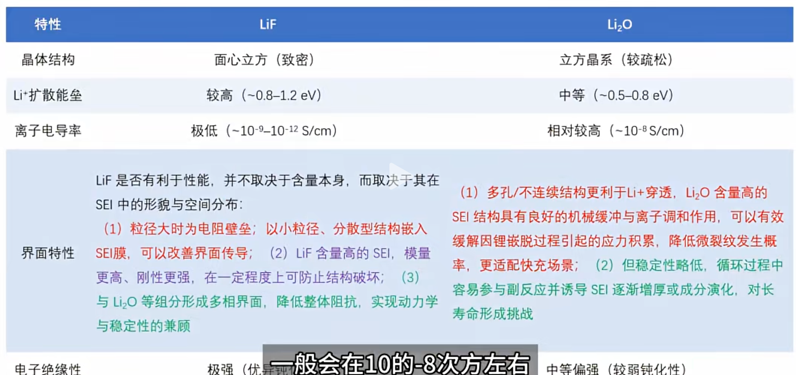

- LiF化学稳定性极高，电子绝缘优异，可以有效提升界面抑制副反应；但其锂离子扩散能垒非常高（约0.5eV以上），当其在界面中过度堆积时，会显著阻碍Li+穿透SEI并进入负极，从而对倍率性能、低温性能产生不利影响

- Li$_2$O易形成多孔、富缺陷的结构，其离子电导率高于LiF，能够在一定程度上缓解界面阻抗，特别适合快充或低温场景。然而其稳定性略低，循环过程中容易参与副反应并诱导SEI逐渐增厚或成分演化，对长寿命形成挑战

- 理想的SEI应由多相协同构成，其中LiF负责界面钝化与电子阻断，Li$_2$O则提升离子通量与机械缓冲性能。通过精准调控电解液配方、FEC浓度、锂盐类型与化成条件，可以构建出具有“分散型LiF+结构调和型Li$_2$O”的纳米复合SEI结构，真正满足未来快充与高能电池对界面性能的双重要求。

## 电池中使用的各种表征手段

### 电池材料结构表征

| 表征手段     | 分析内容                     | 参考标准                       |
| ------------ | ---------------------------- | ------------------------------ |
| SEM          | 表面形貌、颗粒尺寸、孔隙结构 | 颗粒均一及无裂纹、团聚         |
| TEM          | 微观结构、晶格条纹缺陷       | 晶格清晰及无相分离             |
| AFM          | 表面粗糙度、机械性能         | 固态电解质表面粗糙度<10nm      |
| XRD          | 晶格结构、物相纯度、晶格参数 | 无杂项及晶格应变<2%            |
| ND           | 轻元素(Li/H)占位分析         | 明确锂离子迁移路径             |
| BET          | 比表面积、孔径分布           | 负极<10m$^2$/g，正极>50m$^2$/g |
| 压汞法       | 大孔分布（厚电极）           | 孔隙率>30%且连通               |
| RBS          | 薄膜组成、厚度               | 成分梯度符合设计               |
| 俄歇电子能谱 | 表面元素分布深刻剖析         | Li分布均与，无局部富集         |

### 电池材料成分与化学态分析

| 表征手段 | 分析内容                                      | 参考判断标准                               |
| -------- | --------------------------------------------- | ------------------------------------------ |
| XP       | 表面元素价态，SEI 成分（LiF、Li₂O）           | （如 Ni$^{2+}$等高价态金属），SEI 无机层占比高 |
| EDS      | 元素分布（如 S/C 复合材料中各元素分散均匀性） | 元素分散均匀                               |
| TOF-SIMS | SEI/CEI 膜成分深度剖析                        | 外层有机相（ROCO$_2$Li）， 内层无机相（LiF）  |
| FTIR     | 官能团变化、电解液分解产物（如 PFs 等）       | 无有害副产物（如五氟化磷）                 |
| ICP-MS   | 痕量金属元素含量（如过渡金属溶解量）          | 溶解量 < 1 ppm                             |
| BET      | 界面元素分布、Li$^+$扩散路径                    | Li$^+$梯度分布合理                           |
| EELS     | 过渡金属价态稳定性、局部电子结构              | 过渡金属价态稳定（如 Co$^{3+}$）                |
| STXM     | 化学成像（如硫物种在碳基质中的分布）          | 硫均匀分散于碳基质                         |

### 电池材料电子结构与能带分析

| 表征手段 | 分析内容                            | 参考判断标准                   |
| -------- | ----------------------------------- | ------------------------------ |
| XANES    | 元素价态、未占据电子态              | 高价态稳定性（如Mn$^{4+}$）         |
| EXAFS    | 局部原子结构（配位数、键长）        | 配位环境稳定（如Ni-O键长不变） |
| NMR      | Li$^+$局域环境（固态电解质中迁移位点） | Li$^+$占据高迁移率位点            |
| ARPES    | 能带结构（如石墨烯导电性）          | 费米面处有电子态密度           |
| RIXS     | 磁性相互作用激发态                  | 无有害磁有序（如反铁磁耦合）   |
| UV       | 带隙测量（如固态电解质）            | 带隙 > 4eV（抑制电子传导）     |

电池材料界面与动态过程表征

| 表征手段  | 分析内容                          | 参考判断标准                 |
| --------- | --------------------------------- | ---------------------------- |
| 原位XRD   | 充放电过程相变（如LiCoO$_2$→Co$_3$O$_4$）  | 相变可逆（无结构坍塌）       |
| 原位Raman | 硫物种转化（Li$_2$S$_4$→Li$_2$S）          | 硫完全转化（无多硫化物残留） |
| SPM       | 表面电势（KPFM）、离子迁移（PFM） | 电势分布均匀、无枝晶热点     |
| PEEM      | 表面化学活性分布                  | 活性位点分布均匀             |
| PAT       | 缺陷结构与电子结构                | 缺陷浓度可控（如氧空位<5%）  |

### 电池材料热安全与机械性能

| 表征手段 | 分析内容                 | 参考判断标准            |
| -------- | ------------------------ | ----------------------- |
| DSC      | 材料热稳定性（分解温度） | 正极分解温度>200°C      |
| TGA      | 组分热分解行为           | 无剧烈失重（<5%@300°C） |
| ARC      | 热失控起始温度           | >150度（安全阈值）      |
| 纳米压痕 | 固态电解质机械强度       | 杨氏模量>10GPa          |

### 电池材料电化学性能表征

| 表征手段     | 分析内容               | 参考判断标准                                         |
| ------------ | ---------------------- | ---------------------------------------------------- |
| GCD          | 比容量、库仑效率       | 石墨负极>340mAh/g 首效>90%                           |
| CV           | 氧化还原峰极化程度     | 峰间距<0.1V（低极化）                                |
| EIS          | 表面电势（KPFM）、     | 离子迁移（PFM）Rse<50 Ω、Li$^+$扩散系数$10^{-14}$~$10^{-12} cm^2/s$ |
| 倍率性能测试 | 高电流密度下容量保持率 | 5C下>80%容量                                         |
| dQ/dV分析    | 相变可逆性             | 峰位稳定（无可逆性损失）                             |

### 安全与失效分析

| 表征手段                 | 分析内容                     | 参考判断标准              |
| ------------------------ | ---------------------------- | ------------------------- |
| OEMS                     | 产气成分实时监测（H₂、CO等） | 总产气量<0.1mL/Ah         |
| 原位气体质谱红外热成像IR | 温度场分布与热失控传播       | 局部温差<5°C（1C充放电）  |
| 声发射检测AE             | 内部裂纹枝晶生长动态         | 高频声信号事件数<10 cycle |

## 一些基础知识

### C rate

即倍率，描述了电池充电或放电的速度。假定使用的电池的额定==容量==Q= 40 ==mAh==，倍率为0.2 ==C==。这意味着理想情况下，根据以下等式电池能以8 mA的恒定电流放电5小时
$$
Q=It
$$

$$
I=\dfrac{Q}{t}=\dfrac{Q}{\frac{1}{C}}=\dfrac{40}{\frac{1}{0.2}}\rm mA=8mA
$$

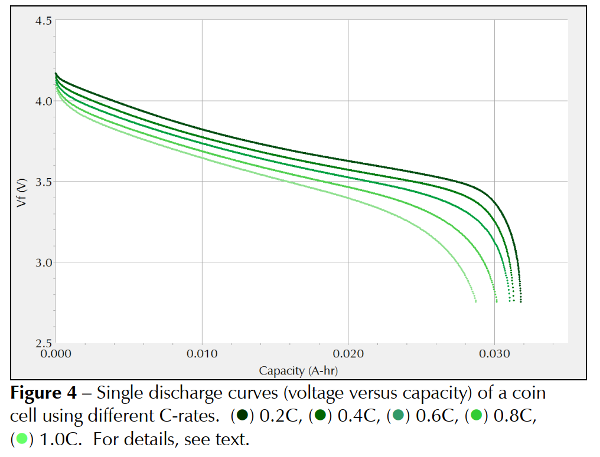

实验数据如下表所示：

| 参数     | C-rate 0.2 | C-rate 0.4 | C-rate 0.6 | C-rate 0.8 | C-rate 1.0 |
| -------- | ---------- | ---------- | ---------- | ---------- | ---------- |
| I [mA]   | 8          | 16         | 24         | 32         | 40         |
| t [h]    | 4.0        | 2.0        | 1.3        | 1.0        | 0.7        |
| ΔU [mV]  | -4.8       | -8.8       | -13.1      | -17.3      | -20.8      |
| ESR [mΩ] | 605        | 555        | 548        | 542        | 522        |
| Q [mAh]  | 31.8       | 31.3       | 31.1       | 30.1       | 28.7       |
| E [mWh]  | 118        | 115        | 112        | 107        | 101        |

可以看到，随着倍率C的增加，放电时间减小，IR压降更多，因此容量也逐渐减小。

等效串联电阻ESR随着倍率增大而降低，这是电池内部温度升高造成的。然而，容量和能源较低等缺点超过了这一优势。此外，较高的温度也可能会导致材料变质

### 电池循环测试

测试电池长期稳定性的典型实验是循环。为此，电池会被充电和放电数百甚至更多次并测量容量。

下图显示了电池的标准循环充放电（CCD，即恒电流充放电）实验。首先以1.0 C速率（40 mA电流） 将纽扣电池充电至4.2 V。然后，该电位保持至少72小时，或者如果电流达到1mA。然后以1.0 C的速率将电池放电至2.7 V。该序列重复 100 个周期。较暗的曲线显示容量，较浅的曲线显示相对于开始时的容量百分比。

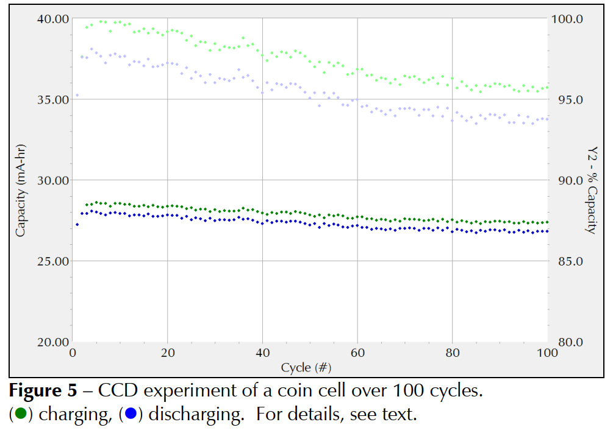

电解质杂质或电极缺陷总是会导致容量损失。 本例中测试的电池显示出良好的循环行为。 纽扣电池的最大容量约为 28.7 mAh。 100 次循环后容量仅略有下降。 总容量损失总和约为 4.5%。极端温度、过度充电或过度放电会加速容量损失。一般情况下，当容量损失超过20%时应更换电池。

库伦效率被定义为：
$$
\rm \eta_C=\dfrac{Q_{discharge}}{Q_{charge}}
$$
库伦效率总是小于100%，这也是测试中放电时的容量小于充电时容量的原因，本次测试纽扣电池表现出约98%的库仑效率。

### 漏电和自放电

理想情况下，当没有外部电流流动时，电池的电位是恒定的。然而，实际上，即使电池没有连接到外部负载，电位也会随着时间的推移而降低，这种效应称为自放电（self discharge），所有储能设备或多或少都会受到自放电 （SD） 的影响。

下图显示了使用新型纽扣电池的自放电实验图。首先将电池充电至 4.2 V，然后在此电位下保持恒电位三天。然后测量开路电位九天。

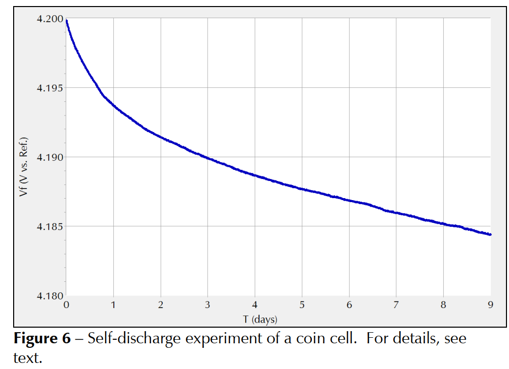

最初，电位降低超过 6 mV。之后，速率减慢至每天不到 1 mV。9 天后，电位总共降低了 15.6 mV。这相当于相对于初始值仅下降 0.37%，具体数据如下表所示：

| 参数      | Day1 | Day2 | Day3 | Day4 | Day9 |
| --------- | ---- | ---- | ---- | ---- | ---- |
| SD [mV]   | 6.3  | 8.6  | 10.0 | 11   | 15.6 |
| SD [100%] | 0.15 | 0.21 | 0.24 | 0.26 | 0.37 |

自放电是由内部电流引起的，称为漏电流（$\rm I_{leakage}$）。自放电率主要受电池的使用年限和使用情况、初始电位以及温度影响。

下图显示了两个纽扣电池的漏电流测量值。一块电池是新的，另一块电池短时间加热到 100°C。两块电池最初都充电至 4.2 V。然后保持电位恒定并测量电流。

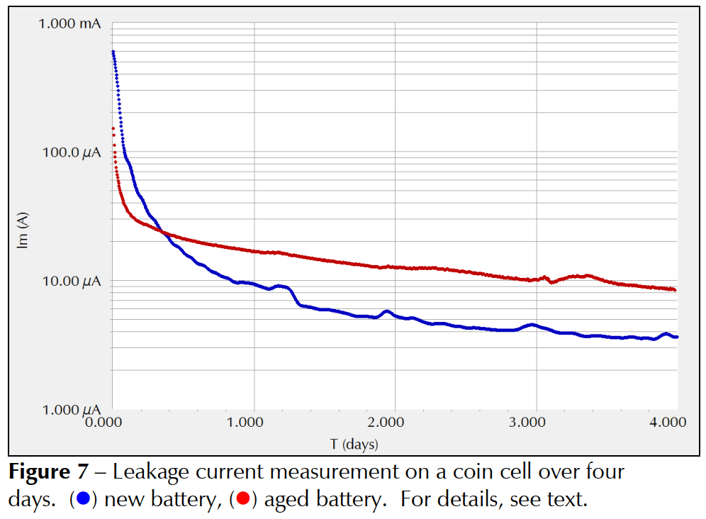

许多制造商将$\rm I_{leakage}$ 指定为 72 小时后的测量值，但请注意，即使在72小时候测量电流依旧不断下降，不是恒定的。

在此情况下，新电池的漏电流约为4.7 μA，而老化的纽扣电池显示出两倍大的值，约10 μA。

> Gamry公司建议不要使用恒电位测试来测量漏电流。

### 电化学阻抗谱EIS

关于EIS的基础知识，之前也是[写过一篇博文](https://hydrogen1222.xyz/2025/05/27/%E7%A7%91%E7%A0%94/%E7%94%B5%E5%8C%96%E5%AD%A6%E9%98%BB%E6%8A%97%E8%B0%B1/)

下图显示了不同电位下的四种不同的Nyquist图。纽扣电池首先分别充电至3.9 V、4.1 V、4.3 V和4.5 V。然后保持电位，直到电流降至1 mA以下。此步骤可确保电位在EIS实验期间保持恒定。恒电流EIS实验在100 KHz和10 MHz 之间进行。直流电流为零，交流电流设置为10 mArms

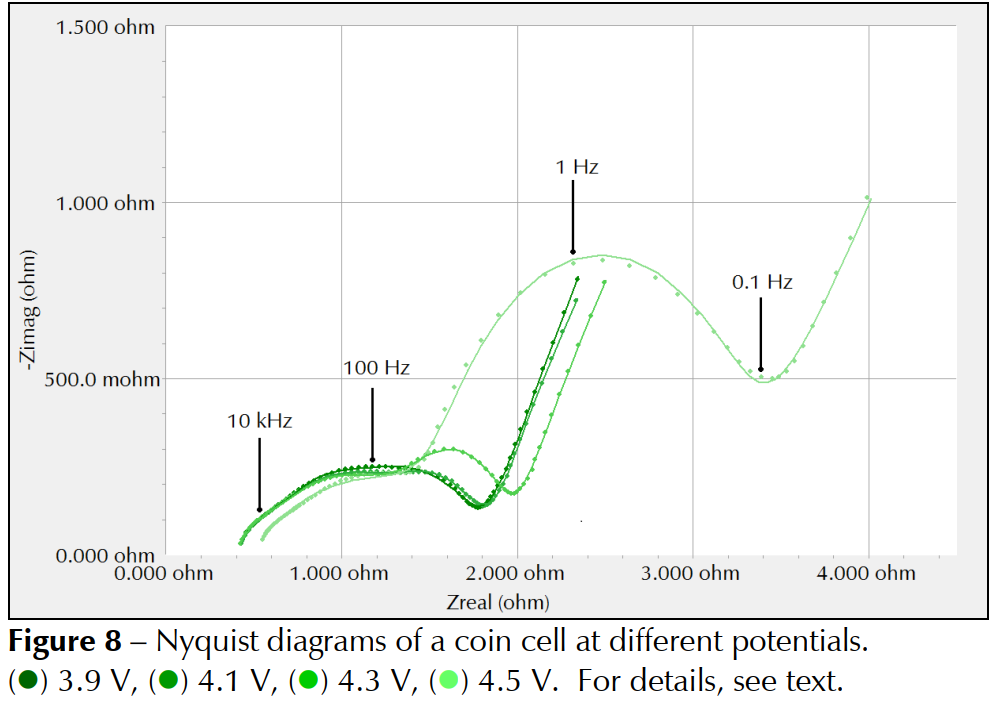

奈奎斯特图的形状在很大程度上取决于电池的电位。在较低电位下，即 3.9 V 和 4.1 V，两条曲线几乎重叠。电池的阻抗在更高的电位下增加。4.3 V 和 4.5 V 处的奈奎斯特曲线分别向右移动，半圆更大。下图显示了锂离子电池的典型模型

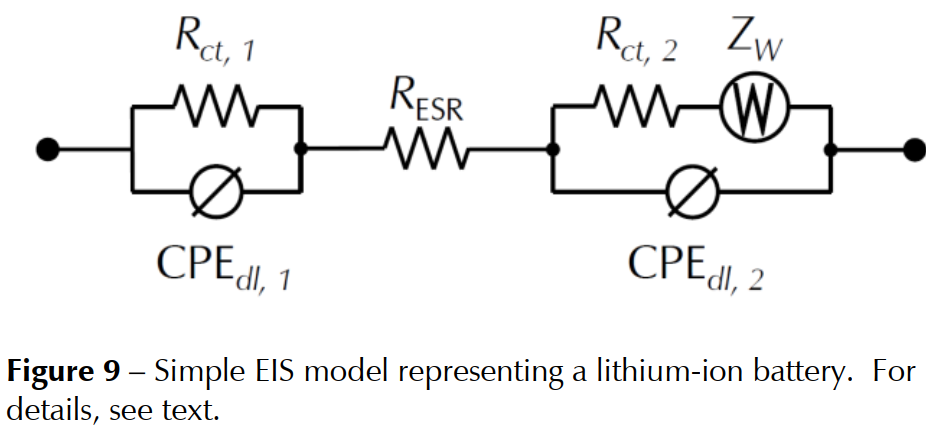

$\rm R_{ESR}$代表电池的ESR电阻。它是高频下的极限阻抗，可以很容易地估计为奈奎斯特曲线和x轴（$\rm Z_{real}$） 之间的交点。

此外，假设每个电极/电解质界面具有双层电容和电荷转移电阻$\rm R_{ct}$。这些元件的每个并联电路代表奈奎斯特图中的一个半圆。
为了解决两个电极的孔隙率和不均匀性问题，双层电容被恒相元件（CPE） 取代，它总结了双层在非理想电极/电解质界面处的极化效应。==理想情况下，CPE 可以被视为电容器。==

==所有奈奎斯特曲线在低频下都显示一条-45°角的对角线==。该区域可以通过Warburg阻抗$\rm Z_W$进行建模，它描述了扩散层无限厚度的线性扩散。为了简化问题，仅考虑一个电极上的扩散。

| 参数                   | 数值                  |
| ---------------------- | --------------------- |
| $\rm R_{ESR}$ [mΩ]     | 382.5                 |
| $\rm R_{ct,1}$ [mΩ]    | 594.5                 |
| $\rm Y_{dl,1}$ [S·s$^2$]  | 0.020                 |
| $\rm a_{dl,1}$         | 0.487                 |
| $\rm R_{ct,2}$ [mΩ]    | 793.8                 |
| $\rm Y_{dl,2}$ [S·s]  | 0.042                 |
| $\rm a_{dl,2}$         | 0.635                 |
| $\rm W$  [S·s$^{0.5}$] | 5.113                 |
| Goodness of Fit        | $2.30 \times 10^{-4}$ |

其中，参数Y及其无量纲指数a定义了CPE，Y的单位为$\rm S\cdot s^a$。

> CPE定义为：
> $$
> Z_{CPE}=\dfrac{1}{Y_0(j\omega)^a}
> $$
> $Z_{CPE}$的单位为$\Omega$，$\omega^a$的单位为$\rm s^{-a}$

- 当a = 1时：

$$
Z_{CPE}=\dfrac{1}{Y_0(j\omega)^1}=\dfrac{1}{j\omega Y_0}
$$

与电容器的阻抗形式$Z_C=\dfrac{1}{j\omega C}$相同，此时CPE元件等价于理想电容器，$Y_0$的单位$\rm S\cdot s^1$等价于法拉第(F)。CPE元件代表一个完美的、没有能量损耗的电荷存储元件。在电化学中，这可能对应于一个完全平整、均匀且不发生任何化学反应的理想电极表面

- 当a = 0时：

$$
Z_{CPE}=\dfrac{1}{Y_0}
$$

这是一个不随频率变化的常数，也就是一个纯电阻。此时，$Y_0$是这个电阻的电导G，而$\frac{1}{Y_0}$就是电阻值R，CPE元件代表一个纯粹的能量耗散元件，通常模拟电解液的电阻或电路中的其他欧姆电阻。

- 当a = 0.5时：CPE模拟的是一种特殊的电化学现象——==扩散过程==，这被称为瓦氏阻抗。这代表了电化学反应中，反应物从溶液主体传输到电极表面，或者反应产物从电极表面扩散离去的过程所遇到的阻碍。这种阻碍与频率的平方根成反比，是==受扩散控制==的电化学反应的典型特征。在Nyquist图上，它表现为一条与实轴成45°角的直线。

## 对称电池是啥？

具有相同电极的电池或对称电池用于==研究电池电极的行为、研究插入反应以及确定电池中正极和负极的阻抗==

对称电池由两个发生氧化还原反应的相同电极组成，电极间通过液态或固态离子导体隔离，电荷通过离子传输实现迁移。使用对称电池的主要优势在于可以研究两个相似的界面，而全电池甚至半电池中涉及的是两种不同界面。在电池系统中，电极是由多种化学物质组成的复合体，包括活性材料、粘结剂、电子导体等成分……对称电池使我们能够了解在特定电解质或特定电极条件下，这些化合物在氧化和还原过程中的相互作用及电化学稳定性。

让我们考虑一个由两个锂电极组成的对称电池，两电极间填充含有锂离子的电解质，该电池两端的电位差为零。若施加正向电流（ I>0），那么其中一个电极将成为阳极，其界面会发生如下氧化反应：
$$
\rm Li \longrightarrow Li^+ +e^-
$$
另一电极则成为阴极，其界面会发生如下还原反应：


$$
\rm Li^+ +e^- \longrightarrow Li
$$
下图展示了对称锂电池在正负电流阶跃作用下的电位响应。$\tau_1$被称为过渡时间常数，超过该值后"（在还原反应情况下）流向电极表面的О通量[...]不足以满足施加电流需求，电位将偏移至更极端的数值，==此时可能发生其他电极过程（比如下面所说的集流体的氧化）==

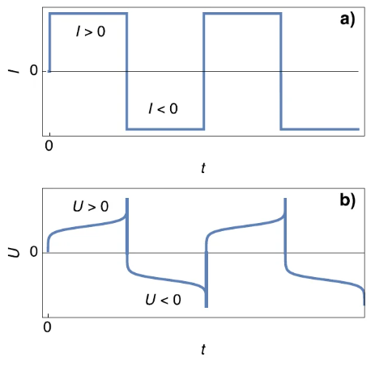

就I>0的正向电流而言，$t=\tau_1$处电位的快速上升可能对应着锂电极的完全消耗，由下图所示：

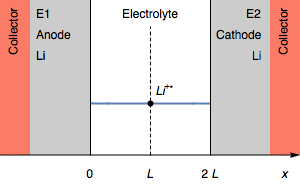

上图中，阳极厚度在转变时刻($t=\tau_1$)为0，进一步的氧化过程可能是集流体的氧化。初始条件下为$E_1=E_2$，随后变为 $E_1>E_2$且$U=E_1-E_2$

然而，在正向电流的情况下，电位的快速上升也可能对应于阴极电解质 | 锂界面处锂离子的完全耗尽，如下图所示：

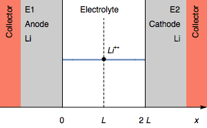

阴极界面处的锂离子浓度降至0，==进一步的还原过程可能是溶剂的还原==。初始条件下为$E_1=E_2$，随后变为 $E_1>E_2$且$U=E_1-E_2$。

对称电池是一种简单且经验性的方法，==用于测试电极在恒电流循环中的稳定性==。对于锂金属电极而言，氧化可能导致表面降解，而金属沉积（锂离子被还原）则可能导致枝晶形成。下图a)展示了稳定电池和稳定电极的电压响应，其电压幅值不随时间变化；图b)则显示了由不稳定电极组成的不稳定电池的电压响应，其电位幅值会随时间发生变化：

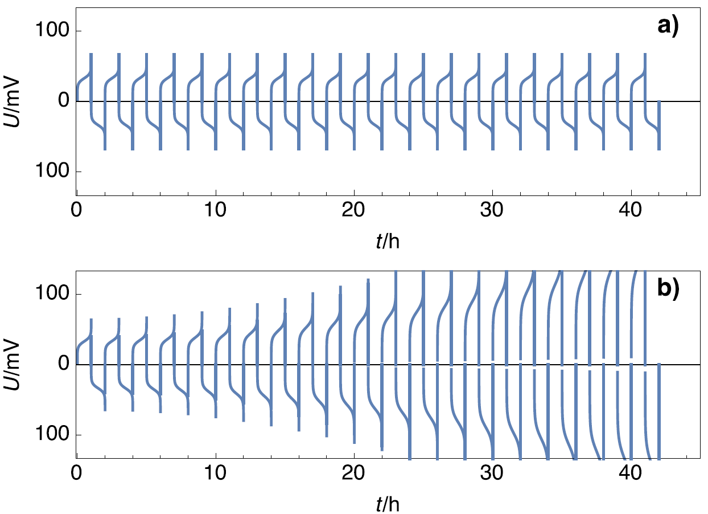

### 对过渡时间的讨论

我们知道了在$t=\tau$时电位会发生阶跃，对应这两种可能的情况：阳极锂金属耗尽或者阴极与电解质的界面处的锂离子耗尽，下面分别讨论一下这两种情况：

假设阳极氧化过程完全遵循方程$\rm Li \longrightarrow Li^+ +e^-$，则过渡时间$\tau$仅取决于电极质量（该质量决定了完全氧化阳极所需的电荷量）以及施加电流。若我们定义单位面积的电荷量与电流密度分别为Q和i，则可得到：
$$
\tau=\dfrac{Q}{i}
$$
将单位面积电子数量Q替换为单位面积锂离子数量，可得：
```markdown

$$
\tau=\dfrac{m_{\rm Li}}{{\rm M_{Li}}i}
$$

```

假设阴极还原过程完全遵循$\rm Li^+ +e^- \longrightarrow Li$，则过渡时间$\tau$现可通过 Sand 方程计算得出：
$$
\sqrt{\tau}=\dfrac{FC^*_{\rm Li^+}\sqrt{\pi D_{\rm Li^+}}}{2i}
$$
其中$C^*_{\rm Li^+}$和$D_{\rm Li^+}$分别表示电解液中锂离子的本体浓度和扩散系数，了解电流密度如何影响过渡时间，有助于我们更好地理解是哪种机制决定了电位升降所对应的时间过渡特性。

> 简化版的sand方程：
> $$
> j(\tau)=\dfrac{z_eFc\sqrt{\pi D_{\rm Li^+}}}{2\sqrt{\tau}}
> $$
> 当电流密度超过电解质的$\rm Li^+$传输能力时，电极表面$\rm Li^+$浓度随时间下降，直至耗尽($\tau$时刻），引发电压骤升（阻塞型极化）。方程表明，$\tau$与$j^2$成反比，与$D_{\text{Li}^+}$和c成正比

下图展示了在锂对称电池（Li | Li）上，以三种不同数值、正负相反的恒电流密度阶跃测试时，电压随时间变化的演变过程。

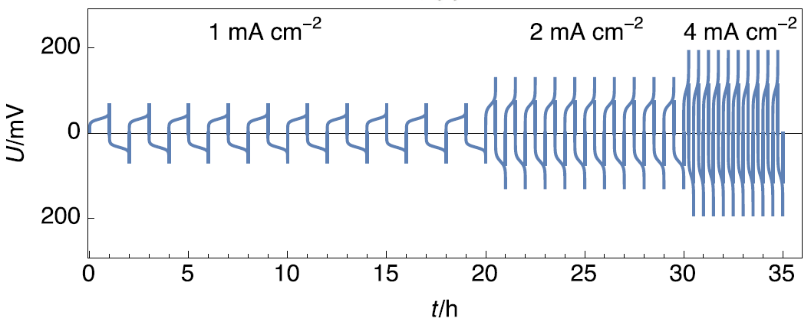

可以看出，当电流密度增大一倍时，两个电流方向的==过渡时间均减半==。这表明上述方程可用于描述过渡时间与时间的依赖关系，且==控制机制为锂的完全氧化过程==。

对称电池可有效用于研究和测试锂电极与固体电解质接触时的稳定性，以及这些电解质防止枝晶形成的能力。通过使用两个相同的电极，研究者无需参比电极即可==轻松研究单一电极 | 电解质界面随时间和循环次数的阳极与阴极行为==。然而，若要==深入研究降解机制，建议采用三电极配置==。

## 一些基本的术语

锂离子电池的文献中有很多关于电池性能的测试，要怎么判断什么是好的锂电池呢？循环次数


## 参考资料

美国Gamry公司技术资料，https://www.gamry.com/application-notes/battery-research/testing-lithium-ion-batteries/

Biologic公司，https://www.biologic.net/topics/introducing-symmetric-cells/

研之成理微信公众号，https://mp.weixin.qq.com/s?__biz=MzUxMDMzODg2Ng==&mid=2247522824&idx=1&sn=2bc2f226c7348a1f89b1a11ea91fdf86&chksm=f906a855ce7121434d626bfd0c840c22786744c056b41a557149832e7cd5360af8a15dd12e9c&scene=21#wechat_redirect


