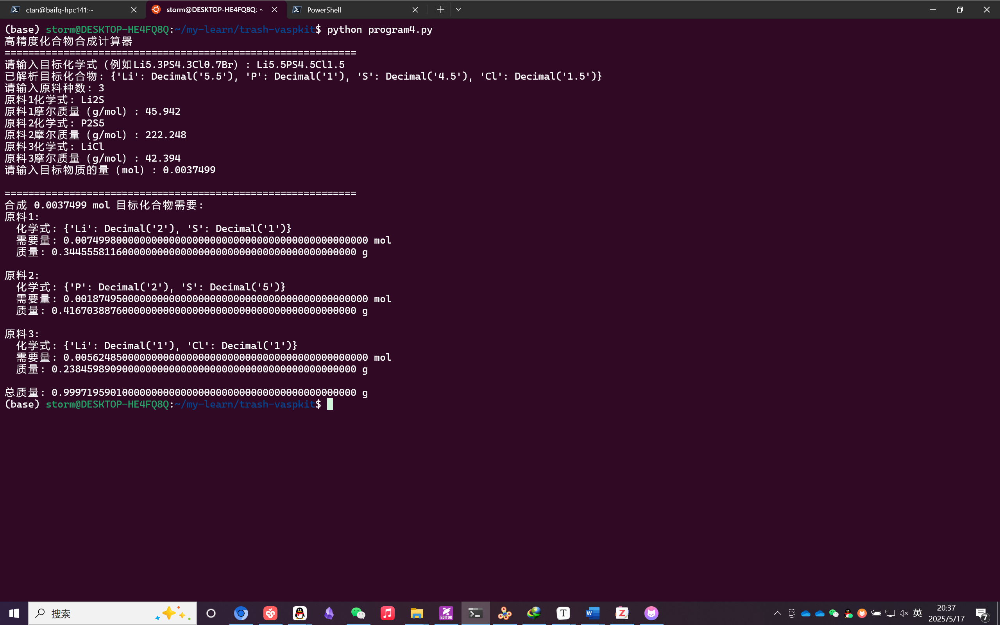

起因是我想合成各式各样的材料，需要用到各种药品，计算起来比较麻烦，尤其是非化学计量比的化合物比如$\mathrm{Li_{5.3}PS_{4.3}Cl_{0.7}Br}$，遂用AI写了一个`python`脚本，个人觉得还是比较实用，脚本文件和相对原子质量的文本文件需要在同一文件夹内

```python
from decimal import Decimal, getcontext
import re
from sympy import symbols, Matrix, linsolve, Rational
from collections import defaultdict

# Improve Decimal precision
getcontext().prec = 100

class FormulaParser:
    @staticmethod
    def parse(formula: str) -> dict:
        elements = {}
        pattern = re.compile(r"([A-Z][a-z]?)([\d.]*)?")
        idx = 0
        while idx < len(formula):
            m = pattern.match(formula, idx)
            if not m:
                raise ValueError(f"Invalid formula at: {formula[idx:]}")
            elem, num = m.group(1), m.group(2)
            coeff = Decimal(num) if num else Decimal(1)
            elements[elem] = elements.get(elem, Decimal(0)) + coeff
            idx = m.end()
        return elements

class AtomicMassReader:
    @staticmethod
    def read(filename="atomic_masses.txt") -> dict:
        masses = {}
        try:
            with open(filename, 'r') as f:
                for line in f:
                    line = line.strip()
                    if not line or line.startswith('#'):
                        continue
                    parts = line.split()
                    if len(parts) != 2:
                        raise ValueError(f"Line format error: {line}")
                    masses[parts[0]] = Decimal(parts[1])
        except FileNotFoundError:
            raise FileNotFoundError(f"File {filename} not found")
        if not masses:
            raise ValueError("Atomic masses file empty")
        return masses

class SynthesisCalculator:
    def __init__(self, atomic_masses: dict):
        self.atomic_masses = atomic_masses
        self.target = {}
        self.target_mm = Decimal(0)
        self.reagents = []
        self.reagent_formulas = []
        self.molar_masses = []

    def input_target(self):
        f = input("Enter target formula: ").strip()
        self.target = FormulaParser.parse(f)
        for e, c in self.target.items():
            if e not in self.atomic_masses:
                raise ValueError(f"Mass of element {e} not defined")
            self.target_mm += c * self.atomic_masses[e]
        print(f"Parsed: {self.target}")
        print(f"Target molar mass = {self.target_mm.normalize()} g/mol")

    def input_reagents(self):
        n = int(input("Enter number of reagents: "))
        for i in range(n):
            f = input(f"Reagent {i+1} formula: ").strip()
            self.reagent_formulas.append(f)
            parsed = FormulaParser.parse(f)
            mm = sum(parsed[e] * self.atomic_masses[e] for e in parsed)
            self.reagents.append(parsed)
            self.molar_masses.append(mm)
            print(f"{f} molar mass = {mm.normalize()} g/mol")

    def validate(self):
        tgt = set(self.target)
        prov = set().union(*(r.keys() for r in self.reagents))
        miss = tgt - prov
        extra = prov - tgt
        if miss:
            print(f"Error: Missing elements: {miss}")
            exit()
        if extra:
            print(f"Warning: Extra elements: {extra}")

    def solve_basis(self):
        # Construct A, b corresponding to 1 mol 
        elems = sorted(set(self.target) | set().union(*(r.keys() for r in self.reagents)))
        A = [[r.get(e, Decimal(0)) for r in self.reagents] for e in elems]
        b = [self.target.get(e, Decimal(0)) for e in elems]
        # Convert to rational number to avoid floating point error
        A_rat = [[Rational(str(val)) for val in row] for row in A]
        b_rat = [Rational(str(val)) for val in b]
        vars = symbols(f'x0:{len(self.reagents)}')
        sol = linsolve((Matrix(A_rat), Matrix(b_rat)), vars)
        if not sol:
            print("Error: No exact solution for 1 mol target.")
            exit()
        tup = next(iter(sol))
        # Convert rational to decimal exact representation
        base = {}
        for i, r in enumerate(tup):
            base[vars[i]] = Decimal(r.p) / Decimal(r.q)
        return base, elems

    def calculate(self):
        t = input("Input type (0 mass g, 1 moles): ").strip()
        if t not in ['0','1']:
            print("Invalid type")
            exit()
        v = Decimal(input("Amount: ").strip())
        n = v / self.target_mm if t=='0' else v
        print(f"Target moles = {n.normalize()}")

        base, elems = self.solve_basis()
        print("\nReagent requirements:\n" + "="*40)
        total_mass = Decimal(0)
        for i, var in enumerate(sorted(base.keys(), key=lambda x: int(str(x)[1:]))):
            moles = base[var] * n
            mass = moles * self.molar_masses[i]
            total_mass += mass
            print(f"Reagent {i+1} ({self.reagent_formulas[i]}):")
            print(f"  Moles: {moles.normalize():.10f} mol")
            print(f"  Mass:  {mass.normalize():.10f} g\n")
        print(f"Total mass = {total_mass.normalize():.10f} g")

        #Verify element balance
        print("Verification:")
        for e in elems:
            actual = sum((base[symbols(f'x{i}')] * n) * r.get(e, Decimal(0))
                         for i, r in enumerate(self.reagents))
            target_amt = self.target.get(e, Decimal(0)) * n
            print(f"{e}: target {target_amt.normalize():.10f}, actual {actual.normalize():.10f}")


def main():
    print("High-Precision Compound Synthesis Calculator")
    print("="*60)
    try:
        masses = AtomicMassReader.read()
        print(f"Loaded elements: {', '.join(masses.keys())}")
    except Exception as e:
        print(e)
        exit()
    calc = SynthesisCalculator(masses)
    calc.input_target()
    calc.input_reagents()
    calc.validate()
    calc.calculate()

if __name__ == "__main__":
    main()
```

附一张使用截图，后面也会放到`Github`上面




