## 什么是电化学阻抗谱？

有一种叫做**黑箱**的未知特性系统。可采用一系列测量方法，通过施加输入信号并检测输出响应来探查黑箱。例如，假设将黑箱置于暗室中，然后施加特定波长的光照。若观察到响应信号（如电流），则可判定箱内物质具有光活性。输入与输出之间的关系称为“传递函数”，阻抗谱是传递函数的一种特例。

阻抗：电路中电阻、电感、电容对交流电个阻碍作用个统称。阻抗是一个复数，实部称为电阻，虚部称为电抗。电化学过程主要涉及电荷在电极和电解质界面上的传输和存储。例如，电极表面的双电层效应会形成双电层电容，电解质中的离子扩散也会导致电容行为。这些机制使电容成为电化学系统中主要的电抗元件。 相比之下，电感通常与磁场的变化相关，比如电流通过线圈时产生的磁场。然而，在常规的电化学系统中，磁场变化通常不显著，因此电感的影响非常小，通常电化学系统中考虑电阻、容抗而不考虑感抗。

电化学阻抗谱（EIS）通过施加交流电压（或电流）并测量产生的电流（或电压），能够研究电极和电化学池的电化学特性，利用等效电路进行分析，可以确定与电极电化学反应相关的重要参数，如电荷转移电阻、双电层电容和Warburg阻抗

## 阻抗的复数表达形式

交流电（AC）电路中的电流、电压以及阻抗通常使用复数来表示，主要原因有两个：

1. 交流信号（以及许多其他正弦波现象）具有一个幅值和一个相位，它们分别与复数的模和幅角非常相似
2. 复数的基本运算，如加法、减法、乘法和除法，更容易执行和编程

**注意：**

- 因为符号$i$ 在交流电路中用于表示电流，这里我们用$j$作为虚数单位，即$j^2=−1$
- 符号 $\Re e$代表复数的实部

### 预备知识

**复数的标准形式**
$$
Z=a+bj
$$
**复数的模**
$$
 \lvert Z \rvert =\sqrt {a^2+b^2}
$$

**欧拉公式**
$$
e^{ix}=\cos x +i \sin x
$$
**复数的指数形式**
$$
Z=re^{j\theta}=r\cos \theta+rj\sin \theta
$$
**取实数部分：**
$$
\Re e(re^{j\theta})=r\cos \theta
$$

**单变量复函数$f(t)$的导数的实部等于$f(t)$的实部的导数，证明如下：**
$$
\begin{align}

f(t)&=a(t)+jb(t)，其中a(t)是实部，b(t)是虚部\\
f'(t)&=\lim_{h\rightarrow0}\dfrac{f(t+h)-f(t)}{h}\\
&=\lim_{h\rightarrow0}\dfrac{a(t+h)+jb(t+h)-(a(t)+jb(t))}{h}\\
&=\lim_{h \rightarrow 0} \dfrac{a(t+h)-a(t)}{h}+j\lim_{h\rightarrow0}\dfrac{jb(t+h)-jb(t)}{h}\\
&=a'(t)+b'(t)
\end{align}
$$
**复函数$f(t)$的不定积分的实部等于$f(t)$的实部的不定积分，证明如下**
$$
\begin{align}
f(t)&=a(t)+jb(t)\\
F(t)&=\int f(t)=\int (a(t)+jb(t))dt=\int a(t)dt+\int jb(t)dt
\end{align}
$$

### 复数形式的阻抗

- **电压源**

$$
v(t)=V_0 \cos (\omega t)=\Re e(V_0\cos (\omega t)+V_0j\sin (\omega t))=\Re e(V_0e^{j \omega t})
$$

- **电阻**

对于如下图的交变电路

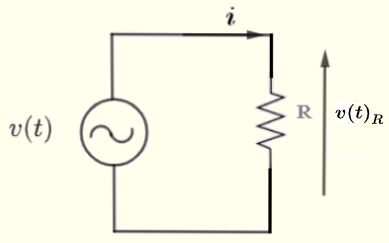

定义$Z_R=R$，那么电流$i=\Re e(\dfrac{V_R}{R})$或$I=\dfrac{V_R}{Z_R}$

- **电容**

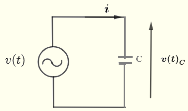

电容上电流的定义为：$I=C(\dfrac{d v(t)}{dt})$，则有如下推导：
$$
\begin{align}
v(t)=&\dfrac{1}{C}\int i dt\\
v(t)=&V_0\cos (\omega t)=\Re e(V_0e^{j\omega t})\\
\Re e(V_0e^{j\omega t})=&\dfrac{1}{C}\int idt\\
\dfrac{d}{dt}(\Re e(V_0e^{j\omega t}))=&\dfrac{d}{dt}(\dfrac{1}{C}\int idt)\\
\Re e(j\omega V_0e^{j\omega t})=&\dfrac{1}{C}i\\
i=&\Re e(j\omega CV_0e^{j\omega t})
\end{align}
$$
电容器C两端的电压为$V_C=V_0e^{j\omega t}$，那么电容对电流的阻碍作用$Z_C=\dfrac{1}{j\omega C}=-\dfrac{j}{\omega C}$

**与电阻的阻抗（电阻）$Z_R$不同，电容的阻抗（容抗）$Z_C$是一个纯虚数**

- 电感

**在电化学系统中，电感并不常见**

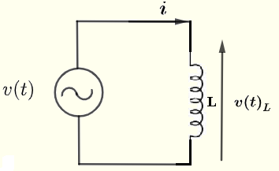

**电感$L$上的电流$i$和电压$v(t)$之间的关系为：**$v(t)=L\dfrac{di}{dt}$，则有：
$$
\begin{align}
\Re e(V_0e^{j\omega t})=&L\dfrac{di}{dt}\\
\int \Re e(V_0e^{j\omega t})=&\int L\dfrac{di}{dt}dt\\
\Re e(\dfrac{1}{j\omega}V_0e^{j\omega t})=&Li\\
i=&\Re e(\dfrac{1}{j\omega L}V_0e^{j\omega t})
\end{align}
$$
电感的对电流的阻碍作用为：$Z_L=j\omega L$，**类似的，电感的阻抗（感抗）也是一个纯虚数**

## 交变电路中的电阻和电容

**电压源为：$E(t)=E_0\sin(\omega t)$**

电容表现出与电阻相似的行为，即电压与电流的幅值比恒定，但电流相位相对于外加电压存在-90°偏移:$I=E_0\omega C\sin(\omega t-\dfrac{\pi}{2})$

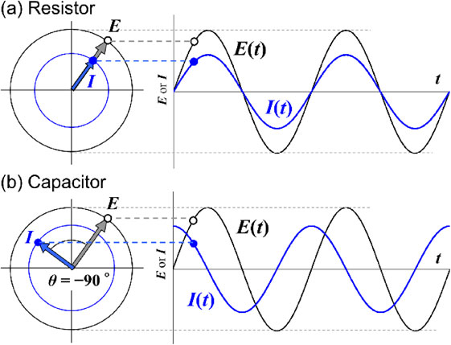

电阻和电容的电流响应可用两个参数表征：

- 阻抗模量$\lvert Z \rvert$
  - 电阻：$\lvert Z_R \rvert$恒定
  - 电容：$\lvert Z_C \rvert=\dfrac{1}\omega C{}$
- 电压与电流之间的相位差$\theta$
  - 电阻：$\theta = 0 ^\circ$
  - 电容：$\theta = -90^\circ$

**使用阻抗表达式$Z=\lvert Z \rvert (\cos \theta + \sin \theta)$，在交流测量中可以统一处理这两种电路元件**

电阻和电容的串联电路比较简单，而并联的情况稍复杂，讨论一下：

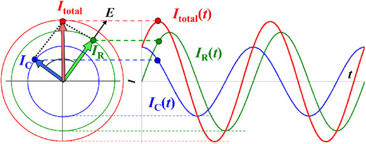

总阻抗：
$$
\begin{align}
\dfrac{1}{Z}=&\dfrac{1}{Z'}+\dfrac{1}{Z''}\\
=&\dfrac{1}{R}+j\omega C\\
Z=&\dfrac{1}{\dfrac{1}{R}+j\omega C}\\
=&\dfrac{R}{1+(\omega CR)^2}-\dfrac{\omega CR^2 j}{1+(\omega CR)^2}\\
\lvert Z \rvert=&\sqrt{Z'^2+Z''^2}\\
=&\dfrac{R}{\sqrt{1+(\omega CR)^2}}
\end{align}
$$
**总结一下串联和并联 RC 电路的复阻抗特性：**

|            | $Z=Z'+jZ''$                               | $Z'=\vert Z \rvert \cos \theta$ | $Z''=\lvert Z \rvert \sin \theta$       | $\lvert Z \rvert =\sqrt{Z'^2+Z''^2}$           | $\theta=\tan^{-1}\dfrac{Z''}{Z'}$  |
| ---------- | ----------------------------------------- | ------------------------------- | --------------------------------------- | ---------------------------------------------- | ---------------------------------- |
| 串联RC电路 | $R-\dfrac{j}{\omega C}$                   | $R$                             | $-\dfrac{1}{\omega C}$                  | $\sqrt{R^2+\dfrac{1}{\omega^2C^2}}$            | $\tan^{-1}(-\dfrac{1}{\omega RC})$ |
| 并联RC电路 | $(\dfrac{1}{R}-\dfrac{\omega C}{j})^{-1}$ | $\dfrac{R}{(\omega RC)^2+1}$    | $\dfrac{-\omega R^2C}{(\omega RC)^2+1}$ | $\dfrac{1}{\sqrt{\dfrac{1}{R^2}+\omega^2C^2}}$ | $\tan^{-1}(\omega RC)$             |

## 阻抗的图解

如上所述，阻抗$Z$既可用阻抗模值$\lvert Z(ω) \rvert$和相位角$θ(ω)$表示，也可用阻抗的实部$Z'(ω)$和虚部$Z''(ω)$表示，分别对应两种图：Bode图和Nyquist图

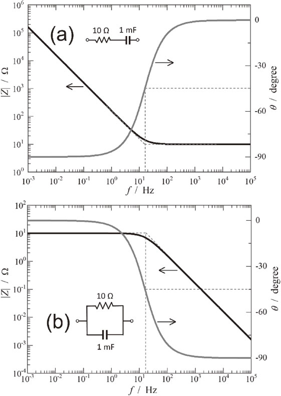

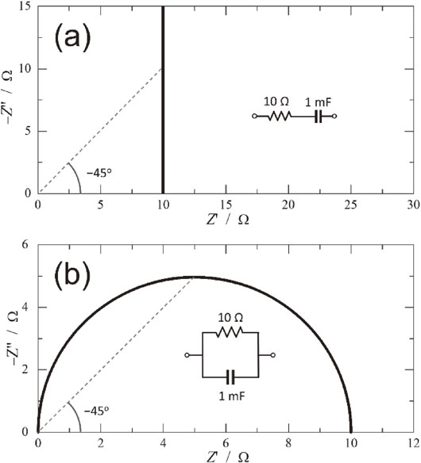

串联RC电路的阻抗是$Z_R$与$Z_C$之和。因此在高频区，由于$Z_R≫Z_C$ ，电路阻抗等于电阻R；而在低频区，由于$Z_R ≪Z_C$ ，阻抗等于$Z_C$ 。如Bode图所示，串联RC电路在高频区表现为电阻特性（|Z|与频率无关，相位角θ为 0°），在低频区表现为电容特性（|Z|与频率成反比，相位角θ为−90°）。Nyquist图中，串联 RC 电路的阻抗轨迹为一条从实轴垂直延伸的直线，与实轴交点的值等于 R。该电路的时间常数为RC，意味着当频率$ω=\dfrac{1}{RC}$时，$|Z_R|=|Z_C|$且相位角$θ=−45°$

并联RC电路的阻抗Z通过公式$\frac{1}{Z}=\frac{1}{Z_R}+\frac{1}{Z_C}$计算。因此，并联 RC 电路，阻抗较小的电路元件特性会显现。在高频区，并联RC电路的Z 等于$Z_C$ ；而在低频区则等于$Z_R$，这与串联RC电路的情况相反。在并联 RC 电路的Nyquist图中，阻抗轨迹 Z 呈现为半圆形，圆弧直径等于 R。该电路的时间常数$τ=RC$，与串联电路相同。当频率$\omega =\frac{1}{RC}$时，$|Z_R|=|Z_C|$且相位角$θ=−45°$，此时对应Nyquist图中圆弧的顶点。

与Bode图相比，Nyquist图更适合通过轨迹形状来辨识电路结构。但需指出的是，当两个并联 RC 电路的时间常数相近时，即便其电阻和电容值不同，它们的半圆也难以区分。如下图所示，当两个并联 RC 电路的时间常数仅相差10倍时，可观察到由两段圆弧重叠形成的畸变半圆。只有当时间常数差异达到 100 倍以上时，两段圆弧才能被清晰区分。因此在构建等效电路时，仅依Nyquist图并不可取，必须验证该等效电路能否合理解释目标电化学现象中的每个基本过程

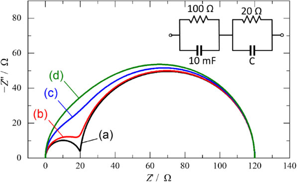

### 下面列举一些常见的电路模型以及相应的Nyquist、Bode图吧

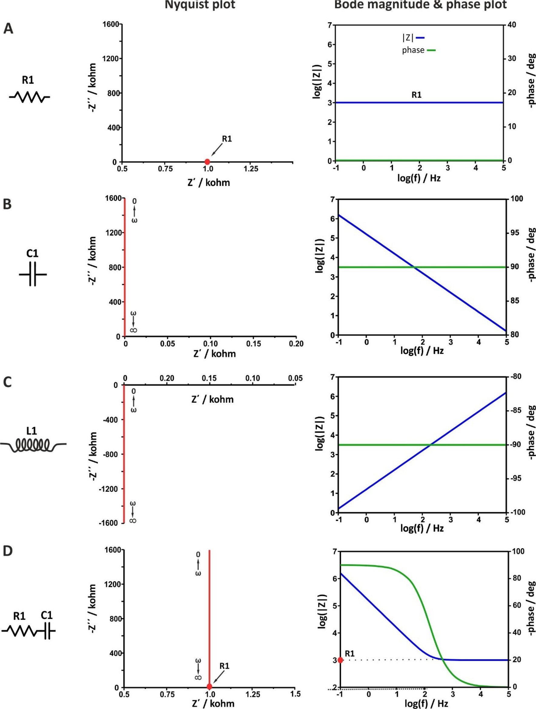

- 电感的Nyquist图在第四象限
- “电阻等价于点”
- “电容等价于垂直线”

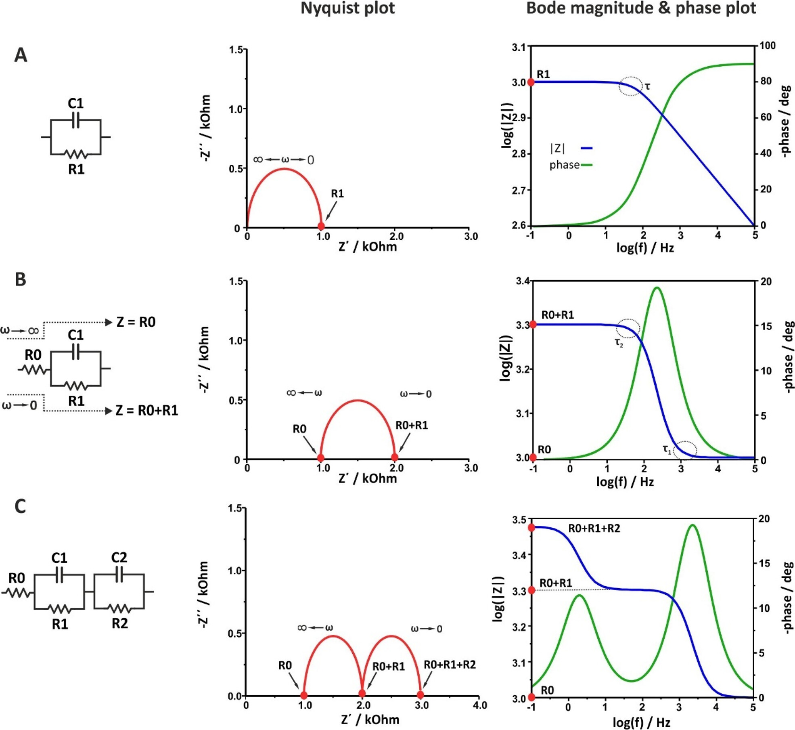

- 电容和电阻的并联反映到Nyquist图上即为一个半圆弧
- 有几个电阻-电容并联电路就有可能出现几个半圆弧
- 电阻$\rm{R}_0$+电阻-电容并联电路就等价于将半圆弧向右平移$\rm{R_0}$个单位

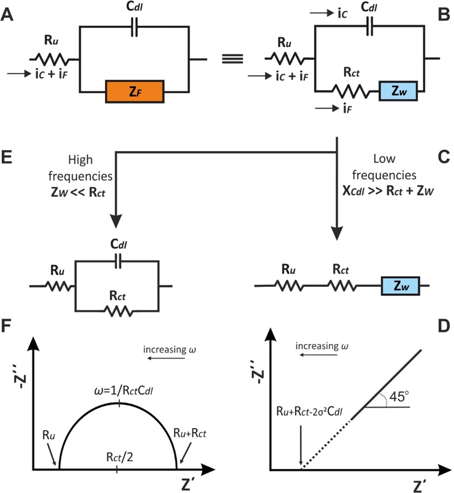

定义法拉第阻抗$Z_f=R_{ct}+Z_W$

- 上图左侧为理想高频部分，此时电荷转移电阻$R_{ct}$很大，阻抗由电荷转移主导
- 上图右侧为理想低频部分，此时“电容断路（电容特性：通高频阻低频）”，阻抗由物质扩散主导（溶液离子扩散、固体电解质中离子扩散等等）
- 如果是一个频率非常广泛的、既包含高频又包含低频的电化学阻抗测试，那么Nyquist图中可能同时出现高频部分的半圆弧和低频部分的直线，如下图所示

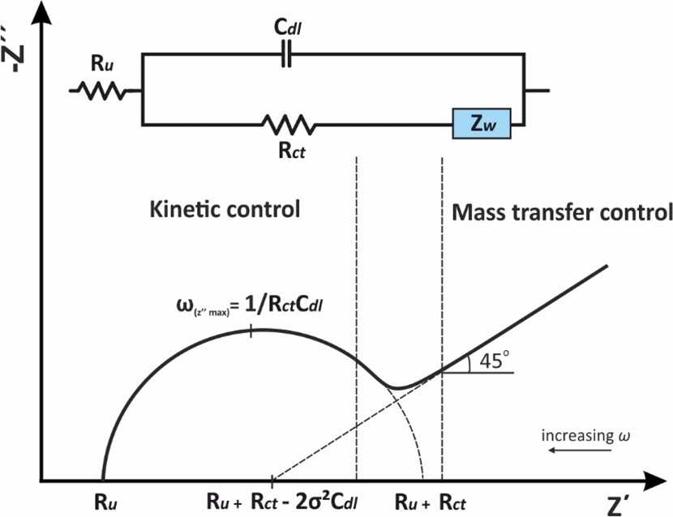

### 电极的等效电路

在电化学阻抗谱（EIS）中，电极的电化学行为通常由包含电阻和电容的等效电路表示。其中，Randles 电路常被用作电极的等效电路模型

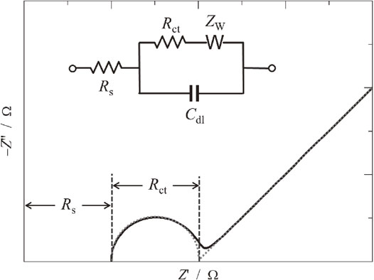

- 定义法拉第阻抗$Z_f=R_{ct}+Z_W$
- 溶液电阻$R_s$：即使使用参比电极，IR降也不可忽略。电解质传导过程中涉及的电阻称为溶液电阻（$R_s$ ）， 可通过Nyquist奎斯特图中高频极限处与实轴的交点获得
- 电荷转移电阻$R_{ct}$：当过电位较大时，电极发生极化，过电位与电流之间呈现指数依赖，而当电极电位接近平衡电位时，过电位与电流的指数关系可简化为线性关系。因此，在极低过电位区域（<10 mV）内，电极表现为电阻特性，其电阻值称为电荷转移电阻，对应于Nyquist奎斯特图中半圆的直径。由于电荷转移电阻的概念仅适用于获得线性关系的极小过电位区域，因此电化学阻抗谱中的电压振幅通常设置为≤10 mV。
- 双电层电容$C_{dl}$：电极与电解质界面处的电双层类似于电容器，虽然无法直接从Nyquist图中确定$C_{dl}$ 的数值，但如果确定了$R_{ct}$ ，则可通过以下关系式利用圆弧顶点频率对应并联电路的时间常数计算出$C_{dl}$ ：$\tau=R_{ct}\times C_{dl}$ 
- Wurburg阻抗：源于电解液中活性物质的扩散过程。在半无限扩散条件下，$Z_W$可通过以下方程表示：

$$
Z_W=\dfrac{RT}{n^2F^2Ac\sqrt{D}}\cdot\dfrac{1}{\sqrt{\omega}}\cdot\dfrac{1-j}{\sqrt{2}}
$$

其中，n为反应中转移的电子数，A 为电极的几何面积，c为活性物质的浓度，D为扩散系数。Wurburg阻抗可用一个电容器与电阻器无限级联的电路表示。在Wurburg阻抗中，Z'和-Z''相等，因此在Nyquist图中可观察到一条斜率为-45°的直线。通过绘制 Z'和 Z''随ω变化的关系曲线，可从两条平行直线的斜率确定扩散系数。值得注意的是，该式源自能斯特方程中浓度电势依赖项($\dfrac{\partial E}{\partial c}$)。对于不符合能斯特方程的电极（如发生固态扩散的电极），必须考虑($\dfrac{\partial E}{\partial c}$)项才能计算扩散系数

如下图所示，当扩散系数 D 增大时，活性物质能快速响应电极表面浓度变化而迅速补充至电极界面。因此较大的 D 值会导致$Z_W$值减小。反之，$Z_W$随D值减小而增大，从而使直线向低频方向移动。最终在Bode图中，$Z_W$的线性区会与并联RC电路引起的|Z|变化区域重叠。这一现象在下下图（😛）所示的Nyquist图中更为明显：当 D 值较大时，-45°斜率的直线与圆弧可清晰区分；但随着 D 值减小，圆弧与直线开始重叠。这种重叠现象表明活性物质的扩散速度低于电荷转移反应的时间常数，本质上意味着扩散过程成为速率控制步骤。

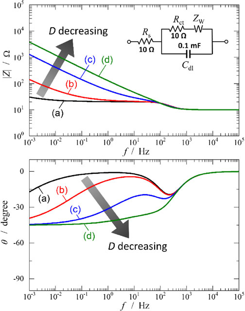

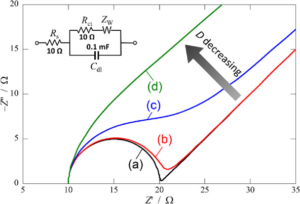

**一个性能良好的固态电解质材料，其离子电导率应当较大，扩散系数D应当较大，那么Nyquist图应当接近于a或b的形貌**

### 从理想电极到真实电极——常相位元件CPE

CPE被定义为：
$$
Z_{CPE}=\dfrac{1}{Y_O(j\omega)^n}
$$

$$
\theta=90^{\circ}(1-n)
$$

其中θ是与理想情况（φ=90°）的相位偏差，n 是从 0 到 1 的常数，定义了与理想行为的偏差

| n    | 相位角φ（理想行为） | 与理想行为的偏差θ | 阻抗方程                                                  |
| :--- | :------------------ | :---------------- | :-------------------------------------------------------- |
| 1    | 90                  | 0                 | $Z(\omega)=\dfrac{1}{j\omega \rm{C_{dl}}}$                |
| 0.9  | 81                  | 9                 | $Z_{\omega}=\dfrac{1}{Y_O(j\omega)^{0.9}}$                |
| 0.8  | 72                  | 18                | $Z_{\omega}=\dfrac{1}{Y_O(j\omega)^{0.8}}$                |
| 0    | 0                   | 90                | $Z_{\omega}=\dfrac{1}{Y_O(j\omega)^{0}}=\dfrac{1}{Y_O}=R$ |
| 0.5  | 45                  | 45                | $Z(\omega)=\dfrac{1}{Y_O}\sqrt{j\omega}$                  |

两个极端情况：

- n=1，CPE表现为理想电容器
- n=0，CPE 表现为电阻器
- n=0.5，$Z(\omega)=\dfrac{1}{Y_O}\sqrt{j\omega}$，即等价于 Warburg 阻抗

## 用传输线模型来直观理解扩散阻抗

Warburg阻抗是一个复杂的元素，它表示氧化还原物质向电极表面的质量传递，并被描绘为奈奎斯特图的低频范围上的-45°线。这种行为是指化学物质的时间相关（非稳态）半无限扩散，如下图A所示，在电极/电解质界面处存在单个边界，距离 x=0。朝向本体溶液，并且在静止条件下，扩散层扩展到由电化学电池的尺寸限定的无限长度（x→∞），同时浓度梯度随时间下降。

将扩散层视为由无数个 “电阻（$R_d$）- 电容（$C_d$）” 单元串联，其中：

- $R_d$：单位长度的扩散电阻（反映扩散阻力）
- $C_d$：单位长度的 “化学电容”（反映浓度存储能力）

- 半无限扩散——无限长传输线，阻抗为Warburg直线
- 有限扩散——有限长传输线，末端接电阻（投射）或电容（反射）
  - 当有限扩散区对扩散物质可渗透时，随着时间和电流流过电化学电池，建立了稳态浓度梯度（dC/dx=常数）。这是透射或可渗透边界的情况。
  - 当有限扩散区在一段时间后对扩散物质不渗透时，电荷转移是不可能的，并且扩散物质的浓度梯度变为零（dC/dx=0）。这是反射或不渗透边界的情况

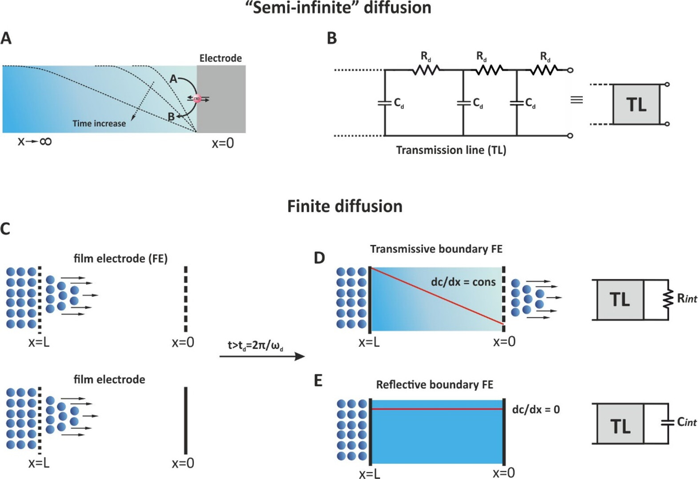

==具有透射边界的有限长度线性扩散的典型例子包括固体氧化物或聚合物膜燃料电池，和旋转盘电极实验中的扩散层==

## 固态电解质的阻抗谱分析

以陶瓷固态电解质为例，**假设其仅存在单离子传输而不具有电子导电性**

**在极高频率区域（>1 MHz）的阻抗数据对于通过 EIS 测量分析固体电解质至关重要**，这与其它材料的 EIS 分析存在显著差异。若某固体电解质的体相离子电导率为$10^{−4} S\cdot cm^{−1}$ ，且离子迁移相关电容为$10^{−11} F\cdot cm^{−2}$ ，则对应$1/(2π×τ)$（$τ$：时间常数）的特征频率约为∼$10^7$Hz（10 MHz）。若未对该频率区域采取特殊防护措施进行EIS测量，高频区的阻抗数据将会缺失，仅能观测到部分圆弧。在此情况下，EIS数据中包含的来自电缆和电池的电子电阻分量无法消除。此外，由晶粒内部电阻和晶界电阻构成的离子电阻也无法分离，从而导致固体电解质重要信息的丢失。

由于大多数陶瓷固体电解质是由不同尺寸和取向的晶粒聚集而成的多晶材料，除了晶粒内部电阻外，离子在晶粒间界面处的传输电阻对离子电导率具有重要影响。晶粒内部电阻$R_{\rm{gi}}$ （又称体电阻）是材料固有的离子传输阻力。因此，**若测试样品不含孔隙，通过晶粒内部电阻倒数计算得到的体离子电导率等于该固体电解质单晶的离子电导率**。晶界电阻$R_{\rm{gb}}$ 表示离子穿越晶粒间界面（晶界）及/或位于晶界的化学组成不同微相时所受的传输阻力。下图展示了陶瓷固体电解质的等效电路及Nyquist图，该电路由两个串联的并联 RC 回路构成：一个电阻对应$R_{\rm{gi}}$ ，另一个对应$R_{\rm{gb}}$ 。由于两个并联RC电路具有不同的时间常数$（τ = R × C）$，电化学阻抗谱能够分别测定这两个电阻值。

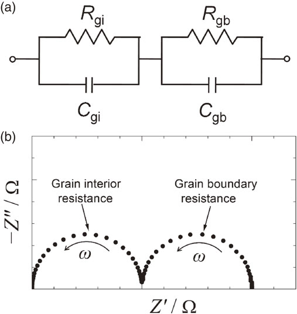

由于开发和改进陶瓷固体电解质最有效的方法是通过降低$\rm{R_{gb}}$ 使离子电导率接近单晶水平，因此分离$\rm{R_{gi}}$ 和$\rm{R_{gb}}$ 并分别评估它们至关重要。要通过高频区半圆直径确定$\rm{R_{gi}}$ ，应通过增加电解质厚度、减小电极面积或降低测量温度来降低特征频率。然而这些方法存在局限性，例如当电极面积小于样品几何面积时会干扰样品中的电流分布，因此需要测量直至高频区的阻抗数据。本文介绍了我们测量固体电解质高达 100 MHz 高频阻抗的方法。

在固体电解质的电化学阻抗谱（EIS）测量中，通常采用电极/电解质/电极的三明治结构组件。这种配置的优势在于能够实现简单的两端测量（**注：设备与电极之间需连接两根电压线和两根电流线，共计四根电缆**）。采用电极/电解质/电极结构进行EIS测量时，电极材料的选择至关重要。电极材料需满足以下必要条件：能够构建稳定界面且不与电解质发生化学反应，同时具备足够的电子导电性。金或铂等贵金属常被用作阻塞电极，某些情况下也会采用能与移动离子发生可逆反应的可逆电极。圆盘状固体电解质样品通常通过粉末压片成型，必要时还需进行煅烧处理。 样品的相对密度最好大于 90%，理想情况下应超过 95%。

在电极涂覆工艺中，有两个关键因素会影响固体电解质的阻抗测量结果。其一是电极厚度：过薄的电极可能导致阻抗数据偏离原始值，进而造成对固体电解质离子传输行为的误判。其二是固体电解质的表面状态，该因素会显著影响阻抗测量。本节将详细阐述这两个因素如何影响阻抗数据。

下图展示了不同电极厚度及固体电解质表面是否抛光处理的氟离子导体Nyquist图。所有情况下均采用溅射法沉积直径为7mm 的铂电极。阻抗测试使用 Keysight E4990A 阻抗分析仪在室温空气环境下完成。所有Nyquist图均呈现两个特征：由晶粒内部与晶界电阻（具有相近时间常数）形成的畸变弧线（两个半圆弧融合），以及低频区对应阻塞电极与固体电解质界面电容特性的直线段。不同电极厚度的Nyquist图存在显著差异：对于 200 nm 厚电极（图 2a），离子传输电阻（晶粒内部与晶界电阻）形成的阻抗弧起始于坐标原点；而 50 nm 薄电极（图 2b）的阻抗弧则发生水平偏移，且由阻抗弧外推得到的高频极限阻抗值偏离原点。 这种因电极厚度不同而产生的差异可归因于样品中的电流分布；对于较薄的电极，其横向电阻不容忽视

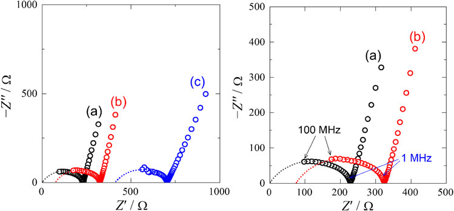

如上图，当样品**经 2000 目砂纸抛光并**沉积 50 纳米铂电极后，所得阻抗弧严重偏离原点。这表明抛光过程引入了除离子传输过程之外的额外电阻。此外，抛光样品的离子传导过程对应阻抗弧略有扩大，直线斜率趋于平缓。这种斜率变化反映了抛光前后样品阻塞行为的差异：抛光样品在<1 MHz 频率区间出现与阻塞行为重叠的寄生电阻。**固态电解质抛光前后的阻抗行为变化归因于抛光过程中（为去除煅烧样品表面偏析层而进行的）样品表面劣化**。

为消除电缆电感对高频测量的干扰，设备与电解池（样品）之间的连接电缆应尽可能缩短。建议采用特性阻抗为 50Ω的同轴电缆，并将其紧贴样品安装。此外，必须合理设置电流回流路径。对于高达 100MHz 的高频测量，需确保电缆不会引起相位差畸变。在进行高频测量前，应对系统进行开路/短路/负载校准

## 离子电导率的计算

$$
\sigma'(\omega)=\dfrac{L}{S}\times\dfrac{Z'(\omega)}{\vert Z'(\omega) \rvert ^2}
$$

对于使用固态电解质模具进行电化学阻抗谱测试的情况，离子电导率的计算公式为：
$$
\sigma =\dfrac{L}{S\times R}
$$
其中$L$为固态电解质pellet圆片厚度，$S$为圆片pellet的面积，$R$为电阻（Nyquist图拐点处的横坐标）

## 实战演练——以$\rm{Li_{5.5}PS_{4.5}Cl_{1.5}}$的电化学阻抗谱图为例

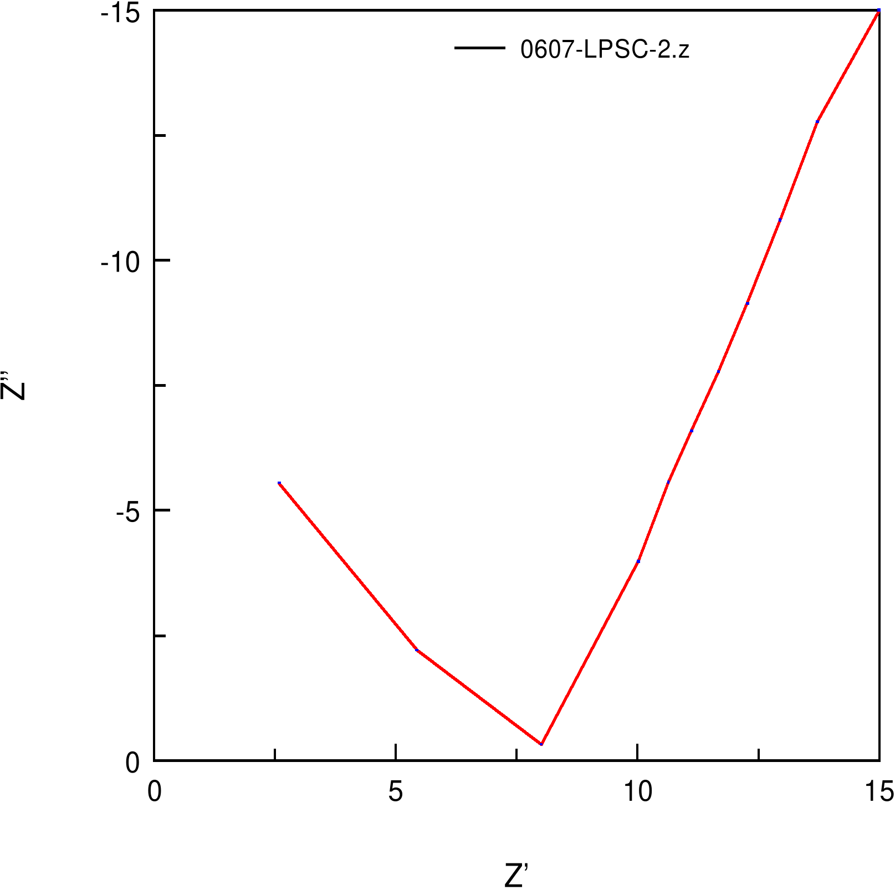

这是之前测试的图，简单画了一下，2Tons（249MPa）压力下的测试结果。可以看到，这与常见的阻抗谱差别非常大，并没有出现超高频的半圆弧，只出现了低频的扩散部分和中高频的拐点。这是收阻抗仪的最高频率所限，使用的阻抗仪最高频只能达到约1MHz左右，对于10mS/cm的固态电解质，想要完整的测出半圆弧可能需要100MHz甚至更高的频率

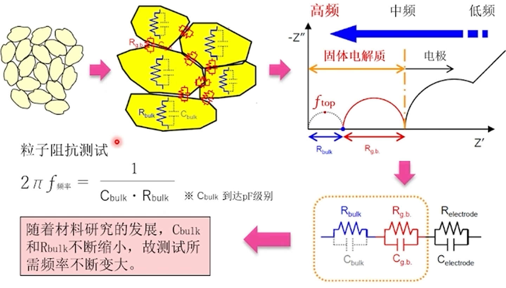

- 由于设备频率上限较低，只能得到粒子抵抗和粒界阻抗的总值
- 活化能分析中无法判断随温度变化特性值发生变化的是粒子阻抗还是粒界阻抗
- 在通过变温方式尝试分离粒子阻抗和粒界阻抗时，可控温度范围有限，且无法对变温引起的参数条件变化进行校正

==此外，交变电流源的最高频率不等于最高有效频率==，有效的最高频率常常受限于测试端子类型和连线长度，在进行变温控制的时候，==夹具及导线材料的介电常数因为温度变化而变化，如果不及时矫正阻抗会使结果产生较大偏离==

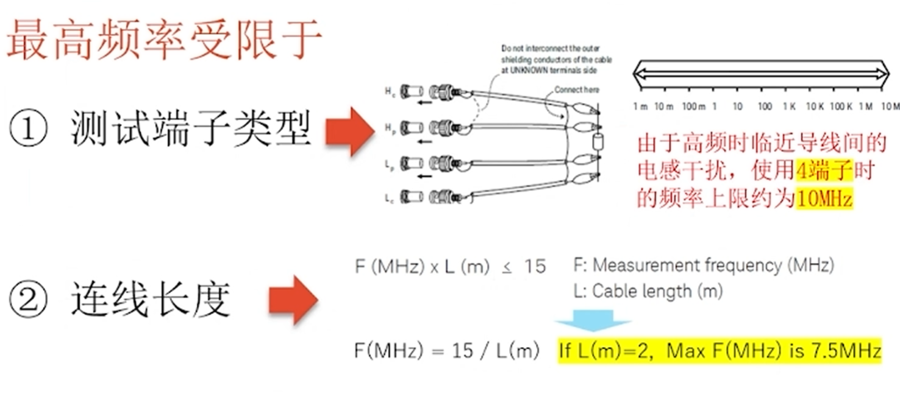

下图展示了超高有效频率下的LLTO型固态电解质的阻抗谱

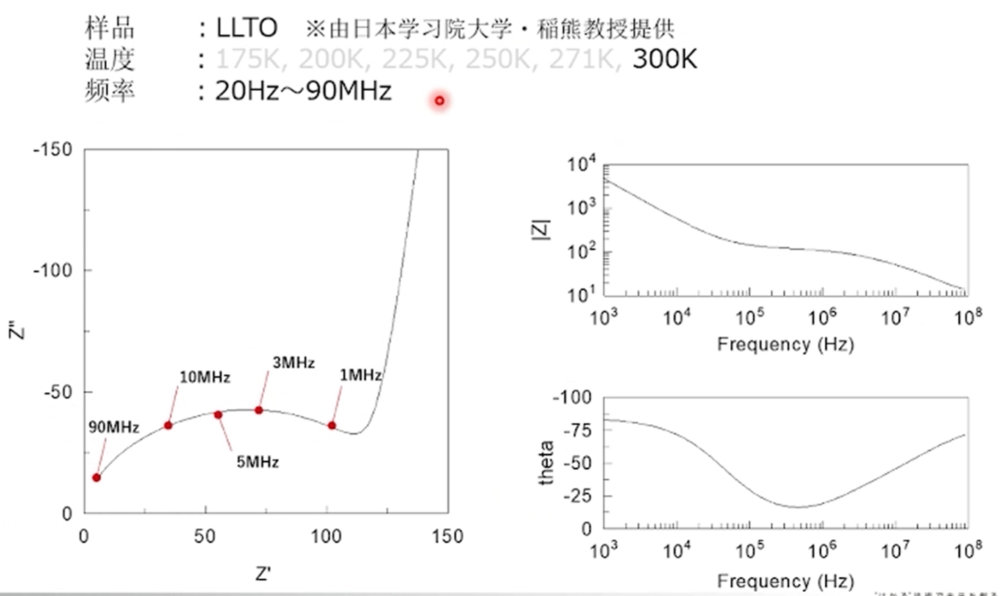

## 参考资料

(1) Lazanas, A. Ch.; Prodromidis, M. I. Electrochemical Impedance Spectroscopy─a Tutorial. ACS Meas. Sci. Au 2023, 3 (3), 162–193. https://doi.org/10.1021/acsmeasuresciau.2c00070.
(2) Lazanas, A. Ch.; Prodromidis, M. I. Correction to “Electrochemical Impedance Spectroscopy─a Tutorial.” ACS Meas. Sci. Au 2025, 5 (1), 156–156. https://doi.org/10.1021/acsmeasuresciau.5c00007.
(3) Ariyoshi, K.; Mineshige, A.; Takeno, M.; Fukutsuka, T.; Abe, T.; Uchida, S.; Siroma, Z. Electrochemical Impedance Spectroscopy Part 2: Applications. Electrochemistry 2022, 90 (10), 102008–102008. https://doi.org/10.5796/electrochemistry.22-66080.
(4) Ariyoshi, K.; Siroma, Z.; Mineshige, A.; Takeno, M.; Fukutsuka, T.; Abe, T.; Uchida, S. Electrochemical Impedance Spectroscopy Part 1: Fundamentals. Electrochemistry 2022, 90 (10), 102007–102007. https://doi.org/10.5796/electrochemistry.22-66071.
(5) Hu, W.; Peng, Y.; Wei, Y.; Yang, Y. Application of Electrochemical Impedance Spectroscopy to Degradation and Aging Research of Lithium-Ion Batteries. J. Phys. Chem. C 2023, 127 (9), 4465–4495. https://doi.org/10.1021/acs.jpcc.3c00033.

