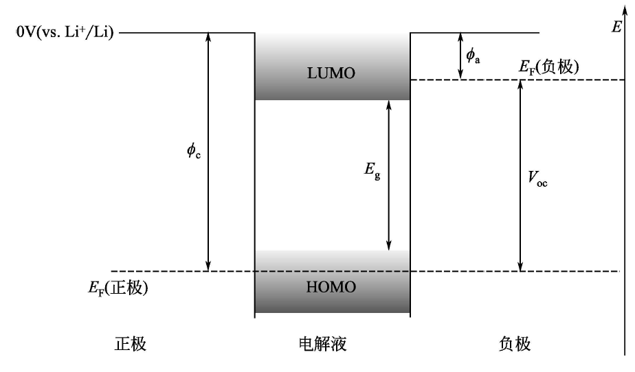
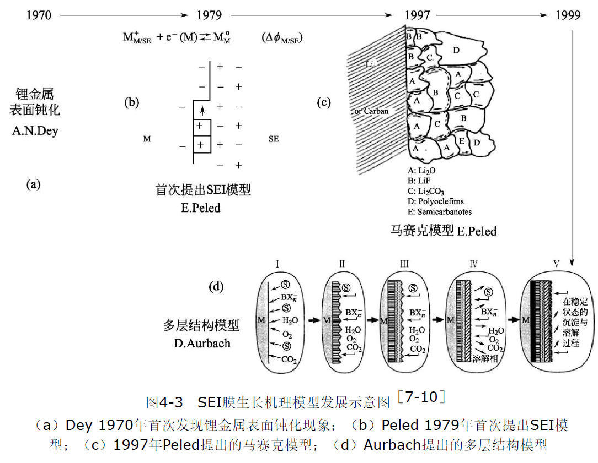

# SEI膜的结构

锂离子电池工作电位范围为2～4.3V。其中，石墨类负极工作电位范围在0～1.0V（vs.Li+/Li），正极工作电位范围一般在2.5～
4.3V（vs.Li+/Li）。而目前商用电解液不发生氧化还原反应的电化学窗口一般为1.2～3.7V（vs.Li+/Li）。因此，在负极侧，当负极点位 <1.2 V时会生成SEI固态电解质中间相，类似的在正极侧会生成CEI结构。

从机理来看，当负极的Fermi能级高于电解质的LUMO时，电子容易从Fermi能级转移到LUMO轨道，即发生氧化还原反应形成SEI界面

如果电极材料的充放电电位范围较窄，例如负极的嵌锂电位高于1.2V（ vs.Li+/Li ） ， 正极的脱锂电位低于
3.5V（vs.Li+/Li），则正负极表面可以不发生电解质的氧化还原反应，不会形成SEI膜。

SEI界相的厚度可能需要>2 nm以防止电子隧穿效应，<50 nm来确保离子能够顺利传输。它的结构如下图所示：

SEI膜的成分和结构通常认为是靠近电极材料的为无机物层，对于锂离子电池，主要包含$\rm Li_2CO_3、LiF、Li_2O$等；中间层为有机物层，包括$\rm ROCO_2Li、ROLi、RCOO_2Li$（R为有机基团）等；最外面为聚合物层，例如PEO-Li等

**SEI的成分与微观结构基本不存在普适性的规律**，针对特定的电极与电解质体系需要具体问题具体分析，且不
易表征。Novák等对SEI膜表征方法做了总结，包括：俄歇电子能谱（AES），飞行时间二次离子质谱（ToF-SIMS），扫描探针显微
镜（SPM），扫描电子显微镜（SEM），透射电子显微镜（TEM），红外吸收光谱（IRAS），拉曼光谱（RS），X射线衍射（XRD），电子能量损失谱（ELLS），X射线近边吸收谱（XANES），电化学阻抗谱（EIS），差分扫描量热仪（DSC），程序升温脱附仪（TPD），核磁共振仪（NMR），原子吸收光谱（AAS），电化学石英晶体微天平（EQCM），离子色谱（IC），二次电子聚焦离子束与元素线性扫描分析仪（FIB-ELSA），傅立叶变换红外光谱（FTIR），X射线光电子能谱（XPS）等

TEM适合探测纳米材料的微观结构，常用来研究电极材料的SEI膜形貌，但是SEI膜较敏感，在被电子束照射后会收缩甚至消失，在常规透射电镜下难以保持原有的化学状态，无法实现纳米尺度的**原位观测**。崔屹等人首次拍摄出了具有原子级分辨率的SEI膜透射电镜照片（**冷冻电镜**）。研究发现，具有马赛克结构SEI的金属锂脱锂不均匀，从而形成大量失
去与电极接触的金属锂，俗称“死锂”导致电池循环效率降低。与之相比，具有层状结构SEI的金属锂脱锂均匀，残留的“死锂”较少，所以循环效率也较高。

SEI膜的化学成分可以使用表面增强拉曼光谱（SERS）研究