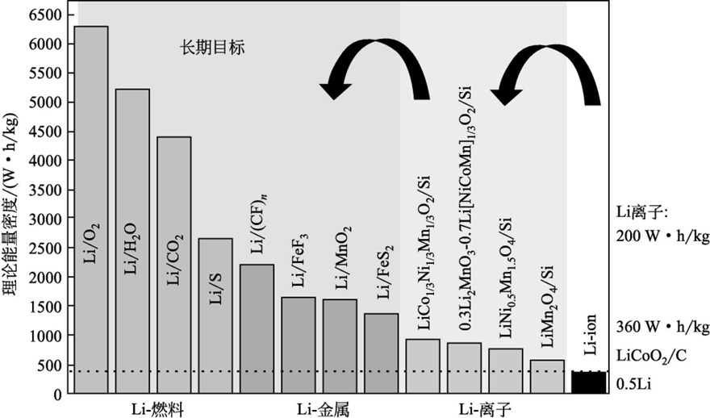
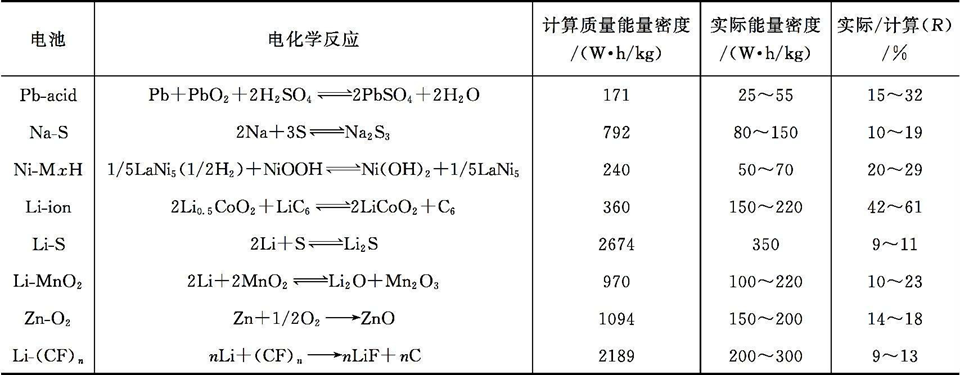

| 项目                       | 3C设备    | 动力电池  | 储能       |
| -------------------------- | --------- | --------- | ---------- |
| 质量能量密度 /(W·h·kg⁻¹)   | 260~295   | 240~300   | 140~200    |
| 体积能量密度 /(W·h·L⁻¹)    | 650~730   | 500~600   | 320~450    |
| 循环寿命 /周               | 1000      | 1500~3000 | 5000~15000 |
| 倍率                       | 3C        | 1~3C      | 0.2~0.5C   |
| 工作温度 /℃                | ‑20~55    | ‑30~55    | ‑30~55     |
| 成本 /(元·(W·h电芯)⁻¹)     | 1.2~2.0   | 0.5~1.2   | 0.5~0.8    |
| 电池容量 /A·h              | 3~20      | 3.2~200   | 50~400     |
| 工程能力指数 (Cpk)         | 1.33~1.66 | —         | —          |
| 安全性（欧洲汽车危险等级） | 4         | —         | —          |

上表是三种常见的不同应用场合锂离子电池的性能参数

电化学池的环境可近似为恒温、恒压且非体积功只有电功，那么反应中吉布斯自由能的改变即为电功：
$$
\Delta_rG^s=-nFE^s
$$
markdown不方便打出化学标准状态，就用standard上标代替了。

n为每摩尔电极材料在氧化还原反应中转移电子的量，F为法拉第常数（F=96485C/mol），E为电化学池的电动势。

电池的能量密度可以用两种方式表示：质量能量密度（W·h/kg）和体积能量密度（W·h/L），根据不同的体系选择合适的标度，分别定义为：
$$
\varepsilon_M=\dfrac{\Delta_rG^s}{\sum M}
$$

$$
\varepsilon_V=\dfrac{\Delta_rG^s}{\sum V_M}
$$

使用国际单位制，电量定义为：
$$
Q=I\times t=\rm 1A\times 3600s=3600C
$$
所以：
$$
\rm 1mAh=3.6C
$$
所以比容量定义为：
$$
\text{Capacity}=\dfrac{Q}{m}=\dfrac{nF}{m}=\dfrac{F}{M}(\text{C/g})=\dfrac{F}{3.6M}(\text{g/mol})
$$
常见的非理想情况：

- 反应物气体来自于外界，若在计算理论能量密度时不考虑气体的质量，计算出的理论能量密度会显著高于考虑气体质量的计算方法
- 计算采用的吉布斯生成能一般为不含缺陷的体材料（perfect bulk material）的测量数据，实际材料由于存
  在缺陷和尺寸效应，导致生成能会偏离理想材料的生成能，因此需要考虑各类缺陷能的贡献：

$$
\Delta_fG^s(\text{real material})=\Delta_fG^s(\text{perfect material})-\sum\Delta_fG_i^s(\text{defect})
$$

在实际电池电芯中，存在多种非活性物质，如集流体、导电添加剂、黏结剂、隔膜、电解质溶液、引线、封装材料等。

