沉寂了一段时间，还是下定决心再出发，向前冲吧~

uixs&师姐简单告诉了我以下学习任务:
>
>>>>>基础知识：晶体学基础， 空间群、晶格矢量、倒空间、布里渊区等然后了解一下扩散系数、迁移能垒、电导率、Arrhenius公式、MSD（均方位移）计算：结构搭建，一般是分数占据结构,需要用到pymagen、atat等软件，vasp用来计算 opt/ DOS / band /MD，还有lammps软件计算MD以及一下大模型和训练机器学习势函数来计算MD

或多或少也都接触过，谈不上困难，只是我这记忆……

## 倒空间 / 布里渊区——From book "The Oxford Solid State Basics"

### lattice与cell
Lattice:
- Definition A: ==a set of points== defined as integer sums of primitive(namely principle) lattice(namely translation/basis) vectors.
- 定义A: 由一组线性无关的**初基晶格矢量 (Primitive Lattice Vectors, PLV)** 的整数组合所定义的一个无限点集。 
PLV(原始晶格矢量)的选择并不唯一，可以是多种多样，只要不共线且能够遍历每一个point即可，下图是一个小QUIZ:
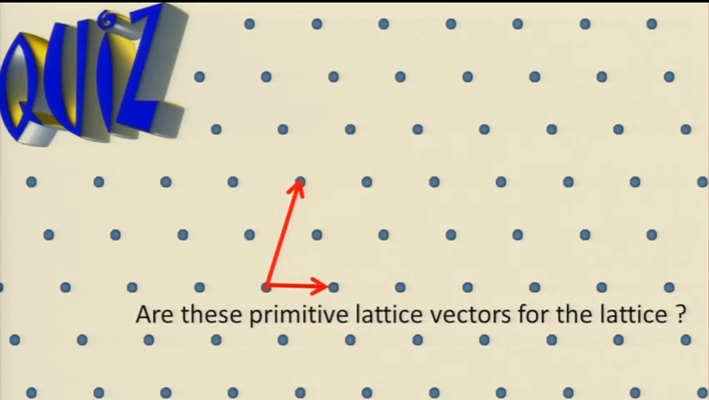

在二维空间中，格点位置矢量为：
$$\vec{R}_{[n_1 n_2]} = n_1 \vec{a}_1 + n_2 \vec{a}_2 \quad (n_1, n_2 \in \mathbb{Z})$$
在三维空间中：

$$
\vec{R}_{[n_1 n_2 n_3]} = n_1 \vec{a}_1 + n_2 \vec{a}_2 + n_3 \vec{a}_3 \quad (n_1, n_2, n_3 \in \mathbb{Z})
$$

Lattice的另一种定义：
- Definition B: ==A set of vectors== such that addition of two gives a third.
- 定义B: 一个无限的向量集合，其中任意两个向量相加得到的第三个向量依然属于该集合。

$$
\vec{R}_i + \vec{R}_j = \vec{R}_k
$$

第三种定义：
- Definition C:  a lattice look the same viewed from any lattice point.
- 定义C: 格点集合中，从任何一个格点望出去，周围的几何环境完全相同。
下图不是一个晶格：
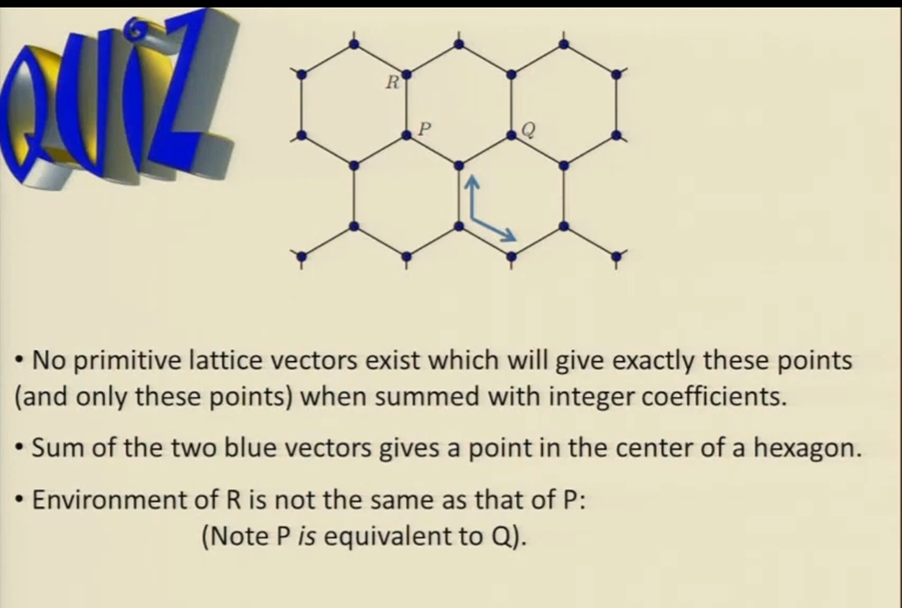
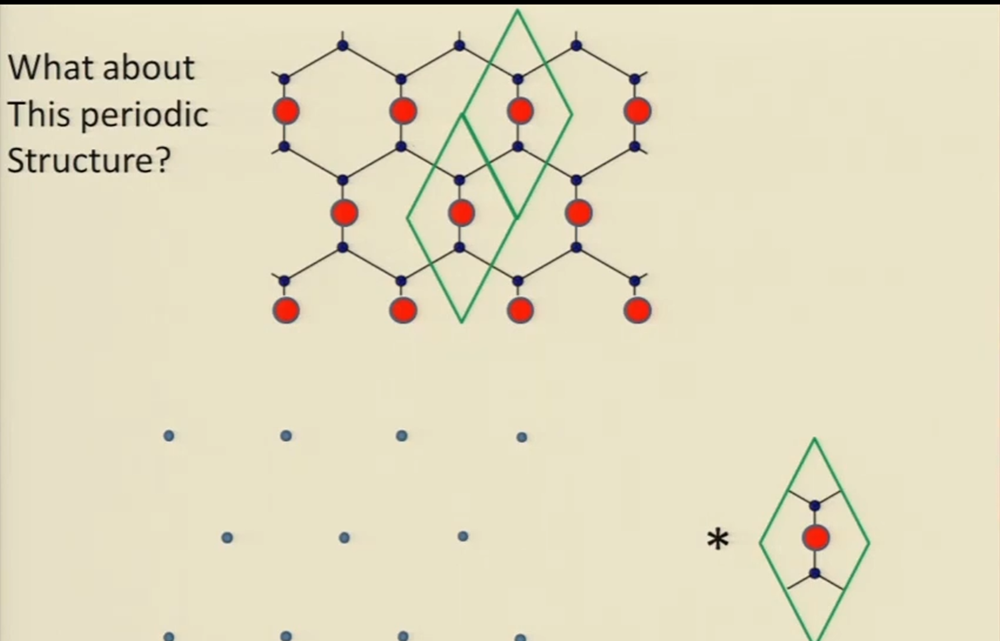

### Unit cell

晶胞（即conventional cell惯用晶胞）：空间中的一个区域，当我们将许多相同的单胞无缝堆叠（Tile）在一起时，可以完美填满整个空间并重建整个周期性结构

原始晶胞（即primitive cell原胞）：仅包含恰好 1 个==格点 (Lattice Point)（而不是原子/离子）== 的最小单胞

- primitive cells is not unique!!!选取不唯一

Wigner-Seitz cell:
- The region around a lattice point closer to that lattice point than to any other
Wigner-Seitz construction（几何构筑法）:
- use perpendicular bisector（使用垂直平分线）
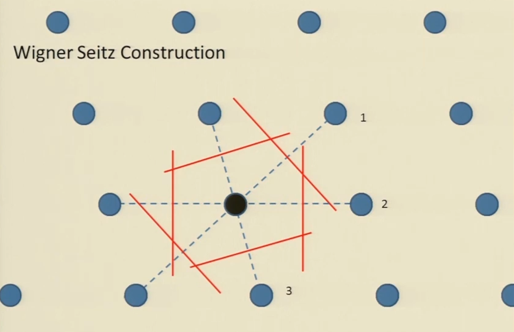

Voronoi cell:
- A Wigner-Seitz cell for a non-lattice collection of points.
- 针对非周期性、无规则散乱点集使用 Wigner-Seitz 构筑法得到的几何区域。

"Basis":
- A description of objects in the unit cell with respect to our reference lattice point

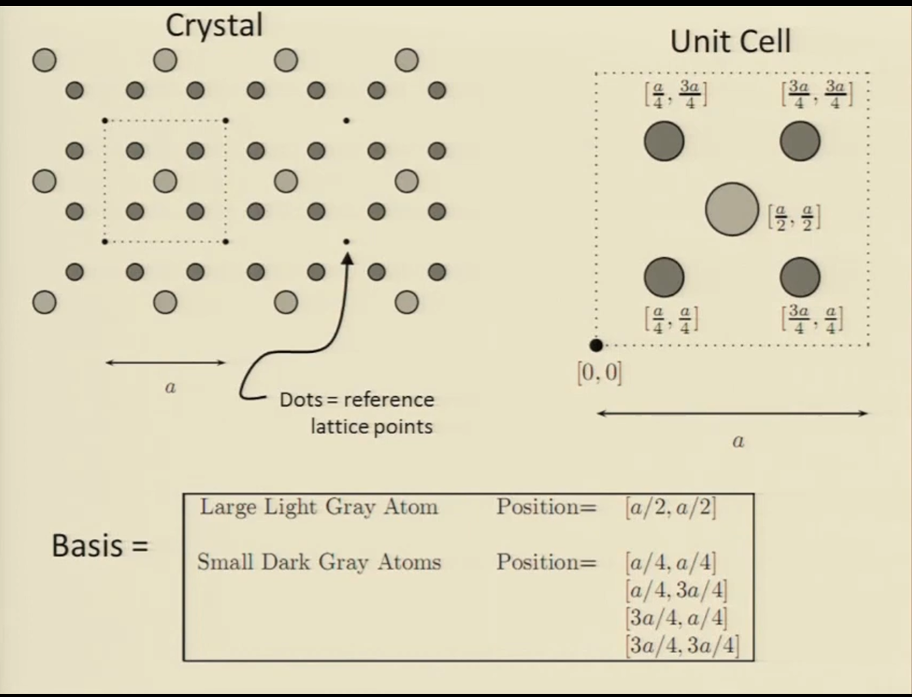
basis，在原胞内，物体相对于我们的参考点阵点的描述，有如下关系：

$$
\text{Crystal Structure (晶体结构)} = \text{Lattice (点阵 - 数学格点骨架)} + \text{Basis (基元 - 实体配置清单)}
$$

需要注意的是，==lattice point并不一定对应着一个真实的原子或者离子==

### 3D unit cell

在晶体学中，lattice point的表达通常形式为：

$$\vec{R} = u\vec{a}_1 + v\vec{a}_2 + w\vec{a}_3$$

如果 $\vec{a}_1, \vec{a}_2, \vec{a}_3$ 是初基晶格基矢，且 $u, v, w \in \mathbb{Z}$，则 $\vec{R}$ 描述的是一个真实的格点（Lattice Point）。

- **晶向指数** $[uvw]$：没有量纲的纯数字/整数。它本质上是**坐标分量**，用来表示“在倒空间或实空间中，沿着对应的基矢各自走了多少步”。不要将它和具有长度、方向实体的基矢 $\vec{a}_i$ 混淆。

在 FCC (面心立方最密堆积) 中，不同研究视角的参数描述截然不同：

**Conventional Unit Cell (惯用单胞 / 结晶学单胞)**： 一个完美的立方体，边长为 $a$。包含了 **4 个** 格点。为了保持直观的直角立方对称性，结晶学家常用此体系。

**Primitive Unit Cell (初基原胞 / 固体物理学单胞)**： 物理学家为了数学计算最简化，使用只包含 **1 个** 格点的原胞。 它的三根初基基矢指向最近的三个面心：

$$\vec{a}_1 = \left[\frac{1}{2}, \frac{1}{2}, 0\right]a, \quad \vec{a}_2 = \left[\frac{1}{2}, 0, \frac{1}{2}\right]a, \quad \vec{a}_3 = \left[0, \frac{1}{2}, \frac{1}{2}\right]a$$

如果在初基基矢坐标系下，FCC 的 Basis 只有 **1 个** 原子，其坐标在初基原胞的原点：
- $[0, 0, 0]$

但如果坚持在 Conventional Cell (惯用直角坐标系) 下描述 FCC 结构，它的 Basis 则必须包含 **4 个** 等价原子（这正是你视频里记录的四个坐标）：

- $[0, 0, 0]$

- $[1/2, 1/2, 0]$

- $[1/2, 0, 1/2]$

- $[0, 1/2, 1/2]$

在固体物理中，研究三维晶体必须熟悉这 14 种 Bravais Lattice：
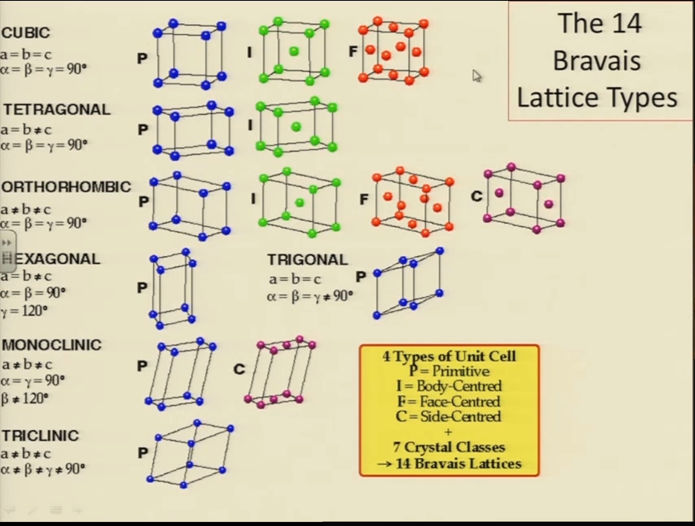

### Reciprocal space

倒空间（动量空间）是实空间的傅里叶变换。对于一维系统，实空间晶格常数为 $a$，则倒格子的步长为 $G_m = (\frac{2\pi}{a}) \times m$，m是一个整数。 因为周期性波函数具有 $e^{ikx}$ 的形式，当波矢 $k$ 发生一个倒格矢 $G_m$ 的移动时，波矢的物理状态完全不变：

$$
e^{i(k+G_m)x_n} = e^{i(k+G_m)na} = e^{ikna}e^{i(2\pi m / a)na} = e^{ikx_n}
$$
即：$k \equiv k + G_m$

在任何维度内，定义倒格子：
Define reciprocal lattice as points $\vec{g}$ such that $e^{iG_m \cdot \vec{R_n}}=1$ for all $\vec{R_n}$ in direct lattice

**倒格子的初基矢量** $\vec{b}_1, \vec{b}_2, \vec{b}_3$： 它们与实空间基矢 $\vec{a}_1, \vec{a}_2, \vec{a}_3$ 满足**克罗内克 delta 关系 (Kronecker Delta)**：

$$\vec{a}_i \cdot \vec{b}_j = 2\pi \delta_{ij}$$

具体的三维向量解析表达式（利用叉乘关系）为：

$$\vec{b}_1 = \frac{2\pi \vec{a}_2 \times \vec{a}_3}{\vec{a}_1 \cdot (\vec{a}_2 \times \vec{a}_3)}, \quad \vec{b}_2 = \frac{2\pi \vec{a}_3 \times \vec{a}_1}{\vec{a}_1 \cdot (\vec{a}_2 \times \vec{a}_3)}, \quad \vec{b}_3 = \frac{2\pi \vec{a}_1 \times \vec{a}_2}{\vec{a}_1 \cdot (\vec{a}_2 \times \vec{a}_3)}$$
**倒格子的对称性互换（Important Aside）**：

- **FCC 的倒格子是 BCC**（初基倒格子基矢构筑出的形状是体心立方）。

- **BCC 的倒格子是 FCC**。 (这也是为什么在 VASP 能带计算中，FCC 实空间原胞对应的第一布里渊区形状是 truncated octahedron，即截角八面体，这正是 BCC 晶格的 Wigner-Seitz cell 形状！)

Lattice Plane (晶面) 与 Miller Indices (米勒指数)

- **Lattice Plane (晶面)**：一个包含至少三个不共线（因而包含无限个）实空间点阵点的平面。

- **Family of Lattice Planes (晶面族)**：一组等间距、相互平行的晶面，它们合起来恰好无遗漏地包含实空间点阵中的所有格点。

- **米勒指数** $(hkl)$：

- **定义**：由三个互质的整数组成，用来表征一组晶面族。该晶面族在实空间直角坐标轴上的截距之比的倒数比为：

$$\frac{1}{x_1} : \frac{1}{x_2} : \frac{1}{x_3} = h : k : l$$
- 每一个米勒指数 $(hkl)$，本质上对应着一个倒格矢：

$$\vec{G}_{(h,k,l)} = h\vec{b}_1 + k\vec{b}_2 + l\vec{b}_3$$
- **实空间与倒空间的互对关系 (The Key Claim)**：

- 晶面族的**法线方向**，完美对应倒格矢 $\vec{G}$ 的方向。

- **晶面间距** $d$ **与最小倒格矢长度** $|\vec{G}_{min}|$ **的关系**： 若该方向上最短的倒格矢为 $\vec{G}_{min}$，则实空间中对应的晶面族间距为：

$$d = \frac{2\pi}{|\vec{G}_{min}|}$$

这清晰地体现了倒数关系：

- 实空间里**晶面间距很大**（原子排得稀），其对应的倒格矢长度 $|\vec{G}|$ 就**很短**。

- 实空间里**晶面间距很小**（原子排得密），其对应的倒格矢长度 $|\vec{G}|$ 就**很长**。

在实际学术交流和 VASP 计算中，我们**默认使用立方体惯用单胞的基矢**来定义 $\vec{b}_i$。对于 FCC 和 BCC，这会导致 $\vec{b}_i$ 不是其初基倒格子的基矢，所以**并不是所有整数组合** $(hkl)$ 都是真正的倒格矢！例如：在 BCC 晶格中，由于体心原子的存在，$(010)$ 面不包含所有的原子，因此 $(010)$ 不是 BCC 的真倒格矢（对应的晶面族不成立）；而 $(020)$ 面完美穿过了体心和顶点，因此 $(020)$ 才是 BCC 的真实倒格矢（对应的晶面族间距减半）。

- 倒角立方晶格中的晶面间距通用公式（仅限立方体系），改公式由$d = \frac{2\pi}{|\vec{G}_{min}|}$简化而来：

$$d_{(hkl)} = \frac{a}{\sqrt{h^2 + k^2 + l^2}}$$

 Brillouin Zone (布里渊区)

- **定义 1**：倒格子空间中的**任何初基原胞**。

- **定义 2 (First Brillouin Zone / 第一布里渊区)**： 倒空间里，以倒格矢原点 $\vec{G}=0$ 为基准，采用 **Wigner-Seitz 构筑法** 画出来的原胞。即：所有距离 $\vec{G}=0$ 比距离其他任何倒格子点都要近的 $\vec{k}$ 点集合。它包含了所有**物理上不重复的、最高效的**晶体动量（波矢 $\vec{k}$）。
一些结论：
- **第一区是连通的**，但**第二区及以上是不连通的**（由几块“边角料”拼成）。

- **所有布里渊区的体积完全相等**。第二区虽然碎成几块，但拼起来的面积/体积和第一区一模一样。

- 布里渊区边界成对出现，且**相互平行的边界之间隔着一个倒格矢**。

Q&A for myself:
- Does primitive unit cell contain only one atom/particle ?
	- Absolutely No, only contain one lattice point instead of atom/particle.
- Does Wigner-Seitz cell is a type of primitive unit cell?
	- Yes

## 晶体学:空间群 / Wyckoff / 分数占据

两年前也学过结构化学，不过关于晶体结构部分真的是学得烂到家了😢。

之前在孤立小分子体系，描述对称性、点群用的是Schöflies记号，而在周期性晶体中，用的是Herman-Mauguin(Herman-Mauguin)记号，这点不同 。
H-M空间群符号可根据存在的对称元素，通过以下逻辑推导得出。第一个字母标识点阵的定心类型，称为点阵描述符：
- P：简单（素lattice）
- I：体心
- F：面心
- C：底心C
- B：底心B
- A：底心A

接下来的三个符号表示特定方向上存在的对称元素，这些方向如下：
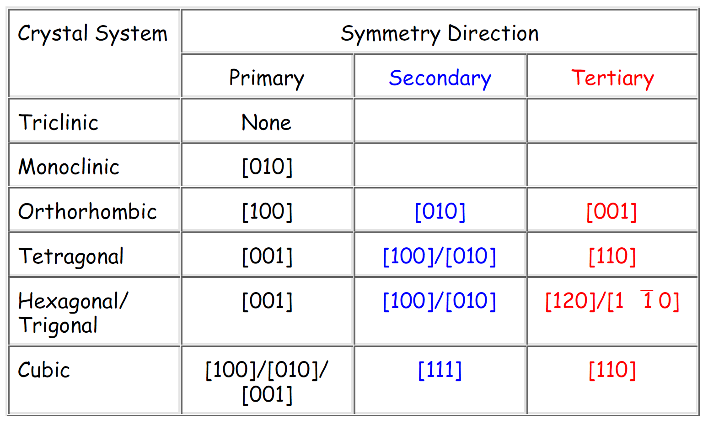

空间群符号去掉开头的字母（P、I、F、R等晶格类型）后，剩下的部分按“组”从左到右数：

- **第 1 组** = **初级（Primary）**

- **第 2 组** = **次级（Secondary）**

- **第 3 组** = **第三级（Tertiary）**

**关键规则（查表定位）**：  
这三组符号分别代表“往晶胞的哪个方向看”，具体取决于晶系：

| 晶系     | 初级（第1组）方向    | 次级（第2组）方向           | 第三级（第3组）方向  |
| ------ | ------------ | ------------------- | ----------- |
| **单斜** | 只看 [010]（b轴） | —                   | —           |
| **正交** | [100]（a轴）    | [010]（b轴）           | [001]（c轴）   |
| **四方** | [001]（c轴）    | [100] 或 [010]（a/b轴） | [110]（面对角线） |
| **立方** | [100]（a轴）    | [111]（体对角线）         | [110]（面对角线） |
比如`Ia3`，去掉 I，剩下a 和 $\bar{3}$ →只有两组。所以a是初级，$\bar{3}$是次级

| 你看到的符号 | 操作       | 具体操作                                                                                 |
| ------ | -------- | ------------------------------------------------------------------------------------ |
| 上横线    | 反轴（旋转反演） | “转完再倒立”：先按这个轴旋转，转完后穿过中心点翻个跟头（中心对称）。                                                  |
| 下脚标    | 螺旋轴      | “边转边滑”：像拧螺丝一样，旋转的同时沿轴向平移一段距离。   （脚标数字 ÷ 主数字 = 平移比例，如 2121​ 滑 1/2，4242​ 滑 2/4=1/2） |
| 斜杠     | 轴 / 垂直镜面 | “横切一刀”：斜杠前面的轴，垂直于后面的那面镜面（mm）。   （注意：它不是分数“四分之 m”，而是“垂直”的意思）                       |
| abc英文  | 滑移面      |                                                                                      |
利用国际表中的空间群信息，我们可以做许多事情。一个强大的用途是从简短描述生成完整的晶体结构。

比如$\rm Sr_2AlTaO_6$这个晶体，查表可得它是Fm-3m空间群，晶胞参数7.8 angstrom， 去数据库查询可知（https://cryst.ehu.es/cgi-bin/cryst/programs/nph-wp-list）：
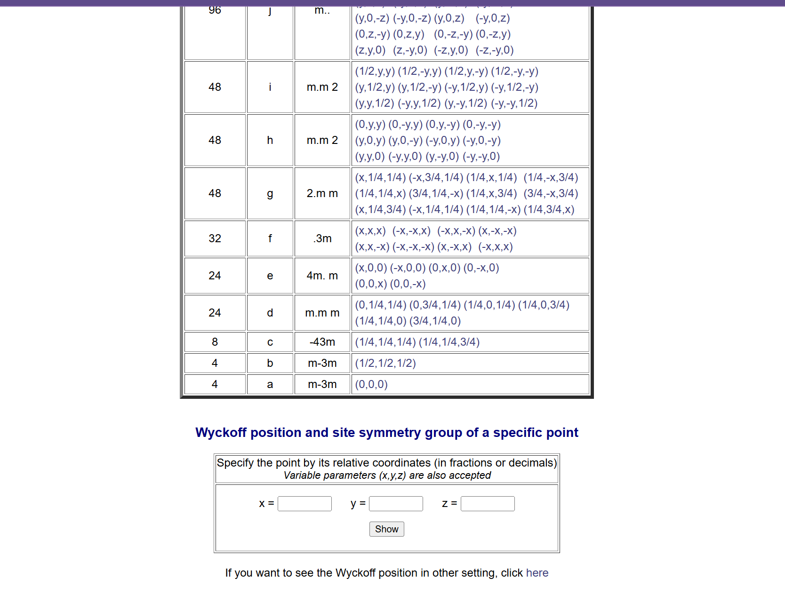
而在晶体中各个元素的Wyckoff位点如下（该信息通过XRD等实验获得）：
- Sr: 8c
- Al: 4a
- Ta: 4b
- O: 24e
Wyckoff 符号前面的数字，代表了“如果在单位晶胞里放入这个原子，通过对称操作一共能生成几个它”，也即==多重度==。所以，在一个完整的晶胞里，总共有 8 个 Sr、4 个 Al、4 个 Ta 和 24 个 O 。 把它们合起来，晶胞的真实化学式是 $\text{Sr}_8\text{Al}_4\text{Ta}_4\text{O}_{24}$。
有一个关键的结论：元素的原子总数 = 它占据的所有 Wyckoff 位置的多重度之和，不过，在这个高度对称的钙钛矿结构里面，每种元素只占据一个Wyckoff位点。那么会遇到两个问题：
- Al和Ta分别对应4a和4b位点中的哪一个呢？
- O在24e还是24d位置上呢？
答案是其实放哪都行，因为它们在物理上是完全等价的。得到了Wyckoff position，结合国际表中的信息最终可以退出所有坐标：
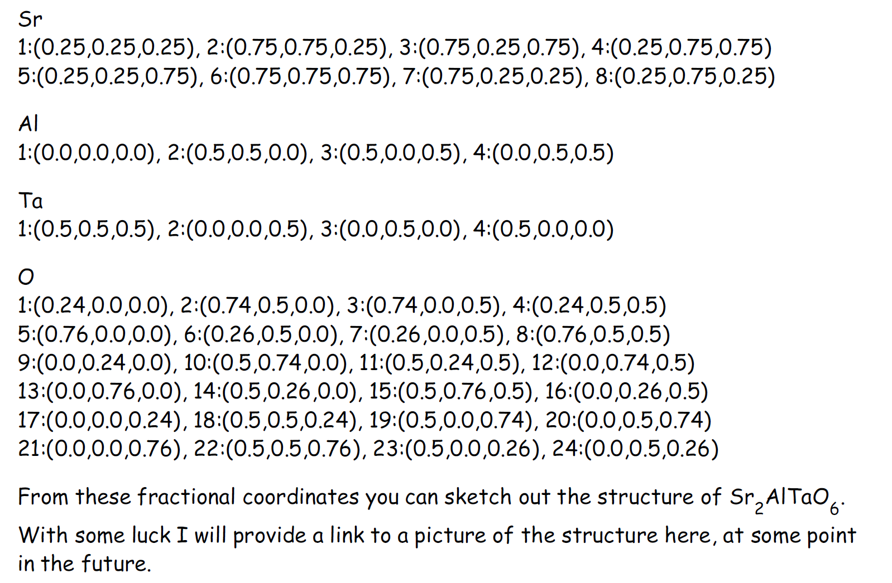
再看一个例子，钙钛矿结构的晶体$\rm SrTiO_3$，其空间群为Pm3m，查表信息如下：
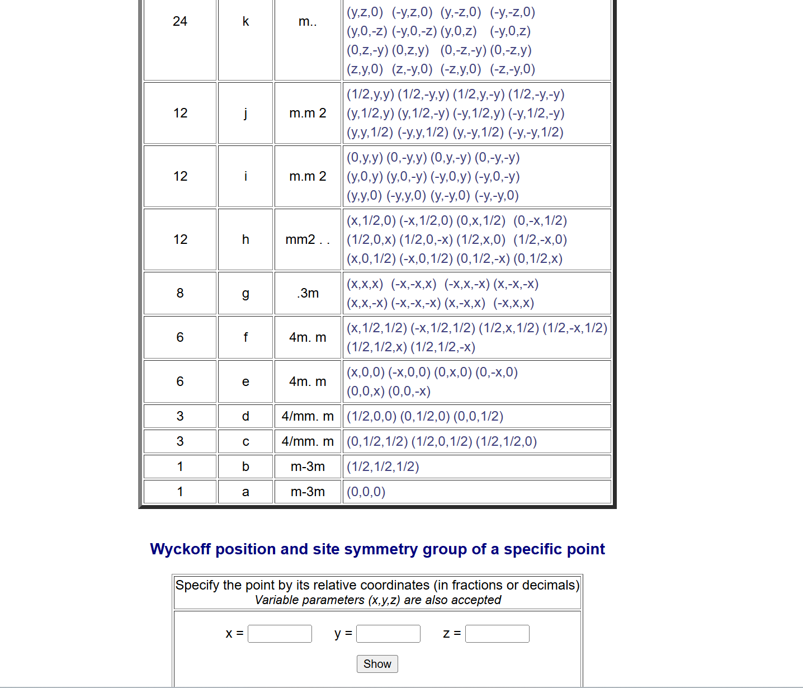
XRD等实验可以测出晶胞参数为3.90 angstrom，密度为5.1 g/cm$^3$，由此可以计算出晶胞体积，最终计算得出，一个晶胞的化学式正是$\rm SrTiO_3$，由此结合Wyckoff信息可以知道：
- Sr和Ti占据1a或者1b位置
- O占据3c或者3d位置
有多种==组合==，可以计算键长进行验证：
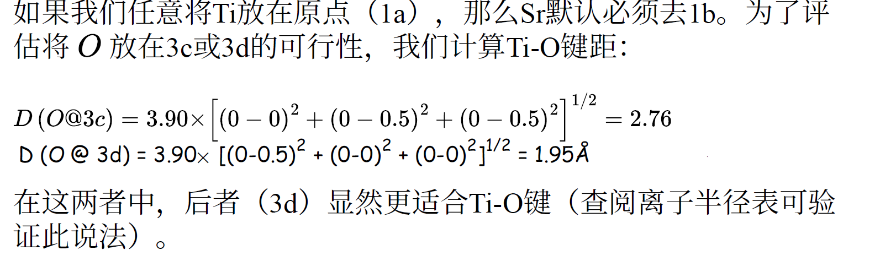

再看一个例子，Argyrodite型的固态电解质$\rm Li_6PS_5Cl$，结构从Materials Project获取，Materials Project也可以直接查到Wyckoff position：
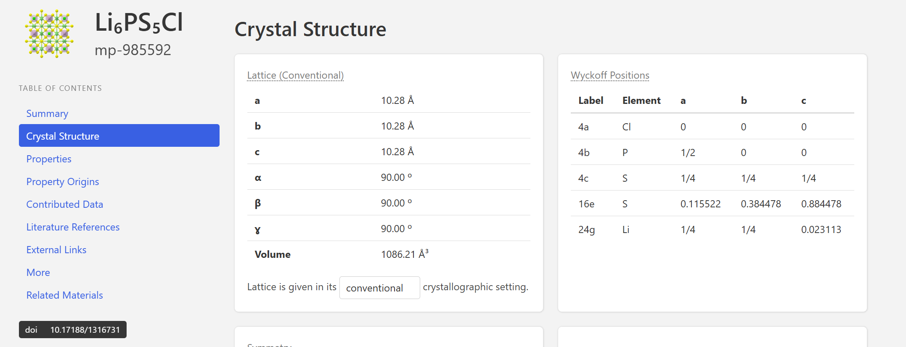
而**Bilbao Crystallographic Server**数据库里查到的信息如下：
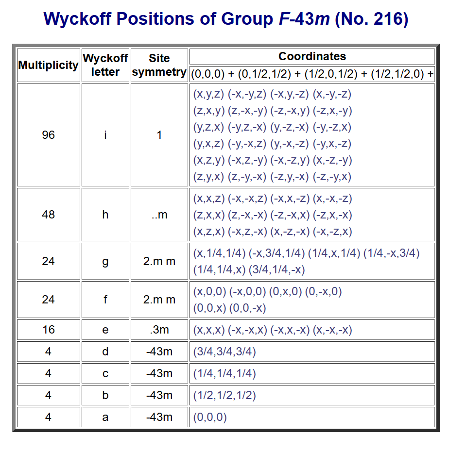
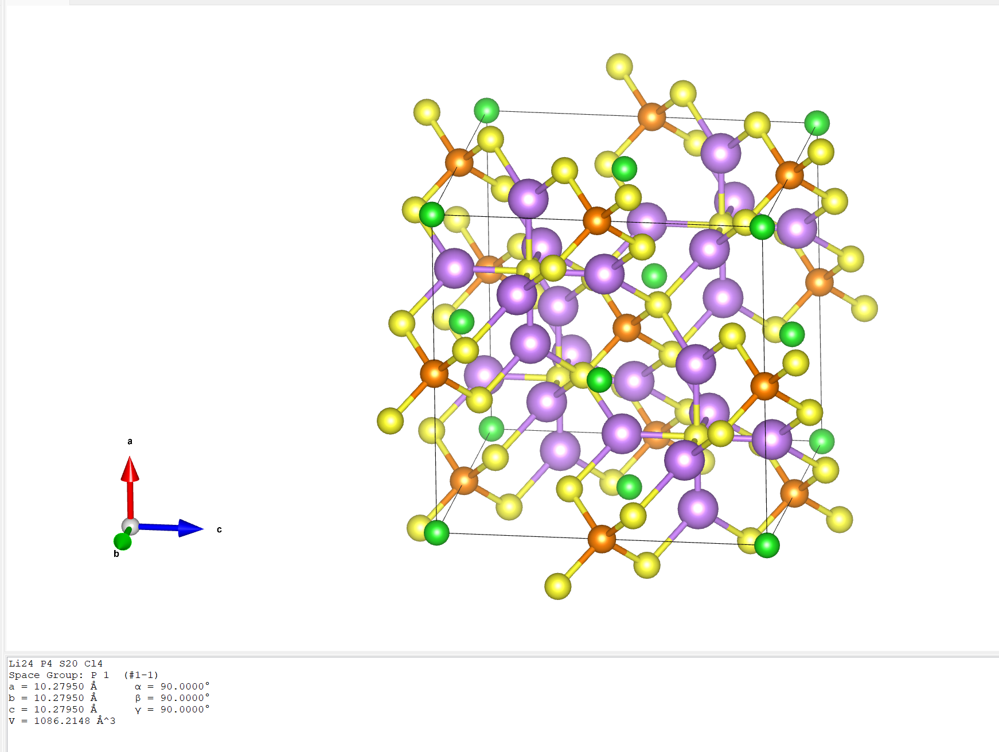
一个$\rm Li_6PS_5Cl$惯用晶胞里的真实结构是$\rm Li_{24}P_4S_{20}Cl_4$，再结合上述数据库中信息可以知道：
- 4个P占据在4a/b/c/d位点
- 20个S占据在16e位点和4a/b/c/d位点
- Li占据在24g/f位点
- Cl占据在4a/b/c/d位点

众多Wyckoff位点中，4a(顶点和面心)和4b（体心和棱心）相似，4c和4d（四面体空隙）相似

以上的推断完全来自于数学层面，再结合XRD等实验层面，如在晶体中存在这“$\rm PS_4^{3-}$”骨架，那么P分布在4a/b位点，而S分布在16e中。

Materials Project展示的只是一种结构，真实的$\rm Li_6PS_5Cl$，中Cl和S的位点是无序分布的，这并不是说实验合成的晶体"不纯净"。实验上可以合成出非常纯净、单一晶相的晶体。但是，==“宏观上的纯净单相”并不等于“微观上的原子绝对有序==，所以在纯相的晶体中S/Cl的位点分布依然是无序的。

目前读文献看的糊里糊涂的😢，我目前的认识如下：
- 1 个 $P$ (4b) 和 4 个 S (16e) 会通过强共价键死死抱在一起，形成$\rm PS_4^{3-}$
- 真正无序的部分：
	- 4个S分布在4a/c/d，4个Cl分布在4a/c/d，这是理论上的分布
	- 但是离子的空间位阻和热力学熵等因素会进一步给出答案
		- 4d通常为空，因为$\rm PS_4^{3-}$的空间取向使得4d周围的静电环境不适合放阴离子
		- 所以只剩下==4a和4c可用于混排Cl和S了==

## 输运性质

这部分内容应当不会感到陌生，之前也做过VASP的AIMD（虽然是失败的😢），毕业设计也做过UMA-MD，一些基本的概念大致有些了解，接下来温故一下。 

MD来获取固态电解质的输运性质的整套Workflow在前人的工作下已经比较明了了，参考18年的这篇高引文献：
- [ACS Appl. Energy Mater. 2018, 1, 3230−3242][https://pubs.acs.org/doi/10.1021/acsaem.8b00457]

仅依靠单次 MD 模拟原子轨迹，可定量提取 8 类关键微观扩散物理量，所有方法适配==全部晶态离子导体==：
- Vibrational Amplitude晶格振动幅度：
	- 在 MD 模拟过程中对所有感兴趣的原子进行上述操作，可以得到振动振幅的分布。通过对获得的分布拟合高斯函数，可以得到振动位移的标准差，从而提供晶体中平均振动振幅的估计。由于已知三维分布，也可以通过这种方式从MD模拟中确定各向异性振动振幅。
- attempt frequency尝试频率
- site occupations位点占有率
- jump rates跳跃速率
- correlation factor关联因子
- activation energy活化能
	- 描述扩散温度依赖性的一种简单方法是活化能，通常通过将阿伦尼乌斯方程拟合到不同温度下的扩散数据来获得。这一方法假设在拟合的温度范围内阿伦尼乌斯行为成立，即在所研究的温度范围内，决定扩散的材料性质保持不变。然而，这种假设往往并不正确，特别是在所研究的温度范围较大时。非阿伦尼乌斯行为通常会导致在室温下激活能的低估，如果使用高温的外推值的话。由于这种误差的大小取决于材料和外推的温度范围，因此很难准确判断误差有多大。
- collective jumps集体跳跃
- radial distribution functions径向分布函数

