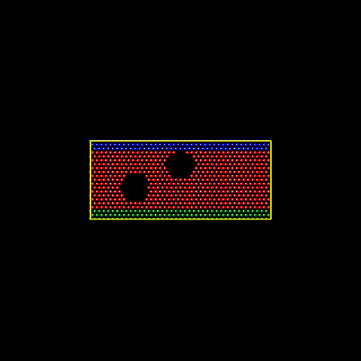

组里面偏向于固体材料这边，所以经典MD用的是Lammps而不是Gromacs（我猜的😢）

这还是第一次接触Lammps，记录一下。


## Lammps的编译安装

首先是软件安装这块。依旧是编译安装，有张破烂P104显卡就编译GPU版本了，这破烂GPU的PCIE带宽很低，双精度极弱，所以采用**GPU Package**的方案而不是**KOKKOS**。

参考的博文随便找了一篇：https://pa.ci/417.html
嘿，那个博主的硬件是GTX 1060，和P104的核心正好是Pascal架构的同一代的。


进行配置：
```bash
cmake ../cmake \
  -D CMAKE_BUILD_TYPE=Release \
  -D CMAKE_INSTALL_PREFIX=/home/storm/apps/lammps_installation \
  -D BUILD_SHARED_LIBS=on \
  -D LAMMPS_EXCEPTIONS=on \
  -D FFT=FFTW3 \
  -D BUILD_MPI=on -D BUILD_OMP=on \
  -D BLA_VENDOR=OpenBLAS \
  -D CMAKE_Fortran_COMPILER=gfortran \
  \
  -D PKG_GPU=on -D GPU_API=cuda -D GPU_ARCH=sm_61 \
  -D PKG_OPENMP=on -D PKG_OPT=on \
  \
  -D PKG_KSPACE=on \
  -D PKG_ELECTRODE=on \
  -D PKG_COLVARS=on \
  -D PKG_PYTHON=on \
  -D PKG_H5MD=on -D PKG_NETCDF=on \
  -D PKG_VORONOI=on \
  -D PKG_MISC=on -D PKG_COMPRESS=on \
  -D PKG_RIGID=on -D PKG_MOLECULE=on \
  -D PKG_MOLFILE=on \
  -D BIN2C=/usr/local/cuda/bin/bin2c
```

然后开始编译：
```bash
make -j48
```
然后安装：
```bash
make install
```
然后加入环境变量：
```bash
export PATH=/home/storm/apps/lammps_installation/bin:$PATH
```
设置lmp动态库：
```bash
echo '/home/storm/apps/lammps_installation/lib64' | sudo tee /etc/ld.so.conf.d/lammps.conf
```
然后可以检查一下是否安装正常：
```bash
storm@WOL-142:~/apps/lammps_installation/lib64$ sudo ldconfig
storm@WOL-142:~/apps/lammps_installation/lib64$ which lmp
~/apps/lammps_installation/bin/lmp
storm@WOL-142:~/apps/lammps_installation/lib64$ lmp -help | head n 1
head: 无法以读模式打开 'n': 没有那个文件或目录
head: 无法以读模式打开 '1': 没有那个文件或目录
storm@WOL-142:~/apps/lammps_installation/lib64$ lmp -help

Large-scale Atomic/Molecular Massively Parallel Simulator - 22 Jul 2025 - Update 4
Git info (stable / stable_22Jul2025_update4)

Usage example: lmp -var t 300 -echo screen -in in.alloy

List of command-line options supported by this LAMMPS executable:

-echo none/screen/log/both  : echoing of input script (-e)
-help                       : print this help message (-h)
-in none/filename           : read input from file or stdin (default) (-i)
-kokkos on/off ...          : turn KOKKOS mode on or off (-k)
-log none/filename          : where to send log output (-l)
-mdi '<mdi flags>'          : pass flags to the MolSSI Driver Interface
-mpicolor color             : which exe in a multi-exe mpirun cmd (-m)
-cite                       : select citation reminder style (-c)
-nocite                     : disable citation reminder (-nc)
-nonbuf                     : disable screen/logfile buffering (-nb)
-package style ...          : invoke package command (-pk)
-partition size1 size2 ...  : assign partition sizes (-p)
-plog basename              : basename for partition logs (-pl)
-pscreen basename           : basename for partition screens (-ps)
-restart2data rfile dfile ... : convert restart to data file (-r2data)
-restart2dump rfile dgroup dstyle dfile ...
                            : convert restart to dump file (-r2dump)
-restart2info rfile         : print info about restart rfile (-r2info)
-reorder topology-specs     : processor reordering (-r)
-screen none/filename       : where to send screen output (-sc)
-skiprun                    : skip loops in run and minimize (-sr)
-suffix gpu/intel/kk/opt/omp: style suffix to apply (-sf)
-var varname value          : set index style variable (-v)

OS: Linux "Rocky Linux 10.2 (Red Quartz)" 6.12.0-211.22.1.el10_2.x86_64 x86_64

Compiler: GNU C++ 14.3.1 20251022 (Red Hat 14.3.1-4) with OpenMP 4.5
C++ standard: C++17
Embedded fmt library version: 10.2.0
```
至此，安装完成


## Lammps学习

### 关于脚本

举个例子：
```lammps
variable x equal (xlo+xhi)2 + sqrt(v_area)
region 1 block $X 2 INF INF EDGE EDGE
```
- 定义变量x
- $X传递变量
- v_使用于**定义变量的表达式中**
等价于：
```lammps
region 1 block $((xlo+xhi)2+sqrt(v_area)) 2 INF INF EDGE EDGE
```
- region命令的参数位置不解析数学表达式，所以不可以写成`region 1 block (xlo+xhi)2+sqrt(v_area) 2 INF INF EDGE EDGE`
格式化输出：
```lammps
print "Final energy per atom: $(pe/atoms:%10.3f) eV/atom"
```
- pe和atoms都是内置关键词，核心计算命令是pe/atoms
- print命令的参数位置估计也不解析数学表达式，所以也用的$
- :%10.3f是C语言的格式解析
`$`不可以嵌套但可以和`v`搭配:
```lammps
print    "B2 = $(v_x-1.0)"
```


一个Lammps的输入脚本分四个部分：
- 初始化
	- units
	- dimension
	- boundary
	- atom_style
	- bond_style
	- pair_style
	- dihedral_style
- 体系定义
	- read_data
	- read_restart
		- lattice, region, create_box, create_atoms
- 设置
	- pair/angle/dihedral/improper_coeff
	- special_bonds
	- neighbor
	- fix
	- compute
- 运行
	- minimize
	- run
以下输入文件是一个高分子拉伸的例子：
```lammps
# Initialization
units		real   # 指定系统采取的单位,（距离 Å，时间 fs，能量 kcal/mol，温度 K，压力 atm）
boundary	p p p   # 指定边界条件，p即周期性边界条件
atom_style	molecular   # 指定粒子类型

# Data reading
read_data	polymer.data   # 读入模型信息

# Setting->Atom definition
bond_style      harmonic   # 类型
bond_coeff	1 350 1.53   # 势函数参数
angle_style     harmonic  
angle_coeff	1 60 109.5
dihedral_style	multi/harmonic
dihedral_coeff	1 1.73 -4.49 0.776 6.99 0.0
pair_style	lj/cut 10.5
pair_coeff	1 1 0.112 4.01 10.5

#####################################################
# Setting->system definition
velocity 	all create 500.0 1231   # 给定初始化速度
fix		1 all npt temp 500.0 500.0 50 iso 0 0 1000 drag 2   # 设置NPT系综，设定温度
thermo_style	custom step temp press
thermo          100   # 输出热力学参数
timestep	0.5   # 时间步长
run		50000   # 运行总步数
unfix 1   # 取消设定
unfix 2
write_restart 	restart.dreiding2   # 输出重启文件
```

以下是data的例子：
```lammps
# Model for PE   # 描述，不可少

     10000     atoms   # 原子总数
      9990     bonds   # 键总数
      9980     angles   # 键角总数
      9970     dihedrals    # 二面角总数

         1     atom types   # 原子类型数
         1     bond types
         1     angle types
         1     dihedral types

    0.0000   80.0586 xlo xhi   # 盒子的起止位置，指明大小
    0.0000   80.0586 ylo yhi
    0.0000   80.0586 zlo zhi

Masses   # 原子质量：

         1          14.02

Atoms   # 原子信息：atom-id molecule-id type-id x y z

         1         1         1    8.6550   61.6668    5.4094
         2         1         1    8.6550   60.5849    6.4912
         3         1         1    7.5731   59.5030    6.4912
         4         1         1    6.4912   60.5849    6.4912

Bonds    # 键接信息：bond-id，bond-type，id为1的原子和2相连

         1         1         1         2
         2         1         2         3
         3         1         3         4

Angles   # 键角信息

         1         1         1         2         3
         2         1         2         3         4

ihedrals    # 二面角信息

         1         1         1         2         3         4
```

### 基本计算
使用MPI并行：
```bash
mpirun -np 4 lmp -in in.melt
```

就用源码里的例子吧，官方的命名为in.file，命名估计没啥要求，用`-in`传入就好，不像`Gaussian`通常命名为`.gjf`。
先看看输入文件的内容吧：
```lammps
# 3d Lennard-Jones melt

units           lj  #使用Lennard-Jones约化单位
atom_style      atomic

lattice         fcc 0.8442
region          box block 0 10 0 10 0 10
create_box      1 box
create_atoms    1 box
mass            1 1.0

velocity        all create 3.0 87287 loop geom

pair_style      lj/cut 2.5
pair_coeff      1 1 1.0 1.0 2.5

neighbor        0.3 bin
neigh_modify    every 20 delay 0 check no

fix             1 all nve

#dump           id all atom 50 dump.melt

#dump           2 all image 25 image.*.jpg type type &
#               axes yes 0.8 0.02 view 60 -30
#dump_modify    2 pad 3

#dump           3 all movie 25 movie.mpg type type &
#               axes yes 0.8 0.02 view 60 -30
#dump_modify    3 pad 3

thermo          50
run             250
```
我自己也添加了相应的注释，看不太懂，以下是运行结果

```
storm@WOL-142:~/apps/lammps/examples/melt$ mpirun -np 4 lmp -in in.melt
LAMMPS (22 Jul 2025 - Update 4)
OMP_NUM_THREADS environment is not set. Defaulting to 1 thread.
  using 1 OpenMP thread(s) per MPI task
Lattice spacing in x,y,z = 1.6795962 1.6795962 1.6795962
Created orthogonal box = (0 0 0) to (16.795962 16.795962 16.795962)
  1 by 2 by 2 MPI processor grid
Created 4000 atoms
  using lattice units in orthogonal box = (0 0 0) to (16.795962 16.795962 16.795962)
  create_atoms CPU = 0.002 seconds
Generated 0 of 0 mixed pair_coeff terms from geometric mixing rule
Neighbor list info ...
  update: every = 20 steps, delay = 0 steps, check = no
  max neighbors/atom: 2000, page size: 100000
  master list distance cutoff = 2.8
  ghost atom cutoff = 2.8
  binsize = 1.4, bins = 12 12 12
  1 neighbor lists, perpetual/occasional/extra = 1 0 0
  (1) pair lj/cut, perpetual
      attributes: half, newton on
      pair build: half/bin/atomonly/newton
      stencil: half/bin/3d
      bin: standard
Setting up Verlet run ...
  Unit style    : lj
  Current step  : 0
  Time step     : 0.005
Per MPI rank memory allocation (min/avg/max) = 2.706 | 2.706 | 2.706 Mbytes
   Step          Temp          E_pair         E_mol          TotEng         Press
         0   3             -6.7733681      0             -2.2744931     -3.7033504
        50   1.6842865     -4.8082494      0             -2.2824513      5.5666131
       100   1.6712577     -4.7875609      0             -2.281301       5.6613913
       150   1.6444751     -4.7471034      0             -2.2810074      5.8614211
       200   1.6471542     -4.7509053      0             -2.2807916      5.8805431
       250   1.6645597     -4.7774327      0             -2.2812174      5.7526089
Loop time of 0.182781 on 4 procs for 250 steps with 4000 atoms

Performance: 590871.683 tau/day, 1367.759 timesteps/s, 5.471 Matom-step/s
99.1% CPU use with 4 MPI tasks x 1 OpenMP threads

MPI task timing breakdown:
Section |  min time  |  avg time  |  max time  |%varavg| %total
---------------------------------------------------------------
Pair    | 0.13625    | 0.13782    | 0.14071    |   0.5 | 75.40
Neigh   | 0.022278   | 0.02252    | 0.023054   |   0.2 | 12.32
Comm    | 0.01551    | 0.018861   | 0.020667   |   1.5 | 10.32
Output  | 0.00010093 | 0.00013074 | 0.00016838 |   0.0 |  0.07
Modify  | 0.0021365  | 0.0021815  | 0.00227    |   0.1 |  1.19
Other   |            | 0.001264   |            |       |  0.69

Nlocal:           1000 ave        1008 max         987 min
Histogram: 1 0 0 0 0 0 1 0 1 1
Nghost:        2711.25 ave        2728 max        2693 min
Histogram: 1 0 0 0 0 2 0 0 0 1
Neighs:          37947 ave       38966 max       37338 min
Histogram: 1 1 0 1 0 0 0 0 0 1

Total # of neighbors = 151788
Ave neighs/atom = 37.947
Neighbor list builds = 12
Dangerous builds not checked
Total wall time: 0:00:00
```

还是非常困惑，尝试从官方推荐的学习资料着手。

#### Ex1
编辑`/lammps/examples/obstacle`，取消注释
```lammps
#dump           1 all atom 100 dump.obstacle

dump           2 all image 500 image.*.pgm type type &
#               zoom 1.6 adiam 1.5
dump_modify    2 pad 5

#dump           3 all movie 500 movie.mpg type type &
#               zoom 1.6 adiam 1.5
#dump_modify    3 pad 5
```
然后使用image magic将图片可以转化为视频：

虽然不知道这是干嘛的

#### Ex2 使用L-J势模拟裂纹的扩展
输入文件如下：
```lammps
# 2d lj crack simulation(问题的基本初始化)
dimension  2
boundary  s s p
atom_style  atomic
neighbor  0.3 bin #bin表示为近邻表类型
neigh_modify  delay 5 #间隔多少载荷步重新形成近邻表

# create geometry创建初始几何构形
lattice  hex 0.93
region  box block 0 100 0 40 -0.25 0.25
create_box  5   box #在指定区域建立一个simulation box,5表示原子类型的种类数
create_atoms  1  box #在simulation box中创建类型为1的原子（原子位置初始化）
mass  1 1.0
mass  2 1.0
mass  3 1.0
mass  4 1.0
mass  5 1.0


# lj potentials(指定原子作用势)
pair_style  lj/cut 2.5 #指定lj势，截断半径为2.5
pair_coeff * * 1.0 1.0 2.5 #指定lj势参数

# define groups（便于加载）

region  1 block inf inf inf 1.25 inf inf
group  lower region 1 #定义lower组（便于施加外加速度）

region 2 block inf inf 38.75 inf inf inf
group upper region 2 #定义upper组（便于施加外加速度）
group boundary union lower upper #定义总边界组
group mobile subtract all boundary #定义可动原子组（便于统计温度）

region  leftupper block inf 20 20 inf inf inf
region  leftlower block inf 20 inf 20 inf inf
group  leftupper region leftupper
group  leftlower region leftlower #定义左上、左下原子组（便于指定裂纹的存在）
set  group leftupper type 2
set  group leftlower type 3
set  group lower type 4
set  group upper type 5 #指定原子类型（便于指定裂纹的存在）

# initial velocities初始化速度
compute  new mobile temp #定义温度的计算（可动区域内统计平均）
compute new2 mobile stress/atom #定义原子应力的计算（整个区域）
velocity mobile create 0.01 887723 temp new #按指定的温度（0.01）计算方法，初始化原子的速度
velocity upper set 0.0 0.3 0.0 #upper原子组y方向的速度为0.3
velocity mobile ramp vy 0.0 0.3 y 1.25 38.75 sum yes #mobile原子的速初始度从0到0.3线性变化

# fixes施加约束
fix 1 all nve #nve系综的积分算法
fix 2 boundary setforce null 0.0 0.0 #边界boundary上力条件，钢化原子，便于加载！！

# run运行计算
timestep  0.003 #时间间隔步
thermo  200 #每200步输出热动力学统计量
thermo_modify  temp new #计算温度通过new指示的方法计算
neigh_modify exclude type 2 3 #原子2，3之间作用取消（也就是通过不使他们在近邻表中出现实现）
dump 1 all atom 500 dump.crack #每隔500步将原子信息写入文件dump.crack
dump 2 mobile custom 500 dump2.crack tag x y z c_new2[2]
run  5000 #进行5000步的模拟
```

在经典 MD 中，计算力最耗时。如果每个原子都去和体系里所有的原子算一次力，计算量是平方级增长的。因此，LAMMPS 引入了“截断半径 (Cutoff)”的概念——距离太远的原子之间引力极弱，直接忽略不计。
- **近邻 (Neighbor)**：是指在截断半径稍微向外扩展一点的范围（截断半径 + skin 距离）内的所有原子。
- `Neighbor 0.3 bin`：这里的 `0.3` 就是 skin 距离。意思是在截断半径 2.5 的基础上，额外包络一个 0.3 的缓冲层。`bin` 是一种把空间划分为网格来快速寻找近邻原子的算法
- **近邻表 (Neighbor list)**：就是每个原子手里拿着的一份“通讯录”，上面记录了此刻在它附近（Cutoff + skin 范围内）的原子编号。它只需要和通讯录上的人计算作用力。
- **载荷步 (Timestep/Step)**：原子在运动，通讯录是会过期的（有的原子跑远了，有的跑近了）。`neigh_modify delay 5` 意思是每隔 5 个步长（即时间步，也即载荷步），就重新检查并更新一次所有的通讯录。
