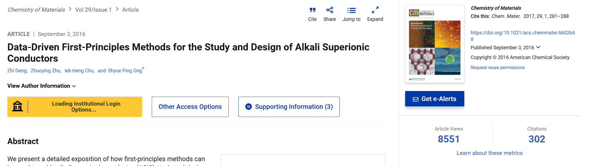
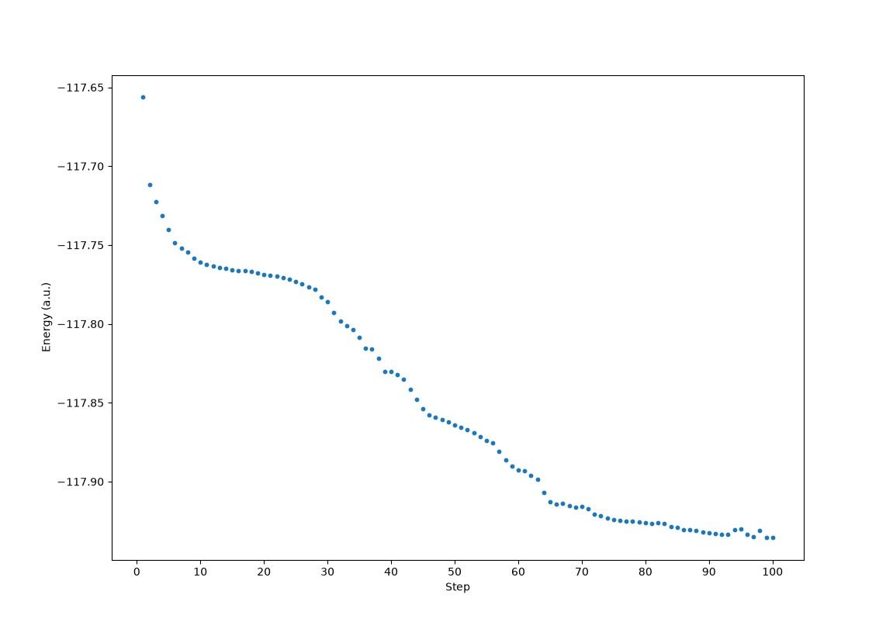
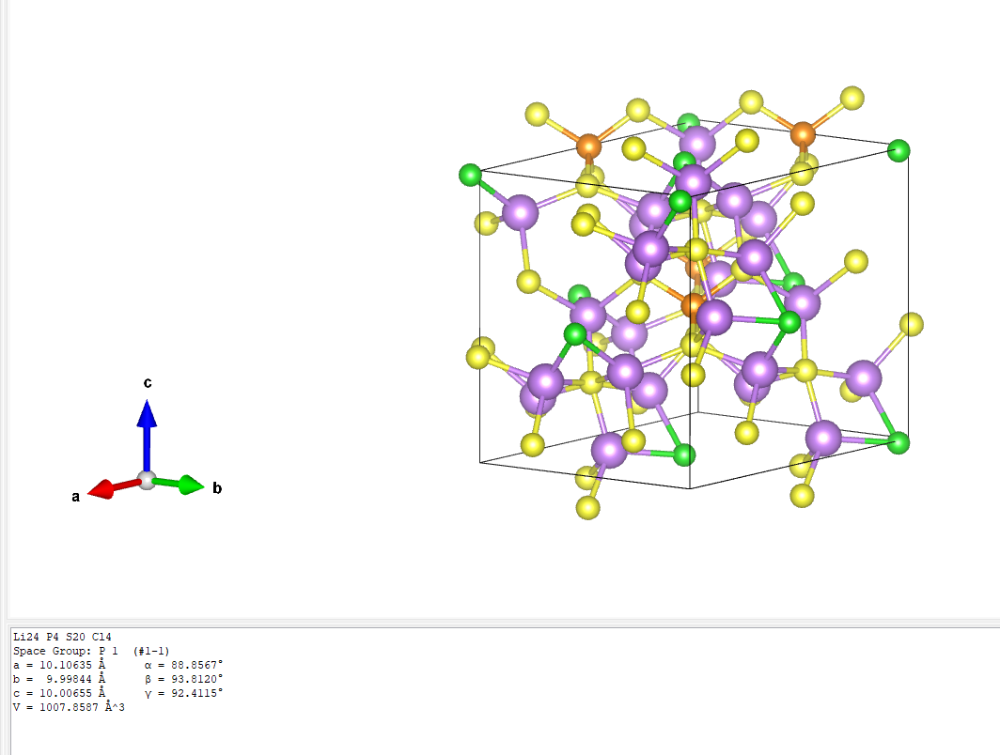
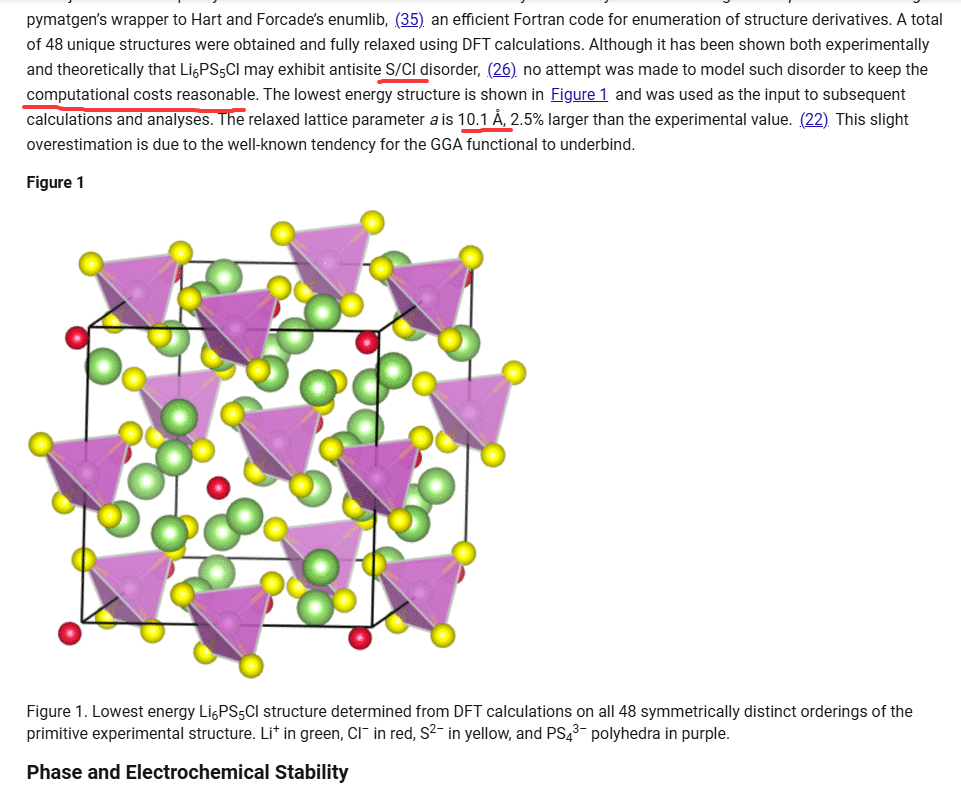
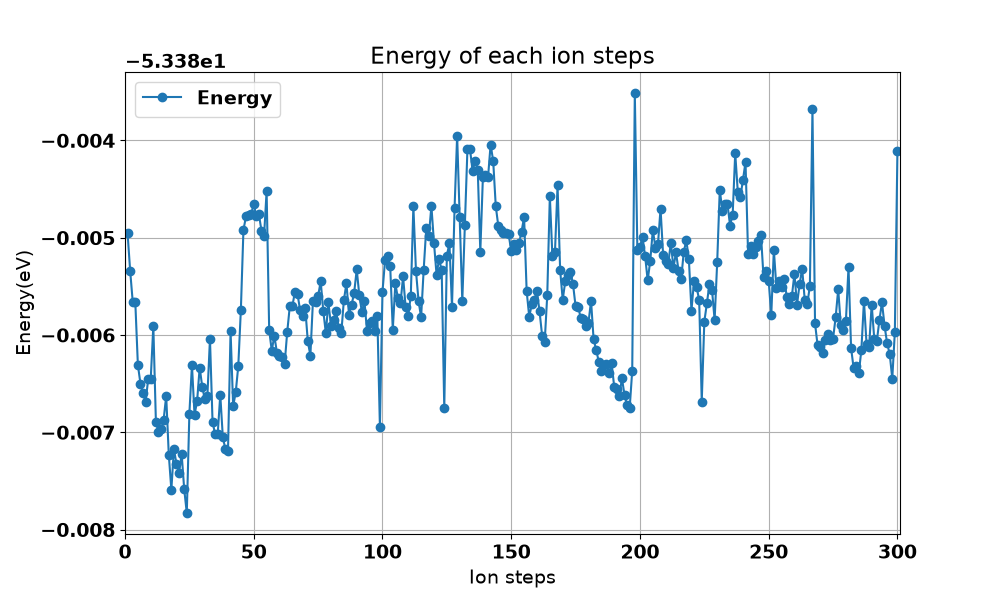
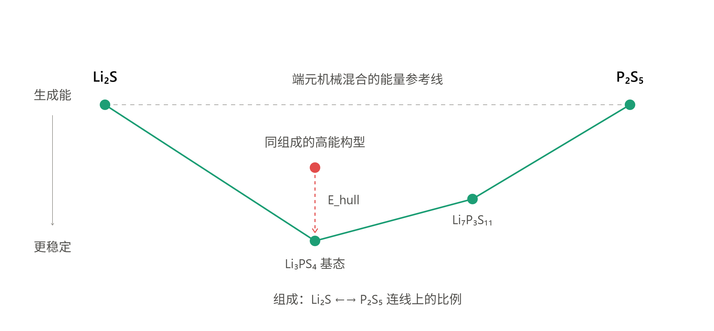
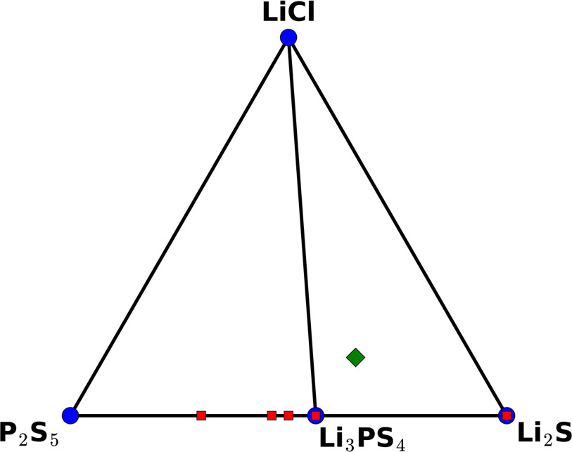
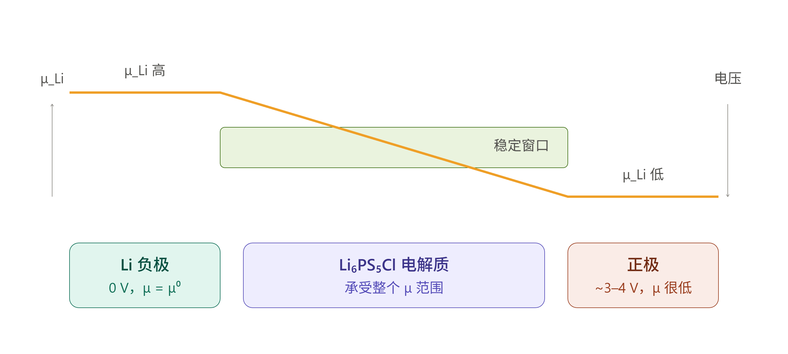
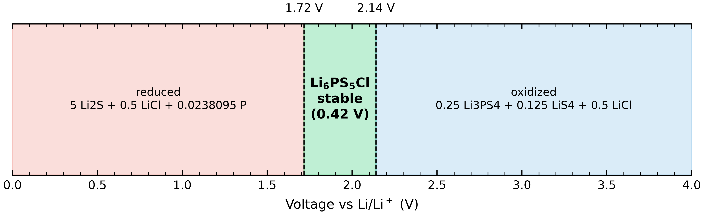
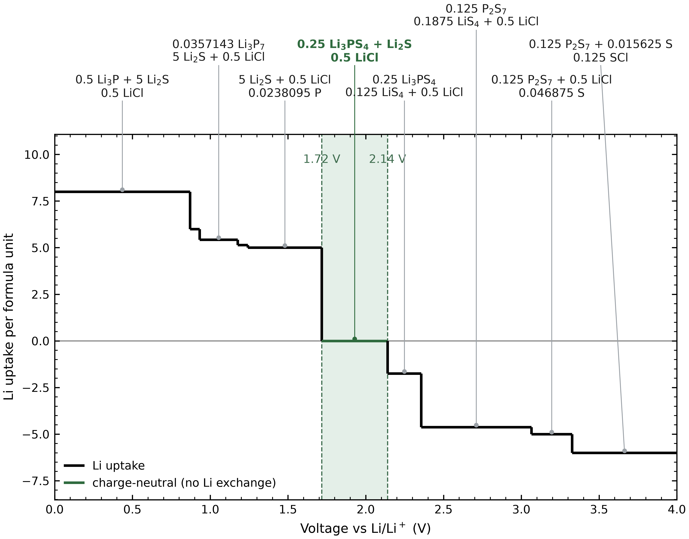

需要复现的文献是[Data-Driven First-Principles Methods for the Study and Design of Alkali Superionic Conductors][https://pubs.acs.org/doi/10.1021/acs.chemmater.6b02648]


## 结构筛选

### Li空位混排结构生成
这里有必要先了解一下`.cif`文件，从补充材料里面可以获取到，作者说是从ICSD数据中获得的，但是约10年过去了，我在ICSD中没有检索到这个结构，其中的最后几行是这样的：
```cif
_atom_site_label
_atom_site_type_symbol
_atom_site_symmetry_multiplicity
_atom_site_Wyckoff_symbol
_atom_site_fract_x
_atom_site_fract_y
_atom_site_fract_z
_atom_site_B_iso_or_equiv
_atom_site_occupancy
_atom_site_attached_hydrogens
Li1 Li1+ 48 h 0.3148(19) 0.018(4) 0.6852(19) 0.104(14) 0.56(6) 0
Cl1 Cl1- 4 a 0. 0. 1. 0.0402(9) 1 0
S1 S2- 4 d 0.25 0.25 0.75 0.0303(8) 1 0
P1 P5+ 4 b 0. 0. 0.5 0.0273(9) 1 0
S2 S2- 16 e 0.11947(13) -0.11947(13) 0.61947(13) 0.0421(7) 1 0
loop_
_atom_site_aniso_label
_atom_site_aniso_type_symbol
_atom_site_aniso_U_11
_atom_site_aniso_U_22
_atom_site_aniso_U_33
_atom_site_aniso_U_12
_atom_site_aniso_U_13
_atom_site_aniso_U_23
Cl1 Cl1- 0.0402(9) 0.0402(9) 0.0402(9) 0. 0. 0.
S1 S2- 0.0303(8) 0.0303(8) 0.0303(8) 0. 0. 0.
P1 P5+ 0.0273(9) 0.0273(9) 0.0273(9) 0. 0. 0.
S2 S2- 0.0421(7) 0.0421(7) 0.0421(7) 0.0080(5) -0.0080(5) 0.0080(5)
#End of TTdata_418490-ICSD
```
可以看到：`Li1 Li1+ 48 h 0.3148(19) 0.018(4) 0.6852(19) 0.104(14) 0.56(6) 0`
- 元素标签为Li，且只有一种锂离子
- 原子类型符号为锂离子
- Wyckoff位点为h，对称性多重度是48
- 距离原点的方向的投影到xyz轴上的距离分别是0.3148 a、0.018 a、0.6852 a
- 原子位移参数为0.104表明锂离子的迁移性较高
- 48 h的位点占据率
同时从以上信息也可以看出，在这样一份CIF文件中的Cl、S是有序排布的，即：
- Cl和P只有一种，atom_site_occupancy为1
- S有两种，分别分布在4d和16e上，但两种情况的atom_site_occupancy也为1

文档用的方法是`pymatgen+enumlib`枚举出全部Li占位对称构型（共 48 个），我也尝试复现，🐱喵的，enumlib是用Fortran写的，PyPi上似乎没有相关的轮子，不得已从`uv`环境转向`conda`，把这个库整进了`xtalkit`工具箱里：
- https://github.com/hydrogen1222/xtalkit

从 ICSD（编号 418490）获得的初始结构是一个常规的立方 F4̅3m 单元格，其化学式为$\rm Li_{6.72}PS_5Cl$，即锂过量。为了获得计量学上电荷平衡的$\rm Li_6PS_5Cl$，将Li 48h位点的占据数调整为0.5后进行枚举。

对最终筛选出的48个结构进行计算，然后筛选出最低的能量的结构

作者的弛豫几乎可以肯定走的是 **Materials Project 标准设置(MPRelaxSet)**,而 MP 的标准弛豫就是 **ISIF=3 全弛豫(胞+离子一起放开)**，所以接下来的弛豫也是变胞优化。

开始的时候集群连不上了，就想着在自己的小破烂工作站上用cp2k算。

首先尝试的`GFN-xtb2`方法，直接计算的能量，算得非常快，使用命令`awk '$1=="CP2K"{t=$NF} END{print t" s"}'`并嵌套循环来查看时间：
```bash
storm@WOL-142:~/work/Li6PS5Cl_clean_enum$ for d in */; do echo -n "$d "; awk '$1=="CP2K"{t=$NF} END{print t" s"}' "$d"cp2k.out 2>/dev/null; done
Li6PS5Cl_clean_000/ 0.658 s
Li6PS5Cl_clean_001/ 0.616 s
Li6PS5Cl_clean_002/ 0.698 s
Li6PS5Cl_clean_003/ 0.681 s
Li6PS5Cl_clean_004/ 0.633 s
Li6PS5Cl_clean_005/ 0.619 s
Li6PS5Cl_clean_006/ 0.703 s
Li6PS5Cl_clean_007/ 0.614 s
Li6PS5Cl_clean_008/ 0.637 s
Li6PS5Cl_clean_009/ 0.626 s
Li6PS5Cl_clean_010/ 0.645 s
Li6PS5Cl_clean_011/ 0.641 s
Li6PS5Cl_clean_012/ 0.635 s
Li6PS5Cl_clean_013/ 0.620 s
Li6PS5Cl_clean_014/ 0.627 s
Li6PS5Cl_clean_015/ 0.630 s
Li6PS5Cl_clean_016/ 0.630 s
Li6PS5Cl_clean_017/ 0.654 s
Li6PS5Cl_clean_018/ 0.610 s
Li6PS5Cl_clean_019/ 0.652 s
Li6PS5Cl_clean_020/ 0.626 s
Li6PS5Cl_clean_021/ 0.615 s
Li6PS5Cl_clean_022/ 0.645 s
Li6PS5Cl_clean_023/ 0.615 s
Li6PS5Cl_clean_024/ 0.668 s
Li6PS5Cl_clean_025/ 0.638 s
Li6PS5Cl_clean_026/ 0.636 s
Li6PS5Cl_clean_027/ 0.645 s
Li6PS5Cl_clean_028/ 0.645 s
Li6PS5Cl_clean_029/ 0.638 s
Li6PS5Cl_clean_030/ 0.641 s
Li6PS5Cl_clean_031/ 0.646 s
Li6PS5Cl_clean_032/ 0.663 s
Li6PS5Cl_clean_033/ 0.651 s
Li6PS5Cl_clean_034/ 0.650 s
Li6PS5Cl_clean_035/ 0.606 s
Li6PS5Cl_clean_036/ 0.625 s
Li6PS5Cl_clean_037/ 0.619 s
Li6PS5Cl_clean_038/ 0.616 s
Li6PS5Cl_clean_039/ 0.617 s
Li6PS5Cl_clean_040/ 0.643 s
Li6PS5Cl_clean_041/ 0.627 s
Li6PS5Cl_clean_042/ 0.627 s
Li6PS5Cl_clean_043/ 0.614 s
Li6PS5Cl_clean_044/ 0.609 s
Li6PS5Cl_clean_045/ 0.621 s
Li6PS5Cl_clean_046/ 0.620 s
Li6PS5Cl_clean_047/ 0.619 s
```
对能量进行排序并取能量最低的几个：
```bash
storm@WOL-142:~/work/Li6PS5Cl_clean_enum$ for d in */; do echo -n "$d "; grep "ENERGY| Total FORCE_EVAL" "$d"cp2k.out 2>/dev/null | tail -1 | awk '{print $9}'; done | sort -n -k 2
Li6PS5Cl_clean_024/ -25.581704847897377
Li6PS5Cl_clean_026/ -25.558505677395466
Li6PS5Cl_clean_025/ -25.554959138803493
Li6PS5Cl_clean_020/ -25.534576703021653
Li6PS5Cl_clean_022/ -25.531810382198390
```
使用`grep "SCF run NOT converged" */cp2k.out`命令确认48次计算均SCF收敛。

### cp2k下的DFT计算
后续做了一次PBE泛函下的计算，基组和赝势分别是DZVP-MOLOPT-PBE-GTH、GTH-PBE，发现耗时完全可接受，于是进行批量的变胞优化cell optimization，计算完毕，平均每个任务十分钟左右。

完整的 cp2k 输入文件示例：[下载 Li6PS5Cl_cp2k.inp](文献复现（一）/Li6PS5Cl_cp2k.inp)
对于几何优化任务，使用`grep "GEOMETRY OPTIMIZATION COMPLETED" */cp2k.out`查看是否收敛，只有一个047这一个结构正常收敛，看了一下收敛曲线，没有出现明显的震荡，似乎是默认的100步太少了，尝试增大离子步继续算。

很遗憾，增加到250步仍有32个结构未能收敛，需要手动介入处理一下，将收敛的16个结构和32个未收敛的结构分类。

首先测试一下截断能`CUTOFF`参数，取一个已经收敛的结构进行计算，任务类型为`ENERGY+FORCE`，逐一升高截断能，CUTOFF=400,500,600,700 。结果表明，最优的截断能是600 Ry，哈~这下48个结构得再计算一遍了。。。

对于未收敛的32个烂结构，稳健一点，先进行GEO_OPT几何优化。不变胞的优化结束，有4个结构未收敛，在此基础上32个结构继续变胞优化


对于已经收敛的16个结构，为了保持截断能一致，也载入`.restart`文件再用CUTOFF=60再跑一次


本身不太熟悉并且很久不用cp2k了，犯了比较严重的错误，所有的计算都是在GAMMA点下进行的，我说我这小破机器怎么算这么快呢😂。。。

#### cp2k正式计算

首先进行收敛性测试：
```bash
(LPSC-again) storm@WOL-142:~/work/LPSC-again$ python gen_conv_test.py parse conv_cutoff

参数                      总能(Ha)    ΔE vs最密(meV/atom?)        应力1/3迹     最大力(a.u.)
----------------------------------------------------------------------------------
cut_1000
cut_300          -117.81555265                -30.95    30225.6358       0.06970
cut_400          -117.81445451                 -1.07    28816.1162       0.06970
cut_500          -117.81441572                 -0.02    28740.4356       0.06970
cut_600          -117.81441530                 -0.01    28738.9781       0.06970
cut_700          -117.81441508                  0.00    28738.7010       0.06970
cut_800          -117.81441509                  0.00    28738.7170       0.06970
cut_900          -117.81441509                  0.00    28738.7352       0.06970
----------------------------------------------------------------------------------
看 ΔE、应力1/3迹、最大力 从哪一行起基本不再变,就取那个参数(应力通常最晚收敛)。
ΔE 列是相对最密那次的'总能差';同一结构原子数相同,除以原子数即 meV/atom。
(LPSC-again) storm@WOL-142:~/work/LPSC-again$ python gen_conv_test.py parse conv_kmesh

参数                      总能(Ha)    ΔE vs最密(meV/atom?)        应力1/3迹     最大力(a.u.)
----------------------------------------------------------------------------------
k_111            -117.68158498               3625.69    61803.0948       0.07172
k_222            -117.81661272                -48.60    28029.5373       0.06963
k_333            -117.81441530                 11.19    28738.9781       0.06970
k_444            -117.81483991                 -0.36    28595.7029       0.06961
k_555            -117.81482187                  0.13    28603.3939       0.06961
k_666            -117.81482688                 -0.01    28601.3305       0.06961
k_777            -117.81482664                  0.00    28601.4475       0.06961
----------------------------------------------------------------------------------
看 ΔE、应力1/3迹、最大力 从哪一行起基本不再变,就取那个参数(应力通常最晚收敛)。
ΔE 列是相对最密那次的'总能差';同一结构原子数相同,除以原子数即 meV/atom。
```
最终统一使用555的k点，使用600Ry截断能，直接进行变胞优化，所有任务均收敛，每个任务分配20个核心，同时开两个任务计算，总耗时接近20个小时，速度还行，48个几何优化任务均已确认收敛。

生成输入文件的脚本可以使用[gen_cp2k_inputs.py](文献复现（一）/gen_cp2k_inputs.py)脚本，也可以写脚本（类似后文的VASPKIT）调用Multiwfn一个个生成

Slurm集群上的可以使用批量提交的脚本[batch.sh](文献复现（一）/batch.sh)，然后在screen里挂机运行

使用脚本检查优化后的所有结构（`.restart`文件），`check_structures.py`可[在此](文献复现（一）/check_structures.py)下载，筛选结果如下：
```bash
(base) [ctan@baifq-hpc141 Li6PS5Cl_clean_enum]$ python check_structures.py

根目录: /home/ctan/cp2k-learning/LPSC/test/Li6PS5Cl_clean_enum
结构数: 48   体积中位数: 254.2 ų   密度中位数: 1.753 g/cm³
-------------------------------------------------------------------------------------------------------------------------------------------------
文件夹                     原子   收敛       a       b       c    a_eq       体积     密度     最近间距               E(Ha)    ΔE(meV/at)   ΔE(meV/f.u.)  备注
-------------------------------------------------------------------------------------------------------------------------------------------------
Li6PS5Cl_clean_000      13    ✓   7.016   7.248   6.959  10.022    251.6  1.771     2.06   -117.991606779945        0.0000          0.000  ✓
Li6PS5Cl_clean_006      13    ✓   7.294   6.957   7.239  10.014    251.1  1.775     2.06   -117.991605629870        0.0024          0.031  ✓
Li6PS5Cl_clean_023      13    ✓   7.344   6.957   7.256  10.026    252.0  1.769     2.06   -117.991605044899        0.0036          0.047  ✓
Li6PS5Cl_clean_003      13    ✓   7.017   6.862   7.307  10.013    251.0  1.776     2.06   -117.991601761837        0.0105          0.137  ✓
Li6PS5Cl_clean_009      13    ✓   7.143   7.240   6.977  10.022    251.7  1.771     2.06   -117.991601191862        0.0117          0.152  ✓
Li6PS5Cl_clean_042      13    ✓   7.127   7.283   6.873  10.012    250.9  1.777     2.06   -117.991595099162        0.0245          0.318  ✓
Li6PS5Cl_clean_015      13    ✓   6.953   6.870   7.287  10.009    250.6  1.778     2.06   -117.991594572854        0.0256          0.332  ✓
Li6PS5Cl_clean_013      13    ✓   7.006   7.275   6.878  10.010    250.8  1.777     2.06   -117.991580217733        0.0556          0.723  ✓
Li6PS5Cl_clean_007      13    ✓   7.117   7.240   6.955  10.016    251.2  1.774     2.06   -117.991578241968        0.0597          0.777  ✓
Li6PS5Cl_clean_004      13    ✓   7.223   7.121   7.041  10.010    250.7  1.778     2.06   -117.991571156583        0.0746          0.969  ✓
Li6PS5Cl_clean_022      13    ✓   7.033   6.969   7.214  10.007    250.6  1.779     2.06   -117.991566583149        0.0841          1.094  ✓
Li6PS5Cl_clean_021      13    ✓   6.861   7.222   6.967  10.008    250.6  1.779     2.06   -117.991554970532        0.1084          1.410  ✓
Li6PS5Cl_clean_032      13    ✓   7.370   7.157   6.996  10.039    252.9  1.762     2.06   -117.991554526431        0.1094          1.422  ✓
Li6PS5Cl_clean_002      13    ✓   7.034   6.860   7.260   9.999    249.9  1.783     2.06   -117.991546780634        0.1256          1.633  ✓
Li6PS5Cl_clean_037      13    ✓   7.211   7.133   7.034  10.007    250.5  1.779     2.06   -117.991544625524        0.1301          1.691  ✓
Li6PS5Cl_clean_005      13    ✓   7.010   6.958   7.227  10.011    250.8  1.777     2.06   -117.991542341993        0.1349          1.753  ✓
Li6PS5Cl_clean_046      13    ✓   7.108   7.197   6.975  10.002    250.2  1.781     2.06   -117.991539514477        0.1408          1.830  ✓
Li6PS5Cl_clean_024      13    ✓   7.255   6.964   7.191   9.999    249.9  1.783     2.06   -117.991519758890        0.1822          2.368  ✓
Li6PS5Cl_clean_014      13    ✓   7.233   6.957   7.195   9.994    249.6  1.786     2.06   -117.991509698073        0.2032          2.642  ✓
Li6PS5Cl_clean_035      13    ✓   7.241   7.053   7.086  10.000    250.0  1.783     2.06   -117.991486243020        0.2523          3.280  ✓
Li6PS5Cl_clean_038      13    ✓   7.225   7.047   7.097   9.997    249.8  1.784     2.06   -117.991480339110        0.2647          3.441  ✓
Li6PS5Cl_clean_030      13    ✓   7.363   7.366   6.917  10.081    256.1  1.740     2.06   -117.990874784430        1.5322         19.919  ✓
Li6PS5Cl_clean_025      13    ✓   6.931   6.919   7.378  10.086    256.5  1.738     2.07   -117.990870836112        1.5405         20.026  ✓
Li6PS5Cl_clean_028      13    ✓   7.141   6.909   7.191   9.998    249.8  1.784     2.06   -117.990509740088        2.2963         29.852  ✓
Li6PS5Cl_clean_033      13    ✓   7.083   7.064   7.181  10.073    255.5  1.744     2.06   -117.989980135221        3.4049         44.263  ✓
Li6PS5Cl_clean_012      13    ✓   7.084   7.177   7.062  10.072    255.4  1.745     2.06   -117.989961442495        3.4440         44.772  ✓
Li6PS5Cl_clean_008      13    ✓   7.071   7.181   7.092  10.078    255.9  1.742     2.06   -117.989958322499        3.4505         44.857  ✓
Li6PS5Cl_clean_017      13    ✓   7.056   7.166   7.085  10.077    255.8  1.742     2.06   -117.989957150648        3.4530         44.889  ✓
Li6PS5Cl_clean_036      13    ✓   7.174   7.055   7.190  10.074    255.6  1.744     2.06   -117.989955830540        3.4557         44.925  ✓
Li6PS5Cl_clean_018      13    ✓   7.086   7.191   7.078  10.076    255.7  1.743     2.06   -117.989954958388        3.4576         44.948  ✓
Li6PS5Cl_clean_034      13    ✓   7.198   7.065   7.175  10.078    255.9  1.742     2.06   -117.989949135373        3.4698         45.107  ✓
Li6PS5Cl_clean_016      13    ✓   7.096   7.190   7.081  10.080    256.0  1.741     2.06   -117.989939864647        3.4892         45.359  ✓
Li6PS5Cl_clean_026      13    ✓   7.158   7.190   7.047  10.077    255.8  1.742     2.06   -117.989939458769        3.4900         45.370  ✓
Li6PS5Cl_clean_011      13    ✓   7.143   7.062   7.187  10.078    255.9  1.742     2.06   -117.989911314064        3.5489         46.136  ✓
Li6PS5Cl_clean_040      13    ✓   7.289   7.388   7.210  10.191    264.6  1.685     2.06   -117.988126390918        7.2851         94.706  ✓
Li6PS5Cl_clean_029      13    ✓   7.326   7.418   7.127  10.173    263.2  1.693     2.06   -117.987983950150        7.5832         98.582  ✓
Li6PS5Cl_clean_019      13    ✓   7.270   7.117   6.774  10.101    257.6  1.730     2.04   -117.981088197993       22.0173        286.225  ✓
Li6PS5Cl_clean_043      13    ✓   7.246   7.122   6.760  10.094    257.1  1.733     2.04   -117.981076457954       22.0419        286.545  ✓
Li6PS5Cl_clean_031      13    ✓   7.254   7.253   7.263  10.097    257.4  1.732     2.04   -117.981069962888       22.0555        286.721  ✓
Li6PS5Cl_clean_020      13    ✓   7.242   7.095   6.774  10.097    257.3  1.732     2.04   -117.981068400409       22.0588        286.764  ✓
Li6PS5Cl_clean_010      13    ✓   7.234   7.107   6.776  10.100    257.6  1.730     2.04   -117.981046627274       22.1043        287.356  ✓
Li6PS5Cl_clean_039      13    ✓   7.109   7.284   7.260  10.099    257.5  1.731     2.04   -117.981045374343       22.1070        287.390  ✓
Li6PS5Cl_clean_041      13    ✓   7.326   7.191   7.192  10.105    257.9  1.728     2.04   -117.980816292591       22.5865        293.624  ✓
Li6PS5Cl_clean_045      13    ✓   7.082   7.326   6.782  10.024    251.8  1.770     2.06   -117.980794972385       22.6311        294.204  ✓
Li6PS5Cl_clean_047      13    ✓   7.365   7.187   6.846  10.130    259.8  1.715     2.06   -117.977748530260       29.0079        377.102  ✓
Li6PS5Cl_clean_001      13    ✓   7.476   7.207   7.169  10.038    252.9  1.762     2.03   -117.977370410069       29.7993        387.391  ✓
Li6PS5Cl_clean_027      13    ✓   7.362   7.421   7.381  10.245    268.9  1.658     2.03   -117.964460993258       56.8211        738.674  ✓
Li6PS5Cl_clean_044      13    ✓   7.255   7.104   7.270  10.160    262.2  1.700     2.01   -117.949391054728       88.3653       1148.748  ✓
-------------------------------------------------------------------------------------------------------------------------------------------------
所有结构:已收敛、间距/体积/密度均正常。

StructureMatcher 去重(ltol=0.2, stol=0.3, angle_tol=5): 48 个构型 -> 10 种不等价结构
  (组内能量应几乎相同;相差大=把不等价的并一起了,以能量为准)
  组 1 (22个, ΔE 0.0~2.3 meV/at)   ⚠ 组内能量差 2.3 meV/atom,等价判定存疑
        Li6PS5Cl_clean_000, Li6PS5Cl_clean_002, Li6PS5Cl_clean_003, Li6PS5Cl_clean_004, Li6PS5Cl_clean_005, Li6PS5Cl_clean_006, Li6PS5Cl_clean_007, Li6PS5Cl_clean_009, Li6PS5Cl_clean_013, Li6PS5Cl_clean_014, Li6PS5Cl_clean_015, Li6PS5Cl_clean_021, Li6PS5Cl_clean_022, Li6PS5Cl_clean_023, Li6PS5Cl_clean_024, Li6PS5Cl_clean_028, Li6PS5Cl_clean_032, Li6PS5Cl_clean_035, Li6PS5Cl_clean_037, Li6PS5Cl_clean_038, Li6PS5Cl_clean_042, Li6PS5Cl_clean_046
  组 2 ( 2个, ΔE 1.5~1.5 meV/at)
        Li6PS5Cl_clean_025, Li6PS5Cl_clean_030
  组 3 (10个, ΔE 3.4~3.5 meV/at)
        Li6PS5Cl_clean_008, Li6PS5Cl_clean_011, Li6PS5Cl_clean_012, Li6PS5Cl_clean_016, Li6PS5Cl_clean_017, Li6PS5Cl_clean_018, Li6PS5Cl_clean_026, Li6PS5Cl_clean_033, Li6PS5Cl_clean_034, Li6PS5Cl_clean_036
  组 4 ( 2个, ΔE 7.3~7.6 meV/at)
        Li6PS5Cl_clean_029, Li6PS5Cl_clean_040
  组 5 ( 7个, ΔE 22.0~22.6 meV/at)   ⚠ 组内能量差 0.6 meV/atom,等价判定存疑
        Li6PS5Cl_clean_010, Li6PS5Cl_clean_019, Li6PS5Cl_clean_020, Li6PS5Cl_clean_031, Li6PS5Cl_clean_039, Li6PS5Cl_clean_041, Li6PS5Cl_clean_043
  组 6 ( 1个, ΔE 22.6 meV/at)
        Li6PS5Cl_clean_045
  组 7 ( 1个, ΔE 29.0 meV/at)
        Li6PS5Cl_clean_047
  组 8 ( 1个, ΔE 29.8 meV/at)
        Li6PS5Cl_clean_001
  组 9 ( 1个, ΔE 56.8 meV/at)
        Li6PS5Cl_clean_027
  组10 ( 1个, ΔE 88.4 meV/at)
        Li6PS5Cl_clean_044

有 2 个组能量差偏大 -> 建议把 STOL 调小(如 0.1)重跑,或对这些组以能量区分/手动核对。
```

所有结构看起来均合理，没有出现晶格剧烈畸变的情况，计算的时候有一个非常令我困惑的地方，源文献中报道：
>>
>>lowest energy structure is shown in [Figure 1](https://pubs.acs.org/doi/10.1021/acs.chemmater.6b02648#fig1) and was used as the input to subsequent calculations and analyses. The relaxed lattice parameter _a_ is 10.1 Å, 2.5% larger than the experimental value. (22) This slight overestimation is due to the well-known tendency for the GGA functional to underbind.

这个10.1 Å是怎么得到的呢？作者应当也是做的原胞的变胞优化，要得到这个立方惯用晶胞的晶胞参数，需要借用一点点"pseudo-cubic cell"的思想，用体积关系进行换算：
$$
V_{\rm conv}=4V_{\rm prim}
$$
$$
V_{\rm conv}=a^3_{\rm conv}
$$
$$
a_{\rm eq}=(4V_{\rm prim})^{\frac{1}{3}}
$$
以能量最低的000结构为例，他对应的惯用晶胞的晶胞参数就是：
$$
a_{\rm conv}​≈(4×251.6)^{\frac{1}{3}}≈10.02 Å
$$
与文献的10.01Å非常接近，接下来尝试找到能量最低的构型。

先前的`check_structures.py`脚本对能量进行了排序，如下结构能量相差不大，都比较低
- Li6PS5Cl_clean_000
- Li6PS5Cl_clean_006
- Li6PS5Cl_clean_023
- Li6PS5Cl_clean_003
- Li6PS5Cl_clean_009
- Li6PS5Cl_clean_042
- Li6PS5Cl_clean_015
- Li6PS5Cl_clean_013
- Li6PS5Cl_clean_007
- Li6PS5Cl_clean_004

对这几个结构着重进行点高精度单计算（增大截断能，严格收敛限），计算结果如下：
```bash
(base) [ctan@baifq-hpc141 Energy]$ grep -H "Total FORCE_EVAL" */Energy.out \
> | awk '{sub(":","",$1); print $1, $NF}' \
> | sort -k2,2n \
> | awk 'BEGIN{
>     Ha2meV=27211.386245988;
>     printf "%-32s %20s %14s %14s\n", "folder", "E(Ha)", "dE(meV/f.u.)", "dE(meV/atom)"
> }
> NR==1{emin=$2}
> {
>     dE=($2-emin)*Ha2meV;
>     printf "%-32s %20.12f %14.3f %14.4f\n", $1, $2, dE, dE/13
> }'
folder                                          E(Ha)   dE(meV/f.u.)   dE(meV/atom)
Li6PS5Cl_clean_023-1/Energy.out     -118.016824800468          0.000         0.0000
Li6PS5Cl_clean_003-1/Energy.out     -118.016802322492          0.612         0.0471
Li6PS5Cl_clean_000-1/Energy.out     -118.016780986344          1.192         0.0917
Li6PS5Cl_clean_006-1/Energy.out     -118.016778169396          1.269         0.0976
Li6PS5Cl_clean_042-1/Energy.out     -118.016773505257          1.396         0.1074
Li6PS5Cl_clean_007-1/Energy.out     -118.016768281751          1.538         0.1183
Li6PS5Cl_clean_015-1/Energy.out     -118.016760725379          1.744         0.1341
Li6PS5Cl_clean_009-1/Energy.out     -118.016757836182          1.822         0.1402
Li6PS5Cl_clean_013-1/Energy.out     -118.016754836437          1.904         0.1464
Li6PS5Cl_clean_004-1/Energy.out     -118.016713349815          3.033         0.2333
```

前四个结构和之前的变胞优化的中的前四个相同，但是排序不同。取高精度静态计算中能量最低的023结构，转换成惯用晶胞：

晶胞参数和源文献的10.1埃也相符，设置比文献更接近实验值。

图里Cl看起来没在盒子里，其实是VESTA的显示问题。VESTA 只有当一个原子**精确**坐在 (0,0,0) / 面心这种特殊位置上时,才会把它"复制"到全部 8 个顶点 / 6 个面上,给出对称图。而改结构中的Cl 在 (0.03, 0.98, 0.99) 而不是正好 (0,0,0),所以 VESTA 只画了它**一次**,孤零零浮在某个角边上,看起来就像"大部分顶点的 Cl 都丢了"。同理,那些贴着盒子边的 PS₄ 四面体,因为部分 S 被 wrap 到了对面,会显示成"断掉的"半截四面体。

很遗憾，源文献并未给出能量最低的Li占位构型的具体结构，所以我计算的构型和文献筛选出的能量最低的构型有可能不一致，这也是在意料之中的。文献只给了一张图：


### VASP下的变胞优化

集群那边突然能连上了，用VASP也同时算一份，源文献中就是用的VASP进行初筛。

创建文件夹规范目录：
```bash
for f in *.cif; do mkdir -p "${f%.cif}"; mv "$f" "${f%.cif}/"; done
```
更名，方便批处理：
```bash
for d in */; do mv "$d"*.cif "$d"1.cif; done
```
接下来使用bash脚本配合`vaspkit`生成四个输入文件，这个方法感觉有点笨笨的，CPU能吃满一半的核心。。不过胜在简单实用。。。
```bash
#!/bin/bash
shopt -s nullglob
root="${1:-.}"
n=0

for f in "$root"/*/1.cif; do
    dir=$(dirname "$f")
    echo "============================================"
    echo "处理目录: $dir"

    (
        set -e
        cd "$dir" || exit 1

        LOG="vaspkit_run.log"
        echo "--- 开始执行 Vaspkit ---" > "$LOG"

        # 第一步：105 提取指定元素生成 POSCAR
        vaspkit >> "$LOG" 2>&1 <<'EOF'
105
1.cif
Cl S Li P
EOF

        # 第二步：102 生成 KPOINTS (按 0.03 间距)
        vaspkit >> "$LOG" 2>&1 <<'EOF'
102
2  # Gamma撒点方案
0.03
EOF

        # 第三步：101 生成 INCAR (Low Relaxation)
        vaspkit >> "$LOG" 2>&1 <<'EOF'
101
LR # 定义INCAR类型为Lattice Relaxation晶格弛豫
EOF
    )

    # 结果判定：直接检查 VASP 的御三家文件是否生成
    if [[ -f "$dir/POSCAR" && -f "$dir/INCAR" && -f "$dir/KPOINTS" ]]; then
        echo "  完成"
        ((n++))
    else
        echo "  !! 失败 (请查看 $dir/vaspkit_run.log 获取报错详情)"
    fi
done

echo "============================================"
echo "共成功处理 $n 个目录。"
```

集群上总共40个核心，可以给每个任务分配20个核心，这样可以同时计算2个任务，且提交时不能一次性提交48个任务否则会被Slurm系统杀掉，脚本如下：
```bash
#!/bin/bash
shopt -s nullglob

SLURM_SCRIPT=/home/ctan/vasp-learning/vasp
MAX_JOBS=2
count=0

MY_USER="$USER$"

echo "开始执行滑动窗口智能提交..."

for folder in */; do
    while true; do

        current_jobs=$(squeue -u "$MY_USER" -h 2>/dev/null | wc -l)

        if [ "$current_jobs" -lt "$MAX_JOBS" ]; then
            break # 终于有空位了，跳出休眠去提交
        fi

        echo "[$(date +'%H:%M:%S')] 当前名下任务数: $current_jobs/$MAX_JOBS，队列已满，休眠 30 秒..."
        sleep 30
    done

    echo "============================================"
    echo "提交任务至目录: $folder"
    ( cd "$folder" && sbatch "$SLURM_SCRIPT" )

    count=$((count+1))


    sleep 5
done

echo "============================================"
echo "Every directory has been resolved! 共接力投递 $count 个任务。"
```

比较意外的是，VASP有一些结构计算过程中报错了：
```bash
 -----------------------------------------------------------------------------
|                                                                             |
|     EEEEEEE  RRRRRR   RRRRRR   OOOOOOO  RRRRRR      ###     ###     ###     |
|     E        R     R  R     R  O     O  R     R     ###     ###     ###     |
|     E        R     R  R     R  O     O  R     R     ###     ###     ###     |
|     EEEEE    RRRRRR   RRRRRR   O     O  RRRRRR       #       #       #      |
|     E        R   R    R   R    O     O  R   R                               |
|     E        R    R   R    R   O     O  R    R      ###     ###     ###     |
|     EEEEEEE  R     R  R     R  OOOOOOO  R     R     ###     ###     ###     |
|                                                                             |
|     ZBRENT: fatal error in bracketing                                       |
|      please rerun with smaller EDIFF, or copy CONTCAR                       |
|      to POSCAR and continue                                                 |
|                                                                             |
|       ---->  I REFUSE TO CONTINUE WITH THIS SICK JOB ... BYE!!! <----       |
|                                                                             |
 -----------------------------------------------------------------------------
```
去了其中一个报错结构的`OSZICAR`看了一下，收敛趋势比较明了，就按照参考意见说的，严格收敛限，设置EDIFF=1E-7，。
现在结构不报错了，300轮离子步跑完了但不收敛，并且震荡明显：

而其他结构的收敛曲线明显正常得多：

对于上述的跑完300步仍不收敛的烂结构，首先尝试`IBRION=1`，严格收敛限，但是意义不大，没有任何改变，依然震荡严重：

可能初始结构过于烂了，尝试使用阻尼分子动力学算法，部分参数如下：
```INCAR
IBRION = 3
POTIM  = 0.15
SMASS=0.5
```
有了明显好转：

尝试增大离子步数继续计算，最终48个结构完全收敛。

进行高精度的静态计算，部分能量顺序如下：
```bash
[ctan@baifq-hpc141 Li6PS5Cl_clean_enum]$ ./sort_energy.sh 
Li6PS5Cl_clean_006  -54.33448123
Li6PS5Cl_clean_005  -54.33443268
Li6PS5Cl_clean_009  -54.33431947
Li6PS5Cl_clean_021  -54.33416257
Li6PS5Cl_clean_013  -54.33406169
Li6PS5Cl_clean_024  -54.33399687
Li6PS5Cl_clean_022  -54.33395687
```

与cp2k的顺序有很大的不同

## 相图的计算

先来拾起基础的物理化学知识。

- **凸包上的点 = 热力学稳定相**（基态）。它比任何"分解成邻居相组合"的方案能量都低。
- **在凸包上方的点 = 不稳定/亚稳相**。它到凸包的垂直距离就是 **$\rm E_{hull}$**（eV/atom），物理意义是"分解成凸包上那几个相的组合，每个原子能赚多少能量"。$\rm E_{hull}$ 就是稳定，$\rm E_{hull}$ 越大分解驱动力越大。对于LPSC，$\rm E_{hull}$是>0的，它倾向于缓慢分解。
- 凸包上某个组成如果没有对应化合物，那这个组成的平衡态就是**两侧相的机械混合物**（杠杆定则算比例）。

真实体系是 Li-P-S-Cl **四元**的，组成空间是个四面体，凸包是四维空间里的超曲面，pymatgen 的 `PhaseDiagram` 在内部处理的就是这个，只是没法直接画出来看——这就引出了下一个问题。

- 什么是Pseudoternary 相图？(源文献中的Figure 3)

文中的赝相图是四元组成空间的一个**平面切片**，切片的三个顶点选的是**化合物**（$\rm Li_2S$、$\rm P_2S_5$、LiCl）而不是元素（Li、P、S、Cl）——因为顶点不是纯元素，所以叫"赝三元"。



这三种化合物本就是实验室合成LPSC的原材料，故选为顶点。也就是说 $\rm Li_6PS_5Cl$ 本身、它的合成前驱体、以及大部分相关分解产物，全都落在这一个平面上。与其对着一个没法可视化的四面体"发呆"，不如把这张最有信息量的切片单独画出来。

图上那些三角形网格（Gibbs triangulation）表示的是：落在某个小三角形内部的任意组成，平衡时会分解成该三角形三个顶点对应的相。比如图中的绿色小正方形所代表的化合物，若分解则最终分解为$\rm Li_2S$、LiCl、$\rm Li_3PS_4$。

以上的相图是吉布斯相图，**构建相图时所依据的热力学系统边界条件**是封闭的，横坐标通常是成分，这个成分代表的是**总体的平均成分**。在系统发生相变时，体系总质量不变，只是不同相之间的质量在重新分配；自然变量是温度（T）、压力（P）、物质的量（N）。

而巨势（Grand Potential）天然对应巨正则系综，在这个系综里，系统**允许与外界发生物质交换**（同时也能交换能量）。自然变量是- 温度（T）、体积（V）、**化学势（μ）**。

电解质工作时不是封闭体系，它和电极接触，Li 可以进进出出——所以正确的热力学量不是能量 E，而是巨势：
$$
\Phi=E-\mu_{\rm Li}\cdot N_{\rm Li}
$$
$$
V=-\dfrac{\mu_{\rm Li}-\mu_{\rm Li}^0}{e}
$$

$\mu_{\rm Li}$的定义是 ∂G/∂N$_{\rm Li}$，可以大致理解为**往体系里再塞一个 Li（Li⁺ + e⁻ 整体）时自由能的变化**。最好的直觉是把它想成"锂的水位"或者"逃逸倾向"：μ 高的地方 Li 待得不舒服、拼命想跑；μ 低的地方像个深井，Li 掉进去很稳。
- **金属锂负极**是 Li 最"松散"的存在形式，μ$_{\rm Li}$ 达到最高值 μ⁰——这正是把它定义为 0 V 参考点的原因；
- **充电态的正极**（比如脱锂的 NCM）非常"渴"Li，Li 嵌入会释放大量能量，也就是说那里的 μ_Li 很低（深井）。
电池的电压就是这两个水位的落差：V = −(μ_正极 − μ_负极)/e。放电时 Li 从高水位流向低水位，落差乘电荷量就是你取出的电能。而固态电解质夹在两极之间、两头都接触，内部的 μ_Li 必然从负极端的高值一路过渡到正极端的低值——**它要在整个 μ 范围内都不分解才行**：


总结一下workflow，大概是：
- 凸包相图（吉布斯相图）给出封闭体系下谁稳定
- 加上锂化学势变成巨势相图，适用于开放体系（全固态电池体系）
- 扫描锂化学势得到Li uptake 阶梯图
- ΔLi = 0 平台的两端就是稳定的电位窗口


接下来计算相图，首先安装API key：
```bash
uv pip install mp-api pymatgen monty
```

使用[LPSC_phase_stability.py](文献复现（一）/LPSC_phase_stability.py)脚本可以联网获取相应的相。
```bash
[info] target          : Li6PS5Cl
[info] chemical system : Cl-Li-P-S
[info] vasprun         : /home/storm/Paper/MP/vasprun.xml
Retrieving ThermoDoc documents: 100%|█████████████████████████████████████████████████████████████████████████████████████████████████████| 107/107 [00:00<00:00, 2412852.30it/s]
Pulled 107 MP entries (GGA_GGA+U, corrected)
  -> 1 MP Li6PS5Cl entrie(s) split off; 106 competitor phases kept for the decomposition hull

[sanity] E_form/atom   MP: -1.3211 eV   yours: -1.3897 eV   Delta = -68.6 meV/atom

E_above_hull (your Li6PS5Cl) = +13.8 meV/atom
  (>0 = metastable by this much;  <0 = more stable than MP's known phases)
Decomposes into:
   0.6154  x  Li3PS4        (mp-985583-GGA)
   0.2308  x  Li2S          (mp-1153-GGA)
   0.1538  x  LiCl          (mp-1185319-GGA)

[saved] phase_stability_LPSC.json
```
- 每个原子的形成能为-1.3897 eV，比Materials Project官方的能量低-68.6 meV（有序的$\rm Li_6PS_5Cl$惯用晶胞），在可接受的范围内
- 平均每个原子比凸包的能量高13.8 meV，是亚稳态（相对于凸包）
- 倾向于分解成凸包结构，即 $\rm Li_3PS_4$ + $\rm Li_2S$ + LiCl

使用[echem_window.py脚本](文献复现（一）/echem_window.py)计算电化学窗口：
```bash
[info] target          : Li6PS5Cl
[info] open element    : Li
[info] chemical system : Cl-Li-P-S
[info] vasprun         : /home/storm/Paper/MP/vasprun.xml
Retrieving ThermoDoc documents: 100%|█████████████████████████████████████████████████████████████████████████████████████████████████████| 107/107 [00:00<00:00, 3648703.48it/s]
[info] pulled MP entries: 107 (GGA_GGA+U)
[info] competitor entries kept : 106
[phase] E_above_hull vs competitors = +13.8 meV/atom

 V vs Li/Li+ | Li uptake |   kind | products
------------------------------------------------------------------------------------------
       0.000 |     8.000 |  Li-in | 0.5 Li3P + 5 Li2S + 0.5 LiCl
       0.870 |     6.000 |  Li-in | 0.125 LiP + 5 Li2S + 0.5 LiCl
       0.932 |     5.429 |  Li-in | 0.0357143 Li3P7 + 5 Li2S + 0.5 LiCl
       1.177 |     5.143 |  Li-in | 0.0178571 LiP7 + 5 Li2S + 0.5 LiCl
       1.242 |     5.000 |  Li-in | 5 Li2S + 0.5 LiCl + 0.0238095 P
       1.717 |     0.000 |   neut | 0.25 Li3PS4 + Li2S + 0.5 LiCl
       2.140 |    -1.750 | Li-out | 0.25 Li3PS4 + 0.125 LiS4 + 0.5 LiCl
       2.356 |    -4.625 | Li-out | 0.125 P2S7 + 0.1875 LiS4 + 0.5 LiCl
       3.065 |    -5.000 | Li-out | 0.125 P2S7 + 0.5 LiCl + 0.046875 S
       3.326 |    -6.000 | Li-out | 0.125 P2S7 + 0.015625 S + 0.125 SCl

========================================================================
Electrochemical window of Li6PS5Cl:  1.72 - 2.14 V (width 0.42 V)
  reduced below 1.72 V  ->  5 Li2S + 0.5 LiCl + 0.0238095 P
  oxidized above 2.14 V ->  0.25 Li3PS4 + 0.125 LiS4 + 0.5 LiCl
========================================================================

[saved] echem_window_LPSC.png
[saved] echem_window_LPSC.pdf
```

使用[echem_uptake_profile.py](文献复现（一）/echem_uptake_profile.py)接下来计算

```bash
[info] target          : Li6PS5Cl
[info] open element    : Li
[info] chemical system : Cl-Li-P-S
[info] vasprun         : /home/storm/Paper/MP/vasprun.xml
Retrieving ThermoDoc documents: 100%|█████████████████████████████████████████████████████████████████████████████████████████████████████| 107/107 [00:00<00:00, 3228708.83it/s]
[info] pulled MP entries: 107 (GGA_GGA+U)
[info] MP target entries removed: 1
[info] competitor entries kept : 106
[sanity] E_form/atom MP=-1.3211 eV, yours=-1.3897 eV, Delta=-68.6 meV/atom
[phase] E_above_hull vs competitors = +13.8 meV/atom
[phase] decomposition:
         0.6154 x Li3PS4       (mp-985583-GGA)
         0.2308 x Li2S         (mp-1153-GGA)
         0.1538 x LiCl         (mp-1185319-GGA)

Figure-4-style Li uptake plateaus:
          V range / V |  Li ups |   kind | products (coeffs shown; Li hidden unless --show-li)
--------------------------------------------------------------------------------------------------------------
   0.000 - 0.870    |   8.000 |  Li-in | 0.5 Li3P + 5 Li2S + 0.5 LiCl
   0.870 - 0.932    |   6.000 |  Li-in | 0.125 LiP + 5 Li2S + 0.5 LiCl
   0.932 - 1.177    |   5.429 |  Li-in | 0.0357143 Li3P7 + 5 Li2S + 0.5 LiCl
   1.177 - 1.242    |   5.143 |  Li-in | 0.0178571 LiP7 + 5 Li2S + 0.5 LiCl
   1.242 - 1.717    |   5.000 |  Li-in | 5 Li2S + 0.5 LiCl + 0.0238095 P
   1.717 - 2.140    |   0.000 |   neut | 0.25 Li3PS4 + Li2S + 0.5 LiCl
   2.140 - 2.356    |  -1.750 | Li-out | 0.25 Li3PS4 + 0.125 LiS4 + 0.5 LiCl
   2.356 - 3.065    |  -4.625 | Li-out | 0.125 P2S7 + 0.1875 LiS4 + 0.5 LiCl
   3.065 - 3.326    |  -5.000 | Li-out | 0.125 P2S7 + 0.5 LiCl + 0.046875 S
   3.326 - 4.000    |  -6.000 | Li-out | 0.125 P2S7 + 0.015625 S + 0.125 SCl

========================================================================
No-net-Li-uptake/loss window: 1.717 - 2.140 V, width 0.423 V
Note: this is NOT proof that the Li6PS5Cl phase lies on the ordinary hull.
========================================================================

[saved] echem_uptake_LPSC.png
[saved] echem_uptake_LPSC.pdf
[saved] echem_uptake_LPSC.csv
[saved] echem_uptake_LPSC.json
```


文献给出的稳定电位窗口是1.7 V-2.4 V，有一些出入，不过这都是理论上的热力学极限，实际上会发生界面反应，电位窗口会更大。


## 从头算分子动力学
接着将原胞转换为惯用晶胞：
```python
from pymatgen.core import Structure
from pymatgen.transformations.standard_transformations import SupercellTransformation

prim = Structure.from_file("POSCAR_lowest")                 # 你最低能的排序
prim = prim.get_reduced_structure(reduction_algo="niggli")  # ← 关键就是加这一行
M = [[-1, 1, 1], [1, -1, 1], [1, 1, -1]]
conv = SupercellTransformation(M).apply_transformation(prim)
print(len(conv), [round(x,3) for x in conv.lattice.abc], [round(x,1) for x in conv.lattice.angles])
# 期望打印: 52, 三边≈10.0, 角≈90
conv.to(filename="POSCAR_conv")
```

AIMD动力学的需求和静态计算的不太一样，动力学要的是"力够准",不是"能量收到 meV"，力对k点的收敛比能量快得多。作者只考虑了Gamma点，本次复现依然如此。
