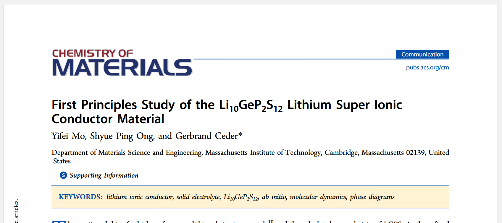
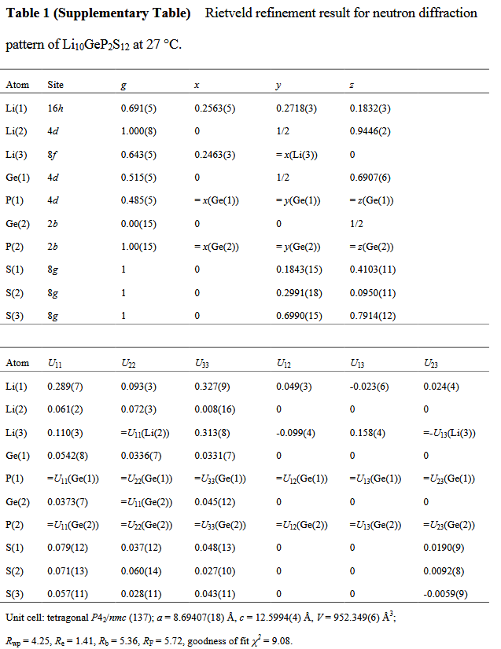
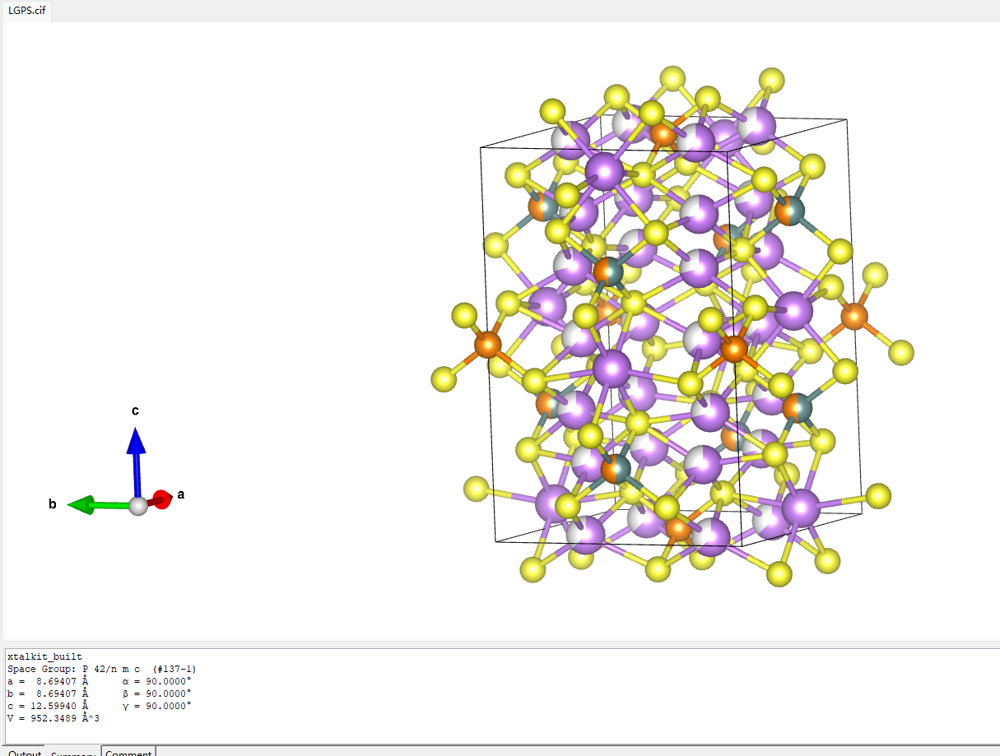

再来看看另一篇计算的文献。

Shyue Ping Ong仍是这篇文章的作者，文章比较短，材料是LGPS($\rm Li_{20}Ge_2P_4S_{24}$)

## 初筛


`Materals Project`上的结构是已完全有序的 mp-696138 CIF，它已经把 Li、Ge、P 全都固定到了单一元素上，无法用于复现文献。

ICSD官网记载了搜索原始结构的采集号188887：

当然，也可以获取XRD精修数据手动搭建，参考：
- _Phys. Chem. Chem. Phys._ (2013) 15 (28): 11620–11622.

不过，这均不是本次复现所使用的结构文件，时间还需要再往前推两年，回到2011年，即本次复现文献的发表年份，此快离子离子导体在大子刊被报道：
- [_Nature Materials_](https://www.nature.com/nmat) volume 10, pages682–686 (2011)
XRD精修数据如下：

数据如下：



于是计算组趁热打铁，理论研究了这种快离子导体的性质。


这个结构文件已经包含了真正要枚举的分数占据位点，但是依然不能直接使用`enumlib`进行枚举，而是先把实验占据数“整数化/有理化”，保证每个枚举结构都是精确的 `Li20Ge2P4S24`，否则 `enumlib` 会不知道每个位点到底该放几个 Li。

大致过程是：
1. 实验分数占据
2. 有理数占据
3. 整数个原子
4. enumlib 枚举
每个 Wyckoff 位点的原子数必须是整数：
- 原子数 = Wyckoff multiplicity × occupancy

比如表格中的Li，如果完全按照XRD精修数据，那么将是：
- Li(1): $16\times 0.691=11.056$
- Li(2): $4\times 1=4$
- Li(3): $8\times0.643=5.144$
- Ge(1): $4\times0.515=2.06$
- Ge(2): $2\times0=0$
- P(1): $4\times0.485=1.94$
- P(2): $2\times 1=2$
- S(1): $8\times1=8$
- S(2): $8\times1=8$
- S(3): $8\times1=8$
总的锂离子个数虽然是11.056+4+5.144=20.2，但锂离子个数却是分数，这是不允许的，而应当进行“整数化”：
- Li(1): $16\times 0.691\approx11$
- Li(2): $4\times 1=4$
- Li(3): $8\times0.643\approx5$
- Ge(1): $4\times0.515\approx2$
- Ge(2): $2\times0=0$
- P(1): $4\times0.485\approx2$
- P(2): $2\times 1=2$
- S(1): $8\times1=8$
- S(2): $8\times1=8$
- S(3): $8\times1=8$

这就是 2011 Nature Materials 文章 SI 里 neutron diffraction refinement 给出的结构模型。它和 2013 年 ICSD 收录的 Kuhn 单晶 XRD 结构不同，因为后者使用了另一套实验数据和 refinement model，并引入了额外 Li 位点。

模型的构建和枚举可以使用`xtalkit`软件包，Designed by：
- Claude code with GLM 5.2
- Codex with ChatGPT 5.5
- Fable 5 and Claude Opus 4.8
- Myself
 仓库地址是：https://github.com/hydrogen1222/xtalkit

以WSL环境为例，克隆到本地后安装基础环境，使用`uv`管理python环境：
```bash
storm@X16:~/test/xtalkit$ uv sync
Using CPython 3.12.13
Creating virtual environment at: .venv
Resolved 61 packages in 1ms
      Built xtalkit @ file:///home/storm/test/xtalkit
Prepared 1 package in 1.44s
Installed 10 packages in 10ms
 + gemmi==0.7.5
 + iniconfig==2.3.0
 + markdown-it-py==4.2.0
 + mdurl==0.1.2
 + packaging==26.2
 + pluggy==1.6.0
 + pygments==2.20.0
 + pytest==9.1.1
 + rich==15.0.0
 + xtalkit==0.1.0 (from file:///home/storm/test/xtalkit)
storm@X16:~/test/xtalkit$ uv pip install -e .
Resolved 6 packages in 1.37s
      Built xtalkit @ file:///home/storm/test/xtalkit
Prepared 1 package in 461ms
Uninstalled 1 package in 0.50ms
Installed 1 package in 2ms
 ~ xtalkit==0.1.0 (from file:///home/storm/test/xtalkit)
```
接下来安装`SHRY`，由于版本依赖问题，它将被安装在隔离环境：
```bash
uv tool install shry
```

手动导入环境变量：
```bash
export XTALKIT_SHRY_CMD="$(which shry)"
```
激活虚拟环境：
```bash
storm@X16:~/test/xtalkit$ source .venv/bin/activate
```
然后根据精修参数生成`enumlib`的输入结构，语法是：
```bash
xtalkit build --sg <N> --cell "<a b c α β γ>" --atom "<spec>" [--atom ...] [选项]
```
支持Wyckoff和分数坐标直接输入两种模式，有XRD精修数据，知道分数坐标则可以使用后者。

根据2011年的XRD精修参数并稍作调整以确保化学式为$\rm Li_{20}Ge_2P_4S_{24}$：
```bash
xtalkit build \
  --sg 137 \
  --cell "8.69407 8.69407 12.5994 90 90 90" \
  --atom-frac "Li 0.2563 0.2718 0.1832 0.6875" \
  --atom-frac "Li 0 0.5 0.9446 1" \
  --atom-frac "Li 0.2463 0.2463 0 0.625" \
  --atom-frac "Ge 0 0.5 0.6907 0.5" \
  --atom-frac "P 0 0.5 0.6907 0.5" \
  --atom-frac "Ge 0 0 0.5 0" \
  --atom-frac "P 0 0 0.5 1" \
  --atom-frac "S 0 0.1843 0.4103 1" \
  --atom-frac "S 0 0.2991 0.0950 1" \
  --atom-frac "S 0 0.6990 0.7914 1" \
  -o LGPS
```
生成了LGPS.cif结构，他是一个部分占据的结构：


可以调用enumlib库对这个部分占据的结构直接进行枚举，应同时考虑Li/空位混合占据&Ge/P混合占据，但是笔者在自己的轻薄本Linux环境上，耗尽32GB物理内存+16GB交换空间至中断依然没能枚举成功。

尝试使用SHRY，首先把部分占据 CIF 转成 SHRY-ready CIF：
```bash
xtalkit shry prepare LGPS.cif \
  --out LGPS_shry_ready.cif \
  --vacancy-symbol X \
  --parent-spacegroup 137 \
  --target-formula Li20Ge2P4S24 \
  --scaling-matrix 1 1 1
```

接下来按 Pólya 计数对称不等价构型：
```bash
xtalkit shry count LGPS_shry_ready.cif \
  --scaling-matrix 1 1 1 \
  --symprec 0.01 --angle-tolerance 5 --atol 1e-5 \
  --out LGPS_shry_count.json
```
查看生成的json文件，共有91728种构型。
然后生成相应的结构：
```bash
xtalkit shry enum LGPS_shry_ready.cif \
  --scaling-matrix 1 1 1 \
  --expect-count 91728 \
  --out LGPS_SHRY \
  --remove-vacancy X \
  --target-formula Li20Ge2P4S24 \
  --write-cif --write-poscar --write-degeneracy
```
统计文件个数，确实为91728个cif结构
```bash
storm@X16:~/trash/xtalkit/LGPS_SHRY$ find clean_cif/ -type f | wc -l
91728
storm@X16:~/trash/xtalkit/LGPS_SHRY$ ls
checks  clean_cif  input  manifest.json  manifest.jsonl  poscar  raw_shry
```

按照文献的做法，计算ewald静电能进行初筛，总耗时4min：
```bash
(xtalkit) storm@X16:~/trash/xtalkit/LGPS_SHRY$ time xtalkit ewald clean_cif/  --layout flat --charge Li:1 Ge:4 P:5 S:-2 --sort asc --top-n 10 --group --jobs 0
Ranked 91728 structure(s) by Ewald energy (lowest first):
  Rank  File                             Formula        N     Ewald E (eV)
  ----- -------------------------------- -------------- ----- ----------------
  1     conf_044691.cif                  Li10Ge(PS6)2   50    -1184.995101
  2     conf_050796.cif                  Li10Ge(PS6)2   50    -1184.943830
  3     conf_033711.cif                  Li10Ge(PS6)2   50    -1184.665817
  4     conf_040256.cif                  Li10Ge(PS6)2   50    -1184.528953
  5     conf_033792.cif                  Li10Ge(PS6)2   50    -1184.468801
  6     conf_043725.cif                  Li10Ge(PS6)2   50    -1184.443008
  7     conf_044093.cif                  Li10Ge(PS6)2   50    -1184.443008
  8     conf_044511.cif                  Li10Ge(PS6)2   50    -1184.372502
  9     conf_050615.cif                  Li10Ge(PS6)2   50    -1184.336091
  10    conf_048631.cif                  Li10Ge(PS6)2   50    -1184.335511

Wrote ranking CSV: clean_cif_ewald/ranking.csv
Grouped into: clean_cif_ewald/selected and clean_cif_ewald/rest

real    7m14.091s
user    110m31.760s
sys     0m34.396s
(xtalkit) storm@X16:~/trash/xtalkit/LGPS_SHRY$ ls
checks  clean_cif  clean_cif_ewald  input  manifest.json  manifest.jsonl  poscar  raw_shry
```

筛选出了10个低能的结构。


## cp2k
收敛性测试，使用脚本[gen_conv_test.py](文献复现（二）/gen_conv_test.py)完成
```bash
(storm) [storm@192 conv]$ python conv.py parse conv_cutoff

参数                      总能(Ha)    ΔE vs最密(meV/atom?)        应力1/3迹     最大力(a.u.)
----------------------------------------------------------------------------------
cut_300          -430.17734152                -52.06                            
cut_400          -430.17560269                 -4.75                            
cut_500          -430.17542756                  0.02                            
cut_600          -430.17542976                 -0.04                            
cut_700          -430.17542872                 -0.01                            
cut_800          -430.17542828                  0.00                            
----------------------------------------------------------------------------------
看 ΔE、应力1/3迹、最大力 从哪一行起基本不再变,就取那个参数(应力通常最晚收敛)。
ΔE 列是相对最密那次的'总能差';同一结构原子数相同,除以原子数即 meV/atom。
(storm) [storm@192 conv]$ python conv.py parse conv_kmesh

参数                      总能(Ha)    ΔE vs最密(meV/atom?)        应力1/3迹     最大力(a.u.)
----------------------------------------------------------------------------------
k_111            -430.15906164                445.36                            
k_222            -430.17576894                 -9.27                            
k_333            -430.17542976                 -0.04                            
k_444            -430.17542824                 -0.00                            
k_555            -430.17542819                  0.00                            
```
因此k点选择333，截断能选择500


## 相图计算
