再来看看另一篇计算的文献。

Shyue Ping Ong仍是这篇文章的作者之一，是一篇较短的通讯文章，材料是LGPS($\rm Li_{20}Ge_2P_4S_{24}$)。

## 初筛


`Materals Project`上的结构是已完全有序的 mp-696138 CIF，它已经把 Li、Ge、P 全都固定到了单一元素上，无法用于复现文献。

ICSD官网记载了搜索原始结构的采集号188887：

当然，也可以获取XRD精修数据手动搭建，参考：
- _Phys. Chem. Chem. Phys._ (2013) 15 (28): 11620–11622.

不过，这均不是本次复现所使用的结构文件，时间还需要再往前推两年，回到2011年，即本次复现文献的发表年份，此快离子离子导体在大子刊被报道：
- [_Nature Materials_](https://www.nature.com/nmat) volume 10, pages682–686 (2011)
XRD精修数据如下：


于是理论组趁热打铁，研究了这种快离子导体的性质。


这个结构文件已经包含了真正要枚举的分数占据位点，但是依然不能直接使用`enumlib`进行枚举，而是先把实验占据数“整数化/有理化”，保证每个枚举结构都是精确的 `Li20Ge2P4S24`，否则 `enumlib` 会不知道每个位点到底该放几个 Li。

大致过程是：
1. 实验分数占据
2. 有理数占据
3. 整数个原子
4. enumlib 枚举
每个 Wyckoff 位点的原子数必须是整数：
- 原子数 = Wyckoff multiplicity × occupancy

比如表格中的Li，如果完全按照XRD精修数据，那么将是：
- Li(1): $16\times 0.691=11.056$
- Li(2): $4\times 1=4$
- Li(3): $8\times0.643=5.144$
- Ge(1): $4\times0.515=2.06$
- Ge(2): $2\times0=0$
- P(1): $4\times0.485=1.94$
- P(2): $2\times 1=2$
- S(1): $8\times1=8$
- S(2): $8\times1=8$
- S(3): $8\times1=8$
总的锂离子个数虽然是11.056+4+5.144=20.2，但锂离子个数却是分数，这是不允许的，而应当进行“整数化”：
- Li(1): $16\times 0.691\approx11$
- Li(2): $4\times 1=4$
- Li(3): $8\times0.643\approx5$
- Ge(1): $4\times0.515\approx2$
- Ge(2): $2\times0=0$
- P(1): $4\times0.485\approx2$
- P(2): $2\times 1=2$
- S(1): $8\times1=8$
- S(2): $8\times1=8$
- S(3): $8\times1=8$

这就是 2011 Nature Materials 文章 SI 里 neutron diffraction refinement 给出的结构模型。它和 2013 年 ICSD 收录的 Kuhn 单晶 XRD 结构不同，因为后者使用了另一套实验数据和 refinement model，并引入了额外 Li 位点。

模型的构建和枚举可以使用`xtalkit`软件包，Designed by：
- Claude code with GLM 5.2
- Codex with ChatGPT 5.5
- Fable 5 and Claude Opus 4.8
- Myself
 仓库地址是：https://github.com/hydrogen1222/xtalkit

以WSL环境为例，克隆到本地后安装基础环境，使用`uv`管理python环境：
```bash
storm@X16:~/test/xtalkit$ uv sync
Using CPython 3.12.13
Creating virtual environment at: .venv
Resolved 61 packages in 1ms
      Built xtalkit @ file:///home/storm/test/xtalkit
Prepared 1 package in 1.44s
Installed 10 packages in 10ms
 + gemmi==0.7.5
 + iniconfig==2.3.0
 + markdown-it-py==4.2.0
 + mdurl==0.1.2
 + packaging==26.2
 + pluggy==1.6.0
 + pygments==2.20.0
 + pytest==9.1.1
 + rich==15.0.0
 + xtalkit==0.1.0 (from file:///home/storm/test/xtalkit)
storm@X16:~/test/xtalkit$ uv pip install -e .
Resolved 6 packages in 1.37s
      Built xtalkit @ file:///home/storm/test/xtalkit
Prepared 1 package in 461ms
Uninstalled 1 package in 0.50ms
Installed 1 package in 2ms
 ~ xtalkit==0.1.0 (from file:///home/storm/test/xtalkit)
```
接下来安装`SHRY`，由于版本依赖问题，它将被安装在隔离环境：
```bash
uv tool install shry
```

手动导入环境变量：
```bash
export XTALKIT_SHRY_CMD="$(which shry)"
```
激活虚拟环境：
```bash
storm@X16:~/test/xtalkit$ source .venv/bin/activate
```
然后根据精修参数生成`enumlib`的输入结构，语法是：
```bash
xtalkit build --sg <N> --cell "<a b c α β γ>" --atom "<spec>" [--atom ...] [选项]
```
支持Wyckoff和分数坐标直接输入两种模式，有XRD精修数据，知道分数坐标则可以使用后者。

根据2011年的XRD精修参数并稍作调整以确保化学式为$\rm Li_{20}Ge_2P_4S_{24}$：
```bash
xtalkit build \
  --sg 137 \
  --cell "8.69407 8.69407 12.5994 90 90 90" \
  --atom-frac "Li 0.2563 0.2718 0.1832 0.6875" \
  --atom-frac "Li 0 0.5 0.9446 1" \
  --atom-frac "Li 0.2463 0.2463 0 0.625" \
  --atom-frac "Ge 0 0.5 0.6907 0.5" \
  --atom-frac "P 0 0.5 0.6907 0.5" \
  --atom-frac "Ge 0 0 0.5 0" \
  --atom-frac "P 0 0 0.5 1" \
  --atom-frac "S 0 0.1843 0.4103 1" \
  --atom-frac "S 0 0.2991 0.0950 1" \
  --atom-frac "S 0 0.6990 0.7914 1" \
  -o LGPS
```
生成了LGPS.cif结构，他是一个部分占据的结构：


可以调用enumlib库对这个部分占据的结构直接进行枚举，应同时考虑Li/空位混合占据+Ge/P混合占据，但是笔者在自己的轻薄本Linux环境上，耗尽32GB物理内存+16GB交换空间至中断依然没能枚举成功。

尝试使用`SHRY`代替`enumlib`库，首先把部分占据 CIF 转成 SHRY-ready CIF：
```bash
xtalkit shry prepare LGPS.cif \
  --out LGPS_shry_ready.cif \
  --vacancy-symbol X \
  --parent-spacegroup 137 \
  --target-formula Li20Ge2P4S24 \
  --scaling-matrix 1 1 1
```

接下来按 Pólya 计数对称不等价构型：
```bash
xtalkit shry count LGPS_shry_ready.cif \
  --scaling-matrix 1 1 1 \
  --symprec 0.01 --angle-tolerance 5 --atol 1e-5 \
  --out LGPS_shry_count.json
```
查看生成的json文件，共有91728种构型。
然后生成相应的结构：
```bash
xtalkit shry enum LGPS_shry_ready.cif \
  --scaling-matrix 1 1 1 \
  --expect-count 91728 \
  --out LGPS_SHRY \
  --remove-vacancy X \
  --target-formula Li20Ge2P4S24 \
  --write-cif --write-poscar --write-degeneracy
```
统计文件个数，确实为91728个cif结构
```bash
storm@X16:~/trash/xtalkit/LGPS_SHRY$ find clean_cif/ -type f | wc -l
91728
storm@X16:~/trash/xtalkit/LGPS_SHRY$ ls
checks  clean_cif  input  manifest.json  manifest.jsonl  poscar  raw_shry
```

按照文献的做法，计算ewald静电能进行初筛，总耗时4min：
```bash
(xtalkit) storm@X16:~/trash/xtalkit/LGPS_SHRY$ time xtalkit ewald clean_cif/  --layout flat --charge Li:1 Ge:4 P:5 S:-2 --sort asc --top-n 10 --group --jobs 0
Ranked 91728 structure(s) by Ewald energy (lowest first):
  Rank  File                             Formula        N     Ewald E (eV)
  ----- -------------------------------- -------------- ----- ----------------
  1     conf_044691.cif                  Li10Ge(PS6)2   50    -1184.995101
  2     conf_050796.cif                  Li10Ge(PS6)2   50    -1184.943830
  3     conf_033711.cif                  Li10Ge(PS6)2   50    -1184.665817
  4     conf_040256.cif                  Li10Ge(PS6)2   50    -1184.528953
  5     conf_033792.cif                  Li10Ge(PS6)2   50    -1184.468801
  6     conf_043725.cif                  Li10Ge(PS6)2   50    -1184.443008
  7     conf_044093.cif                  Li10Ge(PS6)2   50    -1184.443008
  8     conf_044511.cif                  Li10Ge(PS6)2   50    -1184.372502
  9     conf_050615.cif                  Li10Ge(PS6)2   50    -1184.336091
  10    conf_048631.cif                  Li10Ge(PS6)2   50    -1184.335511

Wrote ranking CSV: clean_cif_ewald/ranking.csv
Grouped into: clean_cif_ewald/selected and clean_cif_ewald/rest

real    7m14.091s
user    110m31.760s
sys     0m34.396s
(xtalkit) storm@X16:~/trash/xtalkit/LGPS_SHRY$ ls
checks  clean_cif  clean_cif_ewald  input  manifest.json  manifest.jsonl  poscar  raw_shry
```

筛选出了10个低能的结构。
## cp2k复现

首先进行收敛性测试，使用脚本[gen_conv_test.py](文献复现（二）/gen_conv_test.py)完成
```bash
(storm) [storm@192 conv]$ python conv.py parse conv_cutoff

参数                      总能(Ha)    ΔE vs最密(meV/atom?)        应力1/3迹     最大力(a.u.)
----------------------------------------------------------------------------------
cut_300          -430.17734152                -52.06                            
cut_400          -430.17560269                 -4.75                            
cut_500          -430.17542756                  0.02                            
cut_600          -430.17542976                 -0.04                            
cut_700          -430.17542872                 -0.01                            
cut_800          -430.17542828                  0.00                            
----------------------------------------------------------------------------------
看 ΔE、应力1/3迹、最大力 从哪一行起基本不再变,就取那个参数(应力通常最晚收敛)。
ΔE 列是相对最密那次的'总能差';同一结构原子数相同,除以原子数即 meV/atom。
(storm) [storm@192 conv]$ python conv.py parse conv_kmesh

参数                      总能(Ha)    ΔE vs最密(meV/atom?)        应力1/3迹     最大力(a.u.)
----------------------------------------------------------------------------------
k_111            -430.15906164                445.36                            
k_222            -430.17576894                 -9.27                            
k_333            -430.17542976                 -0.04                            
k_444            -430.17542824                 -0.00                            
k_555            -430.17542819                  0.00                            
```
因此k点选择333，截断能选择500。

共10个结构，cp2k正常退出并收敛，计算速度很快并且远比VASP顺利，看来不搞磁性表面cp2k还是很能打的😂。

不出意外，能量顺序和VASP并不相同：
```bash
============================================================
Sorted by Energy (lowest first)
============================================================
  1. conf_033711: -430.493399 Ha
  2. conf_050615: -430.487045 Ha
  3. conf_040256: -430.487002 Ha
  4. conf_044093: -430.486992 Ha
  5. conf_043725: -430.484652 Ha
  6. conf_044691: -430.484252 Ha
  7. conf_050796: -430.484180 Ha
  8. conf_048631: -430.483853 Ha
  9. conf_033792: -430.483440 Ha
 10. conf_044511: -430.481449 Ha

Energy range: -430.493399 to -430.481449 Ha
Lowest energy: conf_033711 (-430.493399 Ha)
```

接下来计算电化学稳定窗口（更准确的说法是无锂离子净交换的电位窗口，因为LGPS本身就是不稳定的，在凸包上方）。MP利好VASP，如果用cp2k来做就会麻烦得多。
### 电化学窗口
首先使用[fetch_mp_structures.py](文献复现（二）/fetch_mp_structures.py)脚本拉取所有相关相，一共148个Li–Ge–P–S 候选结构，然后批量变胞优化。
获取能量，然后计算每个化合物的形成能：
$$
\Delta E_{f,i}=\frac{E_i-\sum_\alpha n_{i,\alpha}\mu_\alpha^{0}} {\sum_\alpha n_{i,\alpha}}
$$
在保持总体 Li、Ge、P、S 数目守恒的条件下，寻找所有相组合中的最低能量，这些最低能组合形成凸包，每个候选相与该最低值的差即为`E_above_hull`。这是个凸包使用全部148个结构，给出了23个临时凸包顶点，79个在临时凸包上方25 meV/atom 以内的结构，两种 LGPS 均分解为 `2 Li3PS4 + Li4GeS4`。`mp-696138` 和 `mp-696128` 两种LGPS分别约为 17.496 和 29.624 meV/atom above hull。

但这些能量来自结构优化末步，使用较小 DZVP 基组。经过热力学筛选和结构去重，最终留下了87个结构，接着取两种LGPS和它的分解产物进行收敛性测试，最终确定计算参数为：
```
PBE
BASIS_MOLOPT_UZH / TZV2P-MOLOPT-PBE-GTH-q*
POTENTIAL_UZH / GTH-PBE-q*
CUTOFF 700 Ry
REL_CUTOFF 70 Ry
EPS_DEFAULT 1e-12
EPS_SCF 1e-7
300 K electronic smearing
RKS by default
no D4
PBE CELL_OPT geometry
```
然后使用改参数对87个结构进行静态计算，再次建立凸包。

| LGPS 结构     | `E_above_hull` / meV atom⁻¹ | 分解产物                 |
| ----------- | --------------------------- | -------------------- |
| `mp-696138` | 17.273724                   | `2 Li3PS4 + Li4GeS4` |
| `mp-696128` | 28.417518                   | `2 Li3PS4 + Li4GeS4` |
接着绘制无净Li交换窗口，区间约为1.87-2.14。
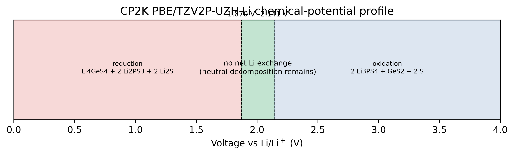
源文献Y. Mo, S. P. Ong, G. Ceder, *Chemistry of Materials* 2012, 24, 15–17 ，给出的窗口是1.8-2.4，它对应的是当时的候选结构集合、VASP/PAW-PBE 相对能和当时的数据库口径。

后来，Zhu、He 和 Mo 在 2015年使用 VASP/PAW-PBE、Materials Project 风格参数和 Li 巨势相图系统比较固体电解质。他们将区间更新为1.71-2.14:
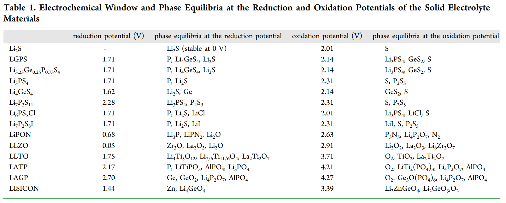
其中上界与cp2k复现的结果一致，而下界不一致。

不久，Han等人(Adv. Energy Mater. 2016, 6, 1501590)指出，传统 `Li/LGPS/Pt` 半阻挡电极接触面积小、反应动力学慢，容易把 表观窗口测得过宽。他们将 LGPS 与碳混合以提高电子接触，又用 Pt black 替代碳 排除碳副反应，观察到还原约从 1.7 V、氧化约从 2.1 V 开始，并检测到相应的 S 氧化和 Li–Ge/Li–P 还原产物，这与2015年的计算结果一致。

而cp2k算出的1.87下界是怎么一回事呢？对比下界时的分解产物：
- 2015年前人的计算文献在 1.71 V 的分解产物是：$\rm Li_4GeS_4 + 8 Li_2S + 2 P$
- CP2K在 1.87 V 的分解产物是：$\rm Li_4GeS_4 + 2 Li_2S + 2 Li_2PS_3$

可以看到多了一个产物$\rm Li_2PS_3$，倘若将$\rm Li_2PS_3$删掉，使用剩下86个相重算区间，下界结果为1.733 V，产物也变得和文献一致。

$\rm Li_2PS_3$来自于Materials Project，一共有mp-38200和mp-1222635两个结构。
对两者的原始结构再次变胞优化，发现前者发生了显著的重构，晶体从Pnma变成带有 P-P 键的Pnnm空间群结构，而后者的能量高出将近 0.94 eV/化学式（约 157 meV/atom）。后续的声子谱计算和有限温度自由能计算表明，重构后的Pnnm空间群的结构是一个稳定的结构。

事实上它也不是一个新结构，早在2016年它已经被报道过：
- Z.D. Hood et al. / Solid State Ionics 284 (2016) 61–70
- L.E. Rush Jr., N.A.W. Holzwarth / Solid State Ionics 286 (2016) 45–50

但实验样品的长程平均结构往往表现为具有P位无序的六方/三方结构，它不一定被每个数据库作为一个独立实验多晶型单独收录。

与2016 年论文(LDA)给出的 Pnnm-$\rm Li_4P_2S_6$ 晶格对比可以确定，本次计算中的Pnnm-$\rm Li_4P_2S_6$ 与文献中的结构一致。

既然它是真实稳定存在的，为什么文献中报道的下界依然是1.7 V左右呢？

这**可能**存在一些的文献惯性，经典的1.71–2.14 V 来自 Zhu、He、Mo 的 2015 年计算，10月份接受&online，引用量达1840次；而Hood 的 $\rm Li_4P_2S_6$ 结构论文是2015 年 10 月接受、11 月才在线公开。两项工作几乎同时进行。因此原始1.71 V 工作可能没包含 Pnnm-$\rm Li_4P_2S_6$ 结构。后来大量综述继续引用 1.7–2.1 V，很多其实是引用 Zhu/Han，而不是独立重新计算或重新测量。

到了2018年，Oh 等人的 LGPS 缺陷热力学研究中(Chemistry of Materials **2018** _30_ (15), 4995-5004)，化学势边界中已经出现$\rm Li_2P_2S_3$。

随后 Gorai 等人的 LGPS 缺陷研究又专门指出：Oh 的相稳定性结果包含$\rm Li_2PS_3$，而他们采用的候选边界没有$\rm Li_2PS_3$，并**选择了与当时实验相图更一致的相集合**。这说明$\rm Li_2PS_3$并不是没人看见，而是有些工作基于实验相图对它进行了取舍。

实验测量方面，下界也不是统一的 1.7 V。实验电化学窗口高度依赖测试方法：
- Chem. Mater. 2016, 28, 7, 2400–2407
- Systematic study and effective improvement of voltammetry for accurate electrochemical window measurement of solid electrolytes
- _J. Mater. Chem. A_ (2020) 8 (3): 1347–1359.

1.7 V 成为了一个被广泛沿用的经典基准值，而实际报告值随方法、界面和候选相集合明显变化。

总的来说， 经典的 1.71 V **可能🤔**是一个候选相集合不完整的旧 PBE 平衡结果，同时又碰巧接近特定碳复合电极下的动力学起始电位。复现现在得到的约 1.83–> 1.87 V的下界**可能🤔**是包含正确$\rm Li_4P_2S_6$ 基态后的零温平衡下界；实验约 1.7 V 则**可能🤔**更适合解释为受成核、界面和检测阈值影响的实际反应起点。

后续画了一个锂摄入电压图：
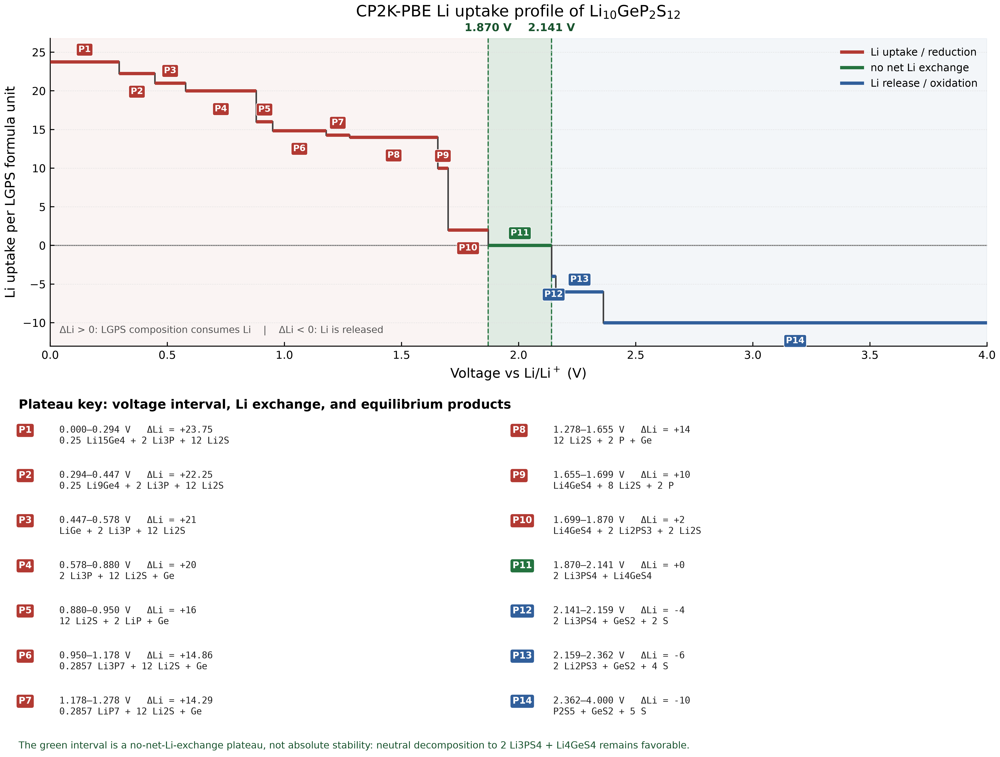

文献中的图如下：
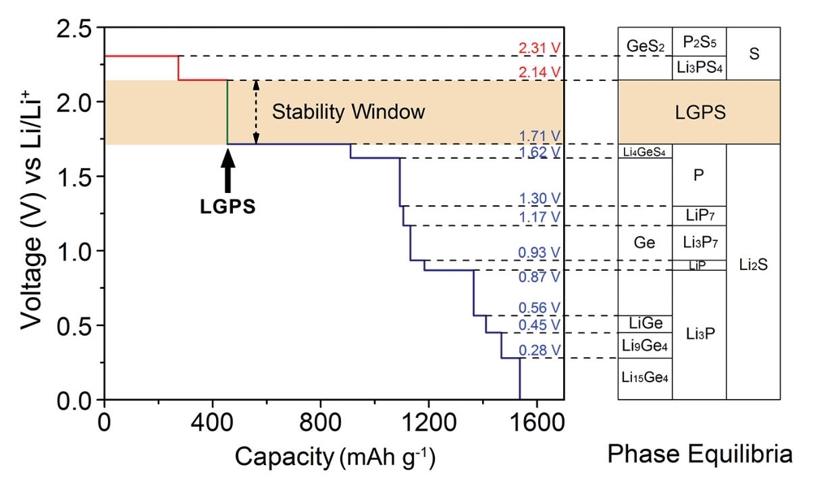
有些细微的差异，没有再仔细追究差异。
### DOS计算

特地编译了前几天新发布的2026.2版本。
输入文件有Multiwfn生成，使用`GPW`方法，HSE06泛函，开OT，使用ADMM和RI-HFX加速，**想着简单测试一下**，所以参数选得比较粗糙，只考虑了Gamma点，收敛性测试表明**这明显是不合理的**，称不上复现。先使用PBE泛函计算获取波函数，然后读取该波函数再使用HSE06杂化泛函计算，在双路2696V3的机器上耗时不到10分钟，极为迅速。

将molden文件导入Multiwfn中，
计算出来的带隙为3.41 eV，会偏小一些。
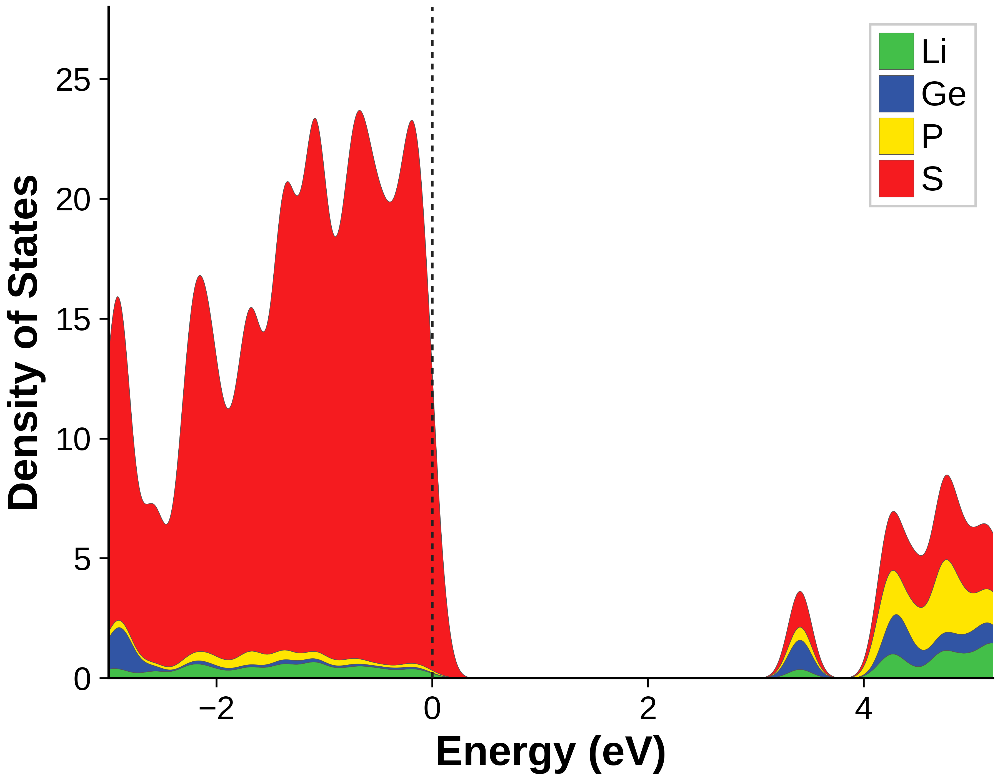
后续也尝试使用333的k点，但是即使全部使用OpenMP并行也会迅速吃光110GB内存OOM，所以就没有再测试。

## VASP
首先进行变胞优化，充分弛豫，确认10个结构全部收敛收敛。统计能量并排序：
```bash
(storm) [storm@192 step1-cell_opt]$ python extract_energy_xml.py 

=== 10 parsed vasprun.xml (sorted by free) ===

Rank  System                 Free TOTEN (eV)   No-entropy (eV)  E(sigma->0) (eV)  Nstep  Natom
----------------------------------------------------------------------------------------------
1     conf_044093                -216.279798       -216.279798       -216.279798     79     50
2     conf_040256                -216.277722       -216.277722       -216.277722      5     50
3     conf_050796                -216.096946       -216.096946       -216.096946    285     50
4     conf_033792                -216.071578       -216.071578       -216.071578      5     50
5     conf_043725                -216.044699       -216.044699       -216.044699     71     50
6     conf_048631                -216.043814       -216.043814       -216.043814    258     50
7     conf_044691                -216.040069       -216.040069       -216.040069    284     50
8     conf_050615                -215.935191       -215.935191       -215.935191    206     50
9     conf_033711                -215.875163       -215.875163       -215.875163      6     50
10    conf_044511                -215.857949       -215.857949       -215.857949      4     50
```

再做高精度的单点计算，排序：
```bash
(storm) [storm@192 Energy]$ python extract_energy_xml.py 

=== 10 parsed vasprun.xml (sorted by free) ===

Rank  System                 Free TOTEN (eV)   No-entropy (eV)  E(sigma->0) (eV)  Nstep  Natom
----------------------------------------------------------------------------------------------
1     conf_044093                -216.305464       -216.305464       -216.305464      1     50
2     conf_040256                -216.301717       -216.301717       -216.301717      1     50
3     conf_050796                -216.123705       -216.123705       -216.123705      1     50
4     conf_033792                -216.098000       -216.098000       -216.098000      1     50
5     conf_043725                -216.069483       -216.069483       -216.069483      1     50
6     conf_048631                -216.069042       -216.069042       -216.069042      1     50
7     conf_044691                -216.064170       -216.064170       -216.064170      1     50
8     conf_050615                -215.959246       -215.959246       -215.959246      1     50
9     conf_033711                -215.898978       -215.898978       -215.898978      1     50
10    conf_044511                -215.882542       -215.882542       -215.882542      1     50
```

相对顺序仍未改变。

### 电化学窗口


使用[LGPS_phase_stability.py](文献复现（二）/LGPS_phase_stability.py)脚本和[phase_stability_common.py](文献复现（二）/phase_stability_common.py)（公共脚本）会从MP上拉取一共148个相（与cp2k的相图计算中的相数目一致），剔除三个没有纯GGA/GGA+U的热力学条目的结构：
```bash
   MP 结构       化学式    为什么不在 145个结构中
  ━━━━━━━━━━━━  ━━━━━━━━  ━━━━━━━━━━━━━━━━━━━━━━━━
   mp-1143546    LiS₄      只有 r2SCAN 热力学数据
  ────────────  ────────  ────────────────────────
   mp-1977409    S         没有纯 GGA_GGA+U entry
  ────────────  ────────  ────────────────────────
   mp-2017755    GeS₂      只有 r2SCAN 热力学数据
```
这145个结构中有两个LGPS：
```bash
  mp-696128  Li10GeP2S12
  mp-696138  Li10GeP2S12
```
去除后还剩143个结构。
```bash
(storm) [storm@192 Energy]$ python LGPS_phase_stability.py   --vasprun conf_044093/vasprun.xml   --out-prefix phase_stability_LGPS
[info] target          : Li10GeP2S12
[info] chemical system : Ge-Li-P-S
[info] vasprun         : /home/storm/vasp/Energy/conf_044093/vasprun.xml
[info] MP entries      : 145 (GGA_GGA+U, MP2020 corrected)
[info] target entries  : 2 removed; 143 competitors retained

[sanity] formation energy/atom: MP -1.200428 eV, yours -1.200499 eV, delta -0.1 meV/atom

E_above_hull (your Li10GeP2S12) = +18.7 meV/atom
  positive: metastable; negative: below the known competitor hull
Decomposition products:
   0.6400 x Li3PS4         (mp-985583-GGA)
   0.3600 x Li4GeS4        (mp-30249-GGA)

[saved] phase_stability_LGPS.json
```
可以看到，与MP上的形成能极为接近，平均每个原子比凸包能量高18.7 meV，最终筛选出的这个能量最低的结构并不稳定，倾向于按比例分解为$\rm Li_3PS_4$和$\rm Li_4GeS_4$


使用[echem_windows.py](文献复现（二）/echem_windows.py)脚本计算电化学稳定窗口：
```bash
(storm) [storm@192 Energy]$ python echem_windows.py  --vasprun conf_044093/vasprun.xml --out-prefix echem_window_LGPS
[info] target          : Li10GeP2S12
[info] open element    : Li
[info] chemical system : Ge-Li-P-S
[info] vasprun         : /home/storm/vasp/Energy/conf_044093/vasprun.xml
[info] MP entries      : 145 (GGA_GGA+U, MP2020 corrected)
[info] target entries  : 2 removed; 143 competitors retained
[phase] E_above_hull vs different-composition competitors = +18.7 meV/atom
[note] The target is chemically metastable. The electrochemical window below means no net Li exchange, not zero neutral decomposition driving force.

   voltage interval |  Li uptake |    regime | products
---------------------------------------------------------------------------------------------------------
      0.000-0.284 V |     23.750 | reduction | 0.25 Li15Ge4 + 2 Li3P + 12 Li2S
      0.284-0.455 V |     22.250 | reduction | 0.25 Li9Ge4 + 2 Li3P + 12 Li2S
      0.455-0.562 V |     21.000 | reduction | LiGe + 2 Li3P + 12 Li2S
      0.562-0.870 V |     20.000 | reduction | 2 Li3P + 12 Li2S + Ge
      0.870-0.932 V |     16.000 | reduction | 12 Li2S + 2 LiP + Ge
      0.932-1.177 V |     14.857 | reduction | 0.2857 Li3P7 + 12 Li2S + Ge
      1.177-1.242 V |     14.286 | reduction | 0.2857 LiP7 + 12 Li2S + Ge
      1.242-1.622 V |     14.000 | reduction | 12 Li2S + 2 P + Ge
      1.622-1.717 V |     10.000 | reduction | Li4GeS4 + 8 Li2S + 2 P
      1.717-2.296 V |      0.000 |     no Li | Li4GeS4 + 2 Li3PS4
      2.296-2.356 V |     -3.500 | oxidation | 2 Li3PS4 + GeS2 + 0.5 LiS4
      2.356-3.065 V |     -9.250 | oxidation | P2S7 + GeS2 + 0.75 LiS4
      3.065-4.000 V |    -10.000 | oxidation | P2S7 + GeS2 + 3 S

============================================================================
No-Li-exchange window of Li10GeP2S12: 1.717-2.296 V (width 0.579 V)
  reduction below 1.717 V -> Li4GeS4 + 8 Li2S + 2 P
  oxidation above 2.296 V -> 2 Li3PS4 + GeS2 + 0.5 LiS4
============================================================================

[saved] echem_window_LGPS.png
[saved] echem_window_LGPS.pdf
[saved] echem_window_LGPS.json
```
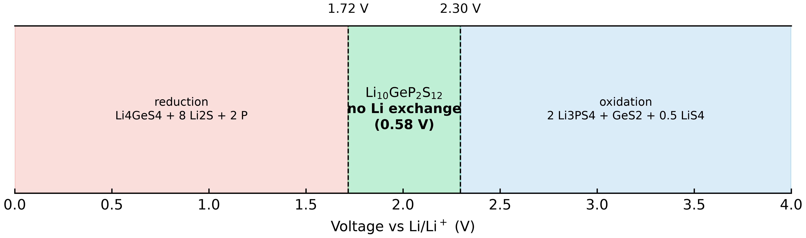
2012年源文献中的电位区间是1.8-2.4(近似)，复现结果与它有些差异，上界接近2.3 V。
区间内中性分解台阶：
$$
  \mathrm{Li_{10}GeP_2S_{12}\rightarrow Li_4GeS_4+2Li_3PS_4}
$$
超过上界后：
$$
  \mathrm{Li_{10}GeP_2S_{12}\rightarrow
  2Li_3PS_4+GeS_2+\frac12 LiS_4+3.5Li}
$$
消去两边共同的 ($2\mathrm{Li_3PS_4}$)，实际上控制上界的是：

$$
  \boxed{
  \mathrm{Li_4GeS_4\rightarrow GeS_2+\frac12LiS_4+3.5Li}
  }

$$
所以在此场景下：
- 下界参考$\rm Li_3PS_4$怎样被还原；
- 上界参考 $\rm Li_4GeS_4$怎样被氧化；

2012源文献只比较了几个代表性的 Li 化学势，指出 −1.8 至 −2.4 eV 之间为：
$$
  \mathrm{2Li_3PS_4+Li_4GeS_4}
$$
超过约 2.4 V 后转为$\rm P_2S_5$、$\rm GeS_2$ 和 S。
2015 年工作用当时的 MP 数据和修正方案把氧化过程分得更细，LGPS 在 2.14 V 首次氧化为$\rm Li_3PS_4$、$\rm GeS_2$、S，已生成的$\rm Li_3PS_4$到 2.31 V 又继续氧化为$\rm P_2S_5$和 S。因此，2015 年定义的“LGPS 氧化上界”是第一次释 Li 的 2.14 V，不是最终完全氧化的 2.3V。

至于复现中出现的2.3V上界，**可能**是MP2020对负价硫化合物施加了约：$-0.503\ {\rm eV/S}$的组成能量修正，而零价单质硫不接受这项修正。
Materials Project 数据版本说明 (https://docs.materialsproject.org/changes/database-versions) 考虑不含$\rm LiS_4$的传统氧化通道：
$$
  \mathrm{Li_4GeS_4\rightarrow GeS_2+2S+4Li}
$$
反应物$\rm Li_4GeS_4$ 有四个化合物态 S，产物$\rm GeS_2$ 只有两个化合物态 S，另外两个成为不修正的单质 S。因此 MP2020 对该反应产生约：
$$
  2\times0.503=1.006\ {\rm eV}\
$$
的相对能量变化。除以释放的 4 个 Li，对应电位变化：
$$
  \frac{1.006}{4}=0.2515\ {\rm V}
$$
此前用统一 CP2K 能量做过测试：
- 不施加 MP2020 式修正：单质硫通道为 2.140695 V；
- 施加后：上移到约 2.392195 V；
- 这时包含 $\rm LiS_4$的通道仍在 2.290068 V；
- 所以凸包优先选择$\rm LiS_4$通道，得到约 2.29 V；

总的来说，本次计算很好地复现了上界约为 2.3–2.4 V这一量级，但通过的是$\rm LiS_4$多硫化物通道，并非严格重现 2012 年的单质硫/$\rm P_2S_5$ 氧化路径。只能说“数值接近”，谈不上逐项复现


接下来用[echem_uptake_profile.py](文献复现（二）/echem_uptake_profile.py)绘制锂摄取量—电压曲线。
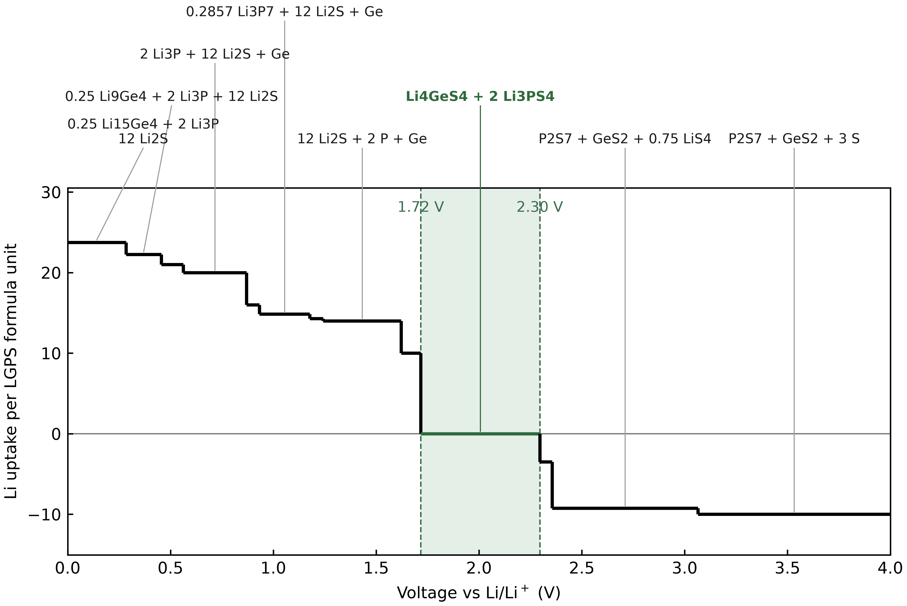
使用[LGPS_grand_potential.py](文献复现（二）/LGPS_grand_potential.py)绘制巨势相图，即原文的Figure1。
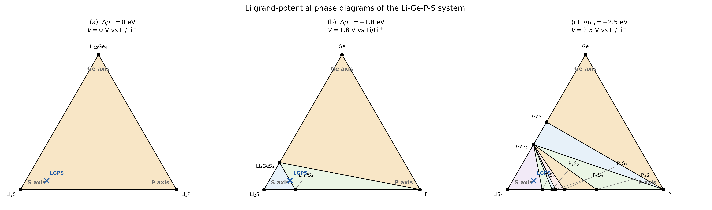
>>Phase evolution of the Li–Ge–P–S system as a function of Li chemical potential μLi at (a) 0 eV, (b) −1.8 eV, and (c) −2.5 eV. μLi = 0 eV corresponds to metallic Li. Labeled dots denote stable phases at each μLi. For all other compositions, the equilibrium state is formed by a combination of the stable phases in the triangle surrounding that composition. The LGPS composition is marked with a blue cross. For example, the equilibrium state of the LGPS composition is given by a combination of GeS2, S, and P2S5 at μLi = −2.5 eV.

对于固态电解质，体系可以和外界 Li 储库交换 Li ，应使用巨势：
$$
\Phi = E-N_{\mathrm{Li}}\mu_{\mathrm{Li}}
$$
  其中：
-  $N_{\mathrm{Li}}$：物相中的 Li 数量；
- $\mu_{\mathrm{Li}}$：外界 Li 化学势；
- 金属 Li 定义为 $\Delta\mu_{\mathrm{Li}}=0)$；
- 电压关系为：$V=-\Delta\mu_{\mathrm{Li}}/e$

Li 被设置成“开放组分”，因此先把所有化学式中的 Li 暂时拿掉，只看 Ge–P–S 比例。
  例如：
- Li2S       → 只剩 S       → S 顶点
- Li3P       → 只剩 P       → P 顶点
- Li15Ge4    → 只剩 Ge      → Ge 顶点
- Li3PS4     → P:S = 1:4    → P–S 边上
- Li4GeS4    → Ge:S = 1:4   → Ge–S 边上

 图中符号的含义：
- 黑点：该 Li 化学势下的稳定相。
- 黑线：两个稳定相可以共存的 tie line。
- 小三角区域：三个顶点相可以共同构成平衡混合物。
- 蓝色 ×：LGPS 去掉 Li 后的 Ge:P:S = 1:2:12 位置。
- 找到蓝色 × 所在的三角形，三角形顶点就是 LGPS 的平衡分解产物。
- 如果蓝色 × 正好落在一条线上，则只需要线两端的两个相。

巨势相图、稳定窗口和原文献中有些差异，这可能是因为：
- 作者使用的是当时的 ICSD、Holzwarth 收集的 Li–P–S 相以及早期 Materials Project 数据，本次复现从MP取得的竞争相集合明显更新。
- 脚本使用的MP2020-compatible GGA/GGA+U scheme，而 2011 年论文不可能使用后来的 MP2020 修正
	- Materials Project 在 2021.05.13 数据库版本中启用了这套新方案，[https://docs.materialsproject.org/changes/database-versions](https://docs.materialsproject.org/changes/database-versions)
- 计算细节上的差异，如k点、截断能、赝势类型等


### DOS计算


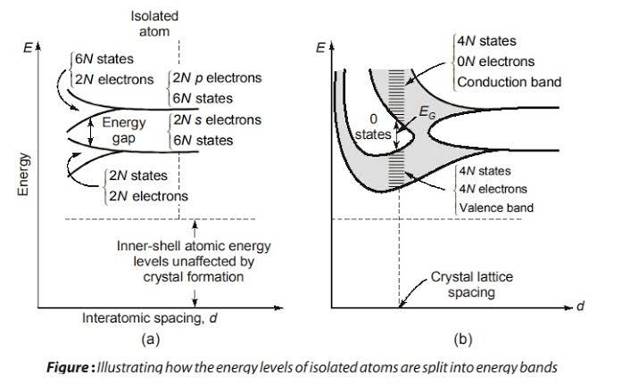
回顾一下化学里的原子轨道波函数（$s, p, d$）。当两个原子靠近形成双原子分子时，它们的轨道会发生劈裂，形成一个成键轨道和一个反键轨道。在固体中，有阿伏伽德罗常数量级的原子紧密排列在一起。这些原子的同一能级轨道也会发生劈裂，形成靠得极近的分子轨道(LCAO方法)。因为这些轨道挨得实在太近了，能量差异极小，看起来就像连续的一条“带子”——这就是**能带（Band）**。

所以，一条能带，本质上就是固体中原子的某个特定轨道（比如互相重叠的 $p_z$ 轨道）组合而成的“超级分子轨道”。在 VASP 里，参数 **`NBANDS`** 就是指的计算能带的数目：
$$
\text {NBANDS}=\text{max}(\dfrac{1}{2}\text{nint}(N_{\rm elect}+2)+\text{max}(\dfrac{1}{2}N_{\text{ions}},3),\text{int}(\dfrac{3}{5}N_{\text{elect}}))
$$
这里还有个小插曲，我分别用CPU版本和GPU版本的VASP对LPSC进行了变胞优化计算，四个输入文件完全相同，但是`NBANDS`却不同：
```bash
(storm) [storm@vasp-v100 temp_cpu]$ grep NBANDS OUTCAR 
   k-points           NKPTS =      4   k-points in BZ     NKDIM =      4   number of bands    NBANDS=    160
(storm) [storm@vasp-v100 temp_cpu]$ grep NBANDS ../temp/OUTCAR 
   k-points           NKPTS =      4   k-points in BZ     NKDIM =      4   number of bands    NBANDS=    147
```
对于52个原子（Li使用`Li_sv`赝势）的LPSC惯用晶胞，使用上述公式算出来正好是147条带，但CPU版本启动时使用了32个MPI并行进程，VASP 会把能带分配给并行进程，为了让带并行分组整除，会把 `NBANDS` **向上增加**，160正好能被32整除，而GPU 版本通常是一张 GPU 对应一个 MPI rank，因此没有必要补齐，保留默认的 147。

态密度和能带其实描述的是同一个物理世界，只是视角不同。可以把电子在晶体里的能量状态想象成一座连绵起伏的山脉。
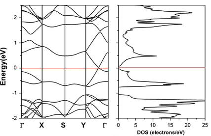
- 对于左侧的能带图：横坐标 $k$ 代表电子的动量（即电子在晶体里的运动方向，比如沿着高对称点 $\Gamma, X, S$ 的路径）。它详细记录了电子在特定方向上运动时，拥有的能量 $E$ 是多少。
- 对于右侧的态密度图：完全忽略了电子往哪个方向飞，只简单粗暴地统计：在某一个特定的能量值 $E$ 上，总共有多少个电子的状态数

仔细看对比图还可以发现，当左侧的能带非常**平坦**时（说明电子能量不随方向改变，这通常对应局域性很强的轨道，比如孤立单原子的 $d$ 轨道），右侧的 DOS 就会在相同的能量位置出现一个非常**尖锐的峰**，因为大量的状态都挤在这一个能量点上。这里所谓“局域性强”，指的是：
- 可以用一个主要集中在某个原子或某个局部结构单元上的局域轨道，来很好地描述这条能带；
- 这个轨道与邻近晶胞中的对应轨道重叠很小、跃迁很弱。

如果各晶胞之间有明显耦合，不同k点代表不同的相位组合，有的组合更成键，有的更反键，所以能量明显不同。

如果晶胞之间几乎不耦合（**跃迁弱，局域性强**），那么不管相位怎么组合，能量都差不多，于是E(k)很平。

接下来计算一下态密度，这还是第一次计算DOS呢。看一下wiki的原文吧：
>
>The electronic density of states (DOS) describes how many electronic states are available at a given energy. It is a useful tool for analyzing the electronic structure of materials, identifying band gaps, and distinguishing between metallic and insulating behavior. The DOS can also reveal the contribution of different atoms and orbitals to the electronic states.

>>In VASP, the density of states is typically calculated after a self-consistent calculation using a dense k-point mesh. The DOS is written to the DOSCAR file, while projected contributions from atoms and orbitals can be obtained using tags such as [LORBIT](https://vasp.at/wiki/LORBIT "LORBIT"). After obtaining a converged charge density, a non-self-consistent DOS calculation using a denser k-point mesh is often recommended for smoother and more accurate DOS curves.

官方wiki记载的是两步法计算（GGA-PBE泛函）：
- 第一步：较普通的 k 网格，PBE 自洽
- 更密 k 网格，固定密度（ICHAR=11）

PBE泛函的计算量并不大，当然也可以一步完成：INCAR中加入DOS的参数、使用较密的k点完成一次正常的静态自洽计算（NSW=0是谓静态，ICHARG!=11是谓自洽）。

而HSE06杂化泛函中包含非局域Fock交换算符：
$$
\hat{V}_x^{\rm Fock}\psi_{n \mathbf k}
$$
仅有电荷密度不足以重建HSE06 Hamiltonian，所以无法通过自洽+非自洽的两步法计算能带。workshop和wiki都有提到：
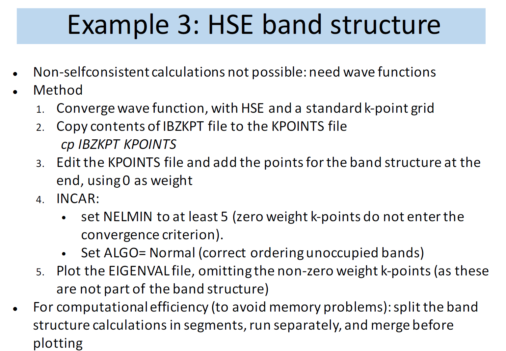
- https://vasp.at/wiki/Band-structure_calculation_using_hybrid_functionals

不过，使用HSE06杂化泛函计算能带也是可以两步法进行的，这也是wiki中的做法：
- PBE泛函+密集k点进行静态自洽计算，获得波函数
- HSE06杂化泛函+KPOINTS+KPOINTS_OPT(或者一个包含零权重 k 点的显式 k 点列表KPOINTS)+波函数进行静态自洽计算

有几个点值得注意：
- 相同k点和兼容基组下（平面波截断），不同泛函可以借助旧WAVECAR作为初始猜测加速计算
- 考虑不同k点并设置ISTART=1（默认设置），可能不会报错但并非一定会被读取（续算）使用，关键在于不可约k点数、每个k点坐标等因素
- DOS：整个Brillouine zone均匀采样
- 能带：均匀网格先求基态，再沿指定路径观察色散

很久之前用HSE06杂化泛函算过LPSC原胞的能带（一步法），用超算上海光的四张DCU计算卡加速，总耗时约5h，时长是可以接受的。

能带和态密度两者虽有相似之处，但是计算态密度并不需要高对称路径，只需要均匀的比静态自洽计算更密集的k点网格就行，大概的scheme如下：
- HSE06 总能
```
KPOINTS
└── 均匀网格，例如 3×3×2

没有 KPOINTS_OPT
```
输出总能，同时也会有本征值和基础 DOSCAR。
- HSE06 DOS，一步法
```
KPOINTS
└── 更充分收敛的均匀网格，例如 4×4×3

没有 KPOINTS_OPT
```
这本质上也是一次 HSE06 静态 SCF，只是 k 网格按 DOS 收敛，并设置好 `NEDOS`、`LORBIT`、积分方法等。
- HSE06 能带，一次提交完成
```
KPOINTS
└── 均匀规则网格，负责 SCF

KPOINTS_OPT
└── line-mode 高对称路径，负责能带
```

因为任意k点都可以计算能带（带隙），这些k点是不是 Γ、X、L、W，**不影响方程能否求解**。
$$
\hat{H}(k)\psi_{n,k}=\varepsilon_{n,k}\psi_{n,k}
$$
但大家习惯使用高对称点路径计算能带，因为完整的三维晶体能带实际上是：
$$
E_n(k_x,k_y,k_z)
$$
每一条能带都是三维k空间中的一个曲面。没办法在普通二维论文图片中完整展示整个三维布里渊区，所以大家选择一些具有代表性的路线，比如：
$$
Γ → X → W → K → Γ → L
$$
然后画出这条路线上的$E_n(k)$，于是三维问题被压缩成一张二维曲线图。甚至在计算有效质量时，人们常常不是沿完整高对称路径，而是在某个带边附近密集取点。

本次DOS静态自洽计算总耗时约37.5小时，最耗时是Fock前变换的部分。VASP为了计算电子密度和总能，必须在这些k点上求解本征态，因此自然会输出`EIGENVAL`，（对于静态计算和通常的结构优化）它记录的是最后一个离子步对应的 Kohn–Sham 方程解，包含：
- 实际使用的k点坐标；
- 每个k点的权重；
- 每一个band index 的本征值；
- 每条能带的占据数。

整个计算完成了均匀采样，可以使用[gap_from_eigenval.py](文献复现（二）/gap_from_eigenval.py)从`EIGENVAL`提取数据计算带隙，比如对LPSC的计算（只是普通的变胞优化任务）：
```bash
(storm) [storm@vasp-v100 temp]$ python gap_from_eigenval.py 
EIGENVAL       : EIGENVAL
NELECT         : 240
NKPTS          : 4
NBANDS         : 147
VBM            : 0.61295500 eV
CBM            : 2.76792700 eV
sampled gap    : 2.15497200 eV
sampled direct : True

注意：这是 EIGENVAL 所含 k 点中的带隙，
并不自动保证是真正的全布里渊区基本带隙。
```
算出的带隙是2.15 eV，和MP上的PBE带隙一致：
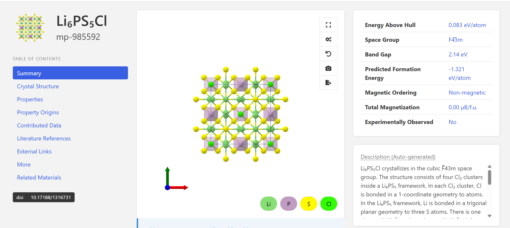
本次计算的带隙如下：
```bash
(storm) [storm@vasp-v100 HSE06DOS]$ python gap_from_eigenval.py 
EIGENVAL       : EIGENVAL
NELECT         : 252
NKPTS          : 26
NBANDS         : 152
VBM            : 0.79546700 eV
CBM            : 4.47500900 eV
sampled gap    : 3.67954200 eV
sampled direct : False
```
与源文献中记载的带隙基本一致。

接下来使用`vaspkit`的113功能进行后处理，使用[plot_pdos.py](文献复现（二）/plot_pdos.py)绘制PDOS图片：
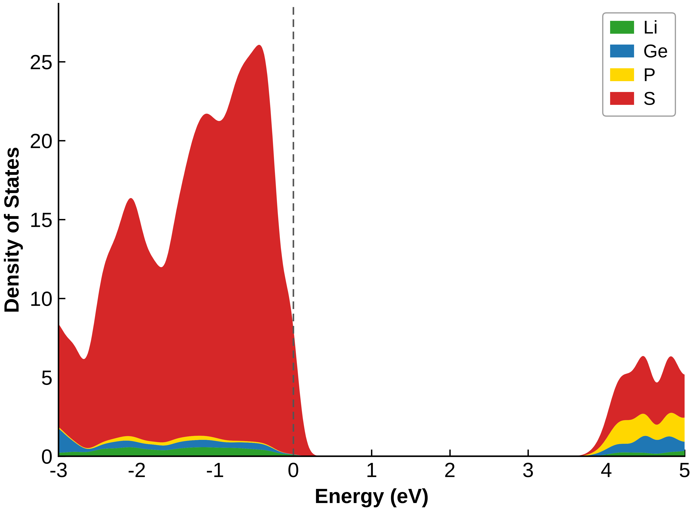
文献的原图如下：
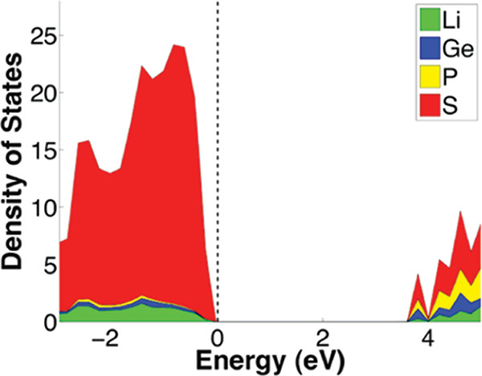
可以得出：
- 体系有明显带隙，是电子绝缘体或宽带隙半导体；
- 价带主要由 S 元素态贡献；
- 导带低能区具有 S、P、Ge 混合特征；
- Li 对价带顶和当前显示的导带底附近贡献较小；


至此，除了AIMD之外的内容已基本复现，完结撒花🌼🌼🌼🎉🎉🎉🥳🥳🥳~
