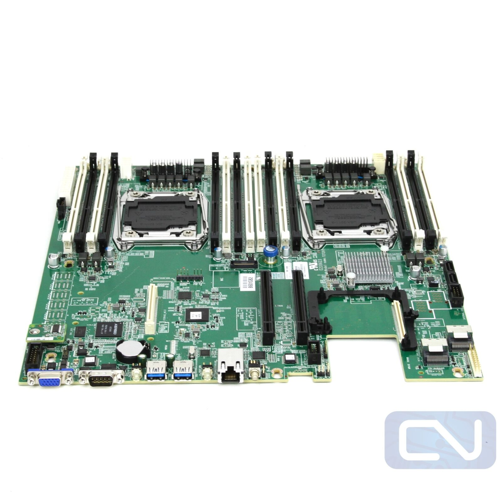

船来啦~船来啦~垃圾佬们纷纷涌到窗前，盼望着大船靠岸的那一刻😢。

LGA3647(C621)大船靠岸可能只是时间问题。在能用上便宜大碗的C621、EYPC 7002/7003之前，还是先看看近处已靠岸的C612吧家人们()。

然而，DDR4 RECC也涨飞了，面对咫尺的众多正规军双路C612主板，比如浪潮5212M4、超微X10DRi、联想RD450X……，只能望洋兴叹。

还好25年初一口气买了8根16GB DDR3 RECC，按理来讲，所有正规军C612，包括御三家（华硕、微星、技嘉，这三家的正规军质量没得说，但现在能买到的很多都是二修的了，个人卖家挺少，且远贵于大船靠岸后的服务器厂商的主板）以及服务器厂商的主板均使用的是DDR4服务器条子，但是在众多正规军双路主板中有一块妖板：英业达代工的X99，支持DDR3内存。
它的前身是作为硬盘服务器来的，所以PCIE插槽少得可怜，且安装显卡极其容易和CPU散热器撞上，

之前买了同款的，不过被我玩坏了，上电反复重启，这种疑难杂症也不太好修，小黄鱼上还剩一块，190R价格也还可以，但是安装显卡的话得用延长线，考虑到这是EEB板型比E-ATX更大，对机箱也很挑，就不打算买了，真是白瞎了这么多内存槽。

代替方案是一块精粤的双路寨板，寨板就寨板吧，只有供电、散热能顶住就行，不过只有八根槽，技术客服表示全是主通道，一共八通道 ，等会上级测试一下。

