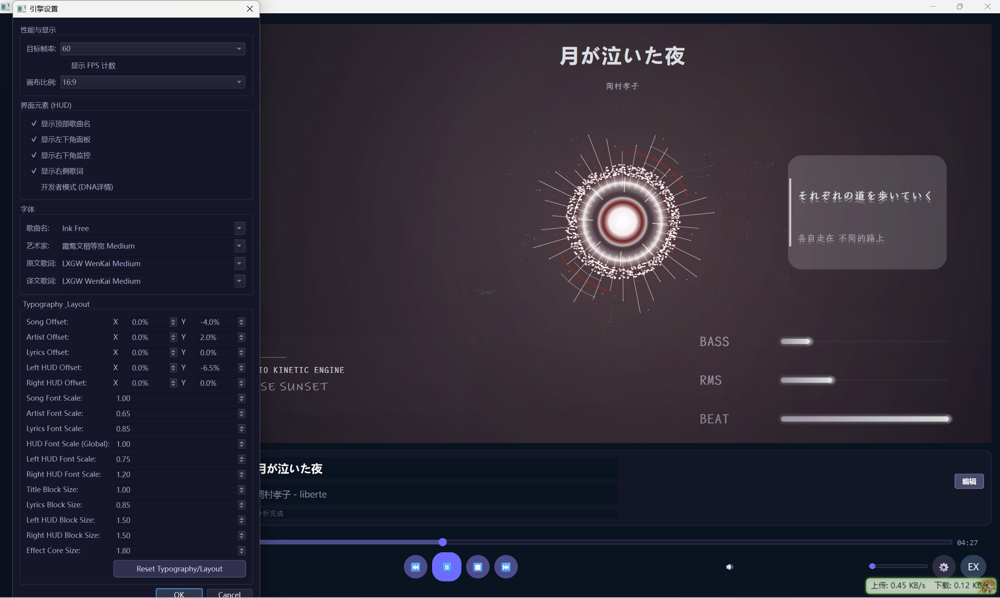
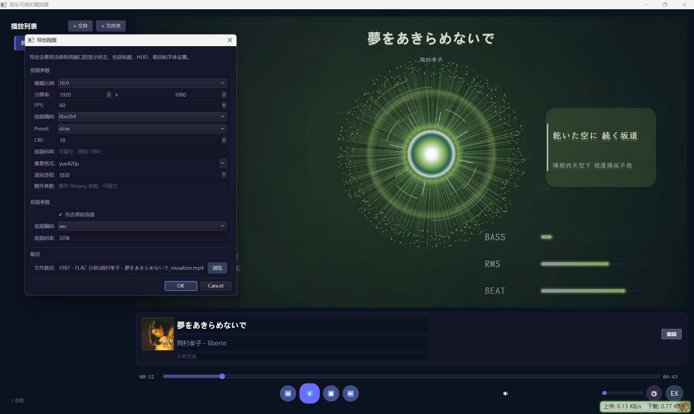

一款可视化的音频播放器，支持视频导出，特效由纯CPU渲染。
很早之前就想做这么个玩意，我认为歌曲中一定有某种“特征”，将歌曲与歌曲之间区分开来，比如所谓的“流行歌曲”与“古典音乐”就是不同的派别，这个软件旨在尽可能多地提取一些特征，然后使用相应的数学公式量化，再用特效的方式呈现出来，达到“音频可视化”的效果。惭愧的说，本人并没有深入学习过相关的知识，大部分的功劳归功于AI Agent：
- Codex(GPT-Codex 5.3)
- Gemini-cli(Gemini-3.1-pro-preview)
- Antigravity(Claude Opus 4.6)
- Claude Code(Minimax-M2.7)
音频可视化的实现效果如下：

视频导出效果：

当然，视频导出压制需要依赖本地的`FFmpeg`，发布了16:9和9:16的两个视频：
- https://www.bilibili.com/video/BV17FD1BmEhe/?spm_id_from=333.1387.homepage.video_card.click&vd_source=4b4b0bce46607b3376213560ca269073
- https://www.douyin.com/user/self?from_tab_name=live&modal_id=7626718341222141225

以下是Codex写的一个说明文档。

# 音频可视化工程技术说明（扩展版，源码对应）

工程路径：`D:\Codex\音频可视化` 主要代码范围：`app/`（当前主工程，CPU + QPainter 渲染） 文档目标：在保证数学和工程严谨性的前提下，让半专业或非专业读者也能建立完整理解。

---

## 1. 系统总览

### 1.1 核心定位

这是一个本地音乐播放器 + 实时音频可视化系统。 核心技术路径是：

- 音频播放：`PySide6.QtMultimedia`
    
- 音频分析：`librosa + numpy + scipy`
    
- 场景状态管理：纯 Python 数值逻辑
    
- 渲染：`QPainter`（CPU 2D 光栅化）
    
- 导出：逐帧离屏渲染后交给 `ffmpeg` 编码
    

### 1.2 模块划分

1. `app/core/`
    
2. `app/analysis/`
    
3. `app/visual/`
    
4. `app/ui/`
    
5. `app/export/`
    

模块职责简表：

| 模块                   | 职责               |
| -------------------- | ---------------- |
| `core`               | 播放、曲目管理、元数据、歌词   |
| `analysis`           | 特征提取、缓存、时间同步     |
| `visual/scene.py`    | 把特征映射为可视化控制信号    |
| `visual/renderer.py` | 逐层绘制背景、结构、粒子、HUD |
| `export`             | 离线渲染与视频导出        |

### 1.3 运行时数据流

---

## 2. 符号与单位（建议先看）

| 符号            | 含义               | 单位          |
| ------------- | ---------------- | ----------- |
| $y[n]$        | 时域离散音频样本         | 振幅（归一化后无量纲） |
| $sr$          | 采样率              | Hz          |
| $N$           | FFT 窗长（`n_fft`）  | 样本点         |
| $H$           | 帧移（`hop_length`） | 样本点         |
| $t$           | 帧索引或时间索引         | 帧或秒（按上下文）   |
| $k$           | 频率 bin 索引        | 无量纲         |
| $S(k,t)$      | STFT 复谱          | 复数          |
| $             | S(k,t)           | $           |
| $             | S(k,t)           | ^2$         |
| $\epsilon$    | 数值稳定用小常数         | 无量纲         |
| $\mu,\sigma$  | 均值、标准差           | 依变量而定       |
| `clip(x,a,b)` | 截断函数             | 无量纲         |

截断函数定义：

$$  
\mathrm{clip}(x,a,b)=\min(\max(x,a),b)  
$$

  

注释：

- 作用：限制数值范围，防止过大或过小导致视觉爆炸。
    
- 代码里大量使用到 `[0,1]` 截断。
    

---

## 3. 音频特征提取：从原始波形到 L1~L5

源码主入口：`app/analysis/extractor.py::FeatureExtractor.extract`

---

### 3.1 预处理

#### 3.1.1 立体声转单声道

$$  
y_{\text{mono}}[n]=\frac{1}{C}\sum_{c=1}^{C}y_c[n]  
$$

  

注释：

- $C$：通道数（通常 2）
    
- 单位：振幅（无量纲）
    
- 直观解释：左右声道做平均，得到一个统一分析信号
    
- 代码：`if len(y.shape) > 1: y = np.mean(y, axis=1)`
    

#### 3.1.2 重采样

工程统一采样率为 `44100 Hz`。如果输入不同采样率，重采样到 44100：

- 代码：`librosa.resample(..., target_sr=44100, res_type='soxr_hq')`
    
- 目的：让后续 FFT、频带划分、时间分辨率固定，方便缓存和渲染同步
    

#### 3.1.3 HPSS 分离（谐波/打击）

分离得到：

- $y_h$：谐波分量（更接近持续音高）
    
- $y_p$：打击分量（更接近鼓点和瞬态）
    

代码：

- `y_harmonic, y_percussive = librosa.effects.hpss(y, margin=(1.0, 5.0))`
    

直观解释：

- 后续 onset 用 $y_p$ 会更干净，减少旋律音对鼓点检测的干扰。
    

---

### 3.2 时频变换（STFT）

#### 3.2.1 STFT 基本式

$$  
S(k,t)=\sum_{n=0}^{N-1}y[n+tH]\cdot w[n]\cdot e^{-j2\pi kn/N}  
$$

  

注释：

- $N=2048$（窗长）
    
- $H=512$（帧移）
    
- $w[n]$：窗函数
    
- 时间分辨率（近似）：
    

$$  
f_{\text{frame}}=\frac{sr}{H}=\frac{44100}{512}\approx 86.13\ \text{fps}  
$$

  

这意味着每秒大约 86 帧分析数据。

#### 3.2.2 幅度谱和功率谱

$$  
A(k,t)=|S(k,t)|  
$$

  

$$  
P(k,t)=|S(k,t)|^2  
$$

  

注释：

- 代码里两者都用：有些特征用幅度，有些用功率。
    

---

### 3.3 L1 帧级特征（连续时间序列）

定义在：`app/analysis/features.py::FrameFeatureSequence` 总维度：30 维（含 12 维 chroma）

#### 3.3.1 RMS 能量

$$  
\mathrm{RMS}(t)=\sqrt{\frac{1}{N}\sum_{n=0}^{N-1}y_t[n]^2}  
$$

  

注释：

- 单位：振幅
    
- 直观解释：一帧音频“总体有多响”
    
- 代码：`compute_rms()`
    

#### 3.3.2 Peak 峰值

$$  
\mathrm{Peak}(t)=\max_n |y_t[n]|  
$$

  

注释：

- 单位：振幅
    
- 直观解释：这一帧中最尖的瞬时幅度
    
- 代码：`compute_peak_energy()`
    

#### 3.3.3 Loudness（工程归一化近似）

$$  
L(t)=\mathrm{clip}\left(\frac{20\log_{10}\left(\frac{\mathrm{RMS}(t)}{\mathrm{RMS}_{\max}}\right)}{80}+1,\ 0,\ 1\right)  
$$

  

注释：

- 先转 dB，再压到 `[0,1]`
    
- 这是工程近似，不等同于 LUFS 标准响度
    
- 代码：`features_matrix[:, F_LOUDNESS] = ...`
    

#### 3.3.4 六频段能量

频段定义：

- bass: `[0,250)`
    
- low_mid: `[250,500)`
    
- mid: `[500,2000)`
    
- high_mid: `[2000,4000)`
    
- high: `[4000,8000)`
    
- presence: `[8000, sr/2)`
    

每段能量：

$$  
E_b(t)=\sum_{k\in B_b}P(k,t)  
$$

  

注释：

- $B_b$ 是该频段对应的 bin 集合
    
- 单位：相对功率
    
- 代码：`compute_band_energies_6()`
    

#### 3.3.5 频段动态归一化（关键）

该工程并非仅做简单 min-max，而是先做“底噪去除 + 幂增强”：

1. 可选底噪基线去除（bass 和 low_mid 开启）：
    

$$  
E'_b(t)=\max\left(E_b(t)-M_b(t),0\right)  
$$

  

其中 $M_b(t)$ 是滑动最小值（代码里窗口约 80 帧，约 2 秒）。

2. 峰值归一化：
    

$$  
\tilde E_b(t)=\frac{E'_b(t)}{\max_t E'_b(t)+\epsilon}  
$$

  

3. 冲击增强（幂次）：
    

$$  
\hat E_b(t)=\tilde E_b(t)^{p_b}  
$$

  

幂指数示例：

- bass: $p_b=1.5$
    
- low_mid: $p_b=1.3$
    
- mid: $p_b=1.1$
    

直观解释：

- 大值变得更突出，小值被压得更低，视觉上“鼓点更有 punch”。
    

#### 3.3.6 Spectral Centroid

理论定义（标准形式）：

$$  
C_{\text{std}}(t)=\frac{\sum_k f_k W(k,t)}{\sum_k W(k,t)}  
$$

  

工程实现归一化：

$$  
C(t)=\mathrm{clip}\left(\frac{C_{\text{std}}(t)}{8000},0,1\right)  
$$

  

注释：

- $f_k$ 是该 bin 对应频率（Hz）
    
- $W(k,t)$ 在该实现中是功率谱
    
- 直观解释：频谱“重心”偏高则声音更明亮、更尖
    

#### 3.3.7 Spectral Rolloff

定义：找到频率 $f_r$，使得累计能量达到总能量阈值（librosa 默认约 85%）：

$$  
\sum_{f_k \le f_r}W(k,t)\ \ge\ 0.85\sum_k W(k,t)  
$$

  

工程归一化：

$$  
R(t)=\mathrm{clip}\left(\frac{f_r(t)}{8000},0,1\right)  
$$

  

#### 3.3.8 Bandwidth

$$  
\mathrm{BW}(t)=\mathrm{clip}\left(\frac{\mathrm{spectral\_bandwidth}(t)}{sr/2},0,1\right)  
$$

  

直观解释：谱分布“有多宽”。

#### 3.3.9 Spectral Flux（正向）

$$  
\mathrm{Flux}(t)=\sum_k \max\left(A(k,t)-A(k,t-1),0\right)  
$$

  

再做全局最大值归一化到 `[0,1]`。

直观解释：

- 检测“频谱突然冒出来的能量”，常用于瞬态感知。
    

#### 3.3.10 Onset Strength

从 $y_p$（打击分量）提取 onset envelope，归一化到 `[0,1]`。 本质上是“攻击起音强度曲线”。

#### 3.3.11 ZCR（零交叉率）

$$  
\mathrm{ZCR}(t)=\frac{1}{N-1}\sum_{n=1}^{N-1}\mathbf{1}\big(\mathrm{sign}(y_t[n])\neq \mathrm{sign}(y_t[n-1])\big)  
$$

  

直观解释：越像噪声，ZCR 往往越高。

#### 3.3.12 Harmonic / Percussive RMS

$$  
E_h(t)=\mathrm{RMS}(y_h,\ t),\quad E_p(t)=\mathrm{RMS}(y_p,\ t)  
$$

  

用于后续语义变量（如 impact）。

#### 3.3.13 Chroma（12 维）

将能量映射到 12 个音级（C, C#, ..., B）：

$$  
\mathbf{c}(t)\in \mathbb{R}^{12}  
$$

  

用于全局色调和主题映射。

---

### 3.4 L2 事件级特征：Beat 和 Onset

实现文件：`app/analysis/beat.py` + `extractor.py`

#### 3.4.1 Beat 检测阈值

onset 包络归一化后：

$$  
\theta=\max(\mu_o + 0.3\sigma_o,\ 0.15)  
$$

  

注释：

- $\mu_o,\sigma_o$ 分别是 onset 包络均值和标准差
    
- 直观解释：动态阈值，避免不同歌曲音量级差异
    

#### 3.4.2 峰值约束

- 最小间距约束：`distance = 0.3 s`
    
- prominence：`0.1`
    
- 后处理再加最小间隔：`0.2 s`
    

得到 beat 时刻序列 ${t_i}$ 和强度 ${s_i}$：

$$  
s_i = o(t_i)  
$$

  

#### 3.4.3 Beat 失败回退

若未检测到峰值，回退为 120 BPM 等间隔：

$$  
t_i = 0.5,\ 1.0,\ 1.5,\dots  
$$

  

#### 3.4.4 Tempo 和 Regularity

节拍间隔：

$$  
\Delta_i=t_{i+1}-t_i  
$$

  

Tempo（中位间隔法）：

$$  
\mathrm{BPM}= \frac{60}{\mathrm{median}(\Delta_i)}  
$$

  

限制到 `[60,180]`。

Regularity（基于变异系数 CV）：

$$  
\mathrm{CV}=\frac{\sigma_\Delta}{\mu_\Delta},\quad \mathrm{regularity}= \mathrm{clip}(1-\mathrm{CV},0,1)  
$$

  

---

### 3.5 时间对齐：分析帧到播放时间

渲染时通过 `FeatureCache.get_frame_at_time(t)` 获取兼容帧。

#### 3.5.1 线性插值

$$  
x(t)=(1-\alpha)x_i+\alpha x_{i+1}  
$$

  

其中：

- $i=\lfloor t\cdot f_{\text{frame}}\rfloor$
    
- $\alpha=t\cdot f_{\text{frame}}-i$
    

#### 3.5.2 瞬态保护

对 onset 不直接线性插值，而取相邻帧最大值：

$$  
onset(t)=\max(onset_i,\ onset_{i+1})  
$$

  

作用：避免鼓点被插值“抹平”。

#### 3.5.3 事件窗口融合

在时间窗（代码约 $\pm80\text{ms}$）内取最大事件强度：

$$  
beat\_strength(t)=\max_{|t_i-t|\le 0.08}s_i  
$$

  

并给出二值 beat：

$$  
beat(t)=\mathbf{1}(beat\_strength(t)>0)  
$$

  

#### 3.5.4 六频段降三频段

$$  
bass = E_{\text{bass}}  
$$

  

$$  
mid=\frac{E_{\text{low\_mid}}+E_{\text{mid}}+E_{\text{high\_mid}}}{3}  
$$

  

$$  
high=\frac{E_{\text{high}}+E_{\text{presence}}}{2}  
$$

  

---

### 3.6 L3 窗口统计（2s / 4s / 8s）

实现文件：`app/analysis/window.py`

输出频率：1 Hz（每秒一个采样点）

#### 3.6.1 滚动均值和趋势

对窗口数据 $x_w$：

$$  
mean_w=\frac{1}{|w|}\sum_{n\in w}x[n]  
$$

  

趋势（前后半窗差）：

$$  
trend_w=\mathrm{mean}(x_{\text{后半窗}})-\mathrm{mean}(x_{\text{前半窗}})  
$$

  

直观解释：

- 正值：该特征在抬升
    
- 负值：在回落
    

#### 3.6.2 事件密度

$$  
d_w=\frac{\#\{t_i\in [t,\ t+W)\}}{W}  
$$

  

然后归一化：

- beat 密度除以 4（240 BPM 参考上限）
    
- onset 密度除以 10
    

#### 3.6.3 chaos_proxy

$$  
chaos\_proxy=\mathrm{clip}\left(\frac{spectral\_activity+transient\_density+|energy\_trend|}{3},0,1\right)  
$$

  

---

### 3.7 L4 段落结构分析

实现文件：`app/analysis/section.py`

流程：

1. 粗分辨率 MFCC
    
2. recurrence matrix（相似矩阵）
    
3. novelty 曲线
    
4. 峰值选边界
    
5. 分段能量摘要与高潮候选
    

novelty 计算（代码实现核心）：

$$  
novelty(t)=\left\|\Delta \,\mathrm{recurrence\_lag}(t)\right\|_2  
$$

  

高潮候选判定：

$$  
\frac{E_{\text{section}}}{E_{\max}} > 0.85  
$$

  

注释：

- 这是启发式规则，不是音乐学“严格高潮定义”
    
- 已足够用于视觉编排优先级
    

---

### 3.8 L5 全局特征与语义控制（Visual DNA）

实现文件：`extractor._compute_globals_and_semantics()`

#### 3.8.1 全局统计

$$  
energy=\mathrm{clip}(4\cdot \mathrm{mean}(rms),0.1,1.0)  
$$

  

$$  
dynamic\_range=\mathrm{std}\left(\frac{rms}{\max(rms)+\epsilon}\right)  
$$

  

$$  
chaos=\mathrm{clip}\left(4\cdot std(onset)+2\cdot std(flux),0.1,1.0\right)  
$$

  

频段占比：

$$  
b\_ratio,m\_ratio,h\_ratio=\frac{\bar b,\bar m,\bar h}{\bar b+\bar m+\bar h+\epsilon}  
$$

  

#### 3.8.2 语义变量

impact：

$$  
impact=\mathrm{clip}\left(\frac{\mathrm{mean}(E_p)}{\mathrm{mean}(E_h)+\epsilon},0,1\right)  
$$

  

pressure：

$$  
pressure=\mathrm{clip}(energy\cdot b\_ratio\cdot 3,\ 0,\ 1)  
$$

  

sparkle：

$$  
sparkle=\mathrm{clip}(2.5\cdot h\_ratio + avg\_centroid,\ 0,\ 1)  
$$

  

density：

$$  
density=\mathrm{clip}(1-avg\_flatness+energy,\ 0,\ 1)  
$$

  

tension：

$$  
tension=0.6\cdot chaos + 0.4\cdot energy  
$$

  

flow：

$$  
flow=0.7\cdot beat\_regularity + 0.3\cdot (1-chaos)  
$$

  

#### 3.8.3 从语义到视觉先验

代码把全局变量映射为：

- `structure_type`（reactor / vortex / organic / pulse）
    
- `detail_style`
    
- `motion_prior`
    
- `palette_prior`
    

还基于 chroma 主峰决定基础色相（每个音级映射 30 度）。

---

### 3.9 严谨性补充：标准定义与工程定义差异

为避免误解，这里明确两个“工程化缩放”差异：

1. `spectral_centroid` 与 `rolloff` 在分析阶段已做 `/8000` 裁剪到 `[0,1]`
    
2. 在 `scene.py` 里又做了 `centroid/7000` 和 `rolloff/14000` 的二次归一
    

这会让这些变量在实时驱动中的实际权重非常小。 这不影响“代码可运行”，但会影响“理论解释和直觉期望”。

---

## 4. 特效系统详解（从 Scene 到 Renderer）

---

### 4.1 Scene 层：连续控制 + 事件触发双通道

实现文件：`app/visual/scene.py`

#### 4.1.1 连续控制通道（audio_drive）

每路变量都使用 attack-release 平滑：

$$  
x_{new}=x_{old} + (target-x_{old})\cdot \min(rate\cdot dt\cdot 60,\ 1)  
$$

  

组合目标例子：

$$  
sparkle\_target=\mathrm{clip}(0.58\cdot brightness + 0.42\cdot high,\ 0,\ 1)  
$$

  

$$  
pressure\_target=\mathrm{clip}(0.58\cdot bass + 0.24\cdot rms + 0.30\cdot beat\_strength,\ 0,\ 1)  
$$

  

$$  
density\_target=\mathrm{clip}(0.66\cdot density + 0.20\cdot rms + 0.20\cdot\max(onset-0.2,0),\ 0,\ 1)  
$$

  

$$  
tension\_target=\mathrm{clip}(0.54\cdot chaos + 0.30\cdot onset + 0.24\cdot beat\_strength,\ 0,\ 1)  
$$

  

#### 4.1.2 事件触发通道

1. Beat 事件（边沿触发）：
    

- 条件：`beat > 0.6` 且从非 beat 切到 beat
    
- 触发：`effects.trigger_beat()` + `particles.emit_burst()` + `ring_layer.trigger_beat_flash()`
    

2. Onset 事件：
    

- 条件：`onset > 0.75` 且满足抑制窗口（避免风暴）
    
- 触发：`effects.trigger_transient()` + spark 粒子
    

3. 高频能量触发：
    

$$  
hf = 1.15\cdot\max(high-0.52,0)+0.8\cdot\max(centroid\_norm-0.42,0)  
$$

  

若 onset 刚触发，会再拉高该触发值。

---

### 4.2 渲染层特效目录与代码细节

渲染主流程：`renderer._render_scene()`

顺序：

1. `_draw_background_layer`
    
2. `_draw_atmosphere_layer`
    
3. `_draw_harmonic_shell_layer`
    
4. `_draw_generative_structure`
    
5. `_draw_energy_core_layer`
    
6. `_draw_transient_lattice_layer`
    
7. `_draw_particles_layer`
    
8. `_draw_burst_effects_layer`
    
9. `_draw_huds`
    

#### 4.2.1 背景层

组成：

- 纵向深色渐变底
    
- sweep 渐变带（受 `energy/rms` 控制透明度）
    
- 双径向雾团（低频漂移 + 呼吸）
    
- additive 弧光（`CompositionMode_Plus`）
    
- 暗角 vignette
    
- grain 噪点
    

环境脉冲：

$$  
env\_pulse=\mathrm{clip}(0.18\cdot beat\_flash + 0.04\cdot rms + 0.06\cdot energy,\ 0,\ 0.18)  
$$

  

#### 4.2.2 氛围层（旋臂 + 刺线）

- 旋臂数量：`4 + int(chaos*4)`
    
- 路径参数受 `vortex_angle` 和 `time` 控制
    
- 高频刺线在 `high` 或 `high_energy_flash` 高时绘制
    

#### 4.2.3 谐波壳层（Harmonic Shell）

三层壳线，分别偏向 bass/mid/high。

核心参数：

- 基础半径
    
- 波幅（受 band、onset、sparkle、tension）
    
- 叶瓣数（受 centroid 和 rolloff）
    

本质是“参数化封闭曲线 + 双正余弦扰动”。

#### 4.2.4 结构层（4 风格）

`_draw_generative_structure` 根据 `structure_type` 路由：

- `reactor`：分段圆弧壳
    
- `vortex`：螺旋带
    
- `pulse`：放射线
    
- `organic`：波动闭环
    

#### 4.2.5 能量核心层

状态在 `energy_core.py` 更新：

尺寸目标：

$$  
target\_size=66 + 118\cdot rms\_env + 60\cdot bass\_env + beat\_push + breathing  
$$

  

亮度目标：

$$  
target\_brightness=\min(1.18,\ 0.72 + 0.22\cdot energy\_env + 0.24\cdot beat\_env + 0.10\cdot rms\_env)  
$$

  

渲染元素：

- 多层径向渐变核
    
- spokes（辐条）
    
- 内外旋转弧
    

#### 4.2.6 瞬态晶格层

强度公式：

$$  
intensity=\mathrm{clip}(0.46\cdot onset + 0.28\cdot beat + 0.16\cdot high + 0.34\cdot flash,\ 0,\ 1)  
$$

  

超过阈值后按 `ray_count` 发射径向线，并在部分端点画亮斑。

#### 4.2.7 粒子层

粒子类型：

- `normal`
    
- `spark`
    
- `dust`
    
- `burst`（通过 `emit_burst`）
    

更新方程（离散形式）：

$$  
v_{t+1}=v_t\cdot drag,\quad p_{t+1}=p_t+v_{t+1}\cdot (dt\cdot 60),\quad life_{t+1}=life_t-\lambda\cdot(dt\cdot60)  
$$

  

其中 spark 的 $\lambda$ 更大、拖拽更强，表现更短促。

#### 4.2.8 爆发层（后处理感）

由 `effects.py` 统一管理状态与衰减。

Beat flash 衰减：

$$  
beat\_flash_{t+1}=beat\_flash_t\cdot 0.90^{dt\cdot 60}  
$$

  

高频 flash 衰减：

$$  
high\_flash_{t+1}=high\_flash_t\cdot 0.86^{dt\cdot 60}  
$$

  

冲击波半径增长：

$$  
r_{t+1}=r_t + (14 + 12\cdot strength)\cdot (dt\cdot60)  
$$

  

---

## 5. HUD：RMS / BEAT / BASS 的严谨定义

源码：`renderer.py::_draw_right_hud()`

---

### 5.1 指标含义（语义层）

1. BASS：低频冲击活跃度（低频功率特征）
    
2. RMS：整体能量强度（全频时域能量）
    
3. BEAT：节拍冲击强度（事件强度 + 视觉余辉）
    

---

### 5.2 从原始音频到 HUD 条长度的完整链路

#### 5.2.1 BASS

低频功率求和并动态归一后得到 `frame.bass`，HUD 目标值：

$$  
T_{\text{BASS}}=\mathrm{clip}(frame.bass,\ 0,\ 1)  
$$

  

#### 5.2.2 RMS

分析得到 `frame.rms`，HUD 放大显示：

$$  
T_{\text{RMS}}=\mathrm{clip}(1.95\cdot frame.rms,\ 0,\ 1)  
$$

  

注释：

- 乘 1.95 是视觉标定，不是物理变换。
    

#### 5.2.3 BEAT

HUD 目标值：

$$  
T_{\text{BEAT}}=\mathrm{clip}\left(\max(frame.beat\_strength,\ 0.8\cdot effects.beat\_flash),\ 0,\ 1\right)  
$$

  

注释：

- `frame.beat_strength` 表示当前时间窗内节拍峰强度
    
- `beat_flash` 是事件后短时余辉，使条形更“有粘性”
    

---

### 5.3 HUD 平滑器（统一）

上升瞬时，下降缓释：

$$  
H_t= \begin{cases} T_t, & T_t>H_{t-1}\\ H_{t-1}+0.06\cdot(T_t-H_{t-1}), & T_t\le H_{t-1} \end{cases}  
$$

  

条形长度映射：

$$  
W_{\text{bar}}=W_{\text{lane}}\cdot H_t  
$$

  

---

### 5.4 一个直观数值例子

假设某帧：

- `frame.bass = 0.40`
    
- `frame.rms = 0.30`
    
- `frame.beat_strength = 0.70`
    
- `beat_flash = 0.50`
    

则：

$$  
T_{\text{BASS}}=0.40  
$$

  

$$  
T_{\text{RMS}}=\mathrm{clip}(1.95\times 0.30,0,1)=0.585  
$$

  

$$  
T_{\text{BEAT}}=\max(0.70,0.8\times 0.50)=0.70  
$$

  

若上一帧平滑值 `H_{t-1}=0.80`，且当前目标 `T_t=0.40`，则：

$$  
H_t=0.80+0.06\times(0.40-0.80)=0.776  
$$

  

可以看到条会“慢慢掉”，不会突然断崖。

---

## 6. CPU 渲染现状与性能含义

### 6.1 实时渲染

- 入口：`paintEvent()`
    
- 每帧调用 `_render_scene()`
    
- 所有几何路径、渐变、文本都由 QPainter 在 CPU 侧处理
    

### 6.2 离线导出

- `render_to_image()` 产生 RGBA 帧
    
- 通过管道送入 `ffmpeg`
    
- 主分支支持并行分段渲染（仍然是 CPU 画图）
    

---

## 7. 若重构到 OpenGL / Vulkan：可行性与难度评估

---

### 7.1 三个“相同”层级（必须区分）

1. 逻辑相同：公式和状态机一致
    
2. 观感相同：肉眼体验接近
    
3. 像素相同：逐像素 bit-perfect
    

结论：

- 1 和 2 可实现
    
- 3 通常不可承诺（图形 API、驱动、字体栅格、混合差异）
    

---

### 7.2 现有迁移分支状态

`gpu_opengl_migration/` 已完成架构拆层，但尚未 shader 全替换：

- `OpenGLSceneWidget`
    
- `HudOverlayRenderer`
    
- `VisualizerViewport`
    

迁移说明文件 `MIGRATION.md` 也明确当前阶段是“结构分离”，不是完整 shader 重写。

---

### 7.3 难点清单（按风险排序）

1. 渐变与混合重现（QPainter 到 GL/VK 语义差异）
    
2. 文本与歌词排版一致性（尤其多语言字体）
    
3. 随机粒子的可复现实验路径
    
4. 离屏导出同步（GPU 读回 + 编码）
    
5. 跨平台驱动一致性
    

---

### 7.4 OpenGL 与 Vulkan 难度对比

|方案|可行性|难度|典型场景|
|---|---|---|---|
|OpenGL|高|高|先做可用可维护的 GPU 版|
|Vulkan|高|很高/极高|长期底层图形平台化，追求极致控制|

---

### 7.5 建议路线（务实）

1. 固定分析层和 scene 数学层，不先改算法
    
2. 先迁移“重特效层”到 OpenGL
    
3. HUD/歌词先保留 Qt overlay，减少风险
    
4. 建立 CPU vs GPU 回归基准（容差图像 diff）
    
5. 稳定后再评估 Vulkan
    

---

## 8. 面向非专业读者的“简明理解”

如果你只记住三句话：

1. 这个系统先把声音变成一堆随时间变化的数字（响度、低频、节拍、亮度等）。
    
2. 再把这些数字映射成视觉控制杆（放大、旋转、发光、爆发、粒子）。
    
3. HUD 的 RMS/BASS/BEAT 就是三根“声音强度条”，只不过 BEAT 还带了短暂余辉。
    

---

## 9. 对你四个问题的最终对照答案

1. 实现原理与特征提取：第 3 章完整覆盖（含 L1~L5 和公式注释）
    
2. 特效类型与代码细节：第 4 章逐层拆解（Scene + Renderer）
    
3. HUD RMS/BEAT/BASS 定义和量化：第 5 章给出完整数学链路
    
4. CPU 到 OpenGL/Vulkan 重构评估：第 7 章给出分级结论、难点和路线
    

---

## 10. 关键源码索引

- `app/analysis/extractor.py`
    
- `app/analysis/spectrum.py`
    
- `app/analysis/beat.py`
    
- `app/analysis/window.py`
    
- `app/analysis/section.py`
    
- `app/analysis/features.py`
    
- `app/visual/scene.py`
    
- `app/visual/renderer.py`
    
- `app/visual/energy_core.py`
    
- `app/visual/ring_layer.py`
    
- `app/visual/particles.py`
    
- `app/visual/effects.py`
    
- `app/visual/themes.py`
    
- `gpu_opengl_migration/MIGRATION.md`