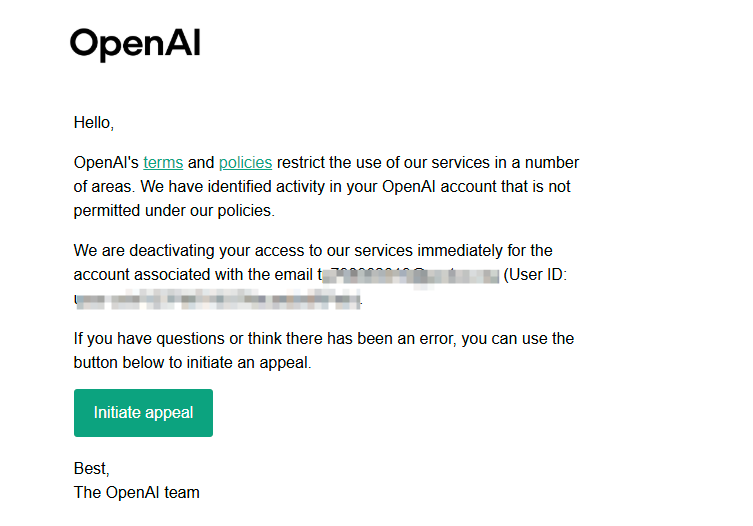

早上醒来一看，ChatGPT号被封了😢：
- 之前用上低价的pro 5x并且发现5小时限额根本用不完时：奥特曼的恩情还不完🖐️😭🖐️
- 之前低价的pro 5x用了不到一周掉订阅&感觉还没蹬爽：奥特曼你坏事做尽😭
- 今早发现正价充的plus会员号直接被封了：O畜😡😠💢

尽管如此，现在感觉OpenAI还是最优的选择，模型能力顶尖还有还是多模态的，Gemini能力不行，A畜过于畜生，国内的GLM抢不着，DeepSeek没有订阅方案，Minimax💩中💩，这辈子不会再用它编程了，Kimi的订阅听说额度不太透明，也不够，能力也不太信任。

感觉封号是因为网络问题，希望是网络问题吧。当前使用的网络方案有两个：
- RackNerd的VPS，原生纯净的IP，但是是机房IP，机房位于圣克拉拉
- 某个万人骑的机场，速度比较快，但是是原生的万人骑机房IP
这俩访问其实都有一定的风险，只是今天突然被封了。

接下来尝试套一个原生的静态家庭IP，这样会安全很多，考虑到有机房VPS的完全控制权（root权限），因此最后的方案大概是VPS+住宅IP的形式。

在cliproxy上买了一个美国的静态IP，一个月是3.8$左右。我的机房在圣克拉拉的，所以IP我就选的是加州圣何塞的。

接下来ssh连上VPS，编辑`/usr/local/etc/xray/config.json`文件。
将：
```json
  "outbounds": [
    {
      "protocol": "freedom",
      "tag": "direct"
    },
    {
      "protocol": "blackhole",
      "tag": "block"
    }
  ]
```
修改为：
```json
  "outbounds": [
    {
      "protocol": "socks",
      "tag": "cliproxy_out",
      "settings": {
        "servers": [
          {
            "address": "你的Cliproxy_IP",
            "port": 你的Cliproxy端口,
            "users": [
              {
                "user": "你的用户名",
                "pass": "你的密码"
              }
            ]
          }
        ]
      }
    },
    {
      "protocol": "freedom",
      "tag": "direct"
    },
    {
      "protocol": "blackhole",
      "tag": "block"
    }
  ]
```
再加上路由规则：
```json
  "routing": {
    "domainStrategy": "AsIs",
    "rules": [
      {
        "type": "field",
        "domain": [
          "domain:openai.com",
          "domain:chatgpt.com",
          "domain:oaistatic.com",
          "domain:oaiusercontent.com"
        ],
        "outboundTag": "cliproxy_out"
      }
    ]
  }
}
```


后记，改成订阅Claude pro，使用静态IP+指纹浏览器Ant browser（GitHub开源项目），用了三天，暂时没出问题，没敢用Claude code


# 使用真原生家庭住宅IP

先前的方案是圣克拉拉VPS+CLI-PROXY静态IP的方案，需要区分几个概念：
- 真家宽IP
- 伪家宽IP
很遗憾上当踩坑了，CLI-PROXY家的的静态IP甚至算不上伪家宽IP，也有相关的博文测评：
- https://blog.katorly.com/Proxy-Cliproxy-Fake-Residential/
真住宅IP的VPS机器价格比较贵，一些可靠的机器价格差不多在35$/month，相关推荐可参考：
- https://linux.do/t/topic/1428787

这次试水的VPS是加拿大的住宅IP的机器，但是不是静态IP而是NAT机器

太不巧了，加拿大那边母鸡寄了，说是“加拿大家宽有滥用现象，正在被运营商审查中，需要个几天的时间才能得到回复，具体几天我也不清楚，只能等。”

安装不了系统，先等着吧。
