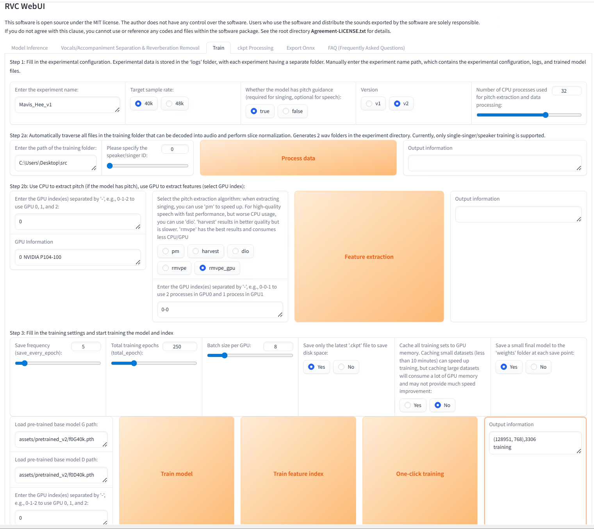
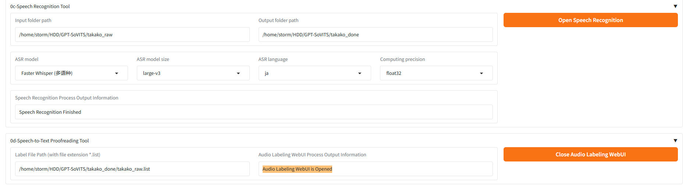
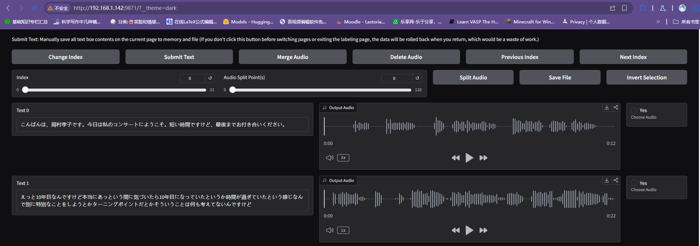
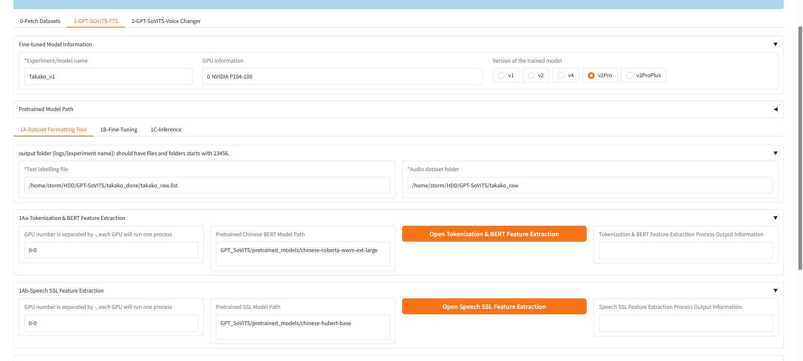
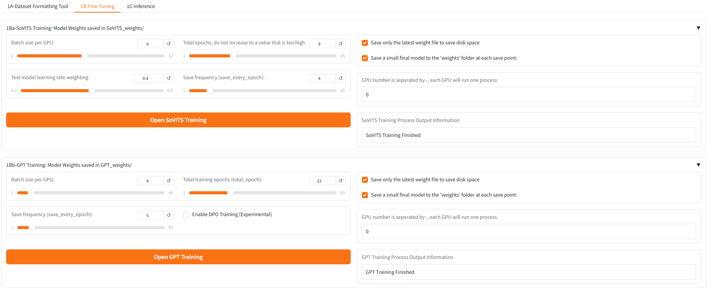
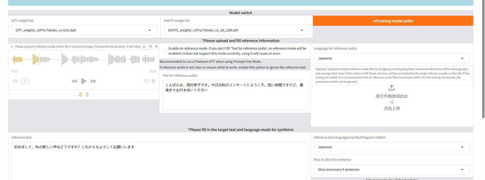

使用的显卡是前几天99捡的P104-100 8GB，亮机卡是AMD R9 270，通过cockpit和ssh访问。CUDA版本如下：
```bash
storm@gentoo ~/HDD $ nvidia-smi
Tue Apr 28 03:16:41 2026       
+-----------------------------------------------------------------------------------------+
| NVIDIA-SMI 580.126.18             Driver Version: 580.126.18     CUDA Version: 13.0     |
+-----------------------------------------+------------------------+----------------------+
| GPU  Name                 Persistence-M | Bus-Id          Disp.A | Volatile Uncorr. ECC |
| Fan  Temp   Perf          Pwr:Usage/Cap |           Memory-Usage | GPU-Util  Compute M. |
|                                         |                        |               MIG M. |
|=========================================+========================+======================|
|   0  NVIDIA P104-100                Off |   00000000:04:00.0 Off |                  N/A |
| 72%   59C    P0            206W /  180W |    3293MiB /   8192MiB |    100%      Default |
|                                         |                        |                  N/A |
+-----------------------------------------+------------------------+----------------------+

+-----------------------------------------------------------------------------------------+
| Processes:                                                                              |
|  GPU   GI   CI              PID   Type   Process name                        GPU Memory |
|        ID   ID                                                               Usage      |
|=========================================================================================|
|    0   N/A  N/A            1405      G   /usr/bin/X                                4MiB |
|    0   N/A  N/A            3817      C   python                                  208MiB |
|    0   N/A  N/A           34612      C   ...D/MSST-WebUI/.venv/bin/python       3078MiB |
+-----------------------------------------------------------------------------------------+
```
使用的软件是MSST-WebUI(https://github.com/SUC-DriverOld/MSST-WebUI)，用uv创建好虚拟环境，安装PyTorch使用代理，之后就可以`python webUI.py`启动了。

首先尝试获得干声。选取的声音是Mavis Hee许美静，也没太细想，主要是觉得他的声音比较干净、细腻。选择的是`Review 1996-1999 精选辑 最爱许美静 精选珍藏16首`这首专辑的大概十首歌左右，时间过长会导致后续的训练时间也相应延长。

MSST软件支持很多MSST模型和UVR模型，第一步是初步的将人声提取出来，使用`vocal_models`类型中的`model_mel_band_roformer_ep_3005_sdr_11.4360.ckpt`模型，`batch_size`参数设置为1,软件提示这个参数的含义是“批次大小, 减小此值可以降低显存占用, 此参数对推理效果影响不大”，但是后续测试发现将参数改为4,但是显存占用依然是3.3GB左右，`overlap`设置为4,,`chunk_size`参数设置为352800，启用tta标志。


得到初步提取的人声后，接下来进行第一轮清洗，去掉混响，此时使用UVR模型，我使用的是`UVR-De-Echo-Normal.pth`，勾选No Echo Only，Batch Size可以设置6, 最大限度地利用显存。

然后进行第二轮清洗，去掉和声，同样使用UVR模型，我用的是UVR-BVE-4B_SN-44100-1.pth，需要注意，此时需要勾选Instrumental Only，用改模型分离到的Vocal==只有和声==。


得到纯净的干声后就可以开始训练了。使用RVC（https://github.com/RVC-Project/Retrieval-based-Voice-Conversion-WebUI），启动后切换到train选项卡，界面如下：

个人使用的关键参数：
- Target sample rate：40K
- Whether the model has pitch guidance (required for singing, optional for speech)勾选为true
- Version为v2
- Please specify the speaker/singer ID设置为0
- Select the pitch extraction algorithm: when extracting singing, you can use 'pm' to speed up. For high-quality speech with fast performance, but worse CPU usage, you can use 'dio'. 'harvest' results in better quality but is slower. 'rmvpe' has the best results and consumes less CPU/GPU选择`rmpve_gpu`
- Save frequency (save_every_epoch)设置为5
- Total training epochs (total_epoch):设置为250，即训练250轮
- Batch size per GPU设置为8，极限吃满GPU显存
- Save only the latest '.ckpt' file to save disk space:勾选Yes
- Cache all training sets to GPU memory. Caching small datasets (less than 10 minutes) can speed up training, but caching large datasets will consume a lot of GPU memory and may not provide much speed improvement:勾选No
- Save a small final model to the 'weights' folder at each save point勾选Yes

随后就可以开始了，首先process data，然后feature extraction，再Train model，最后一定记得train feature index


训练完成之后切换到第一个选项卡刷新一下就能看到训练出来的模型了

# 正式训练
之前的是训练RVC模型，转为唱歌设计的，效果差强人意吧。
接下来试试训练正常说话的模型使用GPT-Sovits。
声音来自歌手——Takako Okamura(岡村孝子)

音频主要来源于其早年的采访和live演唱会，资源较少，不太好找，为了方便的截取人声，为此我还专门vibe coding了一个小工具：

- https://github.com/hydrogen1222/MediaCutter

截取出人声大致进行以下的步骤：
- 初步分离，使用`denoise_mel_band_roformer_aufr33_sdr_27.9959.ckpt`模型去除多余的噪声
- 再清洗，1988年的Live几乎是所有训练音频里收音质量最好的，但是很遗憾，有一些回声，或者说混响，使用`dereverb_mel_band_roformer_anvuew_sdr_19.1729.ckpt`模型去除混响
- 去除Plosives喷卖声，1988年那场Live里孝子距离话筒稍近，部分内容出现了轻微的爆破喷麦声，使用`iZOTOPE RX`去除低频的Plosives，频率阈值设置为120Hz完全足矣
接下来启动GPT-Sovits，识别句子含义，即使用模型将语言转为文字，我使用的方案是Faster Whisper，速度非常快。

得到`.list`文件后务必点击`Open Audio Labeling WebUI`，在终端中会看到另一个监听在局域网的地址，浏览器打开即可看到另一个WebUI：

我自己手动逐条听了一下，也让Gemini帮我检查了一下，删掉了小部分突然中断的不完整句子，修改了一些Whisper模型识别错误的地方，然后就可以报错退出这WebUI回到主WebUI了。

受限于音频长度（总长度约5min）和硬件，使用的训练模型是V2PRO

1A完成后切换到1B

首先训练SoVITS模型，然后训练GPT模型，其中训练GPT模型时对显存的开销更大，所以Batch size降低为4。

训练完毕之后就可以开始推理了，切换到`1C-Inference`选项卡

参考音频来自训练干声，大意是：
>
>こんばんは、岡村孝子です。今日は私のコンサートにようこそ。短い時間ですけど、最後までお付き合いください

想说的话是（推理音频）：
>
>初めまして、私の新しい声はどうですか？これからもよろしくお願いします

由于训练音频中的大部分声音比较平和，所以推理出的声音也比较平和，如果要推理出比较情感更浓厚的声音的话可以通过标点符号的控制来实现。

