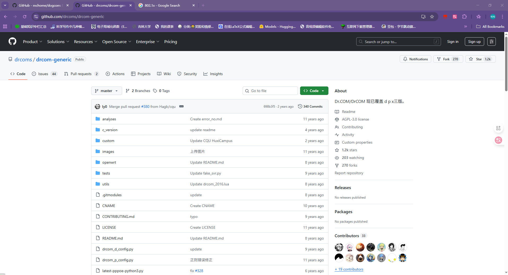
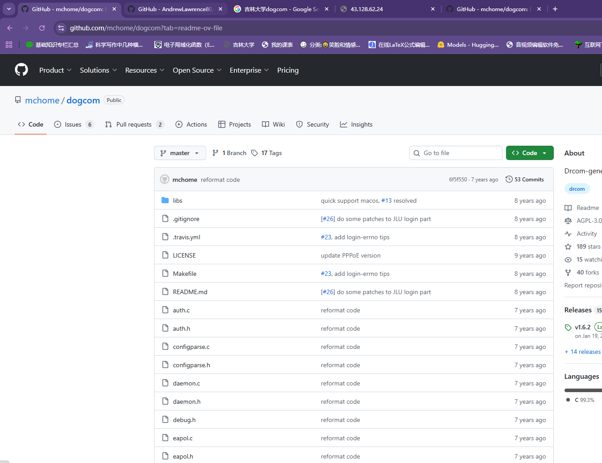
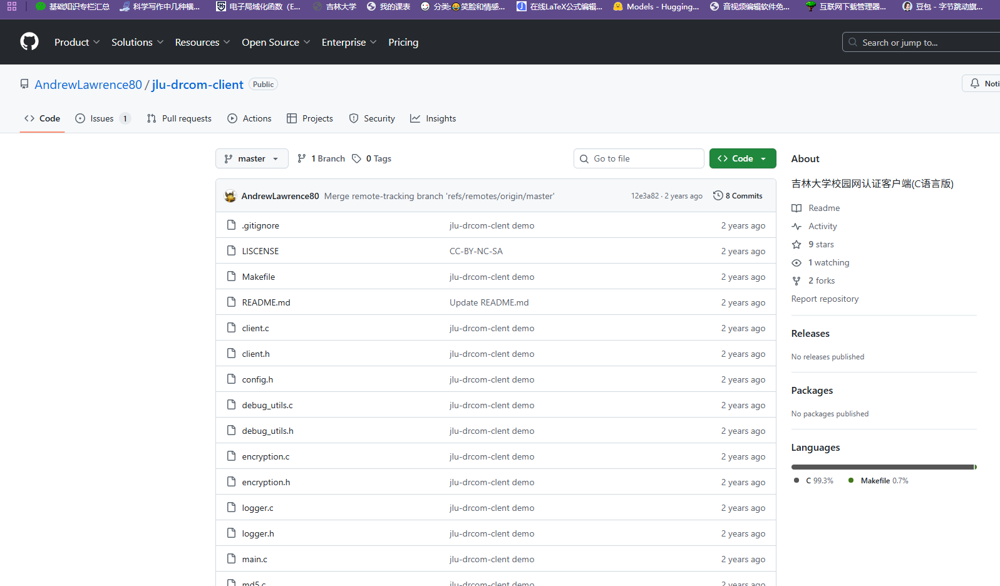
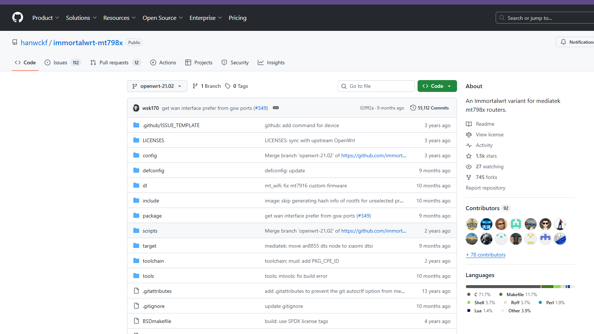
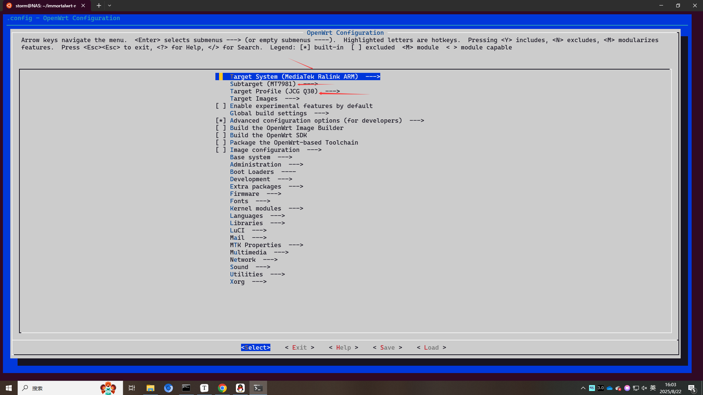
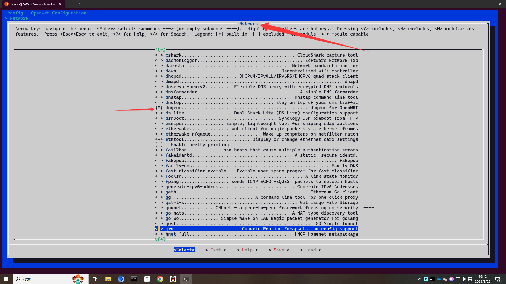
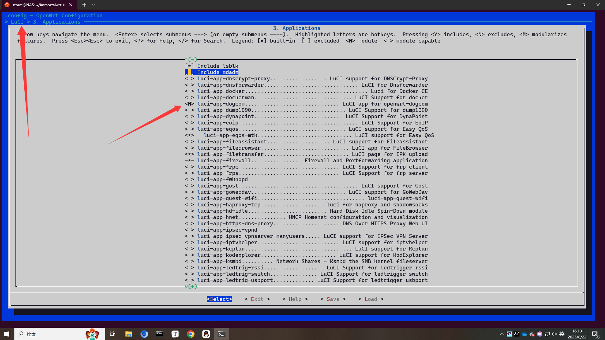
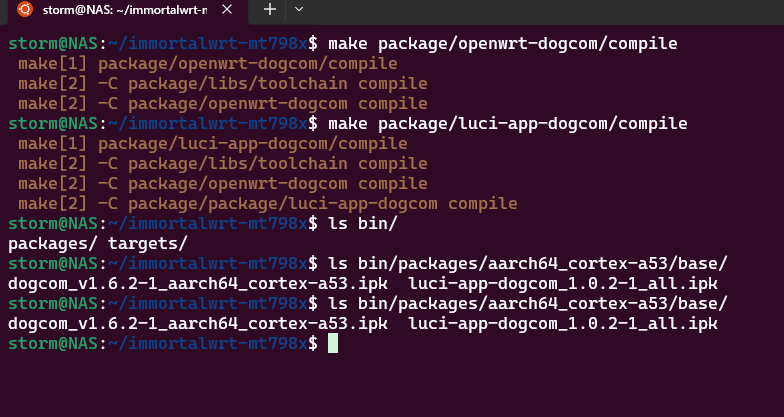
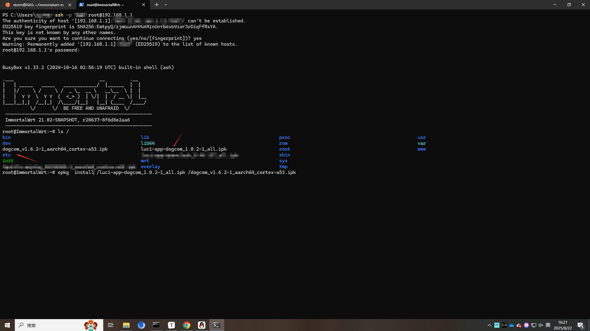

仅供学习、交流。

好久没来博客了，分享一下近期折腾的东西以及踩的坑吧。

之前尝试过使用`红米AC2100`路由器实现校园网认证，但是没有记录，并且其处理`MT 7621`性能孱弱，干不了太多事，这次换成了稍微热门一点的——`捷稀 JCG Q30 Pro`，处理器是`MT 7981B`,架构为`Arm Cortex-A53 (1.3 GHz, dual-core)`，可以干的事更多了，不过个人还是主要用于`dogcom`认证JLU的校园网以及搭建`openclash`实现透明代理。

## 安装ImmortalWRT

首先是替换路由器官方的固件，捷稀JCG Q30 Pro似乎是中国移动的固件，可以为其刷入OpenWRT，也可刷入衍生版比如Immortalwrt、QWRT等等，说来话长，就不提供教程了，具体教程在恩山论坛。

# SDK编译

路由器固件用的是`Immortalwrt`，爱来自恩山大佬😀，原帖链接：https://www.right.com.cn/forum/forum.php?mod=viewthread&tid=8398454&highlight=%E6%8D%B7%E7%A8%80%2BJCG%2BQ30%2BPro

泥吉校园网使用的是哆点客户端，即Dr.COM认证(包括DHCP、PPPoE、802.1x三种认证方式，即D版、P版、X版)，桌面端(windows、Linux、MacOS)下载客户端认证，然而Dr.COM备受吐槽、嫌弃，Arm路由器也无法使用Dr.COM。各位民间大佬分析了DrCOM的通信协议，开发了`drcom-generic`。当时的开发者是通过`python2`脚本来代替Dr.COM实现校园网认证的，下图是项目仓库。



然而，现在`python3`才是主流，`OpenWRT`及其衍生版本的官方仓库中早已抛弃了`python2`，在离线环境安装`python2`还是比较痛苦的。因此，后续大佬使用C语言重新复现`drcom-generic`的功能，将新项目命名为`dogcom`，以及后续有大佬开发了泥吉专属的C语言版客户端。





本次使用前者，开发者大佬开源了源代码，需要将源代码编译为`MT 7981`可用的二进制文件，由于`MT 7981`性能远不如AMD64处理器，因此编译在Linux(WSL)上完成。笔者使用的机子为2*2676V3，固件为Immortalwrt，首先搭建交叉编译环境。

交叉编译环境需要固件的SDK，然而Immortalwrt并没有现成的关于`MT 7981`的SDK，还得先手动编译SDK😅。进入适用于处理器的Immortalwrt项目仓库，如下图。



`一定一定一定`听劝，使用推荐的`Ubuntu 20.04 LTS`。高版本的gcc编译套件可能会报错，`Arch`系已踩过坑，降级gcc版本够折腾的😂。以及`Rocky Linux 10`可能会遇到`ninja`编译报错。

首先更新源，然后更新系统，接着安装所需依赖。

```bash
sudo apt update -y
sudo apt full-upgrade -y
sudo apt install -y ack antlr3 asciidoc autoconf automake autopoint binutils bison build-essential \
  bzip2 ccache clang clangd cmake cpio curl device-tree-compiler ecj fastjar flex gawk gettext gcc-multilib \
  g++-multilib git gperf haveged help2man intltool lib32gcc-s1 libc6-dev-i386 libelf-dev libglib2.0-dev \
  libgmp3-dev libltdl-dev libmpc-dev libmpfr-dev libncurses5-dev libncursesw5 libncursesw5-dev libreadline-dev \
  libssl-dev libtool lld lldb lrzsz mkisofs msmtp nano ninja-build p7zip p7zip-full patch pkgconf python2.7 \
  python3 python3-pip python3-ply python3-docutils qemu-utils re2c rsync scons squashfs-tools subversion swig \
  texinfo uglifyjs upx-ucl unzip vim wget xmlto xxd zlib1g-dev
```

然后就可以克隆代码，开始搭建交叉环境了。

```bash
git clone --depth=1 https://github.com/hanwckf/immortalwrt-mt798x.git 
cd immortalwrt-mt798x
scripts/feeds update -a
scripts/feeds install -a
```

如果是Win11的话，可以在WSL设置中将网络模式设置为镜像mirror，然后在Windows上开启代理，那么WSL中就能连上GitHub。

接着`cp -f defconfig/mt7981-ax3000.config .config`拷贝配置文件，然后`make menuconfig`进一步编辑，如下图。



确保上面三项正确。

我们只需要编译一下SDK(不需要生成`tar.xz`文件)搭建交叉环境就可以了，不需要编译整个`Immortalwrt for MT 798x`因此执行`make toolchain/install -j$(nproc)`而不是`make -j$(nproc)`。

## dogcom编译

交叉编译环境搭建好后，开始编译dogcom.

在`Immortalwrt`根目录执行:

```bash
git clone https://github.com/mchome/openwrt-dogcom.git package/openwrt-dogcom
```

```bash
git clone https://github.com/mchome/luci-app-dogcom.git package/luci-app-dogcom
```

前者为`dogcom`本体，后者为图形化界面。然后再次:

```bash
make menuconfig
```

分别添加`dogcom`和`luci-app-dogcom`





然后save，重新生成`.config`配置文件，然后就可以开始编译这两个软件包了（dogcom及其luci图形界面）。

执行：

```bash
make package/openwrt-dogcom/compile
make package/luci-app-dogcom/compile
```

这两个软件包都不大，很快就编译好了，生成的`ipk`文件（适用于OpenWRT及其衍生发行版的安装包文件）在`/bin/packages`目录下：



## 安装dogcom及图形化界面

拿到`ipk`文件后就可以安装了。使用ssh登录`Immortalwrt`。使用`winscp`上传两个文件，`OpenWRT`及其衍生版的包管理器为`opkg`。



## 配置校园网

具体的设置可以参考：https://www.bilibili.com/opus/1063006213972688900#reply273467151024

比较麻烦的是配置静态IPV4地址，很容易配置错误导致连不上认证服务器。

## 参考资料

https://www.bilibili.com/opus/1063006213972688900#reply273467151024

https://shenshichao.notion.site/OpenWrt-JLU-fb5132d707114e22a4486b0e657421f0

https://www.right.com.cn/forum/thread-215978-1-1.html

https://github.com/mchome/dogcom?tab=readme-ov-file

https://deconf.xyz/2019/04/13/openwrt-dogcom/#0x03-%E5%AE%89%E8%A3%85dogcom%E5%AE%89%E8%A3%85%E5%8C%85-%E5%90%AF%E5%8A%A8%E8%AE%A4%E8%AF%81%E7%A8%8B%E5%BA%8F

