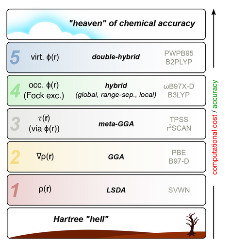

用了一年多的Orca，再回过头来好好看看manual吧，权当“复习”了，正所谓温故而知新。

# Orca6.1概览
手册中对Orca的定义是：
>An ab *initio*, DFT and semiempirical SCF-MO package

Orca起源于1999, 名字由Frank Neese在观看鲸鱼表演的时候所拟，大体上是一个`general-purpose quantum chemistry package`。它可免费用于学术用途，包含了众多的量子化学计算方法，比如半经验方法、密度泛函理论方法、多体扰动方法、耦合簇方法以及多参考方法，目前由马普所的`Department of Molecular Theory and Spectroscopy`主导开发。

安装没什么好说的，并不需要编译，只需要解压，添加环境变量即可，可参考公社博文：http://sobereva.com/451

Orca的许多功能都于`xtb`模块紧紧联系，Orca本身集成了xtb，但Grimme实验室的软件包也集成到ORCA工作流程中，因此建议安装它。

可视化软件可以使用卢老师的`Multiwfn`。

# 计算概览

## A simple example
一个大概的示例如下：
```inp
! METHOD
*XYZ CHARGE MULTIPLICITY
Atom1 X1 Y1 Y1
Atom2 X2 Y2 Y2
*
```
还是比较浅显易懂的，
一个具体的计算实例如下：
```inp
! HF DEF2-SVP
*XYZ 0 1
H 0 0 0
H 0.74 0 0
*
```
在这个例子中，使用的方法是Hartee-Fock theory，使用def2-SVP基组，体系总共有两个 原子，没有净电荷，自旋多重度为1,是单重态的，体系仅有的两个原子的坐标使用Cartesian笛卡尔坐标，单位是Å，坐标用\*符号结束，这个体系的计算任务类型是Energy。
在自己的、无Slurm作业系统的笔记本电脑上，我习惯用如下命令启动任务，重定向标准输出和标准错误到外部的文件：
```bash
orca 1.inp > 1.out 2>&1 &
```
实时查看 ：
```bash
storm@storm ~/test $ tail -f 1.out   
     doi.org/10.1016/s0009-2614(00)00662-x  
​  
Timings for individual modules:  
​  
Sum of individual times          ...        0.195 sec (=   0.003 min)  
Startup calculation              ...        0.063 sec (=   0.001 min)  32.4 %  
SCF iterations                   ...        0.101 sec (=   0.002 min)  51.8 %  
Property calculations            ...        0.031 sec (=   0.001 min)  15.8 %  
                             ****ORCA TERMINATED NORMALLY****  
TOTAL RUN TIME: 0 days 0 hours 0 minutes 0 seconds 253 msec  
```

我的命名习惯是`1.inp`，手册提到，Orca的输入文件后缀通常是.inp，但.txt也是OK的，不过我基本没见到过。

不同的体系应当选择不同的方法，这是一个难题，Orca中涉及到的方法多种多样，我本人主要接触过密度泛函、一点半经验方法、一点post-HF方法。

## 一篇手册推荐的文献的阅读

手册为初学者推荐了一片综述文章：[https://onlinelibrary.wiley.com/doi/10.1002/anie.202205735](https://onlinelibrary.wiley.com/doi/10.1002/anie.202205735)，这个章节姑且当作文章的粗糙翻译、总结吧


文章主要讨论的是DFT方法，即使对于基本的密度泛函原子轨道基组合的选择，也有数百或数千种可能的组合。对于小分子而言这不是什么太大的问题，因为可以“sledgehammer to crack a nut”，大锤砸小钉，但处理50-100个原子或许多相关低能构型的系统，需要在方法选择上做出批判性的妥协，以便使计算成本可控


> Unfortunately, in some QM programs, the default methods are outdated, which may tempt inexperienced users to apply no longer recommended methods to circumvent these complications. A prominent example is the popular B3LYP[9](https://onlinelibrary.wiley.com/doi/10.1002/anie.202205735#anie202205735-bib-0009), [10](https://onlinelibrary.wiley.com/doi/10.1002/anie.202205735#anie202205735-bib-0010)/6-31G* functional/atomic orbital basis set combination that is still frequently used even though it is known to perform poorly even for simple cases

这说的应该是是G开头的某软件😂，（但它的地位仍是不可否认的）

### 几个需要考虑的因素

#### 电子结构

当前体系是单参考体系还是多参考体系？多参考系统通常包括==自由基==、==低带隙系统==、==开壳层分子分解过程的过渡态==以及==过渡金属复合物==。具体来说，部分填充d壳的3d金属更容易出现多参考点的情况，因为它们的配体场强于4d和5d金属。在这些系统中，可能存在多个近似等价的电子占据（不同轨道占据情况），导致电子结构复杂化。因此，对于这些情况，应在事先检查是否存在所谓的多参考点情况。多参考系统不适用常规的DFT方法，其判定有些困难（[http://bbs.keinsci.com/thread-19007-1-1.html](http://bbs.keinsci.com/thread-19007-1-1.html)）。

#### 溶剂作用

固体中的邻近分子或溶液中的溶质分子可能对整个系统的结构和性质产生较大的影响，因此对于凝聚相化学，应在任何情况下应用合适的溶剂模型。DFT背景下最常见的方法是使用包含分子与溶剂隐含交互作用的连续溶剂模型，这些交互作用通过Hamiltonian中的有效势能隐含实现。这意味着在计算中==没有实际的溶剂分子==，包括：

- conductor-like polarizable continuum model (CPCM)
    
- solvation model based on the molecular electron density
    
- conductor-like screening model
    
- conductor-like screening model for real solvents (COSMO-RS)
    
- direct conductor-like screening model for real solvents (DCOSMO-RS)
    

其中，CPCM和COSMO是纯电静模型，缺乏来自溶剂的空腔创建所花费的能量以及溶剂与溶质之间的吸引性范德华相互作用，这些相互作用导致溶剂可接触表面积显著变化时出现重大错误。SMD、COSMO-RS和DCOSMO-RS包含这些贡献，因此被推荐。然而，应注意==COSMO-RS不能用于几何优化或频率计算==，并且需要用DCOSMO-RS来替换。

#### 分子构型

对于高度灵活的结构，能量、核磁共振光谱或光旋光值等分子性质可能无法用单一结构来充分描述。在有限温度下，各种共轭体会被激活，整体性质必须以热平均的方式描述每个共轭体的独特性质。这涉及到构象搜索，。

#### 泛函的选择

对于天梯图，随着级别的增加，准确性普遍提高，但同级别功能之间的性能差异==可以很大==。级别3以下的功能不包含Fock交换，被称为局部或半局部功能，而Fock交换的计算是一个计算瓶颈。

两个常常出现的错误是self-interaction error (SIE) and missing long-range correlation effects。尽管DFT缺乏对长程相互作用的描述是一个基本的缺陷，但现在可以通过包括几个可靠的分散修正（我们推荐D4、D3或VV10）轻松修复。文献认为：

> 现在在任何DFT处理中都不可或缺，除非研究分散效应的影响

引用卢老师的那句话（[http://sobereva.com/413](http://sobereva.com/413)，**谈谈“计算时是否需要加DFT-D3色散校正？”**）：

> 虽然上面已经讲了很多，但肯定有些初学者由于基础知识不足，面对一些情况对于加不加D3还是会迷糊。简单一句话：**不知道该不该加就加**。反正又免费用着又方便，且有益无害。

不过，有些泛函已经内置色散描述，尤其是带 **VV10/rVV10** 这类非局域相关项的。像 **ωB97M-V** 就属于这一类，可能就不必再加入DFT-D校正了🤔？

此外，文献还提到，明尼苏达泛函应当谨慎使用：

- they are often very sensitive to the size of the integration grid and the basis set,[14](https://onlinelibrary.wiley.com/doi/10.1002/anie.202205735#anie202205735-bib-0014), [106](https://onlinelibrary.wiley.com/doi/10.1002/anie.202205735#anie202205735-bib-0106) which may lead to discontinuities in potential-energy surfaces and, in turn, problems with geometry optimizations.
    
- their performance strongly depends on the chemical system
    
- these functionals can be problematic for noncovalent interactions
    

#### 基组的选择
基组的选择会影响到计算的精度和消耗时间，BTW，量子化学计算中用到的基组大概有如下几种：
- Gaussian型基函数（Orca和Gaussian所用）
- 平面波基函数
- Slater型基函数
DFT在原理上可以数值收敛到完整基组（CBS）极限，而在实践中通常不这样做，使用有限基组，引入了一些错误。然而，DFT相关的基准集错误通常比基于相关波函数理论的方法要小。
基组的最重要特征是其完整性，通常称为基组大小。它反映了表示给定电子的函数数量。对于基组过小而引起的误差，称为基组不完整性错误（BSIE），这是由于线性组合原子轨道扩展中功能空间不足所致。通常情况下，价电子的描述最为关键，因此基组通常根据所谓的基数数字进行分类，该数字表示每个占据价轨道的独立基函数的数量。相应的大小通常称为双（DZ）、三重（TZ）、四重（QZ）、…，zeta，其中zeta一词指的是每个占据（在原子基态）价轨道的独立原子函数的数量。
基组太小也会引起另一个与基组相关的误差：空间上紧密的原子和碎片开始相互“借用”基函数，导致更紧凑结构的人为能量降低，这称为基组重叠误差（BSSE），它通常仅与弱相互作用和非共价键合的分子间络合物相关。因此，需要了解==哪些计算对基集大小特别敏感==，以及哪些计算值得投资于因较大的基集而增加的计算需求以显著改善结果。
最常用的高斯型收缩基集属于Pople（例如6-31G）、Dunning（cc-pVXZ）、Jensen（pc（seg）-X）和Ahlrichs（def2-XVP）族。文献指出，对于标准DFT处理，==不建议使用Pople型基集==， 如6-31G\*或6-311G**，以及Dunning型基集cc pVXZ（X=D，T，…），这主要是因为Ahlrichs及其的基集更有效，且更适用于周期表的大部分。

#### 有限温度效应
程序所计算的，是某个核构型下的电子能，这个量本身不是“298 K 下测得的热力学量”，而更像是0 K、静止核框架下的势能面上的一个点。
实验测到的通常不是裸电子能，而包括了：
- 零点振动能
- 热修正
- 熵
对默认的电子结构求解，温度影响通常不直接体现。
对几何结构与实验比较来说，有影响，但大小依体系而定：
- 对普通共价键长，有限温度效应通常不大
- 但对以下情况可能明显：
    - 弱相互作用
    - 氢键
    - 构象平衡
    - 柔性分子
    - 晶体热膨胀
    - 软振动模式
    - 吸附体系
    - 相变附近体系
对反应热、焓、自由能的==影响非常大==
### 计算的匹配问题
- meta-GGA，比如PBE或r²SCAN即使结合相对较小的基组也能得到良好的几何结构。 然而，对于能量计算，至少需要杂化甚至双杂化泛函才能达到足够高的精度。
- 双杂化泛函对大多数有机体系具有高精度，但对于具有小HOMO-LUMO能隙的体系（例如3d过渡金属配合物）应避免使用。
- def2-QZVPP是一种适用于各类计算的高精度基组。它能提供接近基组极限的SCF能量，同时关联能表现也十分出色。虽然计算成本较高，但结合RI和RIJCOSX技术并采用并行化处理后，仍常被用于最终的单点能计算。在使用这类大型基组时，应同步提高DFT和RIJCOSX中积分网格的精度——若因网格数值噪声而限制本可实现的高精度计算，将是十分可惜的。

### 输入文件的结构
输入块以“%”开始，后跟块名，并以“end”结束。 例如：
```inp
%method  
  method HF
END
```
字符串（如文件名）必须用引号括起来。例如：
```inp
%scf
  MOInp  "Myfile.gbw"
end
```
某些输入块关键词要么开启一个嵌套子块，该子块必须用额外的结束标记来闭合，要么具有特定的语法，不同于上述简单的变量赋值。例如：
```inp
%scf
  Guess PModel  # variable assignment
  SOSCF  # nested sub-block
    start 0.002  # variable assignment
  end  # closes the SOSCF sub-block
end
%mdci
  # special syntax
  MP2FragInter {1 1} {2 2}  
end
%basis
  NewGTO  # nested sub-block
    # special syntax inside
    H "def2-SVP"
    S 1
    1 0.05 1.0
  end  # closes the NewGTO sub-block
end
```
如果提供了两个不同的轨道基组（例如！def2-SVP def2-TZVP），则后者具有优先权。同样适用于同类型的辅助基组（例如！def2/J SARC/J）。
Orca提供了一个全局变量MaxCore，用于为所有这些模块分配一定量的暂存内存，比如：
```inp
%MaxCore 2000
```

意思是将==每个处理核心==的暂存数组限制设置为2000 MB。请注意，程序可能占用超过此值的内存——此大小仅指主要工作区域。因此，建议您设置不超过物理内存75-80%的数值。某些内存密集型操作在内存不足时会耗时更长，而其他操作若MaxCore不足则会完全中止。==默认值为4GB==，对于大多数标准DFT计算已足够充裕。对于耦合簇等计算，建议至少使用==8GB==。
ORCA会生成多个输出文件以及许多临时文件，这些临时文件在成功运行结束后会被删除。为了避免文件名冲突，所有生成的文件都以相同的前缀或基本名称开头。这通常是通过移除输入文件的扩展名来推断的，例如，使用MyJob.inp运行ORCA会创建MyJob.gbw、MyJob.properties.txt等文件。也可以通过%base变量显式设置基本名称。在下面的示例中，无论输入文件名称如何，所有生成的文件名都将以job1开头：
```inp
%base "job1"
```

ORCA支持包含多个作业的输入文件。此功能旨在简化对同一分子进行的一系列紧密相关计算或对不同分子的计算。实现此功能的目标包括：
- 使用不同理论方法和/或基组计算单个分子的分子性质。
- 在一系列具有相同设置的分子上进行计算。
- 几何优化后进行更精确的单点计算，可能还包括性质计算。
- 粗略计算以提供良好的初始轨道，随后可用于更大基组下的进一步计算。
这个功能还挺实用的，不过我还没用过，趁热打铁试一下。
首先尝试手册中说的`$new_job`这种写法：
```inp
! B3LYP D3 def2-SVP def2/J RIJCOSX opt freq tightSCF noautostart miniprint  
%maxcore 2500  
%pal nprocs 20 end  
* xyz 0 1  
C   -1.80740000   0.00000000   0.00000000  
C   -1.37390000   0.90040000   0.00000000  
C   -0.40020000   1.12710000   0.00000000  
C    0.38020000   0.50020000   0.00000000  
C    1.33390000   0.80700000   0.00000000  
C    1.92080000   0.00000000   0.00000000  
C    1.33390000  -0.80700000   0.00000000  
C    0.38020000  -0.50020000   0.00000000  
C   -0.40020000  -1.12710000   0.00000000  
C   -1.37390000  -0.90040000   0.00000000  
H   -2.87740000   0.00000000   0.00000000  
H   -2.04289280   1.73547403   0.00000000  
H   -0.16251652   2.17036725   0.00000000  
H    1.66579435   1.82422473   0.00000000  
H    2.99080000   0.00000000   0.00000000  
H    1.66579435  -1.82422473   0.00000000  
H   -0.16251652  -2.17036725   0.00000000  
H   -2.04289280  -1.73547403   0.00000000  
*  
  
$new_job  
  
! B3LYP D3 def2-TZVPP def2/J RIJCOSX tightSCF noautostart miniprint  
%maxcore 2500  
%pal nprocs 20 end  
* xyz 0 1  
C   -1.80740000   0.00000000   0.00000000  
C   -1.37390000   0.90040000   0.00000000  
C   -0.40020000   1.12710000   0.00000000  
C    0.38020000   0.50020000   0.00000000  
C    1.33390000   0.80700000   0.00000000  
C    1.92080000   0.00000000   0.00000000  
C    1.33390000  -0.80700000   0.00000000  
C    0.38020000  -0.50020000   0.00000000  
C   -0.40020000  -1.12710000   0.00000000  
C   -1.37390000  -0.90040000   0.00000000  
H   -2.87740000   0.00000000   0.00000000  
H   -2.04289280   1.73547403   0.00000000  
H   -0.16251652   2.17036725   0.00000000  
H    1.66579435   1.82422473   0.00000000  
H    2.99080000   0.00000000   0.00000000  
H    1.66579435  -1.82422473   0.00000000  
H   -0.16251652  -2.17036725   0.00000000  
H   -2.04289280  -1.73547403   0.00000000  
*
```
然后再尝试另一种写法：
```inp
%Compound

  New_Step
    ! B3LYP D3 def2-TZVPP def2/J RIJCOSX tightSCF noautostart miniprint
    ! aim
    % maxcore=3000
    %pal nprocs 8 end
    * xyz 0 1
		C     -1.80740000    0.00000000    0.00000000  
		C     -1.37390000    0.90040000    0.00000000  
		C     -0.40020000    1.12710000    0.00000000  
		C      0.38020000    0.50020000    0.00000000  
		C      1.33390000    0.80700000    0.00000000  
		C      1.92080000    0.00000000    0.00000000  
		C      1.33390000   -0.80700000    0.00000000  
		C      0.38020000   -0.50020000    0.00000000  
		C     -0.40020000   -1.12710000    0.00000000  
		C     -1.37390000   -0.90040000    0.00000000  
		H     -2.87740000    0.00000000    0.00000000  
		H     -2.04289280    1.73547403    0.00000000  
		H     -0.16251652    2.17036725    0.00000000  
		H      1.66579435    1.82422473    0.00000000  
		H      2.99080000    0.00000000    0.00000000  
		H      1.66579435   -1.82422473    0.00000000  
		H     -0.16251652   -2.17036725    0.00000000  
		H     -2.04289280   -1.73547403    0.00000000  
    *
  Step_End
  
  Read_Geom 1
  ReadMOs(1);

  New_Step
	! B3LYP D3 def2-TZVPP def2/J RIJCOSX tightSCF noautostart miniprint
	! aim
	%maxcore     1000
	%pal nprocs   8 end
  Step_End

End
```