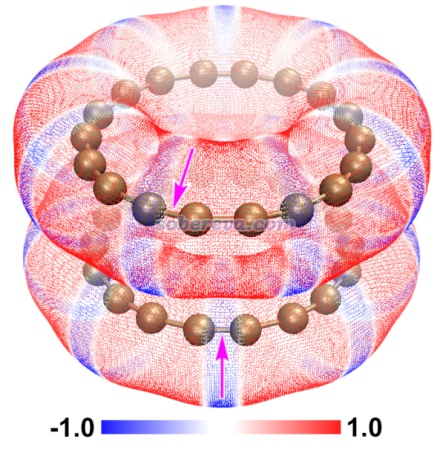
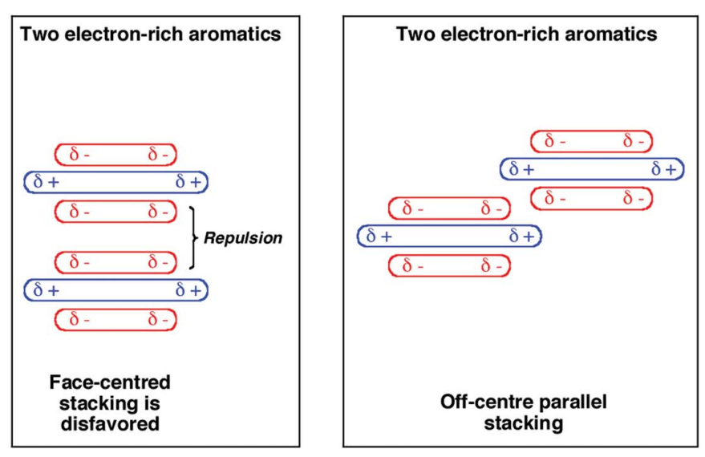
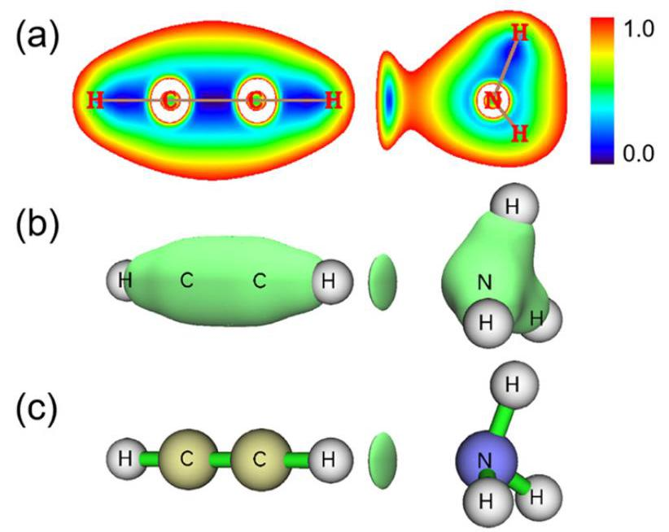
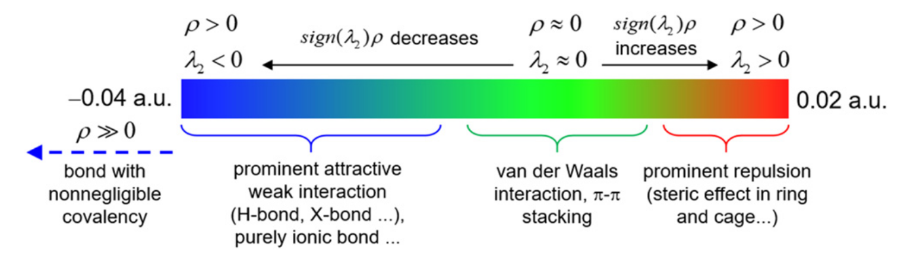
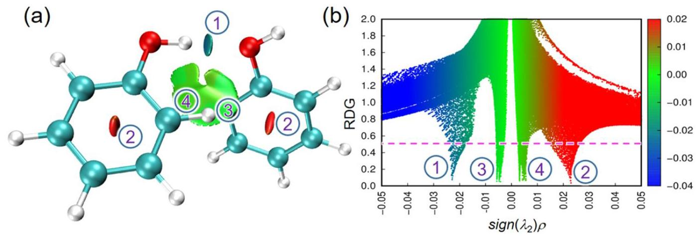
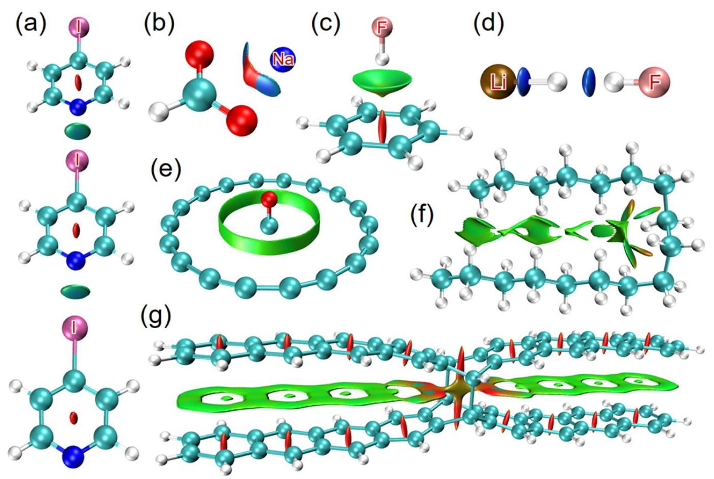

pi-pi作用的定义和说法比较乱，Sob老师认为：pi-pi作用是相距较近的两个片段上彼此朝向相对的pi电子之间的独特的色散吸引作用。

1. pi-pi作用可以是分子间的也可以是分子内的，满足以上定义即可
2. 诸如苯分子里面的pi电子之间的作用不叫pi-pi作用，那属于共享电子作用
3. 两套pi电子的分布必须近乎彼此相对才可能算pi-pi作用。而诸如两套pi电子近乎肩并肩挨着就不能算pi-pi作用，像是不能说环丁二烯里面两套近乎定域的pi电子之间是分子内pi-pi作用
4. “相距较近”一般是在4.0-4.5埃以内。也不是说更远距离就完全没有pi-pi作用了，只不过由于色散作用随作用距离r呈$-\dfrac{1}{r^6}$快速衰减行为，因此距离稍微一远pi-pi作用就非常弱了，就不太值得一提了。但相互作用的片段间距离也不能太近，若显著小于相接触的原子的范德华半径之和，则显著的位阻互斥作用会远大于pi-pi吸引作用，使得pi-pi作用也相对不值得一提
5. pi-pi作用最常出现在碳原子间，因为碳最容易带显著的pi电子。碳的Bondi和CSD范德华半径分别为1.70和1.77埃。如果没有特殊的因素影响相互作用距离的话，在平衡结构（势能面极小点结构）下，C-C间的pi-pi作用出现在3.4-3.6埃左右是最常见的
6. pi-pi作用属于弱相互作用和非共价相互作用范畴。虽然名义上算作弱相互作用，但实际强度可大可小，直接取决于作用面积，详见后文
7. 有一个词叫pi-pi堆积（pi-pi stacking），这个词往往和pi-pi作用混用。但这个词更适合用来形容由于pi-pi作用的吸引效果使得相互作用的两个部分发生紧密结合从而产生的彼此堆积的结构特征

比如下面这个图是晕苯二聚体的局部极小点构型 （最小点为垂直构型）——平行错位构型，有一部分pi电子相对，算作pi-pi作用

pi-pi作用是一种非共价相互作用，内在本质是来自于相距较近的pi电子之间的色散作用。pi-pi堆积的体系有一个普遍特点是在极小点结构下，pi-pi作用区域的原子间通常不是正好对着，而是相互错位。下图是晕苯二聚体的俯视图，其中一个晕苯用红色显示，可以很清楚看到错位特征，即一层的碳对着另一层的六元环中心。一层层堆叠的石墨中每一层之间也同样是这样错位的。这可能是[因为错位的结构下的静电相互作用能更负（静电吸引作用更强）](https://pubs.rsc.org/en/content/articlelanding/2022/cp/d2cp00714b)，也可能是因为[错位的结构下比严格面对面的结构下的原子间的Pauli互斥更低](https://pubs.rsc.org/en/content/articlelanding/2020/sc/d0sc02667k)。

下图为[二聚体极小点结构下的单体的静电势着色的分子范德华表面的叠加图（18碳环）](https://www.sciencedirect.com/science/article/pii/S0008622320309076#bib6)，若上层静电势为蓝色则下层为红色，这样构型下的静电吸引作用比一个个碳原子彼此精确对着的时候更强。

虽然pi-pi相互作用与静电有些关系，但不可过分夸大静电的作用，pi-pi作用绝不是静电相互作用，比如下面这张描述pi-pi作用的图就是不合理的。

pi-pi相互作用能量的深入剖析可以借助Sob老师的提出的sobEDAw能量分解方法，本人比较菜，还没有阅读过相关内容。

pi-pi堆积的结构在现实环境中一般很容易发生分子间相对滑移（除非有额外的位阻效应等阻碍），这是由于==滑移导致能量变化很小。==

pi-pi相互作用的强度与涉及pi-pi作用的原子数目显著相关，若射击pi-pi作用的原子数目很多，相互作用能量甚至能够达到接近化学键的强度。

如果不知道pi-pi作用在哪， 不方便定义片段，则应当用[使用IRI方法图形化考察化学体系中的化学键和弱相互作用](http://sobereva.com/598)介绍的IRI方法，可以把体系中所有相互作用区域全都展现出来，也包括化学键作用区域

# 考察体系的弱相互作用

## 对相互作用的认识

化学体系中的相互作用主要分为化学键作用和弱相互作用（区别于物理学中的术语）两大类。

从相互作用能上看，前者一般强度比较强，共价键和离子键都属于此类，也可以叫强相互作用；而后者一般强度比较弱，比前者通常弱一个数量级。弱相互作用既可以是分子间的，也可以是分子内的。弱相互包括范德华作用、pi-pi堆积作用、氢键、二氢键、卤键，以及后来很多人炒作概念而提出来的碳/硫/磷/金/银/铜...键等等，还有个词叫做非共价相互作用（noncovalent interaction），这个词的范畴相当于==弱相互作用和离子键的并集==。

弱相互作用形式多样，但主要本质只有两个：

- 静电相互作用。可以起到互斥作用也可以起到吸引作用，看具体情况（体系，以及相对位置）。这里说的静电相互作用也把极化作用包含进去了。
  - 色散作用。它起到==吸引作用==。必须从量子力学角度才能予以解释。而从量化理论角度来讲，它对应于==电子的长程的库仑相关作用==。

一般强度的氢/二氢/卤/硫/磷键等等是以==静电吸引主导，色散作用为辅构成的==，这点通过能量分解也可以体现出来。而一般说的范德华相互作用，以及pi-pi堆积作用的本质都是色散作用。

注：

1. 还有个作用叫交换互斥，它起到互斥作用，不管算什么类型相互作用都要考虑这个，==只有在较近距离（比如小于两个原子的范德华半径和）的时候才开始凸显出来，且原子间距离越近此作用越大==。正是这个作用使得弱相互作用的势能曲线总是有极小点，而不会令原子间距离因为静电吸引和色散作用而无限减小。
2. “范德华作用”这个词描述的是电中性的两个原子之间的非共价相互作用，故本质包含了交换互斥和色散吸引作用两个部分。这个词可以囊括比如两个氩原子间的相互作用的全部内涵。这个词也可以用来描述无极性分子间的全部相互作用（但实际上，没有绝对严格意义的无极性分子，比如就连一般说的无极性分子氮气也有四极矩，可以认为是局部极性，因此氮气之间也有静电相互作用，讨论见http://sobereva.com/209。但本文就不咬文嚼字了）。至于一些初级的教材里说的范德华作用包括“诱导力、色散力、取向力”，这种歪曲的说法应该彻底从量化研究者的脑海中删除
3. “范德华作用”这个词描述的是电中性的两个原子之间的非共价相互作用，故本质包含了交换互斥和色散吸引作用两个部分。这个词可以囊括比如两个氩原子间的相互作用的全部内涵。这个词也可以用来描述无极性分子间的全部相互作用（但实际上，没有绝对严格意义的无极性分子，比如就连一般说的无极性分子氮气也有四极矩，可以认为是局部极性，因此氮气之间也有静电相互作用，讨论见http://sobereva.com/209。但本文就不咬文嚼字了）。至于一些初级的教材里说的范德华作用包括“诱导力、色散力、取向力”，这种歪曲的说法应该彻底从量化研究者的脑海中删除
4. 《透彻认识氢键本质、简单可靠地估计氢键强度：一篇2019年JCC上的重要研究文章介绍》（http://sobereva.com/513）。

## 选择合适的方法分析说相互作用

• IGMH：如果你的目就是分析特定片段间或片段内的相互作用，很明确地知道片段该怎么定义，那么IGMH绝对是最理想的选择。从上一节的大量例子可看出，IGMH对各类体系表现得都很理想，图像很美观。

• IRI：如果你想将体系中所有相互作用（不分类型和强弱）在一张图里同时展现出来，肯定要用IRI，另外，IRI还有个重要优点是可以很好地展现出化学反应过程中化学键和弱相互作用的变化和过渡，==还可以做成生动的动画予以动态展现==，这在IRI介绍文章里都给出了，一定记得看。此外，IRI还有个变体IRI-pi，[对于专门研究pi电子作用极有用处](http://sobereva.com/432)。

• IGM：有了图像效果好得多且物理上更严格的IGMH后，IGM基本就不用再考虑了。IGM仍有点用处的地方也就是这几个：(1)分析巨大体系时出于耗时考虑不得不用IGM (2)仅仅是想很粗略、快速地预览一下片段间弱相互作用出现的区域 (3)有坐标文件，但由于特殊情况不方便得到用于IGMH分析的波函数文件。

• NCI：有了IGMH和IRI后，NCI就基本没用了。IRI比NCI能展现更丰富的信息，尤其是能同时展现出强相互作用。而IGMH由于能自定义片段，比NCI方便灵活太多了，避免了无关区域的等值面妨碍分析，而且IGMH不需要特别精细的格点就能得到较平滑的等值面，从这个角度来说IGMH比NCI耗时还更低。若无特殊理由就没必要再用NCI了。

D3校正本质上校正的是体系的势能面，会令所有依赖于势能面的问题都受到影响，自然也包括优化出的结构（势能面极小点的位置）、振动频率（取决于势能面极小点处Hessian矩阵）、IRC（质权坐标下的势能面上的能量极小路径）等。因为D3校正仅仅是基于几何结构计算校正能，与电子态无关，而且只改变能量而不影响体系的波函数，因此对这些问题，加不加D3结果都一样：计算某个结构下的gap、轨道、偶极矩、极化率、NMR、原子电荷、键级、静电势分布等等。因为这些问题不涉及体系的能量或者能量对核坐标的导数。D3也不会影响这些问题的计算结果：垂直激发能、理论电子光谱（不考虑振动耦合时）、垂直电离能、垂直电子亲合能、垂直单-三重态能量差等等，因为计算不同电子态时用的几何结构相同，把D3校正能精确抵消了。但是，D3可以间接地对上述问题产生影响。比如一个二聚体，用B3LYP和B3LYP-D3优化出来的结构可能相差很大，那显然最终计算的偶极矩、吸收光谱等性质也会有明显不同。算垂直吸收/发射能和振子强度、计算激发态与基态的密度差、计算NTO等等，前面说了，D3丝毫不可能影响结果，因为结构没变，而且D3不影响波函数。而对于激发态几何优化，D3显然会影响结果，而且如果优化基态时加了D3则优化激发态也得加，得保持统一。

==**不知道该不该加就加**==

## Non-covalent interaction(NCI)

NCI方法，2010年有Weitao Yang等人提出，核心思想是使用reduced density gradient(RDG)这一标量函数的三维等值面图来描述出现弱相互作用的区域，RDG函数定义为：
$$
RDG(\boldsymbol r)=\dfrac{1}{2(3\pi^2)^{1/3}}\dfrac{\lvert \nabla \rho (\boldsymbol r) \rvert}{\rho(\boldsymbol r)^{4/3}}
$$
其中$\rho$是电子密度，可有量子化学程序计算出，也可由高分辨晶体衍射确定

|                                      | Around nuclei | Around chemical bonds | Weak interaction regions | Boundary of molecule |
| ------------------------------------ | ------------- | --------------------- | ------------------------ | -------------------- |
| $\lvert \nabla \rho(\boldsymbol r) \rvert$ | Large         | 0 ~ Minor             | 0 ~ Small                | Very small ~ Small   |
| $\rho \left( \mathbf{r}\right)$      | Large         | Medium                | Small                    | 0 ~ Small            |
| RDG($\boldsymbol r$)                       | Medium        | 0 ~ Minor             | 0 ~ Medium               | Medium ~ Very large  |

在原子核附近，低能级上的电子高速运动，电子密度大，周围的电子密度变化迅速（即$\lvert \nabla \rho(\boldsymbol r) \rvert$比较大），总体上RDG($\boldsymbol r$)函数值中等。在化学键和弱相互作用区域，RDG相对较小，而化学键区域周围的$\rho$明显大于弱相互作用区域。因此，如果只考虑电子密度较低的区域，具有较小等值的RDG等值面将能够显示发生弱相互作用的区域。在NCI(非共价相互作用)分析中，通常使用等值为0.4-0.6的RDG等值面来直观展示弱相互作用，在$\rho$大于某一阈值的区域，将RDG设为任意较大值以抑制其等值面的出现。该阈值通常选择为0.05原子单位(a.u.)，因为在弱相互作用区域，$\rho$很少高于此值。然而，具有部分共价性质的弱相互作用，如带电氢键H-bond，其在相互作用区域的$\rho$可能明显更大，因此阈值需要根据实际情况进行适当调整。

如上图所示，(a)是RDG平面图，可以看出，在氢键区域（圆环中心），RDG值确实较小；与(b)相比，(c)的三维RDG等值面函数图屏蔽了$\rho (\boldsymbol r)$大于0.05 a.u.的区域（即屏蔽了原子核和键的区域，将这部分区域的RDG值设得较大）

此外，NCI(非共价相互作用)方法还提出通过不同颜色在RDG(电子密度梯度)等值面上映射$\operatorname{sign}\left( {\lambda }_{2}\right) \rho(\boldsymbol r)$函数，以直观区分相互作用的类型。$\operatorname{sign}\left( {\lambda }_{2}\right) \rho(\boldsymbol r)$表示$\rho (\boldsymbol r)$与${\lambda }_{2}$符号的乘积，其中${\lambda }_{2}$代表$\rho (\boldsymbol r)$的Hessian矩阵的第二大特征值。用于在RDG等值面上映射$\operatorname{sign}\left( {\lambda }_{2}\right) \rho (\boldsymbol r)$的常用色标如下图所示。由于化学体系中相互作用的复杂性和多样性，图中的标注仅适用于一般情况。

范德华(vdW)相互作用区域的$\rho$通常非常小，因此图2中对应的$\operatorname{sign}\left( {\lambda }_{2}\right) \rho$颜色为绿色。此外，$\pi  - \pi$堆叠具有与范德华吸引部分相同的物理性质，即色散效应(dispersion effect)。因此，$\pi  - \pi$堆叠区域的$\rho$也相当小。对应明显的空间位阻效应或吸引性弱相互作用的区域(例如，中等强度的$\mathrm{H}$-键和$\mathrm{X}$-键)具有较大的$\rho$(通常为0.02-0.05原子单位)，因此在图2中分别对应红色和蓝色区域。虽然离子键的强度通常比弱相互作用大一个数量级，==但它们相互作用区域内$\rho$的大小是相当的==。例如，Na-Cl键的BCP(临界点)处的$\rho$仅约为0.03原子单位。因此，RDG等值面不仅可以揭示弱相互作用，还能显示离子键相互作用。相反，具有显著共价性的相互作用，尤其是共价键，==其在相互作用区域的$\rho$通常明显大于0.05原子单位==。因此，它们在采用密度截断的标准NCI(非共价相互作用)图中不可见。显然，NCI本质上是一种旨在揭示各种非共价相互作用的方法

在绘制NCI(非共价相互作用)图之前，波函数分析代码需要计算大量在矩形区域内均匀分布的网格点的RDG和$\operatorname{sign}\left( {\lambda }_{2}\right) \rho$值，区域应合理设置以确保所有感兴趣的RDG等值面都位于其中。可以绘制RDG与$\operatorname{sign}\left( {\lambda }_{2}\right) \rho$的==散点图==，以更好地理解NCI图的本质，这类图在文献中常用NCI分析进行讨论。下图(b)显示了对应于图(a)网格数据的散点图。从图中可以看到四个明显的峰，每个峰由多个点组成，延伸到图底。通过比较颜色，可以识别等值面图与散点图之间的对应关系，两个图中的圈内数字标示了这种对应关系。每个峰的最低点基本对应电子密度梯度为零的位置，实际上就是AIM理论中的==CP(临界点)==。图3(b)中的粉色虚线对应RDG为0.5，显然它只与上述四个峰相交，这也是(a)中$\mathrm{{RDG}} = {0.5}$等值面能够揭示所有弱相互作用的原因。将RDG的等值线降低到低于0.5的值也是可以的，但如果设置得太低，NCI图中的RDG等值面会变得过小，难以观察。绘制NCI图的RDG等值线也不宜过大，否则可能出现不理想的等值面，严重干扰对感兴趣的弱相互作用的视觉分析。例如，如果RDG的等值线设置大于约0.7，散点图中的粉色虚线将与一些没有明显意义的网格点相交，从而导致出现意外的等值面。

如上图所示，分别描述了：

- (a)：N-I键的颜色为蓝绿色，故卤键的强度大于van der Waals相互作用
- (b)：苯甲酸钠粒子中，钠离子和阳离子之间等值面为蓝色表明二者的相互作用为离子键
- (c)：$\pi$氢键（苯环和氟化氢分子之间），强度较弱
- (d)：离子键+氢键
- (e)：一氧化碳与18碳环间的范德华相互作用
- (f)：$\rm C_{17}H{36}$的分子内显著的范德华相互作用（色散吸引作用），这也是该构象为该分子的最佳构象的原因（对于线性烷烃系统，当链长足够长时，发夹构象的能量低于直线构象的能量）
- (g)：由一个$\sigma$键连接的壬并苯二聚体中的显著的色散吸引作用($\pi-\pi$堆叠)和空间位阻斥力

如果用于NCI分析的几何结构来自X射线晶体衍射实验且分辨率令人满意，并且打算研究晶体环境中的弱相互作用，则可以避免对非氢原子进行优化，但氢原子的位置仍需通过几何优化进行精细调整，尤其是在关注氢键的情况下，因为氢原子的坐标通常无法通过X射线衍射准确确定。否则，在进行NCI分析之前通常需要进行结构优化，否则可能出现下面的错误

NCI分析对波函数的质量要求不高，且几何优化任务本身比较基础，通常的做法是==结合中等规模的基组使用DFT进行计算==再将收敛后的波函数文件载入Multiwfn进行分析。尤其需要注意使用的DFT泛函需要能合理描述色散作用。

- 孤立体系：B3LYP-D3(BJ)和$\omega\rm B97XD$
- 周期性体系：PBE-D3(BJ)和TPSS-D3(BJ)

在基组的选择上，三重ζ(基组(如def-TZVP)且不含昂贵的高角动量极化函数是不错的选择。$6 - {311}{\mathrm{G}}**$ 提升基组质量通常不会带来明显的结果改善。使用包含极化函数的较便宜的双重ζ基组(如$6 - {31}{\mathrm{G}}**$和def2-SVP也是完全可以接受的。

对于DFT超大体系，也可以使用GFN-xTB方法，它可以被是为DFT方法的半经验变体，GFN-xTB能够轻松在个人计算机上优化包含数百甚至上千个原子的系统。

NCI图的图形质量对RDG(电子密度梯度)和$\operatorname{sign}\left( {\lambda }_{2}\right) \rho$的网格数据质量非常敏感，这主要体现在网格点之间的间距上。网格间距过大会导致等值面出现难看的锯齿边缘；但如果网格间距过小，则会带来过高的计算成本。请注意，如果空间范围固定，计算网格数据所花费的时间与网格间距的三次方成反比。根据经验，网格间距为0.2 Bohr通常是NCI图的最低可接受质量；如果对图形质量要求较高，明显应使用小于0.15 Bohr的网格间距。在开始计算之前，应正确设置网格数据的空间范围。一般指导原则是空间范围应充分覆盖所有可能出现感兴趣的微弱相互作用等值面(isosurfaces)区域，否则可能会遗漏或截断某些等值面。例如，如果微弱相互作用分布在整个系统中，并且希望在NCI(非共价相互作用)图中同时显示所有这些相互作用，则网格数据的范围应覆盖整个系统。相反，如果感兴趣的微弱相互作用仅发生在大型系统的局部区域，则可以合理定义空间范围，使得网格点仅分布在感兴趣的区域，这不仅大大减少计算时间，还能避免在无关区域出现等值面。用于绘制RDG等值面的等值值(isovalue)也可以根据实际情况适当调整，以改善图形质量。大多数情况下，选择0.5作为RDG值是合理的。通常可以将其略微提高到0.6，这样等值面会变得更宽，更易于观察。然而，如果设置得过大，则会导致无意义且杂乱的等值面。

## IRI

IRI(Interaction Region Indicator)，由卢天老师提出
$$
\rm IRI(r)=\dfrac{\lvert \nabla \rho(r) \rvert}{[\rho(r)]^a	}
$$

在常规的量子化学计算之后可得波函数信息，再进一步可以计算出电子密度ρ及其梯度，即可计算IRI，一般a=1.1，这是最优的经验数值。

Hessian矩阵是电子密度函数的二阶导数矩阵，描述电子密度在空间中的==曲率变化==。数学形式为：
$$
H_{ij}=\dfrac{\partial ^2 \rho}{\partial x_i \partial y_j}\quad(i,j=x,y,z)
$$

- 物理意义
  - 正曲率（凸起）→ 电子密度在某个方向“向外膨胀”（如原子核附近）
  - 负曲率（凹陷）→ 电子密度在某个方向“向内收缩”（如化学键或分子间区域）

$\lambda_2$是其Hessian矩阵的第二本征值，在AIM理论中：

- 键临界点处sign($\lambda_2$)=-1
- 环、笼临界点处sign($\lambda_2$)=+1
- 接近临界点的区域其值与临界点处一般相同

可以将sign($λ_2$)函数用不同色彩投影到RDG等值面上，用来表现某一个区域的相互作用类型，==这便是用RDG方法分析弱相互作用==，但不如==IRI方法==全面，IRI与RDG在展现弱相互作用方面效果是等同的，而IRI有个关键性的好处是可以把化学键作用区域一起直观地展现出来！因此可以一目了然地图形化考察体系当中存在的所有类型相互作用，更有价值。考察体系的弱相互作用时会绘制电等值面图，IRI方法绘制的等值面图横坐标是sign($\lambda_2$)$\rho(r)$，纵坐标是IRI函数；而RDG方法绘制的等值面图横坐标只有$\rho(r)$，纵坐标为RDG函数

## RDG

RDG(Reduced Density Gradient)，即约化密度梯度，是量子化学中==一种比较落后==的可视化弱相互作用的重要函数
$$
\rm RDG=\dfrac{\lvert  \nabla \rho \rvert}{2(3\pi^2)^{\frac{1}{3}}\rho^{\frac{4}{3}}}
$$
ρ(r)只能反映出强度，但类型需要由sign(λ_2)函数来反映，这个函数是电子密度Hessian矩阵的第二大的本征值λ_2的符号，在AIM理论中键临界点的sign(λ_2)=-1，环、笼临界点的sign(λ_2)=+1，在接近临界点的区域其值与临界点处一般相同。可以将sign(λ_2)函数用不同色彩投影到RDG等值面上，用来表现某一个区域的相互作用类型。

# 输入输出文件

## Gaussian

### 从输出文件读电子能量

> 量子化学计算程序可以描述体系的能量包括电子能量以及内能、焓、自由能在内的热力学数据

电子能量包括：

- 电子的动能
- 电子与电子之间的库伦互斥能
- **核**与**核**之间的库伦互斥能
- 电子与**核**之间的库伦互斥能

> 电子能量的能量零点是假设核与电子都没有动能，体系中所有电子和原子核都被分离到无穷远的情况的能量。这个能量也可以被视为是体系的绝对能量。其数值本身并没有什么化学意义，只有通过求差来得到与物理/化学上研究的问题对应的量的时候才能体现出意义，如反应能、电离能。除了对微型体系使用极高精度的方法，否则电子能量的计算是不可能达到定量准确的，但由于求差的时候大部分误差都可以被抵消，因此目前常用的方法给出的有化学意义的数据的精度还是不错的。

内能、焓、自由能等热力学量必须通过振动分析或热力学组合计算的方法才能得到。与电子能量不同，热力学量在计算时考虑到了核运动的贡献。一般说的零点能(Zero Point Energy)对应的是0K下体系的内能/焓/自由能（此时这三者数值相同）与电子能量的差值，**来自于原子核的振动运动**。

对于过时的Hartree-Fock方法以及除了双杂化泛函以外的DFT方法，读电子的能量就是读SCF Done后面的能量。

MP2方法是一种post Hartree-Fock方法，先做常规的HF方法计算，然后基于HF波函数计算MP2能量，MP2级别的电子能量是EUMP2后面的能量。

双杂化泛函计算最方便的读取能量的方法是直接从archive段落里读MP2后面的值。

CCSD(T)方法是一种post Hartree-Fock方法，先做常规的HF方法计算，然后基于HF波函数计算CCSD(T)的电子相关部分，最后给出CCSD(T)的电子能量
