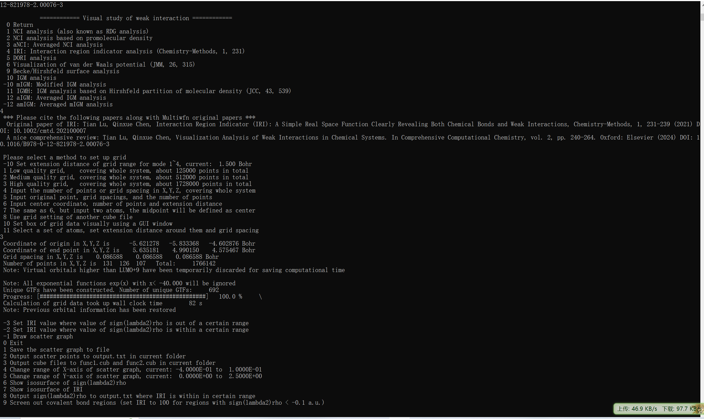

## IRI等值面图

启动Multiwfn，载入输入文件，我使用的输入文件是`.fchk`文件，别的如`.wfn`文件等也可以

使用功能`20 Visual study of weak interaction`，进行弱相互作用分析，选择`4 IRI: Interaction region indicator analysis (Chemistry-Methods, 1, 231)`进行IRI分析，选择精度，这里我选的是高精度`3 High quality grid,   covering whole system, about 1728000 points in total`（精度是根据格点数目确定的，对于巨大体系可能高精度也不够用需要手动指定格点数目）



至此，格点计算已经完成，然后我们导出数据`3 Output cube files to func1.cub and func2.cub in current folder`，借助`VMD` 分子可视化程序画出更好看的图，将载入文件所在文件夹下导出的`func1.cub`和`func2.cub`(这两个文件分别记录的是sign($λ_2$)ρ和IRI格点数据)复制到VMD程序的根目录并在根目录下新建一个脚本文件，名为`IRIfill.vmd`，内容为：

```VMD
mol new func1.cub
mol addfile func2.cub
mol delrep 0 top
mol representation CPK 1.0 0.3 18.0 16.0
mol addrep top
mol representation Isosurface 1.0 1 0 0 1 1
mol color Volume 0
mol addrep top
mol scaleminmax top 1 -0.04 0.02
mol modstyle 0 top CPK 0.700000 0.300000 18.000000 16.000000
color scale midpoint 0.666
color scale method BGR
color Display Background white
axes location Off
display depthcue off
display rendermode GLSL
light 3 on
color Element N iceblue
mol modcolor 0 top Element
```

然后启动VMD，在文本窗口中输入`source IRIfill.vmd`，


