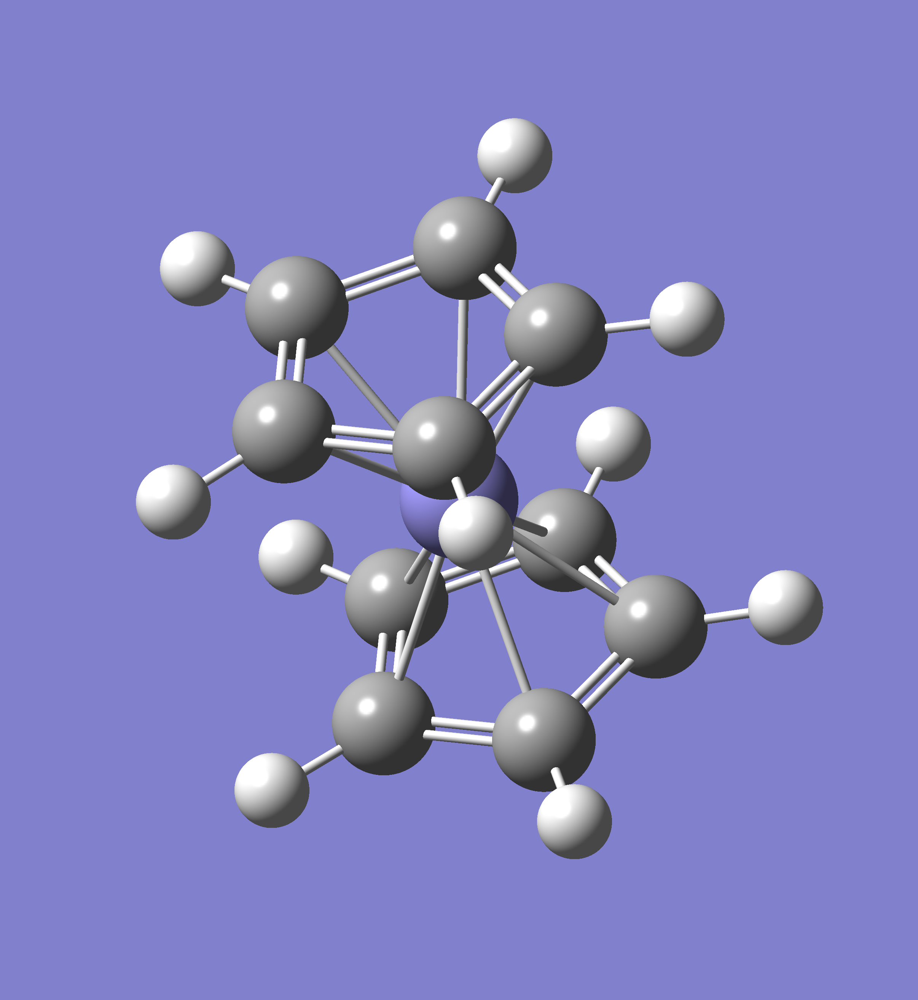
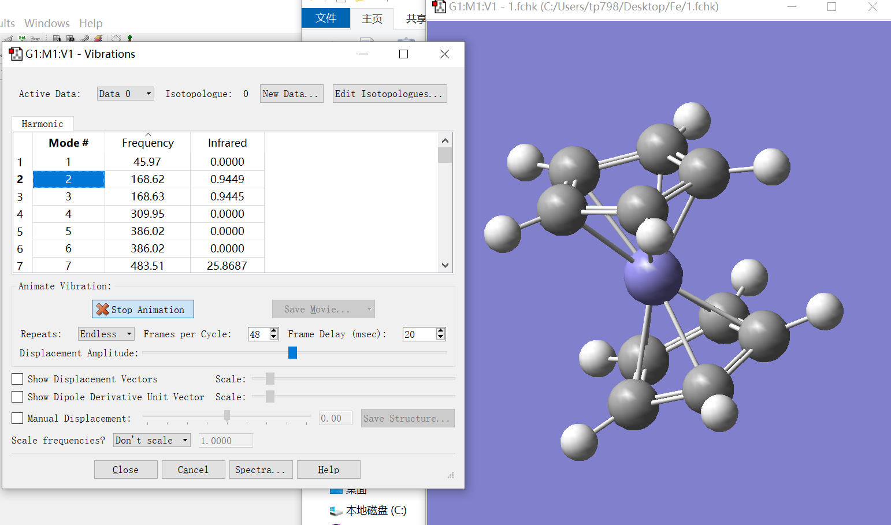
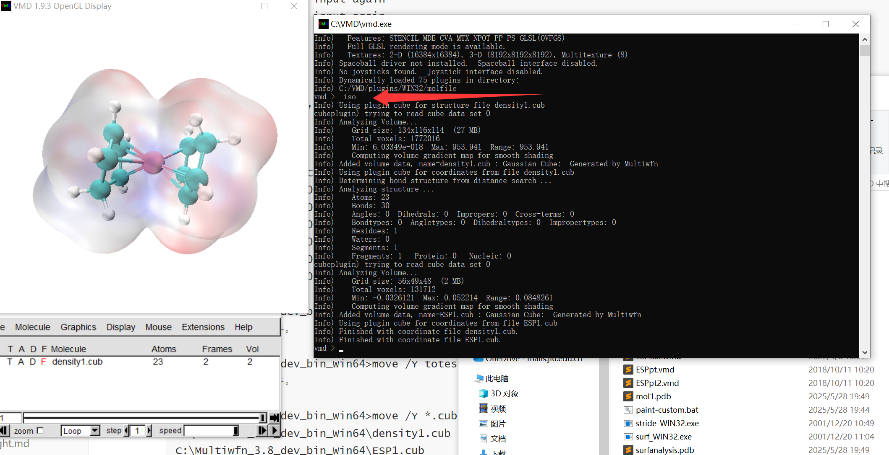
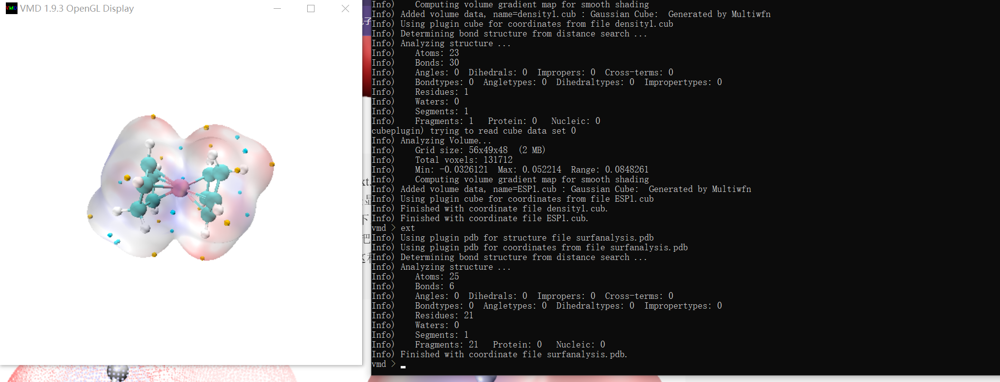
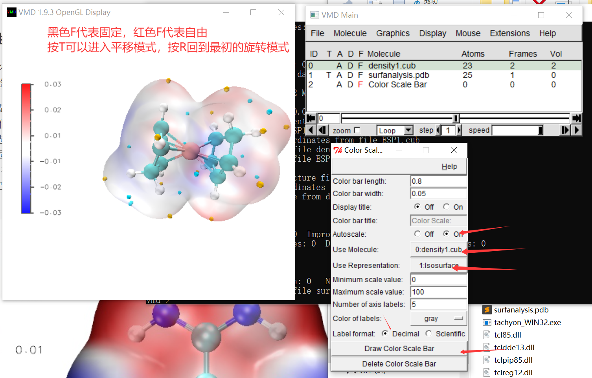

- Multiwfn版本：3.8(dev)，Last update: 2025-May-5
- VMD版本：1.9.3

**VMD版本请尽可能使用1.9.3而不要使用bug较多的1.9.4**

本文参考了[Sob老师的博文](http://sobereva.com/443)

## 目标分子的结构优化

本次的目标体系为二茂铁



首先建立二茂铁的模型，并且手动设置全重叠的D5d点群，**这样可以极大的减少优化用时**，关键词如下：

```
#p tpssh/def2tzvp opt freq
```

体系是含有3d金属的配合物，选择tpssh泛函，由于初猜结构比较合适，算得还是挺快的

```
                                    -- CHARLES MCCARRY IN "THE GREAT SOUTHWEST"
 Job cpu time:       0 days  1 hours 57 minutes 15.2 seconds.
 Elapsed time:       0 days  0 hours  5 minutes 58.7 seconds.
 File lengths (MBytes):  RWF=    147 Int=      0 D2E=      0 Chk=     16 Scr=      1
 Normal termination of Gaussian 16 at Wed May 28 21:43:45 2025.
```

如下图，优化完成，没有虚频



## 绘图前的准备工作

如Sob老师所说，绘图之前用户要做的事包括：

1. 把examples\drawESP目录下的.txt和.bat文件拷到Multiwfn可执行文件所在目录
2. 把.bat文件里的VMD路径改成实际路径
3. 把examples\drawESP目录下的.vmd拷到VMD路径下
4. 在vmd.rc里加入上述proc语句

## 画图

有两种风格的分子表面静电势图(ESP)，分别是**表面顶点着色方式**和**电子密度等值面着色方式**的ESP图，我个人更喜欢后者，以后者为例画图吧。

首先运行`ESPiso.bat`产生电子密度和静电势的cube文件：

```
PS C:\Multiwfn_3.8_dev_bin_Win64> ls

    Directory: C:\Multiwfn_3.8_dev_bin_Win64

Mode                 LastWriteTime         Length Name
----                 -------------         ------ ----
d----           2025/5/15    12:20                examples
-a---           2025/5/23     9:20        8114156 1.fch
-a---           2024/9/21    17:46           3057 使用Multiwfn发表文章必须在正文里进行引用（包括代算）.txt
-a---           2025/5/28    17:51            105 ESPext.bat
-a---           2018/10/7     5:24             32 ESPext.txt
-a---           2025/5/28    17:51            460 ESPiso.bat
-a---          2021/11/18    10:43             26 ESPiso.txt
-a---           2025/5/28    17:51            344 ESPpt.bat
-a---           2018/9/30    13:53             29 ESPpt.txt
-a---            2025/2/9     9:28         200205 How to cite Multiwfn.pdf
-a---            2023/3/2     2:26        2047000 libiomp5md.dll
-a---           2024/8/27    20:00           1254 LICENSE.txt
-a---           2025/4/13     9:17         416416 Multiwfn quick start.pdf
-a---            2025/5/5     2:50       35666432 Multiwfn.exe
-a---           2025/5/16     1:26          20490 settings.ini

PS C:\Multiwfn_3.8_dev_bin_Win64> .\ESPiso.bat

C:\Multiwfn_3.8_dev_bin_Win64>Multiwfn 1.fch -ESPrhoiso 0.001  0<ESPiso.txt
 Multiwfn -- A Multifunctional Wavefunction Analyzer
 Version 3.8(dev), update date: 2025-May-5
 Developer: Tian Lu (Beijing Kein Research Center for Natural Sciences)
 Multiwfn official website: http://sobereva.com/multiwfn
 Multiwfn English forum: http://sobereva.com/wfnbbs
 Multiwfn Chinese forum: http://bbs.keinsci.com/wfn
 ( Number of parallel threads:   4  Current date: 2025-05-30  Time: 20:33:12 )

 Both following papers ***MUST BE CITED IN MAIN TEXT*** if Multiwfn is used:
  Tian Lu, Feiwu Chen, J. Comput. Chem., 33, 580 (2012) DOI: 10.1002/jcc.22885
  Tian Lu, J. Chem. Phys., 161, 082503 (2024) DOI: 10.1063/5.0216272
 See "How to cite Multiwfn.pdf" in Multiwfn binary package for more information

 Please wait...
 Loading various information of the wavefunction
 The highest angular moment basis functions is F
 Loading basis set definition...
 Loading orbitals...
 Converting basis function information to GTF information...
 Back converting basis function information from Cartesian to spherical type...
 Generating density matrix based on SCF orbitals...
 Generating overlap matrix...

 Total/Alpha/Beta electrons:     98.0000     49.0000     49.0000
 Net charge:     0.00000      Expected multiplicity:    1
 Atoms:     23,  Basis functions:    427,  GTFs:    708
 Total energy:   -1651.955643142885 Hartree,   Virial ratio:  2.00246837
 This is a restricted single-determinant wavefunction
 Orbitals from 1 to    49 are occupied
 Title line of this file: Generated by autoGau.

 Loaded 1.fch successfully!

 Formula: H12 C10 Fe1      Total atoms:      23
 Molecule weight:       188.04779 Da
 Point group: C1

 "q": Exit program gracefully          "r": Load a new file
                    ************ Main function menu ************
 0 Show molecular structure and view orbitals
 1 Output all properties at a point       2 Topology analysis
 3 Output and plot specific property in a line
 4 Output and plot specific property in a plane
 5 Output and plot specific property within a spatial region (calc. grid data)
 6 Check & modify wavefunction
 7 Population analysis and calculation of atomic charges
 8 Orbital composition analysis           9 Bond order analysis
 10 Plot total DOS, PDOS, OPDOS, local DOS, COHP and photoelectron spectrum
 11 Plot IR/Raman/UV-Vis/ECD/VCD/ROA/NMR spectrum
 12 Quantitative analysis of molecular surface
 13 Process grid data (No grid data is presented currently)
 14 Adaptive natural density partitioning (AdNDP) analysis
 15 Fuzzy atomic space analysis
 16 Charge decomposition analysis (CDA) and plot orbital interaction diagram
 17 Basin analysis                       18 Electron excitation analysis
 19 Orbital localization analysis        20 Visual study of weak interaction
 21 Energy decomposition analysis        22 Conceptual DFT (CDFT) analysis
 23 ETS-NOCV analysis                    24 (Hyper)polarizability analysis
 25 Electron delocalization and aromaticity analyses
 26 Structure and geometry related analyses
 100 Other functions (Part 1)            200 Other functions (Part 2)
 300 Other functions (Part 3)
 -10 Return to main menu
 -2 Obtain deformation property
 -1 Obtain promolecule property
 0 Set custom operation
             ----------- Available real space functions -----------
 1 Electron density (rho)     2 Gradient norm of rho     3 Laplacian of rho
 4 Value of orbital wavefunction         44 Orbital probability density
 5 Electron spin density
 6 Hamiltonian kinetic energy density K(r)
 7 Lagrangian kinetic energy density G(r)
 8 Electrostatic potential from nuclear charges
 9 Electron localization function (ELF)
 10 Localized orbital locator (LOL)
 11 Local information entropy
 12 Total electrostatic potential (ESP)
 13 Reduced density gradient (RDG)       14 RDG with promolecular approximation
 15 Sign(lambda2)*rho      16 Sign(lambda2)*rho with promolecular approximation
 17 Correlation hole for alpha, ref. point:   0.00000   0.00000   0.00000
 18 Average local ionization energy (ALIE)
 19 Source function, mode: 1, ref. point:   0.00000   0.00000   0.00000
 20 Electron delocal. range func. EDR(r;d)  21 Orbital overlap dist. func. D(r)
 22 Delta-g (promolecular approximation)    23 Delta-g (Hirshfeld partition)
 24 Interaction region indicator (IRI)    25 van der Waals potential (probe=C )
 100 User-defined function (iuserfunc=   -1), see Section 2.7 of manual

 Please select a method to set up grid
 -10 Set extension distance of grid range for mode 1~4, current:  6.000 Bohr
 1 Low quality grid,    covering whole system, about 125000 points in total
 2 Medium quality grid, covering whole system, about 512000 points in total
 3 High quality grid,   covering whole system, about 1728000 points in total
 4 Input the number of points or grid spacing in X,Y,Z, covering whole system
 5 Input original point, grid spacings, and the number of points
 6 Input center coordinate, number of points and extension distance
 7 The same as 6, but input two atoms, the midpoint will be defined as center
 8 Use grid setting of another cube file
 10 Set box of grid data visually using a GUI window
 11 Select a set of atoms, set extension distance around them and grid spacing
 100 Load a set of points from external file
 Coordinate of origin in X,Y,Z is     -12.142516  -10.564851  -10.153107 Bohr
 Coordinate of end point in X,Y,Z is   11.971265   10.285411   10.334542 Bohr
 Grid spacing in X,Y,Z is    0.181307    0.181307    0.181307 Bohr
 Number of points in X,Y,Z is  134  116  114   Total:     1772016
 Note: Virtual orbitals higher than LUMO+9 have been temporarily discarded for saving computational time

 Note: All exponential functions exp(x) with x< -40.000 will be ignored
 Unique GTFs have been constructed. Number of unique GTFs:     708
 Progress: [##################################################]   100.0 %     \
 Calculation of grid data took up wall clock time         4 s
 Note: Previous orbital information has been restored

 Electric dipole moment estimated by integrating electron density
 X component:          0.281807 a.u.      0.716283 Debye
 Y component:         -0.255113 a.u.     -0.648432 Debye
 Z component:          0.140547 a.u.      0.357235 Debye
 Total magnitude:      0.405279 a.u.      1.030117 Debye

 The minimum is  0.60334894E-17 at -12.14252 -10.56485  10.33454 Bohr
 The maximum is  0.95394143E+03 at   0.00503   0.13224   0.00006 Bohr
 Summing up all value and multiply differential element:
   100.725159050150
 Summing up positive value and multiply differential element:
   100.725159050150
 Summing up negative value and multiply differential element:
  0.000000000000000E+000

                   ---------- Post-processing menu ----------
 -1 Show isosurface graph
 0 Return to main menu
 1 Save graph of isosurface to file in current folder
 2 Export data to a Gaussian-type cube file in current folder
 3 Export data to output.txt in current folder
 4 Set the value of isosurface to be shown, current:   0.05000
 5 Multiply all grid data by a factor
 6 Divide all grid data by a factor
 7 Add a value to all grid data
 8 Substract a value from all grid data
 9 Multiply all grid data by Hirshfeld weights of a fragment (can be used to only make isosurface around interested fragment visible)
 Exporting cube file, please wait...
 Done! Grid data has been exported to density.cub in current folder
 Hint: If you want to add input file name as prefix of the outputted cube file, you can set "iaddprefix" in settings.ini to 1

                   ---------- Post-processing menu ----------
 -1 Show isosurface graph
 0 Return to main menu
 1 Save graph of isosurface to file in current folder
 2 Export data to a Gaussian-type cube file in current folder
 3 Export data to output.txt in current folder
 4 Set the value of isosurface to be shown, current:   0.05000
 5 Multiply all grid data by a factor
 6 Divide all grid data by a factor
 7 Add a value to all grid data
 8 Substract a value from all grid data
 9 Multiply all grid data by Hirshfeld weights of a fragment (can be used to only make isosurface around interested fragment visible)

 Note: A set of grid data is presented in memory
 "q": Exit program gracefully          "r": Load a new file
                    ************ Main function menu ************
 0 Show molecular structure and view orbitals
 1 Output all properties at a point       2 Topology analysis
 3 Output and plot specific property in a line
 4 Output and plot specific property in a plane
 5 Output and plot specific property within a spatial region (calc. grid data)
 6 Check & modify wavefunction
 7 Population analysis and calculation of atomic charges
 8 Orbital composition analysis           9 Bond order analysis
 10 Plot total DOS, PDOS, OPDOS, local DOS, COHP and photoelectron spectrum
 11 Plot IR/Raman/UV-Vis/ECD/VCD/ROA/NMR spectrum
 12 Quantitative analysis of molecular surface
 13 Process grid data
 14 Adaptive natural density partitioning (AdNDP) analysis
 15 Fuzzy atomic space analysis
 16 Charge decomposition analysis (CDA) and plot orbital interaction diagram
 17 Basin analysis                       18 Electron excitation analysis
 19 Orbital localization analysis        20 Visual study of weak interaction
 21 Energy decomposition analysis        22 Conceptual DFT (CDFT) analysis
 23 ETS-NOCV analysis                    24 (Hyper)polarizability analysis
 25 Electron delocalization and aromaticity analyses
 26 Structure and geometry related analyses
 100 Other functions (Part 1)            200 Other functions (Part 2)
 300 Other functions (Part 3)
 -10 Return to main menu
 -2 Obtain deformation property
 -1 Obtain promolecule property
 0 Set custom operation
             ----------- Available real space functions -----------
 1 Electron density (rho)     2 Gradient norm of rho     3 Laplacian of rho
 4 Value of orbital wavefunction         44 Orbital probability density
 5 Electron spin density
 6 Hamiltonian kinetic energy density K(r)
 7 Lagrangian kinetic energy density G(r)
 8 Electrostatic potential from nuclear charges
 9 Electron localization function (ELF)
 10 Localized orbital locator (LOL)
 11 Local information entropy
 12 Total electrostatic potential (ESP)
 13 Reduced density gradient (RDG)       14 RDG with promolecular approximation
 15 Sign(lambda2)*rho      16 Sign(lambda2)*rho with promolecular approximation
 17 Correlation hole for alpha, ref. point:   0.00000   0.00000   0.00000
 18 Average local ionization energy (ALIE)
 19 Source function, mode: 1, ref. point:   0.00000   0.00000   0.00000
 20 Electron delocal. range func. EDR(r;d)  21 Orbital overlap dist. func. D(r)
 22 Delta-g (promolecular approximation)    23 Delta-g (Hirshfeld partition)
 24 Interaction region indicator (IRI)    25 van der Waals potential (probe=C )
 100 User-defined function (iuserfunc=   -1), see Section 2.7 of manual

 Please select a method to set up grid
 -10 Set extension distance of grid range for mode 1~4, current:  6.000 Bohr
 1 Low quality grid,    covering whole system, about 125000 points in total
 2 Medium quality grid, covering whole system, about 512000 points in total
 3 High quality grid,   covering whole system, about 1728000 points in total
 4 Input the number of points or grid spacing in X,Y,Z, covering whole system
 5 Input original point, grid spacings, and the number of points
 6 Input center coordinate, number of points and extension distance
 7 The same as 6, but input two atoms, the midpoint will be defined as center
 8 Use grid setting of another cube file
 10 Set box of grid data visually using a GUI window
 11 Select a set of atoms, set extension distance around them and grid spacing
 100 Load a set of points from external file
 Coordinate of origin in X,Y,Z is     -12.142516  -10.564851  -10.153107 Bohr
 Coordinate of end point in X,Y,Z is   11.789958   10.321672   10.298280 Bohr
 Grid spacing in X,Y,Z is    0.435136    0.435136    0.435136 Bohr
 Number of points in X,Y,Z is   56   49   48   Total:      131712
 Note: Virtual orbitals higher than LUMO+9 have been temporarily discarded for saving computational time

 Unique GTFs have been constructed. Number of unique GTFs:     708
 Note: ESP will be calculated only for the grids around isosurface of electron density of   0.001000 a.u.
 Detecting the grids for calculating ESP...
 Number of grids to calculate ESP:       10900

 Initializing LIBRETA library (fast version) for ESP evaluation ...
 LIBRETA library has been successfully initialized!

 NOTE: The ESP evaluation code based on LIBRETA library is being used. Please cite Multiwfn original papers (J. Comput. Chem., 33, 580-592 (2012) and J. Chem. Phys., 161, 082503 (2024)) and the paper describing the efficient ESP evaluation algorithm adopted by Multiwfn (Phys. Chem. Chem. Phys., 23, 20323 (2021))
 Progress: [##################################################]   100.0 %     \
 Setting ESP of the grids neighbouring to boundary grids...
 Calculation of grid data took up wall clock time        13 s
 Note: Previous orbital information has been restored

 The minimum is -0.32612104E-01 at  -0.39385  -0.99186   4.64151 Bohr
 The maximum is  0.52214027E-01 at   2.21697  -2.29727  -5.36661 Bohr
 Summing up all value and multiply differential element:
   3.07509251072690
 Summing up positive value and multiply differential element:
   8.67387639395045
 Summing up negative value and multiply differential element:
  -5.59878388322356

                   ---------- Post-processing menu ----------
 -1 Show isosurface graph
 0 Return to main menu
 1 Save graph of isosurface to file in current folder
 2 Export data to a Gaussian-type cube file in current folder
 3 Export data to output.txt in current folder
 4 Set the value of isosurface to be shown, current:   0.05000
 5 Multiply all grid data by a factor
 6 Divide all grid data by a factor
 7 Add a value to all grid data
 8 Substract a value from all grid data
 9 Multiply all grid data by Hirshfeld weights of a fragment (can be used to only make isosurface around interested fragment visible)
 Exporting cube file, please wait...
 Done! Grid data has been exported to totesp.cub in current folder
 Hint: If you want to add input file name as prefix of the outputted cube file, you can set "iaddprefix" in settings.ini to 1

                   ---------- Post-processing menu ----------
 -1 Show isosurface graph
 0 Return to main menu
 1 Save graph of isosurface to file in current folder
 2 Export data to a Gaussian-type cube file in current folder
 3 Export data to output.txt in current folder
 4 Set the value of isosurface to be shown, current:   0.05000
 5 Multiply all grid data by a factor
 6 Divide all grid data by a factor
 7 Add a value to all grid data
 8 Substract a value from all grid data
 9 Multiply all grid data by Hirshfeld weights of a fragment (can be used to only make isosurface around interested fragment visible)
forrtl: severe (24): end-of-file during read, unit -4, file CONIN$
Image              PC                Routine            Line        Source
Multiwfn.exe       00007FF60135CEB4  Unknown               Unknown  Unknown
Multiwfn.exe       00007FF600F5B65C  Unknown               Unknown  Unknown
Multiwfn.exe       00007FF60127BDD6  Unknown               Unknown  Unknown
Multiwfn.exe       00007FF601CCFB7B  Unknown               Unknown  Unknown
Multiwfn.exe       00007FF601FE53F0  Unknown               Unknown  Unknown
KERNEL32.DLL       00007FF9259B7374  Unknown               Unknown  Unknown
ntdll.dll          00007FF92667CC91  Unknown               Unknown  Unknown

C:\Multiwfn_3.8_dev_bin_Win64>move /Y density.cub density1.cub
移动了         1 个文件。

C:\Multiwfn_3.8_dev_bin_Win64>move /Y totesp.cub ESP1.cub
移动了         1 个文件。

C:\Multiwfn_3.8_dev_bin_Win64>Multiwfn 2.fch -ESPrhoiso 0.001  0<ESPiso.txt
 Error: Unable to find the input file you specified in argument

 Multiwfn -- A Multifunctional Wavefunction Analyzer
 Version 3.8(dev), update date: 2025-May-5
 Developer: Tian Lu (Beijing Kein Research Center for Natural Sciences)
 Multiwfn official website: http://sobereva.com/multiwfn
 Multiwfn English forum: http://sobereva.com/wfnbbs
 Multiwfn Chinese forum: http://bbs.keinsci.com/wfn
 ( Number of parallel threads:   4  Current date: 2025-05-30  Time: 20:33:30 )

 Both following papers ***MUST BE CITED IN MAIN TEXT*** if Multiwfn is used:
  Tian Lu, Feiwu Chen, J. Comput. Chem., 33, 580 (2012) DOI: 10.1002/jcc.22885
  Tian Lu, J. Chem. Phys., 161, 082503 (2024) DOI: 10.1063/5.0216272
 See "How to cite Multiwfn.pdf" in Multiwfn binary package for more information

 Now input file path, for example, E:\Planetarian\Yumemi_Hoshino.mwfn
 (.wfn/wfn/wfx/fch/molden/pdb/xyz/mol2/cif/cub... see Section 2.5 of manual)
 Hint: Pressing ENTER button directly can select a file in a GUI window. To reload the past file, inputting "o". Input such as ?miku.fch can open the miku.fch in the same folder as the past file
"5" cannot be found, input again
"1" cannot be found, input again
"3" cannot be found, input again
"2" cannot be found, input again
"0" cannot be found, input again
"5" cannot be found, input again
"12" cannot be found, input again
"1" cannot be found, input again
"2" cannot be found, input again
forrtl: severe (24): end-of-file during read, unit -4, file CONIN$
Image              PC                Routine            Line        Source
Multiwfn.exe       00007FF601370B01  Unknown               Unknown  Unknown
Multiwfn.exe       00007FF60127CBB3  Unknown               Unknown  Unknown
Multiwfn.exe       00007FF601CCFB7B  Unknown               Unknown  Unknown
Multiwfn.exe       00007FF601FE53F0  Unknown               Unknown  Unknown
KERNEL32.DLL       00007FF9259B7374  Unknown               Unknown  Unknown
ntdll.dll          00007FF92667CC91  Unknown               Unknown  Unknown

C:\Multiwfn_3.8_dev_bin_Win64>move /Y density.cub density2.cub
系统找不到指定的文件。

C:\Multiwfn_3.8_dev_bin_Win64>move /Y totesp.cub ESP2.cub
系统找不到指定的文件。

C:\Multiwfn_3.8_dev_bin_Win64>Multiwfn 3.fch -ESPrhoiso 0.001  0<ESPiso.txt
 Error: Unable to find the input file you specified in argument

 Multiwfn -- A Multifunctional Wavefunction Analyzer
 Version 3.8(dev), update date: 2025-May-5
 Developer: Tian Lu (Beijing Kein Research Center for Natural Sciences)
 Multiwfn official website: http://sobereva.com/multiwfn
 Multiwfn English forum: http://sobereva.com/wfnbbs
 Multiwfn Chinese forum: http://bbs.keinsci.com/wfn
 ( Number of parallel threads:   4  Current date: 2025-05-30  Time: 20:33:30 )

 Both following papers ***MUST BE CITED IN MAIN TEXT*** if Multiwfn is used:
  Tian Lu, Feiwu Chen, J. Comput. Chem., 33, 580 (2012) DOI: 10.1002/jcc.22885
  Tian Lu, J. Chem. Phys., 161, 082503 (2024) DOI: 10.1063/5.0216272
 See "How to cite Multiwfn.pdf" in Multiwfn binary package for more information

 Now input file path, for example, E:\Planetarian\Yumemi_Hoshino.mwfn
 (.wfn/wfn/wfx/fch/molden/pdb/xyz/mol2/cif/cub... see Section 2.5 of manual)
 Hint: Pressing ENTER button directly can select a file in a GUI window. To reload the past file, inputting "o". Input such as ?miku.fch can open the miku.fch in the same folder as the past file
"5" cannot be found, input again
"1" cannot be found, input again
"3" cannot be found, input again
"2" cannot be found, input again
"0" cannot be found, input again
"5" cannot be found, input again
"12" cannot be found, input again
"1" cannot be found, input again
"2" cannot be found, input again
forrtl: severe (24): end-of-file during read, unit -4, file CONIN$
Image              PC                Routine            Line        Source
Multiwfn.exe       00007FF601370B01  Unknown               Unknown  Unknown
Multiwfn.exe       00007FF60127CBB3  Unknown               Unknown  Unknown
Multiwfn.exe       00007FF601CCFB7B  Unknown               Unknown  Unknown
Multiwfn.exe       00007FF601FE53F0  Unknown               Unknown  Unknown
KERNEL32.DLL       00007FF9259B7374  Unknown               Unknown  Unknown
ntdll.dll          00007FF92667CC91  Unknown               Unknown  Unknown

C:\Multiwfn_3.8_dev_bin_Win64>move /Y density.cub density3.cub
系统找不到指定的文件。

C:\Multiwfn_3.8_dev_bin_Win64>move /Y totesp.cub ESP3.cub
系统找不到指定的文件。

C:\Multiwfn_3.8_dev_bin_Win64>Multiwfn 4.fch -ESPrhoiso 0.001  0<ESPiso.txt
 Error: Unable to find the input file you specified in argument

 Multiwfn -- A Multifunctional Wavefunction Analyzer
 Version 3.8(dev), update date: 2025-May-5
 Developer: Tian Lu (Beijing Kein Research Center for Natural Sciences)
 Multiwfn official website: http://sobereva.com/multiwfn
 Multiwfn English forum: http://sobereva.com/wfnbbs
 Multiwfn Chinese forum: http://bbs.keinsci.com/wfn
 ( Number of parallel threads:   4  Current date: 2025-05-30  Time: 20:33:30 )

 Both following papers ***MUST BE CITED IN MAIN TEXT*** if Multiwfn is used:
  Tian Lu, Feiwu Chen, J. Comput. Chem., 33, 580 (2012) DOI: 10.1002/jcc.22885
  Tian Lu, J. Chem. Phys., 161, 082503 (2024) DOI: 10.1063/5.0216272
 See "How to cite Multiwfn.pdf" in Multiwfn binary package for more information

 Now input file path, for example, E:\Planetarian\Yumemi_Hoshino.mwfn
 (.wfn/wfn/wfx/fch/molden/pdb/xyz/mol2/cif/cub... see Section 2.5 of manual)
 Hint: Pressing ENTER button directly can select a file in a GUI window. To reload the past file, inputting "o". Input such as ?miku.fch can open the miku.fch in the same folder as the past file
"5" cannot be found, input again
"1" cannot be found, input again
"3" cannot be found, input again
"2" cannot be found, input again
"0" cannot be found, input again
"5" cannot be found, input again
"12" cannot be found, input again
"1" cannot be found, input again
"2" cannot be found, input again
forrtl: severe (24): end-of-file during read, unit -4, file CONIN$
Image              PC                Routine            Line        Source
Multiwfn.exe       00007FF601370B01  Unknown               Unknown  Unknown
Multiwfn.exe       00007FF60127CBB3  Unknown               Unknown  Unknown
Multiwfn.exe       00007FF601CCFB7B  Unknown               Unknown  Unknown
Multiwfn.exe       00007FF601FE53F0  Unknown               Unknown  Unknown
KERNEL32.DLL       00007FF9259B7374  Unknown               Unknown  Unknown
ntdll.dll          00007FF92667CC91  Unknown               Unknown  Unknown

C:\Multiwfn_3.8_dev_bin_Win64>move /Y density.cub density4.cub
系统找不到指定的文件。

C:\Multiwfn_3.8_dev_bin_Win64>move /Y totesp.cub ESP4.cub
系统找不到指定的文件。

C:\Multiwfn_3.8_dev_bin_Win64>move /Y *.cub "C:\VMD"
C:\Multiwfn_3.8_dev_bin_Win64\density1.cub
C:\Multiwfn_3.8_dev_bin_Win64\ESP1.cub
移动了         2 个文件。
```

然后打开`VMD`软件，输入`iso`即可画图



再输入`ext`即可显示极值点



上图中的材质已被我改为`transparent`，因此能看到背面的极值点，修改方法可以通过`Grapgics-Materials`进行修改，然而答主修改时没有任何变化，于是在`ESPiso.vmd`中直接将`EdgyGlass`改成了`Transparent`

怎么添加刻度呢？操作如下图



接下来是自定义图片的导出，`File-Render`，渲染器选择`Tachyon`，开始渲染，然后在`VMD`的根目录下得到了文件`vmdscene.dat`，接下来调用渲染器进行渲染，渲染的`.bat`脚本是：

```bat
tachyon_WIN32.exe vmdscene.dat -aasamples 24 -mediumshade -trans_vmd -res 1024 768 -format BMP -o vmdscene.bmp
```

其中的1024是长，768是宽，可以改成想要的像素


