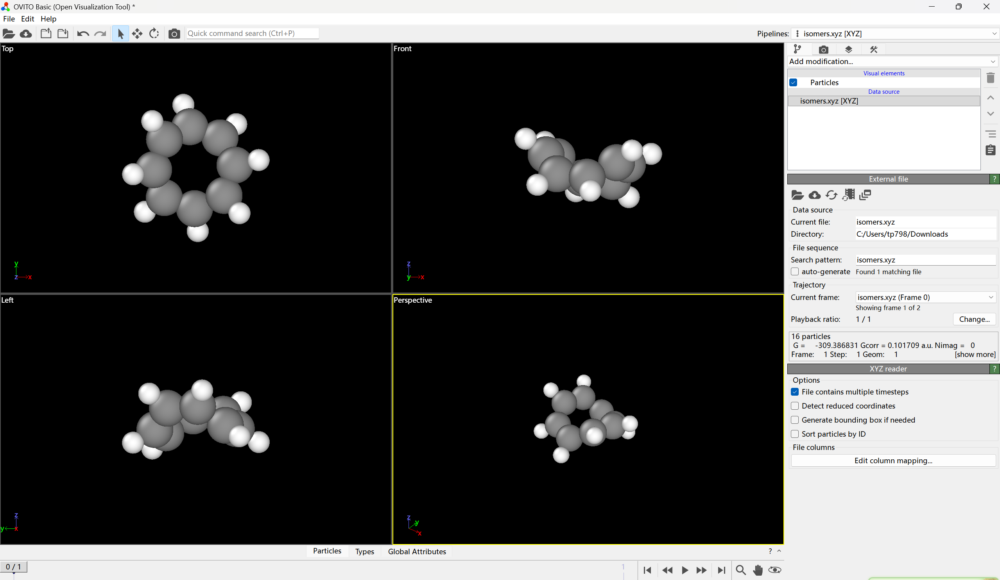
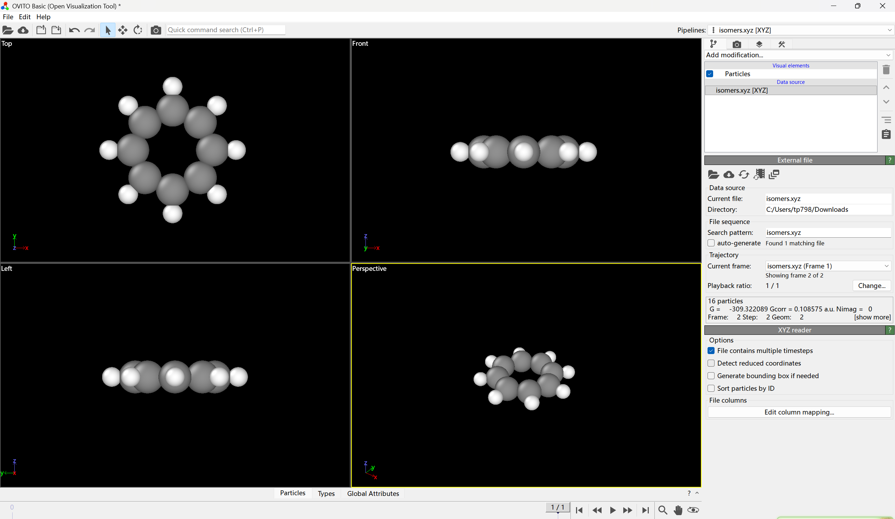
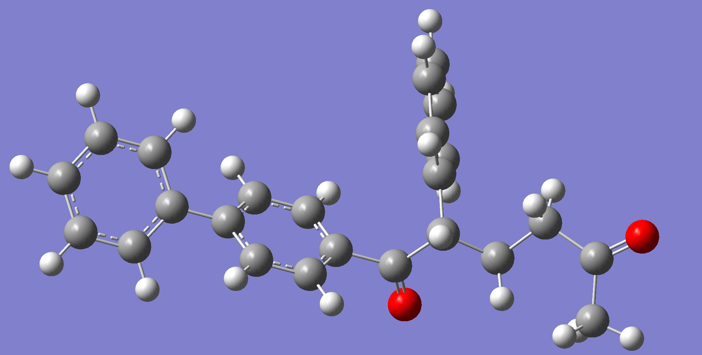
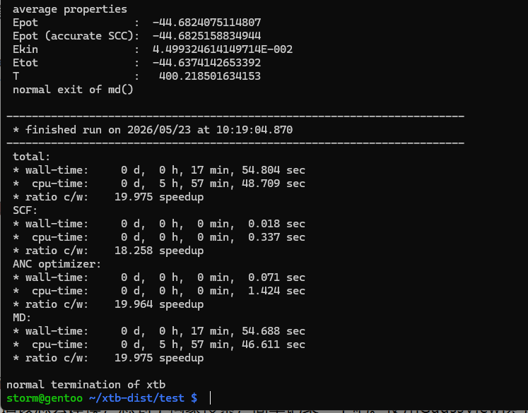
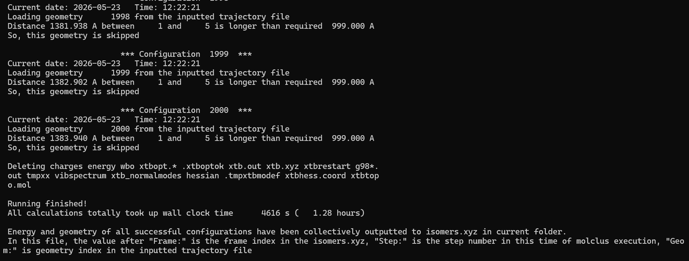
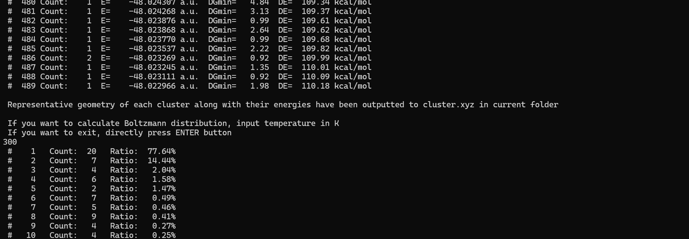
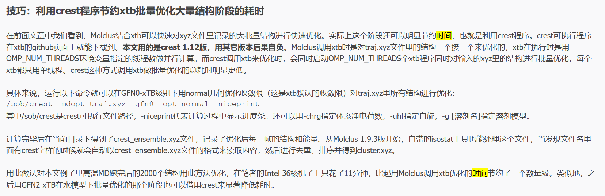

构象搜索（Conformational Search）是计算化学和分子模拟中的一种核心技术，旨在**找出柔性分子在三维空间中所有能量较低、结构稳定的原子排列形式（即构象）**。

这个概念其实并不陌生，在很久以前，每当进行分子结构建模的时候大脑中就有一个模糊的疑问，这个分子、团簇凭什么是这样的构型？当然，常见的结构已经早已烂熟于心，成为了尝试，但是当遇见不熟悉的结构又该怎样建模？

本文算是一个小小的记录、实战吧，第一次接触构象搜索，欢迎指出错误，欢迎交流讨论。

使用的构象搜索软件是卢老师的`Moclus`，不开源也没有文档手册，可能是因为软件比较简约、非常容易上手。详细的使用方法可以参考公社论坛上的帖子。

先简单用例子上手吧，后面复习的时候再补充一下具体的背景之类的。

## 环辛四烯

根据一点点基础有机化学知识，环辛四烯不是平面型的而是澡盆型的，如果是平面型的那么单环8个电子将会满足Hückel规则中的反芳香型，变得非常不稳定，能量非常高。

如果我手动建立一个平面型的环辛四烯并且进行几何优化会怎么样呢？

设置几何优化至极小值就一定会优化到能量最小的结构吗？

答案是否定的，极小值不一定是最小值，寻找能量最低结构的方法可以使用构象搜索，当然也不只有构象搜索一种，做昂贵的AIMD也是可以的。

此外，很多柔性分子的室温存在构象通常不是一种能量最低的结构，而是几种能量相对较低的构象，具体的分布比例还可已使用Boltzmann方程求解。

首先在GaussView中建立一个平面形的环辛四烯，建模可以手动摆原子，然后开启点群对称性、设置键长。


其实这个例子不算“构象”搜索吧（）

首先使用xtb进行GFN0-xtb的分子动力学模拟，输入文件如下：
```inp
$md
   temp= 400  //温度(K)
   time= 400.0  //模拟的总时间(ps)
   dump= 50.0  //每多少fs往轨迹文件里写入一次
   step=  1.0  //步长(fs)
   hmass=1  //氢原子的质量是实际的多少倍
   shake=1  //将与氢有关的化学键距离都用SHAKE算法约束住
$end
```
由于本人确实没有学习过xtb的相关使用方法，所以可能出错。
开始分子动力学模拟：
```bash
xtb 1.xyz --input md.inp --omd --gfn 0
```
最终耗时如下：
```bash
 normal exit of md()

------------------------------------------------------------------------
 * finished run on 2026/04/25 at 13:31:13.452     
------------------------------------------------------------------------
 total:
 * wall-time:     0 d,  0 h,  9 min, 53.942 sec
 *  cpu-time:     0 d,  3 h, 57 min, 17.196 sec
 * ratio c/w:    23.971 speedup
 SCF:
 * wall-time:     0 d,  0 h,  0 min,  0.013 sec
 *  cpu-time:     0 d,  0 h,  0 min,  0.297 sec
 * ratio c/w:    22.175 speedup
 ANC optimizer:
 * wall-time:     0 d,  0 h,  0 min,  0.020 sec
 *  cpu-time:     0 d,  0 h,  0 min,  0.464 sec
 * ratio c/w:    23.777 speedup
 MD:
 * wall-time:     0 d,  0 h,  9 min, 53.880 sec
 *  cpu-time:     0 d,  3 h, 57 min, 16.100 sec
 * ratio c/w:    23.971 speedup
```

环辛四烯本身不算大，接下来可以直接上GFN2-xtb方法批量优化。
把分子动力学模拟得到的xtb.trj改名为traj.xyz并放到molclus根目录下，修改`settings.ini`中的`iprog`参数，设置为4,确保`itask=0`,`xtb_arg`参数设置为--gfn 2 --chrg 0 --uhf 0，代表中性单重态体系且用GFN2-xTB进行优化，接着启动molclus就行了。
任务结束后，优化后的每一帧的结构和能量就都存到当前目录下的isomers.xyz里，然后使用isostat对isomers.xyz里的结构去重和做能量排序。
最后筛选得到的非重复结构产生在了当前目录下的cluster.xyz里，只有两个：
```bash
storm@gentoo /opt/chem/apps/molclus-1.14 $ cat cluster.xyz 
          16
 Energy =    -21.09757159 a.u.  #Cluster:    1
C          -0.14198444      1.65212712     -0.38118925
C           1.09751952      1.19810333     -0.51995646
C           1.70522774      0.11499717      0.25914429
C           1.25677611     -1.13195992      0.33477307
C           0.07043023     -1.65844827     -0.34701784
C          -1.16911928     -1.20449212     -0.20848744
C          -1.58271288     -0.09194827      0.65207512
C          -1.13422967      1.15504415      0.57680601
H          -1.56217824      1.91671453      1.21949431
H          -0.46631267      2.50750649     -0.96394089
H           1.77154000      1.68776438     -1.21445743
H           2.63573744      0.37910676      0.75001139
H           1.82557367     -1.87205053      0.88680483
H           0.25331915     -2.53524729     -0.95873884
H          -1.98458606     -1.71561044     -0.70865718
H          -2.37194786     -0.33449507      1.35541818
          16
 Energy =    -21.06002401 a.u.  #Cluster:    2
C           0.00000000      1.82221863      0.00000000
C           1.28850059      1.28850059      0.00000000
C           1.82221863      0.00000000      0.00000000
C           1.28850059     -1.28850059      0.00000000
C           0.00000000     -1.82221863      0.00000000
C          -1.28850059     -1.28850059      0.00000000
C          -1.82221863      0.00000000      0.00000000
C          -1.28850059      1.28850059      0.00000000
H          -2.05568448      2.05568448      0.00000000
H           0.00000000      2.90718024      0.00000000
H           2.05568448      2.05568448      0.00000000
H           2.90718024      0.00000000      0.00000000
H           2.05568448     -2.05568448      0.00000000
H           0.00000000     -2.90718024      0.00000000
H          -2.05568448     -2.05568448      0.00000000
H          -2.90718024      0.00000000      0.00000000
```

然后分别调用Gaussian16和Orca6.1.1分别进行几何优化+频率计算、高精度单点能计算

仍然先将traj.xyz删掉，把cluster.xyz改名为traj.xyz

在`settings.ini`里面设置相应的二进制文件路径，然后编辑当前文件夹下的Gaussian16的模板输入文件`template.gjf`和Orca6.1.1的输入文件`template_SP.inp`（需要手动创建），前者设置为：
```gjf
%nproc=20
%mem=30GB
# B3LYP/Def2SVP em=GD3BJ opt freq int=fine

Template file

0 1
[GEOMETRY]

```
后者是：
```inp
! PWPB95 D3 def2-QZVPP def2/J def2-QZVPP/C RIJCOSX tightSCF noautostart miniprint nopop
%maxcore 3000
%pal nprocs 10 end
* xyz 0 1
[GEOMETRY]
*
```
计算完毕，输出如下：
```bash
gentoo /opt/chem/apps/molclus-1.14 # ./molclus |tee out.txt
 Molclus: A flexible program for searching cluster configurations and molecular conformations
 Official website: http://www.keinsci.com/research/molclus.html
 Developed by Tian Lu (sobereva@sina.com)     Last update: 2026-Apr-1
 Beijing Kein Research Center for Natural Sciences (http://www.keinsci.com)
 P-L-E-A-S-E properly cite this code as mentioned in the official site
 
 Inputted trajectory file: traj.xyz
 Loading basic information from the inputted trajectory file ...
 There are totally         2 geometries in the inputted trajectory file
 
 Setting file: settings.ini
 Loading setting file ...
 Program to be invoked: Gaussian
 Task: Optimization + Frequency
 All frames in the inputted trajectory file will be processed
 
 Cleaning old output and temporary files...
 Deleting *.out *.chk gauSP*
 All Gaussian temporary files in current folder have been cleaned

                         *** Configuration     1  ***
 Current date: 2026-04-27   Time: 08:40:07
 Loading geometry         1 from the inputted trajectory file
 Generating gau.gjf...
 Running Gaussian: "/opt/chem/apps/g16/g16" < gau.gjf > gau.out
 Fine, optimization normally converged
 Opt + freq task normally terminated
 Thermal correction to Gibbs free energy:    0.101709 a.u.
 Gibbs free energy:     -309.291706 a.u.
 Fine, there is no imaginary frequency
 Now run single point task based on the template_SP.inp in current folder
 Running ORCA: "/opt/chem/apps/orca611/orca" orcaSP.inp  > orcaSP.out
 Single point energy:     -309.488540 Hartree
 Deleting orcaSP.* orcaSP_*
 Single point calculation normally terminated. The sum of the new single point energy and thermal correction to Gibbs free energy is     -309.386831 a.u.
 Writing the converged geometry, free energy and so on to isomers.xyz
 Wall clock time elapsed for calculating this configuration:     179 s

                         *** Configuration     2  ***
 Current date: 2026-04-27   Time: 08:43:06
 Loading geometry         2 from the inputted trajectory file
 Generating gau.gjf...
 Running Gaussian: "/opt/chem/apps/g16/g16" < gau.gjf > gau.out
 Fine, optimization normally converged
 Opt + freq task normally terminated
 Thermal correction to Gibbs free energy:    0.108575 a.u.
 Gibbs free energy:     -309.237477 a.u.
 Fine, there is no imaginary frequency
 Now run single point task based on the template_SP.inp in current folder
 Running ORCA: "/opt/chem/apps/orca611/orca" orcaSP.inp  > orcaSP.out
 Single point energy:     -309.430664 Hartree
 Deleting orcaSP.* orcaSP_*
 Single point calculation normally terminated. The sum of the new single point energy and thermal correction to Gibbs free energy is     -309.322089 a.u.
 Writing the converged geometry, free energy and so on to isomers.xyz
 Wall clock time elapsed for calculating this configuration:     120 s
 
 Deleting gau.gjf gau.out gau.chk
 
 Running finished!
 All calculations totally took up wall clock time       299 s (   0.08 hours)

 Gibbs free energy (G), thermal correction to G (Gcorr), numbers of imaginary frequencies (Nimag) and geometry of all successful configurations have been collectively outputted to isomers.xyz in current folder.
 In this file, the value after "Frame:" is the frame index in the isomers.xyz, "Step:" is the step number in this time of molclus execution, "Geom:" is geometry index in the inputted trajectory file

```
Opt+Freq计算完毕，提示没有虚频，算完后，还是用isostat处理得到的isomers.xyz。
```bash
gentoo /opt/chem/apps/molclus-1.14 # ./isostat 
 Isostat: A statistical analysis tool for a batch of isomers (64 bit)
 Released as a component of Molclus, last update of isostat: 2022-May-28
 Developed by Tian Lu, contact: sobereva@sina.com
 Beijing Kein Research Center for Natural Sciences (http://www.keinsci.com)
 
 Number of CPU cores to be used:   12

 Input the path of input file, e.g. C:\sob\lovelive\nico.xyz
 If press ENTER button directly, isomers.xyz in current folder will be loaded
   To change number of cores used in calculation, input value now, e.g. 18

 
 Input the energy threshold for distinguishing different clusters
 e.g. 0.5  (in kcal/mol)
 If press ENTER button directly, 0.25 kcal/mol will be used

 
 Input the geometry threshold for distinguishing different clusters
 e.g. 0.25  (in Angstrom)
 If press ENTER button directly, 0.1 Angstrom will be used

 
 Analyzing...
 
 There are    16 atoms
 There are     2 isomers

 Energy of isomer     1 :   -309.38683100 a.u.,  new cluster
 Energy of isomer     2 :   -309.32208900 a.u.,  new cluster
 
 The lowest energy is   -309.38683100 a.u.
 
 Nimag information was found, no isomer has imaginary frequency
 
 Sorting clusters according to energy...
 Calculation took up wall clock time         0 s

 In below output, DE is energy difference with respect to the lowest one. DGmin quantifies minimal geometry difference with respect to all other clusters

 #    1 Count:    1  E=   -309.386831 a.u.  DGmin=   0.68  DE=    0.00 kcal/mol
 #    2 Count:    1  E=   -309.322089 a.u.  DGmin=   0.68  DE=   40.63 kcal/mol
 
 Representative geometry of each cluster along with their energies have been outputted to cluster.xyz in current folder
 
 If you want to calculate Boltzmann distribution, input temperature in K
 If you want to exit, directly press ENTER button
300
 #    1   Count:   1   Ratio: 100.00%
 #    2   Count:   1   Ratio:   0.00%
 Press ENTER button to exit

```
可以看到，在300K的温度下，环辛四烯的分子的构象是唯一的，如下：



右侧显示了两种构象的能量差，单位为Hartree
## 一道高中化学题
偶然间居然刷到了高中化学的题目：https://www.bilibili.com/video/BV1XTcXzHEPf/?spm_id_from=333.1387.upload.video_card.click&vd_source=4b4b0bce46607b3376213560ca269073
想着可能和构象搜索有关就尝试了一下，初始建模如下：

导入到Chemdraw，命名是([1,1'-biphenyl]-4-yl)-2-phenylhexane-1,5-dione

OK接下来上传到工作站上，用Multiwfn转换为xyz格式。

首先还是用xtb程序做分子动力学模拟
```inp
$md  
   temp= 600  //温度(K)  
   time= 300.0  //模拟的总时间(ps)  
   dump= 50.0  //每多少fs往轨迹文件里写入一次  
   step=  1.0  //步长(fs)  
   hmass=1  //氢原子的质量是实际的多少倍  
   shake=1  //将与氢有关的化学键距离都用SHAKE算法约束住  
$end
```
感觉体系不是很大，尝试直接用GFN1-xTB进行分子动力学模拟：
```
xtb 1.xyz --input md.inp --omd --gfn 1
```
后面发现对渣机压力还是太大了，整个过程也不涉及化学键断裂，就换成了GFN0-xTB。

接着就可以开始批量优化了，使用GFN2-xTB方法，操作步骤依旧是将xtb.trj更名traj.xyz放置于Molclus根目录，然后修改settings.ini，启动molclus。

此时的批量优化过程是单线程的，改为`crest`程序可以并行计算，显著加速。

卢老师建议使用**1.12**版本的crest，但我在GitHub官网上确实没找着，就克隆了源码自己编译了。

crest直接手动调用就行：
```bash
crest -mdopt traj.xyz -gfn2 --chrg 0 --uhf 0 -opt normal -niceprint
```
-niceprint代表计算过程中显示进度条。还可以用-chrg指定体系净电荷数，-uhf指定自旋，-g [溶剂名]指定溶剂模型。  
  
计算完毕后在当前目录下得到了crest_ensemble.xyz文件，记录了优化后每一帧的结构和能量。从Molclus 1.9.3版开始，自带的isostat工具也能处理这个文件，当发现文件名里面有crest字样的时候就会自动以crest_ensemble.xyz文件的格式来读取内容，然后进行去重、排序并得到cluster.xyz。  

一共300个结构，用时28min。

接下来用`isostat`进行结构去重和做能量排序，两个阈值均设置得0.5，筛选出了170个构型，


## DSF-DME双分子构型

最近有个计算任务：
- DME-DSF双分子体系静电势分布
我第一次接触，稍微有点蒙，不知道该怎么建模，想到了构象搜索，简单记录一下吧。使用GaussView摆了这两个分子之后使用xtb进行了100ps的GFN0-xtb分子动力学模拟，每50fs截取一帧，用时如下：


随后GFN2-xtb计算单点能，用时：

然后运行isostat，感觉整个体系柔性不大，阈值参数取得比较大，最后筛选出来489个结构，但是计算300 K时的Boltzmann分布发现其实主要集中在两个结构上：


试一下分别取这俩结构用密度泛函优化吧，看最后会不会收敛到同一个结构，后续发现并未收敛到同一个结构，但是计算出的能量极为相近。
# 阴离子团簇
后续还有两个稍大的团簇，分别是：
- Li$^+$-DME/HFE-FSI$^-$/DFOB$^-$
- Li$^+$-DME/HFE/DSF-FSI$^-$/DFOB$^-$

简单记录一下，类似的流程，读博文的时候发现卢老师分子动力学采样用GFN0-xtb就足够可靠，最开始还想用GFN2-xtb的，其实是不必要的。

后续采样完毕之后需要对大批量的采样的结构进行预优化，仍然是使用GFN2-xtb方法，但是尝试了一下crest，发现极为迅速，卢老师也在文末有提到过，不过实在是没找到老师说的1.12版本


