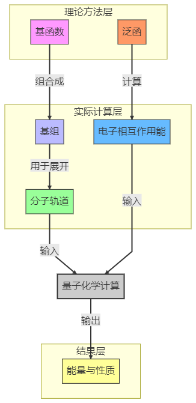

费米孔

Coulomb孔

由于Coulomb孔的存在，电子之间存在动态相关，如何描述原子分子体系中电子之间的动态相关是量子化学的主要任务

玻色子的波函数是对称的，没有反对称性的要求因此可以靠得很近

## Hartree-Fock方程与自洽场计算

### HF方程

HF方程是量子化学中计算**多电子体系近似波函数和能量**的基本方法，通过“平均场”近似把复杂的多电子问题拆解成单电子问题。

多电子波函数用**单电子轨道（分子轨道）的Slater行列式**表示
$$
\hat{f}(x_i)\varphi_k(x_1)=\varepsilon_k\varphi_k(x_1)
$$
Fock算符
$$
\hat{f}(x_1)=\hat{h}(x_1)+\sum_{j=1}^{N/2}(2\hat{J}-\hat{K_j})
$$

- 每个电子在其他电子构成的“平均场”中运动，忽略瞬时电子相关性（这是HF的局限性）。

**类比理解**

想象教室里的学生（电子）在考试：

- HF方法：每个学生只关心自己的试卷（轨道），并假设其他学生的行为是固定的“平均干扰”（库仑和交换势）。
- 现实：学生之间其实会互相偷看（电子相关作用），但HF忽略了这点。

### **自洽场计算（SCF）**

**一句话总结**

SCF是求解HF方程的**迭代计算过程**，通过不断更新“平均场”直到结果自洽。

**关键步骤**

1. **猜初始轨道**（如用原子轨道线性组合）。

2. **构建Fock算符** （依赖当前轨道）。

3. **解HF方程** ，得到新轨道。

4. 检查收敛

   新轨道与旧轨道是否几乎相同？

   - 是 → 计算结束，输出能量和波函数。
   - 否 → 用新轨道回到步骤2，继续迭代。

**为什么叫“自洽”？**

最终得到的轨道生成的“平均场”，与计算这些轨道时用的场是一致的（自圆其说）。

```
[多电子薛定谔方程]  
   ↓ 太难解 → 近似  
[HF方程]（单电子近似 + 平均场）  
   ↓ 需要迭代求解  
[SCF计算]  
   ↓ 收敛后  
[分子轨道和能量] → 用于计算化学性质
```

## **组态相互作用（Configuration Interaction, CI）计算**

CI是一种**后Hartree-Fock方法**，通过将多个电子组态（Slater行列式）线性组合，考虑电子相关能，弥补HF方法的不足。

#### **核心思想**
- **HF的缺陷**：
  HF单行列式近似忽略了电子瞬时排斥（动态相关）和激发态贡献（静态相关），导致能量偏高。
- **CI的改进**：
  将波函数表示为多个激发组态的叠加：
  $$
  \Psi_\text{CI} = c_0 \Phi_\text{HF} + \sum_i c_i \Phi_i^\text{single} + \sum_j c_j \Phi_j^\text{double} + \cdots
  $$
  
  
  - ($\Phi_i^\text{single}$)：单激发组态（一个电子从占据轨道跃迁到虚轨道）。
  - \( $\Phi_j^\text{double}$ )：双激发组态（两个电子同时跃迁），贡献最大。

#### CI等级
| 类型      | 包含的激发组态         | 计算成本 | 典型应用                |
| --------- | ---------------------- | -------- | ----------------------- |
| **CIS**   | 仅单激发               | 低       | 激发态初步探索          |
| **CISD**  | 单+双激发              | 中等     | 小分子基态相关能修正    |
| **CISDT** | 单+双+三激发           | 高       | 高精度小体系            |
| **FCI**   | 全组态（所有可能激发） | 天文数字 | 极限精度（如H₂O极小基） |

**关键问题**：

- **计算量爆炸**：FCI的组态数随电子数和轨道数阶乘增长，仅适用于极小体系。
- **大小一致性**：CISD不满足大小一致性（如两个远离的H原子能量≠2×单个H能量），需更高激发或耦合簇（CC）修正。

```plaintext
[Gauss基函数]
   ↓ 基组展开
[Hartree-Fock方程] → 单行列式近似
   ↓ 电子相关修正
[组态相互作用(CI)] → 用二次量子化算符组合激发组态
   ↓ 更高精度
[耦合簇(CC)、多参考方法]
```

## 理论计算中的各种方法

简单总结了一下Sob老师的博文，个人的总结仅供参考，详细信息请阅读原文：http://sobereva.com/680

### 任务类型

- 优化极小点
- 优化过渡态
- 产生反应路径
- 振动分析
- 分子动力学
- 构象/构型搜索
- 波函数分析

### 计算方法

| 计算方法                               | **VASP**                                                     |                            |
| -------------------------------------- | ------------------------------------------------------------ | -------------------------- |
| 分子力场                               | 计算耗时极低                                                 | 无法描述化学反应           |
| 机器学习势                             | 通过机器学习的思想构造依赖于原子坐标的分子描述符与能量之间的抽象关系 |                            |
| 密度泛函理论（QM）                     | 性价比非常高                                                 | 耗时高于分子力场N个数量级  |
| Hartree-Fock（QM）                     |                                                              | 完全过时                   |
| 后Hatree-Fock类（QM）                  | 额外把动态相关在一定程度上考虑了进来                         | 耗时高了很多               |
| MCSCF如CASSCF（QM）                    | 弥补HF缺乏对静态相关的考虑                                   | 几乎没有或很少考虑动态相关 |
| 多参考方法如CASPT2、NEVPT2、MRCI（QM） | 在MCSCF基础上进一步把动态相关考虑进来，精度整体很好，普适性很强 | 昂贵                       |
| 半经验类方法如AM1、PM3、PM6（QM）      | 对HF的简化以巨幅降低耗时，耗时只是HF的微小零头               | 精度低，只能用于有限的元素 |
| GFN-xTB（QM）                          | 相当于纳入了一定DFT思想的半经验级别的方法，整体精度和可靠性>=主流的半经验方法 |                            |
|                                        |                                                              |                            |

凡是基于量子理论思想提出的，在实际数值求解的过程中一般都要涉及分子轨道，绝大多数计算程序中都是把分子轨道展开成**基函数的线性组合**来描述的

最常见的基函数一类是**原子中心基函数**（如Gaussian等大多数量子化学程序以及CP2K等部分第一性原理程序用的高斯型基函数），其中心一般位于原子核，还有一类常见的基函数是**平面波基函数**，是大多数计算周期性体系为主的第一性原理程序用的，它的分布覆盖整个被计算的晶胞

基组（basis set）是**对于原子中心基函数而言的**，例如6-31G*、def2-TZVP、cc-pVDZ等都是很常见的基组，它定义了实际计算时对各种元素原子具体用多少、什么参数的基函数。做HF、DFT、后HF、MCSCF、多参考等方法计算时都需要告诉计算程序用什么基组，基组质量越好，也就是越接近于所谓的完备基组极限，这些方法自身的精度发挥得就越充分，但代价就是耗时越高。一个好方法配一个烂基组，以及一个烂方法配一个好基组，结果都不理想，必须好方法配好基组才能得到较准确结果。



