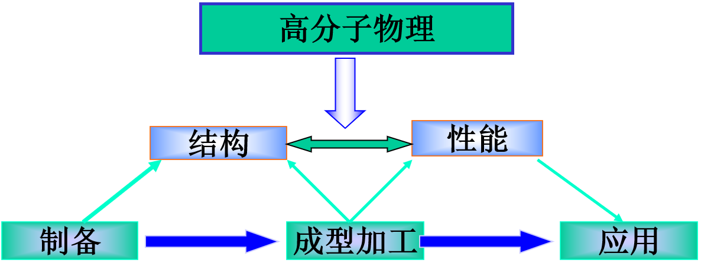

## 教材及习题集

- 高分子物理， 刘凤岐，汤心颐编著，第二版，高等教育出版社
- 高分子物理学习指导，董炎明，胡晓兰著， 科学出版社
- 高分子物理习题集，徐世爱主编，华东理工大学出版社

## 教学内容

- 第一章 绪论
- 结构部分
  - 第二章 高分子链结构
  - 第三章 高分子溶液
  - 第四章 高分子聚集态（一）
  - 第五章 高分子聚集态（二）
- 第六章 分子运动与转变
- 性能部分
  - 第七章 聚合物的粘弹性
  - 第八章 橡胶弹性
  - 第九章 聚合物的机械强度

## 高分子物理的研究对象

### 高分子家族

- 涂料
- 粘合剂
- 弹性体
- 塑料
  - 热固性塑料（酚醛树脂、脲醛树脂）
  - 热塑性塑料（PE、PP、PVC、PS、PMMA、尼龙）
- 合成纤维
- 天然聚合物
- 生物系统

### 聚合过程赋予高分子三个特征

- 由重复单元相互连接构成
- 链状分子的基本形式
- 足够长
  - 聚合物（Polymer)：多增加或减少几个重单元不会影响本体性质（玻璃化温度、热容、密度、热膨胀系数、模量、拉伸强度、导热系数、折光指数...）
  - 高分子的特征不在其分子量高，而在其==长链状结构==

## 高分子科学的发展历程

### （一）蒙昧时期

- 19世纪中叶以前

- 无意识地使用高分子材料
- 体现在人类对天然高分子的利用
- 纤维素、蛋白质、淀粉

### （二）萌芽时期

- 19世纪末期到20世纪初期
- 出现了化学改性与人工合成的高分子
- 橡胶
- 塑料

### （三）争鸣时期

- 20世纪初期到30年代 
- 高分子科学与传统科学的碰撞
- Staudinger（1920）高分子的科学概念。链状分子、分子量及其分布、聚合反应

### （四）成熟时期

- Carothers（30年代）缩合聚合，尼龙的发明
- 40年代，高分子统计性质与物理化学研究。代表性工作：Kuhn, Guth,  Mark,  Flory
- 1940-60年代，高分子科学的大发展(日新月异）：塑料、橡胶、纤维、涂料、粘合剂、复合材料，Ziegler-Natta催化剂，定向聚合
- 近代，精度、广度：de Geens的标度理论，非平衡态理论

## 高分子物理

