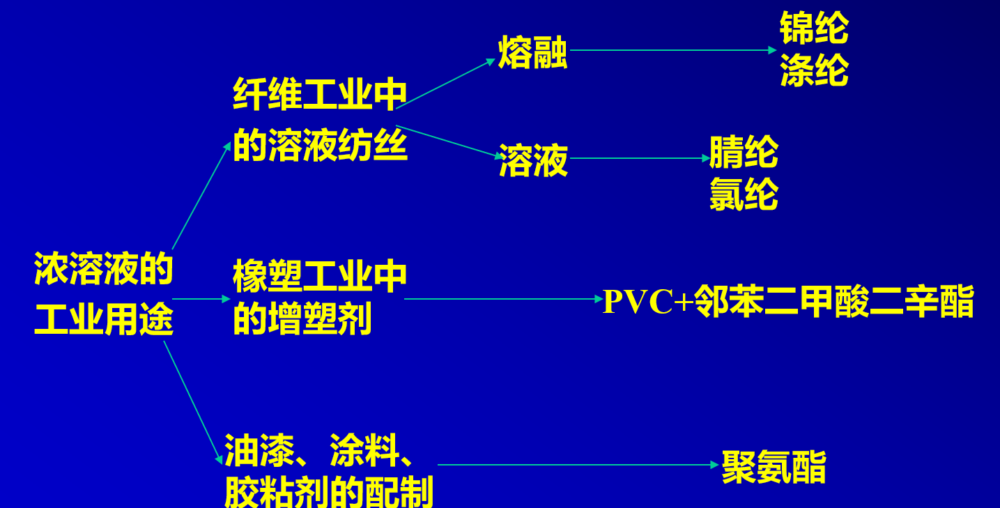
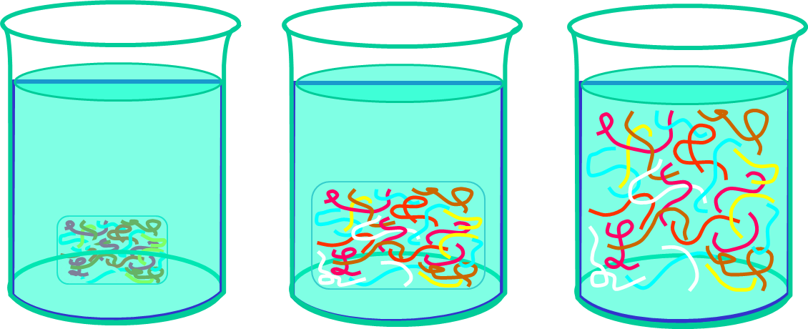
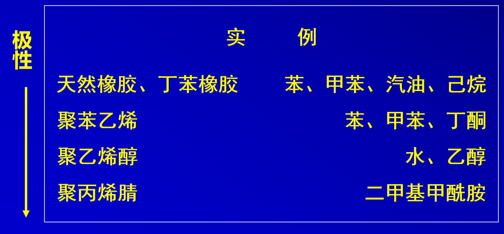
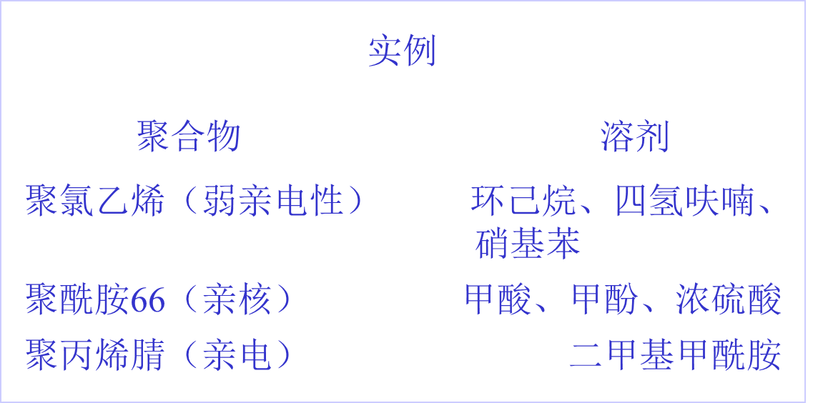
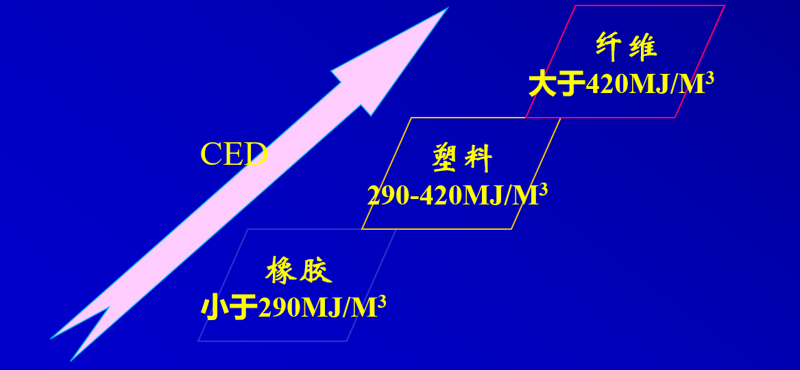
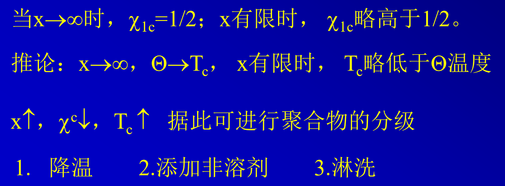
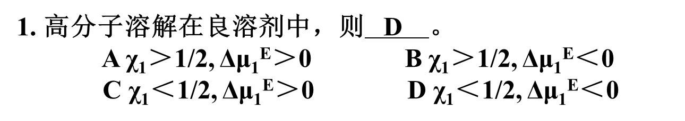
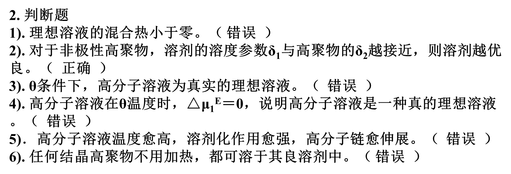

# 高分子溶液

溶液：溶质+溶剂

- 气态溶液（混合气体）
- 液态溶液
- 固态溶液（如合金）

**高分子溶液**：高聚物以分子状态分散在溶剂中所形成的均相混合物，**热力学上稳定**的二元或多元体系

- 未硫化的天然橡胶（生胶）+汽油，苯、甲苯
- HDPE+四氢萘
- 聚乙烯醇+水

高分子溶液的用途

- 稀溶液（C<1%）：例如分子量测定
  - 热力学性质的研究
  - 动力学性质的研究（溶液的沉降，扩散，粘度等）
  - 高分子在溶液中的形态尺寸（柔顺性，支化情况     等）研究其相互作用（包括高分子链段间，链段与溶剂分子间的相互作用）
  - 测量分子量，分子量分布，测定内聚能密度，计算    硫化胶的交联密度等
- 浓溶液（C>5%）：纺丝、油漆、胶粘剂、增塑

==浓溶液和稀溶液最本质的区别==：稀溶液中单个大分子链线团是孤立存在的，相互之间没有交叠；而在浓厚体系中，大分子链之间发生聚集和缠结。

## 高分子的溶解

### 溶解过程

- 小分子溶解：溶质向溶剂中扩散
- 高分子溶解：
  - 线形无定形高分子
    - 混合初期：单项扩散，溶胀
    - 混合后期：双向扩散，溶解
  - 
  - 线形结晶高分子——先溶胀无定形区，在晶体熔点附近的温度使晶体解体后溶解
    - 
        # URL 瑙ｇ爜
        [System.Uri]::UnescapeDataString($match.Value)
    /image-20250321210140742.png)
  - 交联高分子——达到溶胀平衡后分子扩散即告停止，**只溶胀，不完全溶解**
    - **可溶部分：溶胶**
    - **不可溶部分：凝胶、只能溶胀
    - 高度交联（C阶热固性树脂）：不溶胀**

### 溶剂的选择

- 极性相近

  

- 溶剂化作用——具有相异电性的两种基团，极性强弱越接近，彼此间相互作用越强、结合力越大。

==溶剂-高分子相互作用>高分子-高分子间相互作用==

- 内聚能密度或溶度参数相近

$$
\Delta \rm{E}=\Delta \rm{H}-\rm{RT}
$$

$$
\rm{CED=\dfrac{\Delta E}{V_0}}
$$

$$
\rm{\delta=\sqrt{CED}=\dfrac{\sum F(基团摩尔引力常数)}{V}=\dfrac{\rho\sum F}{M_0}}
$$

溶度参数是具有加和性的
$$
\delta_m=\delta_1\phi_1+\delta_2\phi_2
$$
==选择同高分子溶质溶度参数相近的溶剂通常有利于溶解==

==真实的溶解情况需要将三种因素综合考虑==

- **PAN****（聚丙烯腈、强极性）：**包括合成纤维（如腈纶，也称人造羊毛）。溶于DMF（二甲基甲酰胺）、乙腈（强极性），但不溶解于与它δ值相近的乙醇、甲醇等。因为PAN极性很强，而乙醇、甲醇等溶剂极性太弱。**
- ** **PS（聚苯乙烯、弱极性）：**脆性塑料。溶于甲苯、氯仿、苯胺（弱极性）和苯（非极性）。不能溶解在与它δ值相近的丙酮中，因为PS弱极性，而丙酮强极性。

### 热力学分析

$$
\rm{\Delta G_m=\Delta H_m -T \Delta S_m}
$$

- 极性高分子+极性溶液

  - 溶解放热，$\rm{\Delta G_m <0}$，溶解过程==能自发进行==

- 非极性溶液——Hildebrand公式

  - 

  $$
  \rm{\Delta  H_m=V\phi_1\phi_2(\delta_1-\delta_2)^2}
  $$

  - $\rm{ΔH_M}$越小越好即溶度参数尽可能接近

#### 练习题

## 高分子溶液的热力学理论

二元混合体系中两种分子中各含$x_A$和$x_B$个单元，可有三种不同情况

| 溶液       | $X_A$ | $X_B$ |
| ---------- | ----- | ----- |
| 小分子溶液 | 1     | 1     |
| 高分子溶液 | 1     | x     |
| 高分子共混 | $x_1$ | $x_2$ |

理想溶液的热力学性质
$$
\rm{\Delta S_m=-k[N_1\ln X_1+N_2\ln X_2]}
$$

$$
\rm{\Delta H_m=0}
$$

$$
\rm{\Delta V_m=0}
$$

$$
\rm{\Delta P=P_1^0X_2}
$$

### Flory-Huggins理论

基本假定：

- i.溶液体系虚拟为似晶格结构。一个溶剂分子占一个晶格，一个高分子分为*x* 个链段、占*x* 个相连的晶格。
- ii.等几率。溶剂与链段占某个任选格子的几率正比于其在体系中的分数。
- iii.等构象能。高分子链构象能相等。

#### 混合熵

$$
\mathrm{\Delta S_m=S_{溶液}-S_{高分子}=-k=[N_1\ln {\dfrac{N_1}{N_1+xN_2}}+N_2\ln{\dfrac{xN_2}{N_1+xN_2}}]}
$$

$$
\phi_1=\dfrac{N_1}{N_1+xN_2}
$$

$$
\phi_2=\dfrac{xN_2}{N_1+xN_2}
$$

混合体系中溶剂分子的体积分数为$\phi_1$，高分子为$\phi_2$

#### 混合焓、 混合自由能

混合焓：
$$
\Delta H_M=(Z-2)\Delta \varepsilon_{12}N_1\phi_2=RT\chi_1n_1\phi_2
$$
Flory-Huggins相互作用参数：高分子与溶剂混合过程中相互作用能的变化
$$
\chi_1=\dfrac{(Z-2)\Delta \varepsilon_{12}}{kT}
$$

| 溶剂类型 | $\Delta \varepsilon_{12}$   | $\chi$   |
| -------- | --------------------------- | -------- |
| 良溶剂   | $\Delta \varepsilon_{12}$<0 | $\chi$<0 |
| 无热溶剂 | $\Delta \varepsilon_{12}$=0 | $\chi$=0 |
| 亚良溶剂 | $\Delta \varepsilon_{12}$>0 | $\chi$>0 |

混合自由能
$$
\Delta G_M=RT[n_1\ln\phi_1+n_2\ln\phi_2+\chi_1n_1\phi_2]
$$

#### 偏摩尔量

在无限大的溶液体系中加入1摩尔溶质或溶剂引起热力学函数的变化称为偏摩尔量
$$
溶剂的化学位：\Delta \mu_1=RT[\ln \phi_1+(1-\dfrac{1}{x})\phi_2+\chi_1\phi_1^2]
$$

### Flory-Krigbaum理论

超量化学位
$$
\Delta \mu_1^E=-RT\Psi_1(1-\dfrac{\Theta}{T})\phi_2^2
$$

$$
\Theta=\dfrac{T\kappa_1}{\Psi_1}
$$

一维溶胀因子$\alpha$

- $\alpha$的值描述了溶剂的性质
- ==$\alpha$越大，溶剂越良； $\alpha$越小，溶剂越差==
- ==$\alpha$=1时线团为无扰尺寸，溶剂为$\Theta$溶剂==

$\Theta$状态——无绕状态，可==看作==理想状态

此时的溶液称为Θ 溶液, 溶剂称为Θ 溶剂达到Θ 条件的温度称为Θ 温度，具有以下性质
$$
\chi_1=\dfrac{1}{2}, \Delta \mu^E=0, \Delta G_a=0, u=0, \alpha=1
$$

## 相平衡

### 渗透压

$$
\Pi=-\dfrac{1}{V^{'}}[\mu_1-\mu_{10}]=-\dfrac{\Delta \mu_1}{V_1^{'}}
$$

以$\pi$/(RTc)对浓度c作图， 可得一条直线。 斜率为$A_2$, 由截距可得数均分子量  
$$
\dfrac{\pi}{RTc}=[\dfrac{1}{\overline{M_n}}+A_2c]
$$

$$
A_2=(\dfrac{1}{2}-\chi)\dfrac{v_2^2}{v_1}
$$

- 良溶剂中，$A_2$>0
- $\Theta$溶剂中，$A_2$=0
- 不良溶剂中，$A_2$<0

### 相分离

$$
\phi_{2c}=\dfrac{1}{1+\sqrt{x}}
$$

$$
\chi_{1c}=\dfrac{1}{2x}(1+\sqrt{x})^2
$$

### 习题

