## 高分子的结构简介😸

高分子的结构

- 链结构
  - 近程结构（化学结构，**一级结构**）
    - 构造：链中原子的种类和排列、取代基和端基的种类、单体单元的排列顺序、支链的类型和长度
    - 构型：某一原子的取代基在空间的排列
  - 远程结构（**二级结构**）
    - 分子的大小与形态
    - 链的柔顺性
    - 构象
- 聚集态结构：高分子材料整体的内部结构
  - 晶态结构（**三级结构**）
  - 非晶态结构（**三级结构**）
  - 取向态结构（**三级结构**）
  - 液晶态结构（**三级结构**）
  - 织态结构（**更高级的结构**）

## 近程结构

### 高分子链的化学组成

高分子链的基本单位是结构单元，组成结构单元的原子决定了高分子的元素成分。按分子==主链（**连续长度最长的链**）的组成==分类，链状高分子可分为三类：

#### 碳链高分子：主链上的元素都是碳元素

**聚烯烃 加聚物**：聚乙烯， 聚丙烯， 聚苯乙烯，聚氯乙烯， 聚四氟乙烯，聚丁二烯， 聚异戊二烯

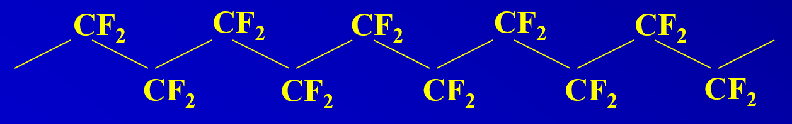

- 不易水解
- 易加工（==“越柔越易加工”==）
- 易燃烧
- 易老化
- 耐热性较差

#### 杂链高分子：主链上除了碳元素还有杂元素，通常是N、O、S

**缩聚物 开环聚合物**——聚对苯二酸乙二酯，聚酰胺-66，聚氧化乙烯，聚己内酰胺

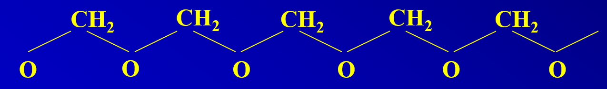

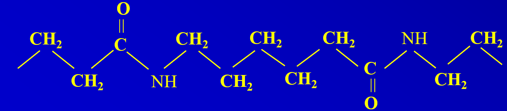

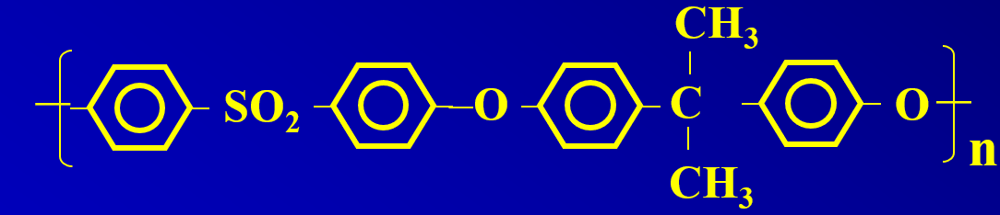

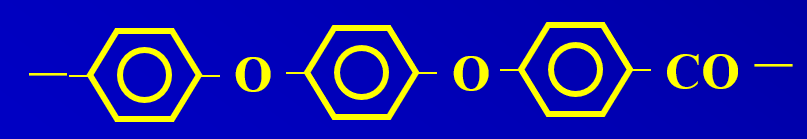

- 主链带极性，易水解，醇解或酸解（由缩聚反应或开环聚合而成的）
- 优点：耐热性好，强度高
- 缺点：易水解
- 主要用作工程塑料

#### 元素高分子

**主链不含碳元素**——聚硅氧烷，聚磷腈

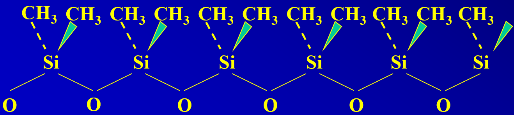

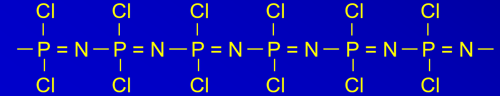

- 具有无机物的热稳定性
- 有机物的弹性和塑性
- 但强度较低

#### 无机高分子

#### 梯形高分子、双螺旋高分子（其他分类方式）

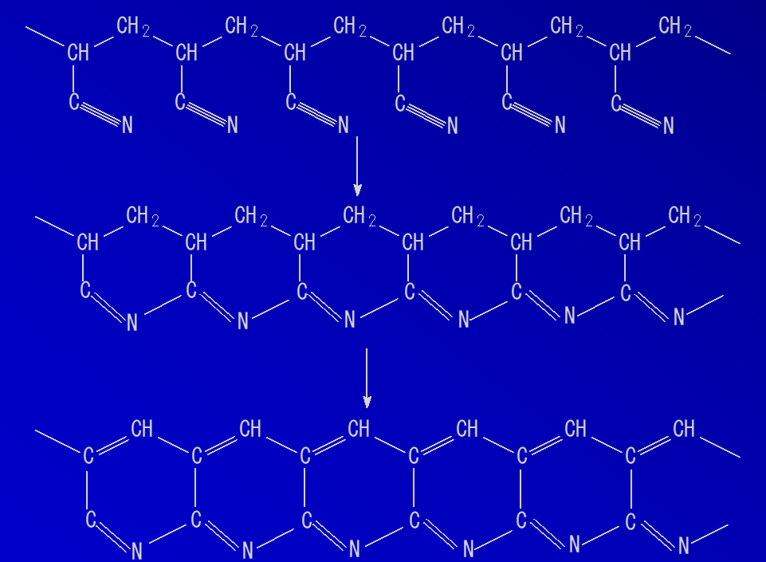

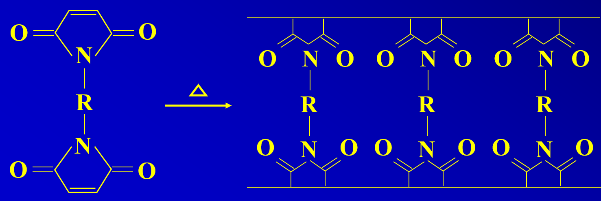

- 热稳定性好，因为受热时链不易被打断，即使几个链断了，只要不在同一个梯格中不会降低分子量

### 端基、侧基

#### 端基——不影响力学性能，但影响热稳定性、化学稳定性

- 非反应性端基：甲基、醚

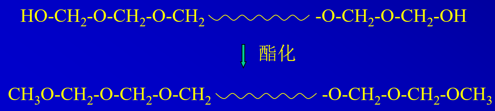

- 反应性端基：羟基、羧基、氨基
  - 可进一步合成复杂结构
  - 可用于测分子量

#### 侧基

- 由单体引入的与主链相连接的基团

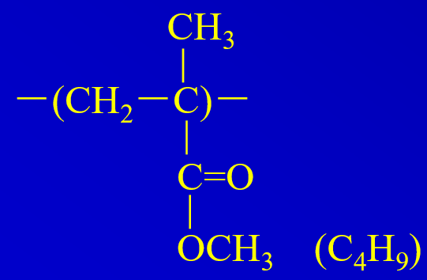

- 由反应生成的侧基

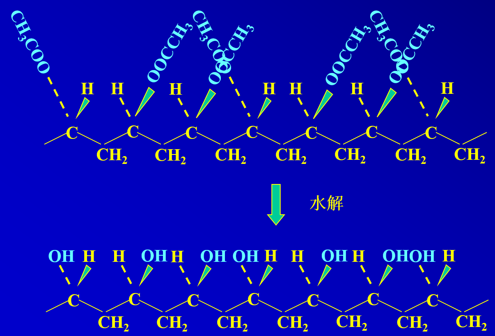

### 支化、交联

- 支化的高分子溶解性较好而交联的高分子不溶不熔，只有在交联度不太高时能在某溶剂中溶胀，这种状态也成为==凝胶==
- ==先单向扩散后双向扩散的溶解过程==

#### 支化

- 无规支化：少量多官能团单体参加的加聚物与缩聚物向高分子链转移的聚合物

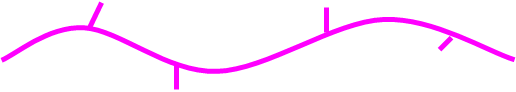

- 有规支化：星形、树形

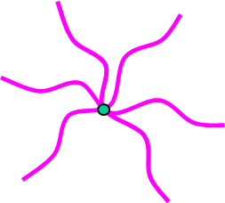

- 长支链
- 短支链

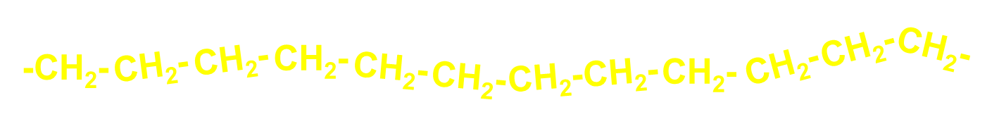

HDPE高密度聚乙烯

- 无支化链
- 排列紧密
- 易==结晶==

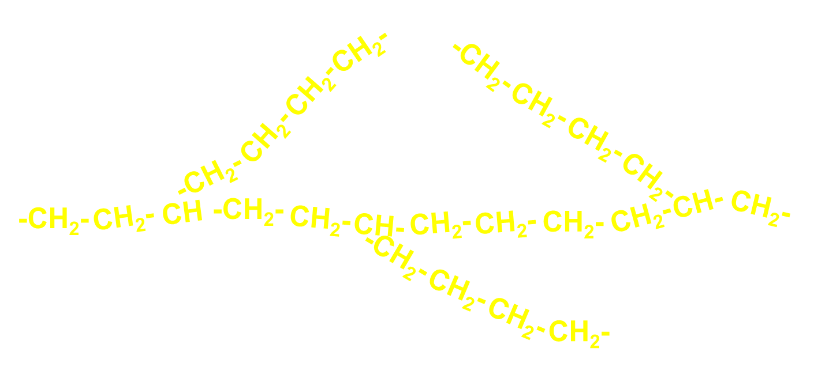

LDPE低密度聚乙烯

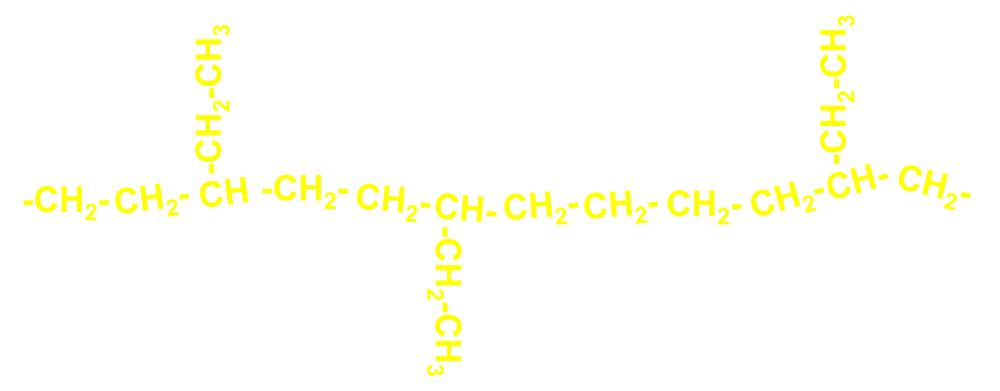

LLDPE线性低密度聚乙烯

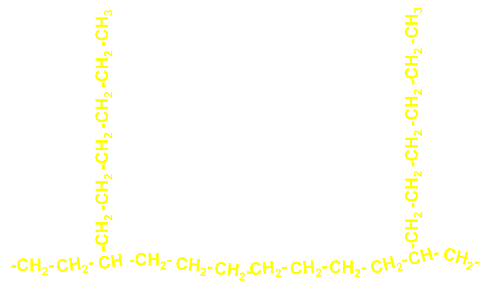

POE（热塑性弹性体），具有一定缓冲作用

##### *关于弹性？*——本质是熵弹性，材料在外力作用下发生形变后，通过分子链的熵增驱动恢复原状

- 柔
  - 具有可旋转的$\sigma$键
  - 具有孤立非共轭双键
  - 可交联
    - 物理交联
      - 晶区交联：高分子链的**局部结晶区域**作为物理交联点
      - 相区交联：通过高分子链的**微相分离**形成硬/软相区，其中硬相区作为物理交联点。常见于**嵌段共聚物**
    - 化学交联——化学橡胶

##### *如何区分侧基与支链？*

- 小侧基，大支链
- 由单体带来的为侧基
- 当组成与单体相同时称支链（若与前两条矛盾，则以此为准，如下面的例子）

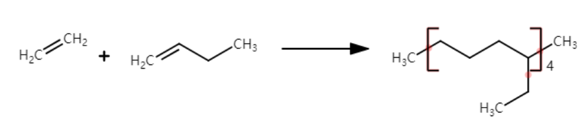

乙烯与1-丁烯加聚物，侧基与乙烯单体相同，于是称支链

##### 支化程度的表征：

- 单位体积内的支化点数或两个相邻支化点间的平均分子量
- 用具有相同分子量的支化高分子同线型高分子的平均分子尺寸之比来评价支化程度的大小

- 支化程度越高，支链结构越复杂，则影响越大（==对力学性能，尤其是拉伸性能的影响==）。无规支化往往降低高聚物膜的拉伸度。以无规支化高分子制成的橡胶，其抗张强度和伸长率均不及线型分子制成的橡胶

#### 交联

- 适度交联：交联点之间的链段（网链）足够长
  - 硫化橡胶、辐射交联聚烯烃
- 高密度交联：交联点之间仅有几个化学键
  - 热固性树脂（C阶）：环氧、脲醛、酚醛、蜜胺甲醛
- 交联度：单位体积内交联点的数目

### 键接结构

- 头头连接：-HT-TH-HT-TH-HT-TH …

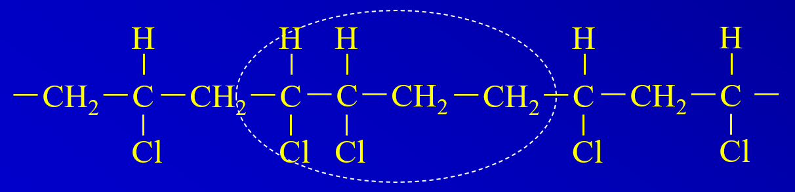

- 无规连接
- 头尾连接（==最常见==）：-HT-HT-HT-HT-HT-HT…

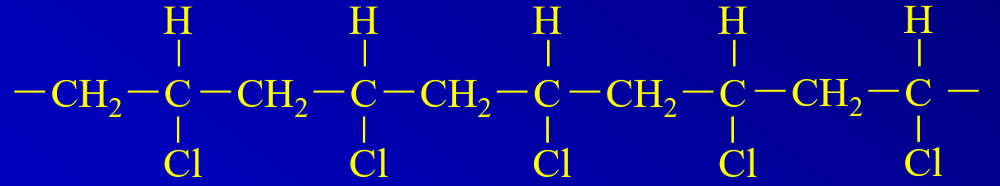

- 聚双烯的加聚方式（可能有顺反异构、旋光异构）：
  - 1，2-加聚
  - 1，4-加聚
  - 3，4-加聚

### 构型：由化学键固定的原子在空间的相对位置

- 几何异构（顺反异构）：内双键上的基团在双键两侧排列方式不同而引起的异构

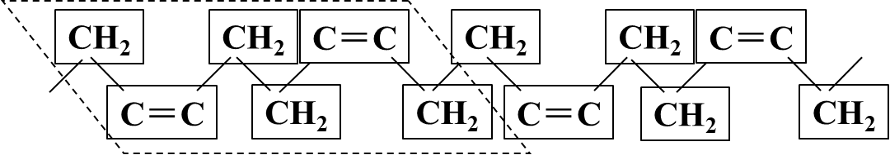

两种聚丁二烯的==重复周期==分别为0.816nm和0.48nm，顺式结构在室温下是一种弹性很好的橡胶，而反式结构重复周期小，容易结晶，在室温下是一种弹性很差的塑料 

|                       顺式结构                       | 反式结构                                               |
| :--------------------------------------------------: | ------------------------------------------------------ |
| 分子链柔顺、无序、低结晶 → **熵弹性主导** → 橡胶特性 | 分子链刚性、规整、高结晶 → **塑性形变主导** → 塑料特性 |

- 旋光异构：手性碳原子引起的异构现象，多数聚合物中的不对称碳是==聚合过程中形成的==，对应全同、间同、无规这==3种==

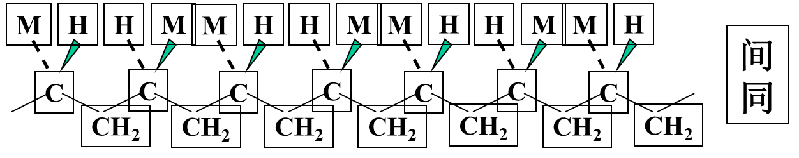

|      | 密度      | 结晶度    | 熔点 | 弯曲模量 |
| ---- | --------- | --------- | ---- | :------: |
| 全同 | 0.90-0.91 | 50-70 %   | 459  |   1389   |
| 间同 | 0.87-0.89 | 21-29%    | 429  |   600    |
| 无规 | 0.85-0.86 | 很低5-10% |      |          |

- 规整性：链节序列化学组成和/或立体结构的规律性
  - 化学规整性
  - 立构规整性
- 规整度（tacticity）——$\dfrac{全同立构异构体+间同立构异构体}{异构体总数}$

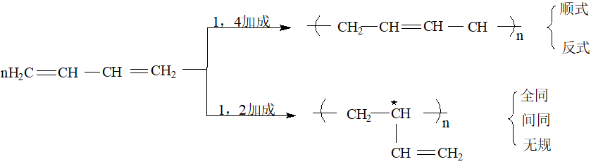

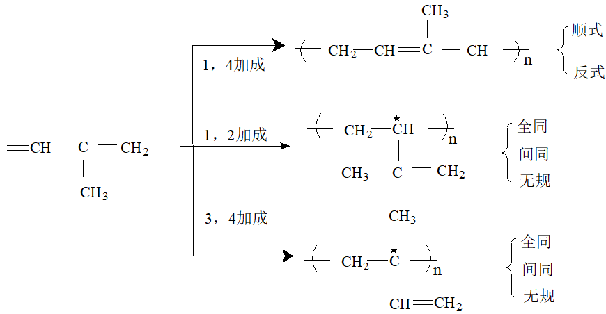

### 共聚物序列结构

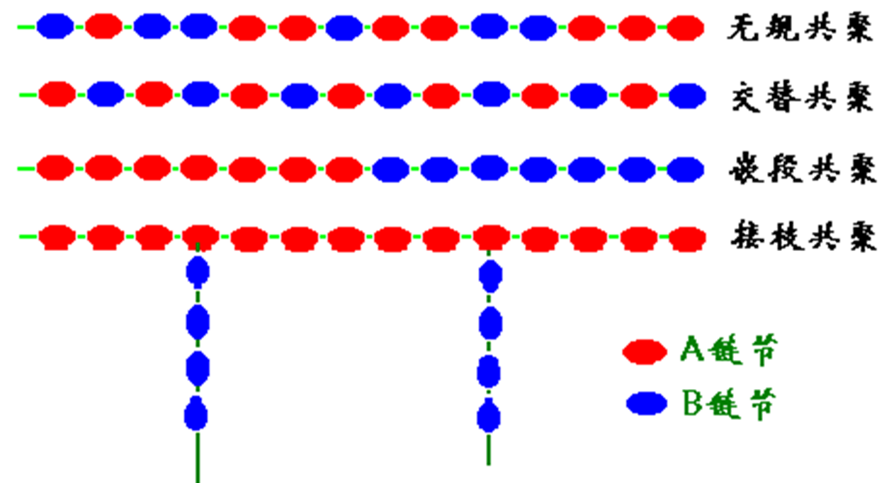

以苯乙烯+丁二烯的共聚为例：

- 无规共聚——丁苯橡胶

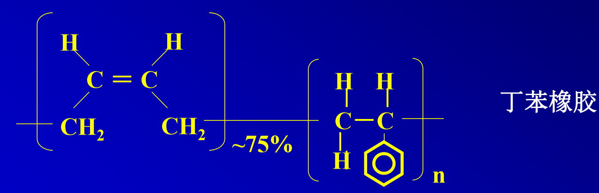

- 嵌段共聚——SBS(Styrene-Butadiene-Styrene Block Copolymer🤗)
  - 弹性
    - 软段的丁二烯是典型的**橡胶分子链**，具有高度的柔顺性和低玻璃化转变温度，$T~g~\approx-80^\circ \rm{C}$
    - 硬段在常温下形成**刚性微区**(**纳米尺度的“团簇”结构**)🤓，分散在PB软段中，作为**物理交联点**
    - **微观相分离的强化**，PS硬段与PB软段因热力学不相容发生**微相分离**，形成“海岛结构”（硬段为“岛”，软段为“海”）
  - 热塑性
    - **高温下交联网络的解离**，**冷却后网络重建**

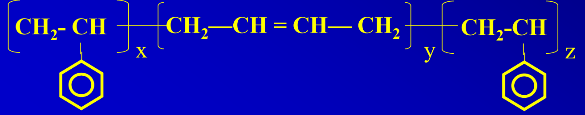

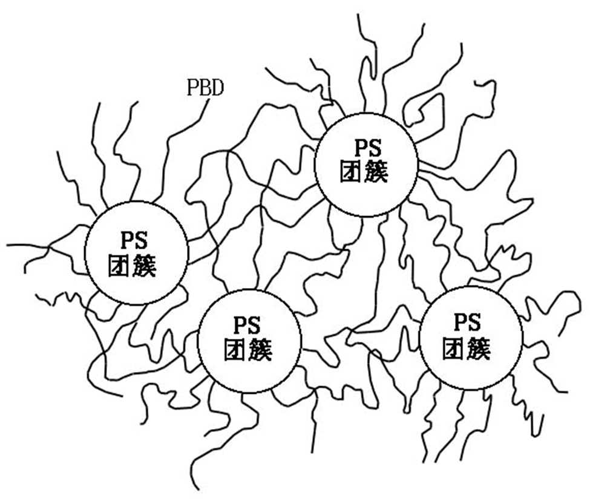

- 交替共聚
  - 要求单体自身聚合速度不能过快，一般较难
  - 苯乙烯单体之间相互疏远，环丁二酸酐之间位阻较大相互原理，苯乙烯和环锭二酸酐相互亲近，有利于交替共聚

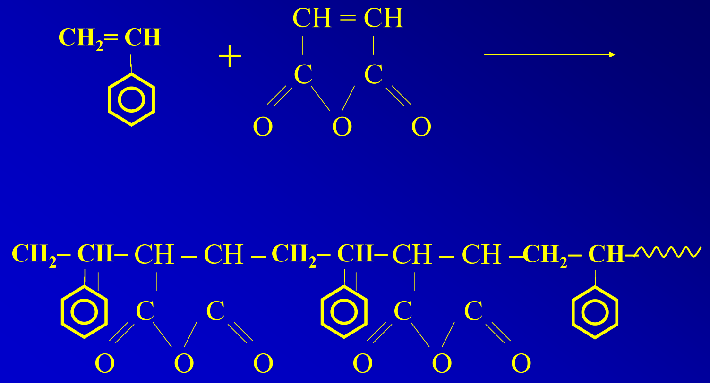

- 接枝共聚——高抗冲聚苯乙烯
  - “掺有丁二烯的聚苯乙烯”
  - 典型的**“海岛”两相结构**，由**刚性聚苯乙烯（PS）连续相**和**分散的橡胶相**（如聚丁二烯橡胶）组成

## 插入：关于链柔性~🤗

单键是由$\sigma$电子组成的，电子云分布是轴对称性的，因此高分子在运动时C-C单键可以绕轴旋转，称为**内旋转**，它是导致高分子链成卷曲构象的根本原因。高分子链能够改变其构象的性质称为高分子链的**柔顺性**。**主链结构、取代基的大小和极性、聚合物的相对分子量、交联度**等因素都对柔顺性有影响。

- 键长越长，柔顺性越好
  - -Si-O->-C-O->-C-C-
- 取代基空阻越小，柔顺性越好
  - PE>PP>PS
- 取代基极性越小，柔顺性越好
  - PE>PP>PVC>PAN

### 分子量😿

分子量的==多分散性==是高分子的鲜明特点  

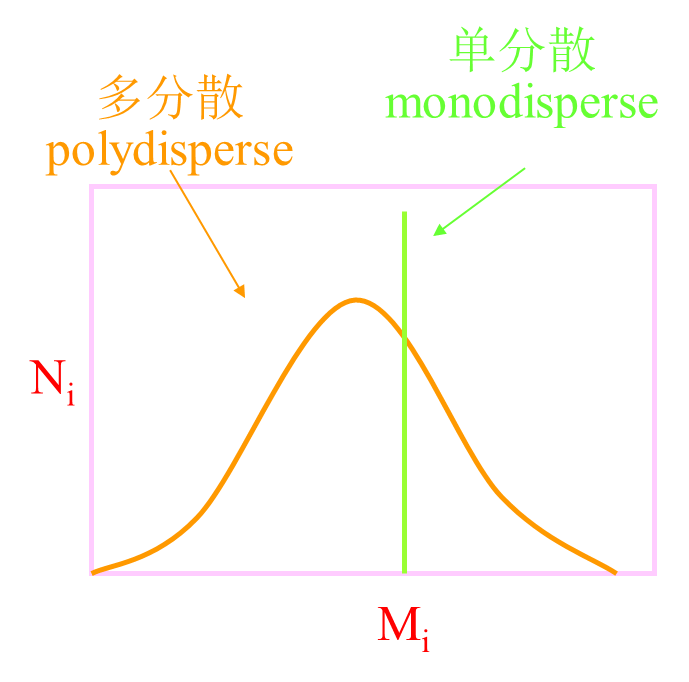

### 数均分子量——用数量平均的分子量

定义数量分数$N_i$
$$
N_i=\dfrac{n_i}{\sum N_i}
$$

$$
<M>_n=\dfrac{n_1M_1+n_2M_2+n_3M_3+…n_iM_i}{n_1+n_2+n_3+…n_i}=\dfrac{\sum_{i}n_iM_i}{\sum_in_i}=\sum_iN_iM_i
$$

### 重均分子量——用重量平均的分子量

定义重量分数$W_i$
$$
W_i=\dfrac{w_i}{\sum w_i}
$$

$$
<M>_w=\dfrac{\sum w_i M_i}{\sum w_i}=\sum W_iM_i
$$
按重量的平均也是==按聚合度的平均，按链接数的平均==
$$
<M>_w=\dfrac{\sum w_iM_i}{\sum w_i}=\dfrac{\sum M_n x_i M_i}{\sum M_n x_i}=\dfrac{\sum x_i M_i}{x_i}
$$
==重均分子量变式==
$$
\begin{array}{l}
\langle M\rangle_{w}=\sum W_{i} M_{i}=\frac{w_{1}}{\sum w_{i}} M_{1}+\frac{w_{2}}{\sum w_{i}} M_{2}+\frac{w_{3}}{\sum w_{i}} M_{3}+\cdots \\
=\frac{n_{1} M_{1}}{\sum w_{i}} M_{1}+\frac{n_{2} M_{2}}{\sum w_{i}} M_{2}+\frac{n_{3} M_{3}}{\sum w_{i}} M_{3}+\cdots \\
=\frac{n_{1} M_{1}^{2}}{\sum w_{i}}+\frac{n_{2} M_{2}^{2}}{\sum w_{i}}+\frac{n_{3} M_{3}^{2}}{\sum w_{i}}+\cdots \\
=\frac{N_{1} M_{1}^{2}+N_{2} M_{2}^{2}+N_{3} M_{3}^{2}+\cdots}{N_{1} M_{1}+N_{2} M_{2}+N_{3} M_{3}+\cdots}=\frac{\sum N_{i} M_{i}^{2}}{\sum N_{i} M_{i}}=\frac{\left\langle M^{2}\right\rangle_{n}}{\langle M\rangle_{n}}
\end{array}
$$
==数均分子量变式==
$$
<M>_n=\dfrac{1}{\sum \frac{W_i}{M_i}}
$$

### Z均分子量

$$
z_i=w_iM_i=n_iM_i
$$

$$
Z_i=\dfrac{z_i}{\sum z_i}=\dfrac{N_iM_i^2}{\sum N_i M_i}
$$

$$
<M>_z=\dfrac{\sum N_i M_i^3}{\sum N_iM_i^2}=\sum Z_i M_i
$$

### 粘均分子量

$$
<M>_{\eta}=(\sum W_i M_i^a)^{\frac{1}{a}}
$$

$$
\begin{array}{ll}
a=1 & <\mathrm{M}>_{\eta}=<\mathrm{M}>_{\mathrm{w}} \\
a=-1 & <\mathrm{M}>_{\eta}=<\mathrm{M}>_{\mathrm{n}}
\end{array}
$$

- 证明：$<M>_w$   >   $<M>_n$ 😢

$$
\sigma^2=\overline{[(M-\overline{M_n})]^2}=\overline{(M^2)_n}-2\overline{M}\overline{M_n}+\overline{(M_n)^2}=\cdots=(\overline{M_n})^2(\dfrac{\overline{M_w}}{\overline{M_n}}-1)
$$

#### 多分散系数：$\dfrac{\overline{M_w}}{\overline{M_n}}$

#### 聚合机理与多分散度

| 聚合机理   | 多分散系数 |
| ---------- | :--------: |
| 天然蛋白质 |    1.0     |
| 阴离子聚合 |  1.02~1.5  |
| 缩合聚合   |  2.0~4.0   |
| 自由基聚合 |  1.5~3.0   |
| 配位聚合   |    2-40    |
| 阳离子聚合 |    很宽    |

### 累计重量分数 I——小于等于该分子量样品的重量分数之和

| **M** | w(重量） | $W_i$ | **I** |
| ----- | -------- | ----- | ----- |
| 5000  | 4        | 0.04  | 0.02  |
| 1万   | 8        | 0.08  | 0.08  |
| 2万   | 14       | 0.14  | 0.19  |
| 5万   | 28       | 0.28  | 0.40  |
| 10万  | 24       | 0.24  | 0.66  |
| 20万  | 12       | 0.12  | 0.84  |
| 50万  | 8        | 0.08  | 0.94  |
| 100万 | 2        | 0.02  | 0.99  |

#### 不同形式的分子量分布表示方式——离散与连续

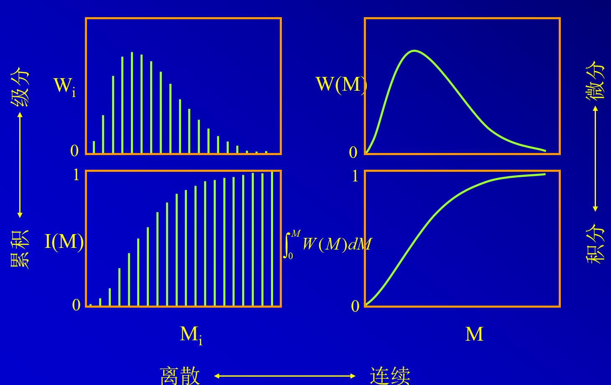

|      |            |                                             |                                                              |
| ---- | ---------- | ------------------------------------------- | ------------------------------------------------------------ |
|      | 数均分子量 | $<M>_n=\sum N_i M_i$                        | $<M>_n=\dfrac{1}{\int_0^{\infty}\frac{W(M)}{M}dM}$           |
|      | 重均分子量 | $<M>_w=\sum W_i M_i$                        | $\left\langle M\right\rangle_w=\underset{0}{\operatorname*{\operatorname*{\overset{\infty}{\operatorname*{\operatorname*{\int}}}}}}M\bullet W(M)dM$ |
|      | Z均分子量  | $<M>_Z=\sum Z_i M_i$                        | $\left< M \right>_{z} = \frac{\int\limits_{0}^{\infty }{N(M)M^{3}dM}}{\int\limits_{0}^{\infty }{N(M)M^{2}dM}} = \frac{\int\limits_{0}^{\infty }{W(M)M^{2}dM}}{\int\limits_{0}^{\infty }{W(M)MdM}}$ |
|      | 粘均分子量 | $<M>_{\eta}=\sum (W_i M_i^a)^{\frac{1}{a}}$ | $<M>_{\eta}=[\int_0^{\infty}W(M)M^a dM]^{\frac{1}{a}}$       |

## 链柔性

空间异构体：同种分子链的不同构象

- 形成不同构象的原因：内旋

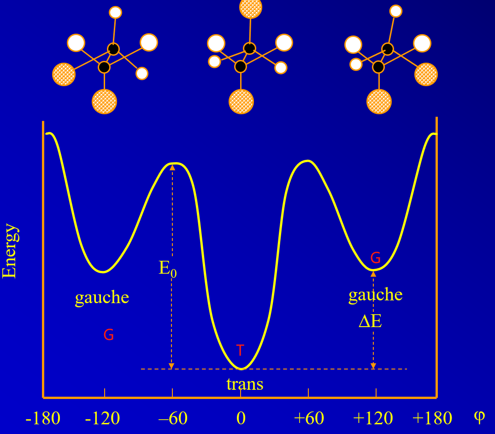

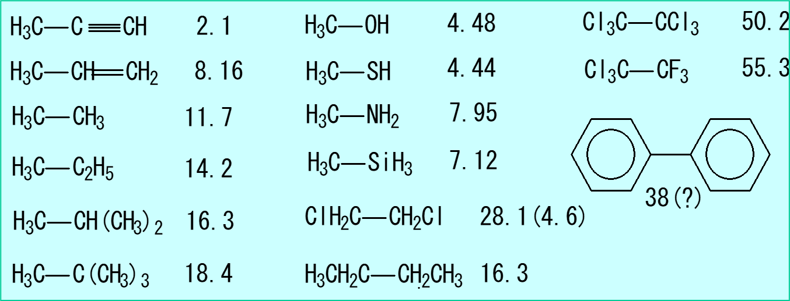

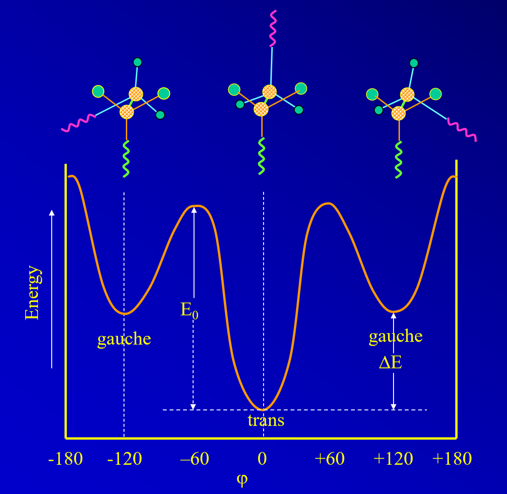

### **Flory内旋异构近似**

聚合物分子的每个链节只能处于三个能量极小值的状态，忽略了无数中间非稳态的存在，**所谓构象只是在T 与G之间的变换**

构象：单键内旋决定的原子相对位置

- 单键两侧原子的相对位置（G+，G-，T）
- 分子链上全部原子的相对位置（G和T的组合）

对构象的描述：

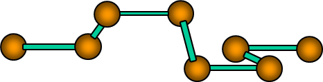

简化后仍有天文数字的构象，每个单键各有T，G+，G-三种可能性，3500个单键的聚乙烯链可有33500=101670个构象

==存在G构象意味着高分子呈现无规线团的形貌==

**聚乙烯最稳定的构象**：1反+2旁（$\rm{t+g^++g^-}$）

如果自由旋转，==高分子链可在这些构象不停地变换==，自由变换的结果：链卷曲。无规线团是高分子链的自然状态（常将无规线团作为无定形态分子链的代名词）

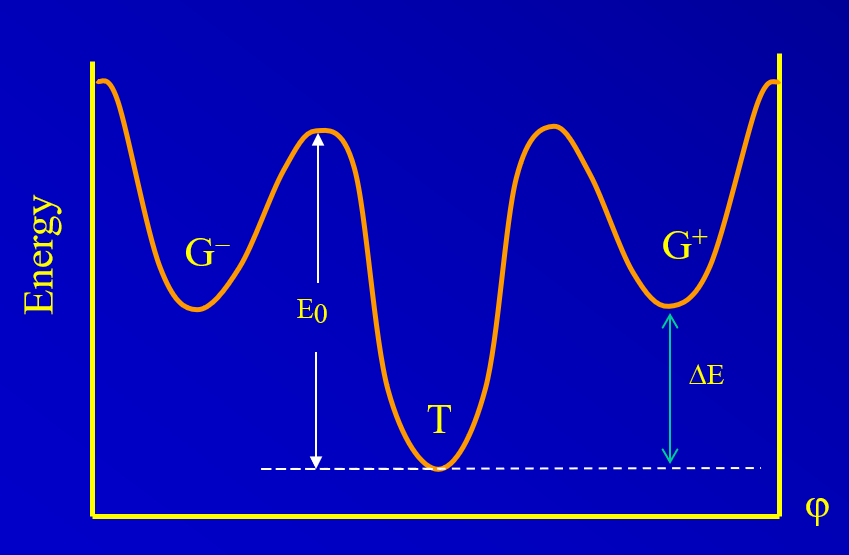

由于构象能的存在，任一时刻，只有部分单键可超越能垒（即可旋转），两旋转的单键之间的一段链僵硬地协同运动

高分子链被旋转单键划分为==链段==

### 链段：高分子链中作协同运动的一段链，是高分子链中的独立运动单元

链段的组成是随机的，长度是随机的，能量不变，链段的平均长度是确定的，取决于$\rm{E_0}$.

### 柔性

- 高分子链中单键内旋的能力
- 高分子链改变构象的能力
- 高分子链中链段的运动能力
- 高分子链自由状态下的卷曲程度

#### 动态柔性（动力学柔性）

高分子从一种稳态构象转变为另一种稳态构象的容易程度。**主要取决于构象能E**

#### 静态柔性（平衡态柔性）

高分子处于较稳定状态构象时分子链的卷曲程度。**主要取决于反式与旁式构象能之差**

### 链柔性的影响因素

- 主链键长、键角（==最根本的因素==）

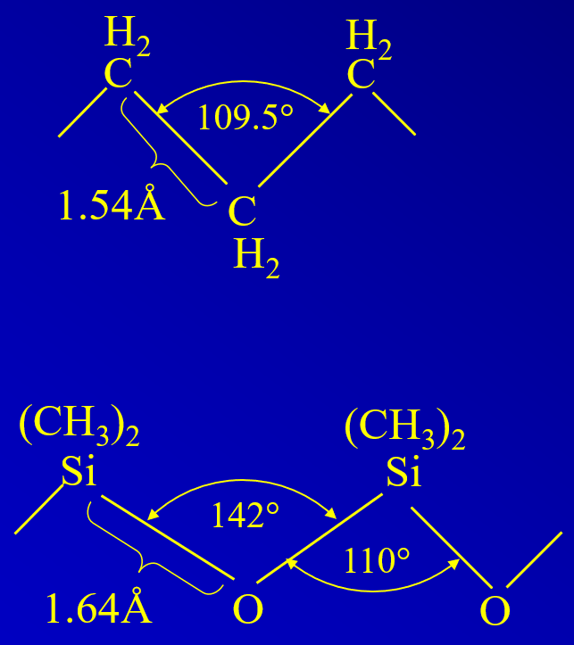

- 取代基越少,柔性越高

- 杂原子提高柔性

  - 柔性：甲硫醇>乙醇>甲胺

- 键角与取代基的综合效应：孤立双键提高柔性

- 共轭双键使柔性丧失

  - 聚乙炔、聚苯

- 主链芳环降低柔性

  - 聚碳酸酯、聚砜

- 主链杂环降低柔性

- 侧基尺寸大，柔性低

- 侧基极性大，柔性低

  - 柔性：聚丁二烯>聚氯丁二烯

- 对称取代柔性更高

  - 柔性：聚氯乙烯>聚偏氯乙烯

- 分子间相互作用降低柔性

- 结晶降低柔性

- 溶剂稀释==提高柔性==

## 末端距、回转半径

==不能确定单一的构象态，只能确定构象的平均态。==

线团尺寸描述方法

- 均方回转半径
  - 分子链处于不断运动之中，对回转半径的描述应取平均值，而由于向量的和为0向量，因此对回转半径的描述取**均方回转半径**

$$
\overline{s^2}=<s^2>=\dfrac{\sum m_is_i^2}{\sum m_i}=\dfrac{\sum s_i^2}{N}
$$

- 均方末端距
  - 柔性大，G构象多，卷曲，末端距小
  - 柔性小，T构象多，伸展，末端距大

同理，对末端距的描述取**均方末端距**
$$
\overline{R^2}=<R^2>=\dfrac{N_1b_1^2+N_2b_2^2+\dots N_ib_i^2+\dots}{N_1+N_2+\dots+N_i+\dots}=\dfrac{\sum N_ib_i^2}{\sum N_i}
$$
**两种平均之间的关系如下，可严格证明**
$$
\overline{s^2}=\dfrac{\overline{R^2}}{6}
$$

### 高分子链的几种模型

#### 自由连接链——高分子链由N个长度为b的链节组成，任意键角，自由旋转

将每个单键定义为由首端指向末端的矢量为末端(距)矢量，末端矢量等于单键矢量之和  

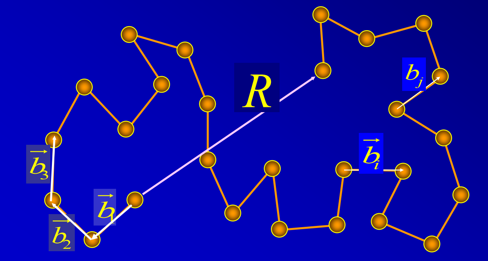
$$
<R^2>_{f,j}=Nb^2
$$

#### 自由旋转链——高分子链由N个长度为b的链节组成，固定键角，自由旋转

$\theta$为键角的补角
$$
<R^2>_{f,r}=Nb^2\dfrac{1=\cos \theta}{1-\cos \theta}
$$

#### 受阻旋转链——高分子链由N个长度为b的链节组成，固定键角，受阻旋转

$\theta$为键角的补角
$$
<R^2>_{h,r}=Nb^2\dfrac{1+\cos \theta}{1-\cos \theta}\cdot\dfrac{1+<\cos \varphi>}{1-<\cos \varphi>}
$$
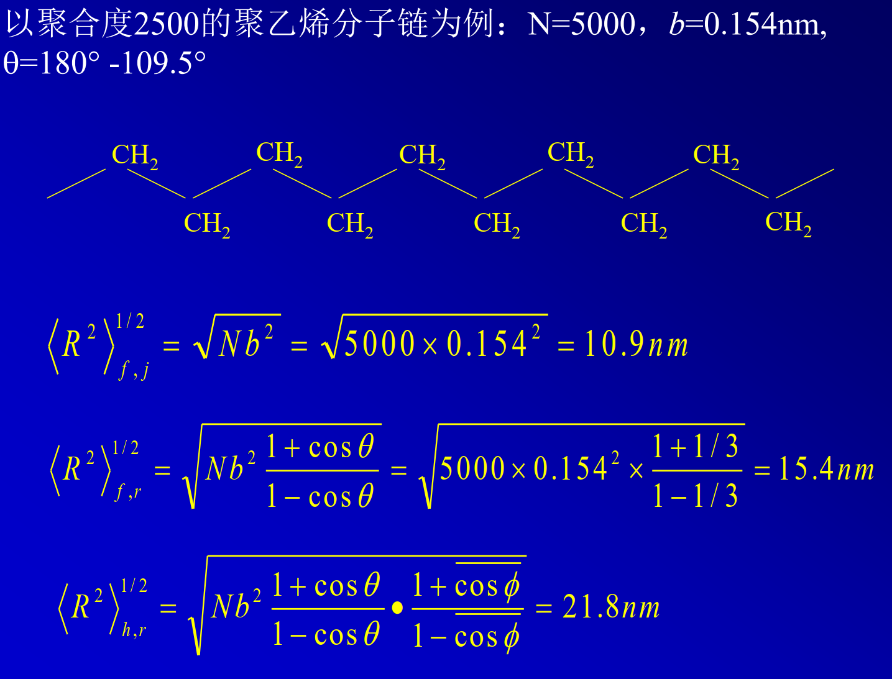

#### 等效自由连接链

把 g 个相邻接的化学键组成的一段链作为一个独立的取向单元，称之为统计链段或等效链段（简称链段），则一条高分子链可作为由若干等效链段自由连结起来的等效链，称为等效自由连结链
$$
<R^2>_{f,j}=Nb^2
$$

$$
<R^2>_0=N_eb_e^2
$$

$$
R_{max}=N_eb_e
$$

#### 无扰链——只受近程作用而不受远程作用的链称为无扰链  

$$
<R^2>_0=C_nNb^2
$$

### Flory极限特征比

$$
C_n=\dfrac{<R^2>_0}{Nb^2}
$$

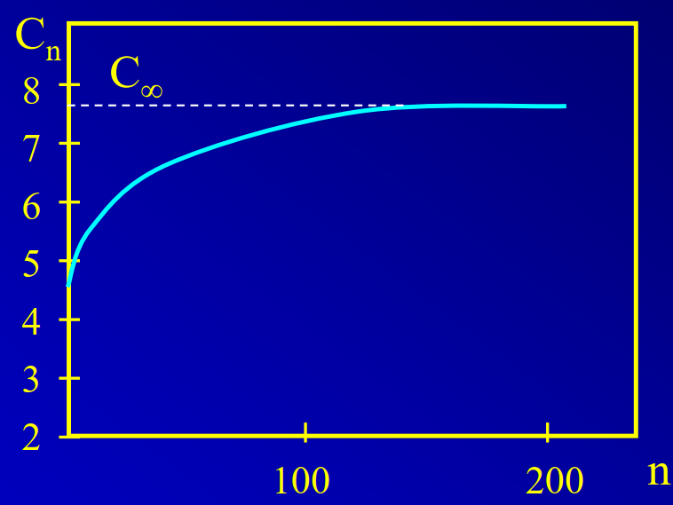

$C_n$不是一个常数，其值随分子量的增大趋近一个渐近值$C_{\infty}$

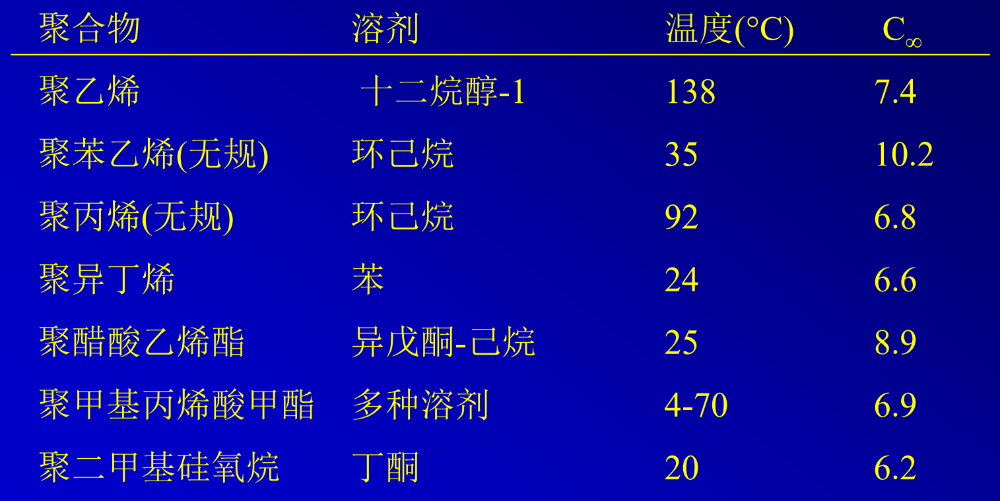 

==Flory极限特征比是溶剂和温度的函数==

### 柔性的其他评价——刚性因子

==均方根末端距实测值与自由旋转链的均方根末端距之比==可作为刚性因子
$$
\sigma=\sqrt{\dfrac{<R^2>_0}{<R^2>_{f,r}}}=\sqrt{\dfrac{<S^2>_0}{<S^2>_{f,r}}}
$$
小结——==链柔性的评价==

- 刚性因子——越小柔性越好

$$
\sigma=\sqrt{\dfrac{<R^2>_0}{<R^2>_{f,r}}}=\sqrt{\dfrac{<S^2>_0}{<S^2>_{f,r}}}
$$

- Flory极限特征比——越小柔性越好

$$
C_n=\dfrac{<R^2>_0}{Nb^2}
$$

- 统计链段长度——越小柔性越好

$$
A=\sqrt{\dfrac{<R^2>_0}{<M>}}\propto\sqrt{\dfrac{N_eb_e^2}{N_e}}
$$

## 末端分布函数

## 一些习题罢😭

- 如果不考虑键接顺序，线形聚异戊二烯的异构体有
  几种？分别是什么？
  - 8种，3+3+2
- 高密度聚乙烯和低密度聚乙烯在分子链上的主要差
  别是什么？比较其密度、熔点、结晶度的大小。
  - 支化链数目的多少，HDPE规整性好，结晶度高，熔点高，密度大
- 下列聚合物中，不存在旋光异构体的是（）。
  （a） PP （b） PIB （c）聚异戊二烯
  - b，两个相同甲基，无手性碳
- 下列不能作为塑料使用的有（）
  （a）全同聚1,2-丁二烯 （b）全同聚1,2-丁二烯
  （c）顺式聚1,4-丁二烯 （d）反式聚1,4-丁二烯
  
  - c，重复周期长，不易结晶，具有橡胶弹性，是天然橡胶
  
- 全同聚乙烯醇的取代基-OH能形成分子内氢键，因而与聚$\alpha$-烯烃不同，聚乙烯醇不形成**螺旋链**，而形成**平面锯齿链构象**

- 下列聚合物中，熔点最高的是（）

  （a）聚乙烯（b）聚对二甲苯撑（c）聚苯撑

  - c

- （a）聚氯乙烯（b）1，4-聚 2-氯丁二烯（c）1，4-聚丁二烯

  - （c）>（b）>（a）

